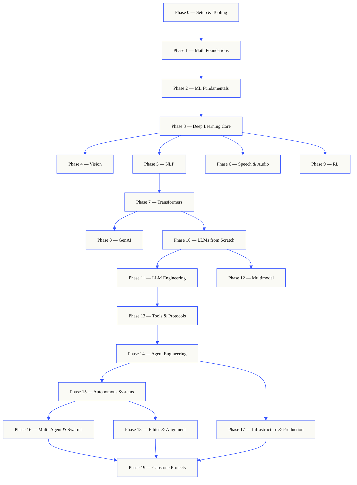
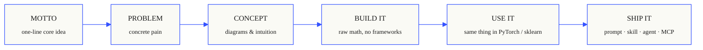

<!-- Bản dịch tiếng Việt; giữ nguyên thuật ngữ kỹ thuật, code, công thức, lệnh và URL. -->

<p align="center">
  
</p>

<!-- Languages -->
<p align="center"><strong>Tiếng Việt</strong> · <a href="README.md">English</a></p>

<p align="center">
<a href="LICENSE"></a>
<a href="ROADMAP.md"></a>
<a href="#contents"></a>
<a href="https://github.com/rohitg00/ai-engineering-from-scratch/stargazers"></a>
<a href="https://aiengineeringfromscratch.com"></a>
</p>

## Từ người tạo ra [Agent Memory - #1 Persistent memory ⭐](https://github.com/rohitg00/agentmemory) <a href="https://github.com/rohitg00/agentmemory/stargazers"></a> hoạt động tự nhiên với bất kỳ agents hoặc trợ lý trò chuyện nào.

```
░░░▒▒▒░░░▒▒▒░░░▒▒▒░░░▒▒▒░░░▒▒▒░░░▒▒▒░░░▒▒▒░░░▒▒▒░░░▒▒▒░░░▒▒▒░░░▒▒▒░░░▒▒▒░░░▒▒▒░░░▒▒▒░░░▒▒▒
```

> **84% sinh viên đã sử dụng các công cụ AI. Chỉ 18% cảm thấy sẵn sàng sử dụng chúng
> về mặt chuyên môn.** Giáo trình này thu hẹp khoảng cách đó.
>
> 503 bài học. 20 giai đoạn. ~320 giờ. Python, TypeScript, Rust, Julia. Mỗi bài học đều cung cấp
> một artifact có thể tái sử dụng: một prompt, một skill, một agent, một MCP server. Miễn phí, mã nguồn mở, MIT.
>
> Bạn không chỉ học AI. Bạn xây dựng nó. Từ đầu đến cuối. Bằng tay.

<!-- STATS:START (generated from site/stats.json by build.js — do not edit by hand) -->
<p align="center"><sub><b>150.639</b> độc giả ·&nbsp; <b>241.669</b> lượt xem trang trong 30 ngày qua ·&nbsp; tính đến ngày 07/06/2026</sub></p>
<!-- STATS:END -->

## Cách hoạt động

Hầu hết các tài liệu AI dạy rải rác. Một bài báo ở đây, một bài đăng fine-tuning ở đó, một
agent demo hào nhoáng ở một nơi khác. Những mảnh kiến thức này hiếm khi kết nối với nhau. Bạn ship chatbot nhưng không thể
giải thích đường cong loss của nó. Bạn hook một hàm cho một agent nhưng không thể nói attention làm gì
bên trong model gọi nó.

Giáo trình này là xương sống. 20 giai đoạn, 503 bài học, bốn ngôn ngữ: Python, TypeScript,
Rust, Julia. Đại số tuyến tính ở một đầu, swarms tự trị ở đầu kia. Mọi thuật toán
được xây dựng từ toán học cơ bản trước. Backprop. Tokenizer. Attention. Agent loop. Vào thời điểm
PyTorch xuất hiện, bạn đã biết nó đang làm gì.

Mỗi bài học chạy cùng một vòng lặp: đọc bài toán, suy ra toán học, viết mã, chạy
kiểm tra, giữ artifact. Không có video dài năm phút, không triển khai sao chép-dán, không cần cầm tay.
Miễn phí, mã nguồn mở và được xây dựng để chạy trên máy tính xách tay của riêng bạn.

```
░░░▒▒▒░░░▒▒▒░░░▒▒▒░░░▒▒▒░░░▒▒▒░░░▒▒▒░░░▒▒▒░░░▒▒▒░░░▒▒▒░░░▒▒▒░░░▒▒▒░░░▒▒▒░░░▒▒▒░░░▒▒▒░░░▒▒▒
```

## Cấu trúc giáo trình

Hai mươi giai đoạn stack chồng lên nhau. Toán học là sàn nhà. Agents và production là mái nhà.
Bỏ qua nếu bạn đã biết các lớp thấp hơn, nhưng đừng bỏ qua và sau đó tự hỏi tại sao một cái gì đó ở
Đỉnh đang bị vỡ.



```
░░░▒▒▒░░░▒▒▒░░░▒▒▒░░░▒▒▒░░░▒▒▒░░░▒▒▒░░░▒▒▒░░░▒▒▒░░░▒▒▒░░░▒▒▒░░░▒▒▒░░░▒▒▒░░░▒▒▒░░░▒▒▒░░░▒▒▒
```

## Cấu trúc một bài học

Mỗi bài học nằm trong thư mục riêng của nó, với cùng một cấu trúc trên toàn bộ giáo trình:

```
phases/<NN>-<phase-name>/<NN>-<lesson-name>/
├── code/      runnable implementations (Python, TypeScript, Rust, Julia)
├── docs/
│   └── en.md  lesson narrative
└── outputs/   prompts, skills, agents, or MCP servers this lesson produces
```

Mỗi bài học theo sáu nhịp. Phân chia *Build It / Use It* là cột sống - bạn thực hiện
thuật toán từ đầu trước, sau đó chạy cùng một thứ thông qua thư viện production. Bạn
Hiểu những gì framework đang làm vì bạn đã tự viết phiên bản nhỏ hơn.



## Bắt đầu

Ba cách vào. Chọn một.

**Tùy chọn A - đọc.** Mở bất kỳ bài học nào đã hoàn thành trên
[aiengineeringfromscratch.com](https://aiengineeringfromscratch.com) hoặc mở rộng một giai đoạn trong
[Contents](#contents). Không cần thiết lập, không sao chép.

**Tùy chọn B - sao chép và chạy.**

```bash
git clone https://github.com/rohitg00/ai-engineering-from-scratch.git
cd ai-engineering-from-scratch
python phases/01-math-foundations/01-linear-algebra-intuition/code/vectors.py
```

**Tùy chọn C — tìm cấp độ của bạn *(khuyến nghị)*.** Bỏ qua một cách thông minh. Bên trong Claude, Cursor, Codex, OpenClaw, Hermes hoặc bất kỳ agent nào có giáo trình skills cài đặt:

```bash
/find-your-level
```

Mười câu hỏi. Lập bản đồ kiến thức của bạn đến giai đoạn bắt đầu, xây dựng con đường được cá nhân hóa theo giờ
ước tính. Sau mỗi giai đoạn:

```bash
/check-understanding 3        # quiz yourself on phase 3
ls phases/03-deep-learning-core/05-loss-functions/outputs/
# ├── prompt-loss-function-selector.md
# └── prompt-loss-debugger.md
```

### Điều kiện tiên quyết

- Bạn có thể viết mã (bất kỳ ngôn ngữ nào; Python giúp).
- Bạn muốn hiểu AI **thực sự hoạt động như thế nào**, không chỉ gọi cho APIs.

### Tích hợp agent skills (Claude, Cursor, Codex, OpenClaw, Hermes)

| Skill | Chức năng |
|---|---|
| [`/find-your-level`](.claude/skills/find-your-level/SKILL.md) | Câu đố xếp lớp mười câu hỏi. Lập bản đồ kiến thức của bạn đến giai đoạn bắt đầu và tạo ra một lộ trình được cá nhân hóa với ước tính giờ. |
| [`/check-understanding <phase>`](.claude/skills/check-understanding/SKILL.md) | Bài kiểm tra mỗi giai đoạn, tám câu hỏi, với phản hồi và các bài học cụ thể để xem lại. |

```
░░░▒▒▒░░░▒▒▒░░░▒▒▒░░░▒▒▒░░░▒▒▒░░░▒▒▒░░░▒▒▒░░░▒▒▒░░░▒▒▒░░░▒▒▒░░░▒▒▒░░░▒▒▒░░░▒▒▒░░░▒▒▒░░░▒▒▒
```

## Mỗi bài học đều cung cấp một sản phẩm

Các giáo trình khác kết thúc bằng *"chúc mừng, bạn đã học X." * Mỗi bài học ở đây kết thúc bằng một
**Công cụ có thể tái sử dụng** bạn có thể cài đặt hoặc dán vào quy trình làm việc hàng ngày của mình.

<table>
<tr>
<th align="left" width="25%"><br/><sub>FIG_001 · Một</sub><br/><b>PROMPTS</b></th>
<th align="left" width="25%"><br/><sub>FIG_001 · B</sub><br/><b>SKILLS</b></th>
<th align="left" width="25%"><br/><sub>FIG_001 · C</sub><br/><b>AGENTS</b></th>
<th align="left" width="25%"><br/><sub>FIG_001 · D</sub><br/><b>MCP SERVERS</b></th>
</tr>
<tr>
<td valign="top">Dán vào bất kỳ trợ lý AI nào để được trợ giúp cấp chuyên gia về một nhiệm vụ hẹp.</td>
<td valign="top">Thả vào Claude, Con trỏ, Codex, OpenClaw, Hermes hoặc bất kỳ agent nào đọc <code>SKILL.md</code>.</td>
<td valign="top">Triển khai dưới dạng workers tự trị — bạn đã tự viết vòng lặp trong Giai đoạn 14.</td>
<td valign="top">Cắm vào bất kỳ ứng dụng khách nào tương thích với MCP. Được xây dựng từ đầu đến cuối trong Giai đoạn 13.</td>
</tr>
</table>

> Cài đặt lô bằng `python3 scripts/install_skills.py`. Công cụ thực sự, không phải bài tập về nhà.
> Vào cuối giáo trình, bạn có một danh mục đầu tư gồm 503 artifacts bạn thực sự
> hiểu vì bạn đã xây dựng chúng.

### FIG_002 · Một mẫu đã làm việc

Giai đoạn 14, bài 1: vòng lặp agent. ~120 dòng Python thuần túy, không phụ thuộc.

<table>
<tr>
<td valign="top" width="50%">

**`code/agent_loop.py`** &nbsp; <sub><i>xây dựng nó</i></sub>

```python
def run(query, tools):
    history = [user(query)]
    for step in range(MAX_STEPS):
        msg = llm(history)
        if msg.tool_calls:
            for call in msg.tool_calls:
                result = tools[call.name](**call.args)
                history.append(tool_result(call.id, result))
            continue
        return msg.content
    raise StepLimitExceeded
```

</td>
<td valign="top" width="50%">

**`outputs/skill-agent-loop.md`** &nbsp; <sub><i>ship nó</i></sub>

```markdown
---
name: agent-loop
description: ReAct-style loop for any tool list
phase: 14
lesson: 01
---

Implement a minimal agent loop that...
```

**`outputs/prompt-debug-agent.md`**

```markdown
You are an agent debugger. Given the trace
of an agent run, identify the step where
the agent went wrong and explain why...
```

</td>
</tr>
</table>

```
░░░▒▒▒░░░▒▒▒░░░▒▒▒░░░▒▒▒░░░▒▒▒░░░▒▒▒░░░▒▒▒░░░▒▒▒░░░▒▒▒░░░▒▒▒░░░▒▒▒░░░▒▒▒░░░▒▒▒░░░▒▒▒░░░▒▒▒
```

<a id="nội dung"></a>

<a id="contents"></a>

## Nội dung

Hai mươi giai đoạn. Nhấp vào bất kỳ giai đoạn nào để mở rộng danh sách bài học của giai đoạn đó.

<a id="phase-0"></a>
### Giai đoạn 0: Thiết lập & `12 lessons` dụng cụ
> Chuẩn bị sẵn sàng cho môi trường của bạn cho mọi thứ tiếp theo.

| # | Bài học | Kiểu | Lang |
|:---:|--------|:----:|------|
| 01 | [Dev Environment](phases/00-setup-and-tooling/01-dev-environment/) | Xây dựng | Python |
| 02 | [Git & Collaboration](phases/00-setup-and-tooling/02-git-and-collaboration/) | Tìm hiểu | — |
| 03 | [GPU Setup & Cloud](phases/00-setup-and-tooling/03-gpu-setup-and-cloud/) | Xây dựng | Python |
| 04 | [APIs & Keys](phases/00-setup-and-tooling/04-apis-and-keys/) | Xây dựng | Python |
| 05 | [Jupyter Notebooks](phases/00-setup-and-tooling/05-jupyter-notebooks/) | Xây dựng | Python |
| 06 | [Python Environments](phases/00-setup-and-tooling/06-python-environments/) | Xây dựng | Vỏ |
| 07 | [Docker for AI](phases/00-setup-and-tooling/07-docker-for-ai/) | Xây dựng | Docker |
| 08 | [Editor Setup](phases/00-setup-and-tooling/08-editor-setup/) | Xây dựng | — |
| 09 | [Data Management](phases/00-setup-and-tooling/09-data-management/) | Xây dựng | Python |
| 10 | [Terminal & Shell](phases/00-setup-and-tooling/10-terminal-and-shell/) | Tìm hiểu | — |
| 11 | [Linux for AI](phases/00-setup-and-tooling/11-linux-for-ai/) | Tìm hiểu | — |
| 12 | [Debugging & Profiling](phases/00-setup-and-tooling/12-debugging-and-profiling/) | Xây dựng | Python |

<details id="phase-1">
<summary><b>Giai đoạn 1 - Nền tảng</b> &nbsp;toán học <code>22 bài học</code>&nbsp; <em>Trực giác đằng sau mỗi thuật toán AI, thông qua mã.</em></summary>
<br/>

| # | Bài học | Kiểu | Lang |
|:---:|--------|:----:|------|
| 01 | [Linear Algebra Intuition](phases/01-math-foundations/01-linear-algebra-intuition/) | Tìm hiểu | Python, Julia |
| 02 | [Vectors, Matrices & Operations](phases/01-math-foundations/02-vectors-matrices-operations/) | Xây dựng | Python, Julia |
| 03 | [Matrix Transformations & Eigenvalues](phases/01-math-foundations/03-matrix-transformations/) | Xây dựng | Python, Julia |
| 04 | [Calculus for ML: Derivatives & Gradients](phases/01-math-foundations/04-calculus-for-ml/) | Tìm hiểu | Python |
| 05 | [Chain Rule & Automatic Differentiation](phases/01-math-foundations/05-chain-rule-and-autodiff/) | Xây dựng | Python |
| 06 | [Probability & Distributions](phases/01-math-foundations/06-probability-and-distributions/) | Tìm hiểu | Python |
| 07 | [Bayes' Theorem & Statistical Thinking](phases/01-math-foundations/07-bayes-theorem/) | Xây dựng | Python |
| 08 | [Optimization: Gradient Descent Family](phases/01-math-foundations/08-optimization/) | Xây dựng | Python |
| 09 | [Information Theory: Entropy, KL Divergence](phases/01-math-foundations/09-information-theory/) | Tìm hiểu | Python |
| 10 | [Dimensionality Reduction: PCA, t-SNE, UMAP](phases/01-math-foundations/10-dimensionality-reduction/) | Xây dựng | Python |
| 11 | [Singular Value Decomposition](phases/01-math-foundations/11-singular-value-decomposition/) | Xây dựng | Python, Julia |
| 12 | [Tensor Operations](phases/01-math-foundations/12-tensor-operations/) | Xây dựng | Python |
| 13 | [Numerical Stability](phases/01-math-foundations/13-numerical-stability/) | Xây dựng | Python |
| 14 | [Norms & Distances](phases/01-math-foundations/14-norms-and-distances/) | Xây dựng | Python |
| 15 | [Statistics for ML](phases/01-math-foundations/15-statistics-for-ml/) | Xây dựng | Python |
| 16 | [Sampling Methods](phases/01-math-foundations/16-sampling-methods/) | Xây dựng | Python |
| 17 | [Linear Systems](phases/01-math-foundations/17-linear-systems/) | Xây dựng | Python |
| 18 | [Convex Optimization](phases/01-math-foundations/18-convex-optimization/) | Xây dựng | Python |
| 19 | [Complex Numbers for AI](phases/01-math-foundations/19-complex-numbers/) | Tìm hiểu | Python |
| 20 | [The Fourier Transform](phases/01-math-foundations/20-fourier-transform/) | Xây dựng | Python |
| 21 | [Graph Theory for ML](phases/01-math-foundations/21-graph-theory/) | Xây dựng | Python |
| 22 | [Stochastic Processes](phases/01-math-foundations/22-stochastic-processes/) | Tìm hiểu | Python |

</details>

<details id="phase-2">
<summary><b>Giai đoạn 2 - ML Nguyên tắc cơ bản</b> &nbsp;<code>18 bài học</code>&nbsp; <em>ML cổ điển - vẫn là xương sống của hầu hết các production AI.</em></summary>
<br/>

| # | Bài học | Kiểu | Lang |
|:---:|--------|:----:|------|
| 01 | [What Is Machine Learning](phases/02-ml-fundamentals/01-what-is-machine-learning/) | Tìm hiểu | Python |
| 02 | [Linear Regression from Scratch](phases/02-ml-fundamentals/02-linear-regression/) | Xây dựng | Python |
| 03 | [Logistic Regression & Classification](phases/02-ml-fundamentals/03-logistic-regression/) | Xây dựng | Python |
| 04 | [Decision Trees & Random Forests](phases/02-ml-fundamentals/04-decision-trees/) | Xây dựng | Python |
| 05 | [Support Vector Machines](phases/02-ml-fundamentals/05-support-vector-machines/) | Xây dựng | Python |
| 06 | [KNN & Distance Metrics](phases/02-ml-fundamentals/06-knn-and-distances/) | Xây dựng | Python |
| 07 | [Unsupervised Learning: K-Means, DBSCAN](phases/02-ml-fundamentals/07-unsupervised-learning/) | Xây dựng | Python |
| 08 | [Feature Engineering & Selection](phases/02-ml-fundamentals/08-feature-engineering/) | Xây dựng | Python |
| 09 | [Model Evaluation: Metrics, Cross-Validation](phases/02-ml-fundamentals/09-model-evaluation/) | Xây dựng | Python |
| 10 | [Bias, Variance & the Learning Curve](phases/02-ml-fundamentals/10-bias-variance/) | Tìm hiểu | Python |
| 11 | [Ensemble Methods: Boosting, Bagging, Stacking](phases/02-ml-fundamentals/11-ensemble-methods/) | Xây dựng | Python |
| 12 | [Hyperparameter Tuning](phases/02-ml-fundamentals/12-hyperparameter-tuning/) | Xây dựng | Python |
| 13 | [ML Pipelines & Experiment Tracking](phases/02-ml-fundamentals/13-ml-pipelines/) | Xây dựng | Python |
| 14 | [Naive Bayes](phases/02-ml-fundamentals/14-naive-bayes/) | Xây dựng | Python |
| 15 | [Time Series Fundamentals](phases/02-ml-fundamentals/15-time-series/) | Xây dựng | Python |
| 16 | [Anomaly Detection](phases/02-ml-fundamentals/16-anomaly-detection/) | Xây dựng | Python |
| 17 | [Handling Imbalanced Data](phases/02-ml-fundamentals/17-imbalanced-data/) | Xây dựng | Python |
| 18 | [Feature Selection](phases/02-ml-fundamentals/18-feature-selection/) | Xây dựng | Python |

</details>

<details id="phase-3">
<summary><b>Giai đoạn 3 - Deep Learning Core</b> &nbsp;<code>13 bài học</code>&nbsp; <em>Mạng nơ-ron từ các nguyên tắc đầu tiên. Không frameworks cho đến khi bạn xây dựng một cái.</em></summary>
<br/>

| # | Bài học | Kiểu | Lang |
|:---:|--------|:----:|------|
| 01 | [The Perceptron: Where It All Started](phases/03-deep-learning-core/01-the-perceptron/) | Xây dựng | Python |
| 02 | [Multi-Layer Networks & Forward Pass](phases/03-deep-learning-core/02-multi-layer-networks/) | Xây dựng | Python |
| 03 | [Backpropagation from Scratch](phases/03-deep-learning-core/03-backpropagation/) | Xây dựng | Python |
| 04 | [Activation Functions: ReLU, Sigmoid, GELU & Why](phases/03-deep-learning-core/04-activation-functions/) | Xây dựng | Python |
| 05 | [Loss Functions: MSE, Cross-Entropy, Contrastive](phases/03-deep-learning-core/05-loss-functions/) | Xây dựng | Python |
| 06 | [Optimizers: SGD, Momentum, Adam, AdamW](phases/03-deep-learning-core/06-optimizers/) | Xây dựng | Python |
| 07 | [Regularization: Dropout, Weight Decay, BatchNorm](phases/03-deep-learning-core/07-regularization/) | Xây dựng | Python |
| 08 | [Weight Initialization & Training Stability](phases/03-deep-learning-core/08-weight-initialization/) | Xây dựng | Python |
| 09 | [Learning Rate Schedules & Warmup](phases/03-deep-learning-core/09-learning-rate-schedules/) | Xây dựng | Python |
| 10 | [Build Your Own Mini Framework](phases/03-deep-learning-core/10-mini-framework/) | Xây dựng | Python |
| 11 | [Introduction to PyTorch](phases/03-deep-learning-core/11-intro-to-pytorch/) | Xây dựng | Python |
| 12 | [Introduction to JAX](phases/03-deep-learning-core/12-intro-to-jax/) | Xây dựng | Python |
| 13 | [Debugging Neural Networks](phases/03-deep-learning-core/13-debugging-neural-networks/) | Xây dựng | Python |

</details>

<details id="phase-4">
<summary><b>Giai đoạn 4 - Thị giác</b> &nbsp;máy tính <code>28 bài học</code>&nbsp; <em>Từ pixel đến hiểu biết - hình ảnh, video, 3D, VLMs và models thế giới.</em></summary>
<br/>

| # | Bài học | Kiểu | Lang |
|:---:|--------|:----:|------|
| 01 | [Image Fundamentals: Pixels, Channels, Color Spaces](phases/04-computer-vision/01-image-fundamentals/) | Tìm hiểu | Python |
| 02 | [Convolutions from Scratch](phases/04-computer-vision/02-convolutions-from-scratch/) | Xây dựng | Python |
| 03 | [CNNs: LeNet to ResNet](phases/04-computer-vision/03-cnns-lenet-to-resnet/) | Xây dựng | Python |
| 04 | [Image Classification](phases/04-computer-vision/04-image-classification/) | Xây dựng | Python |
| 05 | [Transfer Learning & Fine-Tuning](phases/04-computer-vision/05-transfer-learning/) | Xây dựng | Python |
| 06 | [Object Detection — YOLO from Scratch](phases/04-computer-vision/06-object-detection-yolo/) | Xây dựng | Python |
| 07 | [Semantic Segmentation — U-Net](phases/04-computer-vision/07-semantic-segmentation-unet/) | Xây dựng | Python |
| 08 | [Instance Segmentation — Mask R-CNN](phases/04-computer-vision/08-instance-segmentation-mask-rcnn/) | Xây dựng | Python |
| 09 | [Image Generation — GANs](phases/04-computer-vision/09-image-generation-gans/) | Xây dựng | Python |
| 10 | [Image Generation — Diffusion Models](phases/04-computer-vision/10-image-generation-diffusion/) | Xây dựng | Python |
| 11 | [Stable Diffusion — Architecture & Fine-Tuning](phases/04-computer-vision/11-stable-diffusion/) | Xây dựng | Python |
| 12 | [Video Understanding — Temporal Modeling](phases/04-computer-vision/12-video-understanding/) | Xây dựng | Python |
| 13 | [3D Vision: Point Clouds, NeRFs](phases/04-computer-vision/13-3d-vision-nerf/) | Xây dựng | Python |
| 14 | [Vision Transformers (ViT)](phases/04-computer-vision/14-vision-transformers/) | Xây dựng | Python |
| 15 | [Real-Time Vision: Edge Deployment](phases/04-computer-vision/15-real-time-edge/) | Xây dựng | Python |
| 16 | [Build a Complete Vision Pipeline](phases/04-computer-vision/16-vision-pipeline-capstone/) | Xây dựng | Python |
| 17 | [Self-Supervised Vision — SimCLR, DINO, MAE](phases/04-computer-vision/17-self-supervised-vision/) | Xây dựng | Python |
| 18 | [Open-Vocabulary Vision — CLIP](phases/04-computer-vision/18-open-vocab-clip/) | Xây dựng | Python |
| 19 | [OCR & Document Understanding](phases/04-computer-vision/19-ocr-document-understanding/) | Xây dựng | Python |
| 20 | [Image Retrieval & Metric Learning](phases/04-computer-vision/20-image-retrieval-metric/) | Xây dựng | Python |
| 21 | [Keypoint Detection & Pose Estimation](phases/04-computer-vision/21-keypoint-pose/) | Xây dựng | Python |
| 22 | [3D Gaussian Splatting from Scratch](phases/04-computer-vision/22-3d-gaussian-splatting/) | Xây dựng | Python |
| 23 | [Diffusion Transformers & Rectified Flow](phases/04-computer-vision/23-diffusion-transformers-rectified-flow/) | Xây dựng | Python |
| 24 | [SAM 3 & Open-Vocabulary Segmentation](phases/04-computer-vision/24-sam3-open-vocab-segmentation/) | Xây dựng | Python |
| 25 | [Vision-Language Models (ViT-MLP-LLM)](phases/04-computer-vision/25-vision-language-models/) | Xây dựng | Python |
| 26 | [Monocular Depth & Geometry Estimation](phases/04-computer-vision/26-monocular-depth/) | Xây dựng | Python |
| 27 | [Multi-Object Tracking & Video Memory](phases/04-computer-vision/27-multi-object-tracking/) | Xây dựng | Python |
| 28 | [World Models & Video Diffusion](phases/04-computer-vision/28-world-models-video-diffusion/) | Xây dựng | Python |

</details>

<details id="phase-5">
<summary><b>Giai đoạn 5 - NLP: Nền tảng đến nâng cao</b> &nbsp;<code>29 bài học</code>&nbsp; <em>Ngôn ngữ là giao diện với trí thông minh.</em></summary>
<br/>

| # | Bài học | Kiểu | Lang |
|:---:|--------|:----:|------|
| 01 | [Text Processing: Tokenization, Stemming, Lemmatization](phases/05-nlp-foundations-to-advanced/01-text-processing/) | Xây dựng | Python |
| 02 | [Bag of Words, TF-IDF & Text Representation](phases/05-nlp-foundations-to-advanced/02-bag-of-words-tfidf/) | Xây dựng | Python |
| 03 | [Word Embeddings: Word2Vec from Scratch](phases/05-nlp-foundations-to-advanced/03-word-embeddings-word2vec/) | Xây dựng | Python |
| 04 | [GloVe, FastText & Subword Embeddings](phases/05-nlp-foundations-to-advanced/04-glove-fasttext-subword/) | Xây dựng | Python |
| 05 | [Sentiment Analysis](phases/05-nlp-foundations-to-advanced/05-sentiment-analysis/) | Xây dựng | Python |
| 06 | [Named Entity Recognition (NER)](phases/05-nlp-foundations-to-advanced/06-named-entity-recognition/) | Xây dựng | Python |
| 07 | [POS Tagging & Syntactic Parsing](phases/05-nlp-foundations-to-advanced/07-pos-tagging-parsing/) | Xây dựng | Python |
| 08 | [Text Classification — CNNs & RNNs for Text](phases/05-nlp-foundations-to-advanced/08-cnns-rnns-for-text/) | Xây dựng | Python |
| 09 | [Sequence-to-Sequence Models](phases/05-nlp-foundations-to-advanced/09-sequence-to-sequence/) | Xây dựng | Python |
| 10 | [Attention Mechanism — The Breakthrough](phases/05-nlp-foundations-to-advanced/10-attention-mechanism/) | Xây dựng | Python |
| 11 | [Machine Translation](phases/05-nlp-foundations-to-advanced/11-machine-translation/) | Xây dựng | Python |
| 12 | [Text Summarization](phases/05-nlp-foundations-to-advanced/12-text-summarization/) | Xây dựng | Python |
| 13 | [Question Answering Systems](phases/05-nlp-foundations-to-advanced/13-question-answering/) | Xây dựng | Python |
| 14 | [Information Retrieval & Search](phases/05-nlp-foundations-to-advanced/14-information-retrieval-search/) | Xây dựng | Python |
| 15 | [Topic Modeling: LDA, BERTopic](phases/05-nlp-foundations-to-advanced/15-topic-modeling/) | Xây dựng | Python |
| 16 | [Text Generation](phases/05-nlp-foundations-to-advanced/16-text-generation-pre-transformer/) | Xây dựng | Python |
| 17 | [Chatbots: Rule-Based to Neural](phases/05-nlp-foundations-to-advanced/17-chatbots-rule-to-neural/) | Xây dựng | Python |
| 18 | [Multilingual NLP](phases/05-nlp-foundations-to-advanced/18-multilingual-nlp/) | Xây dựng | Python |
| 19 | [Subword Tokenization: BPE, WordPiece, Unigram, SentencePiece](phases/05-nlp-foundations-to-advanced/19-subword-tokenization/) | Tìm hiểu | Python |
| 20 | [Structured Outputs & Constrained Decoding](phases/05-nlp-foundations-to-advanced/20-structured-outputs-constrained-decoding/) | Xây dựng | Python |
| 21 | [NLI & Textual Entailment](phases/05-nlp-foundations-to-advanced/21-nli-textual-entailment/) | Tìm hiểu | Python |
| 22 | [Embedding Models Deep Dive](phases/05-nlp-foundations-to-advanced/22-embedding-models-deep-dive/) | Tìm hiểu | Python |
| 23 | [Chunking Strategies for RAG](phases/05-nlp-foundations-to-advanced/23-chunking-strategies-rag/) | Xây dựng | Python |
| 24 | [Coreference Resolution](phases/05-nlp-foundations-to-advanced/24-coreference-resolution/) | Tìm hiểu | Python |
| 25 | [Entity Linking & Disambiguation](phases/05-nlp-foundations-to-advanced/25-entity-linking/) | Xây dựng | Python |
| 26 | [Relation Extraction & Knowledge Graph Construction](phases/05-nlp-foundations-to-advanced/26-relation-extraction-kg/) | Xây dựng | Python |
| 27 | [LLM Evaluation: RAGAS, DeepEval, G-Eval](phases/05-nlp-foundations-to-advanced/27-llm-evaluation-frameworks/) | Xây dựng | Python |
| 28 | [Long-Context Evaluation: NIAH, RULER, LongBench, MRCR](phases/05-nlp-foundations-to-advanced/28-long-context-evaluation/) | Tìm hiểu | Python |
| 29 | [Dialogue State Tracking](phases/05-nlp-foundations-to-advanced/29-dialogue-state-tracking/) | Xây dựng | Python |

</details>

<details id="phase-6">
<summary><b>Giai đoạn 6 - Giọng nói và Âm thanh</b> &nbsp;<code>17 bài học Nghe</code>&nbsp;<em>, hiểu, nói.</em></summary>
<br/>

| # | Bài học | Kiểu | Lang |
|:---:|--------|:----:|------|
| 01 | [Audio Fundamentals: Waveforms, Sampling, FFT](phases/06-speech-and-audio/01-audio-fundamentals) | Tìm hiểu | Python |
| 02 | [Spectrograms, Mel Scale & Audio Features](phases/06-speech-and-audio/02-spectrograms-mel-features) | Xây dựng | Python |
| 03 | [Audio Classification](phases/06-speech-and-audio/03-audio-classification) | Xây dựng | Python |
| 04 | [Speech Recognition (ASR)](phases/06-speech-and-audio/04-speech-recognition-asr) | Xây dựng | Python |
| 05 | [Whisper: Architecture & Fine-Tuning](phases/06-speech-and-audio/05-whisper-architecture-finetuning) | Xây dựng | Python |
| 06 | [Speaker Recognition & Verification](phases/06-speech-and-audio/06-speaker-recognition-verification) | Xây dựng | Python |
| 07 | [Text-to-Speech (TTS)](phases/06-speech-and-audio/07-text-to-speech) | Xây dựng | Python |
| 08 | [Voice Cloning & Voice Conversion](phases/06-speech-and-audio/08-voice-cloning-conversion) | Xây dựng | Python |
| 09 | [Music Generation](phases/06-speech-and-audio/09-music-generation) | Xây dựng | Python |
| 10 | [Audio-Language Models](phases/06-speech-and-audio/10-audio-language-models) | Xây dựng | Python |
| 11 | [Real-Time Audio Processing](phases/06-speech-and-audio/11-real-time-audio-processing) | Xây dựng | Python |
| 12 | [Build a Voice Assistant Pipeline](phases/06-speech-and-audio/12-voice-assistant-pipeline) | Xây dựng | Python |
| 13 | [Neural Audio Codecs — EnCodec, SNAC, Mimi, DAC](phases/06-speech-and-audio/13-neural-audio-codecs) | Tìm hiểu | Python |
| 14 | [Voice Activity Detection & Turn-Taking](phases/06-speech-and-audio/14-voice-activity-detection-turn-taking) | Xây dựng | Python |
| 15 | [Streaming Speech-to-Speech — Moshi, Hibiki](phases/06-speech-and-audio/15-streaming-speech-to-speech-moshi-hibiki) | Tìm hiểu | Python |
| 16 | [Voice Anti-Spoofing & Audio Watermarking](phases/06-speech-and-audio/16-anti-spoofing-audio-watermarking) | Xây dựng | Python |
| 17 | [Audio Evaluation — WER, MOS, MMAU, Leaderboards](phases/06-speech-and-audio/17-audio-evaluation-metrics) | Tìm hiểu | Python |

</details>

<details id="phase-7">
<summary><b>Giai đoạn 7 - Transformers Deep Dive</b> &nbsp;<code>14 bài</code>&nbsp; học <em>Kiến trúc đã thay đổi mọi thứ.</em></summary>
<br/>

| # | Bài học | Kiểu | Lang |
|:---:|--------|:----:|------|
| 01 | [Why Transformers: The Problems with RNNs](phases/07-transformers-deep-dive/01-why-transformers/) | Tìm hiểu | Python |
| 02 | [Self-Attention from Scratch](phases/07-transformers-deep-dive/02-self-attention-from-scratch/) | Xây dựng | Python |
| 03 | [Multi-Head Attention](phases/07-transformers-deep-dive/03-multi-head-attention/) | Xây dựng | Python |
| 04 | [Positional Encoding: Sinusoidal, RoPE, ALiBi](phases/07-transformers-deep-dive/04-positional-encoding/) | Xây dựng | Python |
| 05 | [The Full Transformer: Encoder + Decoder](phases/07-transformers-deep-dive/05-full-transformer/) | Xây dựng | Python |
| 06 | [BERT — Masked Language Modeling](phases/07-transformers-deep-dive/06-bert-masked-language-modeling/) | Xây dựng | Python |
| 07 | [GPT — Causal Language Modeling](phases/07-transformers-deep-dive/07-gpt-causal-language-modeling/) | Xây dựng | Python |
| 08 | [T5, BART — Encoder-Decoder Models](phases/07-transformers-deep-dive/08-t5-bart-encoder-decoder/) | Tìm hiểu | Python |
| 09 | [Vision Transformers (ViT)](phases/07-transformers-deep-dive/09-vision-transformers/) | Xây dựng | Python |
| 10 | [Audio Transformers — Whisper Architecture](phases/07-transformers-deep-dive/10-audio-transformers-whisper/) | Tìm hiểu | Python |
| 11 | [Mixture of Experts (MoE)](phases/07-transformers-deep-dive/11-mixture-of-experts/) | Xây dựng | Python |
| 12 | [KV Cache, Flash Attention & Inference Optimization](phases/07-transformers-deep-dive/12-kv-cache-flash-attention/) | Xây dựng | Python |
| 13 | [Scaling Laws](phases/07-transformers-deep-dive/13-scaling-laws/) | Tìm hiểu | Python |
| 14 | [Build a Transformer from Scratch](phases/07-transformers-deep-dive/14-build-a-transformer-capstone/) | Xây dựng | Python |
| 15 | [Attention Variants — Sliding Window, Sparse, Differential](phases/07-transformers-deep-dive/15-attention-variants/) | Xây dựng | Python |
| 16 | [Speculative Decoding — Draft, Verify, Repeat](phases/07-transformers-deep-dive/16-speculative-decoding/) | Xây dựng | Python |

</details>

<details id="phase-8">
<summary><b>Giai đoạn 8 - Tạo AI</b> &nbsp;<code>14 bài học</code>&nbsp; <em>Tạo hình ảnh, video, âm thanh, 3D và hơn thế nữa.</em></summary>
<br/>

| # | Bài học | Kiểu | Lang |
|:---:|--------|:----:|------|
| 01 | [Generative Models: Taxonomy & History](phases/08-generative-ai/01-generative-models-taxonomy-history/) | Tìm hiểu | Python |
| 02 | [Autoencoders & VAE](phases/08-generative-ai/02-autoencoders-vae/) | Xây dựng | Python |
| 03 | [GANs: Generator vs Discriminator](phases/08-generative-ai/03-gans-generator-discriminator/) | Xây dựng | Python |
| 04 | [Conditional GANs & Pix2Pix](phases/08-generative-ai/04-conditional-gans-pix2pix/) | Xây dựng | Python |
| 05 | [StyleGAN](phases/08-generative-ai/05-stylegan/) | Xây dựng | Python |
| 06 | [Diffusion Models — DDPM from Scratch](phases/08-generative-ai/06-diffusion-ddpm-from-scratch/) | Xây dựng | Python |
| 07 | [Latent Diffusion & Stable Diffusion](phases/08-generative-ai/07-latent-diffusion-stable-diffusion/) | Xây dựng | Python |
| 08 | [ControlNet, LoRA & Conditioning](phases/08-generative-ai/08-controlnet-lora-conditioning/) | Xây dựng | Python |
| 09 | [Inpainting, Outpainting & Editing](phases/08-generative-ai/09-inpainting-outpainting-editing/) | Xây dựng | Python |
| 10 | [Video Generation](phases/08-generative-ai/10-video-generation/) | Xây dựng | Python |
| 11 | [Audio Generation](phases/08-generative-ai/11-audio-generation/) | Xây dựng | Python |
| 12 | [3D Generation](phases/08-generative-ai/12-3d-generation/) | Xây dựng | Python |
| 13 | [Flow Matching & Rectified Flows](phases/08-generative-ai/13-flow-matching-rectified-flows/) | Xây dựng | Python |
| 14 | [Evaluation: FID, CLIP Score](phases/08-generative-ai/14-evaluation-fid-clip-score/) | Xây dựng | Python |
| 19 | [Visual Autoregressive Modeling (VAR): Next-Scale Prediction](phases/08-generative-ai/19-visual-autoregressive-var/) | Xây dựng | Python |

</details>

<details id="phase-9">
<summary><b>Giai đoạn 9 - Học</b> &nbsp;tăng cường <code>12 bài học</code>&nbsp; <em>Nền tảng của RLHF và chơi trò chơi AI.</em></summary>
<br/>

| # | Bài học | Kiểu | Lang |
|:---:|--------|:----:|------|
| 01 | [MDPs, States, Actions & Rewards](phases/09-reinforcement-learning/01-mdps-states-actions-rewards/) | Tìm hiểu | Python |
| 02 | [Dynamic Programming](phases/09-reinforcement-learning/02-dynamic-programming/) | Xây dựng | Python |
| 03 | [Monte Carlo Methods](phases/09-reinforcement-learning/03-monte-carlo-methods/) | Xây dựng | Python |
| 04 | [Q-Learning, SARSA](phases/09-reinforcement-learning/04-q-learning-sarsa/) | Xây dựng | Python |
| 05 | [Deep Q-Networks (DQN)](phases/09-reinforcement-learning/05-dqn/) | Xây dựng | Python |
| 06 | [Policy Gradients — REINFORCE](phases/09-reinforcement-learning/06-policy-gradients-reinforce/) | Xây dựng | Python |
| 07 | [Actor-Critic — A2C, A3C](phases/09-reinforcement-learning/07-actor-critic-a2c-a3c/) | Xây dựng | Python |
| 08 | [PPO](phases/09-reinforcement-learning/08-ppo/) | Xây dựng | Python |
| 09 | [Reward Modeling & RLHF](phases/09-reinforcement-learning/09-reward-modeling-rlhf/) | Xây dựng | Python |
| 10 | [Multi-Agent RL](phases/09-reinforcement-learning/10-multi-agent-rl/) | Xây dựng | Python |
| 11 | [Sim-to-Real Transfer](phases/09-reinforcement-learning/11-sim-to-real-transfer/) | Xây dựng | Python |
| 12 | [RL for Games](phases/09-reinforcement-learning/12-rl-for-games/) | Xây dựng | Python |

</details>

<details id="phase-10">
<summary><b>Giai đoạn 10 — LLMs từ đầu</b> &nbsp;<code>22 bài học</code>&nbsp; <em>Xây dựng, huấn luyện và hiểu các models ngôn ngữ lớn.</em></summary>
<br/>

| # | Bài học | Kiểu | Lang |
|:---:|--------|:----:|------|
| 01 | [Tokenizers: BPE, WordPiece, SentencePiece](phases/10-llms-from-scratch/01-tokenizers/) | Xây dựng | Python, Rust |
| 02 | [Building a Tokenizer from Scratch](phases/10-llms-from-scratch/02-building-a-tokenizer/) | Xây dựng | Python |
| 03 | [Data Pipelines for Pre-Training](phases/10-llms-from-scratch/03-data-pipelines/) | Xây dựng | Python |
| 04 | [Pre-Training a Mini GPT (124M)](phases/10-llms-from-scratch/04-pre-training-mini-gpt/) | Xây dựng | Python |
| 05 | [Distributed Training, FSDP, DeepSpeed](phases/10-llms-from-scratch/05-scaling-distributed/) | Xây dựng | Python |
| 06 | [Instruction Tuning — SFT](phases/10-llms-from-scratch/06-instruction-tuning-sft/) | Xây dựng | Python |
| 07 | [RLHF — Reward Model + PPO](phases/10-llms-from-scratch/07-rlhf/) | Xây dựng | Python |
| 08 | [DPO — Direct Preference Optimization](phases/10-llms-from-scratch/08-dpo/) | Xây dựng | Python |
| 09 | [Constitutional AI & Self-Improvement](phases/10-llms-from-scratch/09-constitutional-ai-self-improvement/) | Xây dựng | Python |
| 10 | [Evaluation — Benchmarks, Evals](phases/10-llms-from-scratch/10-evaluation/) | Xây dựng | Python |
| 11 | [Quantization: INT8, GPTQ, AWQ, GGUF](phases/10-llms-from-scratch/11-quantization/) | Xây dựng | Python |
| 12 | [Inference Optimization](phases/10-llms-from-scratch/12-inference-optimization/) | Xây dựng | Python |
| 13 | [Building a Complete LLM Pipeline](phases/10-llms-from-scratch/13-building-complete-llm-pipeline/) | Xây dựng | Python |
| 14 | [Open Models: Architecture Walkthroughs](phases/10-llms-from-scratch/14-open-models-architecture-walkthroughs/) | Tìm hiểu | Python |
| 15 | [Speculative Decoding and EAGLE-3](phases/10-llms-from-scratch/15-speculative-decoding-eagle3/) | Xây dựng | Python |
| 16 | [Differential Attention (V2)](phases/10-llms-from-scratch/16-differential-attention-v2/) | Xây dựng | Python |
| 17 | [Native Sparse Attention (DeepSeek NSA)](phases/10-llms-from-scratch/17-native-sparse-attention/) | Xây dựng | Python |
| 18 | [Multi-Token Prediction (MTP)](phases/10-llms-from-scratch/18-multi-token-prediction/) | Xây dựng | Python |
| 19 | [DualPipe Parallelism](phases/10-llms-from-scratch/19-dualpipe-parallelism/) | Tìm hiểu | Python |
| 20 | [DeepSeek-V3 Architecture Walkthrough](phases/10-llms-from-scratch/20-deepseek-v3-walkthrough/) | Tìm hiểu | Python |
| 21 | [Jamba — Hybrid SSM-Transformer](phases/10-llms-from-scratch/21-jamba-hybrid-ssm-transformer/) | Tìm hiểu | Python |
| 22 | [Async and Hogwild! Inference](phases/10-llms-from-scratch/22-async-hogwild-inference/) | Xây dựng | Python |
| 25 | [Speculative Decoding and EAGLE](phases/10-llms-from-scratch/25-speculative-decoding/) | Xây dựng | Python |
| 34 | [Gradient Checkpointing and Activation Recomputation](phases/10-llms-from-scratch/34-gradient-checkpointing/) | Xây dựng | Python |

</details>

<details id="phase-11">
<summary><b>Giai đoạn 11 - LLM Kỹ thuật</b> &nbsp;<code>17 bài học</code>&nbsp; <em>Đưa LLMs vào làm việc trong production.</em></summary>
<br/>

| # | Bài học | Kiểu | Lang |
|:---:|--------|:----:|------|
| 01 | [Prompt Engineering: Techniques & Patterns](phases/11-llm-engineering/01-prompt-engineering/) | Xây dựng | Python |
| 02 | [Few-Shot, CoT, Tree-of-Thought](phases/11-llm-engineering/02-few-shot-cot/) | Xây dựng | Python |
| 03 | [Structured Outputs](phases/11-llm-engineering/03-structured-outputs/) | Xây dựng | Python |
| 04 | [Embeddings & Vector Representations](phases/11-llm-engineering/04-embeddings/) | Xây dựng | Python |
| 05 | [Context Engineering](phases/11-llm-engineering/05-context-engineering/) | Xây dựng | Python |
| 06 | [RAG: Retrieval-Augmented Generation](phases/11-llm-engineering/06-rag/) | Xây dựng | Python |
| 07 | [Advanced RAG: Chunking, Reranking](phases/11-llm-engineering/07-advanced-rag/) | Xây dựng | Python |
| 08 | [Fine-Tuning with LoRA & QLoRA](phases/11-llm-engineering/08-fine-tuning-lora/) | Xây dựng | Python |
| 09 | [Function Calling & Tool Use](phases/11-llm-engineering/09-function-calling/) | Xây dựng | Python |
| 10 | [Evaluation & Testing](phases/11-llm-engineering/10-evaluation/) | Xây dựng | Python |
| 11 | [Caching, Rate Limiting & Cost](phases/11-llm-engineering/11-caching-cost/) | Xây dựng | Python |
| 12 | [Guardrails & Safety](phases/11-llm-engineering/12-guardrails/) | Xây dựng | Python |
| 13 | [Building a Production LLM App](phases/11-llm-engineering/13-production-app/) | Xây dựng | Python |
| 14 | [Model Context Protocol (MCP)](phases/11-llm-engineering/14-model-context-protocol/) | Xây dựng | Python |
| 15 | [Prompt Caching & Context Caching](phases/11-llm-engineering/15-prompt-caching/) | Xây dựng | Python |
| 16 | [LangGraph: State Machines for Agents](phases/11-llm-engineering/16-langgraph-state-machines/) | Xây dựng | Python |
| 17 | [Agent Framework Tradeoffs](phases/11-llm-engineering/17-agent-framework-tradeoffs/) | Tìm hiểu | Python |

</details>

<details id="phase-12">
<summary><b>Giai đoạn 12 - Đa phương thức AI</b> &nbsp;<code>25 bài học</code>&nbsp; <em>Nhìn, nghe, đọc và suy luận trên các phương thức - từ các bản vá ViT đến agents sử dụng máy tính.</em></summary>
<br/>

| # | Bài học | Kiểu | Lang |
|:---:|--------|:----:|------|
| 01 | [Vision Transformers and the Patch-Token Primitive](phases/12-multimodal-ai/01-vision-transformer-patch-tokens/) | Tìm hiểu | Python |
| 02 | [CLIP and Contrastive Vision-Language Pretraining](phases/12-multimodal-ai/02-clip-contrastive-pretraining/) | Xây dựng | Python |
| 03 | [BLIP-2 Q-Former as Modality Bridge](phases/12-multimodal-ai/03-blip2-qformer-bridge/) | Xây dựng | Python |
| 04 | [Flamingo and Gated Cross-Attention](phases/12-multimodal-ai/04-flamingo-gated-cross-attention/) | Tìm hiểu | Python |
| 05 | [LLaVA and Visual Instruction Tuning](phases/12-multimodal-ai/05-llava-visual-instruction-tuning/) | Xây dựng | Python |
| 06 | [Any-Resolution Vision — Patch-n'-Pack and NaFlex](phases/12-multimodal-ai/06-any-resolution-patch-n-pack/) | Xây dựng | Python |
| 07 | [Open-Weight VLM Recipes: What Actually Matters](phases/12-multimodal-ai/07-open-weight-vlm-recipes/) | Tìm hiểu | Python |
| 08 | [LLaVA-OneVision: Single, Multi, Video](phases/12-multimodal-ai/08-llava-onevision-single-multi-video/) | Xây dựng | Python |
| 09 | [Qwen-VL Family and Dynamic-FPS Video](phases/12-multimodal-ai/09-qwen-vl-family-dynamic-fps/) | Tìm hiểu | Python |
| 10 | [InternVL3 Native Multimodal Pretraining](phases/12-multimodal-ai/10-internvl3-native-multimodal/) | Tìm hiểu | Python |
| 11 | [Chameleon Early-Fusion Token-Only](phases/12-multimodal-ai/11-chameleon-early-fusion-tokens/) | Xây dựng | Python |
| 12 | [Emu3 Next-Token Prediction for Generation](phases/12-multimodal-ai/12-emu3-next-token-for-generation/) | Tìm hiểu | Python |
| 13 | [Transfusion Autoregressive + Diffusion](phases/12-multimodal-ai/13-transfusion-autoregressive-diffusion/) | Xây dựng | Python |
| 14 | [Show-o Discrete-Diffusion Unified](phases/12-multimodal-ai/14-show-o-discrete-diffusion-unified/) | Tìm hiểu | Python |
| 15 | [Janus-Pro Decoupled Encoders](phases/12-multimodal-ai/15-janus-pro-decoupled-encoders/) | Xây dựng | Python |
| 16 | [MIO Any-to-Any Streaming](phases/12-multimodal-ai/16-mio-any-to-any-streaming/) | Tìm hiểu | Python |
| 17 | [Video-Language Temporal Grounding](phases/12-multimodal-ai/17-video-language-temporal-grounding/) | Xây dựng | Python |
| 18 | [Long-Video at Million-Token Context](phases/12-multimodal-ai/18-long-video-million-token/) | Xây dựng | Python |
| 19 | [Audio-Language Models: Whisper to AF3](phases/12-multimodal-ai/19-audio-language-whisper-to-af3/) | Xây dựng | Python |
| 20 | [Omni Models: Thinker-Talker Streaming](phases/12-multimodal-ai/20-omni-models-thinker-talker/) | Xây dựng | Python |
| 21 | [Embodied VLAs: RT-2, OpenVLA, π0, GR00T](phases/12-multimodal-ai/21-embodied-vlas-openvla-pi0-groot/) | Tìm hiểu | Python |
| 22 | [Document and Diagram Understanding](phases/12-multimodal-ai/22-document-diagram-understanding/) | Xây dựng | Python |
| 23 | [ColPali Vision-Native Document RAG](phases/12-multimodal-ai/23-colpali-vision-native-rag/) | Xây dựng | Python |
| 24 | [Multimodal RAG and Cross-Modal Retrieval](phases/12-multimodal-ai/24-multimodal-rag-cross-modal/) | Xây dựng | Python |
| 25 | [Multimodal Agents and Computer-Use (Capstone)](phases/12-multimodal-ai/25-multimodal-agents-computer-use/) | Xây dựng | Python |

</details>

<details id="phase-13">
<summary><b>Giai đoạn 13 - Công cụ & Giao thức</b> &nbsp;<code>23 bài học</code>&nbsp; <em>Giao diện giữa AI và thế giới thực.</em></summary>
<br/>

| # | Bài học | Kiểu | Lang |
|:---:|--------|:----:|------|
| 01 | [The Tool Interface](phases/13-tools-and-protocols/01-the-tool-interface/) | Tìm hiểu | Python |
| 02 | [Function Calling Deep Dive](phases/13-tools-and-protocols/02-function-calling-deep-dive/) | Xây dựng | Python |
| 03 | [Parallel and Streaming Tool Calls](phases/13-tools-and-protocols/03-parallel-and-streaming-tool-calls/) | Xây dựng | Python |
| 04 | [Structured Output](phases/13-tools-and-protocols/04-structured-output/) | Xây dựng | Python |
| 05 | [Tool Schema Design](phases/13-tools-and-protocols/05-tool-schema-design/) | Tìm hiểu | Python |
| 06 | [MCP Fundamentals](phases/13-tools-and-protocols/06-mcp-fundamentals/) | Tìm hiểu | Python |
| 07 | [Building an MCP Server](phases/13-tools-and-protocols/07-building-an-mcp-server/) | Xây dựng | Python |
| 08 | [Building an MCP Client](phases/13-tools-and-protocols/08-building-an-mcp-client/) | Xây dựng | Python |
| 09 | [MCP Transports](phases/13-tools-and-protocols/09-mcp-transports/) | Tìm hiểu | Python |
| 10 | [MCP Resources and Prompts](phases/13-tools-and-protocols/10-mcp-resources-and-prompts/) | Xây dựng | Python |
| 11 | [MCP Sampling](phases/13-tools-and-protocols/11-mcp-sampling/) | Xây dựng | Python |
| 12 | [MCP Roots and Elicitation](phases/13-tools-and-protocols/12-mcp-roots-and-elicitation/) | Xây dựng | Python |
| 13 | [MCP Async Tasks](phases/13-tools-and-protocols/13-mcp-async-tasks/) | Xây dựng | Python |
| 14 | [MCP Apps](phases/13-tools-and-protocols/14-mcp-apps/) | Xây dựng | Python |
| 15 | [MCP Security I — Tool Poisoning](phases/13-tools-and-protocols/15-mcp-security-tool-poisoning/) | Tìm hiểu | Python |
| 16 | [MCP Security II — OAuth 2.1](phases/13-tools-and-protocols/16-mcp-security-oauth-2-1/) | Xây dựng | Python |
| 17 | [MCP Gateways and Registries](phases/13-tools-and-protocols/17-mcp-gateways-and-registries/) | Tìm hiểu | Python |
| 18 | [MCP Auth in Production — Enrollment, JWKS Refresh, Audience Pinning](phases/13-tools-and-protocols/18-mcp-auth-production/) | Xây dựng | Python |
| 19 | [A2A Protocol](phases/13-tools-and-protocols/19-a2a-protocol/) | Xây dựng | Python |
| 20 | [OpenTelemetry GenAI](phases/13-tools-and-protocols/20-opentelemetry-genai/) | Xây dựng | Python |
| 21 | [LLM Routing Layer](phases/13-tools-and-protocols/21-llm-routing-layer/) | Tìm hiểu | Python |
| 22 | [Skills and Agent SDKs](phases/13-tools-and-protocols/22-skills-and-agent-sdks/) | Tìm hiểu | Python |
| 23 | [Capstone — Tool Ecosystem](phases/13-tools-and-protocols/23-capstone-tool-ecosystem/) | Xây dựng | Python |

</details>

<details id="phase-14">
<summary><b>Giai đoạn 14 - Kỹ thuật</b> &nbsp;<code>Agent 42 bài học</code>&nbsp; <em>Xây dựng agents từ các nguyên tắc đầu tiên - vòng lặp, bộ nhớ, lập kế hoạch, frameworks, benchmarks, production, bàn làm việc.</em></summary>
<br/>

| # | Bài học | Kiểu | Lang |
|:---:|--------|:----:|------|
| 01 | [The Agent Loop](phases/14-agent-engineering/01-the-agent-loop/) | Xây dựng | Python |
| 02 | [ReWOO and Plan-and-Execute](phases/14-agent-engineering/02-rewoo-plan-and-execute/) | Xây dựng | Python |
| 03 | [Reflexion and Verbal Reinforcement Learning](phases/14-agent-engineering/03-reflexion-verbal-rl/) | Xây dựng | Python |
| 04 | [Tree of Thoughts and LATS](phases/14-agent-engineering/04-tree-of-thoughts-lats/) | Xây dựng | Python |
| 05 | [Self-Refine and CRITIC](phases/14-agent-engineering/05-self-refine-and-critic/) | Xây dựng | Python |
| 06 | [Tool Use and Function Calling](phases/14-agent-engineering/06-tool-use-and-function-calling/) | Xây dựng | Python |
| 07 | [Memory — Virtual Context and MemGPT](phases/14-agent-engineering/07-memory-virtual-context-memgpt/) | Xây dựng | Python |
| 08 | [Memory Blocks and Sleep-Time Compute](phases/14-agent-engineering/08-memory-blocks-sleep-time-compute/) | Xây dựng | Python |
| 09 | [Hybrid Memory — Mem0 Vector + Graph + KV](phases/14-agent-engineering/09-hybrid-memory-mem0/) | Xây dựng | Python |
| 10 | [Skill Libraries and Lifelong Learning — Voyager](phases/14-agent-engineering/10-skill-libraries-voyager/) | Xây dựng | Python |
| 11 | [Planning with HTN and Evolutionary Search](phases/14-agent-engineering/11-planning-htn-and-evolutionary/) | Xây dựng | Python |
| 12 | [Anthropic's Workflow Patterns](phases/14-agent-engineering/12-anthropic-workflow-patterns/) | Xây dựng | Python |
| 13 | [LangGraph — Stateful Graphs and Durable Execution](phases/14-agent-engineering/13-langgraph-stateful-graphs/) | Xây dựng | Python |
| 14 | [AutoGen v0.4 — Actor Model](phases/14-agent-engineering/14-autogen-actor-model/) | Xây dựng | Python |
| 15 | [CrewAI — Role-Based Crews and Flows](phases/14-agent-engineering/15-crewai-role-based-crews/) | Xây dựng | Python |
| 16 | [OpenAI Agents SDK — Handoffs, Guardrails, Tracing](phases/14-agent-engineering/16-openai-agents-sdk/) | Xây dựng | Python |
| 17 | [Claude Agent SDK — Subagents and Session Store](phases/14-agent-engineering/17-claude-agent-sdk/) | Xây dựng | Python |
| 18 | [Agno and Mastra — Production Runtimes](phases/14-agent-engineering/18-agno-and-mastra-runtimes/) | Tìm hiểu | Python |
| 19 | [Benchmarks — SWE-bench, GAIA, AgentBench](phases/14-agent-engineering/19-benchmarks-swebench-gaia/) | Tìm hiểu | Python |
| 20 | [Benchmarks — WebArena and OSWorld](phases/14-agent-engineering/20-benchmarks-webarena-osworld/) | Tìm hiểu | Python |
| 21 | [Computer Use — Claude, OpenAI CUA, Gemini](phases/14-agent-engineering/21-computer-use-agents/) | Xây dựng | Python |
| 22 | [Voice Agents — Pipecat and LiveKit](phases/14-agent-engineering/22-voice-agents-pipecat-livekit/) | Xây dựng | Python |
| 23 | [OpenTelemetry GenAI Semantic Conventions](phases/14-agent-engineering/23-otel-genai-conventions/) | Xây dựng | Python |
| 24 | [Agent Observability — Langfuse, Phoenix, Opik](phases/14-agent-engineering/24-agent-observability-platforms/) | Tìm hiểu | Python |
| 25 | [Multi-Agent Debate and Collaboration](phases/14-agent-engineering/25-multi-agent-debate/) | Xây dựng | Python |
| 26 | [Failure Modes — Why Agents Break](phases/14-agent-engineering/26-failure-modes-agentic/) | Xây dựng | Python |
| 27 | [Prompt Injection and the PVE Defense](phases/14-agent-engineering/27-prompt-injection-defense/) | Xây dựng | Python |
| 28 | [Orchestration Patterns — Supervisor, Swarm, Hierarchical](phases/14-agent-engineering/28-orchestration-patterns/) | Xây dựng | Python |
| 29 | [Production Runtimes — Queue, Event, Cron](phases/14-agent-engineering/29-production-runtimes/) | Tìm hiểu | Python |
| 30 | [Eval-Driven Agent Development](phases/14-agent-engineering/30-eval-driven-agent-development/) | Xây dựng | Python |
| 31 | [Agent Workbench: Why Capable Models Still Fail](phases/14-agent-engineering/31-agent-workbench-why-models-fail/) | Tìm hiểu | Python |
| 32 | [The Minimal Agent Workbench](phases/14-agent-engineering/32-minimal-agent-workbench/) | Xây dựng | Python |
| 33 | [Agent Instructions as Executable Constraints](phases/14-agent-engineering/33-instructions-as-executable-constraints/) | Xây dựng | Python |
| 34 | [Repo Memory and Durable State](phases/14-agent-engineering/34-repo-memory-and-state/) | Xây dựng | Python |
| 35 | [Initialization Scripts for Agents](phases/14-agent-engineering/35-initialization-scripts/) | Xây dựng | Python |
| 36 | [Scope Contracts and Task Boundaries](phases/14-agent-engineering/36-scope-contracts/) | Xây dựng | Python |
| 37 | [Runtime Feedback Loops](phases/14-agent-engineering/37-runtime-feedback-loops/) | Xây dựng | Python |
| 38 | [Verification Gates](phases/14-agent-engineering/38-verification-gates/) | Xây dựng | Python |
| 39 | [Reviewer Agent: Separate Builder from Marker](phases/14-agent-engineering/39-reviewer-agent/) | Xây dựng | Python |
| 40 | [Multi-Session Handoff](phases/14-agent-engineering/40-multi-session-handoff/) | Xây dựng | Python |
| 41 | [The Workbench on a Real Repo](phases/14-agent-engineering/41-workbench-for-real-repos/) | Xây dựng | Python |
| 42 | [Capstone: Ship a Reusable Agent Workbench Pack](phases/14-agent-engineering/42-agent-workbench-capstone/) | Xây dựng | Python |

Mỗi bài học bàn làm việc Giai đoạn 14 (31-42) ships một `mission.md` tóm tắt agent trước khi mở tài liệu bài học đầy đủ.

</details>

<details id="phase-15">
<summary><b>Giai đoạn 15 - Hệ thống</b> &nbsp;tự trị <code>22 bài học</code>&nbsp; <em>agents đường chân trời dài, tự cải tiến và stack an toàn năm 2026.</em></summary>
<br/>

| # | Bài học | Kiểu | Lang |
|:---:|--------|:----:|------|
| 01 | [From Chatbots to Long-Horizon Agents (METR)](phases/15-autonomous-systems/01-long-horizon-agents/) | Tìm hiểu | Python |
| 02 | [STaR, V-STaR, Quiet-STaR: Self-Taught Reasoning](phases/15-autonomous-systems/02-star-family-reasoning/) | Tìm hiểu | Python |
| 03 | [AlphaEvolve: Evolutionary Coding Agents](phases/15-autonomous-systems/03-alphaevolve-evolutionary-coding/) | Tìm hiểu | Python |
| 04 | [Darwin Gödel Machine: Self-Modifying Agents](phases/15-autonomous-systems/04-darwin-godel-machine/) | Tìm hiểu | Python |
| 05 | [AI Scientist v2: Workshop-Level Research](phases/15-autonomous-systems/05-ai-scientist-v2/) | Tìm hiểu | Python |
| 06 | [Automated Alignment Research (Anthropic AAR)](phases/15-autonomous-systems/06-automated-alignment-research/) | Tìm hiểu | Python |
| 07 | [Recursive Self-Improvement: Capability vs Alignment](phases/15-autonomous-systems/07-recursive-self-improvement/) | Tìm hiểu | Python |
| 08 | [Bounded Self-Improvement Designs](phases/15-autonomous-systems/08-bounded-self-improvement/) | Tìm hiểu | Python |
| 09 | [Autonomous Coding Agent Landscape (SWE-bench, CodeAct)](phases/15-autonomous-systems/09-coding-agent-landscape/) | Tìm hiểu | Python |
| 10 | [Claude Code Permission Modes and Auto Mode](phases/15-autonomous-systems/10-claude-code-permission-modes/) | Tìm hiểu | Python |
| 11 | [Browser Agents and Indirect Prompt Injection](phases/15-autonomous-systems/11-browser-agents/) | Tìm hiểu | Python |
| 12 | [Durable Execution for Long-Running Agents](phases/15-autonomous-systems/12-durable-execution/) | Tìm hiểu | Python |
| 13 | [Action Budgets, Iteration Caps, Cost Governors](phases/15-autonomous-systems/13-cost-governors/) | Tìm hiểu | Python |
| 14 | [Kill Switches, Circuit Breakers, Canary Tokens](phases/15-autonomous-systems/14-kill-switches-canaries/) | Tìm hiểu | Python |
| 15 | [HITL: Propose-Then-Commit](phases/15-autonomous-systems/15-propose-then-commit/) | Tìm hiểu | Python |
| 16 | [Checkpoints and Rollback](phases/15-autonomous-systems/16-checkpoints-rollback/) | Tìm hiểu | Python |
| 17 | [Constitutional AI and Rule Overrides](phases/15-autonomous-systems/17-constitutional-ai/) | Tìm hiểu | Python |
| 18 | [Llama Guard and Input/Output Classification](phases/15-autonomous-systems/18-llama-guard/) | Tìm hiểu | Python |
| 19 | [Anthropic Responsible Scaling Policy v3.0](phases/15-autonomous-systems/19-anthropic-rsp/) | Tìm hiểu | Python |
| 20 | [OpenAI Preparedness Framework and DeepMind FSF](phases/15-autonomous-systems/20-openai-preparedness-deepmind-fsf/) | Tìm hiểu | Python |
| 21 | [METR Time Horizons and External Evaluation](phases/15-autonomous-systems/21-metr-external-evaluation/) | Tìm hiểu | Python |
| 22 | [CAIS, CAISI, and Societal-Scale Risk](phases/15-autonomous-systems/22-cais-caisi-societal-risk/) | Tìm hiểu | Python |

</details>

<details id="phase-16">
<summary><b>Giai đoạn 16 - Đa Agent & Swarms</b> &nbsp;<code>25 bài học</code>&nbsp; <em>Phối hợp, xuất hiện và trí tuệ tập thể.</em></summary>
<br/>

| # | Bài học | Kiểu | Lang |
|:---:|--------|:----:|------|
| 01 | [Why Multi-Agent](phases/16-multi-agent-and-swarms/01-why-multi-agent/) | Tìm hiểu | TypeScript |
| 02 | [FIPA-ACL Heritage and Speech Acts](phases/16-multi-agent-and-swarms/02-fipa-acl-heritage/) | Tìm hiểu | Python |
| 03 | [Communication Protocols](phases/16-multi-agent-and-swarms/03-communication-protocols/) | Xây dựng | TypeScript |
| 04 | [The Multi-Agent Primitive Model](phases/16-multi-agent-and-swarms/04-primitive-model/) | Tìm hiểu | Python |
| 05 | [Supervisor / Orchestrator-Worker Pattern](phases/16-multi-agent-and-swarms/05-supervisor-orchestrator-pattern/) | Xây dựng | Python |
| 06 | [Hierarchical Architecture and Decomposition Drift](phases/16-multi-agent-and-swarms/06-hierarchical-architecture/) | Tìm hiểu | Python |
| 07 | [Society of Mind and Multi-Agent Debate](phases/16-multi-agent-and-swarms/07-society-of-mind-debate/) | Xây dựng | Python |
| 08 | [Role Specialization — Planner / Critic / Executor / Verifier](phases/16-multi-agent-and-swarms/08-role-specialization/) | Xây dựng | Python |
| 09 | [Parallel Swarm and Networked Architectures](phases/16-multi-agent-and-swarms/09-parallel-swarm-networks/) | Xây dựng | Python |
| 10 | [Group Chat and Speaker Selection](phases/16-multi-agent-and-swarms/10-group-chat-speaker-selection/) | Xây dựng | Python |
| 11 | [Handoffs and Routines (Stateless Orchestration)](phases/16-multi-agent-and-swarms/11-handoffs-and-routines/) | Xây dựng | Python |
| 12 | [A2A — The Agent-to-Agent Protocol](phases/16-multi-agent-and-swarms/12-a2a-protocol/) | Xây dựng | Python |
| 13 | [Shared Memory and Blackboard Patterns](phases/16-multi-agent-and-swarms/13-shared-memory-blackboard/) | Xây dựng | Python |
| 14 | [Consensus and Byzantine Fault Tolerance](phases/16-multi-agent-and-swarms/14-consensus-and-bft/) | Xây dựng | Python |
| 15 | [Voting, Self-Consistency, and Debate Topology](phases/16-multi-agent-and-swarms/15-voting-debate-topology/) | Xây dựng | Python |
| 16 | [Negotiation and Bargaining](phases/16-multi-agent-and-swarms/16-negotiation-bargaining/) | Xây dựng | Python |
| 17 | [Generative Agents and Emergent Simulation](phases/16-multi-agent-and-swarms/17-generative-agents-simulation/) | Xây dựng | Python |
| 18 | [Theory of Mind and Emergent Coordination](phases/16-multi-agent-and-swarms/18-theory-of-mind-coordination/) | Xây dựng | Python |
| 19 | [Swarm Optimization (PSO, ACO)](phases/16-multi-agent-and-swarms/19-swarm-optimization-pso-aco/) | Xây dựng | Python |
| 20 | [MARL — MADDPG, QMIX, MAPPO](phases/16-multi-agent-and-swarms/20-marl-maddpg-qmix-mappo/) | Tìm hiểu | Python |
| 21 | [Agent Economies, Token Incentives, Reputation](phases/16-multi-agent-and-swarms/21-agent-economies/) | Tìm hiểu | Python |
| 22 | [Production Scaling — Queues, Checkpoints, Durability](phases/16-multi-agent-and-swarms/22-production-scaling-queues-checkpoints/) | Xây dựng | Python |
| 23 | [Failure Modes — MAST, Groupthink, Monoculture](phases/16-multi-agent-and-swarms/23-failure-modes-mast-groupthink/) | Tìm hiểu | Python |
| 24 | [Evaluation and Coordination Benchmarks](phases/16-multi-agent-and-swarms/24-evaluation-coordination-benchmarks/) | Tìm hiểu | Python |
| 25 | [Case Studies and 2026 State of the Art](phases/16-multi-agent-and-swarms/25-case-studies-2026-sota/) | Tìm hiểu | Python |

</details>

<details id="phase-17">
<summary><b>Giai đoạn 17 - Cơ sở hạ tầng & Production</b> &nbsp;<code>28 bài học</code>&nbsp; <em>Ship AI với thế giới thực.</em></summary>
<br/>

| # | Bài học | Kiểu | Lang |
|:---:|--------|:----:|------|
| 01 | [Managed LLM Platforms — Bedrock, Azure OpenAI, Vertex AI](phases/17-infrastructure-and-production/01-managed-llm-platforms/) | Tìm hiểu | Python |
| 02 | [Inference Platform Economics — Fireworks, Together, Baseten, Modal](phases/17-infrastructure-and-production/02-inference-platform-economics/) | Tìm hiểu | Python |
| 03 | [GPU Autoscaling on Kubernetes — Karpenter, KAI Scheduler](phases/17-infrastructure-and-production/03-gpu-autoscaling-kubernetes/) | Tìm hiểu | Python |
| 04 | [vLLM Serving Internals — PagedAttention, Continuous Batching, Chunked Prefill](phases/17-infrastructure-and-production/04-vllm-serving-internals/) | Tìm hiểu | Python |
| 05 | [EAGLE-3 Speculative Decoding in Production](phases/17-infrastructure-and-production/05-eagle3-speculative-decoding/) | Tìm hiểu | Python |
| 06 | [SGLang and RadixAttention for Prefix-Heavy Workloads](phases/17-infrastructure-and-production/06-sglang-radixattention/) | Tìm hiểu | Python |
| 07 | [TensorRT-LLM on Blackwell with FP8 and NVFP4](phases/17-infrastructure-and-production/07-tensorrt-llm-blackwell/) | Tìm hiểu | Python |
| 08 | [Inference Metrics — TTFT, TPOT, ITL, Goodput, P99](phases/17-infrastructure-and-production/08-inference-metrics-goodput/) | Tìm hiểu | Python |
| 09 | [Production Quantization — AWQ, GPTQ, GGUF, FP8, NVFP4](phases/17-infrastructure-and-production/09-production-quantization/) | Tìm hiểu | Python |
| 10 | [Cold Start Mitigation for Serverless LLMs](phases/17-infrastructure-and-production/10-cold-start-mitigation/) | Tìm hiểu | Python |
| 11 | [Multi-Region LLM Serving and KV Cache Locality](phases/17-infrastructure-and-production/11-multi-region-kv-locality/) | Tìm hiểu | Python |
| 12 | [Edge Inference — ANE, Hexagon, WebGPU, Jetson](phases/17-infrastructure-and-production/12-edge-inference/) | Tìm hiểu | Python |
| 13 | [LLM Observability Stack Selection](phases/17-infrastructure-and-production/13-llm-observability/) | Tìm hiểu | Python |
| 14 | [Prompt Caching and Semantic Caching Economics](phases/17-infrastructure-and-production/14-prompt-semantic-caching/) | Tìm hiểu | Python |
| 15 | [Batch APIs — the 50% Discount as Industry Standard](phases/17-infrastructure-and-production/15-batch-apis/) | Tìm hiểu | Python |
| 16 | [Model Routing as a Cost-Reduction Primitive](phases/17-infrastructure-and-production/16-model-routing/) | Tìm hiểu | Python |
| 17 | [Disaggregated Prefill/Decode — NVIDIA Dynamo and llm-d](phases/17-infrastructure-and-production/17-disaggregated-prefill-decode/) | Tìm hiểu | Python |
| 18 | [vLLM Production Stack with LMCache KV Offloading](phases/17-infrastructure-and-production/18-vllm-production-stack-lmcache/) | Tìm hiểu | Python |
| 19 | [AI Gateways — LiteLLM, Portkey, Kong, Bifrost](phases/17-infrastructure-and-production/19-ai-gateways/) | Tìm hiểu | Python |
| 20 | [Shadow, Canary, and Progressive Deployment](phases/17-infrastructure-and-production/20-shadow-canary-progressive/) | Tìm hiểu | Python |
| 21 | [A/B Testing LLM Features — GrowthBook and Statsig](phases/17-infrastructure-and-production/21-ab-testing-llm-features/) | Tìm hiểu | Python |
| 22 | [Load Testing LLM APIs — k6, LLMPerf, GenAI-Perf](phases/17-infrastructure-and-production/22-load-testing-llm-apis/) | Xây dựng | Python |
| 23 | [SRE for AI — Multi-Agent Incident Response](phases/17-infrastructure-and-production/23-sre-for-ai/) | Tìm hiểu | Python |
| 24 | [Chaos Engineering for LLM Production](phases/17-infrastructure-and-production/24-chaos-engineering-llm/) | Tìm hiểu | Python |
| 25 | [Security — Secrets, PII Scrubbing, Audit Logs](phases/17-infrastructure-and-production/25-security-secrets-audit/) | Tìm hiểu | Python |
| 26 | [Compliance — SOC 2, HIPAA, GDPR, EU AI Act, ISO 42001](phases/17-infrastructure-and-production/26-compliance-frameworks/) | Tìm hiểu | Python |
| 27 | [FinOps for LLMs — Unit Economics and Multi-Tenant Attribution](phases/17-infrastructure-and-production/27-finops-llms/) | Tìm hiểu | Python |
| 28 | [Self-Hosted Serving Selection — llama.cpp, Ollama, TGI, vLLM, SGLang](phases/17-infrastructure-and-production/28-self-hosted-serving-selection/) | Tìm hiểu | Python |

</details>

<details id="phase-18">
<summary><b>Giai đoạn 18 - Đạo đức, An toàn & Alignment</b> &nbsp;<code>30 bài học</code>&nbsp; <em>Xây dựng AI giúp ích cho nhân loại. Không tùy chọn.</em></summary>
<br/>

| # | Bài học | Kiểu | Lang |
|:---:|--------|:----:|------|
| 01 | [Instruction-Following as Alignment Signal](phases/18-ethics-safety-alignment/01-instruction-following-alignment-signal/) | Tìm hiểu | Python |
| 02 | [Reward Hacking & Goodhart's Law](phases/18-ethics-safety-alignment/02-reward-hacking-goodhart/) | Tìm hiểu | Python |
| 03 | [Direct Preference Optimization Family](phases/18-ethics-safety-alignment/03-direct-preference-optimization-family/) | Tìm hiểu | Python |
| 04 | [Sycophancy as RLHF Amplification](phases/18-ethics-safety-alignment/04-sycophancy-rlhf-amplification/) | Tìm hiểu | Python |
| 05 | [Constitutional AI & RLAIF](phases/18-ethics-safety-alignment/05-constitutional-ai-rlaif/) | Tìm hiểu | Python |
| 06 | [Mesa-Optimization & Deceptive Alignment](phases/18-ethics-safety-alignment/06-mesa-optimization-deceptive-alignment/) | Tìm hiểu | Python |
| 07 | [Sleeper Agents — Persistent Deception](phases/18-ethics-safety-alignment/07-sleeper-agents-persistent-deception/) | Tìm hiểu | Python |
| 08 | [In-Context Scheming in Frontier Models](phases/18-ethics-safety-alignment/08-in-context-scheming-frontier-models/) | Tìm hiểu | Python |
| 09 | [Alignment Faking](phases/18-ethics-safety-alignment/09-alignment-faking/) | Tìm hiểu | Python |
| 10 | [AI Control — Safety Despite Subversion](phases/18-ethics-safety-alignment/10-ai-control-subversion/) | Tìm hiểu | Python |
| 11 | [Scalable Oversight & Weak-to-Strong](phases/18-ethics-safety-alignment/11-scalable-oversight-weak-to-strong/) | Tìm hiểu | Python |
| 12 | [Red-Teaming: PAIR & Automated Attacks](phases/18-ethics-safety-alignment/12-red-teaming-pair-automated-attacks/) | Xây dựng | Python |
| 13 | [Many-Shot Jailbreaking](phases/18-ethics-safety-alignment/13-many-shot-jailbreaking/) | Tìm hiểu | Python |
| 14 | [ASCII Art & Visual Jailbreaks](phases/18-ethics-safety-alignment/14-ascii-art-visual-jailbreaks/) | Xây dựng | Python |
| 15 | [Indirect Prompt Injection](phases/18-ethics-safety-alignment/15-indirect-prompt-injection/) | Xây dựng | Python |
| 16 | [Red-Team Tooling: Garak, Llama Guard, PyRIT](phases/18-ethics-safety-alignment/16-red-team-tooling-garak-llamaguard-pyrit/) | Xây dựng | Python |
| 17 | [WMDP & Dual-Use Capability Evaluation](phases/18-ethics-safety-alignment/17-wmdp-dual-use-evaluation/) | Tìm hiểu | Python |
| 18 | [Frontier Safety Frameworks — RSP, PF, FSF](phases/18-ethics-safety-alignment/18-frontier-safety-frameworks-rsp-pf-fsf/) | Tìm hiểu | Python |
| 19 | [Model Welfare Research](phases/18-ethics-safety-alignment/19-model-welfare-research/) | Tìm hiểu | Python |
| 20 | [Bias & Representational Harm](phases/18-ethics-safety-alignment/20-bias-representational-harm/) | Xây dựng | Python |
| 21 | [Fairness Criteria: Group, Individual, Counterfactual](phases/18-ethics-safety-alignment/21-fairness-criteria-group-individual-counterfactual/) | Tìm hiểu | Python |
| 22 | [Differential Privacy for LLMs](phases/18-ethics-safety-alignment/22-differential-privacy-for-llms/) | Xây dựng | Python |
| 23 | [Watermarking: SynthID, Stable Signature, C2PA](phases/18-ethics-safety-alignment/23-watermarking-synthid-stable-signature-c2pa/) | Xây dựng | Python |
| 24 | [Regulatory Frameworks: EU, US, UK, Korea](phases/18-ethics-safety-alignment/24-regulatory-frameworks-eu-us-uk-korea/) | Tìm hiểu | Python |
| 25 | [EchoLeak & CVEs for AI](phases/18-ethics-safety-alignment/25-echoleak-cves-for-ai/) | Tìm hiểu | Python |
| 26 | [Model, System & Dataset Cards](phases/18-ethics-safety-alignment/26-model-system-dataset-cards/) | Xây dựng | Python |
| 27 | [Data Provenance & Training-Data Governance](phases/18-ethics-safety-alignment/27-data-provenance-training-governance/) | Tìm hiểu | Python |
| 28 | [Alignment Research Ecosystem: MATS, Redwood, Apollo, METR](phases/18-ethics-safety-alignment/28-alignment-research-ecosystem/) | Tìm hiểu | Python |
| 29 | [Moderation Systems: OpenAI, Perspective, Llama Guard](phases/18-ethics-safety-alignment/29-moderation-systems-openai-perspective-llamaguard/) | Xây dựng | Python |
| 30 | [Dual-Use Risk: Cyber, Bio, Chem, Nuclear](phases/18-ethics-safety-alignment/30-dual-use-risk-cyber-bio-chem-nuclear/) | Tìm hiểu | Python |

</details>

<details id="phase-19">
<summary><b>Giai đoạn 19 - Dự án</b> &nbsp;Capstone: <code>85 bài học,</code>&nbsp; <em>17 sản phẩm đầu cuối + 9 bản nhạc xây dựng sâu. 20-40 giờ cho mỗi dự án; 4-12 bài học cho mỗi bản nhạc.</em></summary>
<br/>

| # | Dự án | Kết hợp | Lang |
|:---:|---------|----------|------|
| 01 | [Terminal-Native Coding Agent](phases/19-capstone-projects/01-terminal-native-coding-agent/) | P0 P5 P7 P10 P11 P13 P14 P15 P17 P18 | Python |
| 02 | [RAG over Codebase (Cross-Repo Semantic Search)](phases/19-capstone-projects/02-rag-over-codebase/) | P5 P7 P11 P13 P17 | Python |
| 03 | [Real-Time Voice Assistant (ASR → LLM → TTS)](phases/19-capstone-projects/03-realtime-voice-assistant/) | P6 P7 P11 P13 P14 P17 | Python |
| 04 | [Multimodal Document QA (Vision-First)](phases/19-capstone-projects/04-multimodal-document-qa/) | P4 P5 P7 P11 P12 P17 | Python |
| 05 | [Autonomous Research Agent (AI-Scientist Class)](phases/19-capstone-projects/05-autonomous-research-agent/) | P0 P2 P3 P7 P10 P14 P15 P16 P18 | Python |
| 06 | [DevOps Troubleshooting Agent for Kubernetes](phases/19-capstone-projects/06-devops-troubleshooting-agent/) | P11 P13 P14 P15 P17 P18 | Python |
| 07 | [End-to-End Fine-Tuning Pipeline](phases/19-capstone-projects/07-end-to-end-fine-tuning-pipeline/) | P2 P3 P7 P10 P11 P17 P18 | Python |
| 08 | [Production RAG Chatbot (Regulated Vertical)](phases/19-capstone-projects/08-production-rag-chatbot/) | P5 P7 P11 P12 P17 P18 | Python |
| 09 | [Code Migration Agent (Repo-Level Upgrade)](phases/19-capstone-projects/09-code-migration-agent/) | P5 P7 P11 P13 P14 P15 P17 | Python |
| 10 | [Multi-Agent Software Engineering Team](phases/19-capstone-projects/10-multi-agent-software-team/) | P11 P13 P14 P15 P16 P17 | Python |
| 11 | [LLM Observability & Eval Dashboard](phases/19-capstone-projects/11-llm-observability-dashboard/) | P11 P13 P17 P18 | Python |
| 12 | [Video Understanding Pipeline (Scene → QA)](phases/19-capstone-projects/12-video-understanding-pipeline/) | P4 P6 P7 P11 P12 P17 | Python |
| 13 | [MCP Server with Registry and Governance](phases/19-capstone-projects/13-mcp-server-with-registry/) | P11 P13 P14 P17 P18 | Python |
| 14 | [Speculative-Decoding Inference Server](phases/19-capstone-projects/14-speculative-decoding-server/) | P3 P7 P10 P17 | Python |
| 15 | [Constitutional Safety Harness + Red-Team Range](phases/19-capstone-projects/15-constitutional-safety-harness/) | P10 P11 P13 P14 P18 | Python |
| 16 | [GitHub Issue-to-PR Autonomous Agent](phases/19-capstone-projects/16-github-issue-to-pr-agent/) | P11 P13 P14 P15 P17 | Python |
| 17 | [Personal AI Tutor (Adaptive, Multimodal)](phases/19-capstone-projects/17-personal-ai-tutor/) | P5 P6 P11 P12 P14 P17 P18 | Python |

**Deep-build tracks** — chuỗi nhiều bài học xây dựng một hệ thống con hoàn chỉnh từ đầu.

| # | Dự án | Kết hợp | Lang |
|:---:|---------|----------|------|
| 20 | [Agent Harness Loop Contract](phases/19-capstone-projects/20-agent-harness-loop-contract/) | A. Agent harness | Python |
| 21 | [Tool Registry with Schema Validation](phases/19-capstone-projects/21-tool-registry-schema-validation/) | A. Agent harness | Python |
| 22 | [JSON-RPC 2.0 Over Newline-Delimited Stdio](phases/19-capstone-projects/22-jsonrpc-stdio-transport/) | A. Agent harness | Python |
| 23 | [Function Call Dispatcher](phases/19-capstone-projects/23-function-call-dispatcher/) | A. Agent harness | Python |
| 24 | [Plan-Execute Control Flow](phases/19-capstone-projects/24-plan-execute-control-flow/) | A. Agent harness | Python |
| 25 | [Verification Gates and Observation Budget](phases/19-capstone-projects/25-verification-gates-observation-budget/) | A. Agent harness | Python |
| 26 | [Sandbox Runner with Denylist and Path Jail](phases/19-capstone-projects/26-sandbox-runner-denylist/) | A. Agent harness | Python |
| 27 | [Eval Harness with Fixture Tasks](phases/19-capstone-projects/27-eval-harness-fixture-tasks/) | A. Agent harness | Python |
| 28 | [Observability with OTel GenAI Spans and Prometheus Metrics](phases/19-capstone-projects/28-observability-otel-traces/) | A. Agent harness | Python |
| 29 | [End-to-End Coding Agent on the Harness](phases/19-capstone-projects/29-end-to-end-coding-task-demo/) | A. Agent harness | Python |
| 30 | [BPE Tokenizer From Scratch](phases/19-capstone-projects/30-bpe-tokenizer-from-scratch/) | B. NLP LLM | Python |
| 31 | [Tokenized Dataset with Sliding Window](phases/19-capstone-projects/31-tokenized-dataset-sliding-window/) | B. NLP LLM | Python |
| 32 | [Token and Positional Embeddings](phases/19-capstone-projects/32-token-positional-embeddings/) | B. NLP LLM | Python |
| 33 | [Multi-Head Self-Attention](phases/19-capstone-projects/33-multihead-self-attention/) | B. NLP LLM | Python |
| 34 | [Transformer Block from Scratch](phases/19-capstone-projects/34-transformer-block/) | B. NLP LLM | Python |
| 35 | [GPT Model Assembly](phases/19-capstone-projects/35-gpt-model-assembly/) | B. NLP LLM | Python |
| 36 | [Training Loop and Evaluation](phases/19-capstone-projects/36-training-loop-eval/) | B. NLP LLM | Python |
| 37 | [Loading Pretrained Weights](phases/19-capstone-projects/37-loading-pretrained-weights/) | B. NLP LLM | Python |
| 38 | [Classifier Fine-Tuning by Head Swap](phases/19-capstone-projects/38-classifier-finetuning/) | B. NLP LLM | Python |
| 39 | [Instruction Tuning by Supervised Fine-Tuning](phases/19-capstone-projects/39-instruction-tuning-sft/) | B. NLP LLM | Python |
| 40 | [Direct Preference Optimization from Scratch](phases/19-capstone-projects/40-dpo-from-scratch/) | B. NLP LLM | Python |
| 41 | [Full Evaluation Pipeline](phases/19-capstone-projects/41-eval-pipeline/) | B. NLP LLM | Python |
| 42 | [Large Corpus Downloader](phases/19-capstone-projects/42-large-corpus-downloader/) | C. Huấn luyện từ đầu đến cuối | Python |
| 43 | [HDF5 Tokenized Corpus](phases/19-capstone-projects/43-hdf5-tokenized-corpus/) | C. Huấn luyện từ đầu đến cuối | Python |
| 44 | [Cosine LR with Linear Warmup](phases/19-capstone-projects/44-cosine-lr-warmup/) | C. Huấn luyện từ đầu đến cuối | Python |
| 45 | [Gradient Clipping and Mixed Precision](phases/19-capstone-projects/45-gradient-clipping-amp/) | C. Huấn luyện từ đầu đến cuối | Python |
| 46 | [Gradient Accumulation](phases/19-capstone-projects/46-gradient-accumulation/) | C. Huấn luyện từ đầu đến cuối | Python |
| 47 | [Checkpoint Save and Resume](phases/19-capstone-projects/47-checkpoint-save-resume/) | C. Huấn luyện từ đầu đến cuối | Python |
| 48 | [Distributed Data Parallel and FSDP from Scratch](phases/19-capstone-projects/48-distributed-fsdp-ddp/) | C. Huấn luyện từ đầu đến cuối | Python |
| 49 | [Language Model Evaluation Harness](phases/19-capstone-projects/49-lm-eval-harness/) | C. Huấn luyện từ đầu đến cuối | Python |
| 50 | [Hypothesis Generator](phases/19-capstone-projects/50-hypothesis-generator/) | D. Nghiên cứu ô tô | Python |
| 51 | [Literature Retrieval](phases/19-capstone-projects/51-literature-retrieval/) | D. Nghiên cứu ô tô | Python |
| 52 | [Experiment Runner](phases/19-capstone-projects/52-experiment-runner/) | D. Nghiên cứu ô tô | Python |
| 53 | [Result Evaluator](phases/19-capstone-projects/53-result-evaluator/) | D. Nghiên cứu ô tô | Python |
| 54 | [Paper Writer](phases/19-capstone-projects/54-paper-writer/) | D. Nghiên cứu ô tô | Python |
| 55 | [Critic Loop](phases/19-capstone-projects/55-critic-loop/) | D. Nghiên cứu ô tô | Python |
| 56 | [Iteration Scheduler](phases/19-capstone-projects/56-iteration-scheduler/) | D. Nghiên cứu ô tô | Python |
| 57 | [End-to-End Research Demo](phases/19-capstone-projects/57-end-to-end-research-demo/) | D. Nghiên cứu ô tô | Python |
| 58 | [Vision Encoder Patches](phases/19-capstone-projects/58-vision-encoder-patches/) | E. VLM đa phương thức | Python |
| 59 | [Vision Transformer Encoder](phases/19-capstone-projects/59-vit-transformer/) | E. VLM đa phương thức | Python |
| 60 | [Projection Layer for Modality Alignment](phases/19-capstone-projects/60-projection-layer-modality-align/) | E. VLM đa phương thức | Python |
| 61 | [Cross-Attention Fusion](phases/19-capstone-projects/61-cross-attention-fusion/) | E. VLM đa phương thức | Python |
| 62 | [Vision-Language Pretraining](phases/19-capstone-projects/62-vision-language-pretraining/) | E. VLM đa phương thức | Python |
| 63 | [Multimodal Evaluation](phases/19-capstone-projects/63-multimodal-eval/) | E. VLM đa phương thức | Python |
| 64 | [Chunking Strategies, Compared](phases/19-capstone-projects/64-chunking-strategies-advanced/) | F. RAG nâng cao | Python |
| 65 | [Hybrid Retrieval with BM25 and Dense Embeddings](phases/19-capstone-projects/65-hybrid-retrieval-bm25-dense/) | F. RAG nâng cao | Python |
| 66 | [Cross-Encoder Reranker](phases/19-capstone-projects/66-reranker-cross-encoder/) | F. RAG nâng cao | Python |
| 67 | [Query Rewriting: HyDE, Multi-Query, and Decomposition](phases/19-capstone-projects/67-query-rewriting-hyde/) | F. RAG nâng cao | Python |
| 68 | [RAG Evaluation: Precision, Recall, MRR, nDCG, Faithfulness, Answer Relevance](phases/19-capstone-projects/68-rag-eval-precision-recall/) | F. RAG nâng cao | Python |
| 69 | [End-to-End RAG System](phases/19-capstone-projects/69-end-to-end-rag-system/) | F. RAG nâng cao | Python |
| 70 | [Task Spec Format](phases/19-capstone-projects/70-task-spec-format/) | G. Đánh giá framework | Python |
| 71 | [Classical Metrics](phases/19-capstone-projects/71-classical-metrics/) | G. Đánh giá framework | Python |
| 72 | [Code Exec Metric](phases/19-capstone-projects/72-code-exec-metric/) | G. Đánh giá framework | Python |
| 73 | [Perplexity and Calibration](phases/19-capstone-projects/73-perplexity-calibration/) | G. Đánh giá framework | Python |
| 74 | [Leaderboard Aggregation](phases/19-capstone-projects/74-leaderboard-aggregation/) | G. Đánh giá framework | Python |
| 75 | [End-to-End Eval Runner](phases/19-capstone-projects/75-end-to-end-eval-runner/) | G. Đánh giá framework | Python |
| 76 | [Collective Ops From Scratch](phases/19-capstone-projects/76-collective-ops-from-scratch/) | H. Tàu phân tán | Python |
| 77 | [Data Parallel DDP From Scratch](phases/19-capstone-projects/77-data-parallel-ddp/) | H. Tàu phân tán | Python |
| 78 | [ZeRO Optimizer State Sharding](phases/19-capstone-projects/78-zero-parameter-sharding/) | H. Tàu phân tán | Python |
| 79 | [Pipeline Parallel and Bubble Analysis](phases/19-capstone-projects/79-pipeline-parallel/) | H. Tàu phân tán | Python |
| 80 | [Sharded Checkpoint and Atomic Resume](phases/19-capstone-projects/80-checkpoint-sharded-resume/) | H. Tàu phân tán | Python |
| 81 | [End-to-End Distributed Training](phases/19-capstone-projects/81-end-to-end-distributed-train/) | H. Tàu phân tán | Python |
| 82 | [Jailbreak Taxonomy](phases/19-capstone-projects/82-jailbreak-taxonomy/) | I. harness an toàn | Python |
| 83 | [Prompt Injection Detector](phases/19-capstone-projects/83-prompt-injection-detector/) | I. harness an toàn | Python |
| 84 | [Refusal Evaluation](phases/19-capstone-projects/84-refusal-evaluation/) | I. harness an toàn | Python |
| 85 | [Content Classifier Integration](phases/19-capstone-projects/85-content-classifier-integration/) | I. harness an toàn | Python |
| 86 | [Constitutional Rules Engine](phases/19-capstone-projects/86-constitutional-rules-engine/) | I. harness an toàn | Python, YAML |
| 87 | [End-to-End Safety Gate](phases/19-capstone-projects/87-end-to-end-safety-gate/) | I. harness an toàn | Python |

</details>

```
░░░▒▒▒░░░▒▒▒░░░▒▒▒░░░▒▒▒░░░▒▒▒░░░▒▒▒░░░▒▒▒░░░▒▒▒░░░▒▒▒░░░▒▒▒░░░▒▒▒░░░▒▒▒░░░▒▒▒░░░▒▒▒░░░▒▒▒
```

## Bộ công cụ

Mỗi bài học tạo ra một artifact có thể tái sử dụng. Cuối cùng, bạn có:

```
outputs/
├── prompts/      prompt templates for every AI task
└── skills/       SKILL.md files for AI coding agents
```

Cài đặt chúng với `npx skills add`. Cắm chúng vào Claude, Con trỏ, Codex,
OpenClaw, Hermes hoặc bất kỳ agent nào đọc thư mục SKILL.md / AGENTS.md.
Công cụ thực sự, không phải bài tập về nhà.

### Cài đặt mọi skill khóa học vào agent của bạn

repo ships 388 skills và 99 prompts dưới `phases/**/outputs/`.

**Khuyến nghị: cài đặt qua [skills.sh](https://skills.sh). **Không có bản sao, không Python,
tự động phát hiện thư mục skills của agent:

```bash
npx skills add rohitg00/ai-engineering-from-scratch                       # every skill
npx skills add rohitg00/ai-engineering-from-scratch --skill agent-loop    # one skill
npx skills add rohitg00/ai-engineering-from-scratch --phase 14            # one phase
```

`skills` viết thư cho bất kỳ thư mục nào mà agent của bạn chọn: `.claude/skills/`,
`.cursor/skills/`, `.codex/skills/`, thư mục skills của OpenClaw, gói của Hermes
path hoặc bất kỳ công cụ nhận biết SKILL.md nào. Một lệnh, mỗi agent.

**Nâng cao: bố cục ngoại tuyến / tùy chỉnh qua `scripts/install_skills.py`.** Yêu cầu
nhân bản repo. Hữu ích khi bạn cần bộ lọc thẻ, chạy khô hoặc không mặc định
Bố cục:

```bash
python3 scripts/install_skills.py <target>                                 # every skill, default --layout skills (nested)
python3 scripts/install_skills.py <target> --layout skills                 # same as above, explicit
python3 scripts/install_skills.py <target> --type all                      # skills + prompts + agents
python3 scripts/install_skills.py <target> --phase 14                      # one phase only
python3 scripts/install_skills.py <target> --tag rag                       # filter by tag
python3 scripts/install_skills.py <target> --layout flat                   # flat files
python3 scripts/install_skills.py <target> --dry-run                       # preview without writing
python3 scripts/install_skills.py <target> --force                         # overwrite existing files
```

`<target>` là thư mục skills cho agent của bạn (ví dụ:
`~/.claude/skills/`, `~/.cursor/skills/`, `~/.config/openclaw/skills/`,
`.skills/`, hoặc bất kỳ đường dẫn nào mà agent của bạn đọc).

Theo mặc định, script từ chối ghi đè lên một đích đến hiện có và thoát ra
với mã 1 sau khi liệt kê mọi đường dẫn va chạm. Sử dụng `--dry-run` để xem trước
va chạm hoặc `--force` để ghi đè. Mỗi lần chạy không chạy thử sẽ ghi một
`manifest.json` trong mục tiêu với toàn bộ khoảng không quảng cáo được nhóm theo loại và
giai đoạn. Chọn bố cục mà agent của bạn đọc:

| `--layout` | Đường dẫn được viết |
|---|---|
| `skills` | `<target>/<name>/SKILL.md` (quy ước lồng nhau, được hỗ trợ bởi Claude / Cursor / Codex / OpenClaw / Hermes) |
| `by-phase` | `<target>/phase-NN/<name>.md` |
| `flat` | `<target>/<name>.md` |

### Thả bàn làm việc agent vào repo của riêng bạn

Giai đoạn 14 capstone ships gói Agent Workbench có thể tái sử dụng (AGENTS.md, schemas,
init / verify / handoff scripts). Giàn giáo nó thành bất kỳ repo nào với:

```bash
python3 scripts/scaffold_workbench.py path/to/your-repo            # full pack + seeds
python3 scripts/scaffold_workbench.py path/to/your-repo --minimal  # skip docs/
python3 scripts/scaffold_workbench.py path/to/your-repo --dry-run  # preview only
python3 scripts/scaffold_workbench.py path/to/your-repo --force    # overwrite
```

Bạn có được bảy bề mặt bàn làm việc được nối dây, một bộ khởi động `task_board.json`,
và một `agent_state.json` mới ở `schema_version: 1`. Từ đó: chỉnh sửa
nhiệm vụ, chỉnh sửa `AGENTS.md`, chạy `scripts/init_agent.py`, giao hợp đồng cho
agent của bạn. Nguồn gói nằm tại
`phases/14-agent-engineering/42-agent-workbench-capstone/outputs/agent-workbench-pack/`.

### Duyệt toàn bộ khóa học dưới dạng JSON

`scripts/build_catalog.py` đi từng giai đoạn, mọi bài học, mọi artifact
đĩa và ghi `catalog.json` ở gốc repo. Một tệp, mọi sự thật.

```bash
python3 scripts/build_catalog.py               # writes <repo>/catalog.json
python3 scripts/build_catalog.py --stdout      # to stdout, do not touch repo
python3 scripts/build_catalog.py --out path/to/file.json
```

Danh mục có nguồn gốc từ hệ thống tệp, không có nguồn gốc từ README, vì vậy số lượng luôn khớp
những gì thực sự có trên đĩa. Sử dụng nó để xây dựng trang web, công cụ xuôi dòng hoặc để
xác minh số lượng README không bị trôi. Schema được ghi lại ở đầu
script.

Hành động GitHub (`.github/workflows/curriculum.yml`) xây dựng lại `catalog.json`
trên mỗi PR và không thành công bản dựng nếu tệp đã cam kết đã cũ. Sau khi chỉnh sửa
bất kỳ bài học nào, chạy `python3 scripts/build_catalog.py` và commit kết quả, hoặc
CI sẽ từ chối PR. Quy trình làm việc tương tự chạy `audit_lessons.py` trong
chế độ chỉ cảnh báo (vì vậy drift hiện tại không chặn người đóng góp).

### Kiểm tra khói mã Python của mọi bài học

`scripts/lesson_run.py` biên dịch byte mọi tệp `.py` trong
`code/` thư mục. Chế độ mặc định chỉ là kiểm tra cú pháp - không thực thi, không API
chìa khóa, không cần thiết ML nặng. Bắt những người đóng góp hồi quy
Giới thiệu thường xuyên nhất (thụt lề xấu, dây f bị đứt, chỉnh sửa sai).

```bash
python3 scripts/lesson_run.py                  # syntax-check the whole curriculum
python3 scripts/lesson_run.py --phase 14       # one phase only
python3 scripts/lesson_run.py --json           # JSON report on stdout
python3 scripts/lesson_run.py --strict         # exit 1 if any lesson fails
python3 scripts/lesson_run.py --execute        # actually run, 10s timeout per lesson
```

`--execute` chạy `code/main.py` của mỗi bài học (hoặc tệp `.py` đầu tiên) với
timeout 10 giây. Các bài học có tệp nhập bắt đầu bằng '# yêu cầu: pkg1,
pkg2` comment listing non-stdlib deps are skipped with reason `cần <deps>'.
Các script được chọn tham gia và không được kết nối với CI.

Chỉ Stdlib, Python 3.10+. Đặt `LINK_CHECK_SKIP=domain1,domain2` để ghi đè
danh sách bỏ qua mặc định (`twitter.com`, `x.com`, `linkedin.com`,
`instagram.com`, `medium.com` — các miền chặn tự động một cách tích cực
HEAD/GET).

## Bắt đầu từ đâu

| Bối cảnh | Bắt đầu từ | Thời gian ước tính |
|---|---|---|
| Mới làm quen với lập trình và AI | Giai đoạn 0 - Thiết lập | ~306 giờ |
| Biết Python, mới làm quen với ML | Giai đoạn 1 - Nền tảng Toán học | ~270 giờ |
| Biết ML, mới làm quen với deep learning | Giai đoạn 3 - Deep Learning Core | ~200 giờ |
| Biết học sâu, muốn LLMs và agents | Giai đoạn 10 - LLMs từ đầu | ~100 giờ |
| Kỹ sư cao cấp, chỉ muốn agent kỹ thuật | Giai đoạn 14 - Kỹ thuật Agent | ~60 giờ |

```
░░░▒▒▒░░░▒▒▒░░░▒▒▒░░░▒▒▒░░░▒▒▒░░░▒▒▒░░░▒▒▒░░░▒▒▒░░░▒▒▒░░░▒▒▒░░░▒▒▒░░░▒▒▒░░░▒▒▒░░░▒▒▒░░░▒▒▒
```

## Tại sao điều này lại quan trọng bây giờ

<table>
<tr>
<th align="left" width="50%"><sub>FIG_003 · A</sub><br/><b>TÍN HIỆU NGÀNH</b></th>
<th align="left" width="50%"><sub>FIG_003 · B</sub><br/><b>GIẤY TỜ NỀN TẢNG ĐƯỢC ĐỀ CẬP</b></th>
</tr>
<tr>
<td valign="top">

> *"Ngôn ngữ lập trình mới hot nhất là tiếng Anh." <br/>*
> — **Andrej Karpathy** ([tweet](https://x.com/karpathy/status/1617979122625712128))

> *"Kỹ thuật phần mềm đang được làm lại trước mắt chúng ta." <br/>*
> — **Boris Cherny**, người tạo ra Claude Code

> * "Models sẽ tiếp tục trở nên tốt hơn. skill kết hợp là **biết phải xây dựng cái gì**." <br/>*
> — Sự đồng thuận của ngành, 2026

</td>
<td valign="top">

- *Attention Is All You Need* - Vaswani và cộng sự, 2017 → [Phase 7](#phase-7)
- *Language Models are Few-Shot Learners* (GPT-3) → [Phase 10](#phase-10)
- *Denoising Diffusion Probabilistic Models* → [Phase 8](#phase-8)
- *InstructGPT / RLHF* → [Phase 10](#phase-10)
- *Direct Preference Optimization* → [Phase 10](#phase-10)
- *Chain-of-Thought Prompting* → [Phase 11](#phase-11)
- *ReAct: Reasoning + Acting in LLMs* → [Phase 14](#phase-14)
- *Model Context Protocol* — Anthropic → [Phase 13](#phase-13)

</td>
</tr>
</table>

```
░░░▒▒▒░░░▒▒▒░░░▒▒▒░░░▒▒▒░░░▒▒▒░░░▒▒▒░░░▒▒▒░░░▒▒▒░░░▒▒▒░░░▒▒▒░░░▒▒▒░░░▒▒▒░░░▒▒▒░░░▒▒▒░░░▒▒▒
```

## Đóng góp

| Mục tiêu | Đọc |
|---|---|
| Đóng góp bài học hoặc sửa chữa | [CONTRIBUTING.md](CONTRIBUTING.md) |
| Fork cho nhóm hoặc trường học của bạn | [FORKING.md](FORKING.md) |
| Mẫu bài học | [LESSON_TEMPLATE.md](LESSON_TEMPLATE.md) |
| Theo dõi tiến độ | [ROADMAP.md](ROADMAP.md) |
| Thuật ngữ | [glossary/terms.md](glossary/terms.md) |
| Quy tắc ứng xử | [CODE_OF_CONDUCT.md](CODE_OF_CONDUCT.md) |

Trước khi gửi bài học, hãy chạy kiểm tra bất biến:

```bash
python3 scripts/audit_lessons.py           # full curriculum
python3 scripts/audit_lessons.py --phase 14  # single phase
python3 scripts/audit_lessons.py --json    # CI-friendly output
```

Mã thoát không phải là số không khi bất kỳ quy tắc nào không thành công. Quy tắc (L001–L010) xác thực thư mục
hình dạng, sự hiện diện `docs/en.md` + H1, `code/` không trống rỗng, `quiz.json` schema
(từ chối khóa `q/choices/answer` cũ gây ra vấn đề #102), và
liên kết tương đối bên trong tài liệu bài học.

```
░░░▒▒▒░░░▒▒▒░░░▒▒▒░░░▒▒▒░░░▒▒▒░░░▒▒▒░░░▒▒▒░░░▒▒▒░░░▒▒▒░░░▒▒▒░░░▒▒▒░░░▒▒▒░░░▒▒▒░░░▒▒▒░░░▒▒▒
```

## Tài trợ cho công việc

Miễn phí, được MIT cấp phép, 503 bài học. Giáo trình được duy trì chỉ dựa trên tài trợ. Chỉ tiền mặt.

**Phạm vi tiếp cận (đã xác minh 2026-05-14):** 55,593 khách truy cập hàng tháng · 90.709 lượt xem trang · 7.5 nghìn sao ·
Twitter/X là kênh chuyển đổi #1.

<br />
<br />
<a href="https://vercel.com/open-source-program">
  
</a>

**Nhà tài trợ hiện tại: **[CodeRabbit](https://coderabbit.link/rohit-ghumare) · [iii](https://iii.dev?utm_source=ai-engineering-from-scratch&utm_medium=readme&utm_campaign=sponsor)

| Bậc | $/tháng | Những gì bạn nhận được |
|------|------|---|
| Người ủng hộ | $25 | Tên trong BACKERS.md |
| Đồng | $250 | Hàng chỉ có văn bản trong khối nhà tài trợ README + tweet ngày ra mắt |
| Bạc | 750 đô la | Logo nhỏ trong README + được liệt kê là một nhà cung cấp được hỗ trợ trong API bài học |
| Vàng | $2,000 | Logo trung bình trong README + trang nhà tài trợ + đồng feature X / LinkedIn hàng quý |
| Bạch kim | $5,000 | Logo anh hùng trong màn hình đầu tiên + một bài học tích hợp chuyên dụng, tối đa 1 đối tác |

Thẻ giá đầy đủ, quy tắc cứng, neo giá và dữ liệu phạm vi tiếp cận: [SPONSORS.md](SPONSORS.md).
Đăng ký qua [GitHub Sponsors](https://github.com/sponsors/rohitg00).

```
░░░▒▒▒░░░▒▒▒░░░▒▒▒░░░▒▒▒░░░▒▒▒░░░▒▒▒░░░▒▒▒░░░▒▒▒░░░▒▒▒░░░▒▒▒░░░▒▒▒░░░▒▒▒░░░▒▒▒░░░▒▒▒░░░▒▒▒
```

## Lịch sử GitHub Stars

<a href="https://star-history.com/#rohitg00/ai-engineering-from-scratch&Date">
  <picture>
    <source media="(prefers-color-scheme: dark)" srcset="https://api.star-history.com/svg?repos=rohitg00/ai-engineering-from-scratch&type=Date&theme=dark">
    
  </picture>
</a>

Nếu sách hướng dẫn này giúp bạn, hãy gắn dấu sao cho repo. Nó giữ cho dự án tồn tại.

## Giấy phép

MIT. Sử dụng nó theo cách bạn muốn - phân nhánh, dạy nó, bán nó ship nó. Đánh giá cao sự ghi công,
không bắt buộc.

Được duy trì bởi [Rohit Ghumare](https://github.com/rohitg00) và cộng đồng.

<sub>
<a href="https://x.com/ghumare64">@ghumare64</a> &nbsp;·&nbsp;
<a href="https://aiengineeringfromscratch.com">aiengineeringfromscratch.com</a> &nbsp;·&nbsp;
<a href="https://github.com/rohitg00/ai-engineering-from-scratch/issues/new/choose">Báo cáo / Đề xuất</a>
</sub>
