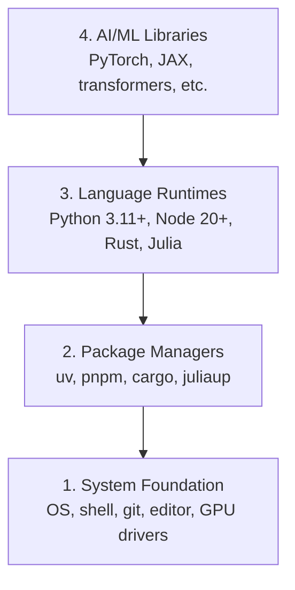

# Môi trường phát triển

> Các công cụ của bạn định hình suy nghĩ của bạn. Thiết lập chúng một lần, thiết lập đúng.

**Loại:** Xây dựng
**Ngôn ngữ:** Python, Node.js, Rust
**Kiến thức tiên quyết:** Không có
**Thời lượng:** ~45 phút

## Mục tiêu học tập

- Thiết lập Python 3.11+, Node.js 20+ và Rust toolchains từ đầu
- Cấu hình môi trường ảo và trình quản lý gói cho các bản dựng có thể tái tạo
- Xác minh quyền truy cập GPU với CUDA/MPS và chạy thử nghiệm tensor hoạt động
- Hiểu stack bốn lớp: hệ thống, gói, runtimes AI thư viện

## Vấn đề

Bạn sắp học kỹ thuật AI qua 200+ bài học bằng cách sử dụng Python, TypeScript, Rust và Julia. Nếu môi trường của bạn gặp lỗi, mỗi bài học sẽ trở thành một cuộc chiến chống lại công cụ thay vì học hỏi.

Hầu hết mọi người bỏ qua thiết lập môi trường. Sau đó, họ dành hàng giờ để gỡ lỗi import, xung đột phiên bản và thiếu trình điều khiển CUDA. Chúng ta sẽ làm điều này một lần, đúng cách.

## Khái niệm

Môi trường kỹ thuật AI có bốn lớp:



Chúng ta cài đặt từ dưới lên. Mỗi lớp phụ thuộc vào lớp bên dưới nó.

## Tự xây dựng

### Bước 1: Nền tảng hệ thống

Kiểm tra hệ thống của bạn và cài đặt những điều cơ bản.

```bash
# macOS
xcode-select --install
brew install git curl wget

# Ubuntu/Debian
sudo apt update && sudo apt install -y build-essential git curl wget

# Windows (use WSL2)
wsl --install -d Ubuntu-24.04
```

### Bước 2: Python với uv

Chúng ta sử dụng `uv` - nó nhanh hơn 10-100 lần so với pip và xử lý môi trường ảo tự động.

```bash
curl -LsSf https://astral.sh/uv/install.sh | sh

uv python install 3.12

uv venv
source .venv/bin/activate  # or .venv\Scripts\activate on Windows

uv pip install numpy matplotlib jupyter
```

Xác minh:

```python
import sys
print(f"Python {sys.version}")

import numpy as np
print(f"NumPy {np.__version__}")
a = np.array([1, 2, 3])
print(f"Vector: {a}, dot product with itself: {np.dot(a, a)}")
```

### Bước 3: Node.js với pnpm

Đối với TypeScript bài học (agents, MCP servers, web apps).

```bash
curl -fsSL https://fnm.vercel.app/install | bash
fnm install 22
fnm use 22

npm install -g pnpm

node -e "console.log('Node', process.version)"
```

### Bước 4: Rust

Đối với các bài học quan trọng về hiệu suất (inference, hệ thống).

```bash
curl --proto '=https' --tlsv1.2 -sSf https://sh.rustup.rs | sh

rustc --version
cargo --version
```

### Bước 5: Julia (Tùy chọn)

Đối với các bài học nặng về toán học, nơi Julia tỏa sáng.

```bash
curl -fsSL https://install.julialang.org | sh

julia -e 'println("Julia ", VERSION)'
```

### Bước 6: Thiết lập GPU (nếu có)

```bash
# NVIDIA
nvidia-smi

# Install PyTorch with CUDA
uv pip install torch torchvision torchaudio --index-url https://download.pytorch.org/whl/cu124
```

```python
import torch
print(f"CUDA available: {torch.cuda.is_available()}")
if torch.cuda.is_available():
    print(f"GPU: {torch.cuda.get_device_name(0)}")
```

Không GPU? Không vấn đề gì. Hầu hết các bài học hoạt động trên CPU. Đối với các bài học nặng về training, hãy sử dụng Google Colab hoặc cloud GPUs.

### Bước 7: Xác minh mọi thứ

Chạy script xác minh:

```bash
python phases/00-setup-and-tooling/01-dev-environment/code/verify.py
```

## Ứng dụng

Môi trường của bạn hiện đã sẵn sàng cho mọi bài học trong khóa học này. Dưới đây là những gì bạn sẽ sử dụng ở đâu:

| Ngôn ngữ | Được sử dụng trong | Trình quản lý gói |
|----------|---------|-----------------|
| Python | Giai đoạn 1-12 (ML, DL, NLP, Tầm nhìn, Âm thanh, LLMs) | uv |
| TypeScript | Giai đoạn 13-17 (Công cụ, Agents, Swarms, Cơ sở hạ tầng) | pnpm |
| Rust | Giai đoạn 12, 15-17 (Hệ thống quan trọng về hiệu suất) | cargo |
| Julia | Giai đoạn 1 (Nền tảng Toán học) | Pkg |

## Sản phẩm bàn giao

Bài học này tạo ra một script xác minh mà bất kỳ ai cũng có thể chạy để kiểm tra thiết lập của họ.

Xem `outputs/prompt-env-check.md` để biết prompt giúp trợ lý AI chẩn đoán các vấn đề về môi trường.

## Bài tập

1. Chạy script xác minh và khắc phục mọi lỗi
2. Tạo môi trường ảo Python cho khóa học này và cài đặt PyTorch
3. Viết một "hello world" bằng cả bốn ngôn ngữ và chạy từng ngôn ngữ
