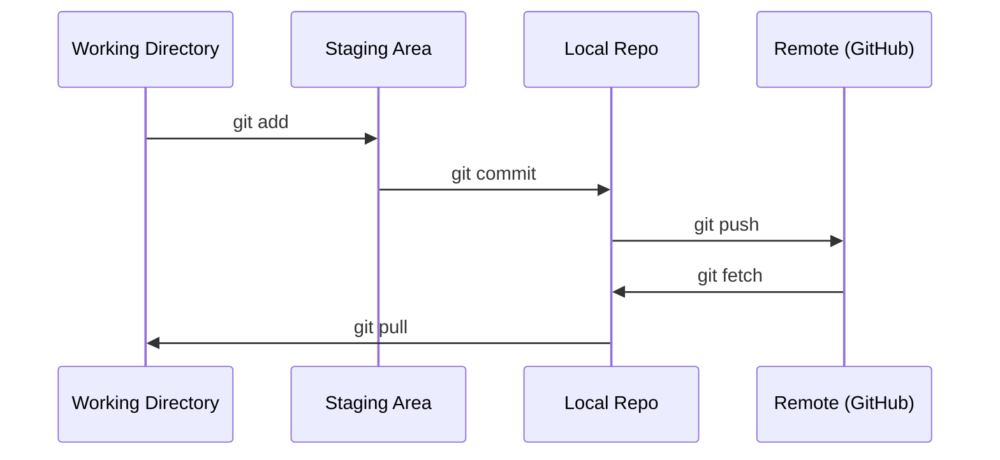

# Git và cộng tác

> Kiểm soát phiên bản không phải là tùy chọn. Mọi thử nghiệm, mọi model, mọi bài học bạn xây dựng ở đây đều được theo dõi.

**Loại:** Học
**Ngôn ngữ:** --
**Kiến thức tiên quyết:** Giai đoạn 0, Bài 01
**Thời lượng:** ~30 phút

## Mục tiêu học tập

- Cấu hình danh tính git và sử dụng quy trình làm việc hàng ngày của thêm, commit và đẩy
- Tạo và merge branches cho các thử nghiệm riêng biệt mà không phá vỡ chính
- Viết một `.gitignore` loại trừ các tệp nhị phân model checkpoints và lớn
- Điều hướng lịch sử commit với `git log` để hiểu sự phát triển của dự án

## Vấn đề

Bạn sắp viết hàng trăm tệp mã trên 20 giai đoạn. Nếu không có kiểm soát phiên bản, bạn sẽ mất việc, phá vỡ những thứ bạn không thể hoàn tác và không có cách nào để cộng tác với người khác.

Git là công cụ. GitHub là nơi mã tồn tại. Bài học này bao gồm những gì bạn cần cho khóa học này và không có gì hơn.

## Khái niệm



Ba điều cần nhớ:
1. Lưu thường xuyên (`git commit`)
2. Đẩy vào điều khiển từ xa (`git push`)
3. Branch cho thử nghiệm (`git checkout -b experiment`)

## Tự xây dựng

### Bước 1: Cấu hình git

```bash
git config --global user.name "Your Name"
git config --global user.email "you@example.com"
```

### Bước 2: Quy trình làm việc hàng ngày

```bash
git status
git add file.py
git commit -m "Add perceptron implementation"
git push origin main
```

### Bước 3: Phân nhánh cho thử nghiệm

```bash
git checkout -b experiment/new-optimizer

# ... make changes, commit ...

git checkout main
git merge experiment/new-optimizer
```

### Bước 4: Làm việc với khóa học này repo

```bash
git clone https://github.com/rohitg00/ai-engineering-from-scratch.git
cd ai-engineering-from-scratch

git checkout -b my-progress
# work through lessons, commit your code
git push origin my-progress
```

## Ứng dụng

Đối với khóa học này, bạn cần chính xác các lệnh sau:

| Chỉ huy | Khi nào |
|---------|------|
| `git clone` | Nhận khóa học repo |
| `git add` + `git commit` | Lưu công việc của bạn |
| `git push` | Sao lưu nó lên GitHub |
| `git checkout -b` | Hãy thử một cái gì đó mà không phá vỡ chính |
| `git log --oneline` | Xem những gì bạn đã làm |

Đó là nó. Bạn không cần rebase, cherry-pick hoặc mô-đun con cho khóa học này.

## Bài tập

1. Sao chép repo này, tạo một branch có tên là `my-progress`, tạo một tệp, commit nó, đẩy nó
2. Tạo `.gitignore` loại trừ các tệp model checkpoint (`.pt`, `.pth` `.safetensors`)
3. Nhìn vào lịch sử commit của repo này với `git log --oneline` và đọc cách các bài học được thêm vào

## Thuật ngữ chính

| Thuật ngữ | Những gì mọi người nói | Ý nghĩa thực sự của nó |
|------|----------------|----------------------|
| Commit | "Tiết kiệm" | Ảnh chụp nhanh toàn bộ dự án của bạn tại một thời điểm |
| Branch | "Một bản sao" | Con trỏ đến commit di chuyển về phía trước khi bạn làm việc |
| Merge | "Kết hợp mã" | Lấy các thay đổi từ branch này và áp dụng chúng cho một  khác |
| Điều khiển từ xa | "Người cloud" | Bản sao repo của bạn được lưu trữ ở một nơi khác (GitHub, GitLab) |
