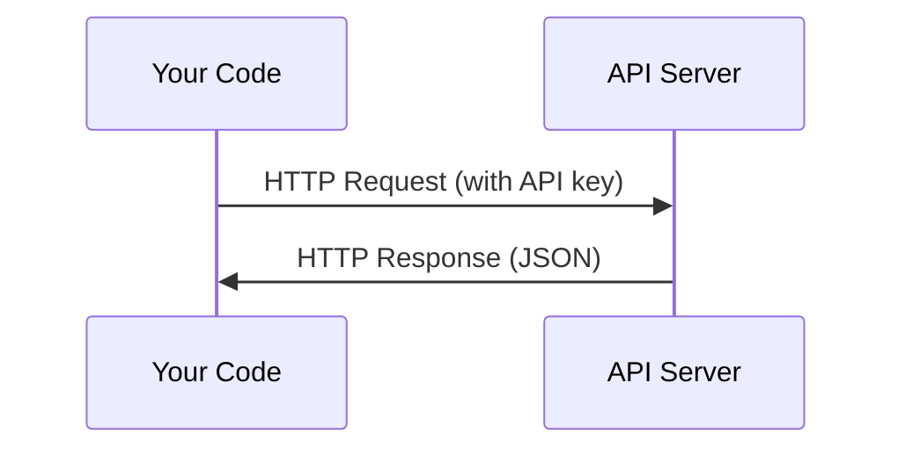

# APIs & Phím

> Mọi AI API đều hoạt động theo cùng một cách: gửi yêu cầu, nhận phản hồi. Các chi tiết thay đổi, mô hình thì không.

**Loại:** Xây dựng
**Ngôn ngữ:** Python, TypeScript
**Kiến thức tiên quyết:** Giai đoạn 0, Bài 01
**Thời lượng:** ~30 phút

## Mục tiêu học tập

- Lưu trữ khóa API một cách an toàn bằng cách sử dụng các biến môi trường và tệp `.env`
- Thực hiện cuộc gọi LLM API bằng cả Anthropic Python SDK và HTTP thô
- So sánh các định dạng HTTP request/response dựa trên SDK và thô để gỡ lỗi
- Xác định và xử lý các lỗi API thường gặp bao gồm xác thực và rate limits

## Vấn đề

Bắt đầu từ Giai đoạn 11, bạn sẽ gọi cho LLM APIs (Anthropic, OpenAI, Google). Trong Giai đoạn 13-16, bạn sẽ xây dựng agents sử dụng các APIs này trong vòng lặp. Bạn cần biết cách hoạt động của API khóa, cách cất giữ chúng một cách an toàn và cách thực hiện cuộc gọi API đầu tiên.

## Khái niệm



Mỗi cuộc gọi API có:
1. Một endpoint (URL)
2. Khóa API (xác thực)
3. Nội dung yêu cầu (những gì bạn muốn)
4. Một cơ quan phản hồi (những gì bạn nhận lại)

## Tự xây dựng

### Bước 1: Lưu trữ chìa khóa API an toàn

Không bao giờ đặt các khóa API vào mã. Sử dụng các biến môi trường.

```bash
export ANTHROPIC_API_KEY="sk-ant-..."
export OPENAI_API_KEY="sk-..."
```

Hoặc sử dụng tệp `.env` (thêm vào `.gitignore`):

```
ANTHROPIC_API_KEY=sk-ant-...
OPENAI_API_KEY=sk-...
```

### Bước 2: Cuộc gọi API đầu tiên (Python)

```python
import anthropic

client = anthropic.Anthropic()

response = client.messages.create(
    model="claude-sonnet-4-20250514",
    max_tokens=256,
    messages=[{"role": "user", "content": "What is a neural network in one sentence?"}]
)

print(response.content[0].text)
```

### Bước 3: Cuộc gọi API đầu tiên (TypeScript)

```typescript
import Anthropic from "@anthropic-ai/sdk";

const client = new Anthropic();

const response = await client.messages.create({
  model: "claude-sonnet-4-20250514",
  max_tokens: 256,
  messages: [{ role: "user", content: "What is a neural network in one sentence?" }],
});

console.log(response.content[0].text);
```

### Bước 4: HTTP thô (không SDK)

```python
import os
import urllib.request
import json

url = "https://api.anthropic.com/v1/messages"
headers = {
    "Content-Type": "application/json",
    "x-api-key": os.environ["ANTHROPIC_API_KEY"],
    "anthropic-version": "2023-06-01",
}
body = json.dumps({
    "model": "claude-sonnet-4-20250514",
    "max_tokens": 256,
    "messages": [{"role": "user", "content": "What is a neural network in one sentence?"}],
}).encode()

req = urllib.request.Request(url, data=body, headers=headers, method="POST")
with urllib.request.urlopen(req) as resp:
    result = json.loads(resp.read())
    print(result["content"][0]["text"])
```

Đây là những gì SDKs làm dưới mui xe. Hiểu lệnh gọi HTTP thô sẽ giúp ích khi gỡ lỗi.

## Ứng dụng

Đối với khóa học này:

| API | Khi bạn cần | Bậc miễn phí |
|-----|-----------------|-----------|
| Anthropic (Claude) | Giai đoạn 11-16 (agents, công cụ) | Tín dụng $ 5 khi đăng ký |
| OpenAI | Giai đoạn 11 (so sánh) | Tín dụng $ 5 khi đăng ký |
| Hugging Face | Giai đoạn 4-10 (models, datasets) | Miễn phí |

Bạn không cần tất cả chúng ngay bây giờ. Thiết lập chúng khi bài học yêu cầu.

## Sản phẩm bàn giao

Bài học này tạo ra:
- `outputs/prompt-api-troubleshooter.md` - chẩn đoán các lỗi API thường gặp

## Bài tập

1. Nhận chìa khóa Anthropic API và thực hiện cuộc gọi API đầu tiên của bạn
2. Hãy thử phiên bản HTTP thô và so sánh định dạng phản hồi với phiên bản SDK
3. Cố tình sử dụng sai phím API và đọc thông báo lỗi

## Thuật ngữ chính

| Thuật ngữ | Những gì mọi người nói | Ý nghĩa thực sự của nó |
|------|----------------|----------------------|
| Phím API | "Mật khẩu cho API" | Một chuỗi duy nhất xác định tài khoản của bạn và ủy quyền yêu cầu |
| Rate limit | "Họ đang điều tiết tôi" | Yêu cầu tối đa trên mỗi minute/hour để ngăn chặn lạm dụng và đảm bảo sử dụng hợp lý |
| Token | "Một từ" (trong ngữ cảnh API) | Đơn vị thanh toán: tokens đầu vào và đầu ra được tính và tính phí riêng biệt |
| Streaming | "Phản hồi theo thời gian thực" | Nhận phản hồi từng từ thay vì chờ đợi phản hồi đầy đủ |
