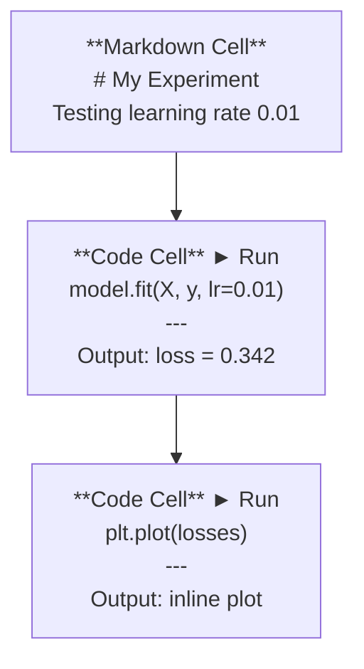
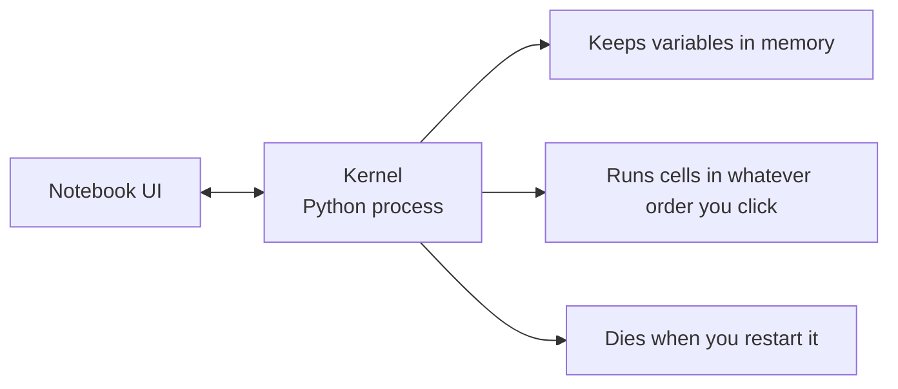

# Jupyter Sổ tay

> Máy tính xách tay là băng ghế phòng thí nghiệm của kỹ thuật AI. Bạn tạo nguyên mẫu ở đây, sau đó chuyển những gì hoạt động vào production.

**Loại:** Xây dựng
**Ngôn ngữ:** Python
**Kiến thức tiên quyết:** Giai đoạn 0, Bài 01
**Thời lượng:** ~30 phút

## Mục tiêu học tập

- Cài đặt và khởi chạy JupyterLab, Jupyter Notebook hoặc VS Code với tiện ích mở rộng Jupyter
- Sử dụng các lệnh ma thuật (`%timeit`, `%%time`, `%matplotlib inline`) để benchmark và trực quan hóa nội tuyến
- Phân biệt thời điểm sử dụng sổ ghi chép và scripts và áp dụng quy trình làm việc "khám phá trong sổ ghi chép ship trong scripts"
- Xác định và tránh các bẫy sổ ghi chép phổ biến: thực thi không theo thứ tự, trạng thái ẩn và rò rỉ bộ nhớ

## Vấn đề

Mỗi AI bài báo, hướng dẫn và cuộc thi Kaggle đều sử dụng Jupyter sổ tay. Chúng cho phép bạn chạy mã theo từng mảnh, xem đầu ra nội tuyến, kết hợp mã với giải thích và lặp lại nhanh chóng. Nếu bạn cố gắng học AI mà không có sổ tay, bạn đang làm bài tập toán mà không cần giấy nháp.

Nhưng máy tính xách tay có những cái bẫy thực sự. Mọi người sử dụng chúng cho mọi thứ, kể cả những thứ họ rất tệ. Biết khi nào nên sử dụng sổ ghi chép và khi nào nên sử dụng script sẽ giúp bạn tránh khỏi những cơn ác mộng gỡ lỗi sau này.

## Khái niệm

Sổ tay là một danh sách các ô. Mỗi ô là mã hoặc văn bản.



Hạt nhân là một Python process chạy trong nền. Khi bạn chạy một ô, nó sẽ gửi mã đến hạt nhân, hạt nhân này thực thi nó và gửi lại kết quả. Tất cả các tế bào đều chia sẻ cùng một nhân, vì vậy các biến tồn tại giữa các ô.



Phần "bất cứ thứ tự nào bạn nhấp vào" đó vừa là siêu năng lực vừa là khẩu súng chân.

## Tự xây dựng

### Bước 1: Chọn giao diện của bạn

Ba tùy chọn, một định dạng:

| Giao diện | Cài đặt | Tốt nhất cho |
|-----------|---------|----------|
| Phòng thí nghiệm JupyterLab | `pip install jupyterlab` sau đó `jupyter lab` | Trải nghiệm IDE đầy đủ, nhiều tab, trình duyệt tệp, thiết bị đầu cuối |
| Jupyter Sổ tay | `pip install notebook` sau đó `jupyter notebook` | Đơn giản, nhẹ, mỗi lần một máy tính xách tay |
| Mã VS | Cài đặt tiện ích mở rộng "Jupyter" | Đã có trong trình chỉnh sửa của bạn, tích hợp git, gỡ lỗi |

Cả ba đều đọc và ghi cùng một tệp `.ipynb`. Chọn bất cứ thứ gì bạn thích. JupyterLab là phổ biến nhất trong công việc AI.

```bash
pip install jupyterlab
jupyter lab
```

### Bước 2: Các phím tắt quan trọng

Bạn hoạt động ở hai chế độ. Nhấn `Escape` cho chế độ lệnh (thanh màu xanh lam ở bên trái) `Enter` để xem chế độ chỉnh sửa (thanh màu xanh lá cây).

**Chế độ lệnh (được sử dụng nhiều nhất):**

| Chìa khóa | Hoạt động |
|-----|--------|
| `Shift+Enter` | Chạy ô, chuyển sang tiếp theo |
| `A` | Chèn ô ở trên |
| `B` | Chèn ô bên dưới |
| `DD` | Xóa ô |
| `M` | Chuyển đổi sang đánh dấu |
| `Y` | Chuyển đổi thành mã |
| `Z` | Hoàn tác hoạt động của ô |
| `Ctrl+Shift+H` | Hiển thị tất cả các phím tắt |

**Chế độ chỉnh sửa:**

| Chìa khóa | Hoạt động |
|-----|--------|
| `Tab` | Tự động hoàn thành |
| `Shift+Tab` | Hiển thị chữ ký hàm |
| `Ctrl+/` | Chuyển đổi bình luận |

`Shift+Enter` là loại bạn sẽ sử dụng hàng nghìn lần một ngày. Tìm hiểu nó trước.

### Bước 3: Loại ô

**Mã ô** chạy Python và hiển thị đầu ra:

```python
import numpy as np
data = np.random.randn(1000)
data.mean(), data.std()
```

Đầu ra: `(0.0032, 0.9987)`

**Ô đánh dấu** hiển thị văn bản được định dạng. Sử dụng chúng để ghi lại những gì bạn đang làm và tại sao. Hỗ trợ tiêu đề, in đậm, in nghiêng, toán học LaTeX (`$E = mc^2$`), bảng và hình ảnh.

### Bước 4: Lệnh ma thuật

Đây không phải là Python. Chúng là các lệnh dành riêng cho Jupyter bắt đầu bằng `%` (ma thuật dòng) hoặc `%%` (ma thuật tế bào).

**Thời gian mã của bạn:**

```python
%timeit np.random.randn(10000)
```

Đầu ra: `45.2 us +/- 1.3 us per loop`

```python
%%time
model.fit(X_train, y_train, epochs=10)
```

Đầu ra: `Wall time: 2.34 s`

`%timeit` chạy mã nhiều lần và trung bình. `%%time` chạy nó một lần. Sử dụng `%timeit` cho các điểm chuẩn vi mô `%%time` cho các lần chạy training.

**Bật các biểu đồ nội tuyến:**

```python
%matplotlib inline
```

Mọi `plt.plot()` hoặc `plt.show()` hiện hiển thị trực tiếp trong sổ ghi chép.

**Cài đặt gói mà không cần rời khỏi sổ tay:**

```python
!pip install scikit-learn
```

Tiền tố `!` chạy bất kỳ lệnh shell nào.

**Kiểm tra các biến môi trường:**

```python
%env CUDA_VISIBLE_DEVICES
```

### Bước 5: Hiển thị đầu ra phong phú nội tuyến

Sổ ghi chép tự động hiển thị biểu thức cuối cùng trong ô. Nhưng bạn có thể kiểm soát nó:

```python
import pandas as pd

df = pd.DataFrame({
    "model": ["Linear", "Random Forest", "Neural Net"],
    "accuracy": [0.72, 0.89, 0.94],
    "training_time": [0.1, 2.3, 45.6]
})
df
```

Thao tác này hiển thị bảng HTML được định dạng, không phải kết xuất văn bản. Tương tự với các âm mưu:

```python
import matplotlib.pyplot as plt

plt.figure(figsize=(8, 4))
plt.plot([1, 2, 3, 4], [1, 4, 2, 3])
plt.title("Inline Plot")
plt.show()
```

Biểu đồ xuất hiện ngay bên dưới ô. Đây là lý do tại sao sổ tay chiếm ưu thế trong công việc AI. Bạn thấy dữ liệu, cốt truyện và mã cùng nhau.

Đối với hình ảnh:

```python
from IPython.display import Image, display
display(Image(filename="architecture.png"))
```

### Bước 6: Google Colab

Colab là một máy tính xách tay Jupyter miễn phí trên cloud. Nó cung cấp cho bạn một GPU, thư viện được cài đặt sẵn và tích hợp Google Drive. Không cần thiết lập.

1. Chuyển đến [colab.research.google.com](https://colab.research.google.com)
2. Tải lên bất kỳ tệp `.ipynb` nào từ khóa học này
3. Runtime > Thay đổi loại runtime > T4 GPU (miễn phí)

Colab điểm khác biệt so với Jupyter địa phương:
- Tệp không tồn tại giữa các sessions (lưu vào Drive hoặc tải xuống)
- Cài đặt sẵn: numpy, gấu trúc, matplotlib, ngọn đuốc, tensorflow, sklearn
- `from google.colab import files` để upload/download tệp
- `from google.colab import drive; drive.mount('/content/drive')` để lưu trữ liên tục
- Sessions hết thời gian chờ sau 90 phút không hoạt động (bậc miễn phí)

## Ứng dụng

### Máy tính xách tay so với Scripts: Khi nào sử dụng

| Sử dụng sổ ghi chép cho | Sử dụng scripts cho |
|-------------------|-----------------|
| Khám phá một dataset | Training pipelines |
| Tạo mẫu model | Tiện ích tái sử dụng |
| Trực quan hóa kết quả | Bất cứ thứ gì có `if __name__` |
| Giải thích công việc của bạn | Mã chạy theo lịch trình |
| Thử nghiệm nhanh | Mã Production |
| Bài tập khóa học | Gói và thư viện |

Quy tắc: **khám phá trong sổ tay, ship trong scripts**.

Quy trình làm việc phổ biến trong AI:
1. Khám phá dữ liệu trong sổ tay
2. Tạo nguyên mẫu model của bạn trong sổ ghi chép
3. Sau khi hoạt động, hãy di chuyển mã vào tệp `.py`
4. Import các tệp `.py` đó trở lại sổ ghi chép để thử nghiệm thêm

### Bẫy thường gặp

**Thực thi không theo thứ tự.** Bạn chạy ô 5, sau đó là ô 2, sau đó là ô 7. Máy tính xách tay hoạt động trên máy của bạn nhưng bị hỏng khi ai đó chạy nó từ trên xuống dưới. Khắc phục: Kernel > Restart & Run All trước khi chia sẻ.

**Trạng thái ẩn.** Bạn xóa một ô nhưng biến mà nó tạo ra vẫn còn trong bộ nhớ. Sổ tay trông sạch sẽ nhưng phụ thuộc vào một ô ma. Khắc phục: Khởi động lại hạt nhân thường xuyên.

**Rò rỉ bộ nhớ.** Đang tải một dataset 4GB, training một model, tải một dataset khác. Không có gì được giải phóng. Khắc phục: `del variable_name` và `gc.collect()` hoặc khởi động lại hạt nhân.

## Sản phẩm bàn giao

Bài học này tạo ra:
- `outputs/prompt-notebook-helper.md` để gỡ lỗi sự cố sổ ghi chép

## Bài tập

1. Mở JupyterLab, tạo sổ ghi chép và sử dụng `%timeit` để so sánh khả năng hiểu danh sách so với numpy để tạo một mảng gồm 100.000 số ngẫu nhiên
2. Tạo sổ ghi chép với cả ô mã và mã để tải CSV, hiển thị khung dữ liệu và vẽ biểu đồ. Sau đó chạy Kernel > Restart & Run All để xác minh nó hoạt động từ trên xuống dưới
3. Lấy mã từ `code/notebook_tips.py`, dán vào sổ tay Colab và chạy mã với GPU miễn phí

## Thuật ngữ chính

| Thuật ngữ | Những gì mọi người nói | Ý nghĩa thực sự của nó |
|------|----------------|----------------------|
| Hạt nhân | "Thứ chạy mã của tôi" | Một Python process riêng biệt thực thi các ô và giữ các biến trong bộ nhớ |
| Tế bào | "Một khối mã" | Một đơn vị có thể chạy độc lập trong sổ ghi chép, mã hoặc đánh dấu |
| Lệnh ma thuật | "Thủ thuật Jupyter" | Các lệnh đặc biệt có tiền tố `%` hoặc `%%` điều khiển môi trường máy tính xách tay |
| `.ipynb` | "Tệp sổ tay" | Tệp JSON chứa ô, đầu ra và siêu dữ liệu. Viết tắt của IPython Notebook |

## Đọc thêm

- [JupyterLab Docs](https://jupyterlab.readthedocs.io/) cho bộ feature đầy đủ
- [Google Colab FAQ](https://research.google.com/colaboratory/faq.html) cho các giới hạn và features cụ thể của Colab
- [28 Jupyter Notebook Tips](https://www.dataquest.io/blog/jupyter-notebook-tips-tricks-shortcuts/) cho các phím tắt dành cho người dùng thành thạo
