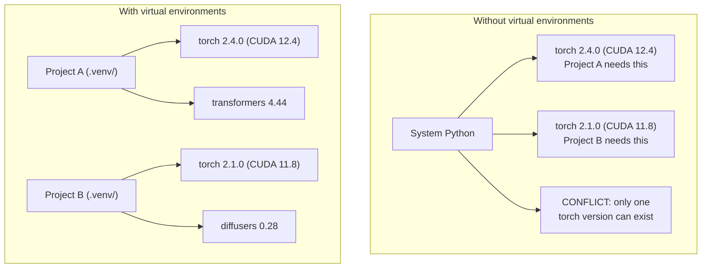

# Môi trường Python

> Địa ngục phụ thuộc là có thật. Môi trường ảo là phương thuốc chữa bệnh.

**Loại:** Xây dựng
**Ngôn ngữ:** Shell
**Kiến thức tiên quyết:** Giai đoạn 0, Bài 01
**Thời lượng:** ~30 phút

## Mục tiêu học tập

- Tạo môi trường ảo biệt lập bằng `uv`, `venv` hoặc `conda`
- Viết một `pyproject.toml` với các nhóm phụ thuộc tùy chọn và tạo lockfiles cho khả năng tái tạo
- Chẩn đoán và khắc phục các lỗi thường gặp: lượt cài đặt toàn cầu, trộn pip/conda CUDA phiên bản không khớp
- Thực hiện chiến lược môi trường theo từng giai đoạn cho các dự án có sự phụ thuộc xung đột

## Vấn đề

Bạn cài đặt PyTorch 2.4 cho một dự án fine-tuning. Tuần tới, một dự án khác cần PyTorch 2.1 vì bản dựng CUDA của nó đã được ghim. Bạn nâng cấp trên toàn cầu và dự án đầu tiên gặp lỗi. Bạn hạ cấp, và cái thứ hai bị hỏng.

Đây là địa ngục phụ thuộc. Nó xảy ra liên tục trong công việc AI/ML vì:

- PyTorch, JAX và TensorFlow đều ship các ràng buộc CUDA riêng
- Model thư viện ghim các phiên bản framework cụ thể
- Một `pip install` toàn cầu ghi đè lên bất cứ thứ gì đã có trước đây
- CUDA bản dựng 11.8 không hoạt động với trình điều khiển CUDA 12.x (và ngược lại)

Cách khắc phục: mỗi dự án đều có môi trường biệt lập riêng với các gói riêng.

## Khái niệm



## Tự xây dựng

### Tùy chọn 1: uv venv (Khuyến nghị)

`uv` là trình quản lý gói Python nhanh nhất (nhanh hơn 10-100 lần so với pip). Nó xử lý môi trường ảo, phiên bản Python và độ phân giải phụ thuộc trong một công cụ.

```bash
curl -LsSf https://astral.sh/uv/install.sh | sh

uv python install 3.12

cd your-project
uv venv
source .venv/bin/activate
```

Cài đặt gói:

```bash
uv pip install torch numpy
```

Tạo dự án có `pyproject.toml` trong một bước:

```bash
uv init my-ai-project
cd my-ai-project
uv add torch numpy matplotlib
```

### Tùy chọn 2: venv (Tích hợp)

Nếu bạn không thể cài đặt `uv`, hãy Python ships bằng `venv`:

```bash
python3 -m venv .venv
source .venv/bin/activate  # Linux/macOS
.venv\Scripts\activate     # Windows

pip install torch numpy
```

Chậm hơn `uv`, nhưng hoạt động ở mọi nơi Python được cài đặt.

### Tùy chọn 3: conda (Khi bạn cần)

Conda quản lý các phần phụ thuộc không phải Python như bộ công cụ CUDA, cuDNN và thư viện C. Sử dụng nó khi:

- Bạn cần một phiên bản bộ công cụ CUDA cụ thể mà không cần cài đặt nó trên toàn hệ thống
- Bạn đang ở trên một cụm dùng chung mà bạn không thể cài đặt các gói hệ thống
- Hướng dẫn cài đặt của thư viện cho biết "sử dụng conda"

```bash
# Install miniconda (not the full Anaconda)
curl -LsSf https://repo.anaconda.com/miniconda/Miniconda3-latest-Linux-x86_64.sh -o miniconda.sh
bash miniconda.sh -b

conda create -n myproject python=3.12
conda activate myproject

conda install pytorch torchvision torchaudio pytorch-cuda=12.4 -c pytorch -c nvidia
```

Một quy tắc: nếu bạn sử dụng conda cho một môi trường, hãy sử dụng conda cho tất cả các gói trong môi trường đó. Việc trộn `pip install` vào conda env gây ra xung đột phụ thuộc gây khó khăn cho việc gỡ lỗi.

### Đối với khóa học này: Chiến lược mỗi giai đoạn

Bạn có thể tạo một môi trường cho toàn bộ khóa học. Đừng. Các giai đoạn khác nhau cần các phụ thuộc khác nhau (đôi khi xung đột).

Chiến lược:

```
ai-engineering-from-scratch/
├── .venv/                    <-- shared lightweight env for phases 0-3
├── phases/
│   ├── 04-neural-networks/
│   │   └── .venv/            <-- PyTorch env
│   ├── 05-cnns/
│   │   └── .venv/            <-- same PyTorch env (symlink or shared)
│   ├── 08-transformers/
│   │   └── .venv/            <-- might need different transformer versions
│   └── 11-llm-apis/
│       └── .venv/            <-- API SDKs, no torch needed
```

script trong `code/env_setup.sh` tạo ra môi trường cơ sở cho khóa học này.

## Thông tin cơ bản về pyproject.toml

Mỗi dự án Python nên có một `pyproject.toml`. Nó thay thế `setup.py`, `setup.cfg` và `requirements.txt` trong một tệp.

```toml
[project]
name = "ai-engineering-from-scratch"
version = "0.1.0"
requires-python = ">=3.11"
dependencies = [
    "numpy>=1.26",
    "matplotlib>=3.8",
    "jupyter>=1.0",
    "scikit-learn>=1.4",
]

[project.optional-dependencies]
torch = ["torch>=2.3", "torchvision>=0.18"]
llm = ["anthropic>=0.39", "openai>=1.50"]
```

Sau đó cài đặt:

```bash
uv pip install -e ".[torch]"    # base + PyTorch
uv pip install -e ".[llm]"     # base + LLM SDKs
uv pip install -e ".[torch,llm]" # everything
```

## Lockfiles

Một lockfile ghim mọi phần phụ thuộc (bao gồm cả các phần phụ thuộc chuyển tiếp) vào các phiên bản chính xác. Điều này đảm bảo khả năng tái tạo: bất kỳ ai cài đặt từ lockfile đều nhận được các gói giống hệt nhau.

```bash
# uv generates uv.lock automatically when using uv add
uv add numpy

# pip-tools approach
uv pip compile pyproject.toml -o requirements.lock
uv pip install -r requirements.lock
```

Commit lockfile của bạn để git. Khi ai đó sao chép repo, họ cài đặt từ lockfile và nhận được các phiên bản giống hệt nhau.

## Những sai lầm thường gặp

### 1. Cài đặt toàn cầu

```bash
pip install torch  # BAD: installs to system Python

source .venv/bin/activate
pip install torch  # GOOD: installs to virtual environment
```

Kiểm tra xem gói hàng của bạn đi đâu:

```bash
which python       # should show .venv/bin/python, not /usr/bin/python
which pip           # should show .venv/bin/pip
```

### 2. Trộn pip và conda

```bash
conda create -n myenv python=3.12
conda activate myenv
conda install pytorch -c pytorch
pip install some-other-package   # BAD: can break conda's dependency tracking
conda install some-other-package # GOOD: let conda manage everything
```

Nếu bạn phải sử dụng pip bên trong conda (một số gói chỉ dành cho pip), hãy cài đặt tất cả các gói conda trước, sau đó pip gói sau cùng.

### 3. Quên kích hoạt

```bash
python train.py           # uses system Python, missing packages
source .venv/bin/activate
python train.py           # uses project Python, packages found
```

prompt shell của bạn sẽ hiển thị tên môi trường:

```
(.venv) $ python train.py
```

### 4. Cam kết .venv vào git

```bash
echo ".venv/" >> .gitignore
```

Môi trường ảo là 200MB-2GB. Chúng là cục bộ, không di động giữa các máy. Commit `pyproject.toml` và lockfile thay thế.

### 5. Phiên bản CUDA không khớp

```bash
nvidia-smi                # shows driver CUDA version (e.g., 12.4)
python -c "import torch; print(torch.version.cuda)"  # shows PyTorch CUDA version

# These must be compatible.
# PyTorch CUDA version must be <= driver CUDA version.
```

## Ứng dụng

Chạy script thiết lập để tạo môi trường khóa học của bạn:

```bash
bash phases/00-setup-and-tooling/06-python-environments/code/env_setup.sh
```

Điều này tạo ra một `.venv` ở gốc repo với các phần phụ thuộc cốt lõi được cài đặt và xác minh.

## Bài tập

1. Chạy `env_setup.sh` và xác minh tất cả các kiểm tra vượt qua
2. Tạo một môi trường ảo thứ hai, cài đặt một phiên bản numpy khác trong đó và xác nhận hai môi trường bị cô lập
3. Viết một `pyproject.toml` cho một dự án cần cả PyTorch và Anthropic SDK
4. Cố tình cài đặt một gói trên toàn cầu (mà không kích hoạt venv), để ý nơi nó đi, sau đó gỡ cài đặt nó

## Thuật ngữ chính

| Thuật ngữ | Những gì mọi người nói | Ý nghĩa thực sự của nó |
|------|----------------|----------------------|
| Môi trường ảo | "Một venv" | Một thư mục biệt lập chứa trình thông dịch Python và các gói, tách biệt với hệ thống Python |
| Lockfile | "Các phần phụ thuộc được ghim" | Một tệp liệt kê mọi gói và phiên bản chính xác của nó, đảm bảo cài đặt giống hệt nhau trên các máy |
| pyproject.toml | "setup.py mới" | Dự án Python tiêu chuẩn configuration tệp, thay thế setup.py/setup.cfg/requirements.txt |
| Phần phụ thuộc chuyển tiếp | "Sự phụ thuộc của một sự phụ thuộc" | Gói B phụ thuộc vào C; nếu bạn cài đặt A phụ thuộc vào B, C là phụ thuộc chuyển tiếp của A |
| CUDA không khớp | "GPU của tôi không hoạt động" | PyTorch được biên dịch cho một phiên bản CUDA khác với những gì trình điều khiển GPU của bạn hỗ trợ |
