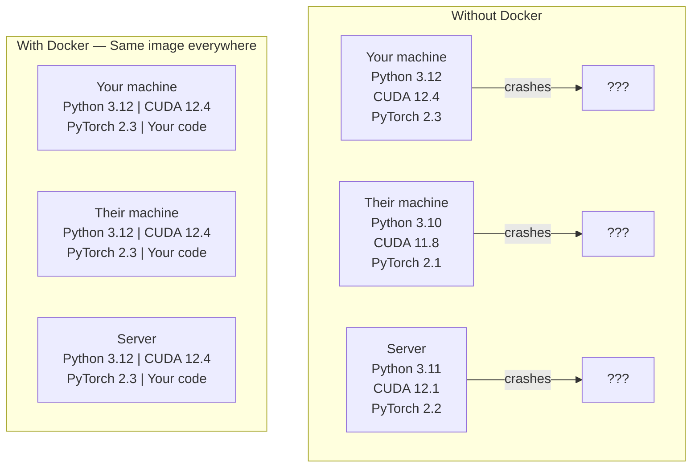

# Docker cho AI

> Containers biến "hoạt động trên máy của tôi" thành dĩ vãng.

**Loại:** Xây dựng
**Ngôn ngữ:** Docker
**Kiến thức tiên quyết:** Giai đoạn 0, Bài 01 và 03
**Thời lượng:** ~60 phút

## Mục tiêu học tập

- Xây dựng Docker image hỗ trợ GPU với các thư viện CUDA, PyTorch và AI từ Dockerfile
- Gắn các thư mục máy chủ dưới dạng volumes để duy trì models, datasets và mã trong quá trình xây dựng lại container
- Cấu hình Bộ công cụ NVIDIA Container để hiển thị GPUs bên trong containers
- Điều phối các ứng dụng AI đa dịch vụ (cơ sở dữ liệu inference server + vector) bằng Docker Compose

## Vấn đề

Bạn đã huấn luyện một model trên máy tính xách tay của mình với PyTorch 2.3, CUDA 12.4 và Python 3.12. Đồng nghiệp của bạn có PyTorch 2.1, CUDA 11.8 và Python 3.10. model của bạn gặp sự cố trên máy của họ. Dockerfile của bạn hoạt động trên cả hai.

AI dự án là cơn ác mộng phụ thuộc. Một stack điển hình bao gồm trình điều khiển Python, PyTorch, CUDA, cuDNN, thư viện C cấp hệ thống và các gói chuyên dụng như flash-attn cần các phiên bản trình biên dịch chính xác. Docker đóng gói tất cả những điều này thành một hình ảnh duy nhất chạy giống hệt nhau ở mọi nơi.

## Khái niệm

Docker bao bọc mã, runtime, thư viện và công cụ hệ thống của bạn vào một đơn vị biệt lập được gọi là container. Hãy nghĩ về nó như một máy ảo nhẹ, ngoại trừ nó chia sẻ hạt nhân hệ điều hành máy chủ thay vì chạy của riêng nó, vì vậy nó khởi động trong vài giây thay vì vài phút.



### Tại sao các dự án AI cần Docker nhiều hơn hầu hết

1. **GPU trình điều khiển rất dễ vỡ.** Mã CUDA 12.4 không chạy trên CUDA 11.8. Docker cô lập bộ công cụ CUDA bên trong container trong khi chia sẻ trình điều khiển GPU máy chủ thông qua Bộ công cụ NVIDIA Container.

2. **Model trọng lượng lớn.** A 7B parameter model là 14 GB trong fp16. Bạn không muốn tải xuống lại mỗi khi xây dựng lại. Docker volumes cho phép bạn gắn một thư mục models từ máy chủ.

3. **Kiến trúc đa dịch vụ là phổ biến.** Một ứng dụng AI thực sự không chỉ là một Python script. Nó là một inference server, một cơ sở dữ liệu vector cho RAG, có thể là một giao diện người dùng web. Docker Compose sắp xếp tất cả những điều này bằng một lệnh.

### Từ vựng chính

| Thuật ngữ | Nó có nghĩa là gì |
|------|---------------|
| Hình Ảnh | Một mẫu chỉ đọc. Công thức của bạn. Được xây dựng từ Dockerfile. |
| Container | Một phiên bản đang chạy của một hình ảnh. Nhà bếp của bạn. |
| Dockerfile | Hướng dẫn xây dựng hình ảnh. Từng lớp một. |
| Volume | Lưu trữ liên tục tồn tại container khởi động lại. |
| docker-soạn thảo | Một công cụ để xác định các ứng dụng đa container trong YAML. |

### Các mẫu container phổ biến trong AI

```
Dev Container
  Full toolkit. Editor support. Jupyter. Debugging tools.
  Used during development and experimentation.

Training Container
  Minimal. Just the training script and dependencies.
  Runs on GPU clusters. No editor, no Jupyter.

Inference Container
  Optimized for serving. Small image. Fast cold start.
  Runs behind a load balancer in production.
```

## Tự xây dựng

### Bước 1: Cài đặt Docker

```bash
# macOS
brew install --cask docker
open /Applications/Docker.app

# Ubuntu
curl -fsSL https://get.docker.com | sh
sudo usermod -aG docker $USER
# Log out and back in for group change to take effect
```

Xác minh:

```bash
docker --version
docker run hello-world
```

### Bước 2: Cài đặt NVIDIA Container Toolkit (Linux với NVIDIA GPU)

Điều này cho phép Docker containers truy cập vào GPU của mình. Người dùng macOS và Windows (WSL2) có thể bỏ qua điều này; Docker Máy tính để bàn xử lý truyền GPU khác nhau trên các nền tảng đó.

```bash
distribution=$(. /etc/os-release;echo $ID$VERSION_ID)
curl -fsSL https://nvidia.github.io/libnvidia-container/gpgkey | sudo gpg --dearmor -o /usr/share/keyrings/nvidia-container-toolkit-keyring.gpg
curl -s -L https://nvidia.github.io/libnvidia-container/$distribution/libnvidia-container.list | \
    sed 's#deb https://#deb [signed-by=/usr/share/keyrings/nvidia-container-toolkit-keyring.gpg] https://#g' | \
    sudo tee /etc/apt/sources.list.d/nvidia-container-toolkit.list

sudo apt-get update
sudo apt-get install -y nvidia-container-toolkit
sudo nvidia-ctk runtime configure --runtime=docker
sudo systemctl restart docker
```

Kiểm tra quyền truy cập GPU bên trong container:

```bash
docker run --rm --gpus all nvidia/cuda:12.4.1-base-ubuntu22.04 nvidia-smi
```

Nếu bạn thấy thông tin GPU của mình, bộ công cụ đang hoạt động.

### Bước 3: Tìm hiểu hình ảnh cơ sở

Chọn hình ảnh cơ sở phù hợp giúp tiết kiệm hàng giờ gỡ lỗi.

```
nvidia/cuda:12.4.1-devel-ubuntu22.04
  Full CUDA toolkit. Compilers included.
  Use for: building packages that need nvcc (flash-attn, bitsandbytes)
  Size: ~4 GB

nvidia/cuda:12.4.1-runtime-ubuntu22.04
  CUDA runtime only. No compilers.
  Use for: running pre-built code
  Size: ~1.5 GB

pytorch/pytorch:2.3.1-cuda12.4-cudnn9-runtime
  PyTorch pre-installed on top of CUDA.
  Use for: skipping the PyTorch install step
  Size: ~6 GB

python:3.12-slim
  No CUDA. CPU only.
  Use for: inference on CPU, lightweight tools
  Size: ~150 MB
```

### Bước 4: Viết Dockerfile để phát triển AI

Đây là Dockerfile trong `code/Dockerfile`. Đi qua nó:

```dockerfile
FROM nvidia/cuda:12.4.1-devel-ubuntu22.04

ENV DEBIAN_FRONTEND=noninteractive
ENV PYTHONUNBUFFERED=1

RUN apt-get update && apt-get install -y --no-install-recommends \
    python3.12 \
    python3.12-venv \
    python3.12-dev \
    python3-pip \
    git \
    curl \
    build-essential \
    && rm -rf /var/lib/apt/lists/*

RUN update-alternatives --install /usr/bin/python python /usr/bin/python3.12 1

RUN python -m pip install --no-cache-dir --upgrade pip setuptools wheel

RUN python -m pip install --no-cache-dir \
    torch==2.3.1 \
    torchvision==0.18.1 \
    torchaudio==2.3.1 \
    --index-url https://download.pytorch.org/whl/cu124

RUN python -m pip install --no-cache-dir \
    numpy \
    pandas \
    scikit-learn \
    matplotlib \
    jupyter \
    transformers \
    datasets \
    accelerate \
    safetensors

WORKDIR /workspace

VOLUME ["/workspace", "/models"]

EXPOSE 8888

CMD ["python"]
```

Xây dựng nó:

```bash
docker build -t ai-dev -f phases/00-setup-and-tooling/07-docker-for-ai/code/Dockerfile .
```

Quá trình này mất một lúc trong lần đầu tiên (tải xuống CUDA hình ảnh cơ sở + PyTorch). Các bản dựng tiếp theo sử dụng các lớp được lưu trong bộ nhớ đệm.

Chạy nó:

```bash
docker run --rm -it --gpus all \
    -v $(pwd):/workspace \
    -v ~/models:/models \
    ai-dev python -c "import torch; print(f'PyTorch {torch.__version__}, CUDA: {torch.cuda.is_available()}')"
```

Chạy Jupyter bên trong container:

```bash
docker run --rm -it --gpus all \
    -v $(pwd):/workspace \
    -v ~/models:/models \
    -p 8888:8888 \
    ai-dev jupyter notebook --ip=0.0.0.0 --port=8888 --no-browser --allow-root
```

### Bước 5: Volume gắn kết cho dữ liệu và models

Giá đỡ Volume rất quan trọng đối với công việc AI. Nếu không có chúng, các bản tải xuống model 14 GB của bạn sẽ biến mất khi quá trình container dừng lại.

```bash
# Mount your code
-v $(pwd):/workspace

# Mount a shared models directory
-v ~/models:/models

# Mount datasets
-v ~/datasets:/data
```

Bên trong training script của bạn, tải từ đường dẫn được gắn:

```python
from transformers import AutoModel

model = AutoModel.from_pretrained("/models/llama-7b")
```

model nằm trên hệ thống tệp máy chủ của bạn. Xây dựng lại container bao nhiêu lần tùy thích mà không cần tải xuống.

### Bước 6: Docker Compose cho các ứng dụng AI đa dịch vụ

Một ứng dụng RAG thực sự cần một inference server và một cơ sở dữ liệu vector. Docker Compose chạy cả hai bằng một lệnh.

Xem `code/docker-compose.yml`:

```yaml
services:
  ai-dev:
    build:
      context: .
      dockerfile: Dockerfile
    deploy:
      resources:
        reservations:
          devices:
            - driver: nvidia
              count: all
              capabilities: [gpu]
    volumes:
      - ../../../:/workspace
      - ~/models:/models
      - ~/datasets:/data
    ports:
      - "8888:8888"
    stdin_open: true
    tty: true
    command: jupyter notebook --ip=0.0.0.0 --port=8888 --no-browser --allow-root

  qdrant:
    image: qdrant/qdrant:v1.12.5
    ports:
      - "6333:6333"
      - "6334:6334"
    volumes:
      - qdrant_data:/qdrant/storage

volumes:
  qdrant_data:
```

Bắt đầu mọi thứ:

```bash
cd phases/00-setup-and-tooling/07-docker-for-ai/code
docker compose up -d
```

Bây giờ container phát triển AI của bạn có thể truy cập cơ sở dữ liệu vector tại `http://qdrant:6333` theo tên dịch vụ. Docker Compose sẽ tự động tạo mạng dùng chung.

Kiểm tra kết nối từ bên trong AI container:

```python
from qdrant_client import QdrantClient

client = QdrantClient(host="qdrant", port=6333)
print(client.get_collections())
```

Dừng mọi thứ:

```bash
docker compose down
```

Thêm `-v` để xóa volume qdrant:

```bash
docker compose down -v
```

### Bước 7: Các lệnh Docker hữu ích cho công việc AI

```bash
# List running containers
docker ps

# List all images and their sizes
docker images

# Remove unused images (reclaim disk space)
docker system prune -a

# Check GPU usage inside a running container
docker exec -it <container_id> nvidia-smi

# Copy a file from container to host
docker cp <container_id>:/workspace/results.csv ./results.csv

# View container logs
docker logs -f <container_id>
```

## Ứng dụng

Bây giờ bạn có một môi trường phát triển AI có thể tái tạo. Đối với rest của khóa học này:

- Sử dụng `docker compose up` để khởi động môi trường nhà phát triển và vector cơ sở dữ liệu cùng nhau
- Gắn mã, models và dữ liệu của bạn dưới dạng volumes để không bị mất gì giữa các lần xây dựng lại
- Khi một bài học yêu cầu một gói Python mới, hãy thêm nó vào Dockerfile và xây dựng lại
- Chia sẻ Dockerfile của bạn với đồng đội. Họ có được môi trường giống hệt nhau.

### Không GPU?

Xóa cờ `--gpus all` và khối triển khai NVIDIA. container vẫn hoạt động cho các bài học dựa trên CPU. PyTorch phát hiện sự vắng mặt của CUDA và tự động quay trở lại CPU.

## Bài tập

1. Xây dựng Dockerfile và chạy `python -c "import torch; print(torch.__version__)"` bên trong container
2. Khởi động stack soạn docker và xác minh Qdrant có thể truy cập được từ AI container tại `http://qdrant:6333/collections`
3. Thêm `flask` vào Dockerfile, xây dựng lại và chạy một API server đơn giản trên cổng 5000. Ánh xạ cảng với `-p 5000:5000`
4. Đo kích thước hình ảnh bằng `docker images`. Hãy thử chuyển hình ảnh cơ sở từ `devel` sang `runtime` và so sánh kích thước

## Thuật ngữ chính

| Thuật ngữ | Những gì mọi người nói | Ý nghĩa thực sự của nó |
|------|----------------|----------------------|
| Container | "Máy ảo nhẹ" | Một process biệt lập sử dụng hạt nhân máy chủ, với hệ thống tệp và mạng riêng của nó |
| Lớp hình ảnh | "Bước được lưu trong bộ nhớ cache" | Mỗi lệnh Dockerfile tạo ra một lớp. Các lớp không thay đổi được lưu vào bộ nhớ đệm, vì vậy việc xây dựng lại diễn ra nhanh chóng. |
| Bộ công cụ NVIDIA Container | "GPU trong Docker" | Một runtime hook hiển thị GPUs máy chủ cho containers thông qua cờ `--gpus` |
| Volume gắn kết | "Thư mục được chia sẻ" | Một thư mục trên máy chủ được ánh xạ vào container. Các thay đổi vẫn tồn tại sau khi các container dừng lại. |
| Hình ảnh cơ sở | "Điểm xuất phát" | Hình ảnh `FROM` mà Dockerfile của bạn xây dựng trên đó. Xác định những gì được cài đặt sẵn. |
