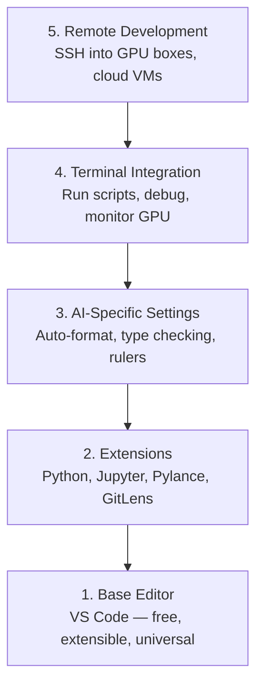

# Thiết lập biên tập viên

> Biên tập viên của bạn là phi công phụ của bạn. Cấu hình nó một lần để nó tránh xa bạn và bắt đầu kéo trọng lượng của nó.

**Loại:** Xây dựng
**Ngôn ngữ:** --
**Kiến thức tiên quyết:** Giai đoạn 0, Bài 01
**Thời lượng:** ~20 phút

## Mục tiêu học tập

- Cài đặt VS Code với các tiện ích mở rộng cần thiết cho Python, Jupyter, linting và SSH từ xa
- Cấu hình định dạng khi lưu, kiểm tra loại và cuộn đầu ra sổ ghi chép cho quy trình làm việc AI
- Thiết lập SSH từ xa để chỉnh sửa và gỡ lỗi mã trên máy GPU từ xa như thể chúng là cục bộ
- Đánh giá các lựa chọn thay thế trình chỉnh sửa (Cursor, Windsurf, Neovim) và sự đánh đổi của chúng đối với công việc AI

## Vấn đề

Bạn sẽ dành hàng nghìn giờ bên trong trình soạn thảo của mình để viết Python, chạy sổ ghi chép, gỡ lỗi vòng lặp training và SSH-ing vào các hộp GPU. Trình chỉnh sửa được định cấu hình sai sẽ biến mọi session thành ma sát: không có tự động hoàn thành, không có gợi ý loại, không có lỗi nội tuyến, định dạng thủ công và quy trình làm việc của thiết bị đầu cuối rườm rà.

Thiết lập phù hợp mất 20 phút. Bỏ qua nó khiến bạn mất 20 phút mỗi ngày.

## Khái niệm

Thiết lập trình chỉnh sửa kỹ thuật AI cần năm điều:



## Tự xây dựng

### Bước 1: Cài đặt VS Code

VS Code là trình chỉnh sửa được đề xuất. Nó miễn phí, chạy trên mọi hệ điều hành, có hỗ trợ máy tính xách tay class Jupyter đầu tiên và hệ sinh thái tiện ích mở rộng bao gồm mọi thứ bạn cần cho công việc AI.

Tải xuống từ [code.visualstudio.com](https://code.visualstudio.com/).

Xác minh từ thiết bị đầu cuối:

```bash
code --version
```

Nếu không tìm thấy `code` trên macOS, hãy mở VS Code, nhấn `Cmd+Shift+P`, nhập "Shell Command" và chọn "Cài đặt lệnh 'mã' trong PATH".

### Bước 2: Cài đặt tiện ích mở rộng cần thiết

Mở thiết bị đầu cuối tích hợp trong VS Code (`Ctrl+` ` ` hoặc '` Cmd+` '') và cài đặt các tiện ích mở rộng quan trọng đối với công việc AI:

```bash
code --install-extension ms-python.python
code --install-extension ms-python.vscode-pylance
code --install-extension ms-toolsai.jupyter
code --install-extension eamodio.gitlens
code --install-extension ms-vscode-remote.remote-ssh
code --install-extension ms-python.debugpy
code --install-extension ms-python.black-formatter
code --install-extension charliermarsh.ruff
```

Những gì mỗi người làm:

| Phần mở rộng | Tại sao |
|-----------|-----|
| Python | Hỗ trợ ngôn ngữ, phát hiện môi trường ảo, run/debug |
| Pylance | Kiểm tra loại nhanh, tự động hoàn thành import độ phân giải |
| Jupyter | Chạy sổ ghi chép bên trong VS Code, trình khám phá biến |
| Ống kính GitLens | Xem ai đã thay đổi cái gì, nội tuyến git đổ lỗi |
| SSH từ xa | Mở một thư mục trên hộp GPU từ xa như thể nó là cục bộ |
| Gỡ lỗi | Gỡ lỗi từng bước cho Python |
| Formatter màu đen | Tự động định dạng khi lưu, phong cách nhất quán |
| Ruff | linting nhanh, phát hiện những lỗi thường gặp |

Tệp `code/.vscode/extensions.json` trong bài học này chứa danh sách đầy đủ các đề xuất. Khi bạn mở thư mục dự án, VS Code sẽ prompt bạn cài đặt chúng.

### Bước 3: Cấu hình cài đặt

Sao chép các cài đặt từ `code/.vscode/settings.json` trong bài học này hoặc áp dụng chúng theo cách thủ công thông qua `Settings > Open Settings (JSON)`.

Các cài đặt chính cho AI hoạt động:

```jsonc
{
    "python.analysis.typeCheckingMode": "basic",
    "editor.formatOnSave": true,
    "editor.rulers": [88, 120],
    "notebook.output.scrolling": true,
    "files.autoSave": "afterDelay"
}
```

Tại sao những điều này lại quan trọng:

- **Kiểm tra kiểu cơ bản**: Bắt các loại đối số sai trước khi chạy. Tiết kiệm thời gian gỡ lỗi tensor hình dạng không khớp và API parameters sai.
- **Định dạng khi lưu**: Không bao giờ nghĩ đến việc định dạng nữa. Black xử lý nó.
- **Thước ở 88 và 120**: Bọc đen ở 88. Điểm đánh dấu 120 cho biết khi các chuỗi tài liệu và nhận xét trở nên quá dài.
- **Cuộn đầu ra máy tính xách tay**: Training vòng lặp in hàng nghìn dòng. Nếu không cuộn, bảng đầu ra sẽ phát nổ.
- **Tự động lưu**: Bạn sẽ quên lưu. training script của bạn sẽ chạy mã cũ. Tự động lưu ngăn chặn điều đó.

### Bước 4: Tích hợp thiết bị đầu cuối

Thiết bị đầu cuối tích hợp của VS Code là nơi bạn chạy training scripts, giám sát GPUs và quản lý môi trường.

Thiết lập nó đúng cách:

```jsonc
{
    "terminal.integrated.defaultProfile.osx": "zsh",
    "terminal.integrated.defaultProfile.linux": "bash",
    "terminal.integrated.fontSize": 13,
    "terminal.integrated.scrollback": 10000
}
```

Các phím tắt hữu ích:

| Hoạt động | macOS | Linux/Windows |
|--------|-------|---------------|
| Chuyển đổi thiết bị đầu cuối | '` Ctrl+` '' | '` Ctrl+` '' |
| Thiết bị đầu cuối mới | `Ctrl+Shift+` ` ` | `Ctrl+Shift+` ` ` |
| Thiết bị đầu cuối tách | `Cmd+\` | `Ctrl+\` |

Thiết bị đầu cuối phân chia rất hữu ích: một để chạy script của bạn, một để giám sát GPU với `nvidia-smi -l 1` hoặc `watch -n 1 nvidia-smi`.

### Bước 5: Phát triển từ xa (SSH vào GPU Box)

Đây là phần mở rộng quan trọng nhất cho công việc AI. Bạn sẽ chạy training trên các máy từ xa (cloud máy ảo, servers phòng thí nghiệm, Lambda, Vast.ai). SSH từ xa cho phép bạn mở hệ thống tệp từ xa, chỉnh sửa tệp, chạy thiết bị đầu cuối và gỡ lỗi như thể mọi thứ đều cục bộ.

Thiết lập:

1. Cài đặt tiện ích mở rộng SSH từ xa (được thực hiện ở Bước 2).
2. Nhấn `Ctrl+Shift+P` (hoặc `Cmd+Shift+P`), nhập "Remote-SSH: Connect to Host".
3. Nhập `user@your-gpu-box-ip`.
4. VS Code tự động cài đặt thành phần server của nó trên máy từ xa.

Để truy cập không cần mật khẩu, hãy thiết lập khóa SSH:

```bash
ssh-keygen -t ed25519 -C "your-email@example.com"
ssh-copy-id user@your-gpu-box-ip
```

Thêm máy chủ vào `~/.ssh/config` để thuận tiện:

```
Host gpu-box
    HostName 203.0.113.50
    User ubuntu
    IdentityFile ~/.ssh/id_ed25519
    ForwardAgent yes
```

Giờ đây, `Remote-SSH: Connect to Host > gpu-box` kết nối ngay lập tức.

## Lựa chọn thay thế

### Con trỏ

[cursor.com](https://cursor.com) là một nhánh VS Code với tính năng tạo mã AI tích hợp. Nó sử dụng cùng một hệ sinh thái mở rộng và định dạng cài đặt. Nếu bạn sử dụng Con trỏ, mọi thứ trong bài học này vẫn được áp dụng. Import cùng một `settings.json` và `extensions.json`.

### Lướt ván buồm

[windsurf.com](https://windsurf.com) là một nhánh VS Code ưu tiên AI khác. Cùng một câu chuyện: cùng một tiện ích mở rộng, cùng định dạng cài đặt, cùng hỗ trợ SSH từ xa.

### Vim/Neovim

Nếu bạn đã sử dụng Vim hoặc Neovim và làm việc hiệu quả trong đó, hãy ở lại đó. Thiết lập tối thiểu cho công việc AI Python:

- **pyright **hoặc **pylsp **để kiểm tra loại (thông qua Mason hoặc cài đặt thủ công)
- **nvim-lspconfig** để tích hợp server ngôn ngữ
- **jupyter-vim** hoặc **molten-nvim** để thực thi giống như máy tính xách tay
- **telescope.nvim **để tìm kiếm file/symbol
- **none-ls.nvim** với màu đen và xù cho formatting/linting

Nếu bạn chưa sử dụng Vim, đừng bắt đầu ngay bây giờ. Đường cong học tập sẽ cạnh tranh với việc học AI kỹ thuật. Sử dụng VS Code.

## Ứng dụng

Với thiết lập này, quy trình làm việc hàng ngày của bạn sẽ giống như:

1. Mở thư mục dự án trong VS Code (hoặc kết nối qua SSH từ xa với hộp GPU).
2. Viết Python trong trình chỉnh sửa với tính năng tự động hoàn thành, gợi ý nhập và lỗi cùng dòng.
3. Chạy sổ ghi chép Jupyter cùng với tiện ích mở rộng Jupyter.
4. Sử dụng thiết bị đầu cuối tích hợp để giám sát training scripts, `uv pip install` và GPU.
5. Xem lại các thay đổi với GitLens trước khi cam kết.

## Bài tập

1. Cài đặt VS Code và tất cả các tiện ích mở rộng được liệt kê trong Bước 2
2. Sao chép các `settings.json` từ bài học này vào config VS Code của bạn
3. Mở tệp Python và xác minh rằng Pylance hiển thị gợi ý kiểu và định dạng Đen khi lưu
4. Nếu bạn có quyền truy cập vào một máy từ xa, hãy thiết lập SSH từ xa và mở một thư mục trên đó

## Thuật ngữ chính

| Thuật ngữ | Những gì mọi người nói | Ý nghĩa thực sự của nó |
|------|----------------|----------------------|
| LSP | "Công cụ tự động hoàn thành" | Giao thức Server ngôn ngữ: một tiêu chuẩn để các biên tập viên nhận thông tin kiểu chữ, hoàn thành và chẩn đoán từ một server ngôn ngữ cụ thể |
| Pylance | "Plugin Python" | Ngôn ngữ Python của Microsoft server sử dụng Pyright để kiểm tra kiểu và IntelliSense |
| SSH từ xa | "Làm việc trên server" | VS Code chạy server nhẹ trên máy từ xa và truyền giao diện người dùng đến trình chỉnh sửa cục bộ của bạn |
| Định dạng khi lưu | "Tự động đẹp hơn" | Trình soạn thảo chạy một formatter (Black, Ruff) mỗi khi bạn lưu, vì vậy kiểu code luôn nhất quán |
