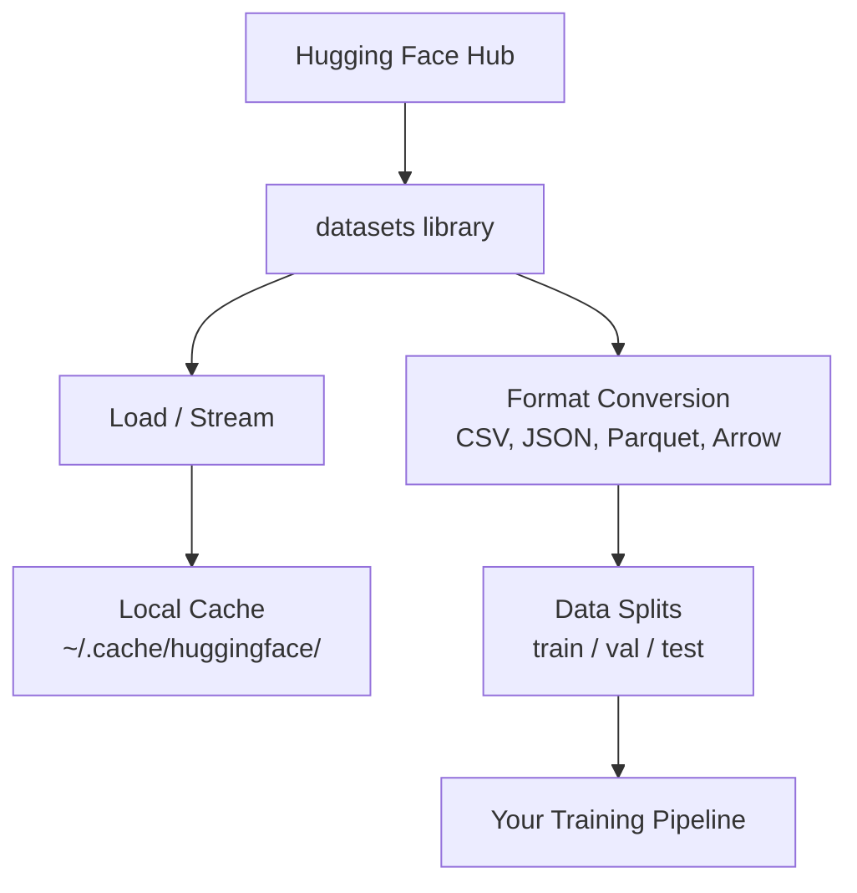

# Quản lý dữ liệu

> Dữ liệu là nhiên liệu. Cách bạn quản lý nó quyết định tốc độ bạn đi.

**Loại:** Xây dựng
**Ngôn ngữ:** Python
**Kiến thức tiên quyết:** Giai đoạn 0, Bài 01
**Thời lượng:** ~45 phút

## Mục tiêu học tập

- Tải, phát trực tuyến và lưu datasets vào bộ nhớ đệm bằng thư viện Hugging Face `datasets`
- Chuyển đổi giữa các định dạng CSV, JSON, Parquet và Arrow và giải thích sự đánh đổi của chúng
- Tạo các phân tách train/validation/test có thể tái tạo với các hạt ngẫu nhiên cố định
- Quản lý các tệp model và dataset lớn bằng `.gitignore`, Git LFS hoặc DVC

## Vấn đề

Mọi dự án AI đều bắt đầu với dữ liệu. Bạn cần tìm datasets, tải xuống, chuyển đổi giữa các định dạng, chia nhỏ chúng để training và đánh giá, đồng thời tạo phiên bản cho các thử nghiệm có thể tái tạo. Thực hiện thủ công mọi lúc đều chậm và dễ xảy ra lỗi. Bạn cần một quy trình làm việc có thể lặp lại.

## Khái niệm



Thư viện Hugging Face `datasets` là cách tiêu chuẩn để tải dữ liệu cho công việc AI. Nó xử lý tải xuống, bộ nhớ đệm, chuyển đổi định dạng và streaming ngay lập tức.

## Tự xây dựng

### Bước 1: Cài đặt thư viện datasets

```bash
pip install datasets huggingface_hub
```

### Bước 2: Tải dataset

```python
from datasets import load_dataset

dataset = load_dataset("imdb")
print(dataset)
print(dataset["train"][0])
```

Thao tác này sẽ tải xuống dataset đánh giá phim IMDB. Sau lần tải xuống đầu tiên, nó tải từ bộ nhớ cache ở `~/.cache/huggingface/datasets/`.

### Bước 3: Phát trực tuyến datasets lớn

Một số datasets quá lớn để vừa với đĩa. Streaming tải chúng từng hàng mà không cần tải xuống toàn bộ.

```python
dataset = load_dataset("wikimedia/wikipedia", "20220301.en", split="train", streaming=True)

for i, example in enumerate(dataset):
    print(example["title"])
    if i >= 4:
        break
```

Streaming cho bạn một `IterableDataset`. Bạn process hàng khi chúng đến. Mức sử dụng bộ nhớ không đổi bất kể kích thước dataset.

### Bước 4: Dataset định dạng

Thư viện `datasets` sử dụng Apache Arrow. Bạn có thể chuyển đổi sang các định dạng khác tùy thuộc vào nhu cầu của pipeline.

```python
dataset = load_dataset("imdb", split="train")

dataset.to_csv("imdb_train.csv")
dataset.to_json("imdb_train.json")
dataset.to_parquet("imdb_train.parquet")
```

So sánh định dạng:

| Định dạng | Kích thước | Tốc độ đọc | Tốt nhất cho |
|--------|------|-----------|----------|
| CSV | Lớn | Chậm | Khả năng đọc của con người, bảng tính |
| JSON | Lớn | Chậm | APIs, dữ liệu lồng nhau |
| Sàn gỗ | Nhỏ | Nhanh chóng | Phân tích, truy vấn cột |
| Mũi tên | Nhỏ | Nhanh nhất | Xử lý trong bộ nhớ (những gì `datasets` sử dụng nội bộ) |

Đối với công việc AI, Parquet là định dạng lưu trữ tốt nhất. Mũi tên là những gì bạn làm việc trong bộ nhớ. CSV và JSON dùng để trao đổi.

### Bước 5: Phân tách dữ liệu

Mỗi dự án ML cần ba lần tách:

- **Huấn luyện**: model học hỏi từ điều này (thường là 80%)
- **Xác thực**: Bạn kiểm tra tiến độ trong training (thường là 10%)
- **Xét nghiệm**: Đánh giá cuối cùng sau khi training xong (thường là 10%)

Một số datasets đến trước khi chia tách. Khi không, hãy tự tách chúng:

```python
dataset = load_dataset("imdb", split="train")

split = dataset.train_test_split(test_size=0.2, seed=42)
train_val = split["train"].train_test_split(test_size=0.125, seed=42)

train_ds = train_val["train"]
val_ds = train_val["test"]
test_ds = split["test"]

print(f"Train: {len(train_ds)}, Val: {len(val_ds)}, Test: {len(test_ds)}")
```

Luôn đặt một hạt giống để có thể tái tạo. Cùng một hạt giống tạo ra cùng một sự phân tách mọi lúc.

### Bước 6: Tải xuống và lưu trữ models

Models là các tệp lớn. Thư viện `huggingface_hub` xử lý việc tải xuống và lưu vào bộ nhớ đệm.

```python
from huggingface_hub import hf_hub_download, snapshot_download

model_path = hf_hub_download(
    repo_id="sentence-transformers/all-MiniLM-L6-v2",
    filename="config.json"
)
print(f"Cached at: {model_path}")

model_dir = snapshot_download("sentence-transformers/all-MiniLM-L6-v2")
print(f"Full model at: {model_dir}")
```

Models bộ nhớ cache vào `~/.cache/huggingface/hub/`. Sau khi tải xuống, chúng sẽ tải ngay lập tức trong các lần chạy tiếp theo.

### Bước 7: Xử lý các tệp lớn

Trọng lượng Model và các datasets lớn không nên đi vào git. Ba lựa chọn:

**Tùy chọn A: .gitignore (đơn giản nhất)**

```
*.bin
*.safetensors
*.pt
*.onnx
data/*.parquet
data/*.csv
models/
```

**Tùy chọn B: Git LFS (theo dõi các tệp lớn trong git)**

```bash
git lfs install
git lfs track "*.bin"
git lfs track "*.safetensors"
git add .gitattributes
```

Git LFS lưu trữ con trỏ trong repo của bạn và các tệp thực tế trên một server riêng biệt. GitHub cung cấp cho bạn 1 GB miễn phí.

**Tùy chọn C: DVC (kiểm soát phiên bản dữ liệu)**

```bash
pip install dvc
dvc init
dvc add data/training_set.parquet
git add data/training_set.parquet.dvc data/.gitignore
git commit -m "Track training data with DVC"
```

DVC tạo các tệp `.dvc` nhỏ trỏ đến dữ liệu của bạn. Bản thân dữ liệu nằm trong S3, GCS hoặc một phần phụ trợ lưu trữ từ xa khác.

| Cách tiếp cận | Độ phức tạp | Tốt nhất cho |
|----------|-----------|----------|
| .gitignore | Thấp | Dự án cá nhân, dữ liệu đã tải xuống bạn có thể tìm nạp lại |
| Git LFS | Trung bình | Các đội chia sẻ trọng lượng model qua git |
| DVC | Cao | Thử nghiệm có thể tái tạo, datasets lớn, nhóm |

Đối với khóa học này, `.gitignore` là đủ. Sử dụng DVC khi bạn cần tái tạo các thí nghiệm chính xác trên các máy.

### Bước 8: Mẫu lưu trữ

**Lưu trữ cục bộ** hoạt động cho datasets dưới ~10 GB. Bộ nhớ đệm HF xử lý điều này tự động.

**Cloud Lưu trữ** dành cho bất kỳ thứ gì lớn hơn hoặc được chia sẻ trên các máy:

```python
import os

local_path = os.path.expanduser("~/.cache/huggingface/datasets/")

# s3_path = "s3://my-bucket/datasets/"
# gcs_path = "gs://my-bucket/datasets/"
```

DVC tích hợp trực tiếp với S3 và GCS:

```bash
dvc remote add -d myremote s3://my-bucket/dvc-store
dvc push
```

Đối với khóa học này, bộ nhớ cục bộ là đủ. Cloud lưu trữ trở nên phù hợp khi bạn fine-tune trên các phiên bản GPU từ xa.

## Datasets được sử dụng trong khóa học này

| Dataset | Bài học | Kích thước | Nó dạy gì |
|---------|---------|------|----------------|
| IMDB | Tokenization, phân loại | 84 MB | Thông tin cơ bản về phân loại văn bản |
| Văn bản wiki | Mô hình ngôn ngữ | 181 MB | Dự đoán token tiếp theo |
| SQuAD | Hệ thống QA | 35 MB | Trả lời câu hỏi, spans |
| Thu thập dữ liệu chung (tập hợp con) | Embeddings | Khác nhau | Xử lý văn bản quy mô lớn |
| MNIST | Khái niệm cơ bản về tầm nhìn | 21 MB | Kiến thức cơ bản về phân loại hình ảnh |
| COCO (tập con) | Đa phương thức | Khác nhau | Cặp hình ảnh-văn bản |

Bạn không cần phải tải xuống tất cả những thứ này ngay bây giờ. Mỗi bài học chỉ định những gì nó cần.

## Ứng dụng

Chạy script tiện ích để xác minh mọi thứ hoạt động:

```bash
python code/data_utils.py
```

Thao tác này sẽ tải xuống một dataset nhỏ, chuyển đổi, tách nó và in một bản tóm tắt.

## Sản phẩm bàn giao

Bài học này tạo ra:
- `code/data_utils.py` - tiện ích tải dữ liệu và bộ nhớ đệm có thể tái sử dụng
- `outputs/prompt-data-helper.md` - prompt để tìm dataset phù hợp cho một nhiệm vụ

## Bài tập

1. Tải `glue` dataset với `mrpc` config và kiểm tra 5 ví dụ đầu tiênamples
2. Phát trực tuyến `c4` dataset và đếm số lượng ví dụ bạn có thể process trong 10 giây
3. Chuyển đổi dataset sang Parquet và so sánh kích thước tệp với CSV
4. Tạo một phần 70/15/15 train/val/test với một hạt giống cố định và xác minh kích thước

## Thuật ngữ chính

| Thuật ngữ | Những gì mọi người nói | Ý nghĩa thực sự của nó |
|------|----------------|----------------------|
| Dataset tách | "Training dữ liệu" | Tập con được đặt tên (train/val/test) được sử dụng ở các giai đoạn khác nhau của vòng đời ML |
| Streaming | "Tải nó một cách lười biếng" | Xử lý dữ liệu từng hàng từ nguồn từ xa mà không cần tải xuống toàn bộ dataset |
| Sàn gỗ | "CSV nén" | Định dạng tệp cột được tối ưu hóa cho các truy vấn phân tích và hiệu quả lưu trữ |
| Mũi tên | "Khung dữ liệu nhanh" | Định dạng cột trong bộ nhớ được thư viện datasets sử dụng nội bộ để đọc không sao chép |
| Git LFS | "Git cho các tệp lớn" | Một tiện ích mở rộng lưu trữ các tệp lớn bên ngoài git repo trong khi vẫn giữ con trỏ trong kiểm soát phiên bản |
| DVC | "Git cho dữ liệu" | Hệ thống kiểm soát phiên bản cho datasets và models tích hợp với lưu trữ cloud |
| Bộ nhớ cache | "Đã tải xuống" | Bản sao cục bộ của dữ liệu đã tìm nạp trước đó, được lưu trữ ở ~/.cache/huggingface/ theo mặc định |
