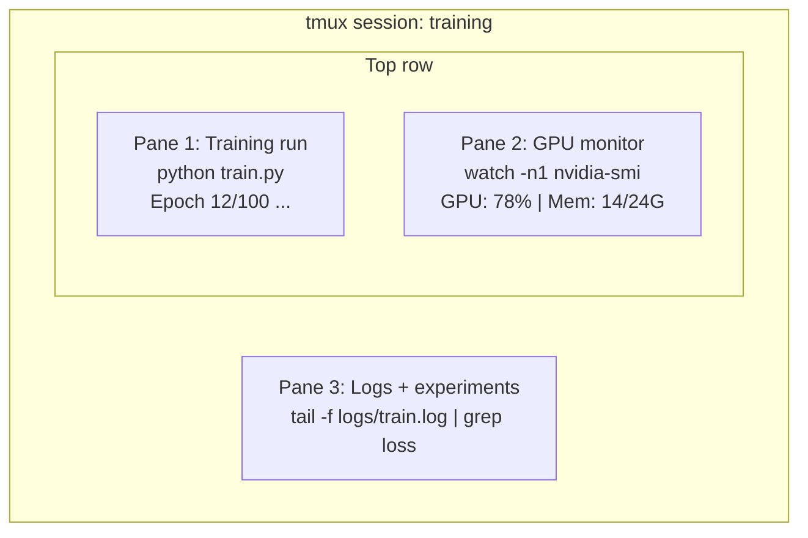

# Thiết bị đầu cuối & vỏ

> Nhà ga là nơi các kỹ sư AI sinh sống. Hãy thoải mái ở đây.

**Loại:** Học
**Ngôn ngữ:** --
**Kiến thức tiên quyết:** Giai đoạn 0, Bài 01
**Thời lượng:** ~35 phút

## Mục tiêu học tập

- Sử dụng đường ống, chuyển hướng và `grep` để lọc và process training nhật ký từ dòng lệnh
- Tạo sessions tmux liên tục với nhiều ngăn để giám sát training và GPU đồng thời
- Giám sát hệ thống và tài nguyên GPU bằng `htop`, `nvtop` và `nvidia-smi`
- Truyền tệp giữa các máy cục bộ và từ xa bằng SSH, `scp` và `rsync`

## Vấn đề

Bạn sẽ dành nhiều thời gian trong thiết bị đầu cuối hơn bất kỳ trình chỉnh sửa nào. Training chạy, giám sát GPU, đuôi nhật ký, sessions SSH từ xa, quản lý môi trường. Mọi quy trình làm việc AI đều chạm vào vỏ. Nếu bạn chậm ở đây, bạn chậm ở khắp mọi nơi.

Bài học này bao gồm các skills đầu cuối quan trọng đối với công việc AI. Không có lịch sử của Unix. Không đi sâu vào kịch bản Bash. Chỉ những gì bạn cần.

## Khái niệm



Ba thứ chạy cùng một lúc. Một thiết bị đầu cuối. Bạn có thể tháo rời, về nhà, SSH trở lại và gắn lại. training tiếp tục chạy.

## Tự xây dựng

### Bước 1: Biết vỏ của bạn

Kiểm tra xem bạn đang chạy shell nào:

```bash
echo $SHELL
```

Hầu hết các hệ thống sử dụng `bash` hoặc `zsh`. Cả hai đều hoạt động tốt. Các lệnh trong khóa học này hoạt động trong một trong hai.

Những điều chính cần biết:

```bash
# Move around
cd ~/projects/ai-engineering-from-scratch
pwd
ls -la

# History search (most useful shortcut you'll learn)
# Ctrl+R then type part of a previous command
# Press Ctrl+R again to cycle through matches

# Clear terminal
clear   # or Ctrl+L

# Cancel a running command
# Ctrl+C

# Suspend a running command (resume with fg)
# Ctrl+Z
```

### Bước 2: Đường ống và chuyển hướng

Đường ống kết nối các lệnh với nhau. Đây là cách bạn process nhật ký, đầu ra bộ lọc và các công cụ chuỗi. Bạn sẽ sử dụng điều này liên tục.

```bash
# Count how many times "loss" appears in a log
cat train.log | grep "loss" | wc -l

# Extract just the loss values from training output
grep "loss:" train.log | awk '{print $NF}' > losses.txt

# Watch a log file update in real time, filtering for errors
tail -f train.log | grep --line-buffered "ERROR"

# Sort experiments by final accuracy
grep "final_accuracy" results/*.log | sort -t= -k2 -n -r

# Redirect stdout and stderr to separate files
python train.py > output.log 2> errors.log

# Redirect both to the same file
python train.py > train_full.log 2>&1
```

Ba chuyển hướng bạn cần:

| Biểu tượng | Chức năng |
|--------|-------------|
| `>` | Ghi stdout vào tệp (ghi đè) |
| `>>` | Thêm stdout vào file |
| `2>` | Ghi stderr vào tệp |
| `2>&1` | Gửi stderr đến cùng một nơi với stdout |
| `\ | ` | Gửi stdout của một lệnh dưới dạng stdin đến lệnh tiếp theo |

### Bước 3: processes nền

Training lần chạy mất hàng giờ. Bạn không muốn để thiết bị đầu cuối của mình mở toàn bộ thời gian.

```bash
# Run in background (output still goes to terminal)
python train.py &

# Run in background, immune to hangup (closing terminal won't kill it)
nohup python train.py > train.log 2>&1 &

# Check what's running in background
jobs
ps aux | grep train.py

# Bring a background job to foreground
fg %1

# Kill a background process
kill %1
# or find its PID and kill that
kill $(pgrep -f "train.py")
```

Sự khác biệt giữa `&`, `nohup` và `screen`/`tmux`:

| Phương pháp | Sống sót khi đóng thiết bị đầu cuối? | Có thể gắn lại? |
|--------|-------------------------|---------------|
| `command &` | Không | Không |
| `nohup command &` | Có | Không (kiểm tra tệp nhật ký) |
| `screen` / `tmux` | Có | Có |

Đối với bất kỳ thứ gì lâu hơn vài phút, hãy sử dụng tmux.

### Bước 4: tmux

TMUX cho phép bạn tạo sessions đầu cuối liên tục với nhiều ngăn. Đây là công cụ hữu ích nhất để quản lý các lần chạy training.

```bash
# Install
# macOS
brew install tmux
# Ubuntu
sudo apt install tmux

# Start a named session
tmux new -s training

# Split horizontally
# Ctrl+B then "

# Split vertically
# Ctrl+B then %

# Navigate between panes
# Ctrl+B then arrow keys

# Detach (session keeps running)
# Ctrl+B then d

# Reattach
tmux attach -t training

# List sessions
tmux ls

# Kill a session
tmux kill-session -t training
```

Quy trình làm việc AI điển hình session:

```bash
tmux new -s train

# Pane 1: start training
python train.py --epochs 100 --lr 1e-4

# Ctrl+B, " to split, then run GPU monitor
watch -n1 nvidia-smi

# Ctrl+B, % to split vertically, tail the logs
tail -f logs/experiment.log

# Now detach with Ctrl+B, d
# SSH out, go get coffee, come back
# tmux attach -t train
```

### Bước 5: Giám sát bằng htop và nvtop

```bash
# System processes (better than top)
htop

# GPU processes (if you have NVIDIA GPU)
# Install: sudo apt install nvtop (Ubuntu) or brew install nvtop (macOS)
nvtop

# Quick GPU check without nvtop
nvidia-smi

# Watch GPU usage update every second
watch -n1 nvidia-smi

# See which processes are using the GPU
nvidia-smi --query-compute-apps=pid,name,used_memory --format=csv
```

`htop` liên kết phím, bạn sẽ sử dụng:
- `F6` hoặc `>` để sắp xếp theo cột (sắp xếp theo bộ nhớ để tìm rò rỉ bộ nhớ)
- `F5` để chuyển đổi chế độ xem cây (xem processes con)
- `F9` để giết một process
- `/` để tìm kiếm tên process

### Bước 6: SSH cho hộp GPU từ xa

Khi bạn thuê một cloud GPU (Lambda, RunPod, Vast.ai), bạn kết nối qua SSH.

```bash
# Basic connection
ssh user@gpu-box-ip

# With a specific key
ssh -i ~/.ssh/my_gpu_key user@gpu-box-ip

# Copy files to remote
scp model.pt user@gpu-box-ip:~/models/

# Copy files from remote
scp user@gpu-box-ip:~/results/metrics.json ./

# Sync a whole directory (faster for many files)
rsync -avz ./data/ user@gpu-box-ip:~/data/

# Port forward (access remote Jupyter/TensorBoard locally)
ssh -L 8888:localhost:8888 user@gpu-box-ip
# Now open localhost:8888 in your browser

# SSH config for convenience
# Add to ~/.ssh/config:
# Host gpu
#     HostName 192.168.1.100
#     User ubuntu
#     IdentityFile ~/.ssh/gpu_key
#
# Then just:
# ssh gpu
```

### Bước 7: Bí danh hữu ích cho công việc AI

Thêm những thông tin này vào `~/.bashrc` hoặc `~/.zshrc` của bạn:

```bash
source phases/00-setup-and-tooling/10-terminal-and-shell/code/shell_aliases.sh
```

Hoặc sao chép những cái bạn muốn. Các bí danh chính:

```bash
# GPU status at a glance
alias gpu='nvidia-smi --query-gpu=index,name,utilization.gpu,memory.used,memory.total,temperature.gpu --format=csv,noheader'

# Kill all Python training processes
alias killtraining='pkill -f "python.*train"'

# Quick virtual environment activate
alias ae='source .venv/bin/activate'

# Watch training loss
alias watchloss='tail -f logs/*.log | grep --line-buffered "loss"'
```

Xem `code/shell_aliases.sh` để biết bộ đầy đủ.

### Bước 8: Các mẫu thiết bị đầu cuối AI phổ biến

Những điều này xuất hiện nhiều lần trong thực tế:

```bash
# Run training, log everything, notify when done
python train.py 2>&1 | tee train.log; echo "DONE" | mail -s "Training complete" you@email.com

# Compare two experiment logs side by side
diff <(grep "accuracy" exp1.log) <(grep "accuracy" exp2.log)

# Find the largest model files (clean up disk space)
find . -name "*.pt" -o -name "*.safetensors" | xargs du -h | sort -rh | head -20

# Download a model from Hugging Face
wget https://huggingface.co/model/resolve/main/model.safetensors

# Untar a dataset
tar xzf dataset.tar.gz -C ./data/

# Count lines in all Python files (see how big your project is)
find . -name "*.py" | xargs wc -l | tail -1

# Check disk space (training data fills disks fast)
df -h
du -sh ./data/*

# Environment variable check before training
env | grep -i cuda
env | grep -i torch
```

## Ứng dụng

Đây là khi mỗi công cụ phát huy tác dụng trong khóa học này:

| Công cụ | Khi bạn sử dụng nó |
|------|----------------|
| TMUX | Mỗi training chạy (Giai đoạn 3+) |
| `tail -f` + `grep` | Giám sát nhật ký training |
| `nohup` / `&` | Nhiệm vụ nền nhanh |
| `htop` / `nvtop` | Gỡ lỗi training chậm, lỗi OOM |
| SSH + `rsync` | Làm việc trên cloud GPUs |
| Đường ống + chuyển hướng | Xử lý kết quả thí nghiệm |
| Bí danh | Tiết kiệm thời gian cho các lệnh lặp đi lặp lại |

## Bài tập

1. Cài đặt tmux, tạo một session có ba ngăn và chạy `htop` trong một ngăn `watch -n1 date` trong một ngăn khác và một Python script trong ngăn thứ ba. Tháo rời và gắn lại.
2. Thêm bí danh từ `code/shell_aliases.sh` vào config vỏ của bạn và tải lại bằng `source ~/.zshrc` (hoặc `~/.bashrc`).
3. Tạo nhật ký training giả bằng `for i in $(seq 1 100); do echo "epoch $i loss: $(echo "scale=4; 1/$i" | bc)"; sleep 0.1; done > fake_train.log` và sau đó sử dụng `grep`, `tail` và `awk` để chỉ trích xuất các giá trị loss.
4. Thiết lập mục nhập SSH config cho server bạn có quyền truy cập (hoặc sử dụng `localhost` để thực hành cú pháp).

## Thuật ngữ chính

| Thuật ngữ | Những gì mọi người nói | Ý nghĩa thực sự của nó |
|------|----------------|----------------------|
| Vỏ | "Thiết bị đầu cuối" | Chương trình diễn giải các lệnh của bạn (bash, zsh, fish) |
| TMUX | "Bộ ghép kênh đầu cuối" | Một chương trình cho phép bạn chạy nhiều sessions đầu cuối bên trong một cửa sổ và detach/reattach |
| Ống | "Quán bar" | Hàm '\ | ' toán tử gửi đầu ra của một lệnh dưới dạng đầu vào đến một toán tử khác |
| PID | "ID Process" | Một số duy nhất được gán cho mọi process đang chạy, được sử dụng để theo dõi hoặc tiêu diệt nó |
| Nohup | "Không cúp máy" | Chạy lệnh miễn nhiễm với tín hiệu cúp máy, vì vậy việc đóng thiết bị đầu cuối sẽ không giết chết nó |
| SSH | "Kết nối với server" | Secure Shell, một giao thức được mã hóa để chạy các lệnh trên máy từ xa |
