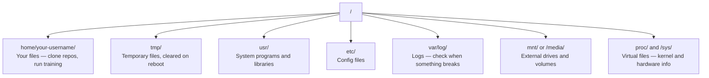

# Linux cho AI

> Hầu hết AI chạy trên Linux. Bạn cần biết đủ để không bị mắc kẹt.

**Loại:** Học
**Ngôn ngữ:** --
**Kiến thức tiên quyết:** Giai đoạn 0, Bài 01
**Thời lượng:** ~30 phút

## Mục tiêu học tập

- Điều hướng hệ thống tệp Linux và thực hiện các thao tác tệp cần thiết từ dòng lệnh
- Quản lý quyền tệp bằng `chmod` và `chown` để giải quyết lỗi "Quyền bị từ chối"
- Cài đặt các gói hệ thống với `apt` và thiết lập hộp GPU mới cho công việc AI
- Xác định sự khác biệt giữa các Linux macOS thường gây khó khăn cho các nhà phát triển làm việc trên máy từ xa

## Vấn đề

Bạn phát triển trên macOS hoặc Windows. Nhưng thời điểm bạn SSH vào hộp cloud GPU, thuê phiên bản Lambda hoặc quay máy EC2, bạn sẽ đến Ubuntu. Thiết bị đầu cuối là giao diện duy nhất của bạn. Không có Finder, không có Explorer, không có GUI. Nếu bạn không thể điều hướng hệ thống tệp, cài đặt gói và quản lý processes từ dòng lệnh, bạn sẽ bị mắc kẹt khi phải trả tiền cho GPU giờ nhàn rỗi trong khi tìm kiếm trên Google "cách giải nén tệp trong Linux".

Đây là một hướng dẫn sinh tồn. Nó bao gồm chính xác những gì bạn cần để vận hành trên máy Linux từ xa cho công việc AI. Không có gì hơn.

## Bố cục hệ thống tệp

Linux sắp xếp mọi thứ dưới một `/` gốc duy nhất. Không có `C:\` hay `/Volumes`. Các thư mục bạn sẽ thực sự chạm vào:



Thư mục chính của bạn là `~` hoặc `/home/your-username`. Hầu hết mọi thứ bạn làm đều xảy ra ở đây.

## Các lệnh cần thiết

Đây là 15 lệnh bao gồm 95% những gì bạn sẽ làm trên hộp GPU từ xa.

### Di chuyển xung quanh

```bash
pwd                         # Where am I?
ls                          # What's here?
ls -la                      # What's here, including hidden files with details?
cd /path/to/dir             # Go there
cd ~                        # Go home
cd ..                       # Go up one level
```

### Tệp và thư mục

```bash
mkdir my-project            # Create a directory
mkdir -p a/b/c              # Create nested directories in one shot

cp file.txt backup.txt      # Copy a file
cp -r src/ src-backup/      # Copy a directory (recursive)

mv old.txt new.txt          # Rename a file
mv file.txt /tmp/           # Move a file

rm file.txt                 # Delete a file (no trash, it's gone)
rm -rf my-dir/              # Delete a directory and everything inside
```

`rm -rf` là vĩnh viễn. Không có hoàn tác. Kiểm tra kỹ đường dẫn trước khi nhấn enter.

### Đọc tệp

```bash
cat file.txt                # Print entire file
head -20 file.txt           # First 20 lines
tail -20 file.txt           # Last 20 lines
tail -f log.txt             # Follow a log file in real time (Ctrl+C to stop)
less file.txt               # Scroll through a file (q to quit)
```

### Tìm kiếm

```bash
grep "error" training.log           # Find lines containing "error"
grep -r "learning_rate" .           # Search all files in current directory
grep -i "cuda" config.yaml          # Case-insensitive search

find . -name "*.py"                 # Find all Python files under current dir
find . -name "*.ckpt" -size +1G     # Find checkpoint files larger than 1GB
```

## Quyền

Mỗi tệp trong Linux đều có chủ sở hữu và các bit quyền. Bạn sẽ gặp phải điều này khi scripts không thực thi hoặc bạn không thể ghi vào thư mục.

```bash
ls -l train.py
# -rwxr-xr-- 1 user group 2048 Mar 19 10:00 train.py
#  ^^^             owner permissions: read, write, execute
#     ^^^          group permissions: read, execute
#        ^^        everyone else: read only
```

Các bản sửa lỗi thường gặp:

```bash
chmod +x train.sh           # Make a script executable
chmod 755 deploy.sh         # Owner: full, others: read+execute
chmod 644 config.yaml       # Owner: read+write, others: read only

chown user:group file.txt   # Change who owns a file (needs sudo)
```

Khi có nội dung "Quyền bị từ chối", đó hầu như luôn là vấn đề về quyền. `chmod +x` hoặc `sudo` sẽ khắc phục hầu hết các trường hợp.

## Quản lý gói (apt)

Ubuntu sử dụng `apt`. Đây là cách bạn cài đặt phần mềm cấp hệ thống.

```bash
sudo apt update             # Refresh the package list (always do this first)
sudo apt install -y htop    # Install a package (-y skips confirmation)
sudo apt install -y build-essential  # C compiler, make, etc. Needed by many Python packages
sudo apt install -y tmux    # Terminal multiplexer (keep sessions alive after disconnect)

apt list --installed        # What's installed?
sudo apt remove htop        # Uninstall
```

Các gói phổ biến bạn sẽ cài đặt trên hộp GPU mới:

```bash
sudo apt update && sudo apt install -y \
    build-essential \
    git \
    curl \
    wget \
    tmux \
    htop \
    unzip \
    python3-venv
```

## Người dùng và sudo

Bạn thường đăng nhập với tư cách là người dùng thông thường. Một số hoạt động cần quyền truy cập root (quản trị viên).

```bash
whoami                      # What user am I?
sudo command                # Run a single command as root
sudo su                     # Become root (exit to go back, use sparingly)
```

Trên cloud GPU trường hợp, bạn thường là người dùng duy nhất và đã có quyền truy cập sudo. Đừng chạy mọi thứ dưới dạng gốc. Chỉ sử dụng sudo khi cần thiết.

## Processes và systemd

Khi training của bạn bị treo hoặc bạn cần kiểm tra nội dung đang chạy:

```bash
htop                        # Interactive process viewer (q to quit)
ps aux | grep python        # Find running Python processes
kill 12345                  # Gracefully stop process with PID 12345
kill -9 12345               # Force kill (use when graceful doesn't work)
nvidia-smi                  # GPU processes and memory usage
```

systemd quản lý các dịch vụ (daemons nền). Bạn sẽ sử dụng nó nếu chạy inference servers:

```bash
sudo systemctl start nginx          # Start a service
sudo systemctl stop nginx           # Stop it
sudo systemctl restart nginx        # Restart it
sudo systemctl status nginx         # Check if it's running
sudo systemctl enable nginx         # Start automatically on boot
```

## Dung lượng đĩa

GPU hộp thường có dung lượng đĩa hạn chế. Models và datasets lấp đầy nó nhanh chóng.

```bash
df -h                       # Disk usage for all mounted drives
df -h /home                 # Disk usage for /home specifically

du -sh *                    # Size of each item in current directory
du -sh ~/.cache             # Size of your cache (pip, huggingface models land here)
du -sh /data/checkpoints/   # Check how big your checkpoints are

# Find the biggest space hogs
du -h --max-depth=1 / 2>/dev/null | sort -hr | head -20
```

Tiết kiệm không gian chung:

```bash
# Clear pip cache
pip cache purge

# Clear apt cache
sudo apt clean

# Remove old checkpoints you don't need
rm -rf checkpoints/epoch_01/ checkpoints/epoch_02/
```

## Kết nối mạng

Bạn sẽ tải xuống models, chuyển tệp và nhấn APIs từ dòng lệnh.

```bash
# Download files
wget https://example.com/model.bin                   # Download a file
curl -O https://example.com/data.tar.gz              # Same thing with curl
curl -s https://api.example.com/health | python3 -m json.tool  # Hit an API, pretty-print JSON

# Transfer files between machines
scp model.bin user@remote:/data/                     # Copy file to remote machine
scp user@remote:/data/results.csv .                  # Copy file from remote to local
scp -r user@remote:/data/checkpoints/ ./local-dir/   # Copy directory

# Sync directories (faster than scp for large transfers, resumes on failure)
rsync -avz --progress ./data/ user@remote:/data/
rsync -avz --progress user@remote:/results/ ./results/
```

Sử dụng `rsync` trên `scp` cho bất cứ thứ gì lớn. Nó chỉ chuyển các byte đã thay đổi và xử lý các kết nối bị gián đoạn.

## tmux: Giữ Sessions sống

Khi bạn SSH vào hộp từ xa, việc đóng máy tính xách tay sẽ giết chết training chạy của bạn. TMUX ngăn chặn điều này.

```bash
tmux new -s train           # Start a new session named "train"
# ... start your training, then:
# Ctrl+B, then D            # Detach (training keeps running)

tmux ls                     # List sessions
tmux attach -t train        # Reattach to session

# Inside tmux:
# Ctrl+B, then %            # Split pane vertically
# Ctrl+B, then "            # Split pane horizontally
# Ctrl+B, then arrow keys   # Switch between panes
```

Luôn chạy các công việc training dài bên trong tmux. Luôn luôn.

## WSL2 cho người dùng Windows

Nếu bạn đang sử dụng Windows, WSL2 cung cấp cho bạn một môi trường Linux thực sự mà không cần khởi động kép.

```bash
# In PowerShell (admin)
wsl --install -d Ubuntu-24.04

# After restart, open Ubuntu from Start menu
sudo apt update && sudo apt upgrade -y
```

WSL2 chạy một hạt nhân Linux thực sự. Mọi thứ trong bài học này đều hoạt động bên trong nó. Các tệp Windows của bạn được `/mnt/c/Users/YourName/` từ bên trong WSL.

GPU truyền qua hoạt động với trình điều khiển NVIDIA được cài đặt ở phía Windows. Cài đặt trình điều khiển Windows NVIDIA (không phải trình điều khiển Linux) và CUDA sẽ có sẵn bên trong WSL2.

## Gotchas: macOS đến Linux

Những điều sẽ khiến bạn vấp ngã nếu bạn đến từ macOS:

| macOS | Linux | Ghi chú |
|-------|-------|-------|
| `brew install` | `sudo apt install` | Đôi khi tên gói khác nhau. `brew install htop` vs `sudo apt install htop` hoạt động giống nhau, nhưng `brew install readline` vs `sudo apt install libreadline-dev` thì không. |
| `open file.txt` | `xdg-open file.txt` | Nhưng bạn sẽ không có GUI trên hộp điều khiển từ xa. Sử dụng `cat` hoặc `less`. |
| `pbcopy` / `pbpaste` | Không có sẵn | Pipe to/from khay nhớ tạm không tồn tại qua SSH. |
| `~/.zshrc` | `~/.bashrc` | macOS mặc định là zsh. Hầu hết Linux servers sử dụng bash. |
| `/opt/homebrew/` | `/usr/bin/`, `/usr/local/bin/` | Nhị phân sống ở những nơi khác nhau. |
| `sed -i '' 's/a/b/' file` | `sed -i 's/a/b/' file` | macOS sed cần một chuỗi trống sau `-i`. Linux không. |
| Hệ thống tệp không phân biệt chữ hoa chữ thường | Hệ thống tệp phân biệt chữ hoa chữ thường | `Model.py` và `model.py` là hai tệp khác nhau trên Linux. |
| Kết thúc dòng `\n` | Kết thúc dòng `\n` | Giống nhau. Nhưng Windows sử dụng `\r\n`, phá vỡ scripts. Chạy `dos2unix` để khắc phục. |

## Thẻ tham khảo nhanh

```
Navigation:     pwd, ls, cd, find
Files:          cp, mv, rm, mkdir, cat, head, tail, less
Search:         grep, find
Permissions:    chmod, chown, sudo
Packages:       apt update, apt install
Processes:      htop, ps, kill, nvidia-smi
Services:       systemctl start/stop/restart/status
Disk:           df -h, du -sh
Network:        curl, wget, scp, rsync
Sessions:       tmux new/attach/detach
```

## Bài tập

1. SSH vào bất kỳ máy Linux nào (hoặc mở WSL2) và điều hướng đến thư mục chính của bạn. Tạo một thư mục dự án, tạo ba tệp trống bên trong nó bằng `touch`, sau đó liệt kê chúng bằng `ls -la`.
2. Cài đặt `htop` với apt, chạy nó và xác định process nào đang sử dụng nhiều bộ nhớ nhất.
3. Khởi động một session tmux, chạy `sleep 300` bên trong nó, tháo ra, liệt kê sessions và đính kèm lại.
4. Sử dụng `df -h` để kiểm tra dung lượng ổ đĩa còn trống, sau đó sử dụng `du -sh ~/.cache/*` để tìm nội dung đang chiếm dung lượng trong bộ nhớ đệm của bạn.
5. Chuyển tệp từ máy cục bộ của bạn sang máy từ xa bằng `scp`, sau đó thực hiện chuyển tương tự với `rsync` và so sánh trải nghiệm.
