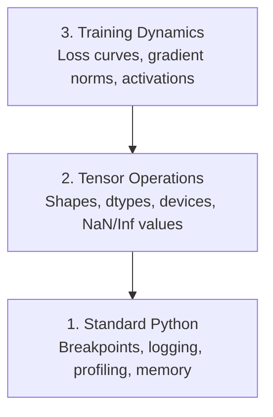

# Gỡ lỗi và lập hồ sơ

> Lỗi AI tồi tệ nhất không gặp sự cố. Họ âm thầm huấn luyện về rác và báo cáo một đường cong loss tuyệt đẹp.

**Loại:** Xây dựng
**Ngôn ngữ:** Python
**Kiến thức tiên quyết:** Bài 1 (Môi trường nhà phát triển), cơ bản PyTorch quen thuộc
**Thời lượng:** ~60 phút

## Mục tiêu học tập

- Sử dụng `breakpoint()` và `debug_print` có điều kiện để kiểm tra các hình dạng tensor, dtypes và giá trị NaN giữa training
- Cấu hình training vòng lặp với `cProfile`, `line_profiler` và `tracemalloc` để tìm nút thắt cổ chai
- Phát hiện các lỗi AI phổ biến: hình dạng không khớp, loss NaN, rò rỉ dữ liệu và tensors sai thiết bị
- Thiết lập TensorBoard để trực quan hóa các đường cong loss, biểu đồ trọng lượng và phân phối gradient

## Vấn đề

Mã AI không thành công khác với mã thông thường. Một web app gặp sự cố với một stack trace. Một vòng lặp training được định cấu hình sai sẽ chạy trong 8 giờ, đốt cháy 200 đô la trong thời gian GPU và tạo ra một model dự đoán giá trị trung bình của mọi đầu vào. Mã không bao giờ bị lỗi. Lỗi là một tensor trên nhầm thiết bị, một `.detach()` bị quên hoặc nhãn bị rò rỉ vào features.

Bạn cần các công cụ gỡ lỗi để phát hiện những lỗi thầm lặng này trước khi chúng lãng phí thời gian và tính toán của bạn.

## Khái niệm

AI gỡ lỗi hoạt động ở ba cấp độ:



Hầu hết mọi người nhảy thẳng lên cấp độ 3 (nhìn chằm chằm vào TensorBoard). Nhưng 80% bọ AI sống ở cấp độ 1 và 2.

## Tự xây dựng

### Phần 1: Gỡ lỗi in (Có, nó hoạt động)

Gỡ lỗi in bị loại bỏ. Nó không nên. Đối với mã tensor, câu lệnh in được nhắm mục tiêu đánh bại việc thực hiện trình gỡ lỗi vì bạn cần xem tất cả các hình dạng, dtypes và phạm vi giá trị cùng một lúc.

```python
def debug_print(name, tensor):
    print(f"{name}: shape={tensor.shape}, dtype={tensor.dtype}, "
          f"device={tensor.device}, "
          f"min={tensor.min().item():.4f}, max={tensor.max().item():.4f}, "
          f"mean={tensor.mean().item():.4f}, "
          f"has_nan={tensor.isnan().any().item()}")
```

Gọi điều này sau mỗi hoạt động đáng ngờ. Khi tìm thấy lỗi, hãy xóa các bản in. Đơn giản.

### Phần 2: Python Debugger (pdb và điểm ngắt)

Trình gỡ lỗi tích hợp bị đánh giá thấp cho công việc AI. Thả `breakpoint()` vào vòng lặp training của bạn và kiểm tra tensors một cách tương tác.

```python
def training_step(model, batch, criterion, optimizer):
    inputs, labels = batch
    outputs = model(inputs)
    loss = criterion(outputs, labels)

    if loss.item() > 100 or torch.isnan(loss):
        breakpoint()

    loss.backward()
    optimizer.step()
```

Khi trình gỡ lỗi đưa bạn vào, các lệnh hữu ích:

- `p outputs.shape` để kiểm tra hình dạng
- `p loss.item()` để xem giá trị loss
- `p torch.isnan(outputs).sum()` để đếm NaN
- `p model.fc1.weight.grad` để kiểm tra gradients
- `c` tiếp tục, `q` bỏ cuộc

Đây là gỡ lỗi có điều kiện. Bạn chỉ dừng lại khi có điều gì đó không ổn. Đối với training chạy 10.000 bước, điều đó rất quan trọng.

### Phần 3: Ghi nhật ký số Python

Thay thế các câu lệnh in bằng ghi nhật ký khi quá trình gỡ lỗi của bạn vượt quá khả năng kiểm tra nhanh.

```python
import logging

logging.basicConfig(
    level=logging.INFO,
    format="%(asctime)s [%(levelname)s] %(message)s",
    handlers=[
        logging.FileHandler("training.log"),
        logging.StreamHandler()
    ]
)
logger = logging.getLogger(__name__)

logger.info("Starting training: lr=%.4f, batch_size=%d", lr, batch_size)
logger.warning("Loss spike detected: %.4f at step %d", loss.item(), step)
logger.error("NaN loss at step %d, stopping", step)
```

Ghi nhật ký cung cấp cho bạn dấu thời gian, mức độ nghiêm trọng và đầu ra tệp. Khi chạy training không thành công vào lúc 3 giờ sáng, bạn muốn có tệp nhật ký, không phải đầu ra đầu cuối cuộn ra khỏi màn hình.

### Phần 4: Phần mã thời gian

Biết thời gian đi đâu là bước đầu tiên để tối ưu hóa.

```python
import time

class Timer:
    def __init__(self, name=""):
        self.name = name

    def __enter__(self):
        self.start = time.perf_counter()
        return self

    def __exit__(self, *args):
        elapsed = time.perf_counter() - self.start
        print(f"[{self.name}] {elapsed:.4f}s")

with Timer("data loading"):
    batch = next(dataloader_iter)

with Timer("forward pass"):
    outputs = model(batch)

with Timer("backward pass"):
    loss.backward()
```

Phát hiện phổ biến: tải dữ liệu mất 60% thời gian training. Bản sửa lỗi là `num_workers > 0` trong DataLoader của bạn, không phải GPU nhanh hơn.

### Phần 5: cProfile và line_profiler

Khi bạn cần nhiều hơn bộ hẹn giờ thủ công:

```bash
python -m cProfile -s cumtime train.py
```

Điều này hiển thị mọi lệnh gọi hàm được sắp xếp theo thời gian tích lũy. Đối với lược tả từng dòng:

```bash
pip install line_profiler
```

```python
@profile
def train_step(model, data, target):
    output = model(data)
    loss = F.cross_entropy(output, target)
    loss.backward()
    return loss

# Run with: kernprof -l -v train.py
```

### Phần 6: Lập hồ sơ bộ nhớ

#### CPU Bộ nhớ với tracemalloc

```python
import tracemalloc

tracemalloc.start()

# your code here
model = build_model()
data = load_dataset()

snapshot = tracemalloc.take_snapshot()
top_stats = snapshot.statistics("lineno")
for stat in top_stats[:10]:
    print(stat)
```

#### CPU Bộ nhớ với memory_profiler

```bash
pip install memory_profiler
```

```python
from memory_profiler import profile

@profile
def load_data():
    raw = read_csv("data.csv")       # watch memory jump here
    processed = preprocess(raw)       # and here
    return processed
```

Chạy với `python -m memory_profiler your_script.py` để xem mức sử dụng bộ nhớ từng dòng.

#### GPU Bộ nhớ với PyTorch

```python
import torch

if torch.cuda.is_available():
    print(torch.cuda.memory_summary())

    print(f"Allocated: {torch.cuda.memory_allocated() / 1e9:.2f} GB")
    print(f"Cached: {torch.cuda.memory_reserved() / 1e9:.2f} GB")
```

Khi bạn nhấn OOM (Hết bộ nhớ):

1. Giảm kích thước batch (điều đầu tiên cần thử, luôn luôn)
2. Sử dụng `torch.cuda.empty_cache()` để giải phóng bộ nhớ trong bộ nhớ cache
3. Sử dụng `del tensor` sau đó là `torch.cuda.empty_cache()` cho các chất trung gian lớn
4. Sử dụng mixed precision (`torch.cuda.amp`) để giảm một nửa mức sử dụng bộ nhớ
5. Sử dụng điểm kiểm soát gradient để models rất sâu

### Phần 7: Các lỗi AI thường gặp và cách phát hiện chúng

#### Hình dạng không phù hợp

Lỗi thường gặp nhất. Một tensor có hình dạng `[batch, features]` khi model mong đợi `[batch, channels, height, width]`.

```python
def check_shapes(model, sample_input):
    print(f"Input: {sample_input.shape}")
    hooks = []

    def make_hook(name):
        def hook(module, inp, out):
            in_shape = inp[0].shape if isinstance(inp, tuple) else inp.shape
            out_shape = out.shape if hasattr(out, "shape") else type(out)
            print(f"  {name}: {in_shape} -> {out_shape}")
        return hook

    for name, module in model.named_modules():
        hooks.append(module.register_forward_hook(make_hook(name)))

    with torch.no_grad():
        model(sample_input)

    for h in hooks:
        h.remove()
```

Chạy điều này một lần với một batch mẫu. Nó lập bản đồ mọi biến đổi hình dạng trong model của bạn.

#### NaN Loss

NaN loss có nghĩa là một cái gì đó đã phát nổ. Nguyên nhân thường gặp:

- Learning rate quá cao
- Chia cho số không trong các loss tùy chỉnh
- Nhật ký số không hoặc số âm
- Bùng nổ gradients trong RNN

```python
def detect_nan(model, loss, step):
    if torch.isnan(loss):
        print(f"NaN loss at step {step}")
        for name, param in model.named_parameters():
            if param.grad is not None:
                if torch.isnan(param.grad).any():
                    print(f"  NaN gradient in {name}")
                if torch.isinf(param.grad).any():
                    print(f"  Inf gradient in {name}")
        return True
    return False
```

#### Rò rỉ dữ liệu

model của bạn nhận được 99% accuracy trên bộ kiểm tra. Nghe có vẻ tuyệt vời. Đó là một lỗi.

```python
def check_data_leakage(train_set, test_set, id_column="id"):
    train_ids = set(train_set[id_column].tolist())
    test_ids = set(test_set[id_column].tolist())
    overlap = train_ids & test_ids
    if overlap:
        print(f"DATA LEAKAGE: {len(overlap)} samples in both train and test")
        return True
    return False
```

Đồng thời kiểm tra rò rỉ thời gian: sử dụng dữ liệu trong tương lai để dự đoán quá khứ. Sắp xếp theo dấu thời gian trước khi tách.

#### Sai thiết bị

Tensors trên các thiết bị khác nhau (CPU so với GPU) gây ra lỗi runtime. Nhưng đôi khi một tensor im lặng ở lại CPU trong khi mọi thứ khác đều GPU và training chỉ chạy chậm.

```python
def check_devices(model, *tensors):
    model_device = next(model.parameters()).device
    print(f"Model device: {model_device}")
    for i, t in enumerate(tensors):
        if t.device != model_device:
            print(f"  WARNING: tensor {i} on {t.device}, model on {model_device}")
```

### Phần 8: Khái niệm cơ bản về TensorBoard

TensorBoard cho bạn thấy những gì đang xảy ra bên trong training theo thời gian.

```bash
pip install tensorboard
```

```python
from torch.utils.tensorboard import SummaryWriter

writer = SummaryWriter("runs/experiment_1")

for step in range(num_steps):
    loss = train_step(model, batch)

    writer.add_scalar("loss/train", loss.item(), step)
    writer.add_scalar("lr", optimizer.param_groups[0]["lr"], step)

    if step % 100 == 0:
        for name, param in model.named_parameters():
            writer.add_histogram(f"weights/{name}", param, step)
            if param.grad is not None:
                writer.add_histogram(f"grads/{name}", param.grad, step)

writer.close()
```

Khởi chạy nó:

```bash
tensorboard --logdir=runs
```

Những gì cần tìm:

- **Loss không giảm**: Learning rate quá thấp hoặc model vấn đề kiến trúc
- **Loss dao động dữ dội**: Learning rate quá cao
- **Loss đi đến NaN**: Bất ổn số (xem phần NaN ở trên)
- **Huấn luyện loss giảm, giá trị loss tăng**: Overfitting
- **Biểu đồ trọng lượng thu gọn về không**: Biến mất gradients
- **Gradient biểu đồ phát nổ**: Cần cắt gradient

### Phần 9: Trình gỡ lỗi mã VS

Để gỡ lỗi tương tác, hãy định cấu hình VS Code bằng `launch.json`:

```json
{
    "version": "0.2.0",
    "configurations": [
        {
            "name": "Debug Training",
            "type": "debugpy",
            "request": "launch",
            "program": "${file}",
            "console": "integratedTerminal",
            "justMyCode": false
        }
    ]
}
```

Đặt điểm ngắt bằng cách nhấp vào máng xối. Sử dụng ngăn Biến để kiểm tra các thuộc tính tensor. Debug Console cho phép bạn chạy các biểu thức Python tùy ý trong quá trình thực thi.

Hữu ích cho việc thực hiện các bước qua pipelines tiền xử lý dữ liệu nơi bạn muốn xem từng chuyển đổi.

## Ứng dụng

Dưới đây là quy trình gỡ lỗi phát hiện hầu hết các lỗi AI:

1. **Trước khi training**: Chạy `check_shapes` với một batch mẫu. Xác minh kích thước đầu vào và đầu ra phù hợp với mong đợi.
2. **10 bước đầu tiên**: Sử dụng `debug_print` trên loss, đầu ra và gradients. Xác nhận không có gì là NaN và các giá trị nằm trong phạm vi hợp lý.
3. **Trong training**: Ghi nhật ký loss, learning rate và gradient định mức. Sử dụng TensorBoard để trực quan.
4. **Khi có thứ gì đó bị hỏng**: Thả `breakpoint()` tại điểm lỗi. Kiểm tra tensors tương tác.
5. **Đối với hiệu suất**: Thời gian tải dữ liệu của bạn so với chuyển tiếp so với backward pass. Bộ nhớ hồ sơ nếu bạn ở gần OOM.

## Sản phẩm bàn giao

Chạy bộ công cụ gỡ lỗi script:

```bash
python phases/00-setup-and-tooling/12-debugging-and-profiling/code/debug_tools.py
```

Xem `outputs/prompt-debug-ai-code.md` để biết prompt giúp chẩn đoán lỗi dành riêng cho AI.

## Bài tập

1. Chạy `debug_tools.py` và đọc qua đầu ra của từng phần. Sửa đổi model giả để giới thiệu NaN (gợi ý: chia cho không trong forward pass) và xem máy dò bắt được nó.
2. Cấu hình vòng lặp training với `cProfile` và xác định chức năng chậm nhất.
3. Sử dụng `tracemalloc` để tìm dòng nào trong pipeline tải dữ liệu của bạn phân bổ nhiều bộ nhớ nhất.
4. Thiết lập TensorBoard để chạy training đơn giản và xác định xem model có overfitting hay không.
5. Sử dụng `breakpoint()` bên trong vòng lặp training. Thực hành kiểm tra các hình dạng, thiết bị và giá trị gradient tensor từ trình gỡ lỗi prompt.
