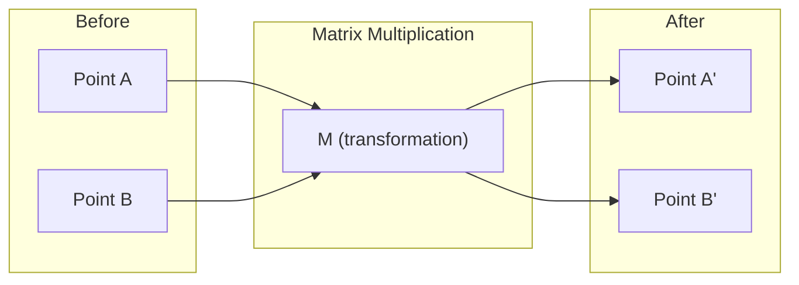
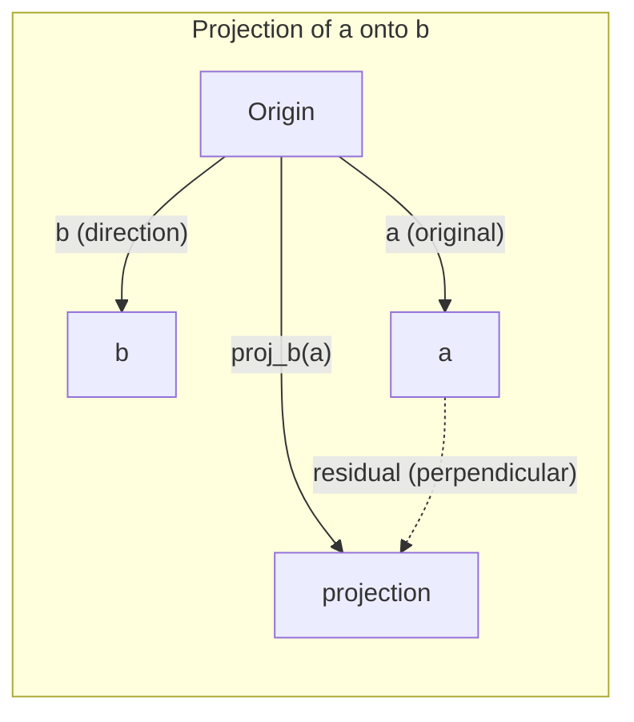

# Trực giác đại số tuyến tính

> Mỗi AI model chỉ là toán ma trận đội một chiếc mũ lạ mắt.

**Loại:** Học
**Ngôn ngữ:** Python, Julia
**Kiến thức tiên quyết:** Giai đoạn 0
**Thời lượng:** ~60 phút

## Mục tiêu học tập

- Thực hiện các phép toán vector và ma trận (cộng, tích chấm, phép nhân ma trận) từ đầu trong Python
- Giải thích về mặt hình học những gì sản phẩm chấm, phép chiếu và process Gram-Schmidt làm
- Xác định tính độc lập tuyến tính, xếp hạng và cơ sở của một tập hợp vectors bằng cách sử dụng tính năng giảm hàng
- Kết nối các khái niệm đại số tuyến tính với các ứng dụng AI của chúng: embeddings, điểm attention và LoRA

## Vấn đề

Mở bất kỳ giấy ML nào. Trong trang đầu tiên, bạn sẽ thấy vectors, ma trận, sản phẩm chấm và phép biến đổi. Nếu không có trực giác đại số tuyến tính, đây chỉ là những ký hiệu. Với nó, bạn có thể thấy một mạng nơ-ron đang thực sự làm gì - di chuyển các điểm xung quanh không gian.

Bạn không cần phải là một nhà toán học. Bạn cần xem các hoạt động này có ý nghĩa gì về mặt hình học, sau đó tự mã hóa chúng.

## Khái niệm

### Vectors là điểm (và hướng)

Một vector chỉ là một danh sách các con số. Nhưng những con số đó có ý nghĩa gì đó - chúng là tọa độ trong không gian.

**vector 2D [3, 2]:**

| x | y | Điểm |
|---|---|-------|
| 3 | 2 | Các vector chỉ từ điểm gốc (0,0) đến (3, 2) trên mặt phẳng |

vector có độ lớn sqrt (3 ^ 2 + 2 ^ 2) = sqrt (13) và hướng lên và sang phải.

Trong AI, vectors đại diện cho mọi thứ:
- Một từ → một vector gồm 768 số ("ý nghĩa" của nó trong khoảng embedding)
- Một hình ảnh → vector hàng triệu giá trị pixel
- Người dùng → một vector tùy chọn

### Ma trận là phép biến đổi

Ma trận biến đổi vector này thành  khác. Nó có thể xoay, chia tỷ lệ, kéo dài hoặc chiếu.



Trong AI, ma trận LÀ model:
- Trọng số mạng nơ-ron → ma trận chuyển đổi đầu vào thành đầu ra
- Attention điểm số → ma trận quyết định những gì cần tập trung vào
- Embeddings → ma trận ánh xạ các từ với vectors

### Sản phẩm Dot đo lường sự tương đồng

Tích chấm của hai vectors cho bạn biết chúng giống nhau như thế nào.

```
a · b = a₁×b₁ + a₂×b₂ + ... + aₙ×bₙ

Same direction:      a · b > 0  (similar)
Perpendicular:       a · b = 0  (unrelated)
Opposite direction:  a · b < 0  (dissimilar)
```

Đây thực sự là cách các công cụ tìm kiếm, hệ thống đề xuất và RAG hoạt động - tìm vectors với các sản phẩm có dấu chấm cao.

### Độc lập tuyến tính

Vectors độc lập tuyến tính nếu không có vector nào trong tập hợp có thể được viết như một sự kết hợp của các  khác. Nếu v1, v2, v3 độc lập, chúng span một không gian 3D. Nếu một cái là sự kết hợp của những cái khác, chúng chỉ span một mặt phẳng.

Tại sao nó quan trọng đối với AI: ma trận feature của bạn nên có các cột độc lập tuyến tính. Nếu hai features tương quan hoàn hảo (phụ thuộc tuyến tính), model không thể phân biệt hiệu ứng của chúng. Điều này gây ra tính đa tuyến tính trong hồi quy - ma trận trọng số trở nên không ổn định và những thay đổi đầu vào nhỏ tạo ra sự dao động đầu ra hoang dã.

**Ví dụ cụ thể:**

```
v1 = [1, 0, 0]
v2 = [0, 1, 0]
v3 = [2, 1, 0]   # v3 = 2*v1 + v2
```

v1 và v2 là độc lập -- không phải là bội số vô hướng hoặc kết hợp của nhau. Nhưng v3 = 2*v1 + v2, vì vậy {v1, v2, v3} là một tập phụ thuộc. Ba vectors này đều nằm trong mặt phẳng xy. Cho dù bạn kết hợp chúng như thế nào, bạn cũng không thể đạt được [0, 0, 1]. Bạn có ba vectors nhưng chỉ có hai chiều tự do.

Trong một dataset: nếu feature_3 = 2 * feature_1 + feature_2, cộng feature_3 sẽ cho model không có thông tin mới. Tệ hơn, nó làm cho các phương trình bình thường trở nên số ít - không có lời giải duy nhất cho trọng số.

### Cơ sở và cấp bậc

Cơ sở là một tập hợp tối thiểu các vectors độc lập tuyến tính span toàn bộ không gian. Số vectors cơ sở là kích thước của không gian.

Cơ sở tiêu chuẩn cho không gian 3D là {[1,0,0], [0,1,0], [0,0,1]}. Nhưng bất kỳ ba vectors độc lập nào trong 3D đều tạo thành một cơ sở hợp lệ. Việc lựa chọn cơ sở là sự lựa chọn hệ tọa độ.

Thứ hạng của ma trận = số cột độc lập tuyến tính = số hàng độc lập tuyến tính. Nếu xếp hạng < phút (hàng, cols), ma trận bị thiếu thứ hạng. Điều này có nghĩa là:
- Hệ thống có vô số giải pháp (hoặc không có)
- Thông tin bị mất trong quá trình biến đổi
- Ma trận không thể đảo ngược

| Tình huống | Cấp | Nó có ý nghĩa gì đối với ML |
|-----------|------|---------------------|
| Xếp hạng đầy đủ (xếp hạng = min(m, n)) | Tối đa có thể | Giải pháp bình phương nhỏ nhất duy nhất tồn tại. Model có điều kiện tốt. |
| Thiếu thứ hạng (xếp hạng < min(m, n)) | Dưới mức tối đa | Features là dư thừa. Vô số giải pháp trọng lượng. Cần chính quy hóa. |
| Hạng 1 | 1 | Mỗi cột là một bản sao tỷ lệ của một vector. Tất cả dữ liệu nằm trên một dòng. |
| Gần thiếu thứ hạng (giá trị số ít nhỏ) | Số lượng thấp | Ma trận không có điều kiện. Nhiễu đầu vào nhỏ gây ra những thay đổi lớn về đầu ra. Sử dụng cắt ngắn SVD hoặc hồi quy sườn núi. |

### Chiếu

Chiếu vector **a** lên vector **b** cho thành phần của **a** theo hướng **b**:

```
proj_b(a) = (a dot b / b dot b) * b
```

Phần dư (a - proj_b(a)) vuông góc với b. Sự phân hủy trực giao này là nền tảng của khớp hình vuông nhỏ nhất.

Phép chiếu ở khắp mọi nơi trong ML:
- Hồi quy tuyến tính giảm thiểu khoảng cách từ các quan sát đến không gian cột - lời giải là một phép chiếu
- PCA chiếu dữ liệu theo hướng của variance tối đa
- Attention trong transformers tính toán dự báo của các truy vấn vào các khóa



**Ví dụ:** a = [3, 4], b = [1, 0]

proj_b (a) = (3 * 1 + 4 * 0) / (1 * 1 + 0 * 0) * [1, 0] = 3 * [1, 0] = [3, 0]

Phép chiếu thả thành phần y. Đây là sự giảm chiều ở dạng đơn giản nhất của nó - vứt bỏ những hướng bạn không quan tâm.

### Gram-Schmidt Process

Chuyển đổi bất kỳ tập hợp vectors độc lập nào thành cơ sở trực thường. Orthonormal có nghĩa là mọi vector có chiều dài 1 và mỗi cặp vuông góc.

Thuật toán:
1. Lấy vector đầu tiên, chuẩn hóa nó
2. Lấy vector thứ hai, trừ phép chiếu của nó vào hình chiếu đầu tiên, chuẩn hóa
3. Lấy vector thứ ba, trừ các phép chiếu của nó vào tất cả các vectors trước đó, chuẩn hóa
4. Lặp lại cho vectors còn lại

```
Input:  v1, v2, v3, ... (linearly independent)

u1 = v1 / |v1|

w2 = v2 - (v2 dot u1) * u1
u2 = w2 / |w2|

w3 = v3 - (v3 dot u1) * u1 - (v3 dot u2) * u2
u3 = w3 / |w3|

Output: u1, u2, u3, ... (orthonormal basis)
```

Đây là cách phân hủy QR hoạt động nội bộ. Q là cơ sở trực thường, R nắm bắt các hệ số chiếu. Phân hủy QR được sử dụng trong:
- Giải các hệ tuyến tính (ổn định hơn loại bỏ Gaussian)
- Tính toán giá trị riêng (thuật toán QR)
- Hồi quy bình phương nhỏ nhất (phương pháp số tiêu chuẩn)

```figure
eigen-directions
```

## Tự xây dựng

### Bước 1: Vectors từ đầu (Python)

```python
class Vector:
    def __init__(self, components):
        self.components = list(components)
        self.dim = len(self.components)

    def __add__(self, other):
        return Vector([a + b for a, b in zip(self.components, other.components)])

    def __sub__(self, other):
        return Vector([a - b for a, b in zip(self.components, other.components)])

    def dot(self, other):
        return sum(a * b for a, b in zip(self.components, other.components))

    def magnitude(self):
        return sum(x**2 for x in self.components) ** 0.5

    def normalize(self):
        mag = self.magnitude()
        return Vector([x / mag for x in self.components])

    def cosine_similarity(self, other):
        return self.dot(other) / (self.magnitude() * other.magnitude())

    def __repr__(self):
        return f"Vector({self.components})"


a = Vector([1, 2, 3])
b = Vector([4, 5, 6])

print(f"a + b = {a + b}")
print(f"a · b = {a.dot(b)}")
print(f"|a| = {a.magnitude():.4f}")
print(f"cosine similarity = {a.cosine_similarity(b):.4f}")
```

### Bước 2: Ma trận từ đầu (Python)

```python
class Matrix:
    def __init__(self, rows):
        self.rows = [list(row) for row in rows]
        self.shape = (len(self.rows), len(self.rows[0]))

    def __matmul__(self, other):
        if isinstance(other, Vector):
            return Vector([
                sum(self.rows[i][j] * other.components[j] for j in range(self.shape[1]))
                for i in range(self.shape[0])
            ])
        rows = []
        for i in range(self.shape[0]):
            row = []
            for j in range(other.shape[1]):
                row.append(sum(
                    self.rows[i][k] * other.rows[k][j]
                    for k in range(self.shape[1])
                ))
            rows.append(row)
        return Matrix(rows)

    def transpose(self):
        return Matrix([
            [self.rows[j][i] for j in range(self.shape[0])]
            for i in range(self.shape[1])
        ])

    def __repr__(self):
        return f"Matrix({self.rows})"


rotation_90 = Matrix([[0, -1], [1, 0]])
point = Vector([3, 1])

rotated = rotation_90 @ point
print(f"Original: {point}")
print(f"Rotated 90°: {rotated}")
```

### Bước 3: Tại sao điều này lại quan trọng đối với AI

```python
import random

random.seed(42)
weights = Matrix([[random.gauss(0, 0.1) for _ in range(3)] for _ in range(2)])
input_vector = Vector([1.0, 0.5, -0.3])

output = weights @ input_vector
print(f"Input (3D): {input_vector}")
print(f"Output (2D): {output}")
print("This is what a neural network layer does -- matrix multiplication.")
```

### Bước 4: Phiên bản Julia

```julia
a = [1.0, 2.0, 3.0]
b = [4.0, 5.0, 6.0]

println("a + b = ", a + b)
println("a · b = ", a ⋅ b)       # Julia supports unicode operators
println("|a| = ", √(a ⋅ a))
println("cosine = ", (a ⋅ b) / (√(a ⋅ a) * √(b ⋅ b)))

# Matrix-vector multiplication
W = [0.1 -0.2 0.3; 0.4 0.5 -0.1]
x = [1.0, 0.5, -0.3]
println("Wx = ", W * x)
println("This is a neural network layer.")
```

### Bước 5: Độc lập tuyến tính và chiếu từ đầu (Python)

```python
def is_linearly_independent(vectors):
    n = len(vectors)
    dim = len(vectors[0].components)
    mat = Matrix([v.components[:] for v in vectors])
    rows = [row[:] for row in mat.rows]
    rank = 0
    for col in range(dim):
        pivot = None
        for row in range(rank, len(rows)):
            if abs(rows[row][col]) > 1e-10:
                pivot = row
                break
        if pivot is None:
            continue
        rows[rank], rows[pivot] = rows[pivot], rows[rank]
        scale = rows[rank][col]
        rows[rank] = [x / scale for x in rows[rank]]
        for row in range(len(rows)):
            if row != rank and abs(rows[row][col]) > 1e-10:
                factor = rows[row][col]
                rows[row] = [rows[row][j] - factor * rows[rank][j] for j in range(dim)]
        rank += 1
    return rank == n


def project(a, b):
    scalar = a.dot(b) / b.dot(b)
    return Vector([scalar * x for x in b.components])


def gram_schmidt(vectors):
    orthonormal = []
    for v in vectors:
        w = v
        for u in orthonormal:
            proj = project(w, u)
            w = w - proj
        if w.magnitude() < 1e-10:
            continue
        orthonormal.append(w.normalize())
    return orthonormal


v1 = Vector([1, 0, 0])
v2 = Vector([1, 1, 0])
v3 = Vector([1, 1, 1])
basis = gram_schmidt([v1, v2, v3])
for i, u in enumerate(basis):
    print(f"u{i+1} = {u}")
    print(f"  |u{i+1}| = {u.magnitude():.6f}")

print(f"u1 · u2 = {basis[0].dot(basis[1]):.6f}")
print(f"u1 · u3 = {basis[0].dot(basis[2]):.6f}")
print(f"u2 · u3 = {basis[1].dot(basis[2]):.6f}")
```

## Ứng dụng

Bây giờ điều tương tự với NumPy - những gì bạn sẽ thực sự sử dụng trong thực tế:

```python
import numpy as np

a = np.array([1, 2, 3], dtype=float)
b = np.array([4, 5, 6], dtype=float)

print(f"a + b = {a + b}")
print(f"a · b = {np.dot(a, b)}")
print(f"|a| = {np.linalg.norm(a):.4f}")
print(f"cosine = {np.dot(a, b) / (np.linalg.norm(a) * np.linalg.norm(b)):.4f}")

W = np.random.randn(2, 3) * 0.1
x = np.array([1.0, 0.5, -0.3])
print(f"Wx = {W @ x}")
```

### Xếp hạng, Chiếu và QR với NumPy

```python
import numpy as np

A = np.array([[1, 2], [2, 4]])
print(f"Rank: {np.linalg.matrix_rank(A)}")

a = np.array([3, 4])
b = np.array([1, 0])
proj = (np.dot(a, b) / np.dot(b, b)) * b
print(f"Projection of {a} onto {b}: {proj}")

Q, R = np.linalg.qr(np.random.randn(3, 3))
print(f"Q is orthogonal: {np.allclose(Q @ Q.T, np.eye(3))}")
print(f"R is upper triangular: {np.allclose(R, np.triu(R))}")
```

### PyTorch -- Tensors Vectors với Autodiff

```python
import torch

x = torch.randn(3, requires_grad=True)
y = torch.tensor([1.0, 0.0, 0.0])

similarity = torch.dot(x, y)
similarity.backward()

print(f"x = {x.data}")
print(f"y = {y.data}")
print(f"dot product = {similarity.item():.4f}")
print(f"d(dot)/dx = {x.grad}")
```

gradient của tích chấm đối với x chỉ là y. PyTorch tính toán điều này một cách tự động. Mọi hoạt động trong mạng nơ-ron đều được xây dựng từ các hoạt động như thế này - phép nhân ma trận, sản phẩm chấm, phép chiếu - và theo dõi autodiff gradients qua tất cả chúng.

Bạn chỉ cần xây dựng từ đầu những gì NumPy làm trong một dòng. Bây giờ bạn biết điều gì đang xảy ra dưới mui xe.

## Sản phẩm bàn giao

Bài học này tạo ra:
- `outputs/prompt-linear-algebra-tutor.md` - một prompt để các trợ lý AI dạy đại số tuyến tính thông qua trực giác hình học

## Kết nối

Mọi thứ trong bài học này kết nối với các phần cụ thể của AI hiện đại:

| Khái niệm | Vị trí hiển thị |
|---------|------------------|
| Sản phẩm chấm | Điểm Attention tính bằng transformers, độ tương đồng cosin tính bằng RAG |
| Ma trận nhân | Mọi lớp mạng nơ-ron, mọi biến đổi tuyến tính |
| Độc lập tuyến tính | Feature lựa chọn, tránh đa tuyến tính |
| Cấp | Xác định xem một hệ thống có thể giải quyết được hay không, LoRA (thích ứng cấp thấp) |
| Chiếu | Hồi quy tuyến tính (chiếu lên không gian cột), PCA |
| Gram-Schmidt / QR | Bộ giải số, tính toán giá trị riêng |
| Cơ sở chỉnh hình | Tính toán số ổn định, biến đổi làm trắng |

LoRA đáng được đề cập đặc biệt. Nó tinh chỉnh các models ngôn ngữ lớn bằng cách phân tách các bản cập nhật trọng số thành ma trận xếp hạng thấp. Thay vì cập nhật ma trận trọng lượng 4096x4096 (16M parameters), LoRA cập nhật hai ma trận có kích thước 4096x16 và 16x4096 (131K parameters). Ràng buộc cấp 16 có nghĩa là LoRA giả định cập nhật trọng lượng tồn tại trong một không gian con 16 chiều của không gian 4096 chiều đầy đủ. Đó là đại số tuyến tính làm công việc thực sự.

## Bài tập

1. Triển khai `Vector.angle_between(other)` trả về góc theo độ giữa hai vectors
2. Tạo ma trận tỷ lệ 2D nhân đôi tọa độ x và gấp ba tọa độ y, sau đó áp dụng nó cho vector [1, 1]
3. Cho 5 vectors giống từ ngẫu nhiên (chiều 50), hãy tìm hai  giống nhau nhất bằng cách sử dụng sự tương đồng cosin
4. Xác minh rằng đầu ra Gram-Schmidt thực sự là trực chuẩn: kiểm tra xem mọi cặp có tích chấm 0 và mọi vector có cấp sao 1
5. Tạo ma trận 3x3 với hạng 2. Xác minh bằng phương pháp `rank()`. Sau đó giải thích đối tượng hình học mà các cột span.
6. Chiếu vector [1, 2, 3] lên [1, 1, 1]. Kết quả đại diện cho điều gì về mặt hình học?

## Thuật ngữ chính

| Thuật ngữ | Những gì mọi người nói | Ý nghĩa thực sự của nó |
|------|----------------|----------------------|
| Vector | "Một mũi tên" | Danh sách các số đại diện cho một điểm hoặc hướng trong không gian n chiều |
| Ma trận | "Một bảng số" | Một sự chuyển đổi ánh xạ vectors từ không gian này sang không gian khác |
| Sản phẩm chấm | "Nhân và tổng" | Thước đo mức độ liên kết giữa hai vectors - cốt lõi của tìm kiếm sự tương đồng |
| Embedding | "Một số phép thuật AI" | Một vector đại diện cho ý nghĩa của một cái gì đó (từ, hình ảnh, người dùng) |
| Độc lập tuyến tính | "Chúng không trùng lặp" | Không có vector nào trong tập hợp có thể được viết như một sự kết hợp của những cái khác |
| Cấp | "Có bao nhiêu chiều" | Số cột (hoặc hàng) độc lập tuyến tính trong ma trận |
| Chiếu | "Cái bóng" | Thành phần của một vector theo hướng của một  khác |
| Cơ sở | "Các trục tọa độ" | Một tập hợp tối thiểu các vectors độc lập span không gian |
| Chỉnh hình | "Đơn vị vuông góc vectors" | Vectors vuông góc với nhau và mỗi cái có chiều dài 1 |
