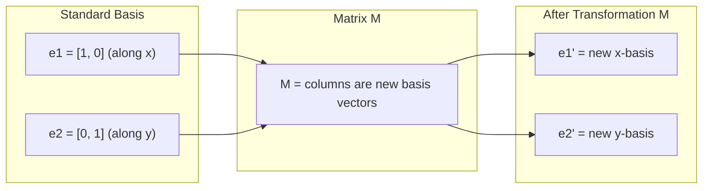
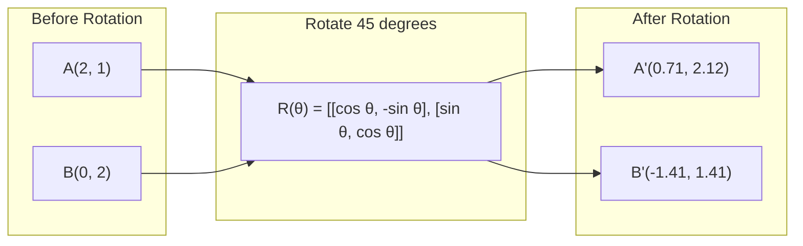
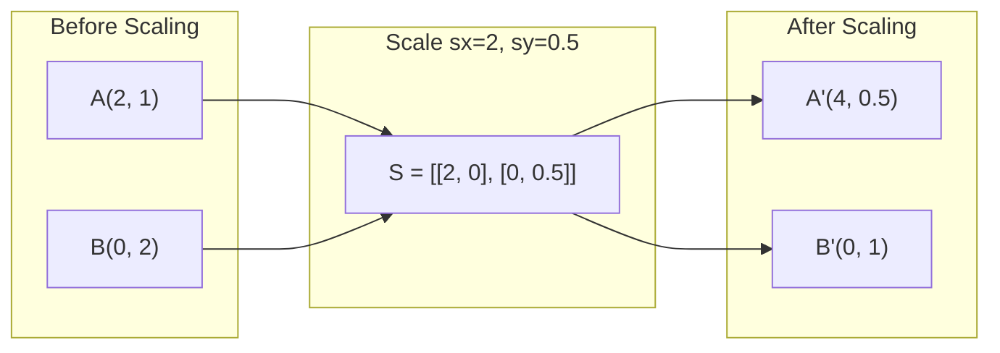
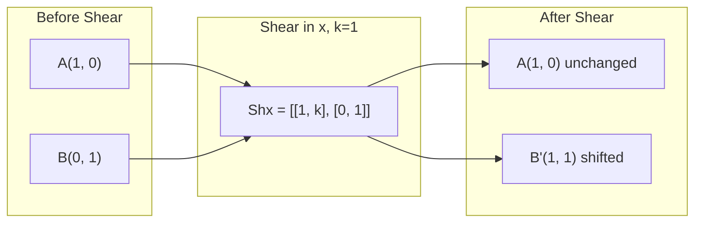
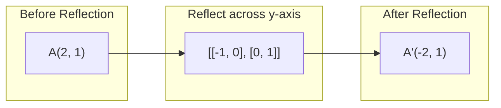
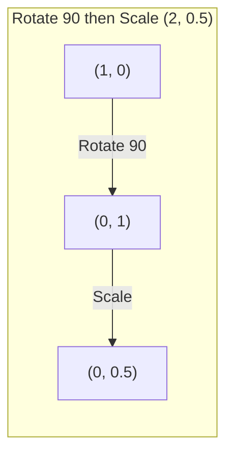
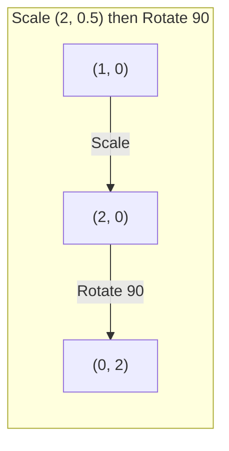

# Biến đổi ma trận

> Ma trận là một cỗ máy định hình lại không gian. Tìm hiểu những gì nó làm cho mọi điểm, và bạn hiểu toàn bộ sự biến đổi.

**Loại:** Xây dựng
**Ngôn ngữ:** Python, Julia
**Kiến thức tiên quyết:** Giai đoạn 1, Bài 01-02 (Trực giác đại số tuyến tính, Phép toán Vectors và ma trận)
**Thời lượng:** ~75 phút

## Mục tiêu học tập

- Xây dựng ma trận xoay, chia tỷ lệ, cắt và phản xạ và áp dụng chúng cho các điểm 2D và 3D
- Soạn nhiều phép biến đổi bằng phép nhân ma trận và xác minh rằng thứ tự quan trọng
- Tính toán các giá trị riêng và vectơ riêng của ma trận 2x2 từ phương trình đặc trưng
- Giải thích lý do tại sao các giá trị riêng xác định hướng PCA, độ ổn định RNN và hành vi phân cụm quang phổ

## Vấn đề

Bạn đọc về PCA và thấy "tìm vectơ riêng của ma trận hiệp phương sai". Bạn đọc về độ ổn định model và thấy "kiểm tra xem tất cả các giá trị riêng có cấp lớn nhỏ hơn 1 hay không". Bạn đọc về tăng cường dữ liệu và thấy "áp dụng xoay ngẫu nhiên". Không có điều nào trong số này có ý nghĩa cho đến khi bạn hiểu ma trận làm gì với không gian hình học.

Ma trận không chỉ là lưới số. Chúng là những cỗ máy không gian. Một ma trận quay các điểm. Một ma trận tỷ lệ kéo dài chúng. Một ma trận cắt nghiêng chúng. Mọi chuyển đổi mà mạng nơ-ron áp dụng cho dữ liệu là một trong những hoạt động này hoặc một thành phần của chúng. Bài học này làm cho những hoạt động đó trở nên cụ thể.

## Khái niệm

### Biến đổi dưới dạng ma trận

Mọi phép biến đổi tuyến tính trong 2D có thể được viết dưới dạng ma trận 2x2. Ma trận cho bạn biết chính xác cơ sở vectors [1, 0] và [0, 1] kết thúc ở đâu. Mọi thứ khác đều theo sau.



### Xoay

Xoay 2D theo góc theta giữ nguyên khoảng cách và góc. Nó di chuyển mọi điểm dọc theo một vòng cung tròn.



Trong 3D, bạn xoay quanh một trục. Mỗi trục có ma trận quay riêng:

```
Rz(theta) = | cos  -sin  0 |     Rotate around z-axis
            | sin   cos  0 |     (x-y plane spins, z stays)
            |  0     0   1 |

Rx(theta) = | 1   0     0    |   Rotate around x-axis
            | 0  cos  -sin   |   (y-z plane spins, x stays)
            | 0  sin   cos   |

Ry(theta) = |  cos  0  sin |     Rotate around y-axis
            |   0   1   0  |     (x-z plane spins, y stays)
            | -sin  0  cos |
```

### Mở rộng quy mô

Tỷ lệ kéo dài hoặc nén dọc theo từng trục một cách độc lập.



### Cắt

Cắt nghiêng một trục trong khi giữ trục kia cố định. Nó biến các hình chữ nhật thành hình bình hành.



Ma trận cắt:
- `Shx = [[1, k], [0, 1]]` ca x x x * y
- `Shy = [[1, 0], [k, 1]]` dịch chuyển y theo k * x

### Suy ngẫm

Phản xạ phản chiếu các điểm trên trục hoặc đường thẳng.



Ma trận phản xạ:
- Phản xạ trên trục y: `[[-1, 0], [0, 1]]`
- Phản chiếu trên trục x: `[[1, 0], [0, -1]]`

### Thành phần: chuyển đổi chuỗi

Áp dụng phép biến đổi A sau đó B cũng giống như nhân ma trận của chúng: `result = B @ A @ point`. Vấn đề trật tự. Xoay sau đó chia tỷ lệ cho kết quả khác với tỷ lệ sau đó xoay.



Sáng tác: `S @ R = [[0, -2], [0.5, 0]]`



Sáng tác: `R @ S = [[0, -0.5], [2, 0]]`

Kết quả khác nhau. Phép nhân ma trận không giao hoán.

### Giá trị riêng và vectơ riêng

Hầu hết vectors thay đổi hướng khi một ma trận chạm vào chúng. Vectơ riêng rất đặc biệt: ma trận chỉ chia tỷ lệ chúng, không bao giờ xoay chúng. Hệ số tỷ lệ là giá trị riêng.

```
A @ v = lambda * v

v is the eigenvector (direction that survives)
lambda is the eigenvalue (how much it stretches)

Example: A = | 2  1 |
             | 1  2 |

Eigenvector [1, 1] with eigenvalue 3:
  A @ [1,1] = [3, 3] = 3 * [1, 1]     (same direction, scaled by 3)

Eigenvector [1, -1] with eigenvalue 1:
  A @ [1,-1] = [1, -1] = 1 * [1, -1]  (same direction, unchanged)
```

Ma trận kéo dài không gian gấp 3 lần dọc theo [1, 1] và giữ cho [1, -1] không thay đổi. Mọi hướng khác là sự kết hợp của hai hướng này.

### Phân hủy riêng

Nếu một ma trận có n vectơ riêng độc lập tuyến tính, nó có thể được phân hủy:

```
A = V @ D @ V^(-1)

V = matrix whose columns are eigenvectors
D = diagonal matrix of eigenvalues
V^(-1) = inverse of V

This says: rotate into eigenvector coordinates, scale along each axis, rotate back.
```

### Tại sao các giá trị riêng lại quan trọng

**PCA.** Các vectơ riêng của ma trận hiệp phương sai là các thành phần chính. Các giá trị riêng cho bạn biết mỗi thành phần nắm bắt được bao nhiêu variance. Sắp xếp theo giá trị riêng, giữ k trên cùng và bạn có tính năng giảm chiều.

**Tính ổn định.** Trong các mạng lặp lại và hệ thống động lực, các giá trị riêng có độ lớn > 1 khiến đầu ra phát nổ. Độ sáng < 1 khiến chúng biến mất. Đây là vấn đề vanishing/exploding gradient được nêu trong một câu.

**Phương pháp quang phổ.** Mạng nơ-ron đồ thị sử dụng các giá trị riêng của ma trận liền kề. Phân cụm quang phổ sử dụng các giá trị riêng của Laplacian. Các vectơ riêng tiết lộ cấu trúc của đồ thị.

### Yếu tố quyết định là volume yếu tố tỷ lệ

Yếu tố quyết định của ma trận biến đổi cho bạn biết nó chia tỷ lệ diện tích (2D) hoặc volume (3D) bao nhiêu.

```
det = 1:   area preserved (rotation)
det = 2:   area doubled
det = 0:   space crushed to lower dimension (singular)
det = -1:  area preserved but orientation flipped (reflection)

| det(Rotation) | = 1        (always)
| det(Scale sx, sy) | = sx * sy
| det(Shear) | = 1           (area preserved)
| det(Reflection) | = -1     (orientation flipped)
```

```figure
matrix-transform
```

## Tự xây dựng

### Bước 1: Ma trận biến đổi từ đầu (Python)

```python
import math

def rotation_2d(theta):
    c, s = math.cos(theta), math.sin(theta)
    return [[c, -s], [s, c]]

def scaling_2d(sx, sy):
    return [[sx, 0], [0, sy]]

def shearing_2d(kx, ky):
    return [[1, kx], [ky, 1]]

def reflection_x():
    return [[1, 0], [0, -1]]

def reflection_y():
    return [[-1, 0], [0, 1]]

def mat_vec_mul(matrix, vector):
    return [
        sum(matrix[i][j] * vector[j] for j in range(len(vector)))
        for i in range(len(matrix))
    ]

def mat_mul(a, b):
    rows_a, cols_b = len(a), len(b[0])
    cols_a = len(a[0])
    return [
        [sum(a[i][k] * b[k][j] for k in range(cols_a)) for j in range(cols_b)]
        for i in range(rows_a)
    ]

point = [1.0, 0.0]
angle = math.pi / 4

rotated = mat_vec_mul(rotation_2d(angle), point)
print(f"Rotate (1,0) by 45 deg: ({rotated[0]:.4f}, {rotated[1]:.4f})")

scaled = mat_vec_mul(scaling_2d(2, 3), [1.0, 1.0])
print(f"Scale (1,1) by (2,3): ({scaled[0]:.1f}, {scaled[1]:.1f})")

sheared = mat_vec_mul(shearing_2d(1, 0), [1.0, 1.0])
print(f"Shear (1,1) kx=1: ({sheared[0]:.1f}, {sheared[1]:.1f})")

reflected = mat_vec_mul(reflection_y(), [2.0, 1.0])
print(f"Reflect (2,1) across y: ({reflected[0]:.1f}, {reflected[1]:.1f})")
```

### Bước 2: Thành phần của các phép biến đổi

```python
R = rotation_2d(math.pi / 2)
S = scaling_2d(2, 0.5)

rotate_then_scale = mat_mul(S, R)
scale_then_rotate = mat_mul(R, S)

point = [1.0, 0.0]
result1 = mat_vec_mul(rotate_then_scale, point)
result2 = mat_vec_mul(scale_then_rotate, point)

print(f"Rotate 90 then scale: ({result1[0]:.2f}, {result1[1]:.2f})")
print(f"Scale then rotate 90: ({result2[0]:.2f}, {result2[1]:.2f})")
print(f"Same? {result1 == result2}")
```

### Bước 3: Giá trị riêng từ đầu (2x2)

Đối với một `[[a, b], [c, d]]` ma trận 2x2, các giá trị riêng giải phương trình đặc trưng: `lambda^2 - (a+d)*lambda + (ad - bc) = 0`.

```python
def eigenvalues_2x2(matrix):
    a, b = matrix[0]
    c, d = matrix[1]
    trace = a + d
    det = a * d - b * c
    discriminant = trace ** 2 - 4 * det
    if discriminant < 0:
        real = trace / 2
        imag = (-discriminant) ** 0.5 / 2
        return (complex(real, imag), complex(real, -imag))
    sqrt_disc = discriminant ** 0.5
    return ((trace + sqrt_disc) / 2, (trace - sqrt_disc) / 2)

def eigenvector_2x2(matrix, eigenvalue):
    a, b = matrix[0]
    c, d = matrix[1]
    if abs(b) > 1e-10:
        v = [b, eigenvalue - a]
    elif abs(c) > 1e-10:
        v = [eigenvalue - d, c]
    else:
        if abs(a - eigenvalue) < 1e-10:
            v = [1, 0]
        else:
            v = [0, 1]
    mag = (v[0] ** 2 + v[1] ** 2) ** 0.5
    return [v[0] / mag, v[1] / mag]

A = [[2, 1], [1, 2]]
vals = eigenvalues_2x2(A)
print(f"Matrix: {A}")
print(f"Eigenvalues: {vals[0]:.4f}, {vals[1]:.4f}")

for val in vals:
    vec = eigenvector_2x2(A, val)
    result = mat_vec_mul(A, vec)
    scaled = [val * vec[0], val * vec[1]]
    print(f"  lambda={val:.1f}, v={[round(x,4) for x in vec]}")
    print(f"    A@v = {[round(x,4) for x in result]}")
    print(f"    l*v = {[round(x,4) for x in scaled]}")
```

### Bước 4: Quyết định là volume yếu tố tỷ lệ

```python
def det_2x2(matrix):
    return matrix[0][0] * matrix[1][1] - matrix[0][1] * matrix[1][0]

print(f"det(rotation 45) = {det_2x2(rotation_2d(math.pi/4)):.4f}")
print(f"det(scale 2,3)   = {det_2x2(scaling_2d(2, 3)):.1f}")
print(f"det(shear kx=1)  = {det_2x2(shearing_2d(1, 0)):.1f}")
print(f"det(reflect y)   = {det_2x2(reflection_y()):.1f}")

singular = [[1, 2], [2, 4]]
print(f"det(singular)     = {det_2x2(singular):.1f}")
print("Singular: columns are proportional, space collapses to a line.")
```

## Ứng dụng

NumPy xử lý tất cả những điều này với các quy trình được tối ưu hóa.

```python
import numpy as np

theta = np.pi / 4
R = np.array([[np.cos(theta), -np.sin(theta)],
              [np.sin(theta),  np.cos(theta)]])

point = np.array([1.0, 0.0])
print(f"Rotate (1,0) by 45 deg: {R @ point}")

S = np.diag([2.0, 3.0])
composed = S @ R
print(f"Scale(2,3) after Rotate(45): {composed @ point}")

A = np.array([[2, 1], [1, 2]], dtype=float)
eigenvalues, eigenvectors = np.linalg.eig(A)
print(f"\nEigenvalues: {eigenvalues}")
print(f"Eigenvectors (columns):\n{eigenvectors}")

for i in range(len(eigenvalues)):
    v = eigenvectors[:, i]
    lam = eigenvalues[i]
    print(f"  A @ v{i} = {A @ v}, lambda * v{i} = {lam * v}")

print(f"\ndet(R) = {np.linalg.det(R):.4f}")
print(f"det(S) = {np.linalg.det(S):.1f}")

B = np.array([[3, 1], [0, 2]], dtype=float)
vals, vecs = np.linalg.eig(B)
D = np.diag(vals)
V = vecs
reconstructed = V @ D @ np.linalg.inv(V)
print(f"\nEigendecomposition A = V @ D @ V^-1:")
print(f"Original:\n{B}")
print(f"Reconstructed:\n{reconstructed}")
```

### Xoay 3D với NumPy

```python
def rotation_3d_z(theta):
    c, s = np.cos(theta), np.sin(theta)
    return np.array([[c, -s, 0], [s, c, 0], [0, 0, 1]])

def rotation_3d_x(theta):
    c, s = np.cos(theta), np.sin(theta)
    return np.array([[1, 0, 0], [0, c, -s], [0, s, c]])

point_3d = np.array([1.0, 0.0, 0.0])
rotated_z = rotation_3d_z(np.pi / 2) @ point_3d
rotated_x = rotation_3d_x(np.pi / 2) @ point_3d

print(f"\n3D point: {point_3d}")
print(f"Rotate 90 around z: {np.round(rotated_z, 4)}")
print(f"Rotate 90 around x: {np.round(rotated_x, 4)}")
```

## Sản phẩm bàn giao

Bài học này xây dựng nền tảng hình học cho PCA (Giai đoạn 2) và phân tích trọng lượng mạng nơ-ron. Mã eigenvalue/eigenvector được xây dựng ở đây là cùng một thuật toán hỗ trợ giảm chiều, phân cụm quang phổ và phân tích độ ổn định trong các hệ thống production ML.

## Bài tập

1. Áp dụng xoay, chia tỷ lệ và cắt cho một hình vuông đơn vị (các góc ở [0,0], [1,0], [1,1], [0,1]). In các góc đã biến đổi cho mỗi góc. Xác minh rằng vòng quay bảo toàn khoảng cách giữa các góc.

2. Tìm các giá trị riêng của ma trận [[4, 2], [1, 3]] bằng tay bằng cách sử dụng phương trình đặc trưng. Sau đó, xác minh bằng chức năng từ đầu của bạn và với NumPy.

3. Tạo một bố cục gồm ba phép biến đổi (xoay 30 độ, chia tỷ lệ theo [1.5, 0.8], cắt với kx = 0.3) và áp dụng nó cho 8 điểm được sắp xếp trong một vòng tròn. In tọa độ trước và sau. Tính định thức của ma trận tổng hợp và xác minh nó bằng tích của các định thức riêng lẻ.

## Thuật ngữ chính

| Thuật ngữ | Những gì mọi người nói | Ý nghĩa thực sự của nó |
|------|----------------|----------------------|
| Ma trận xoay | "Quay mọi thứ" | Một ma trận trực giao di chuyển các điểm dọc theo các vòng cung tròn trong khi vẫn giữ được khoảng cách và góc. Yếu tố quyết định luôn là 1. |
| Ma trận tỷ lệ | "Làm cho mọi thứ lớn hơn" | Một ma trận đường chéo kéo dài hoặc nén độc lập dọc theo mỗi trục. Yếu tố quyết định là tích của các hệ số tỷ lệ. |
| Ma trận cắt | "Những thứ nghiêng" | Một ma trận dịch chuyển tọa độ này theo tỷ lệ với tọa độ khác, biến các hình chữ nhật thành hình bình hành. Yếu tố quyết định là 1. |
| Suy ngẫm | "Phản chiếu mọi thứ" | Một ma trận lật không gian trên một trục hoặc mặt phẳng. Yếu tố quyết định là -1. |
| Thành phần | "Làm hai việc" | Nhân ma trận chuyển đổi thành các hoạt động chuỗi. Vấn đề thứ tự: B @ A có nghĩa là áp dụng A trước, sau đó là B. |
| Vectơ riêng | "Hướng đặc biệt" | Một hướng mà ma trận chỉ chia tỷ lệ, không bao giờ quay. Dấu vân tay của sự biến đổi. |
| Giá trị riêng | "Nó kéo dài bao nhiêu" | Hệ số vô hướng mà ma trận chia tỷ lệ vectơ riêng của nó. Có thể âm (lật) hoặc phức tạp (xoay). |
| Phân hủy riêng | "Phá vỡ ma trận" | Viết một ma trận dưới dạng V @ D @ V^(-1), tách nó thành các hướng và độ lớn tỷ lệ cơ bản của nó. |
| Yếu tố quyết định | "Một số duy nhất từ ma trận" | Hệ số mà phép biến đổi chia tỷ lệ diện tích (2D) hoặc volume (3D). Số không có nghĩa là sự biến đổi là không thể đảo ngược. |
| Phương trình đặc trưng | "Giá trị riêng đến từ đâu" | det(A - lambda * I) = 0. Đa thức có gốc là giá trị riêng. |

## Đọc thêm

- [3Blue1Brown: Linear Transformations](https://www.3blue1brown.com/lessons/linear-transformations) - trực giác trực quan về cách ma trận định hình lại không gian
- [3Blue1Brown: Eigenvectors and Eigenvalues](https://www.3blue1brown.com/lessons/eigenvalues) -- lời giải thích trực quan tốt nhất về ý nghĩa của vectơ riêng về mặt hình học
- [MIT 18.06 Lecture 21: Eigenvalues and Eigenvectors](https://ocw.mit.edu/courses/18-06-linear-algebra-spring-2010/) - Phương pháp điều trị cổ điển của Gilbert Strang
