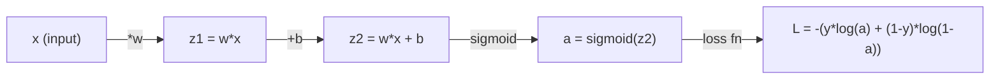
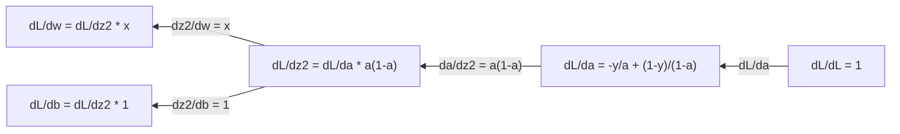
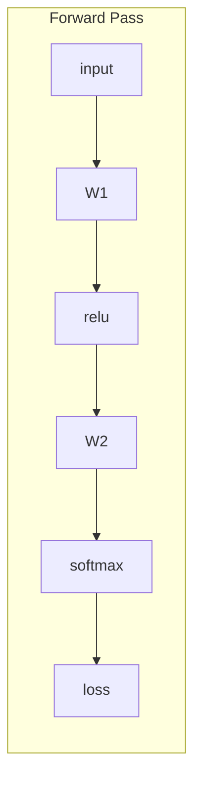
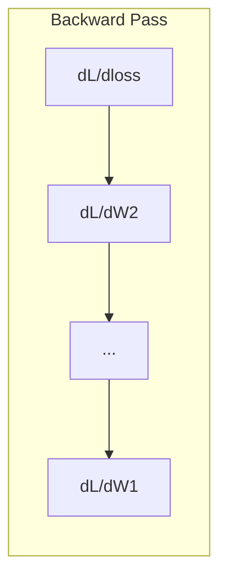

# Giải tích cho Machine Learning

> Các công cụ phái sinh cho bạn biết con đường nào là xuống dốc. Đó là tất cả những gì một mạng nơ-ron cần học.

**Loại:** Học
**Ngôn ngữ:** Python
**Kiến thức tiên quyết:** Giai đoạn 1, Bài 01-03
**Thời lượng:** ~60 phút

## Mục tiêu học tập

- Tính toán đạo hàm số và phân tích cho các hàm ML chung (x^2, sigmoid, entropy chéo)
- Triển khai gradient descent từ đầu để giảm thiểu chức năng loss trong 1D và 2D
- Lấy gradient của model hồi quy tuyến tính và huấn luyện nó thông qua cập nhật trọng lượng thủ công
- Giải thích ma trận Hessian, xấp xỉ chuỗi Taylor và mối liên hệ của chúng với các phương pháp tối ưu hóa

## Vấn đề

Bạn có một mạng nơ-ron với hàng triệu trọng lượng. Mỗi trọng lượng là một núm vặn. Bạn cần tìm ra hướng nào để xoay từng núm để làm cho model ít sai hơn một chút. Giải tích cung cấp cho bạn hướng đó.

Nếu không có giải tích, training một mạng nơ-ron có nghĩa là thử những thay đổi ngẫu nhiên và hy vọng điều tốt nhất. Với đạo hàm, bạn biết chính xác mỗi trọng số ảnh hưởng đến sai số như thế nào. Bạn xoay mọi núm đúng cách, mọi lúc.

## Khái niệm

### Phái sinh là gì?

Một đạo hàm đo lường tốc độ thay đổi. Đối với một hàm y = f(x), đạo hàm f'(x) cho bạn biết: nếu bạn đẩy x một lượng nhỏ, y thay đổi bao nhiêu?

Về mặt hình học, đạo hàm là độ dốc của đường tiếp tuyến tại một điểm.

**f(x) = x^2:**

| x | f(x) | f'(x) (độ dốc) |
|---|------|---------------|
| 0 | 0 | 0 (phẳng, ở dưới cùng) |
| 1 | 1 | 2 |
| 2 | 4 | 4 (độ dốc của đường tiếp tuyến tại điểm này) |
| 3 | 9 | 6 |

Tại x = 2, độ dốc là 4. Nếu bạn di chuyển x một chút sang phải, y sẽ tăng gấp khoảng 4 lần số tiền đó. Tại x = 0, độ dốc là 0. Bạn đang ở dưới đáy bát.

Định nghĩa chính thức:

```
f'(x) = lim   f(x + h) - f(x)
        h->0  -----------------
                     h
```

Trong code, bạn bỏ qua giới hạn và chỉ sử dụng một h rất nhỏ. Đó là đạo hàm số.

### Đạo hàm từng phần: một biến tại một thời điểm

Các hàm thực có nhiều đầu vào. Một mạng nơ-ron loss phụ thuộc vào hàng ngàn trọng lượng. Một đạo hàm một phần giữ tất cả các biến không đổi ngoại trừ một, sau đó lấy đạo hàm đối với biến đó.

```
f(x, y) = x^2 + 3xy + y^2

df/dx = 2x + 3y     (treat y as a constant)
df/dy = 3x + 2y     (treat x as a constant)
```

Mỗi đạo hàm một phần trả lời: nếu tôi chỉ huých một trọng lượng này, loss thay đổi như thế nào?

### Các gradient: vector của tất cả các đạo hàm từng phần

gradient thu thập mọi đạo hàm từng phần vào một vector. Đối với hàm f(x, y, z), gradient là:

```
grad f = [ df/dx, df/dy, df/dz ]
```

Đường gradient hướng đi lên dốc nhất. Để thu nhỏ một hàm, hãy đi theo hướng ngược lại.

**Biểu đồ đường viền của f(x,y) = x^2 + y^2:**

Chức năng tạo thành một hình bát với các vòng tròn đồng tâm làm đường viền. Mức tối thiểu là (0, 0).

| Điểm | Tốt nghiệp F | -grad f (hướng đi xuống) |
|-------|--------|----------------------------|
| (1, 1) | [2, 2] (điểm lên dốc, cách xa mức tối thiểu) | [-2, -2] (điểm xuống dốc, về mức tối thiểu) |
| (0, 0) | [0, 0] (phẳng, tối thiểu) | [0, 0] |

Đây là gradient descent trong một bức tranh. Tính toán gradient, phủ nhận nó, thực hiện một bước.

### Kết nối với tối ưu hóa

Training mạng nơ-ron là tối ưu hóa. Bạn có một hàm loss L(w1, w2, ..., wn) để đo mức độ sai của các model. Bạn muốn giảm thiểu nó.

```
Gradient descent update rule:

  w_new = w_old - learning_rate * dL/dw

For every weight:
  1. Compute the partial derivative of loss with respect to that weight
  2. Subtract a small multiple of it from the weight
  3. Repeat
```

learning rate kiểm soát kích thước bước. Quá lớn và bạn vượt quá giới hạn. Quá nhỏ và bạn bò.

**Loss Phong cảnh (lát cắt 1D):**

Hàm loss L(w) tạo thành một đường cong với các đỉnh và thung lũng khi trọng lượng w thay đổi.

| Feature | Sự miêu tả |
|---------|-------------|
| Tối thiểu toàn cầu | Điểm thấp nhất trên toàn bộ đường cong - giải pháp tốt nhất |
| Tối thiểu cục bộ | Một thung lũng thấp hơn các thung lũng lân cận nhưng không thấp nhất về tổng thể |
| Độ dốc | Gradient descent đi theo dốc xuống dốc từ bất kỳ điểm xuất phát nào |

Gradient descent đi theo con dốc xuống dốc. Nó có thể bị mắc kẹt trong tối thiểu cục bộ, nhưng trong không gian high-dimensional (hàng triệu trọng lượng) đây hiếm khi là một vấn đề thực tế.

### Đạo hàm số và đạo hàm phân tích

Có hai cách để tính toán đạo hàm.

Phân tích: áp dụng các quy tắc giải tích bằng tay. Đối với f(x) = x^2, đạo hàm là f'(x) = 2x. Chính xác. Nhanh chóng.

Số: gần đúng bằng cách sử dụng định nghĩa. Tính f(x+h) và f(xh) cho một h nhỏ, sau đó sử dụng chênh lệch.

```
Numerical (central difference):

f'(x) ~= f(x + h) - f(x - h)
          -----------------------
                  2h

h = 0.0001 works well in practice
```

Đạo hàm số chậm hơn nhưng hoạt động cho bất kỳ hàm nào. Các đạo hàm phân tích nhanh nhưng yêu cầu bạn suy ra công thức. Mạng nơ-ron frameworks sử dụng cách tiếp cận thứ ba: vi phân tự động, tính toán các đạo hàm chính xác một cách cơ học. Bạn sẽ thấy điều đó trong Giai đoạn 3.

### Dẫn xuất bằng tay cho các hàm đơn giản

Đây là những công cụ phái sinh bạn sẽ thấy đi thấy lại trong ML.

```
Function        Derivative       Used in
--------        ----------       -------
f(x) = x^2     f'(x) = 2x      Loss functions (MSE)
f(x) = wx + b  f'(w) = x        Linear layer (gradient w.r.t. weight)
                f'(b) = 1        Linear layer (gradient w.r.t. bias)
                f'(x) = w        Linear layer (gradient w.r.t. input)
f(x) = e^x     f'(x) = e^x     Softmax, attention
f(x) = ln(x)   f'(x) = 1/x     Cross-entropy loss
f(x) = 1/(1+e^-x)  f'(x) = f(x)(1-f(x))   Sigmoid activation
```

Đối với f(x) = x^2:

```
f(x) = x^2    f'(x) = 2x

  x    f(x)   f'(x)   meaning
  -2    4      -4      slope tilts left (decreasing)
  -1    1      -2      slope tilts left (decreasing)
   0    0       0      flat (minimum!)
   1    1       2      slope tilts right (increasing)
   2    4       4      slope tilts right (increasing)
```

Đối với f(w) = wx + b với x=3, b=1:

```
f(w) = 3w + 1    f'(w) = 3

The derivative with respect to w is just x.
If x is big, a small change in w causes a big change in output.
```

### Quy tắc chuỗi

Khi các hàm được soạn thảo, quy tắc chuỗi cho bạn biết cách phân biệt.

```
If y = f(g(x)), then dy/dx = f'(g(x)) * g'(x)

Example: y = (3x + 1)^2
  outer: f(u) = u^2       f'(u) = 2u
  inner: g(x) = 3x + 1    g'(x) = 3
  dy/dx = 2(3x + 1) * 3 = 6(3x + 1)
```

Mạng nơ-ron là chuỗi các chức năng: đầu vào -> tuyến tính -> kích hoạt -> tuyến tính -> kích hoạt -> loss. Backpropagation là quy tắc chuỗi được áp dụng lặp đi lặp lại từ đầu ra đến đầu vào. Đó là toàn bộ thuật toán.

### Ma trận Hessian

gradient cho bạn biết độ dốc. Hessian cho bạn biết độ cong.

Hessian là ma trận của đạo hàm từng phần bậc hai. Đối với một hàm f(x1, x2, ..., xn), mục nhập (i, j) của Hessian là:

```
H[i][j] = d^2f / (dx_i * dx_j)
```

Đối với hàm 2 biến f(x, y):

```
H = | d^2f/dx^2    d^2f/dxdy |
    | d^2f/dydx    d^2f/dy^2 |
```

**Những gì Hessian nói với bạn tại một điểm tới hạn (trong đó gradient = 0):**

| Bất động sản Hessian | Ý nghĩa | Bề mặt ví dụ |
|-----------------|---------|-----------------|
| Xác định dương (tất cả các giá trị riêng > 0) | Tối thiểu cục bộ | Bát hướng lên |
| Xác định âm (tất cả các giá trị riêng < 0) | Tối đa cục bộ | Bát hướng xuống |
| Không xác định (giá trị riêng hỗn hợp) | Điểm yên xe | Hình dạng yên ngựa |

**Ví dụ:** f(x, y) = x^2 - y^2 (một hàm yên ngựa)

```
df/dx = 2x       df/dy = -2y
d^2f/dx^2 = 2    d^2f/dy^2 = -2    d^2f/dxdy = 0

H = | 2   0 |
    | 0  -2 |

Eigenvalues: 2 and -2 (one positive, one negative)
--> Saddle point at (0, 0)
```

So sánh với f(x, y) = x^2 + y^2 (một bát):

```
H = | 2  0 |
    | 0  2 |

Eigenvalues: 2 and 2 (both positive)
--> Local minimum at (0, 0)
```

**Tại sao Hessian lại quan trọng trong ML:**

Phương pháp của Newton sử dụng Hessian để thực hiện các bước tối ưu hóa tốt hơn gradient descent. Thay vì chỉ đi theo độ dốc, nó tính đến độ cong:

```
Newton's update:    w_new = w_old - H^(-1) * gradient
Gradient descent:   w_new = w_old - lr * gradient
```

Phương pháp Newton hội tụ nhanh hơn vì Hessian "rescales" gradient - hướng dốc có bước nhỏ hơn, hướng bằng phẳng có bước lớn hơn.

Điểm mấu chốt: đối với mạng nơ-ron có N parameters, Hessian là N x N. Một model có 1 triệu parameters sẽ cần một ma trận 1 nghìn tỷ đầu vào. Đó là lý do tại sao chúng tôi sử dụng xấp xỉ.

| Phương pháp | Những gì nó sử dụng | Phí Tổn | Hội tụ |
|--------|-------------|------|-------------|
| Gradient descent | Chỉ các công cụ phái sinh đầu tiên | O (N) mỗi bước | Chậm (tuyến tính) |
| Phương pháp Newton | Hessian đầy đủ | O (N ^ 3) mỗi bước | Nhanh (bậc hai) |
| L-BFGS | Gần đúng Hessian từ lịch sử gradient | O (N) mỗi bước | Trung bình (siêu tuyến tính) |
| Adam | Tỷ lệ thích ứng trên parameter (xấp xỉ Hessian đường chéo) | O (N) mỗi bước | Trung bình |
| gradient tự nhiên | Ma trận thông tin Fisher (thống kê Hessian) | O (N ^ 2) mỗi bước | Nhanh chóng |

Trong thực tế, Adam là optimizer mặc định cho deep learning. Nó xấp xỉ thông tin bậc hai với giá rẻ bằng cách theo dõi giá trị trung bình đang chạy và variance gradients trên mỗi parameter.

### Xấp xỉ dòng Taylor

Bất kỳ hàm trơn nào cũng có thể được xấp xỉ cục bộ bằng một đa thức:

```
f(x + h) = f(x) + f'(x)*h + (1/2)*f''(x)*h^2 + (1/6)*f'''(x)*h^3 + ...
```

Bạn càng bao gồm nhiều số hạng, xấp xỉ càng tốt - nhưng chỉ gần điểm x.

**Tại sao loạt phim Taylor lại quan trọng đối với ML:**

- **Taylor bậc nhất = gradient descent.** Khi bạn sử dụng f(x + h) ~ f(x) + f'(x)*h, bạn đang thực hiện một xấp xỉ tuyến tính. Gradient descent giảm thiểu model tuyến tính này để chọn h = -lr * f'(x).

- **Taylor bậc hai = phương pháp Newton.** Sử dụng f(x + h) ~ f(x) + f'(x)*h + (1/2)*f''(x)*h^2, bạn nhận được một model bậc hai. Thu nhỏ nó cho h = -f'(x)/f''(x) -- bước Newton.

- **Loss thiết kế chức năng.** MSE và entropy chéo mượt mà, có nghĩa là sự mở rộng Taylor của chúng hoạt động tốt. Đây không phải là một tai nạn. Thua lỗ mượt mà giúp tối ưu hóa có thể dự đoán được.

```
Approximation order    What it captures    Optimization method
-------------------    -----------------   -------------------
0th order (constant)   Just the value      Random search
1st order (linear)     Slope               Gradient descent
2nd order (quadratic)  Curvature           Newton's method
Higher orders          Finer structure     Rarely used in ML
```

Thông tin chi tiết quan trọng: tất cả tối ưu hóa dựa trên gradient thực sự là về việc xấp xỉ hàm loss cục bộ và bước đến mức tối thiểu của xấp xỉ đó.

### Tích phân trong ML

Các công cụ phái sinh cho bạn biết tỷ lệ thay đổi. Tích phân tính toán tích lũy -- diện tích dưới một đường cong.

Trong ML, bạn hiếm khi tính tích phân bằng tay, nhưng khái niệm này có ở khắp mọi nơi:

**Xác suất.** Đối với một biến ngẫu nhiên liên tục có mật độ p(x):
```
P(a < X < b) = integral from a to b of p(x) dx
```
Diện tích dưới đường cong mật độ xác suất giữa a và b là xác suất hạ cánh trong phạm vi đó.

**Giá trị kỳ vọng.** Kết quả trung bình tính theo xác suất:
```
E[f(X)] = integral of f(x) * p(x) dx
```
loss dự kiến trên phân phối dữ liệu là một không thể thiếu. Training giảm thiểu sự xấp xỉ thực nghiệm của điều này.

**Phân kỳ KL.** Đo lường mức độ khác nhau của hai phân phối:
```
KL(p || q) = integral of p(x) * log(p(x) / q(x)) dx
```
Được sử dụng trong VAE, distillation tri thức và inference Bayes.

**Hằng số chuẩn hóa.** Trong inference Bayes:
```
p(w | data) = p(data | w) * p(w) / integral of p(data | w) * p(w) dw
```
Mẫu số là một tích phân trên tất cả các giá trị parameter có thể. Nó thường khó giải quyết, đó là lý do tại sao chúng tôi sử dụng các xấp xỉ như MCMC và inference biến đổi.

| Khái niệm tích hợp | Nơi nó xuất hiện trong ML |
|-----------------|----------------------|
| Khu vực dưới đường cong | Xác suất từ hàm mật độ |
| Giá trị kỳ vọng | Loss chức năng, giảm thiểu rủi ro |
| Phân kỳ KL | VAE, tối ưu hóa policy distillation |
| Chuẩn hóa | posteriors Bayes, mẫu số softmax |
| likelihood cận biên | Model so sánh, bằng chứng giới hạn dưới (ELBO) |

### Quy tắc chuỗi đa biến trong biểu đồ tính toán

Quy tắc chuỗi không chỉ áp dụng cho các hàm vô hướng trong một dòng. Trong mạng nơ-ron, các biến phát ra và merge. Đây là cách các công cụ phái sinh chảy qua một forward pass đơn giản:



backward pass tính toán gradients phải sang trái:



Mỗi mũi tên nhân với đạo hàm cục bộ. gradient cho bất kỳ parameter nào là tích của tất cả các dẫn xuất cục bộ dọc theo đường đi từ loss đến parameter đó. Khi đường dẫn branch và merge, bạn tính tổng các đóng góp (quy tắc chuỗi đa biến).

Đây là tất cả những gì backpropagation là: quy tắc chuỗi được áp dụng một cách có hệ thống thông qua biểu đồ tính toán, từ đầu ra đến đầu vào.

### Ma trận Jacobian

Khi một hàm ánh xạ một vector đến một vector (như lớp mạng nơ-ron), đạo hàm của nó là một ma trận. Jacobian chứa mọi đạo hàm từng phần của mọi đầu ra đối với mọi đầu vào.

Đối với f: R^n -> R^m, J Jacobian là một ma trận m x n:

|| x1 | x2 | ... | xn |
|---|---|---|---|---|
| f1 | df1/dx1 | df1/dx2 | ... | df1/dxn |
| F2 | df2/dx1 | df2/dx2 | ... | df2/dxn |
| ... | ... | ... | ... | ... |
| FM | dfm/dx1 | dfm/dx2 | ... | dfm/dxn |

Bạn sẽ không tính toán Jacobian bằng tay cho mạng nơ-ron. PyTorch xử lý nó. Nhưng biết nó tồn tại giúp bạn hiểu các hình dạng trong backpropagation: nếu một lớp ánh xạ R^n với R^m, Jacobian của nó là m x n. gradient chảy ngược qua chuyển vị của ma trận này.

### Tại sao điều này lại quan trọng đối với mạng nơ-ron

Mỗi trọng lượng trong mạng nơ-ron đều có gradient. gradient cho bạn biết cách điều chỉnh trọng lượng đó để giảm loss.





Mỗi lần cập nhật cân nặng:
- `W1 = W1 - lr * dL/dW1`
- `W2 = W2 - lr * dL/dW2`

forward pass tính toán dự đoán và loss. backward pass tính toán gradient của loss đối với mọi trọng lượng. Sau đó, mỗi trọng lượng đều xuống dốc một bước nhỏ. Lặp lại cho hàng triệu bước. Đó là học sâu.

```figure
derivative-tangent
```

## Tự xây dựng

### Bước 1: Đạo hàm số từ đầu

```python
def numerical_derivative(f, x, h=1e-7):
    return (f(x + h) - f(x - h)) / (2 * h)

def f(x):
    return x ** 2

for x in [-2, -1, 0, 1, 2]:
    numerical = numerical_derivative(f, x)
    analytical = 2 * x
    print(f"x={x:2d}  f'(x) numerical={numerical:.6f}  analytical={analytical:.1f}")
```

Đạo hàm số khớp đạo hàm phân tích với nhiều chữ số thập phân.

### Bước 2: Phái sinh từng phần và gradients

```python
def numerical_gradient(f, point, h=1e-7):
    gradient = []
    for i in range(len(point)):
        point_plus = list(point)
        point_minus = list(point)
        point_plus[i] += h
        point_minus[i] -= h
        partial = (f(point_plus) - f(point_minus)) / (2 * h)
        gradient.append(partial)
    return gradient

def f_multi(point):
    x, y = point
    return x**2 + 3*x*y + y**2

grad = numerical_gradient(f_multi, [1.0, 2.0])
print(f"Numerical gradient at (1,2): {[f'{g:.4f}' for g in grad]}")
print(f"Analytical gradient at (1,2): [2*1+3*2, 3*1+2*2] = [{2*1+3*2}, {3*1+2*2}]")
```

### Bước 3: Gradient descent để tìm giá trị tối thiểu của f(x) = x^2

```python
x = 5.0
lr = 0.1
for step in range(20):
    grad = 2 * x
    x = x - lr * grad
    print(f"step {step:2d}  x={x:8.4f}  f(x)={x**2:10.6f}")
```

Bắt đầu từ x = 5, mỗi bước di chuyển gần hơn đến x = 0 (tối thiểu).

### Bước 4: Gradient descent trên chức năng 2D

```python
def f_2d(point):
    x, y = point
    return x**2 + y**2

point = [4.0, 3.0]
lr = 0.1
for step in range(30):
    grad = numerical_gradient(f_2d, point)
    point = [p - lr * g for p, g in zip(point, grad)]
    loss = f_2d(point)
    if step % 5 == 0 or step == 29:
        print(f"step {step:2d}  point=({point[0]:7.4f}, {point[1]:7.4f})  f={loss:.6f}")
```

### Bước 5: So sánh đạo hàm số và phái sinh phân tích

```python
import math

test_functions = [
    ("x^2",      lambda x: x**2,          lambda x: 2*x),
    ("x^3",      lambda x: x**3,          lambda x: 3*x**2),
    ("sin(x)",   lambda x: math.sin(x),   lambda x: math.cos(x)),
    ("e^x",      lambda x: math.exp(x),   lambda x: math.exp(x)),
    ("1/x",      lambda x: 1/x,           lambda x: -1/x**2),
]

x = 2.0
print(f"{'Function':<12} {'Numerical':>12} {'Analytical':>12} {'Error':>12}")
print("-" * 50)
for name, f, df in test_functions:
    num = numerical_derivative(f, x)
    ana = df(x)
    err = abs(num - ana)
    print(f"{name:<12} {num:12.6f} {ana:12.6f} {err:12.2e}")
```

### Bước 6: Tính toán Hessian bằng số

```python
def hessian_2d(f, x, y, h=1e-5):
    fxx = (f(x + h, y) - 2 * f(x, y) + f(x - h, y)) / (h ** 2)
    fyy = (f(x, y + h) - 2 * f(x, y) + f(x, y - h)) / (h ** 2)
    fxy = (f(x + h, y + h) - f(x + h, y - h) - f(x - h, y + h) + f(x - h, y - h)) / (4 * h ** 2)
    return [[fxx, fxy], [fxy, fyy]]

def saddle(x, y):
    return x ** 2 - y ** 2

def bowl(x, y):
    return x ** 2 + y ** 2

H_saddle = hessian_2d(saddle, 0.0, 0.0)
H_bowl = hessian_2d(bowl, 0.0, 0.0)
print(f"Saddle Hessian: {H_saddle}")  # [[2, 0], [0, -2]] -- mixed signs
print(f"Bowl Hessian:   {H_bowl}")    # [[2, 0], [0, 2]]  -- both positive
```

Hessian của hàm yên xe có giá trị riêng 2 và -2 (dấu hỗn hợp, xác nhận một điểm yên xe). Bát có giá trị riêng 2 và 2 (cả hai đều dương, xác nhận mức tối thiểu).

### Bước 7: Xấp xỉ Taylor trong thực tế

```python
import math

def taylor_approx(f, f_prime, f_double_prime, x0, h, order=2):
    result = f(x0)
    if order >= 1:
        result += f_prime(x0) * h
    if order >= 2:
        result += 0.5 * f_double_prime(x0) * h ** 2
    return result

x0 = 0.0
for h in [0.1, 0.5, 1.0, 2.0]:
    true_val = math.sin(h)
    t1 = taylor_approx(math.sin, math.cos, lambda x: -math.sin(x), x0, h, order=1)
    t2 = taylor_approx(math.sin, math.cos, lambda x: -math.sin(x), x0, h, order=2)
    print(f"h={h:.1f}  sin(h)={true_val:.4f}  order1={t1:.4f}  order2={t2:.4f}")
```

Gần x0=0, sin(x) ~ x (Taylor bậc nhất). Xấp xỉ là tuyệt vời đối với h nhỏ nhưng gặp lỗi đối với h lớn. Đây là lý do tại sao gradient descent hoạt động tốt nhất với tốc độ học tập nhỏ - mỗi bước giả định xấp xỉ tuyến tính là chính xác.

### Bước 8: Tại sao điều này lại quan trọng đối với mạng nơ-ron

```python
import random

random.seed(42)

w = random.gauss(0, 1)
b = random.gauss(0, 1)
lr = 0.01

xs = [1.0, 2.0, 3.0, 4.0, 5.0]
ys = [3.0, 5.0, 7.0, 9.0, 11.0]

for epoch in range(200):
    total_loss = 0
    dw = 0
    db = 0
    for x, y in zip(xs, ys):
        pred = w * x + b
        error = pred - y
        total_loss += error ** 2
        dw += 2 * error * x
        db += 2 * error
    dw /= len(xs)
    db /= len(xs)
    total_loss /= len(xs)
    w -= lr * dw
    b -= lr * db
    if epoch % 40 == 0 or epoch == 199:
        print(f"epoch {epoch:3d}  w={w:.4f}  b={b:.4f}  loss={total_loss:.6f}")

print(f"\nLearned: y = {w:.2f}x + {b:.2f}")
print(f"Actual:  y = 2x + 1")
```

Mọi vòng lặp training dựa trên gradient đều tuân theo mẫu sau: dự đoán, tính toán loss, tính toán gradients, cập nhật trọng số.

## Ứng dụng

Với NumPy, các thao tác tương tự nhanh hơn và ngắn gọn hơn:

```python
import numpy as np

x = np.array([1, 2, 3, 4, 5], dtype=float)
y = np.array([3, 5, 7, 9, 11], dtype=float)

w, b = np.random.randn(), np.random.randn()
lr = 0.01

for epoch in range(200):
    pred = w * x + b
    error = pred - y
    loss = np.mean(error ** 2)
    dw = np.mean(2 * error * x)
    db = np.mean(2 * error)
    w -= lr * dw
    b -= lr * db

print(f"Learned: y = {w:.2f}x + {b:.2f}")
```

Bạn vừa xây dựng gradient descent từ đầu. PyTorch tự động tính toán gradient, nhưng vòng lặp cập nhật giống hệt nhau.

## Bài tập

1. Triển khai `numerical_second_derivative(f, x)` bằng cách sử dụng `numerical_derivative` gọi hai lần. Xác minh rằng đạo hàm thứ hai của x ^ 3 tại x = 2 là 12.
2. Sử dụng gradient descent để tìm giá trị tối thiểu của f(x, y) = (x - 3)^2 + (y + 1)^2. Bắt đầu từ (0, 0). Câu trả lời sẽ hội tụ đến (3, -1).
3. Thêm động lượng vào vòng lặp gradient descent: duy trì vector vận tốc tích lũy qua gradients. So sánh tốc độ hội tụ có và không có động lượng trên f(x) = x^4 - 3x^2.

## Thuật ngữ chính

| Thuật ngữ | Những gì mọi người nói | Ý nghĩa thực sự của nó |
|------|----------------|----------------------|
| Phái sinh | "Con dốc" | Tốc độ thay đổi của một hàm tại một điểm. Cho bạn biết đầu ra thay đổi bao nhiêu trên mỗi đơn vị thay đổi đầu vào. |
| Phái sinh một phần | "Đạo hàm của một biến" | Đạo hàm đối với một biến trong khi tất cả các biến khác được giữ không đổi. |
| Gradient | "Hướng đi lên dốc nhất" | Một vector của tất cả các đạo hàm từng phần. Chỉ theo hướng tăng chức năng nhanh nhất. |
| Gradient descent | "Đi xuống dốc" | Trừ số lượng gradient (lần một learning rate) từ parameters để giảm loss. Cốt lõi của mạng nơ-ron training. |
| Learning rate | "Kích thước bước" | Một vô hướng kiểm soát độ lớn của mỗi bước gradient descent. Quá lớn: phân kỳ. Quá nhỏ: hội tụ từ từ. |
| Quy tắc chuỗi | "Nhân các đạo hàm" | Quy tắc phân biệt các hàm đã kết hợp: df/dx = df/dg * dg/dx. Cơ sở toán học của backpropagation. |
| Jacobian | "Ma trận phái sinh" | Khi một hàm ánh xạ vectors với vectors, Jacobian là ma trận của tất cả các đạo hàm từng phần của đầu ra liên quan đến đầu vào. |
| Đạo hàm số | "Sự khác biệt hữu hạn" | Xấp xỉ đạo hàm bằng cách đánh giá hàm tại hai điểm gần đó và tính toán độ dốc giữa chúng. |
| Backpropagation | "Chế độ tự động đảo ngược" | Tính toán gradients từng lớp từ đầu ra đến đầu vào bằng cách sử dụng quy tắc chuỗi. Mạng nơ-ron học như thế nào. |
| Hessian | "Ma trận đạo hàm thứ hai" | Ma trận của tất cả các đạo hàm từng phần bậc hai. Mô tả độ cong của một hàm. Hessian xác định dương tại một điểm tới hạn có nghĩa là tối thiểu cục bộ. |
| Dòng Taylor | "Xấp xỉ đa thức" | Xấp xỉ một hàm gần một điểm bằng cách sử dụng đạo hàm của nó: f(x+h) ~ f(x) + f'(x)h + (1/2)f''(x)h^2 + ... Cơ sở để hiểu tại sao phương pháp gradient descent và Newton hoạt động. |
| Tích phân | "Khu vực dưới đường cong" | Sự tích lũy của một đại lượng trong một phạm vi. Trong ML, tích phân xác định xác suất, giá trị kỳ vọng và phân kỳ KL. |

## Đọc thêm

- [3Blue1Brown: Essence of Calculus](https://www.3blue1brown.com/topics/calculus) - trực giác trực quan cho đạo hàm, tích phân và quy tắc chuỗi
- [Stanford CS231n: Backpropagation](https://cs231n.github.io/optimization-2/) - cách gradients chảy qua các lớp mạng nơ-ron
