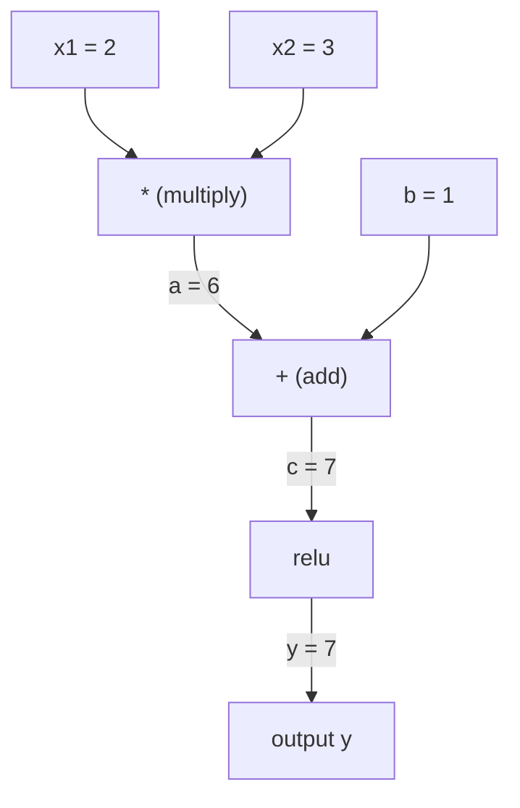
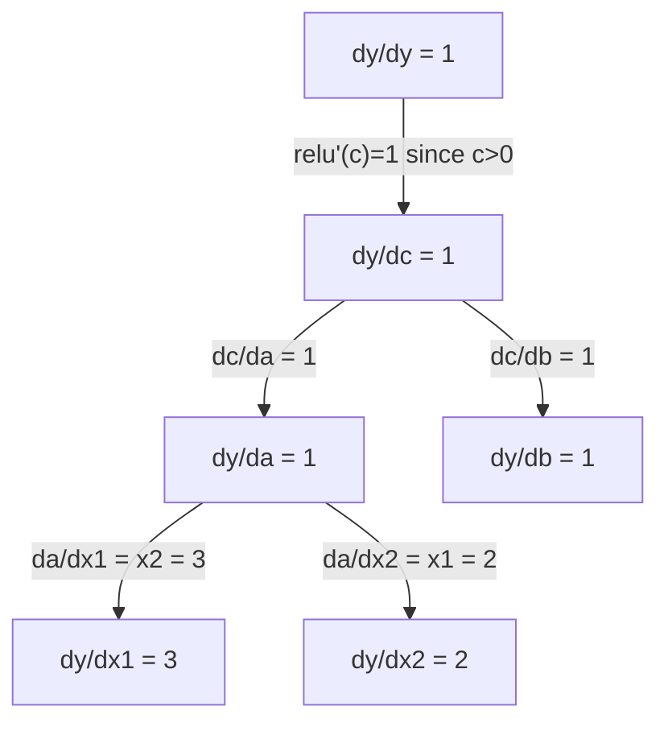

# Quy tắc chuỗi và sự khác biệt tự động

> Quy tắc chuỗi là công cụ đằng sau mọi mạng nơ-ron học hỏi.

**Loại:** Xây dựng
**Ngôn ngữ:** Python
**Kiến thức tiên quyết:** Giai đoạn 1, Bài 04 (Phái sinh & Gradients)
**Thời lượng:** ~90 phút

## Mục tiêu học tập

- Xây dựng một công cụ autograd tối thiểu (Giá trị class) ghi lại các hoạt động và tính toán gradients thông qua chế độ tự động đảo ngược
- Thực hiện chuyển tiếp và lùi qua biểu đồ tính toán bằng cách sắp xếp cấu trúc liên kết
- Xây dựng và huấn luyện một perceptron nhiều lớp trên XOR chỉ bằng cách sử dụng công cụ autograd từ đầu
- Xác minh tính đúng đắn của autodiff bằng cách sử dụng gradient kiểm tra so với chênh lệch hữu hạn số

## Vấn đề

Bạn có thể tính toán đạo hàm của các hàm đơn giản. Nhưng mạng nơ-ron không phải là một chức năng đơn giản. Đó là hàng trăm hàm được cấu tạo với nhau: ma trận nhân, cộng bias, áp dụng kích hoạt, ma trận nhân lại, softmax, loss entropy chéo. Đầu ra là một hàm của một hàm của một hàm.

Để huấn luyện mạng lưới, bạn cần gradient của loss đối với từng trọng lượng. Làm điều này bằng tay là điều không thể đối với hàng triệu parameters. Làm điều đó bằng số (chênh lệch hữu hạn) là quá chậm.

Quy tắc chuỗi cung cấp cho bạn phép toán. Sự khác biệt tự động cung cấp cho bạn thuật toán. Cùng với nhau, chúng cho phép bạn tính toán gradients chính xác thông qua các thành phần tùy ý của các hàm theo thời gian tỷ lệ thuận với một forward pass duy nhất.

Đây là cách hoạt động của PyTorch, TensorFlow và JAX. Bạn sẽ xây dựng một phiên bản thu nhỏ từ đầu.

## Khái niệm

### Quy tắc chuỗi

Nếu `y = f(g(x))`, đạo hàm của `y` đối với `x` là:

```
dy/dx = dy/dg * dg/dx = f'(g(x)) * g'(x)
```

Nhân các đạo hàm dọc theo chuỗi. Mỗi liên kết đóng góp phái sinh cục bộ của nó.

Ví dụ: `y = sin(x^2)`

```
g(x) = x^2       g'(x) = 2x
f(g) = sin(g)     f'(g) = cos(g)

dy/dx = cos(x^2) * 2x
```

Đối với các bố cục sâu hơn, chuỗi mở rộng:

```
y = f(g(h(x)))

dy/dx = f'(g(h(x))) * g'(h(x)) * h'(x)
```

Mỗi lớp trong mạng nơ-ron là một liên kết trong chuỗi này.

### Đồ thị tính toán

Đồ thị tính toán làm cho quy tắc chuỗi trở nên trực quan. Mọi hoạt động đều trở thành một nút. Dữ liệu chảy về phía trước thông qua biểu đồ. Gradients chảy ngược.

**Forward pass (giá trị tính toán):**



**Backward pass (gradients tính toán):**



backward pass áp dụng quy tắc chuỗi ở mọi nút, lan truyền gradients từ đầu ra đến đầu vào.

### Chế độ chuyển tiếp so với chế độ đảo ngược

Có hai cách để áp dụng quy tắc chuỗi thông qua biểu đồ.

**Chế độ chuyển tiếp** bắt đầu từ đầu vào và đẩy các đạo hàm về phía trước. Nó tính toán `dx/dx = 1` và lan truyền qua từng hoạt động. Tốt khi bạn có ít đầu vào và nhiều đầu ra.

```
Forward mode: seed dx/dx = 1, propagate forward

  x = 2       (dx/dx = 1)
  a = x^2     (da/dx = 2x = 4)
  y = sin(a)  (dy/dx = cos(a) * da/dx = cos(4) * 4 = -2.615)
```

**Chế độ đảo ngược** bắt đầu ở đầu ra và kéo gradients về phía sau. Nó tính toán `dy/dy = 1` và lan truyền qua từng hoạt động ngược lại. Tốt khi bạn có nhiều đầu vào và ít đầu ra.

```
Reverse mode: seed dy/dy = 1, propagate backward

  y = sin(a)  (dy/dy = 1)
  a = x^2     (dy/da = cos(a) = cos(4) = -0.654)
  x = 2       (dy/dx = dy/da * da/dx = -0.654 * 4 = -2.615)
```

Mạng nơ-ron có hàng triệu đầu vào (trọng số) và một đầu ra (loss). Chế độ đảo ngược tính toán tất cả gradients trong một backward pass. Đây là lý do tại sao backpropagation sử dụng chế độ đảo ngược.

| Chế độ | Hạt giống | Hướng dẫn | Tốt nhất khi |
|------|------|-----------|-----------|
| Chuyển tiếp | `dx_i/dx_i = 1` | Đầu vào đầu ra | Ít đầu vào, nhiều đầu ra |
| Đảo ngược | `dy/dy = 1` | Đầu ra vào đầu vào | Nhiều đầu vào, ít đầu ra (mạng nơ-ron) |

### Số kép cho chế độ chuyển tiếp

Chế độ chuyển tiếp có thể được thực hiện một cách trang nhã với số kép. Một số kép có dạng `a + b*epsilon` nơi `epsilon^2 = 0`.

```
Dual number: (value, derivative)

(2, 1) means: value is 2, derivative w.r.t. x is 1

Arithmetic rules:
  (a, a') + (b, b') = (a+b, a'+b')
  (a, a') * (b, b') = (a*b, a'*b + a*b')
  sin(a, a')         = (sin(a), cos(a)*a')
```

Hạt giống biến đầu vào với đạo hàm 1. Đạo hàm lan truyền tự động qua mọi hoạt động.

### Xây dựng động cơ Autograd

Một động cơ autograd cần ba điều:

1. **Bao bọc giá trị.** Bao bọc mọi số trong một đối tượng lưu trữ giá trị và gradient của nó.
2. **Ghi đồ thị.** Mọi thao tác đều ghi lại đầu vào và chức năng gradient cục bộ.
3. **Backward pass.** Sắp xếp biểu đồ cấu trúc liên kết, sau đó đi ngược lại, áp dụng quy tắc chuỗi tại mỗi nút.

Đây chính xác là những gì `autograd` của PyTorch làm. `torch.Tensor` class bao bọc các giá trị, ghi lại các hoạt động khi `requires_grad=True` và tính toán gradients khi bạn gọi `.backward()`.

### Cách hoạt động của Autograd PyTorch

Khi bạn viết mã PyTorch:

```python
x = torch.tensor(2.0, requires_grad=True)
y = x ** 2 + 3 * x + 1
y.backward()
print(x.grad)  # 7.0 = 2*x + 3 = 2*2 + 3
```

PyTorch nội bộ:

1. Tạo một nút `Tensor` cho `x` với `requires_grad=True`
2. Mỗi thao tác (`**`, `*`, `+`) tạo một nút mới và ghi lại hàm lùi
3. `y.backward()` triggers tự động chế độ đảo ngược thông qua biểu đồ được ghi lại
4. `grad_fn` của mỗi nút tính toán gradients cục bộ và chuyển chúng đến các nút mẹ
5. Gradients tích lũy trong các thuộc tính `.grad` thông qua phép cộng (không thay thế)

Biểu đồ là động (xác định từng lần chạy). Một biểu đồ mới được xây dựng trên mỗi forward pass. Đây là lý do tại sao PyTorch hỗ trợ luồng điều khiển (if/else, vòng lặp) bên trong models.

```figure
chain-rule
```

## Tự xây dựng

### Bước 1: Giá trị class

```python
class Value:
    def __init__(self, data, children=(), op=''):
        self.data = data
        self.grad = 0.0
        self._backward = lambda: None
        self._prev = set(children)
        self._op = op

    def __repr__(self):
        return f"Value(data={self.data:.4f}, grad={self.grad:.4f})"
```

Mỗi `Value` lưu trữ dữ liệu số, gradient của nó (ban đầu bằng không), một hàm ngược và trỏ đến các nút con đã tạo ra nó.

### Bước 2: Các phép toán số học với theo dõi gradient

```python
    def __add__(self, other):
        other = other if isinstance(other, Value) else Value(other)
        out = Value(self.data + other.data, (self, other), '+')
        def _backward():
            self.grad += out.grad
            other.grad += out.grad
        out._backward = _backward
        return out

    def __mul__(self, other):
        other = other if isinstance(other, Value) else Value(other)
        out = Value(self.data * other.data, (self, other), '*')
        def _backward():
            self.grad += other.data * out.grad
            other.grad += self.data * out.grad
        out._backward = _backward
        return out

    def relu(self):
        out = Value(max(0, self.data), (self,), 'relu')
        def _backward():
            self.grad += (1.0 if out.data > 0 else 0.0) * out.grad
        out._backward = _backward
        return out
```

Mỗi hoạt động tạo ra một closure biết cách tính toán gradients cục bộ và nhân với gradient ngược dòng (`out.grad`). `+=` xử lý trường hợp một giá trị được sử dụng trong nhiều hoạt động.

### Bước 3: Công backward pass

```python
    def backward(self):
        topo = []
        visited = set()
        def build_topo(v):
            if v not in visited:
                visited.add(v)
                for child in v._prev:
                    build_topo(child)
                topo.append(v)
        build_topo(self)

        self.grad = 1.0
        for v in reversed(topo):
            v._backward()
```

Sắp xếp cấu trúc liên kết đảm bảo gradient của mọi nút được tính toán đầy đủ trước khi nó lan truyền đến các nút con của nó. gradient hạt giống là 1,0 (dy/dy = 1).

### Bước 4: Nhiều thao tác hơn cho một động cơ hoàn chỉnh

Giá trị cơ bản class xử lý cộng, nhân và relu. Một động cơ autograd thực sự cần nhiều hơn thế. Dưới đây là các thao tác bạn cần để xây dựng mạng nơ-ron:

```python
    def __neg__(self):
        return self * -1

    def __sub__(self, other):
        return self + (-other)

    def __radd__(self, other):
        return self + other

    def __rmul__(self, other):
        return self * other

    def __rsub__(self, other):
        return other + (-self)

    def __pow__(self, n):
        out = Value(self.data ** n, (self,), f'**{n}')
        def _backward():
            self.grad += n * (self.data ** (n - 1)) * out.grad
        out._backward = _backward
        return out

    def __truediv__(self, other):
        return self * (other ** -1) if isinstance(other, Value) else self * (Value(other) ** -1)

    def exp(self):
        import math
        e = math.exp(self.data)
        out = Value(e, (self,), 'exp')
        def _backward():
            self.grad += e * out.grad
        out._backward = _backward
        return out

    def log(self):
        import math
        out = Value(math.log(self.data), (self,), 'log')
        def _backward():
            self.grad += (1.0 / self.data) * out.grad
        out._backward = _backward
        return out

    def tanh(self):
        import math
        t = math.tanh(self.data)
        out = Value(t, (self,), 'tanh')
        def _backward():
            self.grad += (1 - t ** 2) * out.grad
        out._backward = _backward
        return out
```

**Tại sao mỗi hoạt động lại quan trọng:**

| hoạt động | Quy tắc lạc hậu | Được sử dụng trong |
|-----------|--------------|---------|
| `__sub__` | Tái sử dụng add + neg | Loss tính toán (PRED - Target) |
| `__pow__` | n * x^(n-1) | Kích hoạt đa thức, MSE (lỗi^2) |
| `__truediv__` | Tái sử dụng mul + pow (-1) | Chuẩn hóa, learning rate mở rộng quy mô |
| `exp` | exp(x) * ngược dòng | Softmax, đăng nhập likelihood |
| `log` | (1/x) * ngược dòng | loss entropy chéo, log probabilities |
| `tanh` | (1 - tanh^2) * ngược dòng | Chức năng kích hoạt cổ điển |

Phần thông minh: `__sub__` và `__truediv__` được xác định theo các hoạt động hiện có. Chúng nhận được gradients chính xác miễn phí vì quy tắc chuỗi soạn thảo thông qua các hoạt động add/mul/pow cơ bản.

### Bước 5: Mini MLP từ đầu

Với một class giá trị hoàn chỉnh, bạn có thể xây dựng một mạng nơ-ron. Không PyTorch. Không NumPy. Chỉ cần Giá trị và quy tắc chuỗi.

```python
import random

class Neuron:
    def __init__(self, n_inputs):
        self.w = [Value(random.uniform(-1, 1)) for _ in range(n_inputs)]
        self.b = Value(0.0)

    def __call__(self, x):
        act = sum((wi * xi for wi, xi in zip(self.w, x)), self.b)
        return act.tanh()

    def parameters(self):
        return self.w + [self.b]

class Layer:
    def __init__(self, n_inputs, n_outputs):
        self.neurons = [Neuron(n_inputs) for _ in range(n_outputs)]

    def __call__(self, x):
        return [n(x) for n in self.neurons]

    def parameters(self):
        return [p for n in self.neurons for p in n.parameters()]

class MLP:
    def __init__(self, sizes):
        self.layers = [Layer(sizes[i], sizes[i+1]) for i in range(len(sizes)-1)]

    def __call__(self, x):
        for layer in self.layers:
            x = layer(x)
        return x[0] if len(x) == 1 else x

    def parameters(self):
        return [p for layer in self.layers for p in layer.parameters()]
```

Một `Neuron` tính toán `tanh(w1*x1 + w2*x2 + ... + b)`. Một `Layer` là một danh sách các tế bào thần kinh. Một `MLP` stacks lớp. Mỗi trọng lượng là một `Value`, vì vậy việc gọi `loss.backward()` lan truyền gradients đến mọi parameter.

**Training trên XOR:**

```python
random.seed(42)
model = MLP([2, 4, 1])  # 2 inputs, 4 hidden neurons, 1 output

xs = [[0, 0], [0, 1], [1, 0], [1, 1]]
ys = [-1, 1, 1, -1]  # XOR pattern (using -1/1 for tanh)

for step in range(100):
    preds = [model(x) for x in xs]
    loss = sum((p - y) ** 2 for p, y in zip(preds, ys))

    for p in model.parameters():
        p.grad = 0.0
    loss.backward()

    lr = 0.05
    for p in model.parameters():
        p.data -= lr * p.grad

    if step % 20 == 0:
        print(f"step {step:3d}  loss = {loss.data:.4f}")

print("\nPredictions after training:")
for x, y in zip(xs, ys):
    print(f"  input={x}  target={y:2d}  pred={model(x).data:6.3f}")
```

Đây là micrograd. Một mạng nơ-ron hoàn chỉnh training vòng lặp trong Python thuần túy với sự khác biệt tự động. Mọi framework deep learning thương mại đều làm điều tương tự ở quy mô lớn.

### Bước 6: Gradient kiểm tra

Làm thế nào để bạn biết autodiff của bạn là chính xác? So sánh nó với các đạo hàm số. Đây là gradient kiểm tra.

```python
def gradient_check(build_expr, x_val, h=1e-7):
    x = Value(x_val)
    y = build_expr(x)
    y.backward()
    autodiff_grad = x.grad

    y_plus = build_expr(Value(x_val + h)).data
    y_minus = build_expr(Value(x_val - h)).data
    numerical_grad = (y_plus - y_minus) / (2 * h)

    diff = abs(autodiff_grad - numerical_grad)
    return autodiff_grad, numerical_grad, diff
```

Kiểm tra nó trên một biểu thức phức tạp:

```python
def expr(x):
    return (x ** 3 + x * 2 + 1).tanh()

ad, num, diff = gradient_check(expr, 0.5)
print(f"Autodiff:  {ad:.8f}")
print(f"Numerical: {num:.8f}")
print(f"Difference: {diff:.2e}")
# Difference should be < 1e-5
```

Kiểm tra Gradient là điều cần thiết khi thực hiện các hoạt động mới. Nếu backward pass của bạn có lỗi, kiểm tra số sẽ phát hiện ra lỗi. Mọi triển khai deep learning nghiêm túc đều chạy gradient kiểm tra trong quá trình phát triển.

**Khi nào nên sử dụng kiểm tra gradient:**

| Tình huống | gradient có kiểm tra không? |
|-----------|-------------------|
| Thêm một thao tác mới vào autograd của bạn | Vâng, luôn luôn |
| Gỡ lỗi vòng lặp training không hội tụ | Có, hãy kiểm tra gradients trước |
| Production training | Không, quá chậm (2x đường chuyền về phía trước mỗi parameter) |
| Kiểm tra đơn vị cho mã autograd | Có, tự động hóa nó |

### Bước 7: Xác minh dựa trên tính toán thủ công

```python
x1 = Value(2.0)
x2 = Value(3.0)
a = x1 * x2          # a = 6.0
b = a + Value(1.0)    # b = 7.0
y = b.relu()          # y = 7.0

y.backward()

print(f"y = {y.data}")          # 7.0
print(f"dy/dx1 = {x1.grad}")   # 3.0 (= x2)
print(f"dy/dx2 = {x2.grad}")   # 2.0 (= x1)
```

Kiểm tra thủ công: `y = relu(x1*x2 + 1)`. Kể từ năm `x1*x2 + 1 = 7 > 0`, relu là bản sắc.
`dy/dx1 = x2 = 3`. `dy/dx2 = x1 = 2`. Động cơ phù hợp.

## Ứng dụng

### Xác minh dựa trên PyTorch

```python
import torch

x1 = torch.tensor(2.0, requires_grad=True)
x2 = torch.tensor(3.0, requires_grad=True)
a = x1 * x2
b = a + 1.0
y = torch.relu(b)
y.backward()

print(f"PyTorch dy/dx1 = {x1.grad.item()}")  # 3.0
print(f"PyTorch dy/dx2 = {x2.grad.item()}")  # 2.0
```

Cùng gradients. Công cụ của bạn tính toán kết quả tương tự như PyTorch vì phép toán là giống nhau: chế độ đảo ngược tự động vi sai thông qua quy tắc chuỗi.

### Biểu thức phức tạp hơn

```python
a = Value(2.0)
b = Value(-3.0)
c = Value(10.0)
f = (a * b + c).relu()  # relu(2*(-3) + 10) = relu(4) = 4

f.backward()
print(f"df/da = {a.grad}")  # -3.0 (= b)
print(f"df/db = {b.grad}")  #  2.0 (= a)
print(f"df/dc = {c.grad}")  #  1.0
```

## Sản phẩm bàn giao

Bài học này tạo ra:
- `outputs/skill-autodiff.md` -- một skill để xây dựng và gỡ lỗi hệ thống autograd
- `code/autodiff.py` - một động cơ autograd tối thiểu mà bạn có thể mở rộng

Giá trị class xây dựng ở đây là nền tảng cho vòng lặp training mạng nơ-ron trong Giai đoạn 3.

## Bài tập

1. Thêm `__pow__` vào class Giá trị để bạn có thể tính toán `x **n`. Xác minh rằng `d/dx(x^3)` ở `x=2` bằng `12.0`.

2. Thêm `tanh` làm chức năng kích hoạt. Xác minh rằng `tanh'(0) = 1` và `tanh'(2) = 0.0707` (xấp xỉ).

3. Xây dựng biểu đồ tính toán cho một tế bào thần kinh duy nhất: `y = relu(w1*x1 + w2*x2 + b)`. Tính toán tất cả năm gradients và xác minh so với PyTorch.

4. Triển khai autodiff chế độ chuyển tiếp bằng cách sử dụng số kép. Tạo một `Dual` class và xác minh rằng nó cung cấp các dẫn xuất giống như công cụ chế độ đảo ngược của bạn.

## Thuật ngữ chính

| Thuật ngữ | Những gì mọi người nói | Ý nghĩa thực sự của nó |
|------|----------------|----------------------|
| Quy tắc chuỗi | "Nhân các đạo hàm" | Đạo hàm của các hàm tổng hợp bằng tích của đạo hàm cục bộ của mỗi hàm, được đánh giá tại đúng điểm |
| Đồ thị tính toán | "Sơ đồ mạng" | Đồ thị không tuần hoàn có hướng trong đó các nút là hoạt động và các cạnh mang giá trị (thuận) hoặc gradients (lùi) |
| Chế độ chuyển tiếp | "Đẩy các công cụ phái sinh về phía trước" | Autodiff truyền dẫn xuất từ đầu vào đến đầu ra. Một lần vượt qua cho mỗi biến đầu vào. |
| Chế độ đảo ngược | "Backpropagation" | Autodiff truyền gradients từ đầu ra đến đầu vào. Một lần vượt qua cho mỗi biến đầu ra. |
| Autograd | "Tự động gradients" | Một hệ thống ghi lại các hoạt động trên các giá trị, xây dựng biểu đồ và tính toán gradients chính xác thông qua quy tắc chuỗi |
| Số kép | "Giá trị cộng với phái sinh" | Các số có dạng a + b * epsilon (epsilon ^ 2 = 0) mang thông tin đạo hàm thông qua số học |
| Sắp xếp tô pô | "Thứ tự phụ thuộc" | Sắp xếp các nút đồ thị để mọi nút đều có sau tất cả các phụ thuộc của nó. Cần thiết để nhân giống gradient chính xác. |
| Tích lũy Gradient | "Thêm, không thay thế" | Khi một giá trị đưa vào nhiều hoạt động, gradient của nó là tổng của tất cả các đóng góp gradient đến |
| Biểu đồ động | "Xác định bằng cách chạy" | Biểu đồ tính toán được xây dựng lại trên mỗi forward pass, cho phép Python luồng điều khiển bên trong models (kiểu PyTorch) |
| Kiểm tra Gradient | "Xác minh số" | So sánh gradients tự động với gradients hiệu hữu hạn số để xác minh tính đúng. Cần thiết để gỡ lỗi. |
| MLP | "Perceptron nhiều lớp" | Một mạng nơ-ron có một hoặc nhiều lớp tế bào thần kinh ẩn. Mỗi tế bào thần kinh tính toán một tổng trọng số cộng với bias, sau đó áp dụng một hàm kích hoạt. |
| Tế bào thần kinh | "Tổng trọng số + kích hoạt" | Đơn vị cơ bản: đầu ra = kích hoạt (w1 * x1 + w2 * x2 + ... + b). Trọng lượng và bias có thể học được parameters. |

## Đọc thêm

- [3Blue1Brown: Backpropagation calculus](https://www.youtube.com/watch?v=tIeHLnjs5U8) -- giải thích trực quan về quy tắc chuỗi trong mạng nơ-ron
- [PyTorch Autograd mechanics](https://pytorch.org/docs/stable/notes/autograd.html) - hệ thống thực hoạt động như thế nào
- [Baydin et al., Automatic Differentiation in Machine Learning: a Survey](https://arxiv.org/abs/1502.05767) -- tài liệu tham khảo toàn diện
