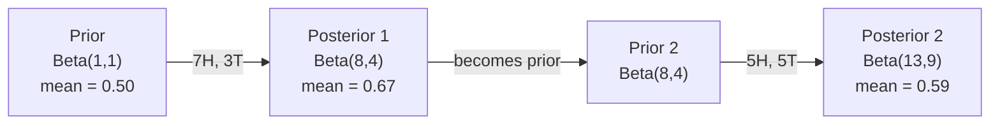

# Định lý Bayes

> Xác suất là về những gì bạn mong đợi. Định lý Bayes là về những gì bạn học.

**Loại:** Xây dựng
**Ngôn ngữ:** Python
**Kiến thức tiên quyết:** Giai đoạn 1, Bài 06 (Kiến thức cơ bản về xác suất)
**Thời lượng:** ~75 phút

## Mục tiêu học tập

- Áp dụng định lý Bayes để tính xác suất posterior từ priors, likelihoods và bằng chứng
- Xây dựng bộ phân loại văn bản Naive Bayes từ đầu với tính năng làm mịn Laplace và tính toán không gian nhật ký
- So sánh ước tính MLE và MAP và giải thích cách MAP tương ứng với chính quy hóa L2
- Thực hiện cập nhật Bayes tuần tự bằng cách sử dụng priors liên hợp Beta-Nhị thức để kiểm tra A/B

## Vấn đề

Xét nghiệm y tế chính xác 99%. Bạn có kết quả xét nghiệm dương tính. Khả năng bạn thực sự mắc bệnh là gì?

Hầu hết mọi người nói 99%. Câu trả lời thực sự phụ thuộc vào mức độ hiếm gặp của căn bệnh này. Nếu cứ 10.000 người thì có 1 người mắc bệnh, kết quả dương tính chỉ mang lại cho bạn khoảng 1% khả năng bị bệnh. 99% kết quả dương tính còn lại là báo động giả từ những người khỏe mạnh.

Đây không phải là một câu hỏi mẹo. Đó là định lý Bayes. Mọi bộ lọc thư rác, mọi chẩn đoán y tế, mọi model máy học định lượng sự không chắc chắn đều sử dụng lý do chính xác này. Bạn bắt đầu với một niềm tin. Bạn thấy bằng chứng. Bạn cập nhật.

Nếu bạn xây dựng hệ thống ML mà không hiểu điều này, bạn sẽ hiểu sai kết quả model, đặt ngưỡng xấu và ship dự đoán quá tự tin.

## Khái niệm

### Từ xác suất chung đến Bayes

Bạn đã biết từ Bài 06 rằng xác suất có điều kiện là:

```
P(A|B) = P(A and B) / P(B)
```

Và đối xứng:

```
P(B|A) = P(A and B) / P(A)
```

Cả hai biểu thức đều có chung tử số: P(A và B). Đặt chúng bằng nhau và sắp xếp lại:

```
P(A and B) = P(A|B) * P(B) = P(B|A) * P(A)

Therefore:

P(A|B) = P(B|A) * P(A) / P(B)
```

Đó là định lý Bayes. Bốn đại lượng, một phương trình.

### Bốn phần

| Phần | Tên | Nó có nghĩa là gì |
|------|------|---------------|
| P (A \ | B) | Posterior | Niềm tin cập nhật của bạn về A sau khi xem bằng chứng B |
| P (B \ | A) | Likelihood | Bằng chứng B có khả năng xảy ra như thế nào nếu A là đúng |
| P (A) | Prior | Niềm tin của bạn về A trước khi nhìn thấy bất kỳ bằng chứng nào |
| P (B) | Bằng chứng | Tổng xác suất nhìn thấy B trong tất cả các khả năng |

Thuật ngữ bằng chứng P (B) hoạt động như một chất chuẩn hóa. Bạn có thể mở rộng nó bằng cách sử dụng định luật tổng xác suất:

```
P(B) = P(B|A) * P(A) + P(B|not A) * P(not A)
```

### Ví dụ về xét nghiệm y tế

Một căn bệnh ảnh hưởng đến 1 trong 10.000 người. Xét nghiệm chính xác 99% (bắt được 99% người bệnh, cho kết quả dương tính giả 1% thời gian).

```
P(sick)          = 0.0001     (prior: disease is rare)
P(positive|sick) = 0.99       (likelihood: test catches it)
P(positive|healthy) = 0.01    (false positive rate)

P(positive) = P(positive|sick) * P(sick) + P(positive|healthy) * P(healthy)
            = 0.99 * 0.0001 + 0.01 * 0.9999
            = 0.000099 + 0.009999
            = 0.010098

P(sick|positive) = P(positive|sick) * P(sick) / P(positive)
                 = 0.99 * 0.0001 / 0.010098
                 = 0.0098
                 = 0.98%
```

Dưới 1%. prior thống trị. Khi một tình trạng hiếm gặp, ngay cả các xét nghiệm chính xác cũng tạo ra hầu hết các kết quả dương tính giả. Đây là lý do tại sao các bác sĩ yêu cầu xét nghiệm xác nhận.

### Ví dụ về bộ lọc thư rác

Bạn nhận được một email có chứa từ "xổ số". Nó có phải là thư rác không?

```
P(spam)                = 0.3      (30% of email is spam)
P("lottery"|spam)      = 0.05     (5% of spam emails contain "lottery")
P("lottery"|not spam)  = 0.001    (0.1% of legitimate emails contain "lottery")

P("lottery") = 0.05 * 0.3 + 0.001 * 0.7
             = 0.015 + 0.0007
             = 0.0157

P(spam|"lottery") = 0.05 * 0.3 / 0.0157
                  = 0.955
                  = 95.5%
```

Một từ thay đổi xác suất từ 30% lên 95,5%. Một bộ lọc thư rác thực sự áp dụng Bayes trên hàng trăm từ cùng một lúc.

### Naive Bayes: giả định độc lập

Naive Bayes mở rộng điều này thành nhiều features bằng cách giả định rằng tất cả các features đều độc lập có điều kiện cho class:

```
P(class | feature_1, feature_2, ..., feature_n)
  = P(class) * P(feature_1|class) * P(feature_2|class) * ... * P(feature_n|class)
    / P(feature_1, feature_2, ..., feature_n)
```

Phần "ngây thơ" là giả định độc lập. Trong văn bản, sự xuất hiện của từ không độc lập ("New" và "York" có tương quan với nhau). Nhưng giả định này hoạt động tốt một cách đáng ngạc nhiên trong thực tế vì bộ phân loại chỉ cần xếp hạng classes chứ không phải tạo ra xác suất đã hiệu chỉnh.

Vì mẫu số giống nhau cho tất cả các classes, bạn có thể bỏ qua nó và chỉ so sánh tử số:

```
score(class) = P(class) * product of P(feature_i | class)
```

Chọn class có số điểm cao nhất.

### Ước tính likelihood tối đa (MLE)

Làm thế nào để bạn có được P (feature |class) từ dữ liệu training? Đếm.

```
P("free"|spam) = (number of spam emails containing "free") / (total spam emails)
```

Đây là MLE: chọn các giá trị parameter làm cho dữ liệu quan sát có nhiều khả năng nhất. Bạn đang tối đa hóa hàm likelihood, đối với số đếm rời rạc sẽ giảm xuống tần số tương đối.

Vấn đề: nếu một từ không bao giờ xuất hiện trong thư rác trong quá trình training, MLE sẽ cho nó xác suất bằng không. Một từ vô hình giết chết toàn bộ sản phẩm. Khắc phục điều này bằng làm mịn Laplace:

```
P(word|class) = (count(word, class) + 1) / (total_words_in_class + vocabulary_size)
```

Thêm 1 vào mỗi số đếm đảm bảo không có xác suất nào bằng không.

### Tối đa một hậu (MAP)

MLE hỏi: điều gì parameters tối đa hóa P (dữ liệu |parameters)?

MAP hỏi: điều gì parameters tối đa hóa P(parameters|data)?

Theo định lý Bayes:

```
P(parameters|data) proportional to P(data|parameters) * P(parameters)
```

MAP thêm một prior trên chính parameters. Nếu bạn tin rằng parameters nên nhỏ, bạn mã hóa nó như một prior phạt các giá trị lớn. Điều này giống với chính quy hóa L2 trong ML. Hình phạt "sườn núi" trong hồi quy sườn núi theo nghĩa đen là một prior Gaussian trên trọng lượng.

| Ước tính | Tối ưu hóa | ML tương đương |
|------------|-----------|---------------|
| MLE | P (dữ liệu \ | tham số) | training không chính quy |
| BẢN ĐỒ | P (dữ liệu \ | tham số) * P (tham số) | Chính quy hóa L2 / L1 |

### Bayes và thường xuyên: sự khác biệt thực tế

Những người thường xuyên coi parameters là những ẩn số cố định. Họ hỏi: "Nếu tôi lặp lại thí nghiệm này nhiều lần, điều gì sẽ xảy ra?"

Những người theo chủ nghĩa Bayes coi parameters là phân phối. Họ hỏi: "Với những gì tôi đã quan sát, tôi tin gì về parameters?"

Đối với việc xây dựng hệ thống ML, sự khác biệt thực tế:

| Khía cạnh | Người thường xuyên | Bayes |
|--------|-------------|----------|
| Đầu ra | Ước tính điểm | Phân phối trên giá trị |
| Sự không chắc chắn | Khoảng tin cậy (về thủ tục) | Khoảng thời gian đáng tin cậy (khoảng parameter) |
| Dữ liệu nhỏ | Có thể quá phù hợp | Prior hoạt động như chính quy hóa |
| Tính toán | Thường nhanh hơn | Thường yêu cầu sampling (MCMC) |

Hầu hết production ML là thường xuyên (SGD, ước tính điểm). Các phương pháp Bayes tỏa sáng khi bạn cần độ không chắc chắn được hiệu chỉnh (quyết định y tế, hệ thống quan trọng về an toàn) hoặc khi dữ liệu khan hiếm (few-shot học tập, cold start).

### Tại sao tư duy Bayes lại quan trọng đối với ML

Mối liên hệ sâu sắc hơn so với phép so sánh:

**Priors là chính quy hóa.** Một prior Gaussian về trọng số là chính quy hóa L2. Một prior Laplace là L1. Mỗi khi bạn thêm một thuật ngữ chính quy hóa, bạn đang đưa ra một tuyên bố Bayes về những giá trị parameter bạn mong đợi.

**Posteriors là sự không chắc chắn.** Một xác suất dự đoán duy nhất không cho bạn biết mức độ tin cậy của model trong ước tính đó. Phương thức Bayes cung cấp cho bạn một phân phối: "Tôi nghĩ P (spam) nằm trong khoảng từ 0,8 đến 0,95."

**Cập nhật Bayes là học trực tuyến.** posterior hôm nay trở thành prior của ngày mai. Khi model của bạn nhìn thấy dữ liệu mới, nó sẽ cập nhật niềm tin của mình dần dần thay vì huấn luyện lại từ đầu.

**Model so sánh là Bayes.** Tiêu chí thông tin Bayes (BIC), likelihood cận biên và các yếu tố Bayes đều sử dụng lý luận Bayes để lựa chọn giữa models mà không có overfitting.

```figure
bayes-update
```

## Tự xây dựng

### Bước 1: Hàm định lý Bayes

```python
def bayes(prior, likelihood, false_positive_rate):
    evidence = likelihood * prior + false_positive_rate * (1 - prior)
    posterior = likelihood * prior / evidence
    return posterior

result = bayes(prior=0.0001, likelihood=0.99, false_positive_rate=0.01)
print(f"P(sick|positive) = {result:.4f}")
```

### Bước 2: Bộ phân loại Naive Bayes

```python
import math
from collections import defaultdict

class NaiveBayes:
    def __init__(self, smoothing=1.0):
        self.smoothing = smoothing
        self.class_counts = defaultdict(int)
        self.word_counts = defaultdict(lambda: defaultdict(int))
        self.class_word_totals = defaultdict(int)
        self.vocab = set()

    def train(self, documents, labels):
        for doc, label in zip(documents, labels):
            self.class_counts[label] += 1
            words = doc.lower().split()
            for word in words:
                self.word_counts[label][word] += 1
                self.class_word_totals[label] += 1
                self.vocab.add(word)

    def predict(self, document):
        words = document.lower().split()
        total_docs = sum(self.class_counts.values())
        vocab_size = len(self.vocab)
        best_class = None
        best_score = float("-inf")
        for cls in self.class_counts:
            score = math.log(self.class_counts[cls] / total_docs)
            for word in words:
                count = self.word_counts[cls].get(word, 0)
                total = self.class_word_totals[cls]
                score += math.log((count + self.smoothing) / (total + self.smoothing * vocab_size))
            if score > best_score:
                best_score = score
                best_class = cls
        return best_class
```

Log probabilities ngăn chặn dòng chảy ngược. Nhân nhiều xác suất nhỏ tạo ra các số quá nhỏ đối với dấu phẩy động. Tổng xác suất log ổn định về mặt số và tương đương về mặt toán học.

### Bước 3: Huấn luyện về dữ liệu spam

```python
train_docs = [
    "win free money now",
    "free lottery ticket winner",
    "claim your prize today free",
    "urgent offer free cash",
    "congratulations you won free",
    "meeting tomorrow at noon",
    "project update attached",
    "can we schedule a call",
    "quarterly report review",
    "lunch on thursday sounds good",
    "team standup notes attached",
    "please review the pull request",
]

train_labels = [
    "spam", "spam", "spam", "spam", "spam",
    "ham", "ham", "ham", "ham", "ham", "ham", "ham",
]

classifier = NaiveBayes()
classifier.train(train_docs, train_labels)

test_messages = [
    "free money waiting for you",
    "meeting rescheduled to friday",
    "you won a free prize",
    "please review the attached report",
]

for msg in test_messages:
    print(f"  '{msg}' -> {classifier.predict(msg)}")
```

### Bước 4: Kiểm tra xác suất đã học

```python
def show_top_words(classifier, cls, n=5):
    vocab_size = len(classifier.vocab)
    total = classifier.class_word_totals[cls]
    probs = {}
    for word in classifier.vocab:
        count = classifier.word_counts[cls].get(word, 0)
        probs[word] = (count + classifier.smoothing) / (total + classifier.smoothing * vocab_size)
    sorted_words = sorted(probs.items(), key=lambda x: x[1], reverse=True)
    for word, prob in sorted_words[:n]:
        print(f"    {word}: {prob:.4f}")

print("\nTop spam words:")
show_top_words(classifier, "spam")
print("\nTop ham words:")
show_top_words(classifier, "ham")
```

## Ứng dụng

Scikit-tìm hiểu các triển khai Bayes ngây thơ sẵn sàng cho ships production:

```python
from sklearn.feature_extraction.text import CountVectorizer
from sklearn.naive_bayes import MultinomialNB
from sklearn.metrics import classification_report

vectorizer = CountVectorizer()
X_train = vectorizer.fit_transform(train_docs)
clf = MultinomialNB()
clf.fit(X_train, train_labels)

X_test = vectorizer.transform(test_messages)
predictions = clf.predict(X_test)
for msg, pred in zip(test_messages, predictions):
    print(f"  '{msg}' -> {pred}")
```

Cùng một thuật toán. CountVectorizer xử lý tokenization và xây dựng từ vựng. MultinomialNB xử lý làm mịn và xác suất log bên trong. Phiên bản từ đầu của bạn cũng làm điều tương tự trong 40 dòng.

## Sản phẩm bàn giao

NaiveBayes class được xây dựng ở đây thể hiện đầy đủ pipeline: tokenization, ước tính xác suất với làm mịn Laplace, dự đoán không gian log. Mã trong `code/bayes.py` chạy end-to-end mà không có phần phụ thuộc nào ngoài thư viện tiêu chuẩn của Python.

### Liên hợp Priors

Khi prior và posterior thuộc cùng một họ phân phối, prior được gọi là "liên hợp". Điều này làm cho việc cập nhật Bayes về mặt đại số sạch sẽ - bạn nhận được một posterior dạng đóng mà không cần tích hợp số.

| Likelihood | Liên hợp Prior | Posterior | Ví dụ |
|-----------|----------------|-----------|---------|
| Bernoulli | Beta(a, b) | Beta (a + thành công, b + thất bại) | Ước tính bias lật đồng xu |
| Bình thường (đã biết variance) | Bình thường (mu_0, sigma_0) | Bình thường (trung bình có trọng số, variance nhỏ hơn) | Hiệu chuẩn cảm biến |
| Poisson | Gamma (a, b) | Gamma (a + tổng số đếm, b + n) | Lập mô hình giá đến |
| Đa thức | Dirichlet (alpha) | Dirichlet (alpha + số lượng) | Mô hình hóa chủ đề, models ngôn ngữ |

Tại sao điều này lại quan trọng: không có priors liên hợp, bạn cần Monte Carlo sampling hoặc inference biến thể để xấp xỉ posterior. Với priors liên hợp, bạn chỉ cần cập nhật hai số.

Phân phối Beta là prior liên hợp phổ biến nhất trong thực tế. Beta (a, b) đại diện cho niềm tin của bạn về parameter xác suất. Giá trị trung bình là a/(a+b). A + b càng lớn thì phân phối càng tập trung (tự tin).

Các trường hợp đặc biệt của prior Beta:
- Beta (1, 1) = đồng nhất. Bạn không có ý kiến gì về parameter.
- Beta (10, 10) = đạt đỉnh ở mức 0,5. Bạn tin tưởng mạnh mẽ rằng parameter là gần 0,5.
- Beta (1, 10) = nghiêng về 0. Bạn tin rằng parameter là nhỏ.

Quy tắc cập nhật rất đơn giản:

```
Prior:     Beta(a, b)
Data:      s successes, f failures
Posterior: Beta(a + s, b + f)
```

Không có tích phân. Không sampling. Chỉ cần cộng.

### Cập nhật Bayes tuần tự

inference Bayes là tuần tự tự nhiên. posterior hôm nay trở thành prior của ngày mai. Đây là cách các hệ thống thực học dần mà không cần xử lý lại tất cả dữ liệu lịch sử.

Ví dụ cụ thể: ước tính liệu một đồng tiền có công bằng hay không.

**Ngày 1: Chưa có dữ liệu.**
Bắt đầu với Beta (1, 1) - một prior đồng nhất. Bạn không có ý kiến.
- Prior trung bình: 0.5
- Prior phẳng trên [0, 1]

**Ngày 2: Quan sát 7 đầu, 3 đuôi.**
Posterior = Beta (1 + 7, 1 + 3) = Beta (8, 4)
- Posterior nghĩa là: 8/12 = 0.667
- Bằng chứng cho thấy đồng tiền này thiên về phía đầu

**Ngày 3: Quan sát thêm 5 đầu, 5 đuôi nữa.**
Sử dụng posterior của ngày hôm qua làm prior của ngày hôm nay.
Posterior = Beta (8 + 5, 4 + 5) = Beta (13, 9)
- Posterior trung bình: 13/22 = 0.591
- Dữ liệu mới cân bằng đã kéo ước tính trở lại mức 0,5



Thứ tự quan sát không quan trọng. Beta(1,1) được cập nhật với tất cả 12 đầu và 8 đuôi cùng một lúc cho Beta(13, 9) -- kết quả tương tự. Cập nhật tuần tự và cập nhật batch tương đương về mặt toán học. Nhưng cập nhật tuần tự cho phép bạn đưa ra quyết định ở từng bước mà không cần lưu trữ dữ liệu thô.

Đây là nền tảng của việc học trực tuyến trong các hệ thống production ML. Thompson sampling cho kẻ cướp, hệ thống đề xuất gia tăng và máy dò dị thường streaming đều sử dụng mẫu này.

### Kết nối với thử nghiệm A/B

Thử nghiệm A/B là inference Bayes ngụy trang.

Thiết lập: bạn đang thử nghiệm hai màu nút. Mẫu mã A (xanh dương) và mẫu mã B (xanh lá cây). Bạn muốn biết cái nào nhận được nhiều nhấp chuột hơn.

Bài kiểm tra A/B Bayes:

1. **Prior.** Bắt đầu với Beta(1, 1) cho cả hai biến thể. Không có sở thích prior.
2. **Dữ liệu.** Biến thể A: 50 nhấp chuột trong số 1000 lượt xem. Biến thể B: 65 nhấp chuột trong số 1000 lượt xem.
3. **Posteriors.**
   - A: Beta (1 + 50, 1 + 950) = Beta (51, 951). Trung bình = 0,051
   - B: Beta (1 + 65, 1 + 935) = Beta (66, 936). Trung bình = 0,066
4. **Quyết định.** Tính toán P (B > A) -- xác suất tỷ lệ chuyển đổi thực của B cao hơn A.

Tính toán P (B > A) một cách phân tích rất khó. Nhưng Monte Carlo làm cho nó trở nên tầm thường:

```
1. Draw 100,000 samples from Beta(51, 951)  -> samples_A
2. Draw 100,000 samples from Beta(66, 936)  -> samples_B
3. P(B > A) = fraction of samples where B > A
```

Nếu P(B > A) > 0,95, bạn ship biến thể B. Nếu nó nằm trong khoảng từ 0,05 đến 0,95, bạn tiếp tục thu thập dữ liệu. Nếu P(B > A) < 0,05, bạn ship mẫu mã A.

Ưu điểm so với kiểm tra A/B thường xuyên:
- Bạn nhận được một tuyên bố xác suất trực tiếp: "có 97% cơ hội B tốt hơn"
- Không có nhầm lẫn giá trị p. Không có phòng ngừa rủi ro "không bác bỏ giả thuyết không".
- Bạn có thể kiểm tra kết quả bất cứ lúc nào mà không tăng tỷ lệ dương tính giả (không có "vấn đề nhìn trộm")
- Bạn có thể kết hợp kiến thức prior (ví dụ: các thử nghiệm trước đây cho thấy tỷ lệ chuyển đổi thường là 3-8%)

| Khía cạnh | A/B thường xuyên | Bayes A/B |
|--------|----------------|--------------|
| Đầu ra | giá trị p | P (B > A) |
| Giải thích | "Dữ liệu này đáng ngạc nhiên như thế nào nếu A = B?" | "Khả năng B tốt hơn A là bao nhiêu?" |
| Dừng sớm | Thổi phồng dương tính giả | An toàn tại bất kỳ thời điểm nào (với một prior được lựa chọn kỹ lưỡng và model được chỉ định chính xác) |
| Prior kiến thức | Không được sử dụng | Được mã hóa dưới dạng prior Beta |
| Quy tắc quyết định | p < 0,05 | P (B > A) > ngưỡng |

## Bài tập

1. **Nhiều xét nghiệm.** Một bệnh nhân có kết quả xét nghiệm dương tính hai lần trên các xét nghiệm độc lập (cả hai đều chính xác 99%, tỷ lệ mắc bệnh là 1 trên 10.000). P (ốm) là gì sau cả hai xét nghiệm? Sử dụng posterior từ bài kiểm tra đầu tiên làm prior cho bài kiểm tra thứ hai.

2. **Tác động làm mịn.** Chạy trình phân loại thư rác với các giá trị làm mịn là 0,01, 0,1, 1,0 và 10,0. Xác suất từ hàng đầu thay đổi như thế nào? Điều gì xảy ra với smoothing = 0 và một từ chỉ xuất hiện trong giăm bông?

3. **Thêm features.** Mở rộng class NaiveBayes để cũng sử dụng độ dài tin nhắn (short/long) làm feature cùng với số từ. Ước tính P (ngắn | spam) và P (ngắn | ham) từ dữ liệu training và gộp nó vào điểm dự đoán.

4. **MAP bằng tay.** Với dữ liệu quan sát được (7 đầu trong 10 lần tung đồng xu), hãy tính ước tính MAP của bias bằng cách sử dụng prior Beta (2,2). So sánh nó với ước tính MLE (7/10).

## Thuật ngữ chính

| Thuật ngữ | Những gì mọi người nói | Ý nghĩa thực sự của nó |
|------|----------------|----------------------|
| Prior | "Dự đoán ban đầu của tôi" | P (giả thuyết) trước khi quan sát bằng chứng. Trong ML: thuật ngữ chính quy hóa. |
| Likelihood | "Dữ liệu phù hợp như thế nào" | P(bằng chứng\ | giả thuyết). Dữ liệu quan sát được xác suất như thế nào theo một giả thuyết cụ thể. |
| Posterior | "Niềm tin cập nhật của tôi" | P(giả thuyết\ | bằng chứng). prior nhân với likelihood, sau đó chuẩn hóa. |
| Bằng chứng | "Hằng số chuẩn hóa" | P (dữ liệu) trên tất cả các giả thuyết. Đảm bảo tổng posterior là 1. |
| Bayes ngây thơ | "Công cụ phân loại văn bản đơn giản đó" | Một bộ phân loại giả định features độc lập với class. Hoạt động tốt mặc dù giả định sai. |
| Làm mịn Laplace | "Làm mịn thêm một" | Thêm một số lượng nhỏ vào mỗi feature để ngăn xác suất bằng không từ dữ liệu không nhìn thấy. |
| MLE | "Chỉ cần sử dụng tần số" | Chọn parameters tối đa hóa P(data\ | parameters). Không prior. Có thể quá phù hợp với dữ liệu nhỏ. |
| BẢN ĐỒ | "MLE với prior" | Chọn parameters tối đa hóa P(data\ | parameters) * P (parameters). Tương đương với MLE chính quy. |
| Xác suất nhật ký | "Làm việc trong log space" | Sử dụng log(P) thay vì P để tránh dòng chảy dấu phẩy động khi nhân nhiều số nhỏ. |
| Dương tính giả | "Báo động sai" | Xét nghiệm cho biết dương tính, nhưng trạng thái thực là âm tính. Thúc đẩy ngụy biện tỷ lệ cơ bản. |

## Đọc thêm

- [3Blue1Brown: Bayes' theorem](https://www.youtube.com/watch?v=HZGCoVF3YvM) - giải thích trực quan với ví dụ xét nghiệm y tế
- [Stanford CS229: Generative Learning Algorithms](https://cs229.stanford.edu/notes2022fall/cs229-notes2.pdf) - Bayes ngây thơ và mối liên hệ của nó với models phân biệt đối xử
- [Think Bayes](https://greenteapress.com/wp/think-bayes/) - sách miễn phí, thống kê Bayes với mã Python
- [scikit-learn Naive Bayes](https://scikit-learn.org/stable/modules/naive_bayes.html) - triển khai production và thời điểm sử dụng từng biến thể
