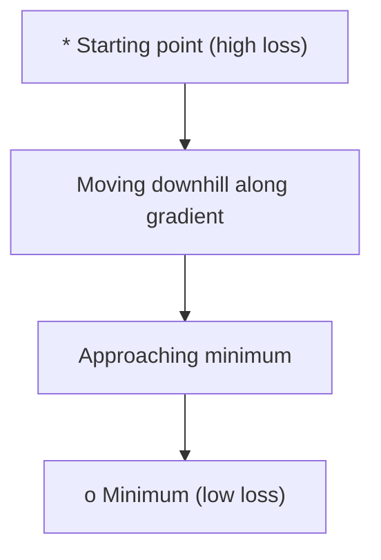
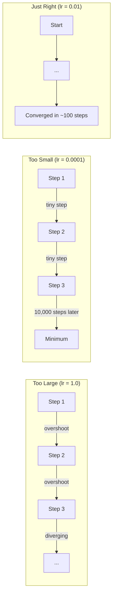
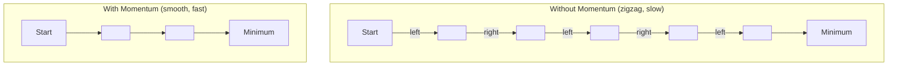
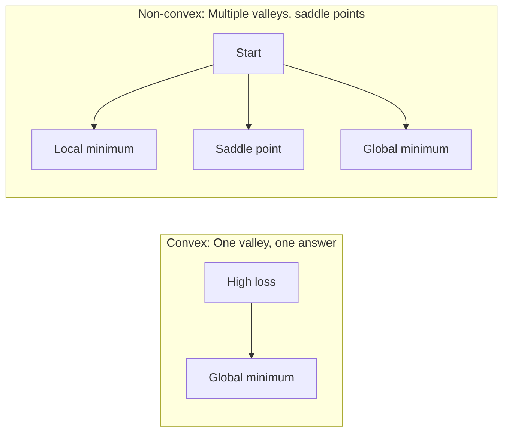
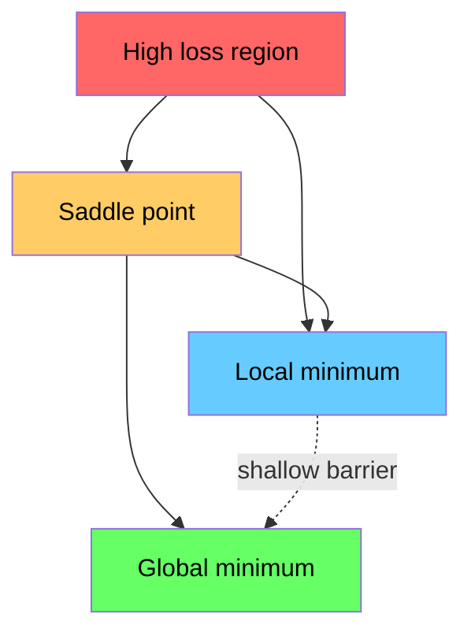

# Tối ưu hóa

> Training một mạng nơ-ron không gì khác hơn là tìm đáy của một thung lũng.

**Loại:** Xây dựng
**Ngôn ngữ:** Python
**Kiến thức tiên quyết:** Giai đoạn 1, Bài 04-05 (Phái sinh, Gradients)
**Thời lượng:** ~75 phút

## Mục tiêu học tập

- Thực hiện gradient descent vani, SGD với động lượng và Adam từ đầu
- So sánh optimizer hội tụ trên hàm Rosenbrock và giải thích lý do tại sao Adam điều chỉnh tốc độ học tập trên mỗi trọng số
- Phân biệt cảnh quan loss lồi với không lồi và giải thích vai trò của các điểm yên ngựa trong kích thước cao
- Cấu hình lịch trình learning rate (phân rã bước, ủ cosin, khởi động) để ổn định training

## Vấn đề

Bạn có một chức năng loss. Nó cho bạn biết model của bạn sai như thế nào. Bạn có gradients. Họ cho bạn biết hướng nào làm cho loss trở nên tồi tệ hơn. Bây giờ bạn cần một chiến lược để đi bộ xuống dốc.

Cách tiếp cận ngây thơ rất đơn giản: di chuyển ngược lại gradient. Chia tỷ lệ bước theo một số nào đó được gọi là learning rate. Lặp lại. Điều này là gradient descent, và nó hoạt động. Nhưng "hoạt động" có những cảnh báo. Một learning rate quá lớn và bạn vượt qua thung lũng hoàn toàn, nảy giữa các bức tường. Quá nhỏ và bạn bò về phía câu trả lời qua hàng ngàn bước không cần thiết. Đánh vào một điểm yên ngựa và bạn ngừng di chuyển mặc dù bạn chưa tìm thấy mức tối thiểu.

Mỗi optimizer trong deep learning là một câu trả lời cho cùng một câu hỏi: làm thế nào để bạn xuống đáy thung lũng nhanh hơn và đáng tin cậy hơn?

## Khái niệm

### Tối ưu hóa có nghĩa là gì

Tối ưu hóa là tìm các giá trị đầu vào để giảm thiểu (hoặc tối đa hóa) một hàm. Trong học máy, chức năng là loss. Đầu vào là trọng số của model. Training là tối ưu hóa.

```
minimize L(w) where:
  L = loss function
  w = model weights (could be millions of parameters)
```

### Gradient descent (vani)

Đơn giản nhất optimizer. Tính gradient của loss đối với mọi trọng lượng. Di chuyển từng quả tạ theo hướng ngược lại với gradient của nó. Mở rộng quy mô từng bước theo learning rate.

```
w = w - lr * gradient
```

Đó là toàn bộ thuật toán. Một dòng.



### Learning rate: hyperparameter quan trọng nhất

learning rate kiểm soát kích thước bước. Nó xác định mọi thứ về sự hội tụ.



Không có công thức cho learning rate đúng. Bạn tìm thấy nó bằng cách thử nghiệm. Điểm xuất phát phổ biến: 0,001 cho Adam, 0,01 cho SGD với động lượng.

### SGD so với batch và mini-batch

Vanilla gradient descent tính toán gradient trên toàn bộ dataset trước khi thực hiện một bước. Đây được gọi là batch gradient descent. Nó ổn định nhưng chậm.

Stochastic gradient descent (SGD) tính toán gradient trên một mẫu ngẫu nhiên duy nhất và các bước ngay lập tức. Nó ồn ào nhưng nhanh.

Mini-batch gradient descent phân chia sự khác biệt. Tính gradient trên một batch nhỏ (32, 64, 128, 256 mẫu), sau đó bước. Đây là những gì mọi người thực sự sử dụng.

| Biến thể | Kích thước Batch | Chất lượng Gradient | Tốc độ mỗi bước | Nhiễu |
|---------|-----------|-----------------|---------------|-------|
| Batch GD | Toàn bộ dataset | Chính xác | Chậm | Không có |
| SGD | 1 mẫu | Rất ồn ào | Nhanh chóng | Cao |
| batch nhỏ | 32-256 | Ước tính tốt | Cân bằng | Trung bình |

Nhiễu trong SGD và mini-batch không phải là lỗi. Nó giúp thoát khỏi các điểm tối thiểu và yên ngựa cục bộ nông.

### Động lượng: quả bóng lăn xuống dốc

Vanilla gradient descent chỉ nhìn vào gradient hiện tại. Nếu gradient ngoằn ngoèo (phổ biến ở các thung lũng hẹp), tiến độ chậm. Động lượng khắc phục điều này bằng cách tích lũy gradients trong quá khứ thành một số hạng vận tốc.

```
v = beta * v + gradient
w = w - lr * v
```

Phép so sánh: một quả bóng lăn xuống dốc. Nó không dừng lại và khởi động lại ở mỗi lần va chạm. Nó xây dựng tốc độ theo các hướng nhất quán và làm giảm dao động.



`beta` (thường là 0,9) kiểm soát lượng lịch sử cần lưu giữ. Beta cao hơn có nghĩa là nhiều động lực hơn, đường đi mượt mà hơn, nhưng phản ứng chậm hơn với sự thay đổi hướng.

### Adam: tỷ lệ học tập thích ứng

Các trọng lượng khác nhau cần tốc độ học tập khác nhau. Một trọng lượng hiếm khi trở nên lớn gradients nên thực hiện các bước lớn hơn khi cuối cùng nó xảy ra. Một trọng lượng lớn gradients liên tục nên thực hiện các bước nhỏ hơn.

Adam (Ước tính khoảnh khắc thích ứng) theo dõi hai thứ trên mỗi trọng lượng:

1. Khoảnh khắc đầu tiên (m): trung bình chạy gradients (như động lượng)
2. Mômen thứ hai (v): trung bình chạy của gradients bình phương (gradient độ lớn)

```
m = beta1 * m + (1 - beta1) * gradient
v = beta2 * v + (1 - beta2) * gradient^2

m_hat = m / (1 - beta1^t)    bias correction
v_hat = v / (1 - beta2^t)    bias correction

w = w - lr * m_hat / (sqrt(v_hat) + epsilon)
```

Sự phân chia theo `sqrt(v_hat)` là cái nhìn sâu sắc quan trọng. Trọng lượng có gradients lớn được chia cho một số lớn (bước hiệu quả nhỏ). Trọng lượng có gradients nhỏ được chia cho một số nhỏ (bước hiệu quả lớn). Mỗi trọng lượng có learning rate thích ứng riêng.

hyperparameters mặc định: `lr=0.001, beta1=0.9, beta2=0.999, epsilon=1e-8`. Các giá trị mặc định này hoạt động tốt cho hầu hết các vấn đề.

### Learning rate lịch trình

Một learning rate cố định là một sự thỏa hiệp. Sớm trong training, bạn muốn có những bước lớn để tiến bộ nhanh chóng. Cuối training, bạn muốn các bước nhỏ fine-tune gần mức tối thiểu.

Lịch trình phổ biến:

| Lịch trình | Công thức | Trường hợp sử dụng |
|----------|---------|----------|
| Phân rã bước | lr = lr * hệ số mỗi N epochs | Điều khiển thủ công, đơn giản |
| Phân rã theo cấp số nhân | lr = lr_0 * phân rã^t | Giảm mịn |
| Ủ cosine | lr = lr_min + 0,5 * (lr_max - lr_min) * (1 + cos (pi * t / T)) | Transformers, training hiện đại |
| Khởi động + phân rã | Đường dốc tuyến tính tăng lên, sau đó phân rã | models lớn, ngăn ngừa sự mất ổn định sớm |

### Lồi vs không lồi

Một hàm lồi có một hàm tối thiểu. Gradient descent luôn tìm thấy nó. Một bậc hai như `f(x) = x^2` là lồi.

Các chức năng loss mạng nơ-ron không lồi. Chúng có nhiều điểm tối thiểu cục bộ, điểm yên xe và vùng bằng phẳng.



Trong thực tế, mức tối thiểu cục bộ trong mạng nơ-ron high-dimensional hiếm khi là một vấn đề. Hầu hết các giá trị tối thiểu cục bộ đều có giá trị loss gần với mức tối thiểu toàn cầu. Điểm yên xe (phẳng theo một số hướng, cong theo những hướng khác) là chướng ngại vật thực sự. Động lượng và nhiễu từ batches mini giúp thoát khỏi chúng.

### Loss hình ảnh cảnh quan

loss là một hàm của tất cả các trọng lượng. Đối với một model có 1 triệu trọng lượng, cảnh quan loss sống trong không gian 1.000.001 chiều. Chúng ta hình dung nó bằng cách chọn hai hướng ngẫu nhiên trong không gian trọng lượng và vẽ loss dọc theo các hướng đó, tạo ra một bề mặt 2D.



Tối thiểu sắc nét khái quát hóa kém. Flat minima khái quát tốt. Đây là một lý do SGD với động lượng thường vượt trội hơn Adam trong accuracy thử nghiệm cuối cùng: nhiễu của nó ngăn chặn sự lắng xuống mức tối thiểu sắc nét.

```figure
gradient-descent
```

## Tự xây dựng

### Bước 1: Xác định hàm kiểm tra

Hàm Rosenbrock là một benchmark tối ưu hóa cổ điển. Mức tối thiểu của nó là (1, 1) bên trong một thung lũng cong hẹp dễ tìm nhưng khó theo dõi.

```
f(x, y) = (1 - x)^2 + 100 * (y - x^2)^2
```

```python
def rosenbrock(params):
    x, y = params
    return (1 - x) ** 2 + 100 * (y - x ** 2) ** 2

def rosenbrock_gradient(params):
    x, y = params
    df_dx = -2 * (1 - x) + 200 * (y - x ** 2) * (-2 * x)
    df_dy = 200 * (y - x ** 2)
    return [df_dx, df_dy]
```

### Bước 2: gradient descent vani

```python
class GradientDescent:
    def __init__(self, lr=0.001):
        self.lr = lr

    def step(self, params, grads):
        return [p - self.lr * g for p, g in zip(params, grads)]
```

### Bước 3: SGD với động lượng

```python
class SGDMomentum:
    def __init__(self, lr=0.001, momentum=0.9):
        self.lr = lr
        self.momentum = momentum
        self.velocity = None

    def step(self, params, grads):
        if self.velocity is None:
            self.velocity = [0.0] * len(params)
        self.velocity = [
            self.momentum * v + g
            for v, g in zip(self.velocity, grads)
        ]
        return [p - self.lr * v for p, v in zip(params, self.velocity)]
```

### Bước 4: Adam

```python
class Adam:
    def __init__(self, lr=0.001, beta1=0.9, beta2=0.999, epsilon=1e-8):
        self.lr = lr
        self.beta1 = beta1
        self.beta2 = beta2
        self.epsilon = epsilon
        self.m = None
        self.v = None
        self.t = 0

    def step(self, params, grads):
        if self.m is None:
            self.m = [0.0] * len(params)
            self.v = [0.0] * len(params)

        self.t += 1

        self.m = [
            self.beta1 * m + (1 - self.beta1) * g
            for m, g in zip(self.m, grads)
        ]
        self.v = [
            self.beta2 * v + (1 - self.beta2) * g ** 2
            for v, g in zip(self.v, grads)
        ]

        m_hat = [m / (1 - self.beta1 ** self.t) for m in self.m]
        v_hat = [v / (1 - self.beta2 ** self.t) for v in self.v]

        return [
            p - self.lr * mh / (vh ** 0.5 + self.epsilon)
            for p, mh, vh in zip(params, m_hat, v_hat)
        ]
```

### Bước 5: Chạy và so sánh

```python
def optimize(optimizer, func, grad_func, start, steps=5000):
    params = list(start)
    history = [params[:]]
    for _ in range(steps):
        grads = grad_func(params)
        params = optimizer.step(params, grads)
        history.append(params[:])
    return history

start = [-1.0, 1.0]

gd_history = optimize(GradientDescent(lr=0.0005), rosenbrock, rosenbrock_gradient, start)
sgd_history = optimize(SGDMomentum(lr=0.0001, momentum=0.9), rosenbrock, rosenbrock_gradient, start)
adam_history = optimize(Adam(lr=0.01), rosenbrock, rosenbrock_gradient, start)

for name, history in [("GD", gd_history), ("SGD+M", sgd_history), ("Adam", adam_history)]:
    final = history[-1]
    loss = rosenbrock(final)
    print(f"{name:6s} -> x={final[0]:.6f}, y={final[1]:.6f}, loss={loss:.8f}")
```

Đầu ra dự kiến: Adam hội tụ nhanh nhất. SGD với động lượng đi theo một con đường suôn sẻ hơn. Vanilla GD tiến bộ chậm dọc theo thung lũng hẹp.

## Ứng dụng

Trong thực tế, sử dụng PyTorch hoặc JAX optimizers. Chúng xử lý các nhóm parameter, phân rã trọng lượng, cắt gradient và gia tốc GPU.

```python
import torch

model = torch.nn.Linear(784, 10)

sgd = torch.optim.SGD(model.parameters(), lr=0.01, momentum=0.9)
adam = torch.optim.Adam(model.parameters(), lr=0.001)
adamw = torch.optim.AdamW(model.parameters(), lr=0.001, weight_decay=0.01)

scheduler = torch.optim.lr_scheduler.CosineAnnealingLR(adam, T_max=100)
```

Quy tắc ngón tay cái:

- Bắt đầu với Adam (lr = 0,001). Nó hoạt động cho hầu hết các vấn đề mà không cần điều chỉnh.
- Chuyển sang SGD với động lượng (lr = 0,01, động lượng = 0,9) khi bạn cần accuracy cuối cùng tốt nhất và có đủ khả năng điều chỉnh nhiều hơn.
- Sử dụng AdamW (Adam có phân rã trọng lượng tách rời) để transformers.
- Luôn sử dụng lịch trình learning rate cho training chạy dài hơn một vài epochs.
- Nếu training không ổn định, hãy giảm learning rate. Nếu training quá chậm, hãy tăng nó.

## Sản phẩm bàn giao

Bài học này tạo ra một prompt để chọn optimizer phù hợp. Xem `outputs/prompt-optimizer-guide.md`.

Các optimizer classes được xây dựng ở đây xuất hiện trở lại trong Giai đoạn 3 khi chúng tôi huấn luyện một mạng nơ-ron từ đầu.

## Bài tập

1. **Learning rate quét.** Chạy vanilla gradient descent trên hàm Rosenbrock với tốc độ học [0,0001, 0,0005, 0,001, 0,005, 0,01]. Vẽ hoặc in loss cuối cùng sau 5000 bước cho mỗi bước. Tìm learning rate lớn nhất vẫn hội tụ.

2. **So sánh động lượng.** Chạy SGD với các giá trị động lượng [0,0, 0,5, 0,9, 0,99] trên hàm Rosenbrock. Theo dõi loss ở từng bước. Giá trị động lượng nào hội tụ nhanh nhất? Vượt quá mức nào?

3. **Thoát điểm yên ngựa.** Xác định chức năng `f(x, y) = x^2 - y^2` (một điểm yên tại điểm gốc). Bắt đầu từ (0,01, 0,01). So sánh cách hoạt động của GD, SGD vani với động lượng và Adam. Cái nào thoát khỏi điểm yên ngựa?

4. **Thực hiện phân rã learning rate.** Thêm lịch phân rã theo cấp số nhân vào class GradientDescent: `lr = lr_0 * 0.999^step`. So sánh hội tụ có và không phân rã trên hàm Rosenbrock.

## Thuật ngữ chính

| Thuật ngữ | Những gì mọi người nói | Ý nghĩa thực sự của nó |
|------|----------------|----------------------|
| Gradient descent | "Đi xuống dốc" | Cập nhật trọng số bằng cách trừ đi gradient được chia tỷ lệ theo learning rate. Các optimizer cơ bản nhất. |
| Learning rate | "Kích thước bước" | Một vô hướng kiểm soát khoảng cách mỗi bản cập nhật di chuyển trọng số. Quá lớn gây ra sự phân kỳ. Tính toán lãng phí quá nhỏ. |
| Động lượng | "Tiếp tục lăn bánh" | Tích lũy gradients quá khứ thành một vector vận tốc. Giảm dao động và tăng tốc chuyển động thông qua các hướng nhất quán. |
| SGD | "sampling ngẫu nhiên" | Stochastic gradient descent. Tính toán gradient trên một tập con ngẫu nhiên thay vì toàn bộ dataset. Hầu như luôn có nghĩa là batch SGD nhỏ trong thực tế. |
| batch nhỏ | "Một khối dữ liệu" | Một tập hợp nhỏ dữ liệu training (32-256 mẫu) được sử dụng để ước tính gradient. Cân bằng tốc độ và gradient accuracy. |
| Adam | "optimizer mặc định" | Ước tính thời điểm thích ứng. Theo dõi trung bình chạy trên mỗi trọng lượng là gradients và bình phương gradients để tạo cho mỗi trọng lượng learning rate riêng. |
| Chỉnh sửa Bias | "Sửa cold start" | Khoảnh khắc đầu tiên và thứ hai của Adam được khởi tạo về không. Bias điều chỉnh chia cho (1 - beta^t) để bù đắp trong các bước đầu. |
| Learning rate lịch trình | "Thay đổi lr theo thời gian" | Một chức năng điều chỉnh learning rate trong quá trình training. Bước lớn sớm, bước nhỏ muộn. |
| Chức năng lồi | "Một thung lũng" | Một hàm trong đó bất kỳ giá trị tối thiểu cục bộ nào là giá trị tối thiểu toàn cục. Gradient descent luôn tìm thấy nó. Tổn thất mạng nơ-ron không lồi. |
| Điểm yên xe | "Phẳng nhưng không phải là tối thiểu" | Một điểm mà gradient bằng không nhưng nó là tối thiểu ở một số hướng và cực đại ở những hướng khác. Phổ biến ở kích thước cao. |
| Loss cảnh quan | "Địa hình" | Hàm loss được vẽ trên không gian trọng lượng. Được hình dung bằng cách cắt dọc theo hai hướng ngẫu nhiên. |
| Hội tụ | "Đến đó" | optimizer đã đạt đến điểm mà các bước tiếp theo không làm giảm loss một cách có ý nghĩa. |

## Đọc thêm

- [Sebastian Ruder: An overview of gradient descent optimization algorithms](https://ruder.io/optimizing-gradient-descent/) - khảo sát toàn diện tất cả các optimizers chính
- [Why Momentum Really Works (Distill)](https://distill.pub/2017/momentum/) - trực quan hóa tương tác của động lực động lượng
- [Adam: A Method for Stochastic Optimization (Kingma & Ba, 2014)](https://arxiv.org/abs/1412.6980) - giấy gốc Adam, dễ đọc và ngắn gọn
- [Visualizing the Loss Landscape of Neural Nets (Li et al., 2018)](https://arxiv.org/abs/1712.09913) - giấy hiển thị tối thiểu sắc nét và phẳng
