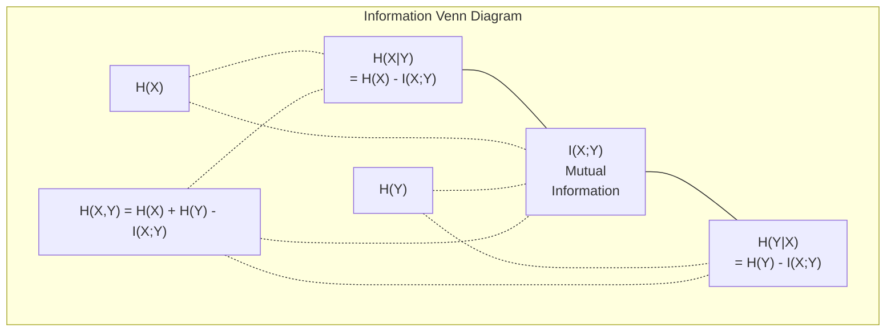

# Lý thuyết thông tin

> Lý thuyết thông tin đo lường sự bất ngờ. Loss chức năng được xây dựng trên đó.

**Loại:** Học
**Ngôn ngữ:** Python
**Kiến thức tiên quyết:** Giai đoạn 1, Bài 06 (Xác suất)
**Thời lượng:** ~60 phút

## Mục tiêu học tập

- Tính toán entropy, entropy chéo và phân kỳ KL từ đầu và giải thích mối quan hệ của chúng
- Rút ra lý do tại sao giảm thiểu các loss entropy chéo tương đương với tối đa hóa log-likelihood
- Tính toán thông tin lẫn nhau giữa features và mục tiêu để xếp hạng tầm quan trọng feature
- Giải thích perplexity là kích thước từ vựng hiệu quả mà ngôn ngữ model chọn

## Vấn đề

Bạn gọi `CrossEntropyLoss()` trong mọi phân loại model bạn huấn luyện. Bạn thấy "perplexity" trong mọi ngôn ngữ model giấy. Bạn đã đọc về sự phân kỳ KL trong VAE, distillation và RLHF. Đây không phải là những khái niệm ngắt kết nối. Tất cả họ đều có cùng một ý tưởng khi đội những chiếc mũ khác nhau.

Lý thuyết thông tin cung cấp cho bạn ngôn ngữ để suy luận về sự không chắc chắn, nén và dự đoán. Claude Shannon đã phát minh ra nó vào năm 1948 để giải quyết các vấn đề liên lạc. Hóa ra, training mạng nơ-ron là một vấn đề liên lạc: model đang cố gắng truyền nhãn chính xác thông qua một kênh nhiễu của trọng số đã học.

Bài học này xây dựng mọi công thức từ đầu để bạn biết chúng đến từ đâu và tại sao chúng hoạt động.

## Khái niệm

### Nội dung thông tin (Bất ngờ)

Khi điều gì đó không chắc chắn xảy ra, nó mang nhiều thông tin hơn. Một đầu hạ cánh đồng xu? Không có gì đáng ngạc nhiên. Một trúng xổ số? Rất đáng ngạc nhiên.

Nội dung thông tin của một sự kiện có xác suất p là:

```
I(x) = -log(p(x))
```

Sử dụng log base 2 cung cấp cho bạn bit. Sử dụng nhật ký tự nhiên mang lại cho bạn nats. Cùng một ý tưởng, các đơn vị khác nhau.

```
Event              Probability    Surprise (bits)
Fair coin heads    0.5            1.0
Rolling a 6        0.167          2.58
1-in-1000 event    0.001          9.97
Certain event      1.0            0.0
```

Một số sự kiện không mang thông tin. Bạn đã biết chúng sẽ xảy ra.

### Entropy (Bất ngờ trung bình)

Entropy là sự ngạc nhiên được mong đợi trên tất cả các kết quả có thể xảy ra của một phân phối.

```
H(P) = -sum( p(x) * log(p(x)) )  for all x
```

Một đồng tiền công bằng có entropy tối đa cho một biến nhị phân: 1 bit. Một đồng xu thiên vị (99% đầu) có entropy thấp: 0,08 bit. Bạn đã biết điều gì sẽ xảy ra, vì vậy mỗi lần lật hầu như không cho bạn biết gì.

```
Fair coin:    H = -(0.5 * log2(0.5) + 0.5 * log2(0.5)) = 1.0 bit
Biased coin:  H = -(0.99 * log2(0.99) + 0.01 * log2(0.01)) = 0.08 bits
```

Entropy đo lường độ không chắc chắn không thể rút gọn trong một phân phối. Bạn không thể nén bên dưới nó.

### Cross-entropy (hàm Loss bạn sử dụng hàng ngày)

Cross-entropy đo lường sự ngạc nhiên trung bình khi bạn sử dụng phân phối Q để mã hóa các sự kiện thực sự đến từ phân phối P.

```
H(P, Q) = -sum( p(x) * log(q(x)) )  for all x
```

P là phân phối thực sự (các nhãn). Q là dự đoán của model bạn. Nếu Q khớp với P một cách hoàn hảo, entropy chéo bằng entropy. Bất kỳ sự không khớp nào cũng làm cho nó lớn hơn.

Trong phân loại, P là một vector một nóng (class thực có xác suất 1, mọi thứ khác là 0). Điều này đơn giản hóa entropy chéo để:

```
H(P, Q) = -log(q(true_class))
```

Đó là toàn bộ công thức loss entropy chéo để phân loại. Tối đa hóa xác suất dự đoán của class chính xác.

### Phân kỳ KL (Khoảng cách giữa các phân phối)

Phân kỳ KL đo lường mức độ ngạc nhiên mà bạn nhận được khi sử dụng Q thay vì P.

```
D_KL(P || Q) = sum( p(x) * log(p(x) / q(x)) )  for all x
             = H(P, Q) - H(P)
```

Entropy chéo là entropy cộng với phân kỳ KL. Vì entropy của phân phối thực là không đổi trong quá trình training, nên việc giảm thiểu entropy chéo cũng giống như giảm thiểu phân kỳ KL. Bạn đang đẩy phân phối model của bạn theo hướng phân phối thực sự.

Phân kỳ KL không đối xứng: D_KL(P || Q) != D_KL(Q || P). Nó không phải là một thước đo khoảng cách thực sự.

### Thông tin lẫn nhau

Thông tin lẫn nhau đo lường mức độ biết một biến cho bạn biết về một biến khác.

```
I(X; Y) = H(X) - H(X|Y)
        = H(X) + H(Y) - H(X, Y)
```

Nếu X và Y độc lập, thông tin lẫn nhau bằng không. Biết cái này không cho bạn biết gì về cái kia. Nếu chúng tương quan hoàn hảo, thông tin lẫn nhau bằng entropy của một trong hai biến.

Trong lựa chọn feature, thông tin lẫn nhau cao giữa feature và mục tiêu có nghĩa là feature hữu ích. Thông tin lẫn nhau thấp có nghĩa là đó là nhiễu.

### Entropy có điều kiện

H (Y |X) đo lường mức độ không chắc chắn còn lại về Y sau khi bạn quan sát X.

```
H(Y|X) = H(X,Y) - H(X)
```

Hai thái cực:
- Nếu X xác định hoàn toàn Y, thì H(Y|X) = 0. Biết X loại bỏ tất cả sự không chắc chắn về Y. Ví dụ: X = temperature tính bằng độ C, Y = temperature tính bằng độ F.
- Nếu X không cho bạn biết gì về Y, thì H(Y|X) = H(Y). Biết X không làm giảm sự không chắc chắn của bạn chút nào. Ví dụ: X = tung đồng xu, Y = thời tiết ngày mai.

Entropy có điều kiện luôn không âm và không bao giờ vượt quá H(Y):

```
0 <= H(Y|X) <= H(Y)
```

Trong học máy, entropy có điều kiện xuất hiện trong cây quyết định. Ở mỗi lần phân tách, thuật toán chọn feature X để giảm thiểu H (Y |X) -- feature loại bỏ sự không chắc chắn nhất về nhãn Y.

### Entropy chung

H (X, Y) là entropy của sự phân bố chung của X và Y với nhau.

```
H(X,Y) = -sum sum p(x,y) * log(p(x,y))   for all x, y
```

Thuộc tính chính:

```
H(X,Y) <= H(X) + H(Y)
```

Bình đẳng được giữ khi X và Y độc lập. Nếu chúng chia sẻ thông tin, entropy chung nhỏ hơn tổng của các entropy riêng lẻ. Entropy "thiếu" chính xác là thông tin lẫn nhau.



Các mối quan hệ:
- H(X,Y) = H(X) + H(Y|X) = H(Y) + H(X|Y)
- I(X;Y) = H(X) - H(X|Y) = H(Y) - H(Y|X)
- H(X,Y) = H(X) + H(Y) - I(X;Y)

### Thông tin lẫn nhau (Deep Dive)

Thông tin tương hỗ I(X;Y) định lượng mức độ biết một biến làm giảm sự không chắc chắn về biến kia.

```
I(X;Y) = H(X) - H(X|Y)
       = H(Y) - H(Y|X)
       = H(X) + H(Y) - H(X,Y)
       = sum sum p(x,y) * log(p(x,y) / (p(x) * p(y)))
```

Tính chất:
- I(X;Y) >= 0 luôn luôn. Bạn không bao giờ mất thông tin bằng cách quan sát một cái gì đó.
- I(X;Y) = 0 nếu và chỉ khi X và Y độc lập.
- I(X;Y) = I(Y; X). Nó đối xứng, không giống như phân kỳ KL.
- I(X;X) = H(X). Một biến chia sẻ tất cả thông tin của nó với chính nó.

**Thông tin chung để lựa chọn feature.** Trong ML, bạn muốn features thông tin về mục tiêu. Thông tin lẫn nhau cung cấp cho bạn một cách có nguyên tắc để xếp hạng features:

1. Đối với mỗi feature X_i, tính I(X_i; Y) trong đó Y là biến đích.
2. Xếp hạng features theo điểm MI.
3. Giữ k trên cùng features.

Điều này hoạt động cho bất kỳ mối quan hệ nào giữa feature và mục tiêu - tuyến tính, phi tuyến, đơn điệu hoặc không. Tương quan chỉ nắm bắt các mối quan hệ tuyến tính. MI nắm bắt mọi thứ.

| Phương pháp | Phát hiện | Chi phí tính toán | Xử lý phân loại? |
|--------|---------|-------------------|---------------------|
| Tương quan Pearson | Mối quan hệ tuyến tính | O (n) | Không |
| Tương quan Spearman | Các mối quan hệ đơn điệu | O (n log n) | Không |
| Thông tin lẫn nhau | Bất kỳ sự phụ thuộc thống kê nào | O (n log n) với binning | Có |

### Làm mịn nhãn và Cross-Entropy

Phân loại chuẩn sử dụng các mục tiêu cứng: [0, 0, 1, 0]. class thực có xác suất 1, mọi thứ khác nhận được 0. Làm mịn nhãn thay thế chúng bằng các mục tiêu mềm:

```
soft_target = (1 - epsilon) * hard_target + epsilon / num_classes
```

Với epsilon = 0,1 và 4 classes:
- Mục tiêu khó: [0, 0, 1, 0]
- Mục tiêu mềm: [0,025, 0,025, 0,925, 0,025]

Từ góc độ lý thuyết thông tin, làm mịn nhãn làm tăng entropy của phân phối đích. Các mục tiêu một nóng cứng có entropy 0 - không có sự không chắc chắn. Mục tiêu mềm có entropy dương.

Tại sao điều này giúp:
- Ngăn model đẩy logits đến các giá trị cực trị (cần logits vô hạn để khớp hoàn hảo với mục tiêu một nóng dưới entropy chéo)
- Hoạt động như chính quy hóa: model không thể tự tin 100%
- Cải thiện hiệu chuẩn: xác suất dự đoán phản ánh tốt hơn độ không chắc chắn thực sự
- Giảm khoảng cách giữa hành vi training và inference

loss entropy chéo với làm mịn nhãn trở thành:

```
L = (1 - epsilon) * CE(hard_target, prediction) + epsilon * H_uniform(prediction)
```

Thuật ngữ thứ hai trừng phạt những dự đoán không đồng nhất - một sự chính quy hóa trực tiếp về niềm tin.

### Tại sao entropy chéo là phân loại Loss

Ba quan điểm, cùng một kết luận.

**Chế độ xem lý thuyết thông tin.** Entropy chéo đo lường số bit bạn lãng phí bằng cách sử dụng phân phối của model thay vì phân phối thực. Giảm thiểu nó làm cho model của bạn trở thành encoder thực tế hiệu quả nhất.

**Chế độ xem likelihood tối đa.** Đối với N training samples có classes y_i thực:

```
Likelihood     = product( q(y_i) )
Log-likelihood = sum( log(q(y_i)) )
Negative log-likelihood = -sum( log(q(y_i)) )
```

Dòng cuối cùng đó là loss entropy chéo. Giảm thiểu entropy chéo = tối đa hóa likelihood của dữ liệu training dưới model của bạn.

**Gradient quan điểm.** gradient của entropy chéo đối với logits là đơn giản (dự đoán - đúng). Sạch sẽ, ổn định và tính toán nhanh. Đây là lý do tại sao nó kết hợp hoàn hảo với softmax.

### Bits so với Nats

Sự khác biệt duy nhất là cơ sở nhật ký.

```
log base 2   -> bits      (information theory tradition)
log base e   -> nats      (machine learning convention)
log base 10  -> hartleys  (rarely used)
```

1 nat = 1/ln(2) bit = 1.4427 bit. PyTorch và TensorFlow sử dụng nhật ký tự nhiên (nats) theo mặc định.

### Perplexity

Perplexity là hàm mũ của entropy chéo. Nó cho bạn biết số lượng hiệu quả của các lựa chọn có khả năng tương đương mà model không chắc chắn giữa.

```
Perplexity = 2^H(P,Q)   (if using bits)
Perplexity = e^H(P,Q)   (if using nats)
```

Một model ngôn ngữ có perplexity 50, trung bình, bị nhầm lẫn như thể nó phải chọn đồng nhất từ 50 có thể vào tokens tới. Thấp hơn là tốt hơn.

GPT-2 đạt được perplexity ~30 trên benchmarks thông thường. Các models hiện đại nằm trong một chữ số cho các miền được đại diện tốt.

```figure
entropy-kl
```

## Tự xây dựng

### Bước 1: Nội dung thông tin và entropy

```python
import math

def information_content(p, base=2):
    if p <= 0 or p > 1:
        return float('inf') if p <= 0 else 0.0
    return -math.log(p) / math.log(base)

def entropy(probs, base=2):
    return sum(
        p * information_content(p, base)
        for p in probs if p > 0
    )

fair_coin = [0.5, 0.5]
biased_coin = [0.99, 0.01]
fair_die = [1/6] * 6

print(f"Fair coin entropy:   {entropy(fair_coin):.4f} bits")
print(f"Biased coin entropy: {entropy(biased_coin):.4f} bits")
print(f"Fair die entropy:    {entropy(fair_die):.4f} bits")
```

### Bước 2: Phân kỳ entropy chéo và KL

```python
def cross_entropy(p, q, base=2):
    total = 0.0
    for pi, qi in zip(p, q):
        if pi > 0:
            if qi <= 0:
                return float('inf')
            total += pi * (-math.log(qi) / math.log(base))
    return total

def kl_divergence(p, q, base=2):
    return cross_entropy(p, q, base) - entropy(p, base)

true_dist = [0.7, 0.2, 0.1]
good_model = [0.6, 0.25, 0.15]
bad_model = [0.1, 0.1, 0.8]

print(f"Entropy of true dist:     {entropy(true_dist):.4f} bits")
print(f"CE (good model):          {cross_entropy(true_dist, good_model):.4f} bits")
print(f"CE (bad model):           {cross_entropy(true_dist, bad_model):.4f} bits")
print(f"KL divergence (good):     {kl_divergence(true_dist, good_model):.4f} bits")
print(f"KL divergence (bad):      {kl_divergence(true_dist, bad_model):.4f} bits")
```

### Bước 3: Entropy chéo để phân loại loss

```python
def softmax(logits):
    max_logit = max(logits)
    exps = [math.exp(z - max_logit) for z in logits]
    total = sum(exps)
    return [e / total for e in exps]

def cross_entropy_loss(true_class, logits):
    probs = softmax(logits)
    return -math.log(probs[true_class])

logits = [2.0, 1.0, 0.1]
true_class = 0

probs = softmax(logits)
loss = cross_entropy_loss(true_class, logits)

print(f"Logits:      {logits}")
print(f"Softmax:     {[f'{p:.4f}' for p in probs]}")
print(f"True class:  {true_class}")
print(f"Loss:        {loss:.4f} nats")
print(f"Perplexity:  {math.exp(loss):.2f}")
```

### Bước 4: Entropy chéo bằng log-likelihood âm

```python
import random

random.seed(42)

n_samples = 1000
n_classes = 3
true_labels = [random.randint(0, n_classes - 1) for _ in range(n_samples)]
model_logits = [[random.gauss(0, 1) for _ in range(n_classes)] for _ in range(n_samples)]

ce_loss = sum(
    cross_entropy_loss(label, logits)
    for label, logits in zip(true_labels, model_logits)
) / n_samples

nll = -sum(
    math.log(softmax(logits)[label])
    for label, logits in zip(true_labels, model_logits)
) / n_samples

print(f"Cross-entropy loss:      {ce_loss:.6f}")
print(f"Negative log-likelihood: {nll:.6f}")
print(f"Difference:              {abs(ce_loss - nll):.2e}")
```

### Bước 5: Thông tin lẫn nhau

```python
def mutual_information(joint_probs, base=2):
    rows = len(joint_probs)
    cols = len(joint_probs[0])

    margin_x = [sum(joint_probs[i][j] for j in range(cols)) for i in range(rows)]
    margin_y = [sum(joint_probs[i][j] for i in range(rows)) for j in range(cols)]

    mi = 0.0
    for i in range(rows):
        for j in range(cols):
            pxy = joint_probs[i][j]
            if pxy > 0:
                mi += pxy * math.log(pxy / (margin_x[i] * margin_y[j])) / math.log(base)
    return mi

independent = [[0.25, 0.25], [0.25, 0.25]]
dependent = [[0.45, 0.05], [0.05, 0.45]]

print(f"MI (independent): {mutual_information(independent):.4f} bits")
print(f"MI (dependent):   {mutual_information(dependent):.4f} bits")
```

## Ứng dụng

Các khái niệm tương tự sử dụng NumPy, cách bạn sẽ sử dụng chúng trong thực tế:

```python
import numpy as np

def np_entropy(p):
    p = np.asarray(p, dtype=float)
    mask = p > 0
    result = np.zeros_like(p)
    result[mask] = p[mask] * np.log(p[mask])
    return -result.sum()

def np_cross_entropy(p, q):
    p, q = np.asarray(p, dtype=float), np.asarray(q, dtype=float)
    mask = p > 0
    return -(p[mask] * np.log(q[mask])).sum()

def np_kl_divergence(p, q):
    return np_cross_entropy(p, q) - np_entropy(p)

true = np.array([0.7, 0.2, 0.1])
pred = np.array([0.6, 0.25, 0.15])
print(f"Entropy:    {np_entropy(true):.4f} nats")
print(f"Cross-ent:  {np_cross_entropy(true, pred):.4f} nats")
print(f"KL div:     {np_kl_divergence(true, pred):.4f} nats")
```

Bạn đã xây dựng từ đầu những gì `torch.nn.CrossEntropyLoss()` làm trong nội bộ. Bây giờ bạn đã biết tại sao loss giảm trong training: phân phối dự đoán của model của bạn đang tiến gần hơn đến phân phối thực, được đo bằng số lượng thông tin bị lãng phí.

## Bài tập

1. Tính entropy của bảng chữ cái tiếng Anh giả định phân phối đồng đều (26 chữ cái). Sau đó, ước tính nó bằng cách sử dụng tần số chữ cái thực tế. Cái nào cao hơn và tại sao?

2. Một model xuất ra logits [5.0, 2.0, 0.5] cho mẫu có class 1 thực. Tính toán loss entropy chéo bằng tay, sau đó xác minh bằng hàm `cross_entropy_loss` của bạn. Điều gì logits sẽ không loss?

3. Cho thấy sự phân kỳ KL không đối xứng. Chọn hai phân phối P và Q và tính toán D_KL(P || Q) và D_KL(Q || P). Giải thích lý do tại sao chúng khác nhau.

4. Xây dựng một hàm tính toán perplexity cho một chuỗi các dự đoán token. Cho một danh sách các cặp (true_token_index, predicted_logits), trả về perplexity của dãy.

## Thuật ngữ chính

| Thuật ngữ | Những gì mọi người nói | Ý nghĩa thực sự của nó |
|------|----------------|----------------------|
| Nội dung thông tin | "Bất ngờ" | Số bit (hoặc nat) cần thiết để mã hóa một sự kiện: -log(p) |
| Entropy | "Tính ngẫu nhiên" | Sự ngạc nhiên trung bình trên tất cả các kết quả của một phân phối. Đo lường độ không chắc chắn không thể giảm bớt. |
| Entropy chéo | "Chức năng loss" | Bất ngờ trung bình khi sử dụng Q phân phối model để mã hóa các sự kiện từ phân phối thực P. |
| Phân kỳ KL | "Khoảng cách giữa các phân phối" | Các bit bổ sung bị lãng phí bằng cách sử dụng Q thay vì P. Bằng entropy chéo trừ đi entropy. Không đối xứng. |
| Thông tin lẫn nhau | "X và Y có liên quan như thế nào" | Giảm sự không chắc chắn về X từ việc biết Y. Zero có nghĩa là độc lập. |
| Softmax | "Biến logits thành xác suất" | Hàm mũ và chuẩn hóa. Ánh xạ bất kỳ vector có giá trị thực nào với một phân phối xác suất hợp lệ. |
| Perplexity | "model bối rối làm sao" | Hàm mũ của entropy chéo. Kích thước từ vựng hiệu quả mà model đang lựa chọn ở mỗi bước. |
| Bit | "Đơn vị của Shannon" | Thông tin được đo bằng cơ sở nhật ký 2. Một bit giải quyết một lần tung đồng xu công bằng. |
| Nats | "Đơn vị của ML" | Thông tin được đo bằng nhật ký tự nhiên. Được sử dụng bởi PyTorch và TensorFlow theo mặc định. |
| likelihood nhật ký tiêu cực | "NLL loss" | Giống hệt với loss entropy chéo cho nhãn một nóng. Giảm thiểu nó sẽ tối đa hóa xác suất dự đoán chính xác. |

## Đọc thêm

- [Shannon 1948: A Mathematical Theory of Communication](https://people.math.harvard.edu/~ctm/home/text/others/shannon/entropy/entropy.pdf) - giấy gốc, vẫn có thể đọc được
- [Visual Information Theory (Chris Olah)](https://colah.github.io/posts/2015-09-Visual-Information/) - giải thích trực quan tốt nhất về entropy và phân kỳ KL
- [PyTorch CrossEntropyLoss docs](https://pytorch.org/docs/stable/generated/torch.nn.CrossEntropyLoss.html) - cách framework triển khai những gì bạn vừa xây dựng
