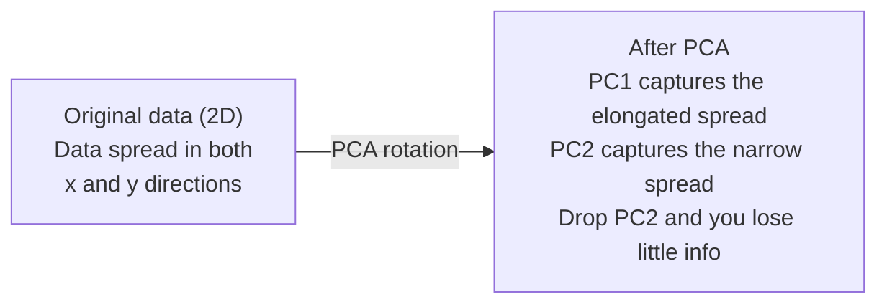

# Giảm kích thước

> High-dimensional dữ liệu có cấu trúc. Bạn tìm thấy nó bằng cách nhìn từ góc độ phù hợp.

**Loại:** Xây dựng
**Ngôn ngữ:** Python
**Kiến thức tiên quyết:** Giai đoạn 1, Bài 01 (Trực giác đại số tuyến tính), 02 (Vectors, Ma trận & Phép toán), 03 (Giá trị riêng & Vectơ riêng), 06 (Xác suất & Phân phối)
**Thời lượng:** ~90 phút

## Mục tiêu học tập

- Triển khai PCA từ đầu: trung tâm dữ liệu, tính toán ma trận hiệp phương sai, phân hủy riêng và dự án
- Sử dụng tỷ lệ variance giải thích và phương pháp khuỷu tay để chọn số lượng thành phần chính
- So sánh PCA, t-SNE và UMAP để trực quan hóa các chữ số MNIST ở dạng 2D và giải thích sự đánh đổi của chúng
- Áp dụng hạt nhân PCA với hạt nhân RBF để tách các cấu trúc dữ liệu phi tuyến mà PCA tiêu chuẩn không thể xử lý

## Vấn đề

Bạn có một dataset với 784 features mỗi mẫu. Có thể đó là giá trị pixel của các chữ số viết tay. Có thể đó là mức độ biểu hiện gen. Có thể đó là tín hiệu hành vi của người dùng. Bạn không thể hình dung 784 chiều. Bạn không thể âm mưu cho chúng. Bạn thậm chí không thể nghĩ về chúng.

Nhưng hầu hết trong số 784 features đó là dư thừa. Thông tin thực tế tồn tại trên một bề mặt nhỏ hơn nhiều. Một chữ "7" viết tay không cần 784 số độc lập để mô tả nó. Nó cần một số: góc của cú đánh, chiều dài của xà ngang, độ nghiêng của nó. rest là nhiễu.

Giảm kích thước tìm thấy bề mặt nhỏ hơn. Nó lấy dữ liệu 784 chiều của bạn và nén nó thành 2, 10 hoặc 50 chiều trong khi vẫn giữ cấu trúc quan trọng.

## Khái niệm

### Lời nguyền của không gian

High-dimensional không gian không trực quan. Ba thứ gặp lỗi khi các chiều không gian phát triển.

**Khoảng cách trở nên vô nghĩa.** Trong chiều cao, khoảng cách giữa hai điểm ngẫu nhiên bất kỳ hội tụ đến cùng một giá trị. Nếu mọi điểm có khoảng cách gần như nhau từ mọi điểm khác, tìm kiếm lân cận gần nhất sẽ ngừng hoạt động.

```
Dimension    Avg distance ratio (max/min between random points)
2            ~5.0
10           ~1.8
100          ~1.2
1000         ~1.02
```

**Volume tập trung ở các góc.** Một đơn vị hypercube trong kích thước d có 2^d góc. Trong 100 chiều, gần như tất cả các volume đều nằm ở các góc, cách xa trung tâm. Các điểm dữ liệu lan rộng ra các cạnh và models của bạn đói dữ liệu trong nội thất.

**Bạn cần nhiều dữ liệu hơn theo cấp số nhân.** Để duy trì cùng mật độ mẫu trong một không gian, chuyển từ 2D lên 20D có nghĩa là bạn cần nhiều dữ liệu hơn 10^18 lần. Bạn không bao giờ có đủ. Giảm kích thước đưa mật độ dữ liệu trở lại một cái gì đó khả thi.

### PCA: tìm hướng quan trọng

Phân tích thành phần chính (PCA) tìm các trục mà dữ liệu của bạn thay đổi nhiều nhất. Nó xoay hệ tọa độ của bạn để trục đầu tiên chụp được nhiều variance nhất, trục thứ hai chụp nhiều nhất tiếp theo, v.v.

Thuật toán:

```
1. Center the data        (subtract the mean from each feature)
2. Compute covariance     (how features move together)
3. Eigendecomposition     (find the principal directions)
4. Sort by eigenvalue     (biggest variance first)
5. Project               (keep top k eigenvectors, drop the rest)
```

Tại sao lại phân rã riêng? Ma trận hiệp phương sai là đối xứng và dương bán xác định. Vectơ riêng của nó là các hướng trực giao trong không gian feature. Các giá trị riêng cho bạn biết mỗi hướng nắm bắt được bao nhiêu variance. Vectơ riêng có giá trị riêng lớn nhất chỉ dọc theo hướng variance tối đa.



- **Trước PCA:** cloud dữ liệu được trải theo đường chéo trên cả trục x và y
- **Sau khi PCA:** Hệ tọa độ được xoay để PC1 căn chỉnh theo hướng variance tối đa (trải dài) và PC2 căn chỉnh với hướng variance tối thiểu (trải hẹp)
- **Giảm kích thước:** Thả PC2 chiếu dữ liệu lên PC1, mất rất ít thông tin

### Giải thích tỷ lệ variance

Mỗi thành phần chính chiếm một phần nhỏ của tổng số variance. Tỷ lệ variance giải thích cho bạn biết bao nhiêu.

```
Component    Eigenvalue    Explained ratio    Cumulative
PC1          4.73          0.473              0.473
PC2          2.51          0.251              0.724
PC3          1.12          0.112              0.836
PC4          0.89          0.089              0.925
...
```

Khi variance giải thích tích lũy đạt 0,95, bạn biết rằng nhiều thành phần nắm bắt 95% thông tin. Mọi thứ sau đó chủ yếu là nhiễu.

### Chọn số lượng thành phần

Ba chiến lược:

1. **Ngưỡng.** Giữ đủ các thành phần để giải thích 90-95% variance.
2. **Phương pháp khuỷu tay.** Cốt truyện được giải thích variance cho mỗi thành phần. Tìm kiếm một sự sụt giảm mạnh.
3. **Hiệu suất xuôi dòng.** Sử dụng PCA làm tiền xử lý. Quét k và đo accuracy model của bạn. K tốt nhất là bất cứ nơi nào accuracy cao nguyên.

### t-SNE: bảo tồn các khu vực lân cận

t-Distributed Stochastic Neighbor Embedding (t-SNE) được thiết kế để trực quan hóa. Nó ánh xạ dữ liệu high-dimensional thành 2D (hoặc 3D) trong khi vẫn giữ nguyên những điểm nào ở gần nhau.

Trực giác: trong không gian ban đầu, tính toán phân phối xác suất trên các cặp điểm dựa trên khoảng cách của chúng. Điểm gần có xác suất cao. Điểm xa có xác suất thấp. Sau đó, tìm một sự sắp xếp 2D trong đó cùng một phân phối xác suất được giữ nguyên. Các điểm hàng xóm trong 784 chiều vẫn là hàng xóm trong 2D.

Các thuộc tính chính của t-SNE:
- Phi tuyến tính. Nó có thể mở ra các đa tạp phức tạp mà PCA không thể.
- Ngẫu nhiên. Các lần chạy khác nhau tạo ra các bố cục khác nhau.
- Perplexity parameter kiểm soát số lượng hàng xóm cần xem xét (phạm vi điển hình: 5-50).
- Khoảng cách giữa các cụm trong đầu ra không có ý nghĩa. Chỉ có bản thân các cụm là như vậy.
- Chậm trên datasets lớn. O (n ^ 2) theo mặc định.

### UMAP: cấu trúc toàn cầu nhanh hơn, tốt hơn

Xấp xỉ và chiếu đa tạp đồng nhất (UMAP) hoạt động tương tự như t-SNE nhưng có hai ưu điểm:
- Nhanh hơn. Nó sử dụng đồ thị lân cận gần nhất gần đúng thay vì tính toán tất cả các khoảng cách theo cặp.
- Cấu trúc toàn cầu tốt hơn. Vị trí tương đối của các cụm trong đầu ra có xu hướng có ý nghĩa hơn so với t-SNE.

UMAP xây dựng một đồ thị có trọng số trong không gian high-dimensional ("biểu diễn tô pô mờ") và sau đó tìm một bố cục chiều thấp để bảo toàn biểu đồ này tốt nhất có thể.

parameters chính:
- `n_neighbors`: có bao nhiêu hàng xóm xác định cấu trúc cục bộ (tương tự như perplexity). Giá trị cao hơn bảo tồn cấu trúc toàn cầu hơn.
- `min_dist`: các điểm đóng gói chặt chẽ với nhau như thế nào trong đầu ra. Giá trị thấp hơn tạo ra các cụm dày đặc hơn.

### Khi nào sử dụng

| Phương pháp | Trường hợp sử dụng | Bảo quản | Tốc độ |
|--------|----------|-----------|-------|
| PCA | Tiền xử lý trước khi training | variance toàn cầu | Nhanh (chính xác), hoạt động trên hàng triệu mẫu |
| PCA | Trực quan hóa khám phá nhanh chóng | Cấu trúc tuyến tính | Nhanh chóng |
| t-SNE | Biểu đồ 2D chất lượng xuất bản | Khu vực lân cận địa phương | Chậm (< 10k mẫu lý tưởng) |
| UMAP | Trực quan hóa 2D trên quy mô lớn | Địa phương + một số cấu trúc toàn cầu | Trung bình (xử lý hàng triệu) |
| PCA | Giảm Feature cho models | features xếp hạng Variance | Nhanh chóng |
| t-SNE / UMAP | Hiểu cấu trúc cụm | Tách cụm | Trung bình đến chậm |

Nguyên tắc chung: sử dụng PCA để tiền xử lý và nén dữ liệu. Sử dụng t-SNE hoặc UMAP khi bạn cần trực quan hóa cấu trúc trong 2D.

### Hạt nhân PCA

PCA tiêu chuẩn tìm các không gian con tuyến tính. Nó xoay hệ tọa độ của bạn và thả các trục. Nhưng điều gì sẽ xảy ra nếu dữ liệu nằm trên một đa tạp phi tuyến? Một vòng tròn trong 2D không thể được ngăn cách bởi bất kỳ đường thẳng nào. PCA tiêu chuẩn sẽ không giúp ích gì.

Kernel PCA áp dụng PCA trong một không gian high-dimensional feature được tạo ra bởi một hàm hạt nhân, mà không tính toán rõ ràng các tọa độ trong không gian đó. Đây là thủ thuật hạt nhân - cùng một ý tưởng đằng sau SVM.

Thuật toán:
1. Tính toán ma trận hạt nhân K trong đó K_ij = k(x_i, x_j)
2. Căn giữa ma trận hạt nhân trong không gian feature
3. Eigendephân hủy ma trận hạt nhân tập trung
4. Các vectơ riêng hàng đầu (được chia tỷ lệ theo 1/sqrt(giá trị riêng)) là các phép chiếu

Các chức năng hạt nhân phổ biến:

| Hạt nhân | Công thức | Tốt cho |
|--------|---------|----------|
| RBF (Gaussian) | EXP (-gamma * \ | \ | x - y\ | \ | ^2) | Hầu hết dữ liệu phi tuyến, đa tạp trơn |
| Đa thức | (x . y + c) ^ d | Mối quan hệ đa thức |
| Sigmoid | Tấn (alpha * x . y + c) | Ánh xạ giống như mạng nơ-ron |

Khi nào nên sử dụng PCA hạt nhân so với PCA tiêu chuẩn:

| Tiêu chí | PCA tiêu chuẩn | Hạt nhân PCA |
|-----------|-------------|------------|
| Cấu trúc dữ liệu | Không gian con tuyến tính | Đa tạp phi tuyến |
| Tốc độ | O(min(n^2 d, d^2 n)) | O(n^2 d + n^3) |
| Khả năng giải thích | Các thành phần là sự kết hợp tuyến tính của features | Các thành phần thiếu giải thích feature trực tiếp |
| Khả năng mở rộng | Làm việc trên hàng triệu mẫu | Ma trận hạt nhân là n x n, giới hạn bộ nhớ |
| Tái thiết | Biến đổi nghịch đảo trực tiếp | Yêu cầu xấp xỉ trước hình ảnh |

Ví dụ cổ điển: vòng tròn đồng tâm trong 2D. Hai vòng điểm, một vòng bên trong cái kia. PCA tiêu chuẩn chiếu cả hai vào cùng một dòng - vô dụng cho việc phân loại. Kernel PCA với hạt nhân RBF ánh xạ vòng tròn bên trong và vòng tròn bên ngoài đến các vùng khác nhau, làm cho chúng có thể tách rời tuyến tính.

### Lỗi tái tạo

Giảm kích thước của bạn tốt như thế nào? Bạn đã nén 784 chiều thành 50. Bạn đã mất gì?

Đo lường lỗi tái tạo:
1. Dữ liệu dự án thành k chiều: X_reduced = X @ W_k
2. Tái tạo: X_hat = X_reduced @ W_k^T
3. Tính toán MSE: mean((X - X_hat)^2)

Đối với PCA, lỗi tái tạo có mối quan hệ rõ ràng với variance được giải thích:

```
Reconstruction error = sum of eigenvalues NOT included
Total variance = sum of ALL eigenvalues
Fraction lost = (sum of dropped eigenvalues) / (sum of all eigenvalues)
```

Tỷ lệ variance giải thích cho từng thành phần là:

```
explained_ratio_k = eigenvalue_k / sum(all eigenvalues)
```

Vẽ biểu đồ tích lũy được giải thích variance so với số lượng thành phần cho bạn đường cong "khuỷu tay". Số lượng thành phần phù hợp là nơi:
- Đường cong phẳng ra (lợi nhuận giảm dần)
- Số variance tích lũy vượt qua ngưỡng của bạn (thường là 0,90 hoặc 0,95)
- Ổn định hiệu suất tác vụ hạ nguồn

Lỗi tái tạo rất hữu ích ngoài việc chọn k. Bạn có thể sử dụng nó để phát hiện bất thường: các mẫu có sai số tái tạo cao là các giá trị ngoại lệ không phù hợp với không gian con đã học. Đây là cơ sở của việc phát hiện bất thường dựa trên PCA trong các hệ thống production.

```figure
pca-axes
```

## Tự xây dựng

### Bước 1: PCA từ đầu

```python
import numpy as np

class PCA:
    def __init__(self, n_components):
        self.n_components = n_components
        self.components = None
        self.mean = None
        self.eigenvalues = None
        self.explained_variance_ratio_ = None

    def fit(self, X):
        self.mean = np.mean(X, axis=0)
        X_centered = X - self.mean

        cov_matrix = np.cov(X_centered, rowvar=False)

        eigenvalues, eigenvectors = np.linalg.eigh(cov_matrix)

        sorted_idx = np.argsort(eigenvalues)[::-1]
        eigenvalues = eigenvalues[sorted_idx]
        eigenvectors = eigenvectors[:, sorted_idx]

        self.components = eigenvectors[:, :self.n_components].T
        self.eigenvalues = eigenvalues[:self.n_components]
        total_var = np.sum(eigenvalues)
        self.explained_variance_ratio_ = self.eigenvalues / total_var

        return self

    def transform(self, X):
        X_centered = X - self.mean
        return X_centered @ self.components.T

    def fit_transform(self, X):
        self.fit(X)
        return self.transform(X)
```

### Bước 2: Kiểm tra trên dữ liệu tổng hợp

```python
np.random.seed(42)
n_samples = 500

t = np.random.uniform(0, 2 * np.pi, n_samples)
x1 = 3 * np.cos(t) + np.random.normal(0, 0.2, n_samples)
x2 = 3 * np.sin(t) + np.random.normal(0, 0.2, n_samples)
x3 = 0.5 * x1 + 0.3 * x2 + np.random.normal(0, 0.1, n_samples)

X_synthetic = np.column_stack([x1, x2, x3])

pca = PCA(n_components=2)
X_reduced = pca.fit_transform(X_synthetic)

print(f"Original shape: {X_synthetic.shape}")
print(f"Reduced shape:  {X_reduced.shape}")
print(f"Explained variance ratios: {pca.explained_variance_ratio_}")
print(f"Total variance captured: {sum(pca.explained_variance_ratio_):.4f}")
```

### Bước 3: Các chữ số MNIST ở dạng 2D

```python
from sklearn.datasets import fetch_openml

mnist = fetch_openml("mnist_784", version=1, as_frame=False, parser="auto")
X_mnist = mnist.data[:5000].astype(float)
y_mnist = mnist.target[:5000].astype(int)

pca_mnist = PCA(n_components=50)
X_pca50 = pca_mnist.fit_transform(X_mnist)
print(f"50 components capture {sum(pca_mnist.explained_variance_ratio_):.2%} of variance")

pca_2d = PCA(n_components=2)
X_pca2d = pca_2d.fit_transform(X_mnist)
print(f"2 components capture {sum(pca_2d.explained_variance_ratio_):.2%} of variance")
```

### Bước 4: So sánh với sklearn

```python
from sklearn.decomposition import PCA as SklearnPCA
from sklearn.manifold import TSNE

sklearn_pca = SklearnPCA(n_components=2)
X_sklearn_pca = sklearn_pca.fit_transform(X_mnist)

print(f"\nOur PCA explained variance:     {pca_2d.explained_variance_ratio_}")
print(f"Sklearn PCA explained variance: {sklearn_pca.explained_variance_ratio_}")

diff = np.abs(np.abs(X_pca2d) - np.abs(X_sklearn_pca))
print(f"Max absolute difference: {diff.max():.10f}")

tsne = TSNE(n_components=2, perplexity=30, random_state=42)
X_tsne = tsne.fit_transform(X_mnist)
print(f"\nt-SNE output shape: {X_tsne.shape}")
```

### Bước 5: So sánh UMAP

```python
try:
    from umap import UMAP

    reducer = UMAP(n_components=2, n_neighbors=15, min_dist=0.1, random_state=42)
    X_umap = reducer.fit_transform(X_mnist)
    print(f"UMAP output shape: {X_umap.shape}")
except ImportError:
    print("Install umap-learn: pip install umap-learn")
```

## Ứng dụng

PCA dưới dạng tiền xử lý trước bộ phân loại:

```python
from sklearn.decomposition import PCA as SklearnPCA
from sklearn.linear_model import LogisticRegression
from sklearn.model_selection import train_test_split
from sklearn.metrics import accuracy_score

X_train, X_test, y_train, y_test = train_test_split(
    X_mnist, y_mnist, test_size=0.2, random_state=42
)

results = {}
for k in [10, 30, 50, 100, 200]:
    pca_k = SklearnPCA(n_components=k)
    X_tr = pca_k.fit_transform(X_train)
    X_te = pca_k.transform(X_test)

    clf = LogisticRegression(max_iter=1000, random_state=42)
    clf.fit(X_tr, y_train)
    acc = accuracy_score(y_test, clf.predict(X_te))
    var_captured = sum(pca_k.explained_variance_ratio_)
    results[k] = (acc, var_captured)
    print(f"k={k:>3d}  accuracy={acc:.4f}  variance={var_captured:.4f}")
```

Hiệu suất ổn định trước 784 chiều. Cao nguyên đó là điểm hoạt động của bạn.

## Sản phẩm bàn giao

Bài học này tạo ra:
- `outputs/skill-dimensionality-reduction.md` - một skill để lựa chọn kỹ thuật giảm kích thước phù hợp cho một nhiệm vụ nhất định

## Bài tập

1. Sửa đổi class PCA để hỗ trợ `inverse_transform`. Tái tạo các chữ số MNIST từ 10, 50 và 200 thành phần. In lỗi tái tạo (chênh lệch bình phương trung bình so với bản gốc) cho mỗi loại.

2. Chạy t-SNE trên cùng một tập hợp con MNIST với các giá trị perplexity là 5, 30 và 100. Mô tả kết quả thay đổi như thế nào. Tại sao perplexity ảnh hưởng đến độ kín cụm?

3. Lấy dataset với 50 features trong đó chỉ có 5 thông tin (tạo một `sklearn.datasets.make_classification`). Áp dụng PCA và kiểm tra xem đường cong variance giải thích có xác định chính xác rằng dữ liệu là 5 chiều hay không.

## Thuật ngữ chính

| Thuật ngữ | Những gì mọi người nói | Ý nghĩa thực sự của nó |
|------|----------------|----------------------|
| Lời nguyền của không gian | "Quá nhiều features" | Khoảng cách, volumes và mật độ dữ liệu đều hoạt động phản trực giác khi kích thước tăng lên. Models cần nhiều dữ liệu hơn theo cấp số nhân để bù đắp. |
| PCA | "Giảm kích thước" | Xoay hệ tọa độ của bạn để các trục thẳng hàng với hướng variance tối đa, sau đó thả các trục variance thấp. |
| Thành phần chính | "Một hướng đi quan trọng" | Một vectơ riêng của ma trận hiệp phương sai. Hướng trong không gian feature mà dữ liệu thay đổi nhiều nhất. |
| Giải thích tỷ lệ variance | "Thành phần này có bao nhiêu thông tin" | Phần của tổng số variance được nắm bắt bởi một thành phần chính. Tổng các tỷ lệ k hàng đầu để xem k thành phần bảo toàn được bao nhiêu. |
| Ma trận hiệp phương sai | "Tương quan features như thế nào" | Một ma trận đối xứng trong đó điểm vào (i,j) đo feature cách i và feature j di chuyển cùng nhau như thế nào. Các mục chéo là phương sai riêng lẻ. |
| t-SNE | "Âm mưu cụm đó" | Một phương pháp phi tuyến ánh xạ dữ liệu high-dimensional sang 2D bằng cách bảo toàn xác suất vùng lân cận theo cặp. Tốt cho việc trực quan hóa, không phải để xử lý trước. |
| UMAP | "T-SNE nhanh hơn" | Một phương pháp phi tuyến dựa trên phân tích dữ liệu tô pô. Bảo tồn cả cấu trúc cục bộ và một số cấu trúc toàn cầu. Tỷ lệ tốt hơn t-SNE. |
| Perplexity | "Một núm chữ t-SNE" | Kiểm soát số lượng hàng xóm hiệu quả mà mỗi điểm xem xét. Low perplexity tập trung vào cấu trúc rất địa phương. perplexity cao nắm bắt các mẫu rộng hơn. |
| Đa tạp | "Bề mặt dữ liệu tồn tại" | Một bề mặt chiều thấp hơn được nhúng trong một không gian chiều cao hơn. Một tờ giấy nhàu nát ở dạng 3D là một đa tạp 2D. |

## Đọc thêm

- [A Tutorial on Principal Component Analysis](https://arxiv.org/abs/1404.1100) (Shlens) - dẫn xuất rõ ràng của PCA từ đầu
- [How to Use t-SNE Effectively](https://distill.pub/2016/misread-tsne/) (Wattenberg và cộng sự) - hướng dẫn tương tác về các cạm bẫy t-SNE và các lựa chọn parameter
- [UMAP documentation](https://umap-learn.readthedocs.io/) - lý thuyết và hướng dẫn thực hành từ các tác giả UMAP
