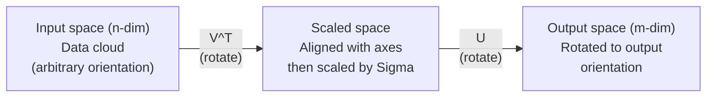
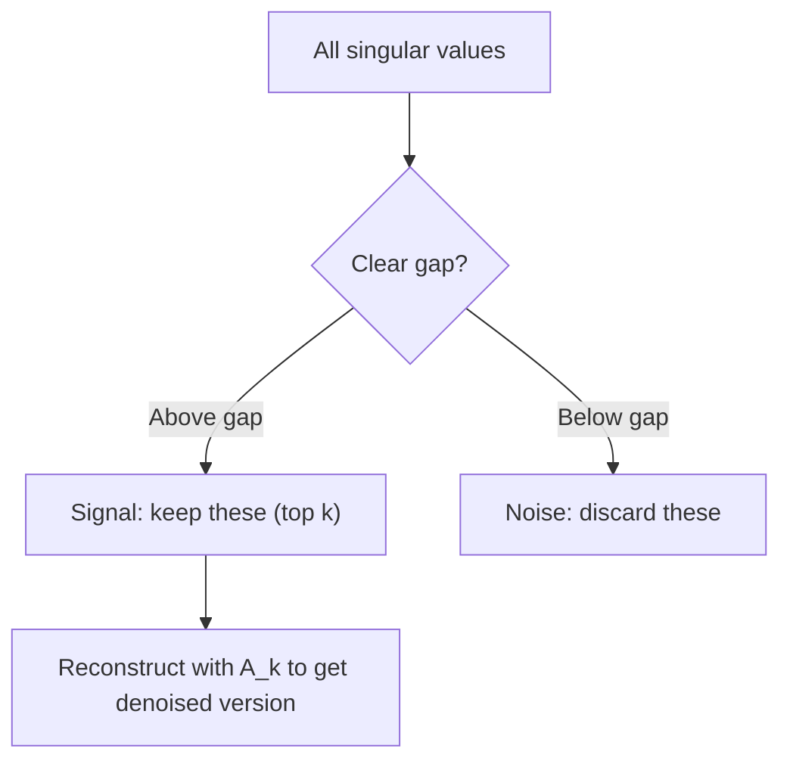

# Phân hủy giá trị số ít

> SVD là con dao của Quân đội Thụy Sĩ về đại số tuyến tính. Mỗi ma trận đều có một. Mọi nhà khoa học dữ liệu đều cần một.

**Loại:** Xây dựng
**Ngôn ngữ:** Python, Julia
**Kiến thức tiên quyết:** Giai đoạn 1, Bài 01 (Trực giác đại số tuyến tính), 02 (Phép toán Vectors & Ma trận), 03 (Biến đổi ma trận)
**Thời lượng:** ~120 phút

## Mục tiêu học tập

- Triển khai SVD thông qua lặp lũy thừa và giải thích ý nghĩa hình học của U, Sigma và V^T
- Áp dụng SVD bị cắt ngắn để nén hình ảnh và đo tỷ lệ nén so với lỗi tái tạo
- Tính toán nghịch đảo giả Moore-Penrose thông qua SVD để giải các hệ bình phương nhỏ nhất được xác định quá mức
- Kết nối SVD với PCA, hệ thống khuyến nghị (yếu tố tiềm ẩn) và Phân tích ngữ nghĩa tiềm ẩn trong NLP

## Vấn đề

Bạn có một ma trận 1000x2000. Có thể đó là xếp hạng phim của người dùng. Có thể đó là một bảng tần suất thuật ngữ tài liệu. Có thể đó là giá trị pixel của một hình ảnh. Bạn cần nén nó, khử nhiễu nó, tìm cấu trúc ẩn trong đó hoặc giải một hệ thống bình phương nhỏ nhất với nó. Phân hủy riêng chỉ hoạt động trên ma trận vuông. Ngay cả khi đó, nó yêu cầu ma trận phải có một tập hợp đầy đủ các vectơ riêng độc lập tuyến tính.

SVD hoạt động trên bất kỳ ma trận nào. Bất kỳ hình dạng nào. Bất kỳ cấp bậc nào. Không có điều kiện. Nó phân hủy ma trận thành ba yếu tố tiết lộ hình học của những gì ma trận làm với không gian. Đây là thừa số tổng quát nhất và hữu ích nhất trong tất cả các đại số tuyến tính.

## Khái niệm

### SVD làm gì về mặt hình học

Mỗi ma trận, bất kể hình dạng nào, thực hiện ba thao tác theo trình tự: xoay, chia tỷ lệ, xoay. SVD làm cho sự phân rã này trở nên rõ ràng.

```
A = U * Sigma * V^T

      m x n     m x m    m x n    n x n
     (any)    (rotate)  (scale)  (rotate)
```

Cho bất kỳ ma trận A nào, SVD yếu tố nó thành:
- V^T xoay vectors trong không gian đầu vào (n chiều)
- Thang đo Sigma dọc theo mỗi trục (kéo dài hoặc nén)
- U xoay kết quả vào không gian đầu ra (m-dimensional)



Hãy nghĩ về nó theo cách này. Bạn đưa cho SVD một ma trận. Nó cho bạn biết: "Ma trận này lấy một quả cầu đầu vào, đầu tiên xoay nó bằng V^T, sau đó kéo dài nó thành một hình elip bằng Sigma, sau đó xoay hình elip bằng U." Các giá trị kỳ dị là độ dài của trục elip.

### Sự phân hủy đầy đủ

Đối với ma trận A có hình m x n:

```
A = U * Sigma * V^T

where:
  U     is m x m, orthogonal (U^T U = I)
  Sigma is m x n, diagonal (singular values on the diagonal)
  V     is n x n, orthogonal (V^T V = I)

The singular values sigma_1 >= sigma_2 >= ... >= sigma_r > 0
where r = rank(A)
```

Các cột của bạn được gọi là vectors số ít trái. Các cột của V được gọi là vectors số ít bên phải. Các mục chéo của Sigma được gọi là giá trị số ít. Chúng luôn không âm và được sắp xếp theo thứ tự giảm dần.

### vectors số ít bên trái, giá trị số ít, số ít bên phải vectors

Mỗi thành phần của SVD có một ý nghĩa hình học riêng biệt.

**vectors số ít bên phải (cột của V):** Chúng tạo thành một cơ sở trực chuẩn cho không gian đầu vào (R^n). Chúng là các hướng trong không gian đầu vào mà ma trận ánh xạ đến các hướng trực giao trong không gian đầu ra. Hãy nghĩ về chúng như hệ tọa độ tự nhiên cho miền.

**Giá trị số ít (đường chéo của Sigma):** Đây là các yếu tố tỷ lệ. Giá trị số ít thứ i cho bạn biết ma trận kéo dài bao nhiêu vectors dọc theo vector số ít bên phải thứ i. Một giá trị số ít bằng không có nghĩa là ma trận nghiền nát hoàn toàn hướng đó.

**vectors số ít bên trái (cột của U):** Chúng tạo thành một cơ sở trực chuẩn cho không gian đầu ra (R ^ m). vector số ít bên trái thứ i là hướng trong không gian đầu ra nơi vector số ít bên phải thứ i hạ cánh (sau khi chia tỷ lệ).

Mối quan hệ giữa họ:

```
A * v_i = sigma_i * u_i

The matrix A takes the i-th right singular vector v_i,
scales it by sigma_i, and maps it to the i-th left singular vector u_i.
```

Điều này cung cấp cho bạn một bức tranh tọa độ theo từng tọa độ về những gì bất kỳ ma trận nào làm.

### Hình thức sản phẩm bên ngoài

SVD có thể được viết dưới dạng tổng của ma trận hạng 1:

```
A = sigma_1 * u_1 * v_1^T + sigma_2 * u_2 * v_2^T + ... + sigma_r * u_r * v_r^T

Each term sigma_i * u_i * v_i^T is a rank-1 matrix (an outer product).
The full matrix is the sum of r such matrices, where r is the rank.
```

Hình thức này là nền tảng của xấp xỉ cấp thấp. Mỗi thuật ngữ thêm một lớp cấu trúc. Thuật ngữ đầu tiên nắm bắt mô hình quan trọng nhất. Thứ hai nắm bắt được điều quan trọng nhất tiếp theo. Và như vậy. Cắt bớt tổng này cho bạn giá trị xấp xỉ tốt nhất có thể ở bất kỳ thứ hạng nhất định nào.

```
Rank-1 approx:    A_1 = sigma_1 * u_1 * v_1^T
                  (captures the dominant pattern)

Rank-2 approx:    A_2 = sigma_1 * u_1 * v_1^T + sigma_2 * u_2 * v_2^T
                  (captures the two most important patterns)

Rank-k approx:    A_k = sum of top k terms
                  (optimal by the Eckart-Young theorem)
```

### Mối quan hệ với phân rã riêng

SVD và phân hủy riêng có mối liên hệ sâu sắc. Các giá trị kỳ dị và vectors của A đến trực tiếp từ các giá trị riêng và vectơ riêng của A^T A và A A^T.

```
A^T A = V * Sigma^T * U^T * U * Sigma * V^T
      = V * Sigma^T * Sigma * V^T
      = V * D * V^T

where D = Sigma^T * Sigma is a diagonal matrix with sigma_i^2 on the diagonal.

So:
- The right singular vectors (V) are eigenvectors of A^T A
- The singular values squared (sigma_i^2) are eigenvalues of A^T A

Similarly:
A A^T = U * Sigma * V^T * V * Sigma^T * U^T
      = U * Sigma * Sigma^T * U^T

So:
- The left singular vectors (U) are eigenvectors of A A^T
- The eigenvalues of A A^T are also sigma_i^2
```

Kết nối này cho bạn biết ba điều:
1. Các giá trị số ít luôn là thực và không âm (chúng là căn bậc hai của các giá trị riêng của ma trận bán xác định dương).
2. Bạn có thể tính SVD thông qua phân rã riêng của A^T A, nhưng điều này bình phương số điều kiện và mất precision số. Các thuật toán SVD chuyên dụng tránh điều này.
3. Khi A là bình phương và dương đối xứng bán xác định, SVD và phân hủy riêng là cùng một thứ.

### SVD bị cắt bớt: xấp xỉ xếp hạng thấp

Định lý Eckart-Young-Mirsky phát biểu rằng xấp xỉ rank-k tốt nhất đối với A (trong cả chuẩn Frobenius và quang phổ) thu được bằng cách chỉ giữ lại các giá trị kỳ dị k hàng đầu và vectors tương ứng của chúng:

```
A_k = U_k * Sigma_k * V_k^T

where:
  U_k     is m x k  (first k columns of U)
  Sigma_k is k x k  (top-left k x k block of Sigma)
  V_k     is n x k  (first k columns of V)

Approximation error = sigma_{k+1}  (in spectral norm)
                    = sqrt(sigma_{k+1}^2 + ... + sigma_r^2)  (in Frobenius norm)
```

Đây không chỉ là một xấp xỉ "tốt". Nó được chứng minh là xấp xỉ tốt nhất có thể của hạng k. Không có ma trận rank-k nào khác gần với A hơn.

| Thành phần | Độ lớn tương đối | Giữ ở hạng 3 xấp xỉ? |
|-----------|-------------------|------------------------|
| sigma_1 | Lớn nhất | Có |
| sigma_2 | Lớn | Có |
| sigma_3 | Vừa-lớn | Có |
| sigma_4 | Trung bình | Không (lỗi) |
| sigma_5 | Vừa-nhỏ | Không (lỗi) |
| sigma_6 | Nhỏ | Không (lỗi) |
| sigma_7 | Rất nhỏ | Không (lỗi) |
| sigma_8 | Tí hon | Không (lỗi) |

Giữ top 3: A_3 nắm bắt ba giá trị số ít lớn nhất. Lỗi = giá trị còn lại (sigma_4 đến sigma_8).

Nếu các giá trị số ít phân rã nhanh, một k nhỏ sẽ chiếm hầu hết ma trận. Nếu chúng phân rã chậm, ma trận không có cấu trúc cấp thấp.

### Nén hình ảnh bằng SVD

Hình ảnh thang độ xám là một ma trận cường độ pixel. Hình ảnh 800x600 có 480.000 giá trị. SVD cho phép bạn ước tính nó với ít hơn nhiều.

```
Original image: 800 x 600 = 480,000 values

SVD with rank k:
  U_k:      800 x k values
  Sigma_k:  k values
  V_k:      600 x k values
  Total:    k * (800 + 600 + 1) = k * 1401 values

  k=10:   14,010 values   (2.9% of original)
  k=50:   70,050 values  (14.6% of original)
  k=100: 140,100 values  (29.2% of original)

  The compression ratio improves as k gets smaller,
  but visual quality degrades.
```

Cái nhìn sâu sắc quan trọng: hình ảnh tự nhiên có giá trị đơn lẻ đang phân rã nhanh chóng. Một vài giá trị số ít đầu tiên nắm bắt cấu trúc rộng (hình dạng, gradients). Những cái sau chụp được chi tiết và nhiễu tốt. Cắt bớt ở thứ hạng 50 thường tạo ra hình ảnh trông gần giống với hình ảnh gốc trong khi sử dụng ít dung lượng lưu trữ hơn 85%.

### SVD cho hệ thống đề xuất

Giải thưởng Netflix đã làm cho điều này trở nên nổi tiếng. Bạn có ma trận xếp hạng người dùng-phim trong đó hầu hết các mục đều bị thiếu.

```
             Movie1  Movie2  Movie3  Movie4  Movie5
  User1      [  5      ?       3       ?       1  ]
  User2      [  ?      4       ?       2       ?  ]
  User3      [  3      ?       5       ?       ?  ]
  User4      [  ?      ?       ?       4       3  ]

  ? = unknown rating
```

Ý tưởng: ma trận xếp hạng này có thứ hạng thấp. Người dùng không có thị hiếu hoàn toàn độc lập. Có một số yếu tố tiềm ẩn (hành động so với kịch tính, cũ so với mới, não bộ so với nội tạng) giải thích hầu hết các sở thích.

SVD trên ma trận xếp hạng (điền) phân tách nó thành:
- U: hồ sơ người dùng trong không gian yếu tố tiềm ẩn
- Sigma: tầm quan trọng của từng yếu tố tiềm ẩn
- V^T: hồ sơ phim trong không gian yếu tố tiềm ẩn

Xếp hạng dự đoán của người dùng cho một bộ phim là tích chấm của hồ sơ người dùng của họ với hồ sơ của phim (được tính theo các giá trị số ít). Xấp xỉ cấp thấp lấp đầy các mục còn thiếu.

Trong thực tế, bạn sử dụng các biến thể như SVD gia tăng của Simon Funk hoặc ALS (xen kẽ bình phương nhỏ nhất) để xử lý trực tiếp dữ liệu bị thiếu. Nhưng ý tưởng cốt lõi là giống nhau: phân hủy yếu tố tiềm ẩn thông qua SVD.

### SVD trong NLP: Phân tích ngữ nghĩa tiềm ẩn

Phân tích ngữ nghĩa tiềm ẩn (LSA), còn được gọi là Lập chỉ mục ngữ nghĩa tiềm ẩn (LSI), áp dụng SVD cho ma trận thuật ngữ-tài liệu.

```
             Doc1   Doc2   Doc3   Doc4
  "cat"      [  3      0      1      0  ]
  "dog"      [  2      0      0      1  ]
  "fish"     [  0      4      1      0  ]
  "pet"      [  1      1      1      1  ]
  "ocean"    [  0      3      0      0  ]

After SVD with rank k=2:

  Each document becomes a point in 2D "concept space."
  Each term becomes a point in the same 2D space.
  Documents about similar topics cluster together.
  Terms with similar meanings cluster together.

  "cat" and "dog" end up near each other (land pets).
  "fish" and "ocean" end up near each other (water concepts).
  Doc1 and Doc3 cluster if they share similar topics.
```

LSA là một trong những phương pháp thành công đầu tiên để nắm bắt sự tương đồng ngữ nghĩa từ văn bản thô. Nó hoạt động vì các thuật ngữ đồng nghĩa có xu hướng xuất hiện trong các tài liệu tương tự, vì vậy SVD nhóm chúng thành cùng một chiều tiềm ẩn. Từ hiện đại embeddings (Word2Vec, GloVe) có thể được coi là hậu duệ của ý tưởng này.

### SVD để giảm nhiễu

Dữ liệu nhiễu có tín hiệu tập trung ở các giá trị số ít hàng đầu và nhiễu lan truyền trên tất cả các giá trị số ít. Cắt bớt loại bỏ sàn nhiễu.

**Giá trị số ít tín hiệu sạch:**

| Thành phần | Độ lớn | Kiểu |
|-----------|-----------|------|
| sigma_1 | Rất lớn | Tín hiệu |
| sigma_2 | Lớn | Tín hiệu |
| sigma_3 | Trung bình | Tín hiệu |
| sigma_4 | Gần bằng không | Không đáng kể |
| sigma_5 | Gần bằng không | Không đáng kể |

**Giá trị số ít tín hiệu nhiễu (nhiễu thêm vào tất cả):**

| Thành phần | Độ lớn | Kiểu |
|-----------|-----------|------|
| sigma_1 | Rất lớn | Tín hiệu |
| sigma_2 | Lớn | Tín hiệu |
| sigma_3 | Trung bình | Tín hiệu |
| sigma_4 | Nhỏ | Nhiễu |
| sigma_5 | Nhỏ | Nhiễu |
| sigma_6 | Nhỏ | Nhiễu |
| sigma_7 | Nhỏ | Nhiễu |



Điều này được sử dụng trong xử lý tín hiệu, đo lường khoa học và làm sạch dữ liệu. Bất cứ khi nào bạn có một ma trận bị hỏng bởi nhiễu cộng thêm, SVD bị cắt ngắn là một cách có nguyên tắc để tách tín hiệu khỏi nhiễu.

### Nghịch đảo giả qua SVD

Nghịch đảo giả Moore-Penrose A + khái quát hóa đảo ngược ma trận thành ma trận không vuông và số ít. SVD làm cho máy tính trở nên tầm thường.

```
If A = U * Sigma * V^T, then:

A+ = V * Sigma+ * U^T

where Sigma+ is formed by:
  1. Transpose Sigma (swap rows and columns)
  2. Replace each non-zero diagonal entry sigma_i with 1/sigma_i
  3. Leave zeros as zeros

For A (m x n):      A+ is (n x m)
For Sigma (m x n):  Sigma+ is (n x m)
```

Nghịch đảo giả giải quyết các vấn đề bình phương nhỏ nhất. Nếu Ax = b không có nghiệm chính xác (hệ thống xác định quá mức), thì x = A+ b là nghiệm bình phương nhỏ nhất (thu nhỏ ||Rìu - b||).

```
Overdetermined system (more equations than unknowns):

  [1  1]         [3]
  [2  1] x   =   [5]       No exact solution exists.
  [3  1]         [6]

  x_ls = A+ b = V * Sigma+ * U^T * b

  This gives the x that minimizes the sum of squared residuals.
  Same result as the normal equations (A^T A)^(-1) A^T b,
  but numerically more stable.
```

### Ưu điểm ổn định số

Tính toán phân hủy riêng của A^T A bình phương các giá trị số ít (giá trị riêng của A^T A là sigma_i^2). Điều này bình phương số điều kiện, khuếch đại các lỗi số.

```
Example:
  A has singular values [1000, 1, 0.001]
  Condition number of A: 1000 / 0.001 = 10^6

  A^T A has eigenvalues [10^6, 1, 10^{-6}]
  Condition number of A^T A: 10^6 / 10^{-6} = 10^{12}

  Computing SVD directly: works with condition number 10^6
  Computing via A^T A:     works with condition number 10^{12}
                           (6 extra digits of precision lost)
```

Các thuật toán SVD hiện đại (hai đường chéo hóa Golub-Kahan) hoạt động trực tiếp trên A, không bao giờ tạo thành A^T A. Đây là lý do tại sao bạn nên luôn thích `np.linalg.svd(A)` hơn `np.linalg.eig(A.T @ A)`.

### Kết nối với PCA

PCA là SVD trên dữ liệu căn giữa. Đây không phải là một phép so sánh. Nó thực sự là cùng một phép tính.

```
Given data matrix X (n_samples x n_features), centered (mean subtracted):

Covariance matrix: C = (1/(n-1)) * X^T X

PCA finds eigenvectors of C. But:

  X = U * Sigma * V^T    (SVD of X)

  X^T X = V * Sigma^2 * V^T

  C = (1/(n-1)) * V * Sigma^2 * V^T

So the principal components are exactly the right singular vectors V.
The explained variance for each component is sigma_i^2 / (n-1).

In sklearn, PCA is implemented using SVD, not eigendecomposition.
It is faster and more numerically stable.
```

Điều này có nghĩa là mọi thứ bạn học được về giảm chiều trong Bài 10 đều là SVD dưới mui xe. PCA là ứng dụng phổ biến nhất của SVD trong học máy.

```figure
svd-rank-reconstruction
```

## Tự xây dựng

### Bước 1: SVD từ đầu bằng cách sử dụng lặp lại nguồn

Ý tưởng: để tìm giá trị số ít lớn nhất và vectors của nó, hãy sử dụng phép lặp lũy thừa trên A^T A (hoặc A A^T). Sau đó xì hơi ma trận và lặp lại cho giá trị số ít tiếp theo.

```python
import numpy as np

def power_iteration(M, num_iters=100):
    n = M.shape[1]
    v = np.random.randn(n)
    v = v / np.linalg.norm(v)

    for _ in range(num_iters):
        Mv = M @ v
        v = Mv / np.linalg.norm(Mv)

    eigenvalue = v @ M @ v
    return eigenvalue, v

def svd_from_scratch(A, k=None):
    m, n = A.shape
    if k is None:
        k = min(m, n)

    sigmas = []
    us = []
    vs = []

    A_residual = A.copy().astype(float)

    for _ in range(k):
        AtA = A_residual.T @ A_residual
        eigenvalue, v = power_iteration(AtA, num_iters=200)

        if eigenvalue < 1e-10:
            break

        sigma = np.sqrt(eigenvalue)
        u = A_residual @ v / sigma

        sigmas.append(sigma)
        us.append(u)
        vs.append(v)

        A_residual = A_residual - sigma * np.outer(u, v)

    U = np.column_stack(us) if us else np.empty((m, 0))
    S = np.array(sigmas)
    V = np.column_stack(vs) if vs else np.empty((n, 0))

    return U, S, V
```

### Bước 2: Kiểm tra và so sánh với NumPy

```python
np.random.seed(42)
A = np.random.randn(5, 4)

U_ours, S_ours, V_ours = svd_from_scratch(A)
U_np, S_np, Vt_np = np.linalg.svd(A, full_matrices=False)

print("Our singular values:", np.round(S_ours, 4))
print("NumPy singular values:", np.round(S_np, 4))

A_reconstructed = U_ours @ np.diag(S_ours) @ V_ours.T
print(f"Reconstruction error: {np.linalg.norm(A - A_reconstructed):.8f}")
```

### Bước 3: Demo nén hình ảnh

```python
def compress_image_svd(image_matrix, k):
    U, S, Vt = np.linalg.svd(image_matrix, full_matrices=False)
    compressed = U[:, :k] @ np.diag(S[:k]) @ Vt[:k, :]
    return compressed

image = np.random.seed(42)
rows, cols = 200, 300
image = np.random.randn(rows, cols)

for k in [1, 5, 10, 20, 50]:
    compressed = compress_image_svd(image, k)
    error = np.linalg.norm(image - compressed) / np.linalg.norm(image)
    original_size = rows * cols
    compressed_size = k * (rows + cols + 1)
    ratio = compressed_size / original_size
    print(f"k={k:>3d}  error={error:.4f}  storage={ratio:.1%}")
```

### Bước 4: Giảm nhiễu

```python
np.random.seed(42)
clean = np.outer(np.sin(np.linspace(0, 4*np.pi, 100)),
                 np.cos(np.linspace(0, 2*np.pi, 80)))
noise = 0.3 * np.random.randn(100, 80)
noisy = clean + noise

U, S, Vt = np.linalg.svd(noisy, full_matrices=False)
denoised = U[:, :5] @ np.diag(S[:5]) @ Vt[:5, :]

print(f"Noisy error:    {np.linalg.norm(noisy - clean):.4f}")
print(f"Denoised error: {np.linalg.norm(denoised - clean):.4f}")
print(f"Improvement:    {(1 - np.linalg.norm(denoised - clean) / np.linalg.norm(noisy - clean)):.1%}")
```

### Bước 5: Giả nghịch đảo

```python
A = np.array([[1, 1], [2, 1], [3, 1]], dtype=float)
b = np.array([3, 5, 6], dtype=float)

U, S, Vt = np.linalg.svd(A, full_matrices=False)
S_inv = np.diag(1.0 / S)
A_pinv = Vt.T @ S_inv @ U.T

x_svd = A_pinv @ b
x_lstsq = np.linalg.lstsq(A, b, rcond=None)[0]
x_pinv = np.linalg.pinv(A) @ b

print(f"SVD pseudoinverse solution:  {x_svd}")
print(f"np.linalg.lstsq solution:   {x_lstsq}")
print(f"np.linalg.pinv solution:    {x_pinv}")
```

## Ứng dụng

Các bản demo hoạt động đầy đủ đang được `code/svd.py`. Chạy nó để xem SVD được áp dụng cho nén hình ảnh, hệ thống đề xuất, phân tích ngữ nghĩa tiềm ẩn và giảm nhiễu.

```bash
python svd.py
```

Phiên bản Julia trong `code/svd.jl` thể hiện các khái niệm tương tự bằng cách sử dụng hàm `svd()` gốc của Julia và gói `LinearAlgebra`.

```bash
julia svd.jl
```

## Sản phẩm bàn giao

Bài học này tạo ra:
- `outputs/skill-svd.md` - skill để biết khi nào và làm thế nào để áp dụng SVD trong các dự án thực tế

## Bài tập

1. Triển khai SVD đầy đủ từ đầu mà không cần sử dụng lặp lại nguồn. Thay vào đó, hãy tính phân hủy riêng của A^T A để có V và các giá trị số ít, sau đó tính U = A V Sigma^{-1}. So sánh accuracy số với phiên bản lặp lại sức mạnh của bạn và với NumPy.

2. Tải một hình ảnh thang độ xám thực (hoặc chuyển đổi một hình ảnh sang thang độ xám). Nén nó ở các hạng 1, 5, 10, 25, 50, 100. Đối với mỗi cấp bậc, hãy tính tỷ lệ nén và sai số tương đối. Tìm thứ hạng nơi hình ảnh trở nên dễ chấp nhận về mặt thị giác.

3. Xây dựng một hệ thống đề xuất nhỏ. Tạo ma trận xếp hạng phim người dùng 10x8 với một số mục đã biết. Điền vào các mục còn thiếu bằng các phương tiện hàng. Tính toán SVD và xây dựng lại xấp xỉ xếp hạng 3. Sử dụng ma trận được tái tạo để dự đoán xếp hạng bị thiếu. Xác minh rằng các dự đoán là hợp lý.

4. Tạo ma trận thuật ngữ tài liệu 100x50 với 3 chủ đề tổng hợp. Mỗi chủ đề có 5 thuật ngữ liên quan. Thêm nhiễu. Áp dụng SVD và xác minh rằng 3 giá trị số ít trên cùng lớn hơn nhiều so với giá trị rest. Chiếu tài liệu vào không gian tiềm ẩn 3D và kiểm tra xem các tài liệu từ cùng một cụm chủ đề với nhau.

5. Tạo ma trận cấp thấp rõ ràng (hạng 3, kích thước 50x40) và thêm nhiễu Gaussian ở các mức khác nhau (sigma = 0.1, 0.5, 1.0, 2.0). Đối với mỗi mức độ nhiễu, hãy tìm xếp hạng cắt ngắn tối ưu bằng cách quét k từ 1 đến 40 và đo sai số tái tạo so với ma trận sạch. Vẽ biểu đồ cách k tối ưu thay đổi với độ ồn.

## Thuật ngữ chính

| Thuật ngữ | Những gì mọi người nói | Ý nghĩa thực sự của nó |
|------|----------------|----------------------|
| SVD | "Yếu tố bất kỳ ma trận nào" | Phân hủy A thành U Sigma V^T trong đó u và V trực giao và Sigma là đường chéo với các mục không âm. Hoạt động cho bất kỳ ma trận nào có hình dạng bất kỳ. |
| Giá trị số ít | "Thành phần này quan trọng như thế nào" | Mục nhập đường chéo thứ i của Sigma. Đo mức độ ma trận kéo dài dọc theo hướng chính thứ i. Luôn luôn không âm, được sắp xếp theo thứ tự giảm dần. |
| vector số ít bên trái | "Hướng đầu ra" | Một cột của U. Hướng trong không gian đầu ra mà số ít bên phải thứ i ánh xạ vector (sau khi chia tỷ lệ theo sigma_i). |
| vector số ít bên phải | "Hướng đầu vào" | Một cột chữ V. Hướng trong không gian đầu vào mà ma trận ánh xạ đến vector số ít bên trái thứ i (sau khi chia tỷ lệ theo sigma_i). |
| SVD bị cắt ngắn | "Xấp xỉ cấp thấp" | Chỉ giữ các giá trị số ít k trên cùng và vectors của chúng. Tạo ra xấp xỉ rank-k tốt nhất có thể chứng minh được so với ma trận ban đầu (định lý Eckart-Young). |
| Cấp | "Chiều không gian thực sự" | Số lượng giá trị số ít không phải không. Cho bạn biết ma trận thực sự sử dụng bao nhiêu hướng độc lập. |
| Giả nghịch đảo | "Nghịch đảo tổng quát" | V Sigma + U ^ T. Đảo ngược các giá trị số ít không bằng không, để lại số không là số không. Giải các bài toán bình phương nhỏ nhất cho ma trận không bình phương hoặc số ít. |
| Số điều kiện | "Mức độ nhạy cảm với lỗi" | sigma_max / sigma_min. Số điều kiện lớn có nghĩa là những thay đổi đầu vào nhỏ gây ra thay đổi đầu ra lớn. SVD tiết lộ điều này trực tiếp. |
| Yếu tố tiềm ẩn | "Biến ẩn" | Một chiều trong không gian cấp thấp được phát hiện bởi SVD. Trong các đề xuất, một yếu tố tiềm ẩn có thể tương ứng với sở thích thể loại. Trong NLP, nó có thể tương ứng với một chủ đề. |
| Định mức Frobenius | "Tổng kích thước ma trận" | Căn bậc hai của tổng các mục bình phương. Bằng căn bậc hai của tổng các giá trị số ít bình phương. Được sử dụng để đo sai số xấp xỉ. |
| Định lý Eckart-Young | "SVD cho độ nén tốt nhất" | Đối với bất kỳ hạng mục tiêu k nào, SVD bị cắt ngắn sẽ giảm thiểu sai số xấp xỉ trên tất cả các ma trận rank-k có thể có. |
| Lặp lại nguồn | "Tìm vectơ riêng lớn nhất" | Liên tục nhân một vector ngẫu nhiên với ma trận và chuẩn hóa. Hội tụ đến vectơ riêng có giá trị riêng lớn nhất. Khối xây dựng của nhiều thuật toán SVD. |

## Đọc thêm

- [Gilbert Strang: Linear Algebra and Its Applications, Chapter 7](https://math.mit.edu/~gs/linearalgebra/) - xử lý triệt để SVD với các ứng dụng
- [3Blue1Brown: But what is the SVD?](https://www.youtube.com/watch?v=vSczTbgc8Rc) - trực giác hình học cho SVD
- [We Recommend a Singular Value Decomposition](https://www.ams.org/publicoutreach/feature-column/fcarc-svd) - tổng quan có thể truy cập từ Hiệp hội Toán học Hoa Kỳ
- [Netflix Prize and Matrix Factorization](https://sifter.org/~simon/journal/20061211.html) - Bài đăng trên blog gốc của Simon Funk về SVD để được đề xuất
- [Latent Semantic Analysis](https://en.wikipedia.org/wiki/Latent_semantic_analysis) - ứng dụng NLP ban đầu của SVD
- [Numerical Linear Algebra by Trefethen and Bau](https://people.maths.ox.ac.uk/trefethen/text.html) - tiêu chuẩn vàng để hiểu các thuật toán SVD và các tính chất số của chúng
