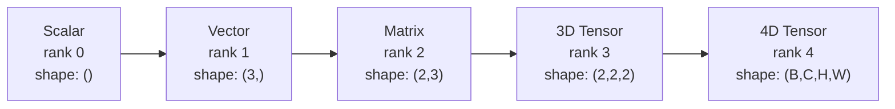
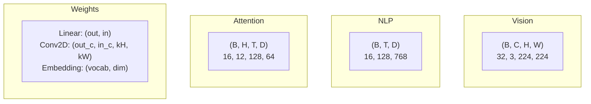
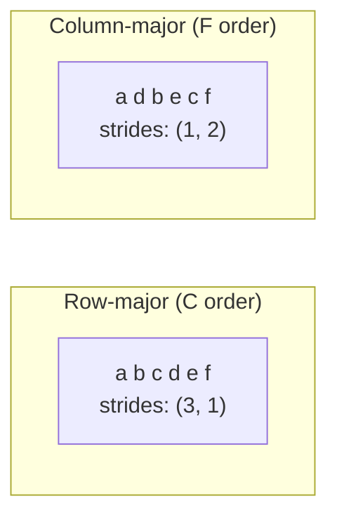
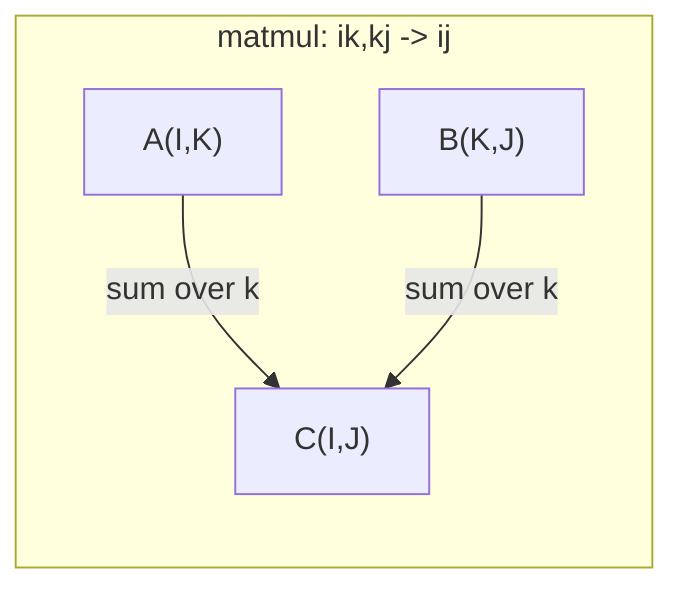

# Hoạt động Tensor

> Tensors là ngôn ngữ chung giữa dữ liệu và học sâu. Mọi hình ảnh, từng câu, mọi gradient đều chảy qua chúng.

**Loại:** Xây dựng
**Ngôn ngữ:** Python
**Kiến thức tiên quyết:** Giai đoạn 1, Bài 01 (Trực giác đại số tuyến tính), 02 (Vectors, Ma trận & Phép toán)
**Thời lượng:** ~90 phút

## Mục tiêu học tập

- Triển khai một tensor class với các thao tác hình dạng, sải chân, định hình lại, chuyển vị và các yếu tố khôn ngoan từ đầu
- Áp dụng các quy tắc phát sóng để hoạt động trên tensors có hình dạng khác nhau mà không cần sao chép dữ liệu
- Viết biểu thức einsum cho các sản phẩm chấm, phép nhân ma trận, sản phẩm bên ngoài và các phép toán hàng loạt
- Trace hình dạng tensor chính xác qua từng bước của multi-head attention

## Vấn đề

Bạn xây dựng một transformer. forward pass trông sạch sẽ. Bạn chạy nó và nhận được: `RuntimeError: mat1 and mat2 shapes cannot be multiplied (32x768 and 512x768)`. Bạn nhìn chằm chằm vào các hình dạng. Bạn thử chuyển vị. Bây giờ nó nói `Expected 4D input (got 3D input)`. Bạn thêm một unsqueeze. Một cái gì đó khác gặp lỗi.

Lỗi hình dạng là lỗi phổ biến nhất trong mã deep learning. Chúng không khó về mặt khái niệm - mỗi hoạt động có một hợp đồng hình dạng - nhưng chúng nhân lên nhanh chóng. Một transformer có hàng chục định hình lại, chuyển vị và phát sóng được xâu chuỗi với nhau. Một trục sai và lỗi xếp tầng. Tệ hơn nữa, một số lỗi về hình dạng hoàn toàn không gây ra lỗi. Họ âm thầm tạo ra rác bằng cách phát sóng sai chiều hoặc tổng hợp sai trục.

Ma trận xử lý các mối quan hệ theo cặp giữa hai tập hợp mọi thứ. Dữ liệu thực không phù hợp với hai chiều. Một batch gồm 32 hình ảnh RGB ở 224x224 là tensor 4D: `(32, 3, 224, 224)`. Self-attention với 12 đầu cũng là 4D: `(batch, heads, seq_len, head_dim)`. Bạn cần một cấu trúc dữ liệu tổng quát hóa cho bất kỳ số lượng thứ nguyên nào, với các thao tác soạn thảo rõ ràng trên tất cả các thứ nguyên. Cấu trúc đó là tensor. Làm chủ các hoạt động của nó và định hình các lỗi trở nên dễ dàng gỡ lỗi.

## Khái niệm

### tensor là gì

tensor là một mảng số đa chiều với kiểu dữ liệu đồng nhất. Số thứ nguyên là **rank** (hoặc **order**). Mỗi chiều là một **trục**. **hình dạng** là một bộ liệt kê kích thước dọc theo mỗi trục.



Tổng số nguyên tố = tích của tất cả các kích thước. Một hình dạng `(2, 3, 4)` chứa các phần tử `2 * 3 * 4 = 24`.

### Tensor hình dạng trong deep learning

Các loại dữ liệu khác nhau ánh xạ đến các hình dạng tensor cụ thể theo quy ước.



PyTorch sử dụng NCHW (kênh đầu tiên). TensorFlow mặc định là NHWC (kênh cuối cùng). Bố cục không khớp gây ra hiện tượng chậm hoặc lỗi im lặng.

### Cách hoạt động của bố cục bộ nhớ

Mảng 2D trong bộ nhớ là một chuỗi byte 1D. **Sải bước** cho bạn biết có bao nhiêu phần tử cần bỏ qua để di chuyển một bước dọc theo mỗi trục.



Chuyển vị không di chuyển dữ liệu. Nó hoán đổi các sải bước, làm cho tensor **không liền kề** - các phần tử cho một hàng không còn liền kề trong bộ nhớ.

### Quy tắc phát sóng

Phát sóng cho phép bạn thao tác trên tensors hình dạng khác nhau mà không cần sao chép dữ liệu. Căn chỉnh các hình dạng từ bên phải. Hai chiều tương thích khi chúng bằng nhau hoặc một là 1. Ít kích thước hơn được đệm với số 1 ở bên trái.

```
Tensor A:     (8, 1, 6, 1)
Tensor B:        (7, 1, 5)
Padded B:     (1, 7, 1, 5)
Result:       (8, 7, 6, 5)
```

### Einsum: hoạt động tensor phổ quát

Tổng Einstein đánh dấu mỗi trục bằng một chữ cái. Các trục trong đầu vào nhưng không phải đầu ra được tổng hợp. Rìu trong cả hai đều được giữ lại.



Các mẫu chính: `i,i->` (sản phẩm chấm), `i,j->ij` (sản phẩm bên ngoài), `ii->` (trace), `ij->ji` (chuyển vị), `bij,bjk->bik` (batch matmul), `bhtd,bhsd->bhts` (attention điểm).

```figure
tensor-broadcast
```

## Tự xây dựng

Mã tồn tại trong `code/tensors.py`. Mỗi bước tham chiếu đến việc triển khai ở đó.

### Bước 1: Tensor lưu trữ và sải bước

Một tensor lưu trữ một danh sách phẳng các số cộng với siêu dữ liệu hình dạng. Các bước cho logic lập chỉ mục biết cách ánh xạ các chỉ số đa chiều đến các vị trí đi ngang.

```python
class Tensor:
    def __init__(self, data, shape=None):
        if isinstance(data, (list, tuple)):
            self._data, self._shape = self._flatten_nested(data)
        elif isinstance(data, np.ndarray):
            self._data = data.flatten().tolist()
            self._shape = tuple(data.shape)
        else:
            self._data = [data]
            self._shape = ()

        if shape is not None:
            total = reduce(lambda a, b: a * b, shape, 1)
            if total != len(self._data):
                raise ValueError(
                    f"Cannot reshape {len(self._data)} elements into shape {shape}"
                )
            self._shape = tuple(shape)

        self._strides = self._compute_strides(self._shape)

    @staticmethod
    def _compute_strides(shape):
        if len(shape) == 0:
            return ()
        strides = [1] * len(shape)
        for i in range(len(shape) - 2, -1, -1):
            strides[i] = strides[i + 1] * shape[i + 1]
        return tuple(strides)
```

Đối với `(3, 4)` hình dạng, các sải bước là `(4, 1)` - bỏ qua 4 phần tử để tiến một hàng, bỏ qua 1 phần tử để tiến một cột.

### Bước 2: Định hình lại, bóp, bóp

Reshape thay đổi hình dạng mà không thay đổi thứ tự phần tử. Tổng số phần tử phải giữ nguyên. Sử dụng `-1` cho một chiều để suy ra kích thước của nó.

```python
t = Tensor(list(range(12)), shape=(2, 6))
r = t.reshape((3, 4))
r = t.reshape((-1, 3))
```

Bóp loại bỏ các trục có kích thước 1. Mở chèn một. Không ép là rất quan trọng đối với việc phát sóng - một bias vector `(D,)` được thêm vào batch `(B, T, D)` cần được tháo ra để `(1, 1, D)`.

```python
t = Tensor(list(range(6)), shape=(1, 3, 1, 2))
s = t.squeeze()
v = Tensor([1, 2, 3])
u = v.unsqueeze(0)
```

### Bước 3: Chuyển vị và hoán vị

Chuyển vị hoán đổi hai trục. Permute sắp xếp lại tất cả các trục. Đây là cách bạn chuyển đổi giữa NCHW và NHWC.

```python
mat = Tensor(list(range(6)), shape=(2, 3))
tr = mat.transpose(0, 1)

t4d = Tensor(list(range(24)), shape=(1, 2, 3, 4))
perm = t4d.permute((0, 2, 3, 1))
```

Sau khi chuyển vị hoặc hoán vị, tensor không liền kề trong bộ nhớ. Trong PyTorch, `view` không thành công trên các tensors không liền kề - sử dụng `reshape` hoặc gọi `.contiguous()` trước.

### Bước 4: Các hoạt động và rút gọn theo nguyên tố

Hoạt động khôn ngoan của phần tử (cộng, nhân, trừ) áp dụng độc lập cho từng phần tử và giữ nguyên hình dạng. Giảm (tổng, trung bình, tối đa) thu gọn một hoặc nhiều trục.

```python
a = Tensor([[1, 2], [3, 4]])
b = Tensor([[10, 20], [30, 40]])
c = a + b
d = a * 2
s = a.sum(axis=0)
```

Gộp trung bình toàn cầu trong CNN: `(B, C, H, W).mean(axis=[2, 3])` tạo ra `(B, C)`. Trình tự có nghĩa là gộp trong NLP: `(B, T, D).mean(axis=1)` tạo ra `(B, D)`.

### Bước 5: Phát sóng bằng NumPy

Hàm `demo_broadcasting_numpy()` trong `tensors.py` hiển thị các mẫu cốt lõi.

```python
activations = np.random.randn(4, 3)
bias = np.array([0.1, 0.2, 0.3])
result = activations + bias

images = np.random.randn(2, 3, 4, 4)
scale = np.array([0.5, 1.0, 1.5]).reshape(1, 3, 1, 1)
result = images * scale

a = np.array([1, 2, 3]).reshape(-1, 1)
b = np.array([10, 20, 30, 40]).reshape(1, -1)
outer = a * b
```

Khoảng cách theo cặp thông qua phát sóng: định hình lại `(M, 2)` thành `(M, 1, 2)` và `(N, 2)` thành `(1, N, 2)`, trừ, bình phương, tổng dọc theo trục cuối cùng, lấy căn bậc hai. Kết quả: `(M, N)`.

### Bước 6: Thao tác Einsum

Các hàm `demo_einsum()` và `demo_einsum_gallery()` đi qua mọi mẫu chung.

```python
a = np.array([1.0, 2.0, 3.0])
b = np.array([4.0, 5.0, 6.0])
dot = np.einsum("i,i->", a, b)

A = np.array([[1, 2], [3, 4], [5, 6]], dtype=float)
B = np.array([[7, 8, 9], [10, 11, 12]], dtype=float)
matmul = np.einsum("ik,kj->ij", A, B)

batch_A = np.random.randn(4, 3, 5)
batch_B = np.random.randn(4, 5, 2)
batch_mm = np.einsum("bij,bjk->bik", batch_A, batch_B)
```

Chi phí tính toán của một sự co lại là tích của tất cả các kích thước chỉ số (được giữ và tính tổng). Đối với `bij,bjk->bik` với B = 32, I = 128, J = 64, K = 128: `32 * 128 * 64 * 128 = 33,554,432` nhân-cộng.

### Bước 7: Attention cơ chế thông qua einsum

Chức năng `demo_attention_einsum()` triển khai multi-head attention từ đầu đến cuối.

```python
B, H, T, D = 2, 4, 8, 16
E = H * D

X = np.random.randn(B, T, E)
W_q = np.random.randn(E, E) * 0.02

Q = np.einsum("bte,ek->btk", X, W_q)
Q = Q.reshape(B, T, H, D).transpose(0, 2, 1, 3)

scores = np.einsum("bhtd,bhsd->bhts", Q, K) / np.sqrt(D)
weights = softmax(scores, axis=-1)
attn_output = np.einsum("bhts,bhsd->bhtd", weights, V)

concat = attn_output.transpose(0, 2, 1, 3).reshape(B, T, E)
output = np.einsum("bte,ek->btk", concat, W_o)
```

Mỗi bước là một hoạt động tensor: phép chiếu (matmul thông qua einsum), tách đầu (định hình lại + chuyển vị), điểm số attention (batch matmul thông qua einsum), tổng trọng số (batch matmul thông qua einsum), hợp nhất đầu (chuyển vị + định hình lại), chiếu đầu ra (matmul thông qua einsum).

## Ứng dụng

### Scratch so với NumPy

| hoạt động | Cào (Tensor class) | NumPy |
|---|---|---|
| Tạo | `Tensor([[1,2],[3,4]])` | `np.array([[1,2],[3,4]])` |
| Định hình lại | `t.reshape((3,4))` | `a.reshape(3,4)` |
| Chuyển vị | `t.transpose(0,1)` | `a.T` hoặc `a.transpose(0,1)` |
| Bóp | `t.squeeze(0)` | `np.squeeze(a, 0)` |
| Tổng | `t.sum(axis=0)` | `a.sum(axis=0)` |
| Einsum | N/A | `np.einsum("ij,jk->ik", a, b)` |

### Scratch so với PyTorch

```python
import torch

t = torch.tensor([[1, 2, 3], [4, 5, 6]], dtype=torch.float32)
t.shape
t.stride()
t.is_contiguous()

t.reshape(3, 2)
t.unsqueeze(0)
t.transpose(0, 1)
t.transpose(0, 1).contiguous()

torch.einsum("ik,kj->ij", A, B)
```

PyTorch thêm autograd, hỗ trợ GPU và hạt nhân BLAS được tối ưu hóa. Ngữ nghĩa hình dạng giống hệt nhau. Nếu bạn hiểu phiên bản xước, các lỗi hình dạng PyTorch sẽ có thể đọc được.

### Mỗi lớp mạng nơ-ron như một hoạt động tensor

| hoạt động | Biểu mẫu Tensor | Einsum |
|---|---|---|
| Lớp tuyến tính | `Y = X @ W.T + b` | `"bd,od->bo"` + bias |
| Attention QKV | `Q = X @ W_q` | `"btd,dh->bth"` |
| Attention điểm | `Q @ K.T / sqrt(d)` | `"bhtd,bhsd->bhts"` |
| Attention đầu ra | `softmax(scores) @ V` | `"bhts,bhsd->bhtd"` |
| Batch định mức | `(X - mu) / sigma * gamma` | phần tử khôn ngoan + phát sóng |
| Softmax | `exp(x) / sum(exp(x))` | Yếu tố khôn ngoan + Giảm |

## Sản phẩm bàn giao

Bài học này tạo ra hai prompts có thể tái sử dụng:

1. **`outputs/prompt-tensor-shapes.md`** -- Một prompt có hệ thống để gỡ lỗi tensor hình dạng không khớp. Bao gồm các bảng quyết định cho mọi hoạt động phổ biến (matmul, broadcast, cat, Linear, Conv2d, BatchNorm, softmax) và bảng tra cứu sửa lỗi.

2. **`outputs/prompt-tensor-debugger.md`** -- Gỡ lỗi từng bước prompt bạn dán vào bất kỳ trợ lý AI nào khi lỗi hình dạng đang chặn bạn. Cung cấp cho nó thông báo lỗi và hình dạng tensor của bạn, lấy lại bản sửa lỗi chính xác.

## Bài tập

1. **Dễ dàng -- Định hình lại chuyến đi khứ hồi.** Lấy một tensor hình dạng `(2, 3, 4)`. Định hình lại nó thành `(6, 4)`, sau đó `(24,)`, sau đó trở lại `(2, 3, 4)`. Xác minh thứ tự phần tử được giữ nguyên ở mỗi bước bằng cách in dữ liệu phẳng.

2. **Trung bình -- Triển khai phát sóng.** Mở rộng `Tensor` class bằng phương pháp `broadcast_to(shape)` mở rộng kích thước có kích thước 1 để phù hợp với hình dạng mục tiêu. Sau đó sửa đổi `_elementwise_op` để tự động phát sóng trước khi vận hành. Kiểm tra với các hình dạng `(3, 1)` và `(1, 4)` sản xuất `(3, 4)`.

3. **Khó -- Xây dựng einsum từ đầu.** Triển khai một hàm `einsum(subscripts, *tensors)` cơ bản xử lý ít nhất: tích chấm (`i,i->`), ma trận nhân (`ij,jk->ik`), tích ngoài (`i,j->ij`) và chuyển vị (`ij->ji`). Phân tích cú pháp chuỗi chỉ số dưới, xác định các chỉ số đã thu hẹp và lặp lại tất cả các tổ hợp chỉ số. So sánh kết quả của bạn với `np.einsum`.

4. **Khó -- Attention trình theo dõi hình dạng.** Viết một hàm lấy `batch_size`, `seq_len`, `embed_dim` và `num_heads` làm đầu vào và in hình dạng chính xác ở mọi bước của multi-head attention: đầu vào, phép chiếu Q/K/V, tách đầu, điểm số attention, trọng số softmax, tổng trọng số, merge đầu, phép chiếu đầu ra. Xác minh so với đầu ra `demo_attention_einsum()`.

## Thuật ngữ chính

| Thuật ngữ | Những gì mọi người nói | Ý nghĩa thực sự của nó |
|---|---|---|
| Tensor | "Một ma trận nhưng nhiều chiều hơn" | Một mảng đa chiều với kiểu đồng nhất và hình dạng, sải chân và hoạt động được xác định |
| Cấp | "Số lượng kích thước" | Số trục. Một ma trận có thứ hạng 2, không phải xếp hạng bằng thứ hạng ma trận của nó |
| Hình dạng | "Kích thước của tensor" | Một bộ liệt kê kích thước dọc theo mỗi trục. `(2, 3)` có nghĩa là 2 hàng, 3 cột |
| Sải bước | "Bộ nhớ được sắp xếp như thế nào" | Số lượng phần tử cần bỏ qua để tiến một vị trí dọc theo mỗi trục |
| Phát thanh truyền hình | "Nó chỉ hoạt động khi các hình dạng khác nhau" | Một bộ quy tắc nghiêm ngặt: căn chỉnh từ bên phải, kích thước phải bằng nhau hoặc một phải là 1 |
| Liền kề | "tensor bình thường" | Các phần tử được lưu trữ tuần tự trong bộ nhớ mà không có khoảng trống hoặc sắp xếp lại từ bố cục logic |
| Einsum | "Một cách lạ mắt để viết matmul" | Ký hiệu chung thể hiện bất kỳ sự rút gọn tensor, sản phẩm bên ngoài, trace hoặc chuyển vị nào trong một dòng |
| Xem | "Giống như định hình lại" | Một tensor chia sẻ cùng một bộ đệm bộ nhớ nhưng có siêu dữ liệu shape/stride khác nhau. Không thành công trên dữ liệu không liền kề |
| Sự co lại | "Tổng qua một chỉ mục" | Hoạt động chung trong đó một chỉ số được chia sẻ giữa tensors được nhân và tổng hợp, tạo ra kết quả xếp hạng thấp hơn |
| NCHW / NHWC | "Định dạng PyTorch so với TensorFlow" | Quy ước bố cục bộ nhớ để tensors hình ảnh. NCHW đặt các kênh trước độ mờ không gian, NHWC đặt chúng sau |

## Đọc thêm

- [NumPy Broadcasting](https://numpy.org/doc/stable/user/basics.broadcasting.html) -- Các quy tắc chuẩn với các ví dụ trực quan
- [PyTorch Tensor Views](https://pytorch.org/docs/stable/tensor_view.html) -- Khi chế độ xem hoạt động và khi chúng sao chép
- [einops](https://github.com/arogozhnikov/einops) -- Một thư viện giúp việc định hình lại tensor trở nên dễ đọc và an toàn
- [The Illustrated Transformer](https://jalammar.github.io/illustrated-transformer/) -- Trực quan hóa các hình dạng tensor chảy qua attention
- [Einstein Summation in NumPy](https://numpy.org/doc/stable/reference/generated/numpy.einsum.html) -- Tài liệu einsum đầy đủ với các ví dụ
