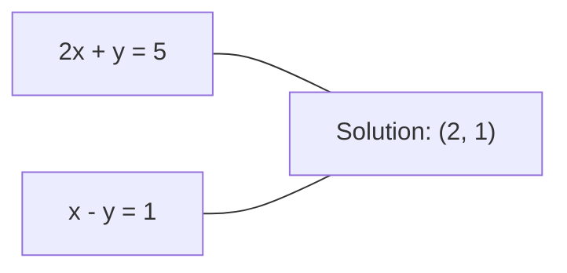
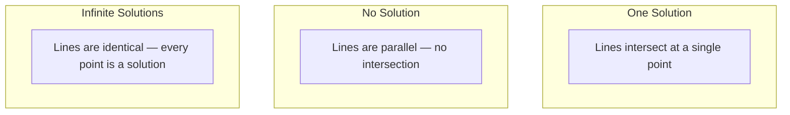

# Hệ thống tuyến tính

> Giải Axe = b là bài toán lâu đời nhất vẫn chạy mạng nơ-ron của bạn.

**Loại:** Xây dựng
**Ngôn ngữ:** Python
**Kiến thức tiên quyết:** Giai đoạn 1, Bài 01 (Trực giác đại số tuyến tính), 02 (Vectors & Ma trận), 03 (Biến đổi ma trận)
**Thời lượng:** ~120 phút

## Mục tiêu học tập

- Giải Axe = b bằng cách sử dụng loại bỏ Gaussian với xoay một phần và thay thế trở lại
- Ma trận yếu tố với phân hủy LU, QR và Cholesky và giải thích khi nào mỗi loại phù hợp
- Suy ra các phương trình chuẩn cho bình phương nhỏ nhất và kết nối chúng với hồi quy tuyến tính và sườn núi
- Chẩn đoán các hệ thống điều kiện kém bằng cách sử dụng số điều kiện và áp dụng chính quy hóa để ổn định chúng

## Vấn đề

Mỗi khi bạn huấn luyện hồi quy tuyến tính, bạn giải quyết một hệ thống tuyến tính. Mỗi khi bạn tính toán phù hợp bình phương nhỏ nhất, bạn giải quyết một hệ thống tuyến tính. Mỗi khi một lớp mạng nơ-ron tính toán `y = Wx + b`, nó đang đánh giá một mặt của hệ thống tuyến tính. Khi bạn thêm chính quy hóa, bạn sửa đổi hệ thống. Khi bạn sử dụng processes Gaussian, bạn nhân số một ma trận. Khi bạn đảo ngược ma trận hiệp phương sai cho khoảng cách Mahalanobis, bạn giải một hệ tuyến tính.

Phương trình Ax = b xuất hiện ở khắp mọi nơi. A là một ma trận của các hệ số đã biết. b là một vector của các đầu ra đã biết. x là vector ẩn số bạn muốn tìm. Trong hồi quy tuyến tính, A là ma trận dữ liệu của bạn, b là vector mục tiêu của bạn và x là trọng số vector. Toàn bộ model rút gọn thành: tìm x sao cho Ax càng gần b càng tốt.

Bài học này xây dựng mọi phương pháp chính để giải phương trình đó từ đầu. Bạn sẽ hiểu tại sao một số phương pháp nhanh và những phương pháp khác ổn định, tại sao một số phương pháp chỉ hoạt động cho các hệ thống vuông và những phương pháp khác xử lý các hệ thống được xác định quá mức, và tại sao số điều kiện của ma trận của bạn xác định liệu câu trả lời của bạn có ý nghĩa gì hay không.

## Khái niệm

### Ax = b có nghĩa là gì về mặt hình học

Một hệ phương trình tuyến tính có cách giải thích hình học. Mỗi phương trình xác định một siêu phẳng. Lời giải là điểm (hoặc tập hợp các điểm) nơi tất cả các siêu mặt phẳng giao nhau.

```
2x + y = 5          Two lines in 2D.
x - y  = 1          They intersect at x=2, y=1.
```



Ba điều có thể xảy ra:



Ở dạng ma trận, "một giải pháp" có nghĩa là A có thể đảo ngược. "Không có giải pháp" có nghĩa là hệ thống không nhất quán. "Giải pháp vô hạn" có nghĩa là A có không gian rỗng. Hầu hết các bài toán ML đều nằm trong danh mục "không có giải pháp chính xác" vì bạn có nhiều phương trình (điểm dữ liệu) hơn các phương trình chưa biết (parameters). Đó là nơi các bình phương nhỏ nhất xuất hiện.

### Hình ảnh cột so với hình ảnh hàng

Có hai cách để đọc Ax = b.

**Hình ảnh hàng.** Mỗi hàng của A xác định một phương trình. Mỗi phương trình là một siêu phẳng. Giải pháp là nơi tất cả chúng giao nhau.

**Hình cột.** Mỗi cột của A là một vector. Câu hỏi đặt ra là: tổ hợp tuyến tính nào của các cột A tạo ra b?

```
A = | 2  1 |    b = | 5 |
    | 1 -1 |        | 1 |

Row picture: solve 2x + y = 5 and x - y = 1 simultaneously.

Column picture: find x1, x2 such that:
  x1 * [2, 1] + x2 * [1, -1] = [5, 1]
  2 * [2, 1] + 1 * [1, -1] = [4+1, 2-1] = [5, 1]   check.
```

Hình ảnh cột cơ bản hơn. Nếu b nằm trong không gian cột của A, hệ thống có lời giải. Nếu b không, bạn sẽ tìm thấy điểm gần nhất trong không gian cột. Điểm gần nhất đó là giải pháp bình phương nhỏ nhất.

### Loại bỏ Gaussian

Loại trừ Gaussian biến Ax = b thành một hệ tam giác trên Ux = c mà bạn giải bằng cách thay thế ngược. Đó là phương pháp trực tiếp nhất.

Thuật toán:

```
1. For each column k (the pivot column):
   a. Find the largest entry in column k at or below row k (partial pivoting).
   b. Swap that row with row k.
   c. For each row i below k:
      - Compute multiplier m = A[i][k] / A[k][k]
      - Subtract m times row k from row i.
2. Back substitute: solve from the last equation upward.
```

Ví dụ:

```
Original:
| 2  1  1 | 8 |       R2 = R2 - (2)R1     | 2  1   1 |  8 |
| 4  3  3 |20 |  -->  R3 = R3 - (1)R1 --> | 0  1   1 |  4 |
| 2  3  1 |12 |                            | 0  2   0 |  4 |

                       R3 = R3 - (2)R2     | 2  1   1 |  8 |
                                       --> | 0  1   1 |  4 |
                                           | 0  0  -2 | -4 |

Back substitute:
  -2 * x3 = -4    -->  x3 = 2
  x2 + 2  = 4     -->  x2 = 2
  2*x1 + 2 + 2 = 8 --> x1 = 2
```

Loại bỏ Gaussian chi phí cho các phép toán O(n^3). Đối với một hệ thống 1000x1000, đó là khoảng một tỷ phép toán dấu phẩy động. Nhanh, nhưng bạn có thể làm tốt hơn nếu bạn cần giải nhiều hệ thống với cùng một điểm A.

### Xoay một phần: tại sao nó lại quan trọng

Nếu không xoay trục, loại bỏ Gaussian có thể thất bại hoặc tạo ra rác. Nếu một phần tử trục bằng không, bạn chia cho không. Nếu nó nhỏ, bạn khuếch đại lỗi làm tròn.

```
Bad pivot:                       With partial pivoting:
| 0.001  1 | 1.001 |            Swap rows first:
| 1      1 | 2     |            | 1      1 | 2     |
                                 | 0.001  1 | 1.001 |
m = 1/0.001 = 1000              m = 0.001/1 = 0.001
R2 = R2 - 1000*R1               R2 = R2 - 0.001*R1
| 0.001  1     | 1.001   |      | 1      1     | 2     |
| 0     -999   | -999.0  |      | 0      0.999 | 0.999 |

x2 = 1.000 (correct)            x2 = 1.000 (correct)
x1 = (1.001 - 1)/0.001          x1 = (2 - 1)/1 = 1.000 (correct)
   = 0.001/0.001 = 1.000        Stable because the multiplier is small.
```

Trong số học dấu phẩy động với precision hạn chế, phiên bản không xoay có thể mất các chữ số đáng kể. Xoay một phần luôn chọn trục lớn nhất có sẵn để giảm thiểu sự khuếch đại lỗi.

### Phân hủy LU

Các yếu tố phân hủy LU A thành ma trận tam giác dưới L và ma trận tam giác trên U: A = LU. Ma trận L lưu trữ các hệ số nhân từ loại bỏ Gaussian. Ma trận U là kết quả của quá trình loại bỏ.

```
A = L @ U

| 2  1  1 |   | 1  0  0 |   | 2  1   1 |
| 4  3  3 | = | 2  1  0 | @ | 0  1   1 |
| 2  3  1 |   | 1  2  1 |   | 0  0  -2 |
```

Tại sao lại có yếu tố thay vì chỉ loại bỏ? Bởi vì một khi bạn có L và U, việc giải Ax = b cho bất kỳ b mới nào chỉ tốn O(n^2):

```
Ax = b
LUx = b
Let y = Ux:
  Ly = b    (forward substitution, O(n^2))
  Ux = y    (back substitution, O(n^2))
```

Chi phí O (n ^ 3) được thanh toán một lần trong quá trình phân tích. Mọi giải tiếp theo là O (n ^ 2). Nếu bạn cần giải 1000 hệ thống có cùng điểm A nhưng vectors b khác nhau, LU tiết kiệm được hệ số 1000/3 trong tổng công việc.

Với xoay một phần, bạn nhận được PA = LU trong đó P là ma trận hoán vị ghi lại các giao dịch hoán đổi hàng.

### Phân hủy QR

Các yếu tố phân hủy QR A thành ma trận trực giao Q và ma trận tam giác trên R: A = QR.

Ma trận trực giao có thuộc tính Q^T Q = I. Các cột của nó là vectors trực thường. Nhân với Q bảo toàn chiều dài và góc.

```
A = Q @ R

Q has orthonormal columns: Q^T Q = I
R is upper triangular

To solve Ax = b:
  QRx = b
  Rx = Q^T b    (just multiply by Q^T, no inversion needed)
  Back substitute to get x.
```

QR ổn định hơn về mặt số so với LU để giải các bài toán bình phương nhỏ nhất. Gram-Schmidt process xây dựng Q từng cột một:

```
Given columns a1, a2, ... of A:

q1 = a1 / ||a1||

q2 = a2 - (a2 . q1) * q1        (subtract projection onto q1)
q2 = q2 / ||q2||                (normalize)

q3 = a3 - (a3 . q1) * q1 - (a3 . q2) * q2
q3 = q3 / ||q3||

R[i][j] = qi . aj    for i <= j
```

Mỗi bước sẽ loại bỏ thành phần dọc theo tất cả các q vectors trước đó, chỉ để lại hướng trực giao mới.

### Phân hủy Cholesky

Khi A đối xứng (A = A^T) và xác định dương (tất cả các giá trị riêng dương), bạn có thể nhân số nó là A = L L^T trong đó L là tam giác thấp hơn. Đây là sự phân hủy của Cholesky.

```
A = L @ L^T

| 4  2 |   | 2  0 |   | 2  1 |
| 2  5 | = | 1  2 | @ | 0  2 |

L[i][i] = sqrt(A[i][i] - sum(L[i][k]^2 for k < i))
L[i][j] = (A[i][j] - sum(L[i][k]*L[j][k] for k < j)) / L[j][j]    for i > j
```

Cholesky nhanh gấp đôi LU và cần một nửa dung lượng lưu trữ. Nó chỉ hoạt động đối với các ma trận xác định dương đối xứng, nhưng chúng hiển thị liên tục:

- Ma trận hiệp phương sai là đối xứng dương bán xác định (dương xác định với chính quy hóa).
- Ma trận hạt nhân trong processes Gaussian là xác định dương đối xứng.
- Hessian của một hàm lồi ở mức tối thiểu là đối xứng dương xác định.
- A^T A luôn luôn đối xứng dương bán xác định.

Trong processes Gaussian, bạn nhân tử ma trận hạt nhân K với Cholesky, sau đó giải K alpha = y để có giá trị trung bình dự đoán. Hệ số Cholesky cũng cung cấp cho bạn yếu tố quyết định log cho các likelihood biên: log det(K) = 2 * sum(log(diag(L))).

### Bình phương nhỏ nhất: khi Ax = b không có lời giải chính xác

Nếu A là m x n với m > n (nhiều phương trình hơn số chưa biết), hệ thống được xác định quá mức. Không có giải pháp chính xác. Thay vào đó, bạn giảm thiểu sai số bình phương:

```
minimize ||Ax - b||^2

This is the sum of squared residuals:
  sum((A[i,:] @ x - b[i])^2 for i in range(m))
```

Bộ thu nhỏ thỏa mãn các phương trình chuẩn:

```
A^T A x = A^T b
```

Dẫn xuất: mở rộng ||Rìu - b||^2 = (Ax - b)^T (Ax - b) = x^T A^T A x - 2 x^T A^T b + b^T b. Lấy gradient đối với x, đặt nó thành không: 2 A^T A x - 2 A^T b = 0.

```
Original system (overdetermined, 4 equations, 2 unknowns):
| 1  1 |         | 3 |
| 1  2 | x     = | 5 |       No exact x satisfies all 4 equations.
| 1  3 |         | 6 |
| 1  4 |         | 8 |

Normal equations:
A^T A = | 4  10 |    A^T b = | 22 |
        | 10 30 |            | 63 |

Solve: x = [1.5, 1.7]

This is linear regression. x[0] is the intercept, x[1] is the slope.
```

### Phương trình chuẩn = hồi quy tuyến tính

Kết nối là chính xác. Trong hồi quy tuyến tính, ma trận dữ liệu X của bạn có một hàng trên mỗi mẫu và một cột trên mỗi feature. Mục tiêu của bạn vector y có một mục nhập cho mỗi mẫu. Trọng lượng vector w đáp ứng:

```
X^T X w = X^T y
w = (X^T X)^(-1) X^T y
```

Đây là giải pháp dạng đóng cho hồi quy tuyến tính. Mỗi cuộc gọi đến `sklearn.linear_model.LinearRegression.fit()` sẽ tính toán điều này (hoặc tương đương qua QR hoặc SVD).

Thêm thuật ngữ chính quy hóa lambda * I vào ma trận và bạn nhận được hồi quy sườn núi:

```
(X^T X + lambda * I) w = X^T y
w = (X^T X + lambda * I)^(-1) X^T y
```

Việc chính quy hóa làm cho ma trận được điều chỉnh tốt hơn (dễ đảo ngược chính xác hơn) và ngăn chặn overfitting bằng cách thu nhỏ trọng số về không. Ma trận X^T X + lambda * I luôn là xác định dương đối xứng khi lambda > 0, vì vậy bạn có thể sử dụng Cholesky để giải nó.

### Giả nghịch đảo (Moore-Penrose)

Nghịch đảo giả A+ khái quát hóa đảo ngược ma trận thành ma trận không vuông và số ít. Đối với bất kỳ ma trận A nào:

```
x = A+ b

where A+ = V Sigma+ U^T    (computed via SVD)
```

Sigma + được hình thành bằng cách lấy nghịch đảo của mỗi giá trị số ít không và chuyển vị kết quả. Nếu A = U Sigma V^T, thì A+ = V Sigma+ U^T.

```
A = U Sigma V^T        (SVD)

Sigma = | 5  0 |       Sigma+ = | 1/5  0  0 |
        | 0  2 |                | 0  1/2  0 |
        | 0  0 |

A+ = V Sigma+ U^T
```

Giả nghịch đảo đưa ra giải pháp bình phương nhỏ nhất định mức tối thiểu. Nếu hệ thống có:
- Một giải pháp: A + b cho nó.
- Không có lời giải: A + b đưa ra giải pháp bình phương nhỏ nhất.
- Giải pháp vô hạn: A + b cho giải pháp có giá trị nhỏ nhất ||x||.

NumPy `np.linalg.lstsq` và `np.linalg.pinv` đều sử dụng SVD bên trong.

### Số điều kiện

Số điều kiện đo lường mức độ nhạy cảm của giải pháp đối với những thay đổi nhỏ trong đầu vào. Đối với ma trận A, số điều kiện là:

```
kappa(A) = ||A|| * ||A^(-1)|| = sigma_max / sigma_min
```

trong đó sigma_max và sigma_min là các giá trị số ít lớn nhất và nhỏ nhất.

```
Well-conditioned (kappa ~ 1):        Ill-conditioned (kappa ~ 10^15):
Small change in b -->                Small change in b -->
small change in x                    huge change in x

| 2  0 |   kappa = 2/1 = 2          | 1   1          |   kappa ~ 10^15
| 0  1 |   safe to solve            | 1   1+10^(-15) |   solution is garbage
```

Quy tắc ngón tay cái:
- Kappa < 100: An toàn, dung dịch chính xác.
- Kappa ~10^k: Bạn mất khoảng k chữ số của precision từ số học dấu phẩy động của bạn.
- kappa ~10^16 (đối với float64): lời giải là vô nghĩa. Ma trận là số ít một cách hiệu quả.

Trong ML, tình trạng kém xảy ra khi features gần như đồng tuyến. Chính quy hóa (thêm lambda * I) cải thiện số điều kiện từ sigma_max / sigma_min đến (sigma_max + lambda) / (sigma_min + lambda).

### Phương pháp lặp lại: liên hợp gradient

Đối với các hệ thống thưa thớt rất lớn (hàng triệu ẩn số), các phương pháp trực tiếp như LU hoặc Cholesky quá đắt. Các phương pháp lặp lại gần đúng với giải pháp bằng cách cải thiện dự đoán qua nhiều lần lặp.

Liên hợp gradient (CG) giải Ax = b khi A là xác định dương đối xứng. Nó tìm ra lời giải chính xác trong nhiều nhất là n lần lặp lại (trong số học chính xác), nhưng thường hội tụ nhanh hơn nhiều nếu các giá trị riêng của A được phân cụm.

```
Algorithm sketch:
  x0 = initial guess (often zero)
  r0 = b - A x0           (residual)
  p0 = r0                 (search direction)

  For k = 0, 1, 2, ...:
    alpha = (rk . rk) / (pk . A pk)
    x_{k+1} = xk + alpha * pk
    r_{k+1} = rk - alpha * A pk
    beta = (r_{k+1} . r_{k+1}) / (rk . rk)
    p_{k+1} = r_{k+1} + beta * pk
    if ||r_{k+1}|| < tolerance: stop
```

CG được sử dụng trong:
- Tối ưu hóa quy mô lớn (phương pháp Newton-CG)
- Giải quyết sự rời rạc của PDE
- Các phương thức hạt nhân trong đó ma trận hạt nhân quá lớn để tính đến
- Điều kiện trước cho các bộ giải lặp lại khác

Tỷ lệ hội tụ phụ thuộc vào số điều kiện. Các hệ thống có điều kiện tốt hơn hội tụ nhanh hơn, đó là một lý do khác khiến việc chính quy hóa giúp ích.

### Bức tranh toàn cảnh: phương pháp nào khi

| Phương pháp | Yêu cầu | Phí Tổn | Trường hợp sử dụng |
|--------|-------------|------|----------|
| Loại bỏ Gaussian | Hình vuông, không số ít A | O (n ^ 3) | Giải một lần của một hệ vuông |
| Phân hủy LU | Hình vuông, không số ít A | O (n ^ 3) + O (n ^ 2) giải | Nhiều giải quyết với cùng một điểm A |
| Phân hủy QR | Bất kỳ A nào (m > = n) | O(mn^2) | Bình phương nhỏ nhất, ổn định về số |
| Cholesky | Đối xứng dương xác định A | O (n ^ 3/3) | Ma trận hiệp phương sai, processes Gaussian, hồi quy sườn núi |
| Phương trình bình thường | Xác định quá mức (m > n) | O(mn^2 + n^3) | Hồi quy tuyến tính (n nhỏ) |
| SVD / giả nghịch đảo | Bất kỳ A nào | O(mn^2) | Hệ thống thiếu thứ hạng, giải pháp định mức tối thiểu |
| Liên hợp gradient | Đối xứng dương xác định, thưa thớt A | O (n * k * nnz) | Hệ thống thưa thớt lớn, k = lặp lại |

### Kết nối với ML

Mọi phương thức trong bài học này xuất hiện trong production ML:

**Hồi quy tuyến tính.** Giải pháp dạng đóng giải các phương trình chuẩn X^T X w = X^T y. Điều này được thực hiện thông qua Cholesky (nếu n nhỏ) hoặc QR (nếu tính ổn định số quan trọng) hoặc SVD (nếu ma trận có thể bị thiếu thứ hạng).

**Hồi quy sườn núi.** Thêm lambda * I vào X^T X. Hệ thống quy tắc hóa (X^T X + lambda * I) w = X^T y luôn có thể giải được thông qua Cholesky vì X^T X + lambda * I là xác định dương đối xứng đối với lambda > 0.

**Gaussian processes.** Giá trị trung bình dự đoán yêu cầu giải K alpha = y trong đó K là ma trận nhân. Thừa số Cholesky của K là cách tiếp cận tiêu chuẩn. Các likelihood cận biên log sử dụng log det(K) = 2 sum(log(diag(L))).

**Khởi tạo mạng nơ-ron.** Khởi tạo trực giao sử dụng phân hủy QR để tạo ma trận trọng số có cột trực tuyến. Điều này ngăn chặn sự sụp đổ tín hiệu trong các mạng sâu.

**Điều kiện trước.** optimizers quy mô lớn sử dụng Cholesky không hoàn chỉnh hoặc LU không hoàn chỉnh làm điều hòa trước cho các bộ giải gradient liên hợp.

**Feature engineering.** Số điều kiện của X ^ T X cho bạn biết nếu features của bạn là đồng tuyến. Nếu kappa lớn, hãy bỏ features hoặc thêm chính quy hóa.

```figure
linear-system-conditioning
```

## Tự xây dựng

### Bước 1: Loại bỏ Gaussian với trục một phần

```python
import numpy as np

def gaussian_elimination(A, b):
    n = len(b)
    Ab = np.hstack([A.astype(float), b.reshape(-1, 1).astype(float)])

    for k in range(n):
        max_row = k + np.argmax(np.abs(Ab[k:, k]))
        Ab[[k, max_row]] = Ab[[max_row, k]]

        if abs(Ab[k, k]) < 1e-12:
            raise ValueError(f"Matrix is singular or nearly singular at pivot {k}")

        for i in range(k + 1, n):
            m = Ab[i, k] / Ab[k, k]
            Ab[i, k:] -= m * Ab[k, k:]

    x = np.zeros(n)
    for i in range(n - 1, -1, -1):
        x[i] = (Ab[i, -1] - Ab[i, i+1:n] @ x[i+1:n]) / Ab[i, i]

    return x
```

### Bước 2: Phân hủy LU

```python
def lu_decompose(A):
    n = A.shape[0]
    L = np.eye(n)
    U = A.astype(float).copy()
    P = np.eye(n)

    for k in range(n):
        max_row = k + np.argmax(np.abs(U[k:, k]))
        if max_row != k:
            U[[k, max_row]] = U[[max_row, k]]
            P[[k, max_row]] = P[[max_row, k]]
            if k > 0:
                L[[k, max_row], :k] = L[[max_row, k], :k]

        for i in range(k + 1, n):
            L[i, k] = U[i, k] / U[k, k]
            U[i, k:] -= L[i, k] * U[k, k:]

    return P, L, U

def lu_solve(P, L, U, b):
    n = len(b)
    Pb = P @ b.astype(float)

    y = np.zeros(n)
    for i in range(n):
        y[i] = Pb[i] - L[i, :i] @ y[:i]

    x = np.zeros(n)
    for i in range(n - 1, -1, -1):
        x[i] = (y[i] - U[i, i+1:] @ x[i+1:]) / U[i, i]

    return x
```

### Bước 3: Phân hủy Cholesky

```python
def cholesky(A):
    n = A.shape[0]
    L = np.zeros_like(A, dtype=float)

    for i in range(n):
        for j in range(i + 1):
            s = A[i, j] - L[i, :j] @ L[j, :j]
            if i == j:
                if s <= 0:
                    raise ValueError("Matrix is not positive definite")
                L[i, j] = np.sqrt(s)
            else:
                L[i, j] = s / L[j, j]

    return L
```

### Bước 4: Bình phương nhỏ nhất thông qua phương trình bình thường

```python
def least_squares_normal(A, b):
    AtA = A.T @ A
    Atb = A.T @ b
    return gaussian_elimination(AtA, Atb)

def ridge_regression(A, b, lam):
    n = A.shape[1]
    AtA = A.T @ A + lam * np.eye(n)
    Atb = A.T @ b
    L = cholesky(AtA)
    y = np.zeros(n)
    for i in range(n):
        y[i] = (Atb[i] - L[i, :i] @ y[:i]) / L[i, i]
    x = np.zeros(n)
    for i in range(n - 1, -1, -1):
        x[i] = (y[i] - L.T[i, i+1:] @ x[i+1:]) / L.T[i, i]
    return x
```

### Bước 5: Số điều kiện

```python
def condition_number(A):
    U, S, Vt = np.linalg.svd(A)
    return S[0] / S[-1]
```

## Ứng dụng

Ghép các mảnh lại với nhau để hồi quy tuyến tính và hồi quy sườn núi trên dữ liệu thực:

```python
np.random.seed(42)
X_raw = np.random.randn(100, 3)
w_true = np.array([2.0, -1.0, 0.5])
y = X_raw @ w_true + np.random.randn(100) * 0.1

X = np.column_stack([np.ones(100), X_raw])

w_ols = least_squares_normal(X, y)
print(f"OLS weights (ours):    {w_ols}")

w_np = np.linalg.lstsq(X, y, rcond=None)[0]
print(f"OLS weights (numpy):   {w_np}")
print(f"Max difference: {np.max(np.abs(w_ols - w_np)):.2e}")

w_ridge = ridge_regression(X, y, lam=1.0)
print(f"Ridge weights (ours):  {w_ridge}")

from sklearn.linear_model import Ridge
ridge_sk = Ridge(alpha=1.0, fit_intercept=False)
ridge_sk.fit(X, y)
print(f"Ridge weights (sklearn): {ridge_sk.coef_}")
```

## Sản phẩm bàn giao

Bài học này tạo ra:
- `code/linear_systems.py` chứa các triển khai từ đầu của loại bỏ Gaussian, phân hủy LU, phân hủy Cholesky, bình phương nhỏ nhất và hồi quy sườn núi
- Một minh họa làm việc cho thấy các phương trình bình thường và Hồi quy tuyến tính của sklearn tạo ra cùng trọng số

## Bài tập

1. Giải `[[1,2,3],[4,5,6],[7,8,10]] x = [6, 15, 27]` hệ thống bằng cách sử dụng loại bỏ Gaussian, bộ giải LU của bạn và `np.linalg.solve`. Xác minh cả ba đều đưa ra cùng một câu trả lời trong dung sai dấu phẩy động.

2. Tạo ma trận ngẫu nhiên 50x5 X và mục tiêu y = X @ w_true + nhiễu. Giải cho w bằng cách sử dụng các phương trình chuẩn, QR (qua `np.linalg.qr`), SVD (qua `np.linalg.svd`) và `np.linalg.lstsq`. So sánh cả bốn giải pháp. Đo số điều kiện của X^T X và giải thích nó ảnh hưởng như thế nào đến phương pháp bạn tin tưởng.

3. Tạo một ma trận gần như đơn lẻ bằng cách làm cho hai cột gần như giống hệt nhau (ví dụ: cột 2 = cột 1 + 1e-10 * nhiễu). Tính số điều kiện của nó. Giải Ax = b có và không có chính quy hóa (thêm 0.01 * I). So sánh các dung dịch và phần dư. Giải thích lý do tại sao chính quy hóa hữu ích.

4. Thực hiện thuật toán gradient liên hợp cho ma trận xác định dương đối xứng ngẫu nhiên 100x100. Đếm số lần lặp lại cần thiết để hội tụ đến dung sai 1e-8. So sánh với mức tối đa lý thuyết của n lần lặp.

5. Tính thời gian cho bộ giải Cholesky so với bộ giải LU của bạn so với `np.linalg.solve` trên các ma trận xác định dương đối xứng có kích thước 10, 50, 200, 500. Vẽ kết quả. Xác minh Cholesky nhanh hơn LU khoảng 2 lần.

## Thuật ngữ chính

| Thuật ngữ | Những gì mọi người nói | Ý nghĩa thực sự của nó |
|------|----------------|----------------------|
| Hệ thống tuyến tính | "Giải cho x" | Một tập hợp các phương trình tuyến tính Ax = b. Tìm x có nghĩa là tìm đầu vào tạo ra đầu ra b trong phép biến đổi A. |
| Loại bỏ Gaussian | "Giảm hàng" | Loại bỏ một cách có hệ thống các mục bên dưới đường chéo bằng cách sử dụng các phép toán hàng, tạo ra một hệ thống hình tam giác phía trên có thể giải được bằng cách thay thế ngược. O(n^3). |
| Xoay một phần | "Hoán đổi hàng để ổn định" | Trước khi loại bỏ trong cột k, hoán đổi hàng có giá trị tuyệt đối lớn nhất trong cột đó sang vị trí trục. Ngăn chặn sự phân chia theo các số nhỏ. |
| Phân hủy LU | "Yếu tố thành hình tam giác" | Viết A = LU trong đó L là hình tam giác dưới (lưu trữ hệ số nhân) và U là hình tam giác trên (ma trận bị loại bỏ). Khấu hao chi phí O (n ^ 3) trên nhiều lần giải. |
| Phân hủy QR | "Thừa số trực giao" | Viết A = QR trong đó Q có các cột trực tuyến và R là hình tam giác trên. Ổn định hơn LU cho các ô nhỏ nhất. |
| Phân hủy Cholesky | "Căn bậc hai của ma trận" | Đối với xác định dương đối xứng A, hãy viết A = LL^T. Một nửa chi phí của LU. Được sử dụng cho ma trận hiệp phương sai, ma trận hạt nhân và hồi quy sườn núi. |
| Bình phương nhỏ nhất | "Phù hợp nhất khi chính xác là không thể" | Giảm thiểu tổng số dư bình phương || Rìu - b || ^2 khi hệ thống được xác định quá mức (nhiều phương trình hơn là phương trình chưa biết). |
| Phương trình bình thường | "Lối tắt giải tích" | A^T A x = A^T b. Đặt gradient của || Rìu - b || ^2 đến không. Đây là giải pháp dạng đóng cho hồi quy tuyến tính. |
| Giả nghịch đảo | "Đảo ngược cho ma trận không vuông" | A + = V Sigma + U ^ T qua SVD. Đưa ra giải pháp bình phương nhỏ nhất định mức tối thiểu cho bất kỳ ma trận nào, hình vuông hoặc hình chữ nhật, số ít hay không. |
| Số điều kiện | "Câu trả lời này đáng tin cậy biết bao" | kappa = sigma_max / sigma_min. Đo độ nhạy với nhiễu loạn đầu vào. Mất khoảng log10 (kappa) chữ số precision. |
| Hồi quy sườn núi | "Bình phương nhỏ nhất được chính quy hóa" | Giải (X^T X + lambda I) w = X^T y. Thêm lambda I cải thiện điều hòa và thu nhỏ trọng lượng về không. Ngăn chặn overfitting. |
| Liên hợp gradient | "Rìu lặp lại = b cho ma trận lớn" | Một bộ giải lặp lại cho các hệ xác định dương đối xứng. Hội tụ ở nhiều nhất n bước. Thực tế cho các hệ thống thưa thớt lớn, nơi phân tích quá tốn kém. |
| Hệ thống xác định quá mức | "Nhiều dữ liệu hơn parameters" | m > n trong hệ m-x-n. Không có giải pháp chính xác nào tồn tại. Bình phương nhỏ nhất tìm thấy xấp xỉ tốt nhất. Đây là mọi vấn đề hồi quy. |
| Thay người trở lại | "Giải quyết từ dưới lên" | Cho một hệ thống tam giác trên, hãy giải phương trình cuối cùng trước, sau đó thay thế ngược lại. O(n^2). |
| Thay người chuyển tiếp | "Giải quyết từ trên xuống" | Cho một hệ thống tam giác thấp hơn, giải phương trình đầu tiên trước, sau đó thay thế về phía trước. O(n^2). Được sử dụng trong bước L của LU giải. |

## Đọc thêm

- [MIT 18.06: Linear Algebra](https://ocw.mit.edu/courses/18-06-linear-algebra-spring-2010/) (Gilbert Strang) -- khóa học cuối cùng về hệ thống tuyến tính và thừa số ma trận
- [Numerical Linear Algebra](https://people.maths.ox.ac.uk/trefethen/text.html) (Trefethen & Bau) -- tài liệu tham khảo tiêu chuẩn để hiểu tính ổn định số, điều kiện và lý do tại sao các thuật toán thất bại
- [Matrix Computations](https://www.cs.cornell.edu/cv/GolubVanLoan4/golubandvanloan.htm) (Golub & Van Loan) -- tài liệu tham khảo bách khoa toàn thư cho mọi thuật toán ma trận
- [3Blue1Brown: Inverse Matrices](https://www.3blue1brown.com/lessons/inverse-matrices) -- trực giác trực quan về ý nghĩa của việc giải Ax = b về mặt hình học
