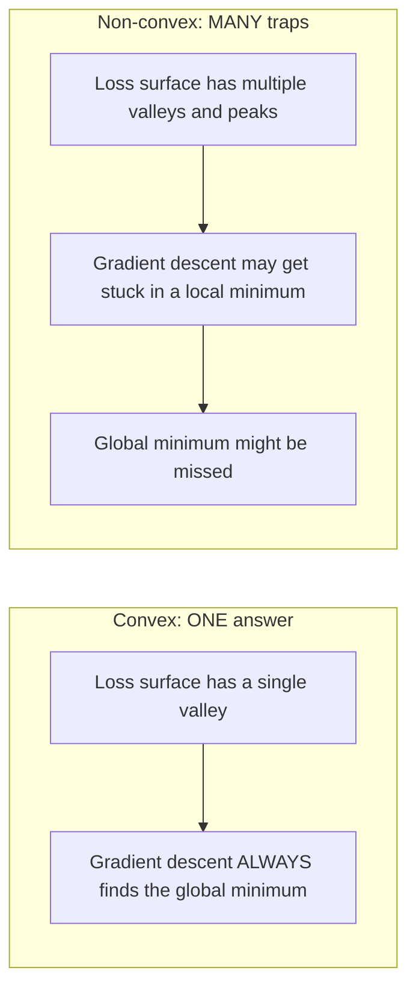
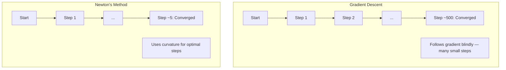
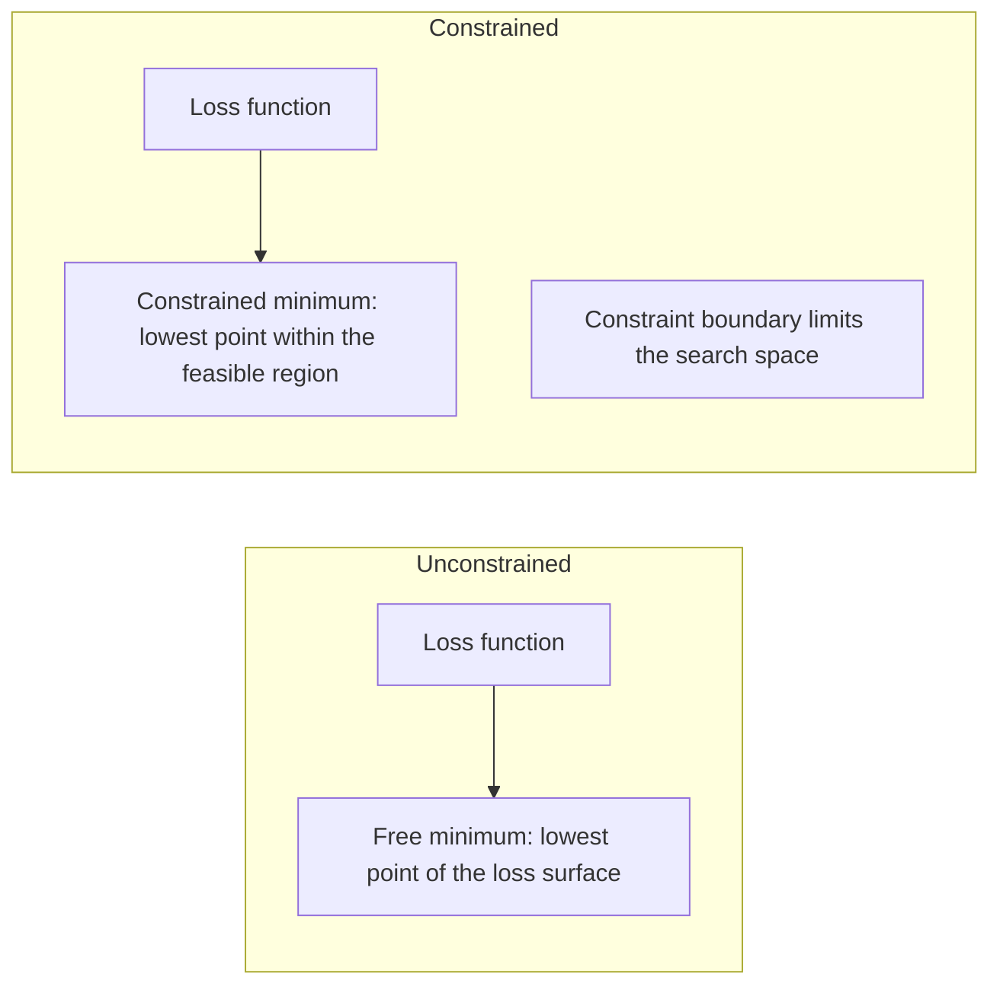
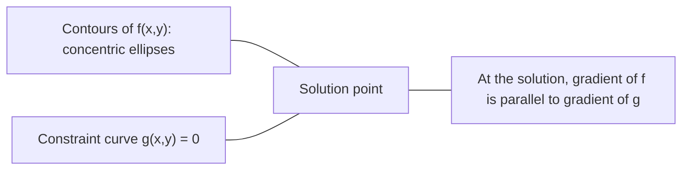

# Tối ưu hóa lồi

> Các vấn đề lồi có một thung lũng. Mạng nơ-ron có hàng triệu. Biết sự khác biệt rất quan trọng.

**Loại:** Xây dựng
**Ngôn ngữ:** Python
**Kiến thức tiên quyết:** Giai đoạn 1, Bài 04 (Giải tích cho ML), 08 (Tối ưu hóa)
**Thời lượng:** ~90 phút

## Mục tiêu học tập

- Kiểm tra xem một hàm có lồi hay không bằng cách sử dụng định nghĩa, đạo hàm thứ hai và tiêu chí Hessian
- Thực hiện phương pháp Newton và so sánh hội tụ bậc hai của nó với gradient descent
- Giải quyết các vấn đề tối ưu hóa bị hạn chế bằng cách sử dụng hệ số nhân Lagrange và giải thích các điều kiện KKT
- Giải thích lý do tại sao mạng nơ-ron loss cảnh quan không lồi nhưng SGD vẫn tìm ra giải pháp tốt

## Vấn đề

Bài 08 đã dạy bạn gradient descent, động lượng và Adam. Những người đó optimizers đi xuống dốc trên bất kỳ bề mặt nào. Nhưng chúng không có gì đảm bảo. Gradient descent trên một cảnh quan không lồi có thể hạ cánh ở mức tối thiểu cục bộ xấu, bị mắc kẹt trên một điểm yên xe hoặc dao động mãi mãi. Dù sao bạn cũng sử dụng nó vì mạng nơ-ron không lồi và không có lựa chọn thay thế.

Nhưng nhiều vấn đề trong học máy là lồi. Hồi quy tuyến tính, hồi quy logistic, SVM, LASSO, hồi quy sườn núi. Đối với những điều này, một cái gì đó mạnh mẽ hơn tồn tại: tối ưu hóa với các đảm bảo toán học. Một bài toán lồi có chính xác một thung lũng. Bất kỳ thuật toán nào đi xuống dốc sẽ đạt đến mức tối thiểu toàn cầu. Không cần khởi động lại. Không có lịch trình learning rate. Không cầu nguyện.

Hiểu được độ lồi có ba điều. Đầu tiên, nó cho bạn biết khi nào vấn đề của bạn là dễ (lồi) so với khó (không lồi). Thứ hai, nó cung cấp cho bạn các công cụ nhanh hơn như phương pháp Newton cho các vấn đề lồi. Thứ ba, nó giải thích các khái niệm xuất hiện xuyên suốt ML: chính quy hóa như một ràng buộc, tính nhị nguyên trong SVM và lý do tại sao deep learning hoạt động mặc dù vi phạm mọi thuộc tính tốt đẹp mà lồi mang lại cho bạn.

## Khái niệm

### Bộ lồi

Một tập S là lồi nếu đối với hai điểm bất kỳ trong S, đoạn thẳng giữa chúng cũng nằm hoàn toàn trong S.

| Bộ lồi | Không lồi |
|---|---|
| **Hình chữ nhật**: hai điểm bất kỳ bên trong có thể được kết nối bằng một đoạn thẳng nằm bên trong | **Star/crescent hình dạng**: một đường thẳng giữa hai điểm bên trong có thể đi qua bên ngoài tập hợp |
| **Tam giác**: cùng một thuộc tính giữ cho tất cả các điểm bên trong | **Donut/annulus**: lỗ có nghĩa là một số đoạn đường rời khỏi bộ |
| Đoạn thẳng giữa hai điểm bất kỳ nằm trong tập hợp | Đoạn đường giữa một số cặp điểm thoát ra khỏi tập hợp |

Kiểm tra chính thức: đối với bất kỳ điểm x, y nào trong S và bất kỳ t nào trong [0, 1], điểm tx + (1-t)y cũng bằng S.

Ví dụ về tập hợp lồi:
- Một đường thẳng, một mặt phẳng, tất cả R^n
- Một quả bóng (hình tròn, hình cầu, siêu cầu)
- Một nửa khoảng trắng: {x : a^T x <= b}
- Giao điểm của bất kỳ số lượng tập lồi nào

Ví dụ về tập hợp không lồi:
- Một chiếc bánh rán (hình khuyên)
- Sự kết hợp của hai vòng tròn rời rạc
- Bất kỳ bộ nào có "vết lõm" hoặc "lỗ"

### Chức năng lồi

Một hàm f là lồi nếu miền của nó là một tập lồi và đối với hai điểm bất kỳ x, y trong miền của nó và bất kỳ t nào trong [0, 1]:

```
f(tx + (1-t)y) <= t*f(x) + (1-t)*f(y)
```

Về mặt hình học: đoạn thẳng giữa hai điểm bất kỳ trên biểu đồ nằm ở trên hoặc trên biểu đồ.

| Bất động sản | Chức năng lồi | Chức năng không lồi |
|---|---|---|
| **Kiểm tra phân đoạn dòng** | Đường giữa hai điểm bất kỳ trên biểu đồ nằm **trên hoặc trên** đường cong | Đường giữa một số điểm trên biểu đồ giảm xuống **bên dưới **đường cong |
| **Hình dạng** | Một bowl/valley cong lên trên | Nhiều đỉnh và thung lũng với độ cong hỗn hợp |
| **Tối thiểu cục bộ** | Mỗi mức tối thiểu cục bộ là mức tối thiểu toàn cầu | Nhiều mức tối thiểu cục bộ có thể tồn tại ở các độ cao khác nhau |

Các chức năng lồi phổ biến:
- f(x) = x^2 (parabol)
- f(x) = |x| (giá trị tuyệt đối)
- f(x) = e^x (hàm mũ)
- f(x) = max(0, x) (ReLU, mặc dù tuyến tính từng phần)
- f(x) = -log(x) cho x > 0 (log âm)
- Bất kỳ hàm tuyến tính nào f(x) = a^T x + b (cả lồi và lõm)

### Kiểm tra độ lồi

Ba bài kiểm tra thực hành, từ dễ nhất đến nghiêm ngặt nhất.

**Thử nghiệm 1: Thử nghiệm đạo hàm thứ hai (1D).** Nếu f''(x) >= 0 cho tất cả x, thì f là lồi.

- f(x) = x^2: f''(x) = 2 >= 0. Lồi.
- f(x) = x^3: f''(x) = 6x. Âm đối với x < 0. Không lồi.
- f(x) = e^x: f''(x) = e^x > 0. Lồi.

**Thử nghiệm 2: Thử nghiệm Hessian (đa biến).** Nếu ma trận Hessian H(x) dương bán xác định cho tất cả x, thì f là lồi. Hessian là ma trận của đạo hàm từng phần thứ hai.

**Thử nghiệm 3: Kiểm tra độ nét.** Kiểm tra trực tiếp độ bất đẳng thức f(tx + (1-t)y) <= t*f(x) + (1-t)*f(y). Hữu ích cho các hàm mà đạo hàm khó tính toán.

### Tại sao độ lồi lại quan trọng

Định lý trung tâm của tối ưu hóa lồi:

**Đối với hàm lồi, mọi mức tối thiểu cục bộ là mức tối thiểu toàn cầu.**

Điều này có nghĩa là gradient descent không thể bị mắc kẹt. Bất kỳ con đường xuống dốc nào cũng dẫn đến cùng một câu trả lời. Thuật toán được đảm bảo hội tụ đến giải pháp tối ưu.



Hậu quả:
- Không cần khởi động lại ngẫu nhiên
- Không cần lịch trình learning rate phức tạp
- Có thể chứng minh hội tụ (tỷ lệ phụ thuộc vào thuộc tính hàm)
- Giải pháp là duy nhất (lên đến các vùng phẳng)

### Lồi và không lồi trong ML

| Vấn đề | Lồi? | Tại sao |
|---------|---------|-----|
| Hồi quy tuyến tính (MSE) | Có | Loss có trọng lượng bậc hai |
| Hồi quy logistic | Có | Log-loss có trọng lượng lồi |
| SVM (bản lề loss) | Có | Tối đa các hàm tuyến tính |
| LASSO (hồi quy L1) | Có | Tổng các hàm lồi là lồi |
| Hồi quy sườn núi (L2) | Có | Bậc hai + bậc hai = lồi |
| Mạng nơ-ron (bất kỳ loss nào) | Không | Kích hoạt phi tuyến tạo cảnh quan không lồi |
| Phân cụm k-means | Không | Bước phân công rời rạc |
| Phân tích ma trận | Không | Sản phẩm của những điều chưa biết |

models tuyến tính với tổn thất lồi là lồi. Thời điểm bạn thêm các lớp ẩn với các kích hoạt phi tuyến tính, sự lồi sẽ gặp lỗi.

### Ma trận Hessian

Hessian H của một hàm f: R^n -> R là ma trận n x n của đạo hàm phần thứ hai.

```
H[i][j] = d^2 f / (dx_i dx_j)
```

Đối với f(x, y) = x^2 + 3xy + y^2:

```
df/dx = 2x + 3y       d^2f/dx^2 = 2      d^2f/dxdy = 3
df/dy = 3x + 2y       d^2f/dydx = 3      d^2f/dy^2 = 2

H = [ 2  3 ]
    [ 3  2 ]
```

Hessian cho bạn biết về độ cong:
- Các giá trị riêng đều dương: hàm đường cong lên trên theo mọi hướng (lồi tại điểm đó)
- Các giá trị riêng đều âm: đường cong xuống theo mọi hướng (lõm, cực đại cục bộ)
- Dấu hiệu hỗn hợp: điểm yên xe (cong lên theo một số hướng, xuống theo hướng khác)
- Giá trị riêng bằng không: phẳng theo hướng đó (thoái hóa)

Đối với độ lồi, Hessian phải là bán xác định dương (tất cả các giá trị riêng >= 0) ở mọi nơi, không chỉ tại một điểm.

### Phương pháp Newton

Gradient descent sử dụng thông tin bậc nhất (gradient). Phương pháp Newton sử dụng thông tin bậc hai (Hessian). Nó phù hợp với một xấp xỉ bậc hai tại điểm hiện tại và nhảy trực tiếp đến mức tối thiểu của bậc hai đó.

```
Update rule:
  x_new = x - H^(-1) * gradient

Compare to gradient descent:
  x_new = x - lr * gradient
```

Phương pháp Newton thay thế learning rate vô hướng bằng Hessian nghịch đảo. Điều này tự động điều chỉnh kích thước và hướng bước dựa trên độ cong cục bộ.



Thuận lợi:
- Hội tụ bậc hai gần mức tối thiểu (bình phương lỗi mỗi bước)
- Không có learning rate để điều chỉnh
- Tỷ lệ bất biến (hoạt động bất kể bạn tham số hóa vấn đề như thế nào)

Nhược điểm:
- Tính toán Hessian tốn bộ nhớ O (n ^ 2) và O (n ^ 3) để đảo ngược
- Đối với một mạng nơ-ron có 1 triệu trọng số, đó là 10^12 mục nhập và 10^18 phép toán
- Không thực tế cho deep learning

### Tối ưu hóa hạn chế

Tối ưu hóa không ràng buộc: giảm thiểu f(x) trên tất cả x.
Tối ưu hóa bị ràng buộc: giảm thiểu f(x) tùy thuộc vào các ràng buộc.

Các vấn đề thực sự có những ràng buộc. Bạn muốn giảm thiểu chi phí nhưng ngân sách của bạn có hạn. Bạn muốn giảm thiểu lỗi nhưng độ phức tạp của model của bạn bị giới hạn.



### Hệ số Lagrange

Phương pháp của hệ số nhân Lagrange chuyển đổi một bài toán bị ràng buộc thành một bài toán không bị ràng buộc.

Vấn đề: thu nhỏ f(x) theo g(x) = 0.

Giải pháp: giới thiệu một biến mới (lambda hệ số nhân Lagrange) và giải quyết vấn đề không bị ràng buộc:

```
L(x, lambda) = f(x) + lambda * g(x)
```

Tại lời giải, gradient của L bằng không:

```
dL/dx = df/dx + lambda * dg/dx = 0
dL/dlambda = g(x) = 0
```

Trực giác hình học: ở mức tối thiểu bị ràng buộc, gradient của f phải song song với gradient của ràng buộc g. Nếu chúng không song song, bạn có thể di chuyển dọc theo bề mặt ràng buộc và giảm f hơn nữa.



Ví dụ: thu nhỏ f(x,y) = x^2 + y^2 tùy thuộc vào x + y = 1.

```
L = x^2 + y^2 + lambda(x + y - 1)

dL/dx = 2x + lambda = 0  =>  x = -lambda/2
dL/dy = 2y + lambda = 0  =>  y = -lambda/2
dL/dlambda = x + y - 1 = 0

From first two: x = y
Substituting: 2x = 1, so x = y = 0.5, lambda = -1
```

Điểm gần nhất trên đường x + y = 1 so với điểm gốc là (0,5, 0,5).

### Điều kiện KKT

Các điều kiện Karush-Kuhn-Tucker mở rộng hệ số Lagrange cho các ràng buộc bất bình đẳng.

Bài toán: thu nhỏ f(x) theo g_i(x) <= 0 cho i = 1, ..., m.

Các điều kiện KKT (cần thiết để tối ưu):

```
1. Stationarity:    df/dx + sum(lambda_i * dg_i/dx) = 0
2. Primal feasibility:  g_i(x) <= 0  for all i
3. Dual feasibility:    lambda_i >= 0  for all i
4. Complementary slackness:  lambda_i * g_i(x) = 0  for all i
```

Độ chùng bổ sung là cái nhìn sâu sắc quan trọng: hoặc ràng buộc đang hoạt động (g_i = 0, lời giải nằm trên ranh giới) hoặc hệ số nhân bằng không (ràng buộc không quan trọng). Một ràng buộc không ảnh hưởng đến lời giải có lambda = 0.

Điều kiện KKT là trung tâm của SVM. Các vectors hỗ trợ là các điểm dữ liệu mà ràng buộc đang hoạt động (lambda > 0). Tất cả các điểm dữ liệu khác đều có lambda = 0 và không ảnh hưởng đến ranh giới quyết định.

### Chính quy hóa dưới dạng tối ưu hóa bị ràng buộc

Chính quy hóa L1 và L2 không phải là thủ thuật tùy tiện. Chúng là các vấn đề tối ưu hóa bị ràng buộc trong ngụy trang.

**Chính quy hóa L2 (Ridge):**

```
minimize  Loss(w)  subject to  ||w||^2 <= t

Equivalent unconstrained form:
minimize  Loss(w) + lambda * ||w||^2
```

Ràng buộc ||w||^2 <= t xác định một quả bóng (hình tròn trong 2D, hình cầu trong 3D). Giải pháp là nơi các đường viền loss lần đầu tiên chạm vào quả bóng này.

**Chính quy hóa L1 (LASSO):**

```
minimize  Loss(w)  subject to  ||w||_1 <= t

Equivalent unconstrained form:
minimize  Loss(w) + lambda * ||w||_1
```

Ràng buộc ||w||_1 <= t xác định một viên kim cương (hình vuông xoay trong 2D).

| Bất động sản | Ràng buộc L2 (vòng tròn) | Ràng buộc L1 (kim cương) |
|---|---|---|
| **Hình dạng ràng buộc** | Vòng tròn (hình cầu ở độ mờ cao hơn) | Kim cương (hình vuông xoay trong 2D) |
| **Vị trí loss đường viền chạm vào **| Ranh giới mịn — bất kỳ điểm nào trên vòng tròn | Góc — căn chỉnh với một trục |
| **Hành vi giải pháp** | Trọng lượng nhỏ nhưng không bằng không | Một số trọng số chính xác bằng không (thưa thớt) |
| **Kết quả** | Co ngót trọng lượng | Lựa chọn Feature |

Điều này giải thích tại sao L1 tạo ra models thưa thớt (lựa chọn feature) trong khi L2 chỉ thu nhỏ trọng lượng. Viên kim cương có các góc thẳng hàng với các trục. Loss đường viền có nhiều khả năng chạm vào một góc, đặt một hoặc nhiều trọng lượng chính xác về không.

### Tính nhị nguyên

Mọi bài toán tối ưu hóa bị ràng buộc (nguyên thủy) đều có một bài toán đồng hành (kép). Đối với các vấn đề lồi, nguyên thủy và kép có cùng giá trị tối ưu. Đây là tính nhị nguyên mạnh mẽ.

Chức năng kép Lagrangian:

```
Primal: minimize f(x) subject to g(x) <= 0
Lagrangian: L(x, lambda) = f(x) + lambda * g(x)
Dual function: d(lambda) = min_x L(x, lambda)
Dual problem: maximize d(lambda) subject to lambda >= 0
```

Tại sao tính nhị nguyên lại quan trọng:
- Vấn đề kép đôi khi dễ giải quyết hơn vấn đề nguyên thủy
- SVM được giải quyết ở dạng kép, trong đó vấn đề phụ thuộc vào các tích chấm giữa các điểm dữ liệu (kích hoạt thủ thuật hạt nhân)
- Kép cung cấp giới hạn dưới trên tối ưu nguyên thủy, hữu ích để kiểm tra chất lượng dung dịch

Cụ thể đối với SVM:

```
Primal: find w, b that maximize the margin 2/||w|| subject to
        y_i(w^T x_i + b) >= 1 for all i

Dual:   maximize sum(alpha_i) - 0.5 * sum_ij(alpha_i * alpha_j * y_i * y_j * x_i^T x_j)
        subject to alpha_i >= 0 and sum(alpha_i * y_i) = 0

The dual only involves dot products x_i^T x_j.
Replace x_i^T x_j with K(x_i, x_j) to get the kernel trick.
```

### Tại sao deep learning hoạt động mặc dù không lồi

Các chức năng loss mạng nơ-ron hoàn toàn không lồi. Bằng mọi biện pháp cổ điển, việc tối ưu hóa chúng sẽ thất bại. Tuy nhiên, gradient descent ngẫu nhiên tìm thấy các giải pháp tốt một cách đáng tin cậy. Một số yếu tố giải thích điều này.

**Hầu hết các điểm tối thiểu cục bộ là đủ tốt.** Trong không gian high-dimensional, các điểm tới hạn ngẫu nhiên (trong đó gradient bằng không) là các điểm yên ngựa áp đảo, không phải cực tiểu cục bộ. Một số giá trị tối thiểu cục bộ tồn tại có xu hướng có giá trị loss gần với mức tối thiểu toàn cầu. Bị mắc kẹt trong một mức tối thiểu cục bộ khủng khiếp là cực kỳ khó xảy ra khi không gian parameter có hàng triệu chiều.

**Điểm yên xe, không phải tối thiểu cục bộ, là chướng ngại vật thực sự.** Trong một hàm có n parameters, một điểm yên xe có sự kết hợp của các hướng cong dương và âm. Đối với một điểm tới hạn ngẫu nhiên trong các chiều cao, xác suất của tất cả n giá trị riêng là dương (tối thiểu cục bộ) là khoảng 2^(-n). Hầu hết tất cả các điểm quan trọng đều là điểm yên ngựa. Nhiễu của SGD giúp thoát khỏi chúng.

**Tham số hóa quá mức làm mịn cảnh quan.** Mạng có nhiều parameters hơn training ví dụ có bề mặt loss mượt mà hơn, kết nối nhiều hơn. Các mạng rộng hơn có ít tối thiểu cục bộ xấu hơn. Điều này phản trực giác nhưng nhất quán về mặt kinh nghiệm.

**Loss Cấu trúc cảnh quan:**

| Bất động sản | Không gian chiều thấp | High-dimensional không gian |
|---|---|---|
| **Phong cảnh** | Nhiều đỉnh núi và thung lũng biệt lập | Các thung lũng được kết nối trơn tru |
| **Tối thiểu** | Nhiều khu vực tối thiểu bị cô lập | Một số mức tối thiểu cục bộ xấu; hầu hết đều gần như tối ưu |
| **Điều hướng** | Khó tìm thấy mức tối thiểu toàn cầu | Nhiều con đường dẫn đến các giải pháp tốt |
| **Điểm quan trọng** | Kết hợp các điểm tối thiểu cục bộ và yên xe | Điểm yên ngựa áp đảo, không phải tối thiểu cục bộ |

**Nhiễu ngẫu nhiên hoạt động như chính quy hóa ngầm.** Mini-batch SGD thêm nhiễu ngăn chặn sự lắng xuống mức tối thiểu sắc nét. Overfit tối thiểu sắc nét; khái quát hóa tối thiểu phẳng. Nhiễu thiên vị tối ưu hóa đối với các vùng phẳng của cảnh quan loss.

### Phương pháp bậc hai trong thực tế

Phương pháp Newton thuần túy là không thực tế đối với models lớn. Một số xấp xỉ làm cho thông tin bậc hai có thể sử dụng được.

**L-BFGS (BFGS bộ nhớ hạn chế):** Xấp xỉ Hessian nghịch đảo bằng cách sử dụng chênh lệch m gradient cuối cùng. Yêu cầu bộ nhớ O(mn) thay vì O(n^2). Hoạt động tốt cho các vấn đề lên đến ~10.000 parameters. Được sử dụng trong ML cổ điển (hồi quy logistic, CRF) nhưng không học sâu.

**gradient tự nhiên: **Sử dụng ma trận thông tin Fisher (Hessian dự kiến của log-likelihood) thay vì Hessian tiêu chuẩn. Điều này giải thích cho hình học của phân phối xác suất. K-FAC (Kronecker-Factored Approximate Curvature) xấp xỉ ma trận Fisher như một sản phẩm Kronecker, làm cho nó trở nên thực tế cho các mạng nơ-ron.

**Tối ưu hóa không có Hessian:** Sử dụng gradient liên hợp để giải Hx = g mà không bao giờ tạo thành H. Chỉ yêu cầu các sản phẩm vector Hessian, có thể được tính theo thời gian O (n) thông qua phân biệt tự động.

**Xấp xỉ đường chéo:** Mômen thứ hai của Adam là xấp xỉ đường chéo của đường chéo của Hessian. AdaHessian mở rộng điều này bằng cách sử dụng các phần tử đường chéo Hessian thực tế thông qua công cụ ước tính của Hutchinson.

| Phương pháp | Bộ nhớ | Chi phí mỗi bước | Trường hợp sử dụng |
|--------|--------|--------------|-------------|
| Gradient descent | O (n) | O (n) | Đường cơ sở, models lớn |
| Phương pháp Newton | O (n ^ 2) | O (n ^ 3) | Các vấn đề lồi nhỏ |
| L-BFGS | O (mn) | O (mn) | Các vấn đề lồi trung bình |
| Adam | O (n) | O (n) | Mặc định deep learning |
| K-FAC | O (n) | O (n) mỗi lớp | Nghiên cứu, batch training lớn |

```figure
convex-vs-nonconvex
```

## Tự xây dựng

### Bước 1: Trình kiểm tra độ lồi

Xây dựng một hàm kiểm tra độ lồi theo kinh nghiệm bằng cách sampling điểm và kiểm tra định nghĩa.

```python
import random
import math

def check_convexity(f, dim, bounds=(-5, 5), samples=1000):
    violations = 0
    for _ in range(samples):
        x = [random.uniform(*bounds) for _ in range(dim)]
        y = [random.uniform(*bounds) for _ in range(dim)]
        t = random.uniform(0, 1)
        mid = [t * xi + (1 - t) * yi for xi, yi in zip(x, y)]
        lhs = f(mid)
        rhs = t * f(x) + (1 - t) * f(y)
        if lhs > rhs + 1e-10:
            violations += 1
    return violations == 0, violations
```

### Bước 2: Phương pháp Newton cho 2D

Thực hiện phương thức Newton bằng cách sử dụng một Hessian rõ ràng. So sánh tốc độ hội tụ với gradient descent.

```python
def newtons_method(f, grad_f, hessian_f, x0, steps=50, tol=1e-12):
    x = list(x0)
    history = [x[:]]
    for _ in range(steps):
        g = grad_f(x)
        H = hessian_f(x)
        det = H[0][0] * H[1][1] - H[0][1] * H[1][0]
        if abs(det) < 1e-15:
            break
        H_inv = [
            [H[1][1] / det, -H[0][1] / det],
            [-H[1][0] / det, H[0][0] / det],
        ]
        dx = [
            H_inv[0][0] * g[0] + H_inv[0][1] * g[1],
            H_inv[1][0] * g[0] + H_inv[1][1] * g[1],
        ]
        x = [x[0] - dx[0], x[1] - dx[1]]
        history.append(x[:])
        if sum(gi ** 2 for gi in g) < tol:
            break
    return history
```

### Bước 3: Bộ giải số nhân Lagrange

Giải quyết tối ưu hóa bị hạn chế bằng cách sử dụng gradient descent trên Lagrangian.

```python
def lagrange_solve(f_grad, g_val, g_grad, x0, lr=0.01,
                   lr_lambda=0.01, steps=5000):
    x = list(x0)
    lam = 0.0
    history = []
    for _ in range(steps):
        fg = f_grad(x)
        gv = g_val(x)
        gg = g_grad(x)
        x = [
            xi - lr * (fgi + lam * ggi)
            for xi, fgi, ggi in zip(x, fg, gg)
        ]
        lam = lam + lr_lambda * gv
        history.append((x[:], lam, gv))
    return history
```

### Bước 4: So sánh thứ nhất và thứ hai

Chạy phương thức gradient descent và Newton trên cùng một hàm bậc hai. Đếm các bước để hội tụ.

```python
def quadratic(x):
    return 5 * x[0] ** 2 + x[1] ** 2

def quadratic_grad(x):
    return [10 * x[0], 2 * x[1]]

def quadratic_hessian(x):
    return [[10, 0], [0, 2]]
```

Phương pháp Newton sẽ hội tụ trong 1 bước (chính xác đối với bậc hai). Gradient descent sẽ thực hiện hàng trăm bước vì các giá trị riêng của Hessian chênh lệch hệ số 5, tạo ra một thung lũng kéo dài.

## Ứng dụng

Phân tích độ lồi áp dụng trực tiếp khi chọn ML models và bộ giải.

Đối với các vấn đề lồi (hồi quy logistic, SVM, LASSO):
- Sử dụng các bộ giải chuyên dụng (liblinear, CVXPY, scipy.optimize.minimize với method='L-BFGS-B')
- Mong đợi một giải pháp toàn cầu độc đáo
- Phương pháp bậc hai thực tế và nhanh chóng

Đối với các vấn đề không lồi (mạng nơ-ron):
- Sử dụng phương pháp bậc nhất (SGD, Adam)
- Chấp nhận rằng giải pháp phụ thuộc vào khởi tạo và tính ngẫu nhiên
- Sử dụng tham số hóa quá mức, nhiễu và lịch trình learning rate làm chính quy hóa ngầm
- Đừng lãng phí thời gian tìm kiếm giá trị tối thiểu toàn cầu. Mức tối thiểu địa phương tốt là đủ.

```python
from scipy.optimize import minimize

result = minimize(
    fun=lambda w: sum((y - X @ w) ** 2) + 0.1 * sum(w ** 2),
    x0=np.zeros(d),
    method='L-BFGS-B',
    jac=lambda w: -2 * X.T @ (y - X @ w) + 0.2 * w,
)
```

Đối với SVM, công thức kép cho phép bạn sử dụng thủ thuật hạt nhân:

```python
from sklearn.svm import SVC

svm = SVC(kernel='rbf', C=1.0)
svm.fit(X_train, y_train)
print(f"Support vectors: {svm.n_support_}")
```

## Bài tập

1. **Thư viện lồi.** Kiểm tra độ lồi của các hàm này bằng cách sử dụng trình kiểm tra: f(x) = x^4, f(x) = sin(x), f(x,y) = x^2 + y^2, f(x,y) = x*y, f(x) = max(x, 0). Giải thích lý do tại sao mỗi kết quả đều có ý nghĩa.

2. **Newton vs gradient descent race.** Chạy cả hai phương pháp trên f (x, y) = 50 * x ^ 2 + y ^ 2 từ điểm bắt đầu (10, 10). Mỗi người cần bao nhiêu bước để đạt được loss < 1e-10? Điều gì xảy ra với gradient descent khi số điều kiện (tỷ lệ giá trị riêng Hessian lớn nhất và nhỏ nhất) tăng lên?

3. **Hình học hệ số Lagrange.** Thu nhỏ f(x,y) = (x-3)^2 + (y-3)^2 tùy thuộc vào x + 2y = 4. Xác minh dung dịch bằng cách kiểm tra xem gradient của f có song song với gradient của g tại dung dịch hay không.

4. **Ràng buộc chính quy hóa.** Thực hiện tối ưu hóa bị ràng buộc L1: minimize (x-3)^2 + (y-2)^2 tùy thuộc vào |x| + |y| < = 1. Cho thấy rằng lời giải có một tọa độ bằng không (thưa thớt từ ràng buộc kim cương).

5. **Phân tích giá trị riêng Hessian.** Tính toán Hessian của hàm Rosenbrock tại (1,1) và tại (-1,1). Tính toán các giá trị riêng tại cả hai điểm. Các giá trị riêng cho bạn biết gì về độ cong ở mức tối thiểu so với xa nó?

## Thuật ngữ chính

| Thuật ngữ | Nó có nghĩa là gì |
|------|---------------|
| Bộ lồi | Một tập hợp trong đó đoạn thẳng giữa hai điểm bất kỳ trong tập hợp nằm bên trong tập hợp |
| Chức năng lồi | Một hàm trong đó đường giữa hai điểm bất kỳ trên biểu đồ của nó nằm ở trên hoặc trên biểu đồ. Tương tự, Hessian là dương bán xác định ở mọi nơi |
| Tối thiểu cục bộ | Một điểm thấp hơn tất cả các điểm lân cận. Đối với các hàm lồi, mọi tối thiểu cục bộ là tối thiểu toàn cầu |
| Tối thiểu toàn cầu | Điểm thấp nhất của một hàm trên toàn bộ miền của nó |
| Ma trận Hessian | Ma trận của tất cả các đạo hàm từng phần thứ hai. Mã hóa thông tin độ cong |
| Bán xác định dương | Một ma trận có các giá trị riêng đều không âm. Tương tự đa chiều của "đạo hàm thứ hai >= 0" |
| Số điều kiện | Tỷ lệ giá trị riêng lớn nhất và nhỏ nhất của Hessian. Số điều kiện cao có nghĩa là thung lũng kéo dài và gradient descent chậm |
| Phương pháp Newton | optimizer bậc hai sử dụng Hessian nghịch đảo để xác định hướng và kích thước bước. Hội tụ bậc hai gần mức tối thiểu |
| Hệ số Lagrange | Một biến được giới thiệu để chuyển đổi một bài toán tối ưu hóa bị ràng buộc thành một vấn đề không bị ràng buộc |
| Điều kiện KKT | Các điều kiện cần thiết để tối ưu hóa với các ràng buộc bất bình đẳng. Tổng quát hóa hệ số Lagrange |
| Sự chùng xuống bổ sung | Tại lời giải, một ràng buộc đang hoạt động hoặc hệ số của nó bằng không. Không bao giờ cả hai đều không |
| Tính nhị nguyên | Mọi vấn đề bị ràng buộc đều có một vấn đề kép đi kèm. Đối với các bài toán lồi, cả hai đều có cùng giá trị tối ưu |
| Tính hai mặt mạnh mẽ | Giá trị tối ưu nguyên thủy và kép bằng nhau. Giữ cho các vấn đề lồi thỏa mãn tình trạng của Slater |
| L-BFGS | Phương pháp bậc hai gần đúng lưu trữ chênh lệch m gradient cuối cùng thay vì Hessian đầy đủ |
| Điểm yên xe | Một điểm mà gradient bằng không nhưng nó là cực đại ở một số hướng và cực đại ở những hướng khác |
| Tham số hóa quá mức | Sử dụng nhiều parameters hơn training ví dụ. Làm mịn cảnh quan loss và giảm mức tối thiểu cục bộ xấu |

## Đọc thêm

- [Boyd & Vandenberghe: Convex Optimization](https://web.stanford.edu/~boyd/cvxbook/) - sách giáo khoa tiêu chuẩn, có sẵn miễn phí trực tuyến
- [Bottou, Curtis, Nocedal: Optimization Methods for Large-Scale Machine Learning (2018)](https://arxiv.org/abs/1606.04838) - Cầu nối lý thuyết tối ưu hóa lồi và thực hành học sâu
- [Choromanska et al.: The Loss Surfaces of Multilayer Networks (2015)](https://arxiv.org/abs/1412.0233) - tại sao cảnh quan mạng nơ-ron không lồi không tệ như vẻ ngoài
- [Nocedal & Wright: Numerical Optimization](https://link.springer.com/book/10.1007/978-0-387-40065-5) - tài liệu tham khảo toàn diện cho phương pháp Newton, L-BFGS và tối ưu hóa hạn chế
