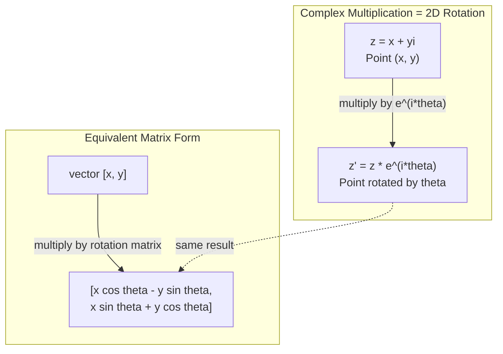
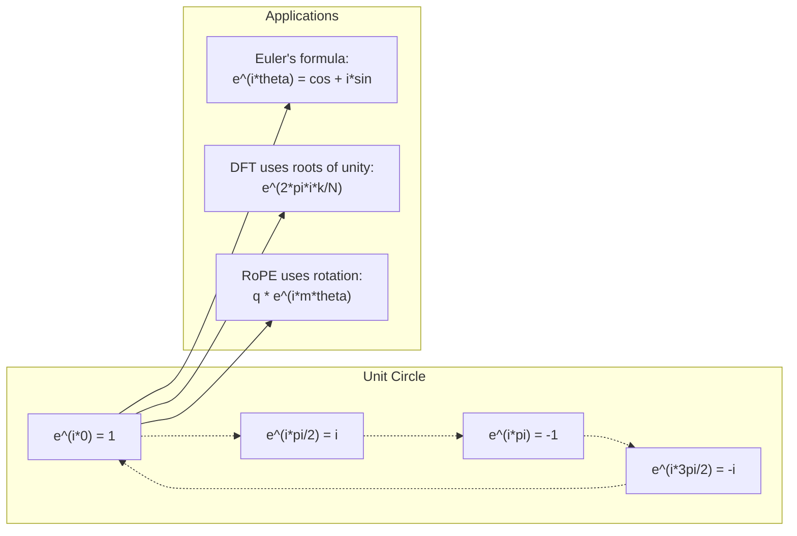

# Số phức cho AI

> Căn bậc hai của -1 không phải là ảo. Nó là chìa khóa cho vòng quay, tần số và một nửa quá trình xử lý tín hiệu.

**Loại:** Học
**Ngôn ngữ:** Python
**Kiến thức tiên quyết:** Giai đoạn 1, Bài 01-04 (đại số tuyến tính, giải tích)
**Thời lượng:** ~60 phút

## Mục tiêu học tập

- Thực hiện số học phức (cộng, nhân, chia, liên hợp) ở cả dạng hình chữ nhật và cực
- Áp dụng công thức Euler để chuyển đổi giữa hàm mũ phức và hàm lượng giác
- Triển khai Biến đổi Fourier rời rạc bằng cách sử dụng các gốc phức tạp của thống nhất
- Giải thích cách các vòng quay phức tạp làm nền tảng cho RoPE và mã hóa vị trí hình sin trong transformers

## Vấn đề

Bạn mở một bài báo về biến đổi Fourier và có `i` ở khắp mọi nơi. Bạn nhìn vào transformer mã hóa vị trí và thấy `sin` và `cos` ở các tần số khác nhau - các phần thực và tưởng tượng của hàm mũ phức tạp. Bạn đọc về điện toán lượng tử và tìm thấy mọi thứ được thể hiện trong không gian vector phức tạp.

Các số phức có vẻ trừu tượng. Một hệ thống số được xây dựng trên căn bậc hai của -1 giống như một thủ thuật toán học. Nhưng đó không phải là một mánh khóe. Nó là ngôn ngữ tự nhiên của các vòng quay và dao động. Mỗi khi một thứ gì đó quay, rung hoặc dao động, các số phức là công cụ phù hợp.

Nếu không hiểu các số phức, bạn không thể hiểu Biến đổi Fourier rời rạc. Bạn không thể hiểu FFT. Bạn không thể hiểu RoPE (Rotary Position Embedding) hoạt động như thế nào trong ngôn ngữ hiện đại models. Bạn không thể hiểu tại sao mã hóa vị trí hình sin trong giấy Transformer gốc lại sử dụng tần số mà chúng làm.

Bài học này xây dựng số học phức tạp từ đầu, kết nối nó với hình học và cho bạn biết chính xác vị trí các số phức xuất hiện trong máy học.

## Khái niệm

### Số phức là gì?

Một số phức có hai phần: một phần thực và một phần ảo.

```
z = a + bi

where:
  a is the real part
  b is the imaginary part
  i is the imaginary unit, defined by i^2 = -1
```

Đó là nó. Bạn kéo dài đường số thành một mặt phẳng. Các số thực nằm trên một trục. Các số ảo nằm ở bên kia. Mỗi số phức là một điểm trong mặt phẳng này.

### Số học phức

**Bổ sung.** Thêm các phần thực lại với nhau, thêm các phần tưởng tượng lại với nhau.

```
(a + bi) + (c + di) = (a + c) + (b + d)i

Example: (3 + 2i) + (1 + 4i) = 4 + 6i
```

**Phép nhân.** Sử dụng định luật phân phối và nhớ rằng i ^ 2 = -1.

```
(a + bi)(c + di) = ac + adi + bci + bdi^2
                 = ac + adi + bci - bd
                 = (ac - bd) + (ad + bc)i

Example: (3 + 2i)(1 + 4i) = 3 + 12i + 2i + 8i^2
                            = 3 + 14i - 8
                            = -5 + 14i
```

**Liên hợp.** Lật dấu của phần tưởng tượng.

```
conjugate of (a + bi) = a - bi
```

Tích của một số phức và liên hợp của nó luôn có thật:

```
(a + bi)(a - bi) = a^2 + b^2
```

**Phép chia.** Nhân tử số và mẫu số với liên hợp của mẫu số.

```
(a + bi) / (c + di) = (a + bi)(c - di) / (c^2 + d^2)
```

Điều này loại bỏ phần ảo khỏi mẫu số, cung cấp cho bạn một số phức sạch.

### Mặt phẳng phức tạp

Mặt phẳng phức ánh xạ mọi số phức đến một điểm 2D. Trục ngang là trục thực, trục dọc là trục ảo.

```
z = 3 + 2i  corresponds to the point (3, 2)
z = -1 + 0i corresponds to the point (-1, 0) on the real axis
z = 0 + 4i  corresponds to the point (0, 4) on the imaginary axis
```

Một số phức đồng thời là một điểm và một vector từ gốc. Cách giải thích kép này là điều làm cho các số phức hữu ích cho hình học.

### Dạng cực

Bất kỳ điểm nào trong mặt phẳng đều có thể được mô tả bằng khoảng cách của nó từ điểm gốc và góc của nó từ trục thực dương.

```
z = r * (cos(theta) + i*sin(theta))

where:
  r = |z| = sqrt(a^2 + b^2)     (magnitude, or modulus)
  theta = atan2(b, a)             (phase, or argument)
```

Dạng hình chữ nhật (a + bi) rất tốt để cộng. Dạng cực (r, theta) rất tốt cho phép nhân.

**Nhân ở dạng cực.** Nhân độ lớn, thêm các góc.

```
z1 = r1 * e^(i*theta1)
z2 = r2 * e^(i*theta2)

z1 * z2 = (r1 * r2) * e^(i*(theta1 + theta2))
```

Đây là lý do tại sao các số phức là hoàn hảo cho các vòng quay. Nhân với một số phức với cấp sao 1 là một vòng quay thuần túy.

### Công thức Euler

Cầu nối giữa hàm mũ phức và lượng giác:

```
e^(i*theta) = cos(theta) + i*sin(theta)
```

Đây là công thức quan trọng nhất trong bài học này. Khi theta = pi:

```
e^(i*pi) = cos(pi) + i*sin(pi) = -1 + 0i = -1

Therefore: e^(i*pi) + 1 = 0
```

Năm hằng số cơ bản (e, i, pi, 1, 0) được liên kết trong một phương trình.

### Tại sao công thức Euler lại quan trọng đối với ML

Công thức Euler nói rằng `e^(i*theta)` traces vòng tròn đơn vị là theta thay đổi. Tại theta = 0, bạn đang ở (1, 0). Tại theta = pi/2, bạn đang ở (0, 1). Tại theta = pi, bạn đang ở (-1, 0). Tại theta = 3 * pi/2, bạn đang ở (0, -1). Một vòng quay đầy đủ là theta = 2 * pi.

Điều này có nghĩa là hàm mũ phức LÀ vòng quay. Và vòng quay ở khắp mọi nơi trong quá trình xử lý tín hiệu và ML.

### Kết nối với vòng quay 2D

Nhân số phức (x + yi) với e^(i*theta) sẽ quay điểm (x, y) theo góc theta xung quanh điểm gốc.

```
Rotation via complex multiplication:
  (x + yi) * (cos(theta) + i*sin(theta))
  = (x*cos(theta) - y*sin(theta)) + (x*sin(theta) + y*cos(theta))i

Rotation via matrix multiplication:
  [cos(theta)  -sin(theta)] [x]   [x*cos(theta) - y*sin(theta)]
  [sin(theta)   cos(theta)] [y] = [x*sin(theta) + y*cos(theta)]
```

Chúng tạo ra kết quả giống hệt nhau. Phép nhân phức là xoay 2D. Ma trận xoay chỉ là phép nhân phức được viết bằng ký hiệu ma trận.



### Phasor và tín hiệu quay

Một hàm mũ phức e^(i*omega*t) là một điểm quay quanh vòng tròn đơn vị ở tần số góc omega. Khi t tăng, điểm traces vòng tròn.

Phần thực sự của điểm quay này là cos (omega * t). Phần tưởng tượng là tội lỗi (omega * t). Tín hiệu hình sin là bóng của một số phức quay.

```
e^(i*omega*t) = cos(omega*t) + i*sin(omega*t)

Real part:      cos(omega*t)    -- a cosine wave
Imaginary part: sin(omega*t)    -- a sine wave
```

Đây là biểu diễn phasor. Thay vì theo dõi sóng hình sin lắc lư, bạn theo dõi một mũi tên quay trơn tru. Dịch pha trở thành độ lệch góc. Thay đổi biên độ trở thành thay đổi độ lớn. Việc bổ sung tín hiệu trở thành vector bổ sung.

### Gốc rễ của sự đoàn kết

Căn thứ N của thống nhất là N điểm cách đều nhau trên vòng tròn đơn vị:

```
w_k = e^(2*pi*i*k/N)    for k = 0, 1, 2, ..., N-1
```

Đối với N = 4, các gốc là: 1, i, -1, -i (bốn điểm la bàn).
Đối với N = 8, bạn nhận được bốn điểm la bàn cộng với bốn đường chéo.

Gốc rễ của sự thống nhất là nền tảng của Biến đổi Fourier rời rạc. DFT phân hủy tín hiệu thành các thành phần ở các tần số cách đều nhau N này.

### Kết nối với DFT

Biến đổi Fourier rời rạc của tín hiệu x[0], x[1], ..., x[N-1] là:

```
X[k] = sum_{n=0}^{N-1} x[n] * e^(-2*pi*i*k*n/N)
```

Mỗi X [k] đo mức độ tương quan của tín hiệu với căn thứ k của sự thống nhất - một hình sin phức ở tần số k. DFT ngắt tín hiệu thành N pha quay và cho bạn biết biên độ và pha của từng pha.

### Tại sao tôi không tưởng tượng

Từ "tưởng tượng" là một tai nạn lịch sử. Descartes đã sử dụng nó một cách coi thường. Nhưng tôi không tưởng tượng hơn những con số âm khi mọi người lần đầu tiên từ chối chúng. Số âm trả lời "bạn trừ 5 từ 3 để lấy gì?" Đơn vị tưởng tượng trả lời "bạn bình phương là gì để được -1?"

Hữu ích hơn: i là một toán tử xoay 90 độ. Nhân một số thực với i một lần, bạn xoay 90 độ theo trục ảo. Nhân với i một lần nữa (i^2), bạn xoay thêm 90 độ nữa - bây giờ bạn đang chỉ theo hướng thực âm. Đó là lý do tại sao i^2 = -1. Nó không bí ẩn. Đó là một nửa lượt được xây dựng từ hai phần tư lượt.

Đây là lý do tại sao các số phức có ở khắp mọi nơi trong kỹ thuật. Bất cứ thứ gì quay - sóng điện từ, trạng thái lượng tử, dao động tín hiệu, mã hóa vị trí - được mô tả tự nhiên bằng các số phức.

### Hàm mũ phức và hàm lượng giác

Trước công thức của Euler, các kỹ sư đã viết tín hiệu là A*cos(omega*t + phi) - biên độ A, tần số omega, pha phi. Điều này hoạt động nhưng làm cho số học trở nên đau đớn. Thêm hai cosin với các pha khác nhau đòi hỏi nhận dạng lượng giác.

Với hàm mũ phức, tín hiệu tương tự là A*e^(i*(omega*t + phi)). Thêm hai tín hiệu chỉ là cộng hai số phức. Nhân (điều chế) chỉ là nhân độ lớn và thêm góc. Sự dịch pha trở thành bổ sung góc. Sự dịch chuyển tần số trở thành phép nhân của pha.

Toàn bộ lĩnh vực xử lý tín hiệu chuyển sang ký hiệu hàm mũ phức tạp vì toán học sạch hơn. "Tín hiệu thực" luôn chỉ là phần thực của biểu diễn phức tạp. Phần tưởng tượng được thực hiện như sổ sách, làm cho tất cả các đại số hoạt động một cách tự nhiên.

### Kết nối với transformers

**Mã hóa vị trí hình sin** (giấy Transformer gốc):

```
PE(pos, 2i) = sin(pos / 10000^(2i/d))
PE(pos, 2i+1) = cos(pos / 10000^(2i/d))
```

Các cặp sin và cos là phần thực và phần ảo của hàm mũ phức ở các tần số khác nhau. Mỗi tần số cung cấp một "độ phân giải" khác nhau cho vị trí mã hóa. Tần số thấp thay đổi chậm (vị trí thô). Tần số cao thay đổi nhanh chóng (vị trí tốt). Chúng cùng nhau cung cấp cho mỗi vị trí một dấu vân tay tần số duy nhất.

**RoPE (Vị trí quay Embedding)** đưa điều này đi xa hơn. Nó nhân rõ ràng truy vấn và vectors khóa bằng ma trận xoay phức tạp. Vị trí tương đối giữa hai tokens trở thành một góc quay. Attention được tính toán bằng cách sử dụng các vectors quay này, làm cho model nhạy cảm với vị trí tương đối thông qua phép nhân phức tạp.

| hoạt động | Dạng đại số | Ý nghĩa hình học |
|-----------|---------------|-------------------|
| Bổ sung | (A+C) + (B+D)i | Vector bổ sung trong máy bay |
| Phép nhân | (AC-BD) + (AD+BC)i | Xoay và chia tỷ lệ |
| Liên hợp | a - bi | Phản ánh trên trục thực |
| Độ lớn | sqrt(a^2 + b^2) | Khoảng cách từ điểm xuất phát |
| Giai đoạn | Atan2(b, a) | Góc từ trục thực dương |
| Bộ phận | Nhân bằng liên hợp | Xoay ngược và thay đổi tỷ lệ |
| Quyền lực | r^n * e^(i*n*theta) | Xoay n lần, tỷ lệ theo r^n |



```figure
roots-of-unity
```

## Tự xây dựng

### Bước 1: class phức tạp

Xây dựng một class số phức hỗ trợ số học, độ lớn, pha và chuyển đổi giữa các dạng hình chữ nhật và cực.

```python
import math

class Complex:
    def __init__(self, real, imag=0.0):
        self.real = real
        self.imag = imag

    def __add__(self, other):
        return Complex(self.real + other.real, self.imag + other.imag)

    def __mul__(self, other):
        r = self.real * other.real - self.imag * other.imag
        i = self.real * other.imag + self.imag * other.real
        return Complex(r, i)

    def __truediv__(self, other):
        denom = other.real ** 2 + other.imag ** 2
        r = (self.real * other.real + self.imag * other.imag) / denom
        i = (self.imag * other.real - self.real * other.imag) / denom
        return Complex(r, i)

    def magnitude(self):
        return math.sqrt(self.real ** 2 + self.imag ** 2)

    def phase(self):
        return math.atan2(self.imag, self.real)

    def conjugate(self):
        return Complex(self.real, -self.imag)
```

### Bước 2: Chuyển đổi cực và công thức Euler

```python
def to_polar(z):
    return z.magnitude(), z.phase()

def from_polar(r, theta):
    return Complex(r * math.cos(theta), r * math.sin(theta))

def euler(theta):
    return Complex(math.cos(theta), math.sin(theta))
```

Xác minh: `euler(theta).magnitude()` phải luôn là 1.0. `euler(0)` nên đưa ra (1, 0). `euler(pi)` nên đưa ra (-1, 0).

### Bước 3: Xoay

Xoay một điểm (x, y) bằng theta góc là một phép nhân phức tạp:

```python
point = Complex(3, 4)
rotated = point * euler(math.pi / 4)
```

Độ lớn vẫn giữ nguyên. Chỉ có góc thay đổi.

### Bước 4: DFT từ số học phức

```python
def dft(signal):
    N = len(signal)
    result = []
    for k in range(N):
        total = Complex(0, 0)
        for n in range(N):
            angle = -2 * math.pi * k * n / N
            total = total + Complex(signal[n], 0) * euler(angle)
        result.append(total)
    return result
```

Đây là O (N ^ 2) DFT. Mỗi đầu ra X [k] là tổng của các mẫu tín hiệu nhân với các gốc của thống nhất.

### Bước 5: DFT nghịch đảo

DFT nghịch đảo tái tạo tín hiệu ban đầu từ quang phổ của nó. Những thay đổi duy nhất so với DFT chuyển tiếp: lật dấu trong số mũ và chia cho N.

```python
def idft(spectrum):
    N = len(spectrum)
    result = []
    for n in range(N):
        total = Complex(0, 0)
        for k in range(N):
            angle = 2 * math.pi * k * n / N
            total = total + spectrum[k] * euler(angle)
        result.append(Complex(total.real / N, total.imag / N))
    return result
```

Điều này mang lại cho bạn sự tái tạo hoàn hảo. Áp dụng DFT, sau đó IDFT và bạn nhận lại tín hiệu ban đầu cho máy precision. Không có thông tin nào bị mất.

### Bước 6: Gốc rễ của sự thống nhất

```python
def roots_of_unity(N):
    return [euler(2 * math.pi * k / N) for k in range(N)]
```

Xác minh hai thuộc tính:
- Mỗi gốc có độ lớn chính xác là 1.
- Tổng của tất cả các căn N bằng không (chúng triệt tiêu theo đối xứng).

Những thuộc tính này là những gì làm cho DFT có thể đảo ngược. Các gốc của sự thống nhất tạo thành một cơ sở trực giao cho miền tần số.

## Ứng dụng

Python có hỗ trợ số phức tích hợp. `j` theo nghĩa đen đại diện cho đơn vị ảo.

```python
z = 3 + 2j
w = 1 + 4j

print(z + w)
print(z * w)
print(abs(z))

import cmath
print(cmath.phase(z))
print(cmath.exp(1j * cmath.pi))
```

Đối với mảng, numpy xử lý các số phức nguyên bản:

```python
import numpy as np

z = np.array([1+2j, 3+4j, 5+6j])
print(np.abs(z))
print(np.angle(z))
print(np.conj(z))
print(np.real(z))
print(np.imag(z))

signal = np.sin(2 * np.pi * 5 * np.linspace(0, 1, 128))
spectrum = np.fft.fft(signal)
freqs = np.fft.fftfreq(128, d=1/128)
```

## Sản phẩm bàn giao

Chạy `code/complex_numbers.py` để tạo `outputs/skill-complex-arithmetic.md`.

## Bài tập

1. **Số học phức bằng tay.** Tính toán (2 + 3i) * (4 - i) và xác minh bằng mã. Sau đó tính toán (5 + 2i) / (1 - 3i). Vẽ cả hai kết quả trên mặt phẳng phức và kiểm tra xem phép nhân có xoay và chia tỷ lệ số đầu tiên không.

2. **Trình tự xoay.** Bắt đầu với điểm (1, 0). Nhân với e^(i*pi/6) mười hai lần. Xác minh rằng bạn quay trở lại (1, 0) sau 12 lần nhân. In tọa độ ở mỗi bước và xác nhận chúng trace 12-gon thông thường.

3. **DFT của một tín hiệu đã biết.** Tạo tín hiệu là tổng của sin (2 * pi * 3 * t) và 0,5 * sin (2 * pi * 7 * t) được lấy mẫu ở 32 điểm. Chạy DFT của bạn. Xác minh rằng phổ cường độ có đỉnh ở tần số 3 và 7, với đỉnh ở 7 bằng một nửa chiều cao của đỉnh ở tần số 3.

4. **Gốc rễ của sự hình dung thống nhất.** Tính toán gốc thứ 8 của sự thống nhất. Xác minh rằng chúng có tổng bằng không. Xác minh rằng nhân bất kỳ gốc nào với gốc primitive e^(2*pi*i/8) cho gốc tiếp theo.

5. **Tương đương ma trận xoay.** Đối với 10 góc ngẫu nhiên và 10 điểm ngẫu nhiên, hãy xác minh rằng phép nhân phức cho kết quả tương tự như phép nhân vector ma trận với ma trận quay 2x2. In chênh lệch số tối đa.

## Thuật ngữ chính

| Thuật ngữ | Nó có nghĩa là gì |
|------|---------------|
| Số phức | Một số a + bi trong đó a là phần thực, b là phần ảo và i^2 = -1 |
| Đơn vị tưởng tượng | Số i, được xác định bởi i^2 = -1. Không phải tưởng tượng theo nghĩa triết học - nó là một toán tử xoay |
| Mặt phẳng phức tạp | Mặt phẳng 2D trong đó trục x là thực và trục y là ảo. Còn được gọi là máy bay Argand |
| Độ lớn (mô đun) | Khoảng cách từ điểm gốc: sqrt(a^2 + b^2). Viết là \ | z\ ||
| Giai đoạn (đối số) | Góc từ trục thực dương: atan2(b, a). Viết dưới dạng arg(z) |
| Liên hợp | Hình ảnh phản chiếu ngang trục thực: liên hợp của a + bi là a - bi |
| Dạng cực | Biểu thị z dưới dạng r * e^(i*theta) thay vì a + bi. Làm cho phép nhân dễ dàng |
| Công thức Euler | e^(i*theta) = cos(theta) + i*sin(theta). Kết nối hàm mũ với lượng giác |
| Phasor | Một số phức quay e^(i*omega*t) đại diện cho tín hiệu hình sin |
| Gốc rễ của sự đoàn kết | N số phức e^(2*pi*i*k/N) cho k = 0 đến N-1. N điểm cách đều nhau trên vòng tròn đơn vị |
| ĐTM | Biến đổi Fourier rời rạc. Phân hủy tín hiệu thành các thành phần hình sin phức tạp bằng cách sử dụng root of unity |
| Dây thừng | Vị trí quay Embedding. Sử dụng phép nhân phức tạp để mã hóa vị trí tương đối trong transformer attention |

## Đọc thêm

- [Visual Introduction to Euler's Formula](https://betterexplained.com/articles/intuitive-understanding-of-eulers-formula/) - xây dựng trực giác hình học mà không cần ký hiệu nặng
- [Su et al.: RoFormer (2021)](https://arxiv.org/abs/2104.09864) - bài báo giới thiệu Vị trí quay Embedding sử dụng các vòng quay phức tạp
- [Vaswani et al.: Attention Is All You Need (2017)](https://arxiv.org/abs/1706.03762) - giấy Transformer gốc với mã hóa vị trí hình sin
- [3Blue1Brown: Euler's formula with introductory group theory](https://www.youtube.com/watch?v=mvmuCPvRoWQ) - giải thích trực quan tại sao e ^ (i * pi) = -1
- [Needham: Visual Complex Analysis](https://global.oup.com/academic/product/visual-complex-analysis-9780198534464) - cách xử lý trực quan tốt nhất các số phức, đầy cái nhìn sâu sắc về hình học
- [Strang: Introduction to Linear Algebra, Ch. 10](https://math.mit.edu/~gs/linearalgebra/) - số phức trong ngữ cảnh đại số tuyến tính và giá trị riêng
