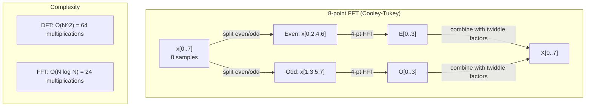
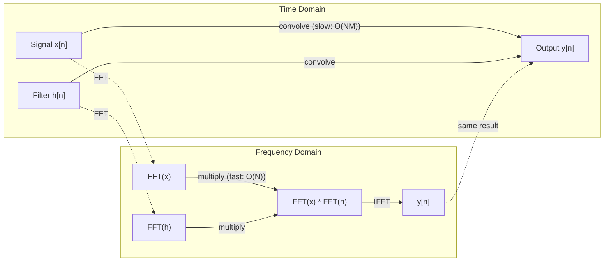

# Biến đổi Fourier

> Mỗi tín hiệu là một tổng của sóng sin. Biến đổi Fourier cho bạn biết cái nào.

**Loại:** Xây dựng
**Ngôn ngữ:** Python
**Kiến thức tiên quyết:** Giai đoạn 1, Bài 01-04, 19 (số phức)
**Thời lượng:** ~90 phút

## Mục tiêu học tập

- Triển khai DFT từ đầu và xác minh nó với O (N log N) Cooley-Tukey FFT
- Giải thích hệ số tần số: trích xuất biên độ, pha và phổ công suất từ tín hiệu
- Áp dụng định lý tích chập để thực hiện tích chập thông qua phép nhân FFT
- Kết nối phân tách tần số Fourier với mã hóa vị trí transformer và các lớp tích chập CNN

## Vấn đề

Bản ghi âm là một chuỗi các phép đo áp suất theo thời gian. Giá cổ phiếu là một chuỗi các giá trị trong nhiều ngày. Hình ảnh là một lưới cường độ pixel trên không gian. Tất cả những dữ liệu này đều là dữ liệu trong miền thời gian (hoặc miền không gian). Bạn thấy các giá trị thay đổi theo một số chỉ mục.

Nhưng nhiều mô hình vô hình trong miền thời gian. Tín hiệu âm thanh này là âm thanh thuần túy hay hợp âm? Giá cổ phiếu này có chu kỳ hàng tuần không? Hình ảnh này có kết cấu lặp lại không? Những câu hỏi này là về nội dung tần số và miền thời gian ẩn nó.

Biến đổi Fourier chuyển đổi dữ liệu từ miền thời gian sang miền tần số. Nó nhận một tín hiệu và phân hủy nó thành sóng sin có tần số khác nhau. Mỗi sóng sin có một biên độ (mức độ mạnh của nó) và một pha (nơi nó bắt đầu). Biến đổi Fourier cho bạn biết cả hai.

Điều này quan trọng đối với ML vì tư duy miền tần số xuất hiện ở khắp mọi nơi. Mạng nơ-ron tích chập thực hiện tích chập, là phép nhân trong miền tần số. Transformer mã hóa vị trí sử dụng phân tách tần số để biểu thị vị trí. models âm thanh (nhận dạng giọng nói, tạo nhạc) hoạt động trên quang phổ - biểu diễn tần số của âm thanh. Chuỗi thời gian models tìm kiếm các mô hình tuần hoàn. Hiểu được phép biến đổi Fourier cung cấp cho bạn vốn từ vựng để làm việc với tất cả những điều này.

## Khái niệm

### Định nghĩa DFT

Cho N mẫu x[0], x[1], ..., x[N-1], Biến đổi Fourier rời rạc tạo ra N hệ số tần số X[0], X[1], ..., X[N-1]:

```
X[k] = sum_{n=0}^{N-1} x[n] * e^(-2*pi*i*k*n/N)

for k = 0, 1, ..., N-1
```

Mỗi X [k] là một số phức. Độ lớn của nó |X[k]| cho bạn biết biên độ của tần số k. Góc pha của nó (X [k]) cho bạn biết độ lệch pha của tần số đó.

Thông tin chi tiết quan trọng: `e^(-2*pi*i*k*n/N)` là một pha quay ở tần số k. DFT tính toán mối tương quan giữa tín hiệu và mỗi N tần số cách đều nhau. Nếu tín hiệu chứa năng lượng ở tần số k, mối tương quan lớn. Nếu không, nó gần bằng không.

### Ý nghĩa của mỗi hệ số

**X[0]: thành phần DC.** Đây là tổng của tất cả các mẫu -- tỷ lệ thuận với giá trị trung bình. Nó đại diện cho độ lệch hằng số (tần số không) của tín hiệu.

```
X[0] = sum_{n=0}^{N-1} x[n] * e^0 = sum of all samples
```

**X [k] cho 1 < = k < = N/2: tần số dương.** X [k] đại diện cho tần số k chu kỳ trên N mẫu. K cao hơn có nghĩa là tần số cao hơn (dao động nhanh hơn).

**X[N/2]: tần số Nyquist.** Tần số cao nhất bạn có thể biểu diễn với N samples. Trên mức này, bạn có răng cưa - tần số cao giả mạo tần số thấp.

**X[k] cho N/2 < k < N: tần số âm.** Đối với tín hiệu có giá trị thực, X[N-k] = conj(X[k]). Các tần số âm là hình ảnh phản chiếu của tần số dương. Đây là lý do tại sao thông tin hữu ích nằm trong hệ số N/2 + 1 đầu tiên.

### DFT nghịch đảo

DFT nghịch đảo tái tạo tín hiệu ban đầu từ các hệ số tần số của nó:

```
x[n] = (1/N) * sum_{k=0}^{N-1} X[k] * e^(2*pi*i*k*n/N)

for n = 0, 1, ..., N-1
```

Sự khác biệt duy nhất so với DFT chuyển tiếp: dấu trong số mũ là dương (không âm) và có hệ số chuẩn hóa 1/N.

DFT nghịch đảo là tái tạo hoàn hảo. Không có thông tin nào bị mất. Bạn có thể đi từ miền thời gian sang miền tần số và ngược lại mà không gặp bất kỳ lỗi nào. DFT là một sự thay đổi cơ sở - nó thể hiện lại cùng một thông tin trong một hệ tọa độ khác.

### FFT: làm cho nó nhanh chóng

DFT như được định nghĩa ở trên là O (N ^ 2): đối với mỗi N hệ số đầu ra, bạn tính tổng trên N mẫu đầu vào. Đối với N = 1 triệu, đó là 10 ^ 12 phép toán.

Biến đổi Fourier nhanh (FFT) tính toán kết quả tương tự trong O (N log N). Đối với N = 1 triệu, đó là khoảng 20 triệu hoạt động thay vì một nghìn tỷ. Đây là điều làm cho phân tích tần số trở nên thực tế.

Thuật toán Cooley-Tukey (FFT phổ biến nhất) hoạt động bằng cách chia và chinh phục:

1. Chia tín hiệu thành các mẫu được lập chỉ mục chẵn và lẻ samples.
2. Tính DFT của mỗi nửa đệ quy.
3. Kết hợp hai DFT nửa kích thước bằng cách sử dụng "hệ số xoay" e^(-2*pi*i*k/N).

```
X[k] = E[k] + e^(-2*pi*i*k/N) * O[k]          for k = 0, ..., N/2 - 1
X[k + N/2] = E[k] - e^(-2*pi*i*k/N) * O[k]    for k = 0, ..., N/2 - 1

where E = DFT of even-indexed samples
      O = DFT of odd-indexed samples
```

Đối xứng có nghĩa là mỗi mức đệ quy thực hiện O (N) hoạt động và có các mức log2 (N). Tổng: O (N log N).



FFT yêu cầu độ dài tín hiệu là lũy thừa 2. Trong thực tế, tín hiệu được đệm bằng không với lũy thừa tiếp theo là 2.

### Phân tích quang phổ

**phổ công suất **là |X[k]|^2 -- cấp sao bình phương của mỗi hệ số tần số. Nó cho thấy có bao nhiêu năng lượng ở mỗi tần số.

**Phổ pha **là góc (X [k]) - độ lệch pha của mỗi tần số. Đối với hầu hết các nhiệm vụ phân tích, bạn quan tâm đến phổ công suất và bỏ qua pha.

```
Power at frequency k:  P[k] = |X[k]|^2 = X[k].real^2 + X[k].imag^2
Phase at frequency k:  phi[k] = atan2(X[k].imag, X[k].real)
```

### Độ phân giải tần số

Độ phân giải tần số của DFT phụ thuộc vào số lượng mẫu N và tốc độ sampling fs.

```
Frequency of bin k:      f_k = k * fs / N
Frequency resolution:    delta_f = fs / N
Maximum frequency:       f_max = fs / 2  (Nyquist)
```

Để giải quyết hai tần số gần nhau, bạn cần thêm mẫu. Để thu được tần số cao, bạn cần tốc độ sampling cao hơn.

### Định lý tích chập

Đây là một trong những kết quả quan trọng nhất trong xử lý tín hiệu và liên quan trực tiếp đến CNN.

**Tích chập trong miền thời gian bằng phép nhân theo điểm trong miền tần số.**

```
x * h = IFFT(FFT(x) . FFT(h))

where * is convolution and . is element-wise multiplication
```

Tại sao điều này lại quan trọng:

- Tích chập trực tiếp của hai tín hiệu có độ dài N và M thực hiện các phép toán O (N * M).
- Tích chập dựa trên FFT lấy O (N log N): biến đổi cả hai, nhân, biến đổi trở lại.
- Đối với các hạt nhân lớn, tích chập FFT nhanh hơn đáng kể.
- Đây chính xác là những gì xảy ra trong các lớp tích chập với các trường tiếp nhận lớn.

Lưu ý: DFT tính toán tích chập tròn (tín hiệu quấn quanh). Đối với tích chập tuyến tính (không bao quanh), zero-pad cả hai tín hiệu đến độ dài N + M - 1 trước khi tính toán.



### Cửa sổ

DFT giả định tín hiệu là tuần hoàn - nó coi N mẫu như một chu kỳ của tín hiệu lặp lại vô hạn. Nếu tín hiệu không bắt đầu và kết thúc ở cùng một giá trị, điều này sẽ tạo ra sự gián đoạn ở ranh giới, hiển thị dưới dạng nội dung tần số cao giả. Đây được gọi là rò rỉ quang phổ.

Cửa sổ làm giảm rò rỉ bằng cách giảm tín hiệu về không ở cả hai đầu trước khi tính toán DFT.

Các windows thường gặp:

| Cửa sổ | Hình dạng | Chiều rộng thùy chính | Mức thùy bên | Trường hợp sử dụng |
|--------|-------|----------------|-----------------|----------|
| Hình chữ nhật | Phẳng (không có cửa sổ) | Hẹp nhất | Cao nhất (-13 dB) | Khi tín hiệu chính xác định kỳ trong N mẫu |
| Hann | Cosin tăng | Trung bình | Thấp (-31 dB) | Phân tích quang phổ mục đích chung |
| Hamming | Cosin biến đổi | Trung bình | Thấp hơn (-42 dB) | Xử lý âm thanh, phân tích giọng nói |
| Người đen | Bộ ba cosin | Rộng | Rất thấp (-58 dB) | Khi ức chế thùy bên là rất quan trọng |

```
Hann window:    w[n] = 0.5 * (1 - cos(2*pi*n / (N-1)))
Hamming window: w[n] = 0.54 - 0.46 * cos(2*pi*n / (N-1))
```

Áp dụng cửa sổ bằng cách nhân nó theo phần tử với tín hiệu trước DFT: `X = DFT(x * w)`.

### Thuộc tính DFT

| Bất động sản | Miền thời gian | Miền tần số |
|----------|-------------|-----------------|
| Tuyến tính | a*x + b*y | a*X + b*Y |
| Dịch chuyển thời gian | x[n - k] | X[f] * e^(-2*pi*i*f*k/N) |
| Dịch chuyển tần số | x[n] * e^(2*pi*i*f0*n/N) | X[f - f0] |
| Tích chập | x * h | X * H (theo chiều điểm) |
| Phép nhân | x * h (theo điểm) | X * H (tích chập tròn, chia tỷ lệ theo 1/N) |
| Định lý Parseval | tổng \ | x[n]\ | ^2 | (1/N) * tổng \ | X[k]\ | ^2 |
| Đối xứng liên hợp (đầu vào thực) | x[n] thực | X[k] = conj(X[N-k]) |

Định lý Parseval nói rằng tổng năng lượng là như nhau trong cả hai miền. Năng lượng được bảo toàn thông qua sự biến đổi.

### Kết nối với mã hóa vị trí

Transformer ban đầu sử dụng mã hóa vị trí hình sin:

```
PE(pos, 2i)   = sin(pos / 10000^(2i/d_model))
PE(pos, 2i+1) = cos(pos / 10000^(2i/d_model))
```

Mỗi cặp chiều (2i, 2i + 1) dao động ở một tần số khác nhau. Các tần số được đặt cách nhau theo hình học từ cao (kích thước 0,1) đến thấp (kích thước cuối cùng). Điều này cung cấp cho mỗi vị trí một mô hình duy nhất trên tất cả các dải tần số - tương tự như cách hệ số Fourier xác định duy nhất một tín hiệu.

Các thuộc tính chính mà điều này cung cấp:

- **Tính độc đáo:** Không có hai vị trí nào có cùng mã hóa.
- **Giá trị giới hạn:** sin và cos luôn nằm trong [-1, 1].
- **Vị trí tương đối: **Mã hóa của vị trí p + k có thể được biểu thị dưới dạng hàm tuyến tính của mã hóa tại vị trí p. Người model có thể học cách tham gia vào các vị trí tương đối.

### Kết nối với CNN

Lớp tích chập áp dụng bộ lọc đã học (hạt nhân) cho đầu vào bằng cách trượt nó qua tín hiệu hoặc hình ảnh. Về mặt toán học, đây là phép toán tích chập.

Theo định lý tích chập, điều này tương đương với:
1. FFT đầu vào
2. FFT hạt nhân
3. Nhân trong miền tần số
4. IFFT kết quả

Triển khai CNN tiêu chuẩn sử dụng tích chập trực tiếp (nhanh hơn đối với hạt nhân 3x3 nhỏ). Nhưng đối với các hạt nhân lớn hoặc tích chập toàn cầu, các phương pháp tiếp cận dựa trên FFT nhanh hơn đáng kể. Một số kiến trúc (như FNet) thay thế hoàn toàn attention bằng FFT, đạt được accuracy cạnh tranh với O (N log N) thay vì độ phức tạp O (N ^ 2).

### Quang phổ và biến đổi Fourier thời gian ngắn

Một FFT duy nhất cung cấp cho bạn nội dung tần số của toàn bộ tín hiệu, nhưng không cho bạn biết khi nào các tần số đó xảy ra. Một tiếng kêu (một tín hiệu có tần số tăng theo thời gian) và một hợp âm (tất cả các tần số hiện diện đồng thời) có thể có cùng phổ độ lớn.

Biến đổi Fourier thời gian ngắn (STFT) giải quyết vấn đề này bằng cách tính toán FFT trên windows chồng lên nhau của tín hiệu. Kết quả là một quang phổ: một biểu diễn 2D với thời gian trên một trục và tần số trên trục kia. Cường độ tại mỗi điểm cho thấy năng lượng ở tần số đó tại thời điểm đó.

```
STFT procedure:
1. Choose a window size (e.g., 1024 samples)
2. Choose a hop size (e.g., 256 samples -- 75% overlap)
3. For each window position:
   a. Extract the windowed segment
   b. Apply a Hann/Hamming window
   c. Compute FFT
   d. Store the magnitude spectrum as one column of the spectrogram
```

Quang phổ là biểu diễn đầu vào tiêu chuẩn cho âm thanh ML models. Nhận dạng giọng nói models (Whisper, DeepSpeech) hoạt động trên mel-quang phổ - quang phổ với tần số được ánh xạ đến thang mel, phù hợp hơn với nhận thức cao độ của con người.

### Răng cưa

Nếu một tín hiệu chứa tần số trên fs/2 (tần số Nyquist), sampling ở tốc độ fs sẽ tạo ra các bản sao bí danh. Tín hiệu 90 Hz được lấy mẫu ở 100 Hz trông giống với tín hiệu 10 Hz. Không có cách nào để phân biệt chúng chỉ với các mẫu.

```
Example:
  True signal: 90 Hz sine wave
  Sampling rate: 100 Hz
  Apparent frequency: 100 - 90 = 10 Hz

  The samples from the 90 Hz signal at 100 Hz sampling rate
  are identical to the samples from a 10 Hz signal.
  No amount of math can recover the original 90 Hz.
```

Đây là lý do tại sao bộ chuyển đổi tương tự sang kỹ thuật số bao gồm các bộ lọc khử răng cưa giúp loại bỏ các tần số trên Nyquist trước sampling. Trong ML, răng cưa xuất hiện khi lấy mẫu xuống feature bản đồ mà không có bộ lọc thông thấp thích hợp - một số kiến trúc giải quyết vấn đề này bằng các lớp gộp khử răng cưa.

### Zero-padding không làm tăng độ phân giải

Một quan niệm sai lầm phổ biến: không đệm tín hiệu trước FFT cải thiện độ phân giải tần số. Nó không. Nội suy không đệm giữa các thùng tần số hiện có, mang lại cho bạn quang phổ mượt mà hơn. Nhưng nó không thể tiết lộ chi tiết tần số không có trong các mẫu ban đầu.

Độ phân giải tần số thực chỉ phụ thuộc vào thời gian quan sát T = N / fs. Để giải quyết hai tần số cách nhau bằng delta_f, bạn cần ít nhất T = 1 / delta_f giây dữ liệu. Không có khoảng đệm nào làm thay đổi giới hạn cơ bản này.

```figure
fourier-synthesis
```

## Tự xây dựng

### Bước 1: DFT từ đầu

O (N ^ 2) DFT theo sau trực tiếp từ định nghĩa.

```python
import math

class Complex:
    ...

def dft(x):
    N = len(x)
    result = []
    for k in range(N):
        total = Complex(0, 0)
        for n in range(N):
            angle = -2 * math.pi * k * n / N
            w = Complex(math.cos(angle), math.sin(angle))
            xn = x[n] if isinstance(x[n], Complex) else Complex(x[n])
            total = total + xn * w
        result.append(total)
    return result
```

### Bước 2: DFT nghịch đảo

Cùng cấu trúc, số mũ dương, chia cho N.

```python
def idft(X):
    N = len(X)
    result = []
    for n in range(N):
        total = Complex(0, 0)
        for k in range(N):
            angle = 2 * math.pi * k * n / N
            w = Complex(math.cos(angle), math.sin(angle))
            total = total + X[k] * w
        result.append(Complex(total.real / N, total.imag / N))
    return result
```

### Bước 3: FFT (Cooley-Tukey)

FFT đệ quy yêu cầu độ dài lũy thừa 2. Chia thành chẵn và lẻ, đệ quy, kết hợp với các yếu tố xoay.

```python
def fft(x):
    N = len(x)
    if N <= 1:
        return [x[0] if isinstance(x[0], Complex) else Complex(x[0])]
    if N % 2 != 0:
        return dft(x)

    even = fft([x[i] for i in range(0, N, 2)])
    odd = fft([x[i] for i in range(1, N, 2)])

    result = [Complex(0)] * N
    for k in range(N // 2):
        angle = -2 * math.pi * k / N
        twiddle = Complex(math.cos(angle), math.sin(angle))
        t = twiddle * odd[k]
        result[k] = even[k] + t
        result[k + N // 2] = even[k] - t
    return result
```

### Bước 4: Trình trợ giúp phân tích quang phổ

```python
def power_spectrum(X):
    return [xk.real ** 2 + xk.imag ** 2 for xk in X]

def convolve_fft(x, h):
    N = len(x) + len(h) - 1
    padded_N = 1
    while padded_N < N:
        padded_N *= 2

    x_padded = x + [0.0] * (padded_N - len(x))
    h_padded = h + [0.0] * (padded_N - len(h))

    X = fft(x_padded)
    H = fft(h_padded)

    Y = [xk * hk for xk, hk in zip(X, H)]

    y = idft(Y)
    return [y[n].real for n in range(N)]
```

## Ứng dụng

Đối với công việc thực tế, hãy sử dụng FFT của numpy được hỗ trợ bởi các thư viện C được tối ưu hóa cao.

```python
import numpy as np

signal = np.sin(2 * np.pi * 5 * np.arange(256) / 256)
spectrum = np.fft.fft(signal)
freqs = np.fft.fftfreq(256, d=1/256)

power = np.abs(spectrum) ** 2

positive_freqs = freqs[:len(freqs)//2]
positive_power = power[:len(power)//2]
```

Đối với cửa sổ và phân tích quang phổ nâng cao hơn:

```python
from scipy.signal import windows, stft

window = windows.hann(256)
windowed = signal * window
spectrum = np.fft.fft(windowed)
```

Đối với tích chập:

```python
from scipy.signal import fftconvolve

result = fftconvolve(signal, kernel, mode='full')
```

Đối với quang phổ:

```python
from scipy.signal import stft

frequencies, times, Zxx = stft(signal, fs=sample_rate, nperseg=256)
spectrogram = np.abs(Zxx) ** 2
```

Ma trận quang phổ có hình dạng (n_frequencies, n_time_frames). Mỗi cột là phổ công suất tại một cửa sổ thời gian. Đây là những gì âm thanh ML models tiêu thụ làm đầu vào.

## Sản phẩm bàn giao

Chạy `code/fourier.py` để tạo `outputs/prompt-spectral-analyzer.md`.

## Bài tập

1. **Nhận dạng âm thanh thuần túy.** Tạo tín hiệu với một sóng sin duy nhất ở tần số không xác định (từ 1 đến 50 Hz), lấy mẫu ở 128 Hz trong 1 giây. Sử dụng DFT của bạn để xác định tần số. Xác minh câu trả lời khớp. Bây giờ thêm nhiễu Gaussian với độ lệch chuẩn 0.5 và lặp lại. Nhiễu ảnh hưởng đến quang phổ như thế nào?

2. **Xác minh FFT so với DFT.** Tạo tín hiệu ngẫu nhiên có độ dài 64. Tính cả DFT (O(N^2)) và FFT. Xác minh rằng tất cả các hệ số khớp với trong vòng 1e-10. Thời gian cả hai đều hoạt động trên các tín hiệu có độ dài 256, 512, 1024 và 2048. Vẽ tỷ lệ thời gian DFT với thời gian FFT.

3. **Chứng minh định lý tích chập bằng ví dụ.** Tạo tín hiệu x = [1, 2, 3, 4, 0, 0, 0, 0] và bộ lọc h = [1, 1, 1, 0, 0, 0, 0, 0]. Tính toán tích chập tròn của chúng trực tiếp (vòng lặp lồng nhau). Sau đó tính toán nó thông qua FFT (transform, multiply, inverse transform). Xác minh kết quả trùng khớp. Bây giờ thực hiện tích chập tuyến tính bằng cách đệm không một cách thích hợp.

4. **Hiệu ứng cửa sổ.** Tạo tín hiệu là tổng của hai sóng sin ở 10 Hz và 12 Hz (rất gần). Lấy mẫu ở 128 Hz trong 1 giây. Tính toán phổ công suất không có cửa sổ, cửa sổ Hann và cửa sổ Hamming. Cửa sổ nào giúp phân biệt hai đỉnh dễ dàng nhất? Tại sao?

5. **Phân tích mã hóa vị trí.** Tạo mã hóa vị trí hình sin cho d_model = 128 và max_pos = 512. Đối với mỗi cặp vị trí (p1, p2), hãy tính tích chấm của mã hóa của chúng. Cho thấy rằng tích chấm chỉ phụ thuộc vào |p1 - p2|, không phụ thuộc vào các vị trí tuyệt đối. Điều gì xảy ra với sản phẩm chấm khi khoảng cách tăng lên?

## Thuật ngữ chính

| Thuật ngữ | Nó có nghĩa là gì |
|------|---------------|
| DFT (Biến đổi Fourier rời rạc) | Chuyển đổi N mẫu miền thời gian thành N hệ số miền tần số. Mỗi hệ số là mối tương quan với một hình sin phức ở tần số đó |
| FFT (Biến đổi Fourier nhanh) | Một thuật toán O (N log N) để tính toán DFT. Thuật toán Cooley-Tukey chia even/odd chỉ số đệ quy |
| DFT nghịch đảo | Tái tạo tín hiệu miền thời gian từ các hệ số tần số. Công thức tương tự như DFT với dấu số mũ lật và tỷ lệ 1/N |
| Thùng tần số | Mỗi chỉ số k trong đầu ra DFT đại diện cho tần số k * fs/N Hz. "Thùng" là khe tần số rời rạc |
| Thành phần DC | X [0], hệ số tần số không. Tỷ lệ thuận với giá trị trung bình của tín hiệu |
| Tần số Nyquist | fs/2, tần số tối đa có thể biểu diễn ở tốc độ sampling FS. Tần số phía trên bí danh này |
| Phổ công suất | \ | X[k]\ | ^2, cấp sao bình phương của mỗi hệ số tần số. Hiển thị sự phân bố năng lượng trên các tần số |
| Phổ pha | góc (X [k]), độ lệch pha của từng thành phần tần số. Thường bị bỏ qua trong phân tích |
| Rò rỉ quang phổ | Nội dung tần số giả do coi tín hiệu không định kỳ là định kỳ. Giảm bằng cửa sổ |
| Chức năng cửa sổ | Một chức năng giảm dần (Hann, Hamming, Blackman) được áp dụng trước DFT để giảm rò rỉ quang phổ |
| Hệ số lắc lư | Hàm mũ phức e^(-2*pi*i*k/N) được sử dụng để kết hợp các DFT phụ trong tính toán bướm FFT |
| Định lý tích chập | Tích chập trong miền thời gian bằng phép nhân theo điểm trong miền tần số. Cơ bản để xử lý tín hiệu và CNN |
| Tích chập tròn | Tích chập nơi tín hiệu quấn quanh. Đây là những gì DFT tính toán một cách tự nhiên |
| Tích chập tuyến tính | Tích chập tiêu chuẩn mà không bao quanh. Đạt được bằng cách zero-padding trước DFT |
| Định lý Parseval | Tổng năng lượng được bảo toàn thông qua biến đổi Fourier. tổng \ | x[n]\ | ^2 = (1/N) tổng \ | X[k]\ | ^2 |
| Răng cưa | Khi các tần số trên Nyquist xuất hiện dưới dạng tần số thấp hơn do không đủ tốc độ sampling |

## Đọc thêm

- [Cooley & Tukey: An Algorithm for the Machine Calculation of Complex Fourier Series (1965)](https://www.ams.org/journals/mcom/1965-19-090/S0025-5718-1965-0178586-1/) - bài báo FFT ban đầu đã thay đổi máy tính
- [3Blue1Brown: But what is the Fourier Transform?](https://www.youtube.com/watch?v=spUNpyF58BY) - giới thiệu trực quan tốt nhất về biến đổi Fourier
- [Lee-Thorp et al.: FNet: Mixing Tokens with Fourier Transforms (2021)](https://arxiv.org/abs/2105.03824) - thay thế self-attention bằng FFT trong transformers
- [Smith: The Scientist and Engineer's Guide to Digital Signal Processing](http://www.dspguide.com/) - sách giáo khoa trực tuyến miễn phí bao gồm FFT, cửa sổ và phân tích quang phổ chuyên sâu
- [Vaswani et al.: Attention Is All You Need (2017)](https://arxiv.org/abs/1706.03762) - mã hóa vị trí hình sin có nguồn gốc từ phân hủy tần số Fourier
- [Radford et al.: Whisper (2022)](https://arxiv.org/abs/2212.04356) - nhận dạng giọng nói sử dụng quang phổ mel làm biểu diễn đầu vào
