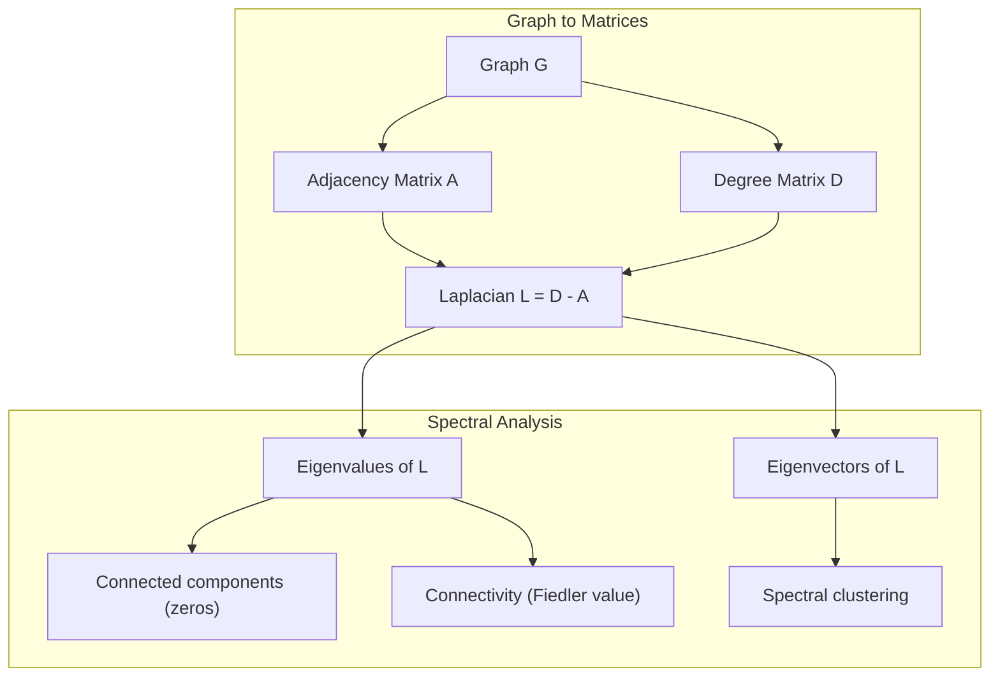
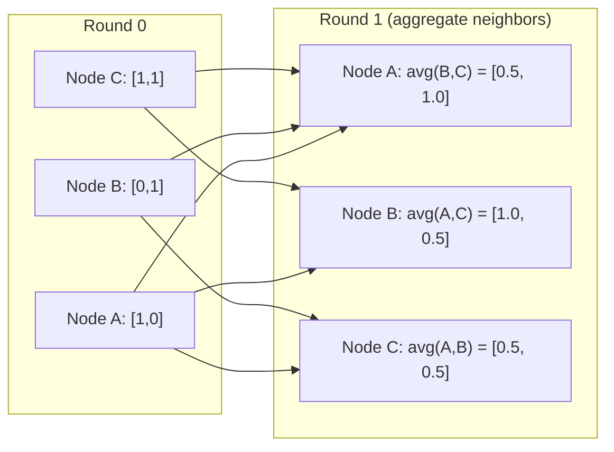

# Lý thuyết đồ thị cho học máy

> Đồ thị là cấu trúc dữ liệu của các mối quan hệ. Nếu dữ liệu của bạn có kết nối, bạn cần lý thuyết đồ thị.

**Loại:** Xây dựng
**Ngôn ngữ:** Python
**Kiến thức tiên quyết:** Giai đoạn 1, Bài 01-03 (đại số tuyến tính, ma trận)
**Thời lượng:** ~90 phút

## Mục tiêu học tập

- Xây dựng một biểu đồ class với các biểu diễn matrix/list liền kề và thực hiện duyệt BFS và DFS
- Tính toán đồ thị Laplacian và sử dụng các giá trị riêng của nó để phát hiện các thành phần và nút cụm được kết nối
- Triển khai một vòng truyền thông điệp kiểu GNN dưới dạng phép nhân ma trận liền kề chuẩn hóa
- Áp dụng cụm quang phổ để phân vùng biểu đồ bằng cách sử dụng Fiedler vector

## Vấn đề

Mạng xã hội, phân tử, cơ sở tri thức, mạng trích dẫn, lộ trình - tất cả đều là đồ thị. ML truyền thống coi dữ liệu như bảng phẳng. Mỗi hàng là độc lập. Mỗi feature là một cột. Nhưng khi cấu trúc của các kết nối quan trọng, các bảng sẽ thất bại.

Hãy xem xét một mạng xã hội. Bạn muốn dự đoán sản phẩm mà người dùng sẽ mua. Lịch sử mua hàng của họ rất quan trọng. Nhưng lịch sử mua hàng của bạn bè của họ quan trọng hơn. Các kết nối mang tín hiệu.

Hoặc xem xét một phân tử. Bạn muốn dự đoán xem nó có liên kết với protein hay không. Các nguyên tử quan trọng, nhưng điều thực sự quan trọng là cách các nguyên tử liên kết với nhau. Cấu trúc là dữ liệu.

Mạng nơ-ron đồ thị (GNN) là lĩnh vực phát triển nhanh nhất trong deep learning. Chúng hỗ trợ khám phá thuốc, khuyến nghị xã hội, phát hiện gian lận và suy luận trên biểu đồ tri thức. Mỗi GNN đều được xây dựng trên cùng một nền tảng: lý thuyết đồ thị cơ bản.

Bạn cần bốn điều:
1. Một cách để biểu diễn đồ thị dưới dạng ma trận (để bạn có thể nhân chúng)
2. Thuật toán duyệt để khám phá cấu trúc đồ thị
3. Laplacian - ma trận quan trọng nhất trong lý thuyết đồ thị quang phổ
4. Truyền tin nhắn -- hoạt động làm cho GNN hoạt động

## Khái niệm

### Đồ thị: Nút và Cạnh

Đồ thị G = (V, E) bao gồm các đỉnh (nút) V và các cạnh E. Mỗi cạnh kết nối hai nút.

**Có hướng và không có hướng.** Trong đồ thị không định hướng, cạnh (u, v) có nghĩa là u kết nối với v VÀ v kết nối với bạn. Trong đồ thị có hướng (chữ ký), cạnh (u, v) có nghĩa là u trỏ đến v, nhưng không nhất thiết phải ngược lại.

**Có trọng số so với không trọng số.** Trong biểu đồ không trọng số, các cạnh tồn tại hoặc không. Trong đồ thị có trọng số, mỗi cạnh có trọng số - khoảng cách, chi phí, sức mạnh.

| Loại biểu đồ | Ví dụ |
|-----------|---------|
| Không định hướng, không trọng số | Mạng lưới tình bạn trên Facebook |
| Có hướng, không trọng số | Mạng theo dõi Twitter |
| Không định hướng, có trọng số | Lộ trình (khoảng cách) |
| Có hướng, có trọng số | Liên kết trang web (điểm PageRank) |

### Ma trận liền kề

Ma trận liền kề A là biểu diễn cốt lõi. Đối với biểu đồ có n nút:

```
A[i][j] = 1    if there is an edge from node i to node j
A[i][j] = 0    otherwise
```

Đối với đồ thị không định hướng, A là đối xứng: A[i][j] = A[j][i]. Đối với đồ thị có trọng số, A[i][j] = trọng số của cạnh (i, j).

**Ví dụ -- một tam giác:**

```
Nodes: 0, 1, 2
Edges: (0,1), (1,2), (0,2)

A = [[0, 1, 1],
     [1, 0, 1],
     [1, 1, 0]]
```

Ma trận liền kề là đầu vào cho mọi GNN. Các phép toán ma trận trên A tương ứng với các phép toán trên đồ thị.

### Bằng cấp

Mức độ của một nút là số lượng cạnh được kết nối với nó. Đối với đồ thị có hướng, bạn có in-degree (cạnh đi vào) và out-degree (cạnh đi ra).

Ma trận độ D là đường chéo:

```
D[i][i] = degree of node i
D[i][j] = 0    for i != j
```

Đối với ví dụ tam giác: D = diag(2, 2, 2) vì mỗi nút kết nối với hai nút khác.

Bằng cấp cho bạn biết về tầm quan trọng của nút. Mức độ cao = nút trung tâm. Sự phân bố mức độ của một mạng tiết lộ cấu trúc của nó. Mạng xã hội tuân theo quy luật quyền lực (ít trung tâm, nhiều nút lá). Đồ thị ngẫu nhiên có bậc phân bố Poisson.

### BFS và DFS

Hai thuật toán duyệt đồ thị cơ bản. Bạn cần cả hai.

**Tìm kiếm theo chiều rộng đầu tiên (BFS):** Khám phá tất cả những người hàng xóm trước, sau đó là hàng xóm của hàng xóm. Sử dụng hàng đợi (FIFO).

```
BFS from node 0:
  Visit 0
  Queue: [1, 2]        (neighbors of 0)
  Visit 1
  Queue: [2, 3]        (add neighbors of 1)
  Visit 2
  Queue: [3]           (neighbors of 2 already visited)
  Visit 3
  Queue: []            (done)
```

BFS tìm thấy các đường dẫn ngắn nhất trong đồ thị không trọng số. Khoảng cách từ điểm bắt đầu đến bất kỳ nút nào bằng mức BFS mà tại đó nút đó được phát hiện lần đầu tiên. Đây là lý do tại sao BFS được sử dụng cho khoảng cách đếm bước nhảy trong mạng xã hội.

**Tìm kiếm ưu tiên độ sâu (DFS):** Đi sâu nhất có thể trước khi quay lại. Sử dụng stack (LIFO) hoặc đệ quy.

```
DFS from node 0:
  Visit 0
  Stack: [1, 2]        (neighbors of 0)
  Visit 2               (pop from stack)
  Stack: [1, 3]         (add neighbors of 2)
  Visit 3               (pop from stack)
  Stack: [1]
  Visit 1               (pop from stack)
  Stack: []             (done)
```

DFS hữu ích cho:
- Tìm các thành phần được kết nối (chạy DFS từ các nút chưa được truy cập)
- Phát hiện chu kỳ (cạnh sau trong cây DFS)
- Sắp xếp cấu trúc liên kết (thứ tự kết thúc DFS ngược)

| Thuật toán | Cấu trúc dữ liệu | Tìm thấy | Trường hợp sử dụng |
|-----------|---------------|-------|----------|
| BFS | Hàng đợi | Đường dẫn ngắn nhất | Khoảng cách mạng xã hội, duyệt đồ thị tri thức |
| ĐTBS | Stack | Thành phần, chu kỳ | Kết nối, sắp xếp tô pô |

### Đồ thị Laplacian

L = D - A. Ma trận quan trọng nhất trong lý thuyết đồ thị quang phổ.

Đối với hình tam giác:

```
D = [[2, 0, 0],    A = [[0, 1, 1],    L = [[2, -1, -1],
     [0, 2, 0],         [1, 0, 1],         [-1, 2, -1],
     [0, 0, 2]]         [1, 1, 0]]         [-1, -1,  2]]
```

Laplacian có các đặc tính đáng chú ý:

1. **L là dương bán xác định.** Tất cả các giá trị riêng là >= 0.

2. **Số giá trị riêng bằng không bằng số thành phần được kết nối.** Một đồ thị được kết nối có chính xác một giá trị riêng bằng không. Một đồ thị có 3 thành phần bị ngắt kết nối có ba giá trị riêng bằng không.

3. **Giá trị riêng không nhỏ nhất (giá trị Fiedler) đo lường kết nối.** Giá trị Fiedler lớn có nghĩa là đồ thị được kết nối tốt. Giá trị Fiedler nhỏ có nghĩa là biểu đồ có một điểm yếu - nút thắt cổ chai.

4. **Vectơ riêng của giá trị Fiedler (Fiedler vector) tiết lộ sự phân tách tốt nhất.** Các nút có giá trị dương nằm trong một nhóm, các nút có giá trị âm nằm trong nhóm kia. Đây là cụm quang phổ.



### Thuộc tính quang phổ

Các giá trị riêng của ma trận liền kề và Laplacian tiết lộ các tính chất cấu trúc mà không có bất kỳ sự di chuyển nào.

**Phân cụm quang phổ** hoạt động như thế này:
1. Tính Laplacian L
2. Tìm k vectơ riêng nhỏ nhất của L (bỏ qua vectơ đầu tiên, là tất cả các đồ thị được kết nối)
3. Sử dụng các vectơ riêng đó làm tọa độ mới cho mỗi nút
4. Chạy k-means trên các tọa độ đó

Tại sao điều này hoạt động? Các vectơ riêng của L mã hóa các hàm "mượt mà nhất" trên biểu đồ. Các nút được kết nối tốt sẽ nhận được các giá trị vectơ riêng tương tự. Các nút được phân tách bởi một nút cổ chai nhận được các giá trị khác nhau. Các vectơ riêng phân tách các cụm một cách tự nhiên.

**Kết nối đi bộ ngẫu nhiên.** Laplacian chuẩn hóa liên quan đến các bước đi ngẫu nhiên trên biểu đồ. Sự phân bố tĩnh của một bước đi ngẫu nhiên tỷ lệ thuận với mức độ nút. Thời gian trộn (tốc độ đi bộ hội tụ) phụ thuộc vào khoảng cách quang phổ.

### Chuyển tin nhắn

Hoạt động cốt lõi của Graph Neural Networks. Mỗi nút thu thập thông báo từ các hàng xóm của nó, tổng hợp chúng và cập nhật trạng thái của riêng nó.

```
h_v^(k+1) = UPDATE(h_v^(k), AGGREGATE({h_u^(k) : u in neighbors(v)}))
```

Ở dạng đơn giản nhất, AGGREGATE = mean và UPDATE = biến đổi tuyến tính + kích hoạt:

```
h_v^(k+1) = sigma(W * mean({h_u^(k) : u in neighbors(v)}))
```

Đây là phép nhân ma trận ngụy trang. Nếu H là ma trận của tất cả các nút features và A là ma trận liền kề:

```
H^(k+1) = sigma(A_norm * H^(k) * W)
```

trong đó A_norm là ma trận liền kề chuẩn hóa (mỗi hàng có tổng là 1).

Một vòng truyền thông báo cho phép mỗi nút "nhìn thấy" các hàng xóm trực tiếp của nó. Hai viên đạn cho phép nó nhìn thấy hàng xóm của hàng xóm. Vòng K cung cấp cho mỗi node thông tin từ vùng K-hop của nó.



### Khái niệm và ứng dụng ML

| Khái niệm | Ứng dụng ML |
|---------|---------------|
| Ma trận liền kề | Biểu diễn đầu vào GNN |
| Đồ thị Laplacian | Phân cụm quang phổ, phát hiện cộng đồng |
| BFS/DFS | Duyệt qua biểu đồ tri thức, tìm đường |
| Phân phối bằng cấp | Tầm quan trọng của nút, feature engineering |
| Truyền tin nhắn | Các lớp GNN (GCN, GAT, GraphSAGE) |
| Giá trị riêng của L | Phát hiện cộng đồng, phân vùng đồ thị |
| Phân cụm quang phổ | Nhóm nút không giám sát |
| Xếp hạng trang | Tầm quan trọng của nút, tìm kiếm web |

```figure
graph-degree-distribution
```

## Tự xây dựng

### Bước 1: Vẽ đồ thị class từ đầu

```python
class Graph:
    def __init__(self, n_nodes, directed=False):
        self.n = n_nodes
        self.directed = directed
        self.adj = {i: {} for i in range(n_nodes)}

    def add_edge(self, u, v, weight=1.0):
        self.adj[u][v] = weight
        if not self.directed:
            self.adj[v][u] = weight

    def neighbors(self, node):
        return list(self.adj[node].keys())

    def degree(self, node):
        return len(self.adj[node])

    def adjacency_matrix(self):
        import numpy as np
        A = np.zeros((self.n, self.n))
        for u in range(self.n):
            for v, w in self.adj[u].items():
                A[u][v] = w
        return A

    def degree_matrix(self):
        import numpy as np
        D = np.zeros((self.n, self.n))
        for i in range(self.n):
            D[i][i] = self.degree(i)
        return D

    def laplacian(self):
        return self.degree_matrix() - self.adjacency_matrix()
```

Danh sách liền kề (`self.adj`) lưu trữ hàng xóm một cách hiệu quả. Chuyển đổi ma trận liền kề sử dụng numpy vì tất cả các phép toán quang phổ đều cần nó.

### Bước 2: BFS và DFS

```python
from collections import deque

def bfs(graph, start):
    visited = set()
    order = []
    distances = {}
    queue = deque([(start, 0)])
    visited.add(start)
    while queue:
        node, dist = queue.popleft()
        order.append(node)
        distances[node] = dist
        for neighbor in graph.neighbors(node):
            if neighbor not in visited:
                visited.add(neighbor)
                queue.append((neighbor, dist + 1))
    return order, distances


def dfs(graph, start):
    visited = set()
    order = []
    stack = [start]
    while stack:
        node = stack.pop()
        if node in visited:
            continue
        visited.add(node)
        order.append(node)
        for neighbor in reversed(graph.neighbors(node)):
            if neighbor not in visited:
                stack.append(neighbor)
    return order
```

BFS sử dụng một deque (hàng đợi hai đầu) cho O (1) popleft. DFS sử dụng danh sách làm stack. Cả hai đều truy cập mọi nút chính xác một lần - thời gian O (V + E).

### Bước 3: Các thành phần được kết nối và các giá trị riêng của Laplacian

```python
def connected_components(graph):
    visited = set()
    components = []
    for node in range(graph.n):
        if node not in visited:
            order, _ = bfs(graph, node)
            visited.update(order)
            components.append(order)
    return components


def laplacian_eigenvalues(graph):
    import numpy as np
    L = graph.laplacian()
    eigenvalues = np.linalg.eigvalsh(L)
    return eigenvalues
```

`eigvalsh` dành cho ma trận đối xứng - Laplacian luôn đối xứng đối với đồ thị không có hướng. Nó trả về các giá trị riêng theo thứ tự tăng dần. Đếm số không để tìm số lượng thành phần được kết nối.

### Bước 4: Phân cụm quang phổ

```python
def spectral_clustering(graph, k=2):
    import numpy as np
    L = graph.laplacian()
    eigenvalues, eigenvectors = np.linalg.eigh(L)
    features = eigenvectors[:, 1:k+1]

    labels = np.zeros(graph.n, dtype=int)
    for i in range(graph.n):
        if features[i, 0] >= 0:
            labels[i] = 0
        else:
            labels[i] = 1
    return labels
```

Đối với k = 2, dấu của vector Fiedler chia đồ thị thành hai cụm. Đối với k>2, bạn sẽ chạy k-means trên các vectơ riêng k đầu tiên (không bao gồm vectơ riêng tất cả một tầm thường).

### Bước 5: Chuyển tin nhắn

```python
def message_passing(graph, features, weight_matrix):
    import numpy as np
    A = graph.adjacency_matrix()
    row_sums = A.sum(axis=1, keepdims=True)
    row_sums[row_sums == 0] = 1
    A_norm = A / row_sums
    aggregated = A_norm @ features
    output = aggregated @ weight_matrix
    return output
```

Đây là một vòng truyền tin nhắn GNN. Các features mới của mỗi nút là trung bình gia quyền của features của các nút lân cận, được chuyển đổi bởi ma trận trọng số. Stack nhiều vòng để tuyên truyền thông tin hơn nữa.

## Ứng dụng

Với networkx và numpy, các hoạt động tương tự là một dòng:

```python
import networkx as nx
import numpy as np

G = nx.karate_club_graph()

A = nx.adjacency_matrix(G).toarray()
L = nx.laplacian_matrix(G).toarray()

eigenvalues = np.linalg.eigvalsh(L.astype(float))
print(f"Smallest eigenvalues: {eigenvalues[:5]}")
print(f"Connected components: {nx.number_connected_components(G)}")

communities = nx.community.greedy_modularity_communities(G)
print(f"Communities found: {len(communities)}")

pr = nx.pagerank(G)
top_nodes = sorted(pr.items(), key=lambda x: x[1], reverse=True)[:5]
print(f"Top 5 PageRank nodes: {top_nodes}")
```

networkx xử lý các biểu đồ có kích thước bất kỳ với phần phụ trợ C được tối ưu hóa. Sử dụng nó trong production. Sử dụng triển khai từ đầu của bạn để hiểu nó làm gì.

### numpy phân tích quang phổ

```python
import numpy as np

A = np.array([
    [0, 1, 1, 0, 0],
    [1, 0, 1, 0, 0],
    [1, 1, 0, 1, 0],
    [0, 0, 1, 0, 1],
    [0, 0, 0, 1, 0]
])

D = np.diag(A.sum(axis=1))
L = D - A

eigenvalues, eigenvectors = np.linalg.eigh(L)
print(f"Eigenvalues: {np.round(eigenvalues, 4)}")
print(f"Fiedler value: {eigenvalues[1]:.4f}")
print(f"Fiedler vector: {np.round(eigenvectors[:, 1], 4)}")

fiedler = eigenvectors[:, 1]
group_a = np.where(fiedler >= 0)[0]
group_b = np.where(fiedler < 0)[0]
print(f"Cluster A: {group_a}")
print(f"Cluster B: {group_b}")
```

Fiedler vector thực hiện công việc nặng nhọc. Các mục tích cực trong một cụm, âm trong cụm kia. Không cần tối ưu hóa lặp đi lặp lại - chỉ cần một phân hủy riêng.

## Sản phẩm bàn giao

Bài học này tạo ra:
- `outputs/skill-graph-analysis.md` -- một tài liệu tham khảo skill để phân tích dữ liệu có cấu trúc đồ thị

## Kết nối

| Khái niệm | Vị trí hiển thị |
|---------|------------------|
| Ma trận liền kề | Đầu vào GCN, GAT, GraphSAGE |
| Tiếng Laplacian | Phân cụm quang phổ, bộ lọc ChebNet |
| BFS | Duyệt qua biểu đồ tri thức, truy vấn đường dẫn ngắn nhất |
| Truyền tin nhắn | Mỗi lớp GNN, thông điệp thần kinh đi qua |
| Khoảng cách quang phổ | Kết nối đồ thị, trộn thời gian đi bộ ngẫu nhiên |
| Phân phối bằng cấp | Mạng định luật lũy thừa, nút feature engineering |
| Các thành phần được kết nối | Tiền xử lý, xử lý đồ thị bị ngắt kết nối |
| Xếp hạng trang | Xếp hạng tầm quan trọng của nút, khởi tạo attention |

GNN xứng đáng được đề cập đặc biệt. Phép toán tích chập đồ thị trong GCN (Kipf & Welling, 2017) sử dụng ma trận liền kề với các vòng lặp tự được thêm vào, A_hat = A + I:

```text
H^(l+1) = sigma(D_hat^(-1/2) * A_hat * D_hat^(-1/2) * H^(l) * W^(l))
```

trong đó A_hat = A + I (liền kề cộng với các vòng lặp tự lặp) và D_hat là ma trận bậc của A_hat. Các vòng lặp tự đảm bảo mỗi nút bao gồm các features riêng trong quá trình tổng hợp. Đây chính xác là truyền thông điệp với chuẩn hóa đối xứng. D_hat^(-1/2) * A_hat * D_hat^(-1/2) là ma trận liền kề chuẩn hóa. Laplacian xuất hiện vì chuẩn hóa này có liên quan đến L_sym = I - D^(-1/2) * A * D^(-1/2). Hiểu Laplacian có nghĩa là hiểu tại sao GCN hoạt động.

## Bài tập

1. **Triển khai PageRank từ đầu.** Bắt đầu với điểm số thống nhất. Ở mỗi bước: score(v) = (1-d)/n + d * sum(score(u)/out_degree(u)) cho tất cả u trỏ đến v. Sử dụng d=0.85. Chạy cho đến khi hội tụ (thay đổi < 1e-6). Kiểm tra trên một biểu đồ web nhỏ.

2. **Tìm các cộng đồng bằng cách sử dụng phân cụm phổ.** Tạo một biểu đồ với hai cụm được phân tách rõ ràng (ví dụ: hai nhóm được kết nối bằng một cạnh duy nhất). Chạy phân cụm quang phổ và xác minh rằng nó tìm thấy sự phân chia phù hợp. Điều gì xảy ra khi bạn thêm nhiều cạnh chéo hơn?

3. **Triển khai thuật toán của Dijkstra** cho các đường dẫn ngắn nhất trong đồ thị có trọng số. So sánh kết quả với BFS trên cùng một biểu đồ với trọng số đồng đều.

4. **Xây dựng mạng truyền tin nhắn 2 lớp.** Áp dụng truyền tin nhắn hai lần với các ma trận trọng số khác nhau. Cho thấy rằng sau 2 vòng, mỗi nút có thông tin từ vùng lân cận 2 bước của nó.

5. **Phân tích biểu đồ trong thế giới thực.** Sử dụng biểu đồ Câu lạc bộ Karate (34 nút, 78 cạnh). Phân bố bậc tính toán, giá trị riêng Laplacian và phân cụm phổ. So sánh kết quả phân cụm quang phổ với phân tách ground truth đã biết.

## Thuật ngữ chính

| Thuật ngữ | Những gì mọi người nói | Ý nghĩa thực sự của nó |
|------|----------------|----------------------|
| Biểu đồ | "Các nút và cạnh" | Một cấu trúc toán học G = (V, E) mã hóa các mối quan hệ theo cặp |
| Ma trận liền kề | "Bảng kết nối" | Ma trận n x n trong đó A [i] [j] = 1 nếu các nút i và j được kết nối |
| Bằng cấp | "Một nút được kết nối như thế nào" | Số cạnh chạm vào một nút |
| Tiếng Laplacian | "D trừ A" | L = D - A, ma trận có giá trị riêng tiết lộ cấu trúc đồ thị |
| Giá trị của Fiedler | "Kết nối đại số" | Giá trị riêng không nhỏ nhất của L, đo lường mức độ kết nối tốt của đồ thị |
| BFS | "Tìm kiếm theo cấp độ" | Đi qua thăm tất cả những người hàng xóm trước khi đi sâu hơn, tìm những con đường ngắn nhất |
| ĐTBS | "Đi sâu trước" | Đi theo một con đường đến cuối trước khi quay ngược |
| Truyền tin nhắn | "Các nút nói chuyện với hàng xóm" | Mỗi nút tổng hợp thông tin từ các hàng xóm của nó, cốt lõi của GNN |
| Phân cụm quang phổ | "Cụm theo vectơ riêng" | Phân vùng đồ thị bằng cách sử dụng vectơ riêng của Laplacian của nó |
| Thành phần được kết nối | "Một tác phẩm riêng biệt" | Một biểu đồ con tối đa trong đó mọi nút có thể tiếp cận mọi nút khác |

## Đọc thêm

- **Kipf & Welling (2017)** -- "Phân loại bán giám sát với mạng tích chập đồ thị." Bài báo đã ra mắt GNN hiện đại. Cho thấy rằng các tích chập đồ thị quang phổ đơn giản hóa việc truyền thông điệp.
- **Spielman (2012)** -- Ghi chú bài giảng "Lý thuyết đồ thị phổ". Giới thiệu dứt khoát về Laplacians, khoảng cách quang phổ và phân vùng đồ thị.
- **Hamilton (2020)** -- "Học biểu diễn đồ thị." Sách bao gồm GNN từ các nguyên tắc cơ bản đến ứng dụng.
- **Bronstein và cộng sự (2021) **-- "Học sâu hình học: Lưới, Nhóm, Đồ thị, Trắc địa và Đồng hồ đo." Giấy framework thống nhất.
- **Veličković et al. (2018)** -- "Đồ thị Attention Networks." Mở rộng việc truyền tin nhắn với các cơ chế attention.
