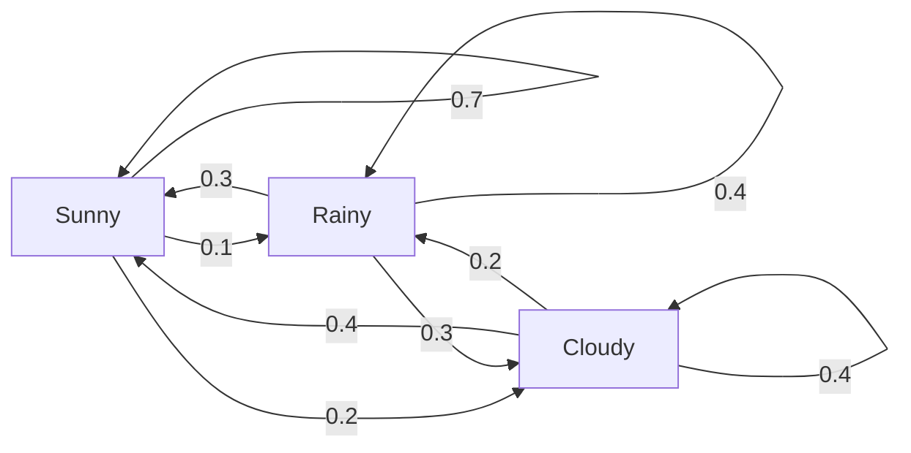
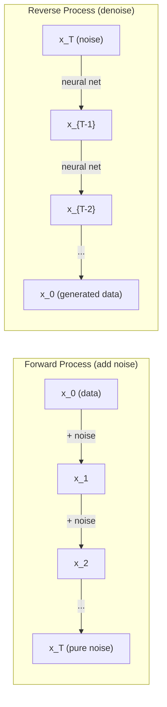

# Stochastic Processes

> Tính ngẫu nhiên với cấu trúc. Toán học đằng sau những bước đi ngẫu nhiên, chuỗi Markov và models khuếch tán.

**Loại:** Học
**Ngôn ngữ:** Python
**Kiến thức tiên quyết:** Giai đoạn 1, Bài 06-07 (xác suất, Bayes)
**Thời lượng:** ~75 phút

## Mục tiêu học tập

- Mô phỏng các bước đi ngẫu nhiên 1D và 2D và xác minh tỷ lệ sqrt (n) của dịch chuyển
- Xây dựng trình mô phỏng chuỗi Markov và tính toán phân phối tĩnh của nó thông qua phân hủy riêng
- Triển khai động lực học Metropolis-Hastings MCMC và Langevin cho sampling từ phân phối mục tiêu
- Kết nối process khuếch tán thuận với chuyển động Brown và giải thích cách process ngược lại tạo ra dữ liệu

## Vấn đề

Nhiều hệ thống AI liên quan đến tính ngẫu nhiên phát triển theo thời gian. Không phải ngẫu nhiên tĩnh - tính ngẫu nhiên có cấu trúc, tuần tự trong đó mỗi bước phụ thuộc vào những gì đã xảy ra trước đó.

Ngôn ngữ models tạo ra tokens từng cái một. Mỗi token phụ thuộc vào ngữ cảnh trước đó. model xuất ra một phân phối xác suất, lấy mẫu từ nó và tiếp tục. Đó là một process ngẫu nhiên.

Khuếch tán models thêm nhiễu cho hình ảnh từng bước cho đến khi nó trở nên tĩnh thuần túy. Sau đó, chúng đảo ngược process, khử nhiễu từng bước cho đến khi một hình ảnh mới xuất hiện. process phía trước là một chuỗi Markov. process ngược lại là một chuỗi Markov đã học chạy ngược.

Học tăng cường agents thực hiện các hành động trong một môi trường. Mỗi hành động dẫn đến một trạng thái mới với một số xác suất. agent theo một policy ngẫu nhiên trong một thế giới ngẫu nhiên. Toàn bộ sự việc là một quyết định của Markov process.

MCMC sampling - xương sống của inference Bayes - xây dựng một chuỗi Markov có phân bố tĩnh là posterior bạn muốn lấy mẫu.

Tất cả những điều này được xây dựng dựa trên bốn ý tưởng nền tảng:
1. Đi bộ ngẫu nhiên - process ngẫu nhiên đơn giản nhất
2. Chuỗi Markov -- tính ngẫu nhiên có cấu trúc với ma trận chuyển tiếp
3. Động lực học Langevin - gradient descent với nhiễu
4. Metropolis-Hastings -- sampling từ bất kỳ bản phân phối nào

## Khái niệm

### Đi bộ ngẫu nhiên

Bắt đầu từ vị trí 0. Ở mỗi bước, hãy tung một đồng xu công bằng. Đầu: di chuyển sang phải (+1). Đuôi: di chuyển sang trái (-1).

Sau n bước, vị trí của bạn là tổng của n giá trị +/- 1 ngẫu nhiên. Vị trí dự kiến là 0 (đi bộ không thiên vị). Nhưng khoảng cách dự kiến từ điểm gốc tăng lên dưới dạng sqrt(n).

Điều này là phản trực giác. Cuộc đi bộ là công bằng - không trôi dạt theo cả hai hướng. Nhưng theo thời gian, nó ngày càng đi xa hơn so với nơi nó bắt đầu. Độ lệch chuẩn sau n bước là sqrt (n).

```
Step 0:  Position = 0
Step 1:  Position = +1 or -1
Step 2:  Position = +2, 0, or -2
...
Step 100: Expected distance from origin ~ 10 (sqrt(100))
Step 10000: Expected distance from origin ~ 100 (sqrt(10000))
```

**Trong 2D**, bước đi di chuyển lên, xuống, trái hoặc phải với xác suất bằng nhau. Tỷ lệ sqrt(n) tương tự áp dụng cho khoảng cách từ điểm gốc. Đường đi traces một mô hình giống như Fractal.

**Tại sao lại là sqrt(n)?** Mỗi bước là +1 hoặc -1 với xác suất bằng nhau. Sau n bước, vị trí S_n = X_1 + X_2 + ... + X_n trong đó mỗi X_i là +/- 1. variance của mỗi bước là 1 và các bước độc lập, vì vậy Var(S_n) = n. Độ lệch chuẩn = sqrt (n). Theo định lý giới hạn trung tâm, S_n / sqrt(n) hội tụ với một phân phối chuẩn chuẩn.

Tỷ lệ sqrt(n) này hiển thị ở mọi nơi trong ML. SGD tỷ lệ nhiễu là 1/sqrt(batch_size). Embedding tỷ lệ kích thước là sqrt(d). Căn bậc hai là chữ ký của các phép cộng ngẫu nhiên độc lập.

**Kết nối với chuyển động Brown.** Đi bộ ngẫu nhiên với kích thước bước 1/sqrt(n) và n bước trên một đơn vị thời gian. Khi n đi đến vô cực, bước đi hội tụ với chuyển động Brown B(t) - một process thời gian liên tục trong đó B(t) tuân theo phân phối chuẩn với trung bình 0 và variance t.

Chuyển động Brown là nền tảng toán học của sự khuếch tán. Nó models sự lắc lư ngẫu nhiên của các hạt trong chất lỏng, sự biến động của giá cổ phiếu và - quan trọng là - nhiễu process trong models khuếch tán.

**Sự tàn phá của con bạc.** Một người đi bộ ngẫu nhiên bắt đầu từ vị trí k, với các rào cản hấp thụ ở 0 và N. Xác suất đạt N trước 0 là bao nhiêu? Để đi bộ công bằng: P (reach N) = k/N. Điều này đơn giản và thanh lịch một cách đáng ngạc nhiên. Nó kết nối với lý thuyết về martingales - bước đi ngẫu nhiên công bằng là một martingale (giá trị tương lai dự kiến = giá trị hiện tại).

### Xích Markov

Chuỗi Markov là một hệ thống chuyển đổi giữa các trạng thái theo xác suất cố định. Thuộc tính chính: trạng thái tiếp theo chỉ phụ thuộc vào trạng thái hiện tại, không phụ thuộc vào lịch sử.

```
P(X_{t+1} = j | X_t = i, X_{t-1} = ...) = P(X_{t+1} = j | X_t = i)
```

Đây là tài sản của Markov. Nó có nghĩa là bạn có thể mô tả toàn bộ động lực học bằng ma trận chuyển tiếp P:

```
P[i][j] = probability of going from state i to state j
```

Mỗi hàng P tổng bằng 1 (bạn phải đi đâu đó).

**Ví dụ -- Thời tiết:**

```
States: Sunny (0), Rainy (1), Cloudy (2)

P = [[0.7, 0.1, 0.2],    (if sunny: 70% sunny, 10% rainy, 20% cloudy)
     [0.3, 0.4, 0.3],    (if rainy: 30% sunny, 40% rainy, 30% cloudy)
     [0.4, 0.2, 0.4]]    (if cloudy: 40% sunny, 20% rainy, 40% cloudy)
```

Bắt đầu ở bất kỳ trạng thái nào. Sau nhiều lần chuyển tiếp, sự phân bố của các trạng thái hội tụ đến phân phối tĩnh pi, trong đó pi * P = pi. Đây là vectơ riêng bên trái của P với giá trị riêng 1.

Đối với chuỗi thời tiết, phân bố tĩnh có thể là [0,53, 0,18, 0,29] - về lâu dài, trời nắng 53% thời gian bất kể trạng thái bắt đầu.



**Tính toán phân phối tĩnh.** Có hai cách tiếp cận:

1. **Phương pháp công suất**: nhân bất kỳ phân phối ban đầu nào với P nhiều lần. Sau đủ lần lặp lại, nó hội tụ.
2. **Phương pháp giá trị riêng**: tìm vectơ riêng bên trái của P với giá trị riêng 1. Đây là vectơ riêng của P^T với giá trị riêng 1.

Cả hai cách tiếp cận đều yêu cầu chuỗi đáp ứng các điều kiện hội tụ.

**Điều kiện hội tụ.** Một chuỗi Markov hội tụ thành một phân phối tĩnh duy nhất nếu nó là:
- **Không thể rút gọn**: mọi tiểu bang đều có thể truy cập được từ mọi tiểu bang khác
- **Không chu kỳ**: chuỗi không chu kỳ với một chu kỳ cố định

Hầu hết các chuỗi bạn gặp phải trong ML đều thỏa mãn cả hai điều kiện.

**Trạng thái hấp thụ.** Một trạng thái hấp thụ nếu một khi bạn đi vào nó, bạn không bao giờ rời khỏi (P [i] [i] = 1). Hấp thụ chuỗi Markov model processes với các trạng thái đầu cuối - một trò chơi kết thúc, một khách hàng rời đi, một chuỗi token chạm vào cuối token văn bản.

**Thời gian trộn.** Bao nhiêu bước cho đến khi xích "gần" với phân bố tĩnh? Về mặt chính thức, số bước cho đến khi tổng khoảng cách biến đổi từ trạng thái tĩnh giảm xuống dưới một ngưỡng nào đó. Trộn nhanh = cần vài bước. Khoảng cách quang phổ của P (1 trừ đi giá trị riêng lớn thứ hai) kiểm soát thời gian trộn. Khoảng cách lớn hơn = trộn nhanh hơn.

### Kết nối với Models ngôn ngữ

Token thế hệ trong một model ngôn ngữ xấp xỉ một process Markov. Với ngữ cảnh hiện tại, model xuất ra một phân phối trong token tiếp theo. Temperature kiểm soát độ sắc nét:

```
P(token_i) = exp(logit_i / temperature) / sum(exp(logit_j / temperature))
```

- Temperature = 1.0: phân phối chuẩn
- Temperature < 1.0: sắc nét hơn (xác định hơn)
- Temperature > 1.0: phẳng hơn (ngẫu nhiên hơn)
- Temperature -> 0: argmax (tham lam)

Top-k sampling cắt ngắn xuống tokens xác suất cao nhất k. Top-p (nhân) sampling cắt ngắn thành tập tokens nhỏ nhất có xác suất tích lũy vượt quá p. Cả hai đều sửa đổi xác suất chuyển tiếp Markov.

### Chuyển động Brown

Giới hạn thời gian liên tục của đi bộ ngẫu nhiên. Vị trí B(t) có ba thuộc tính:
1. B (0) = 0
2. B(t) - B(s) phân bố bình thường với giá trị trung bình 0 và variance t - s (đối với t > s)
3. Gia số trên các khoảng thời gian không chồng chéo là độc lập

Chuyển động của Brown là liên tục nhưng không thể phân biệt được - nó lắc lư ở mọi thang âm. Đường đi có kích thước fractal 2 trong mặt phẳng.

Trong mô phỏng rời rạc, bạn xấp xỉ chuyển động Brown bằng cách:

```
B(t + dt) = B(t) + sqrt(dt) * z,    where z ~ N(0, 1)
```

Tỷ lệ sqrt (dt) rất quan trọng. Nó xuất phát từ định lý giới hạn trung tâm áp dụng cho các bước đi ngẫu nhiên.

### Động lực học Langevin

Gradient descent tìm giá trị tối thiểu của một hàm. Động lực học Langevin tìm thấy phân bố xác suất tỷ lệ thuận với exp(-U(x)/T), trong đó U là một hàm năng lượng và T là temperature.

```
x_{t+1} = x_t - dt * gradient(U(x_t)) + sqrt(2 * T * dt) * z_t
```

Hai lực tác động lên hạt:
1. **Lực Gradient **(-dt * gradient (U)): đẩy về phía năng lượng thấp (như gradient descent)
2. **Lực ngẫu nhiên** (sqrt(2*T*dt) * z): đẩy theo hướng ngẫu nhiên (khám phá)

Ở temperature T = 0, đây là gradient descent thuần túy. Ở temperature cao, nó gần như là một cuộc đi bộ ngẫu nhiên. Ở temperature phù hợp, hạt khám phá bối cảnh năng lượng và dành nhiều thời gian hơn ở các khu vực năng lượng thấp.

**Kết nối với models khuếch tán.** process chuyển tiếp của model khuếch tán là:

```
x_t = sqrt(alpha_t) * x_{t-1} + sqrt(1 - alpha_t) * noise
```

Đây là một chuỗi Markov dần dần trộn lẫn dữ liệu với nhiễu. Sau đủ bước, x_T là nhiễu Gaussian thuần túy.

process ngược lại - đi từ nhiễu trở lại dữ liệu - cũng là một chuỗi Markov, nhưng xác suất chuyển tiếp của nó được học bởi một mạng nơ-ron. Mạng học cách dự đoán nhiễu đã được thêm vào ở mỗi bước, sau đó trừ đi nó.



### MCMC: Chuỗi Markov Monte Carlo

Đôi khi bạn cần lấy mẫu từ phân phối p(x) mà bạn có thể đánh giá (lên đến một hằng số) nhưng không thể lấy mẫu trực tiếp. posteriors Bayes là ví dụ điển hình - bạn biết likelihood lần prior, nhưng hằng số chuẩn hóa thì khó giải quyết.

**Metropolis-Hastings** xây dựng một chuỗi Markov có phân bố tĩnh là p(x):

1. Bắt đầu ở một số vị trí x
2. Đề xuất một vị trí mới x' từ một phân phối đề xuất Q(x'|x)
3. Tỷ lệ chấp nhận tính toán: a = p(x') * Q(x|x') / (p(x) * Q(x'|x))
4. Chấp nhận x' với xác suất min(1, a). Nếu không, hãy ở lại x.
5. Lặp lại.

Nếu Q đối xứng (ví dụ: Q(x'|x) = Q(x|x') = N(x, sigma^2)), tỷ lệ sẽ đơn giản hóa thành a = p(x') / p(x). Bạn chỉ cần tỷ lệ xác suất - hằng số chuẩn hóa hủy bỏ.

Chuỗi được đảm bảo hội tụ đến p (x) trong điều kiện nhẹ. Nhưng sự hội tụ có thể chậm nếu đề xuất quá nhỏ (đi bộ ngẫu nhiên) hoặc quá lớn (từ chối cao). Điều chỉnh đề xuất là nghệ thuật của MCMC.

**Tại sao nó hoạt động.** Tỷ lệ chấp nhận đảm bảo sự cân bằng chi tiết: xác suất ở x và di chuyển đến x' bằng xác suất ở x' và di chuyển đến x. Cân bằng chi tiết ngụ ý rằng p(x) là sự phân bố tĩnh của chuỗi. Vì vậy, sau đủ các bước, các mẫu đến từ p (x).

**Cân nhắc thực tế:**
- **Burn-in**: loại bỏ N mẫu đầu tiên. Chuỗi cần thời gian để đạt được phân phối cố định từ điểm xuất phát của nó.
- **Làm mỏng**: giữ mọi mẫu thứ k để giảm tự tương quan.
- **Nhiều chuỗi**: chạy một số chuỗi từ các điểm xuất phát khác nhau. Nếu chúng hội tụ đến cùng một phân phối, bạn có bằng chứng về sự hội tụ.
- **Tỷ lệ chấp nhận**: đối với các đề xuất Gaussian trong chiều d, tỷ lệ chấp nhận tối ưu là khoảng 23% (Roberts & Rosenthal, 2001). Quá cao có nghĩa là chuỗi hầu như không di chuyển. Quá thấp có nghĩa là nó từ chối mọi thứ.

### Stochastic Processes trong AI

| Process | Ứng dụng AI |
|---------|---------------|
| Đi bộ ngẫu nhiên | Khám phá trong RL, Node2Vec embeddings |
| Chuỗi Markov | Tạo văn bản, MCMC sampling |
| Chuyển động Brown | models khuếch tán (chuyển tiếp process) |
| Động lực học của Langevin | models tổng quát dựa trên điểm số, SGLD |
| Quyết định của Markov process | Học tăng cường |
| Đô thị-Hastings | inference Bayes, posterior sampling |

```figure
random-walk-diffusion
```

## Tự xây dựng

### Bước 1: Mô phỏng đi bộ ngẫu nhiên

```python
import numpy as np

def random_walk_1d(n_steps, seed=None):
    rng = np.random.RandomState(seed)
    steps = rng.choice([-1, 1], size=n_steps)
    positions = np.concatenate([[0], np.cumsum(steps)])
    return positions


def random_walk_2d(n_steps, seed=None):
    rng = np.random.RandomState(seed)
    directions = rng.choice(4, size=n_steps)
    dx = np.zeros(n_steps)
    dy = np.zeros(n_steps)
    dx[directions == 0] = 1   # right
    dx[directions == 1] = -1  # left
    dy[directions == 2] = 1   # up
    dy[directions == 3] = -1  # down
    x = np.concatenate([[0], np.cumsum(dx)])
    y = np.concatenate([[0], np.cumsum(dy)])
    return x, y
```

Cuộc đi bộ 1D lưu trữ số tiền tích lũy. Mỗi bước là +1 hoặc -1. Sau n bước, vị trí là tổng. variance phát triển tuyến tính với n, vì vậy độ lệch chuẩn tăng dưới dạng sqrt (n).

### Bước 2: Xích Markov

```python
class MarkovChain:
    def __init__(self, transition_matrix, state_names=None):
        self.P = np.array(transition_matrix, dtype=float)
        self.n_states = len(self.P)
        self.state_names = state_names or [str(i) for i in range(self.n_states)]

    def step(self, current_state, rng=None):
        if rng is None:
            rng = np.random.RandomState()
        probs = self.P[current_state]
        return rng.choice(self.n_states, p=probs)

    def simulate(self, start_state, n_steps, seed=None):
        rng = np.random.RandomState(seed)
        states = [start_state]
        current = start_state
        for _ in range(n_steps):
            current = self.step(current, rng)
            states.append(current)
        return states

    def stationary_distribution(self):
        eigenvalues, eigenvectors = np.linalg.eig(self.P.T)
        idx = np.argmin(np.abs(eigenvalues - 1.0))
        stationary = np.real(eigenvectors[:, idx])
        stationary = stationary / stationary.sum()
        return np.abs(stationary)
```

Phân bố tĩnh là vectơ riêng bên trái của P với giá trị riêng 1. Chúng ta tìm thấy nó bằng cách tính toán các vectơ riêng của P^T (chuyển vị biến các vectơ riêng bên trái thành vectơ riêng bên phải).

### Bước 3: Động lực học Langevin

```python
def langevin_dynamics(grad_U, x0, dt, temperature, n_steps, seed=None):
    rng = np.random.RandomState(seed)
    x = np.array(x0, dtype=float)
    trajectory = [x.copy()]
    for _ in range(n_steps):
        noise = rng.randn(*x.shape)
        x = x - dt * grad_U(x) + np.sqrt(2 * temperature * dt) * noise
        trajectory.append(x.copy())
    return np.array(trajectory)
```

gradient đẩy x về phía năng lượng thấp. Nhiễu giúp nó không bị kẹt. Ở trạng thái cân bằng, sự phân bố của các mẫu tỷ lệ thuận với exp(-U(x)/temperature).

### Bước 4: Metropolis-Hastings

```python
def metropolis_hastings(target_log_prob, proposal_std, x0, n_samples, seed=None):
    rng = np.random.RandomState(seed)
    x = np.array(x0, dtype=float)
    samples = [x.copy()]
    accepted = 0
    for _ in range(n_samples - 1):
        x_proposed = x + rng.randn(*x.shape) * proposal_std
        log_ratio = target_log_prob(x_proposed) - target_log_prob(x)
        if np.log(rng.rand()) < log_ratio:
            x = x_proposed
            accepted += 1
        samples.append(x.copy())
    acceptance_rate = accepted / (n_samples - 1)
    return np.array(samples), acceptance_rate
```

Thuật toán đề xuất một điểm mới, kiểm tra xem nó có xác suất cao hơn hay không (hoặc chấp nhận với xác suất tỷ lệ thuận với tỷ lệ) và lặp lại. Tỷ lệ chấp nhận nên vào khoảng 23-50% để trộn tốt.

## Ứng dụng

Trong thực tế, bạn sử dụng các thư viện đã được thiết lập cho các thuật toán này. Nhưng hiểu cơ chế rất quan trọng đối với việc gỡ lỗi và điều chỉnh.

```python
import numpy as np

rng = np.random.RandomState(42)
walk = np.cumsum(rng.choice([-1, 1], size=10000))
print(f"Final position: {walk[-1]}")
print(f"Expected distance: {np.sqrt(10000):.1f}")
print(f"Actual distance: {abs(walk[-1])}")
```

### numpy cho ma trận chuyển tiếp

```python
import numpy as np

P = np.array([[0.7, 0.1, 0.2],
              [0.3, 0.4, 0.3],
              [0.4, 0.2, 0.4]])

distribution = np.array([1.0, 0.0, 0.0])
for _ in range(100):
    distribution = distribution @ P

print(f"Stationary distribution: {np.round(distribution, 4)}")
```

Nhân phân phối ban đầu với P nhiều lần. Sau đủ lần lặp, nó hội tụ đến phân phối cố định bất kể bạn bắt đầu từ đâu. Đây là phương pháp lũy thừa để tìm vectơ riêng bên trái trội.

### Kết nối với frameworks thực

- **PyTorch khuếch tán: **`DDPMScheduler` trong Hugging Face `diffusers` thực hiện các chuỗi Markov thuận và ngược
- **NumPyro / PyMC:** Sử dụng MCMC (bộ lấy mẫu NUTS, cải thiện trên Metropolis-Hastings) cho inference Bayes
- **Gymnasium (RL):** Hàm bước môi trường xác định một quyết định Markov process

### Xác minh sự hội tụ chuỗi Markov

```python
import numpy as np

P = np.array([[0.9, 0.1], [0.3, 0.7]])

eigenvalues = np.linalg.eigvals(P)
spectral_gap = 1 - sorted(np.abs(eigenvalues))[-2]
print(f"Eigenvalues: {eigenvalues}")
print(f"Spectral gap: {spectral_gap:.4f}")
print(f"Approximate mixing time: {1/spectral_gap:.1f} steps")
```

Khoảng cách quang phổ cho bạn biết chuỗi quên trạng thái ban đầu của nó nhanh như thế nào. Khoảng cách 0,2 có nghĩa là khoảng 5 bước để trộn. Khoảng cách 0,01 có nghĩa là khoảng 100 bước. Luôn kiểm tra điều này trước khi chạy các mô phỏng dài - một chuỗi trộn chậm sẽ lãng phí tính toán.

## Sản phẩm bàn giao

Bài học này tạo ra:
- `outputs/prompt-stochastic-process-advisor.md` -- một prompt giúp xác định process framework ngẫu nhiên nào áp dụng cho một vấn đề nhất định

## Kết nối

| Khái niệm | Vị trí hiển thị |
|---------|------------------|
| Đi bộ ngẫu nhiên | Biểu đồ Node2Vec embeddings, khám phá trong RL |
| Chuỗi Markov | Token thế hệ trong LLMs, MCMC sampling |
| Chuyển động Brown | process khuếch tán chuyển tiếp trong DDPM, models dựa trên SDE |
| Động lực học của Langevin | models tổng quát dựa trên điểm số, động lực học ngẫu nhiên gradient Langevin (SGLD) |
| Phân phối văn phòng phẩm | Mục tiêu hội tụ MCMC, PageRank |
| Đô thị-Hastings | posterior sampling Bayes, ủ mô phỏng |
| Temperature | LLM sampling, thăm dò Boltzmann trong RL, ủ mô phỏng |
| Thời gian trộn | Tốc độ hội tụ của MCMC, phân tích khoảng cách quang phổ |
| Trạng thái hấp thụ | Kết thúc trình tự token, trạng thái cuối cùng trong RL |
| Cân chi tiết | Đảm bảo tính chính xác cho máy lấy mẫu MCMC |

Khuếch tán models xứng đáng nhận được attention đặc biệt. DDPM (Ho et al., 2020) định nghĩa chuỗi Markov chuyển tiếp:

```
q(x_t | x_{t-1}) = N(x_t; sqrt(1-beta_t) * x_{t-1}, beta_t * I)
```

trong đó beta_t là lịch trình nhiễu. Sau các bước T, x_T xấp xỉ N (0, I). process ngược lại được tham số hóa bởi một mạng nơ-ron dự đoán nhiễu:

```
p_theta(x_{t-1} | x_t) = N(x_{t-1}; mu_theta(x_t, t), sigma_t^2 * I)
```

Mỗi bước của thế hệ là một bước trong chuỗi Markov đã học. Hiểu chuỗi Markov có nghĩa là hiểu cách thức và lý do tại sao khuếch tán models tạo ra dữ liệu.

SGLD (Stochastic Gradient Langevin Dynamics) kết hợp mini-batch gradient descent với nhiễu Langevin. Thay vì tính toán toàn bộ gradient, bạn sử dụng ước tính ngẫu nhiên và thêm nhiễu đã hiệu chỉnh. Khi learning rate phân rã, SGLD chuyển từ tối ưu hóa sang sampling - bạn nhận được các mẫu posterior Bayes gần đúng miễn phí. Đây là một trong những cách đơn giản nhất để có được ước tính độ không chắc chắn từ mạng nơ-ron.

Cái nhìn sâu sắc quan trọng trên tất cả các kết nối này: processes ngẫu nhiên không chỉ là công cụ lý thuyết. Chúng là các cơ chế tính toán bên trong các hệ thống AI hiện đại. Khi bạn điều chỉnh temperature của một LLM, bạn đang điều chỉnh một chuỗi Markov. Khi bạn huấn luyện một model khuếch tán, bạn đang học cách đảo ngược một process giống như chuyển động Brown. Khi bạn chạy inference Bayes, bạn đang xây dựng một chuỗi hội tụ với posterior.

## Bài tập

1. **Mô phỏng 1000 lần đi bộ ngẫu nhiên với 10000 bước.** Vẽ biểu đồ phân bố các vị trí cuối cùng. Xác minh nó xấp xỉ Gaussian với giá trị trung bình 0 và độ lệch chuẩn sqrt (10000) = 100.

2. **Xây dựng trình tạo văn bản bằng chuỗi Markov.** Huấn luyện trên một kho dữ liệu nhỏ: đối với mỗi từ, đếm chuyển tiếp sang từ tiếp theo. Xây dựng ma trận chuyển tiếp. Tạo câu mới bằng cách sampling từ chuỗi.

3. **Thực hiện ủ mô phỏng** bằng cách sử dụng Metropolis-Hastings. Bắt đầu ở temperature cao (chấp nhận hầu hết mọi thứ) và dần dần hạ nhiệt (chỉ chấp nhận cải tiến). Sử dụng nó để tìm giá trị tối thiểu của một hàm với nhiều giá trị tối thiểu cục bộ.

4. **So sánh động lực học Langevin ở các nhiệt độ khác nhau.** Mẫu từ điện thế giếng kép U(x) = (x^2 - 1)^2. Ở temperature thấp, các mẫu tập trung trong một giếng. Ở temperature cao, chúng lan rộng trên cả hai. Tìm temperature quan trọng nơi chuỗi trộn giữa các giếng.

5. **Thực hiện process khuếch tán thuận.** Bắt đầu với tín hiệu 1D (ví dụ: sóng sin). Thêm nhiễu dần dần trên 100 bước với lịch trình nhiễu tuyến tính. Cho thấy tín hiệu giảm thành nhiễu thuần túy như thế nào. Sau đó, thực hiện một bộ khử nhiễu đơn giản để đảo ngược process (ngay cả một công cụ ngây thơ chỉ trừ đi nhiễu ước tính).

## Thuật ngữ chính

| Thuật ngữ | Những gì mọi người nói | Ý nghĩa thực sự của nó |
|------|----------------|----------------------|
| Đi bộ ngẫu nhiên | "Chuyển động lật đồng xu" | Một process trong đó vị trí thay đổi theo gia số ngẫu nhiên ở mỗi bước |
| Tài sản Markov | "Không có bộ nhớ" | Tương lai chỉ phụ thuộc vào trạng thái hiện tại, không phụ thuộc vào lịch sử |
| Ma trận chuyển tiếp | "Bảng xác suất" | P[i][j] = xác suất di chuyển từ trạng thái i sang trạng thái j |
| Phân phối văn phòng phẩm | "Mức trung bình dài hạn" | Phân phối pi trong đó pi * P = pi - trạng thái cân bằng của chuỗi |
| Chuyển động Brown | "Lắc lư ngẫu nhiên" | Giới hạn thời gian liên tục của một cuộc đi bộ ngẫu nhiên, B (t) ~ N (0, t) |
| Động lực học của Langevin | "Gradient descent với nhiễu" | Quy tắc cập nhật kết hợp gradient xác định và nhiễu loạn ngẫu nhiên |
| MCMC | "Đi về phía mục tiêu" | Xây dựng chuỗi Markov có phân phối cố định là chuỗi bạn muốn |
| Đô thị-Hastings | "Đề xuất và accept/reject" | Thuật toán MCMC sử dụng tỷ lệ chấp nhận để đảm bảo hội tụ |
| Temperature | "Núm ngẫu nhiên" | Parameter kiểm soát sự đánh đổi giữa thăm dò và khai thác |
| Khuếch tán process | "Nhiễu vào, nhiễu ra" | Chuyển tiếp: dần dần thêm nhiễu. Đảo ngược: loại bỏ dần nó. Tạo dữ liệu. |

## Đọc thêm

- **Ho, Jain, Abbeel (2020)** -- "Models xác suất khuếch tán khử nhiễu." Bài báo DDPM đã khởi động cuộc cách mạng model khuếch tán. Dẫn xuất rõ ràng của chuỗi Markov thuận và ngược.
- **Song & Ermon (2019) **-- "Mô hình tổng quát bằng cách ước tính Gradients phân phối dữ liệu." Phương pháp tiếp cận dựa trên điểm số sử dụng động lực học Langevin cho sampling.
- Roberts & Rosenthal (2004) **-- "Chuỗi Markov không gian trạng thái chung và thuật toán MCMC." Lý thuyết đằng sau khi nào và tại sao MCMC hoạt động.
- **Norris (1997) **-- "Chuỗi Markov." Sách giáo khoa chuẩn. Bao gồm sự hội tụ, phân phối tĩnh và thời gian đánh.
- **Welling & Teh (2011) **-- "Học Bayes thông qua Stochastic Gradient Langevin Dynamics." Kết hợp SGD với động lực học Langevin cho inference Bayes có thể mở rộng.
