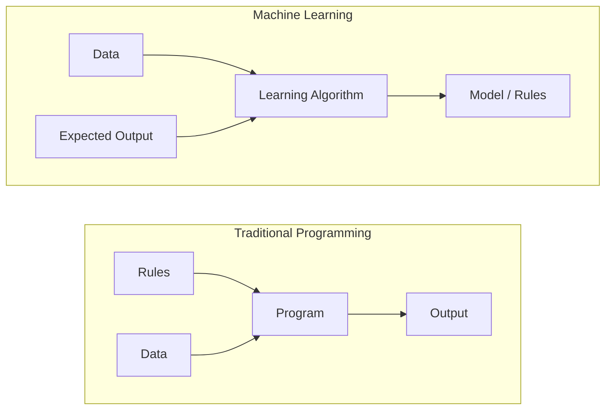
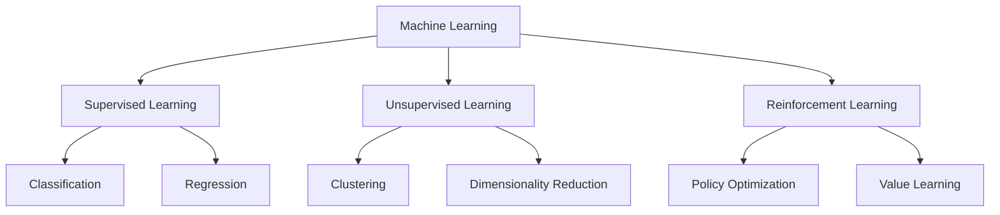
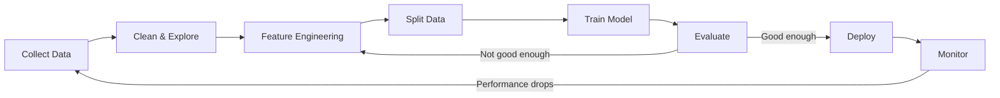
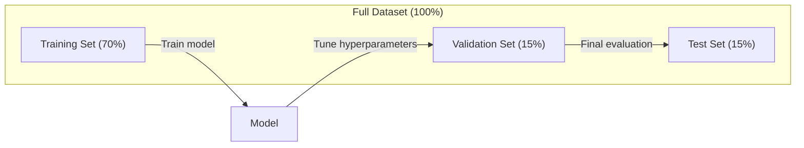
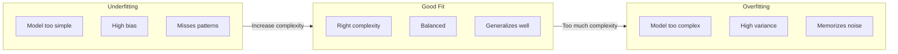
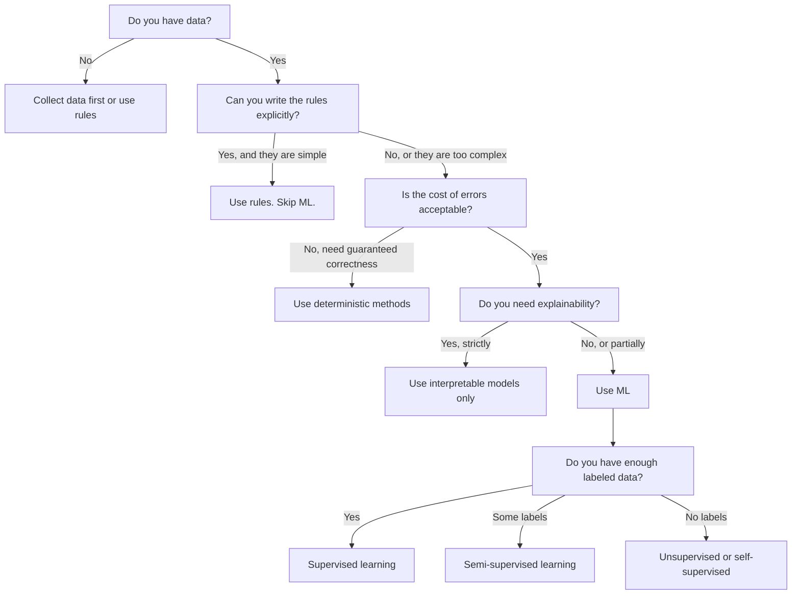

# Học máy là gì

> Học máy là dạy máy tính tìm các mẫu trong dữ liệu thay vì viết các quy tắc bằng tay.

**Loại:** Học
**Ngôn ngữ:** Python
**Kiến thức tiên quyết:** Giai đoạn 1 (Nền tảng Toán học)
**Thời lượng:** ~45 phút

## Mục tiêu học tập

- Giải thích sự khác biệt giữa học có giám sát, không giám sát và tăng cường và xác định loại nào áp dụng cho một vấn đề nhất định
- Triển khai một bộ phân loại centroid gần nhất từ đầu và đánh giá nó dựa trên đường cơ sở ngẫu nhiên
- Phân biệt giữa các nhiệm vụ phân loại và hồi quy và chọn hàm loss thích hợp cho từng nhiệm vụ
- Đánh giá xem một vấn đề kinh doanh nhất định có phù hợp với ML hay được giải quyết tốt hơn bằng các quy tắc xác định

## Vấn đề

Bạn muốn xây dựng một bộ lọc thư rác. Cách tiếp cận truyền thống: ngồi xuống và viết hàng trăm quy tắc. "Nếu email chứa 'TIỀN MIỄN PHÍ', hãy đánh dấu nó là thư rác. Nếu nó có nhiều hơn 3 dấu chấm than, hãy đánh dấu nó là spam." Bạn dành hàng tuần để viết các quy tắc. Sau đó, những kẻ gửi thư rác thay đổi từ ngữ của họ. Các quy tắc của bạn gặp lỗi. Bạn viết nhiều quy tắc hơn. Chu kỳ không bao giờ kết thúc.

Học máy lật ngược điều này. Thay vì viết các quy tắc, bạn cung cấp cho máy tính hàng ngàn email được dán nhãn ("spam" hoặc "không phải spam") và để nó tự tìm ra các quy tắc. Máy tính tìm thấy các mẫu mà bạn chưa bao giờ nghĩ đến. Khi những kẻ gửi thư rác thay đổi chiến thuật, bạn huấn luyện lại dữ liệu mới thay vì viết lại mã.

Sự thay đổi từ "quy tắc lập trình" sang "học từ dữ liệu" là cốt lõi của học máy. Mọi công cụ đề xuất, trợ lý giọng nói, xe tự lái và model ngôn ngữ đều hoạt động theo cách này.

## Khái niệm

### Học hỏi từ dữ liệu, không phải quy tắc

Lập trình truyền thống và máy học giải quyết vấn đề theo các hướng ngược lại.



Lập trình truyền thống: bạn viết các quy tắc. Chương trình áp dụng chúng cho dữ liệu để tạo ra đầu ra.

Học máy: bạn cung cấp dữ liệu và kết quả đầu ra dự kiến. Thuật toán khám phá các quy tắc.

"model" xuất hiện từ training LÀ các quy tắc, được mã hóa dưới dạng số (trọng số, parameters). Nó khái quát hóa từ các ví dụ mà nó đã thấy để đưa ra dự đoán về dữ liệu mà nó chưa từng thấy.

### Ba loại máy học



**Học có giám sát**: Bạn có các cặp đầu vào-đầu ra. model học cách ánh xạ đầu vào với đầu ra.
- "Đây là 10.000 bức ảnh được dán nhãn mèo hoặc chó. Học cách phân biệt chúng."
- "Đây là features nhà và giá cả. Học cách dự đoán giá."

**Học không giám sát**: Bạn chỉ có đầu vào. Không có nhãn. model tự tìm thấy cấu trúc.
- "Đây là 10.000 lịch sử mua hàng của khách hàng. Tìm các nhóm tự nhiên."
- "Đây là 1.000 điểm dữ liệu chiều. Giảm xuống 2 chiều trong khi vẫn giữ cấu trúc."

**Học tăng cường**: Một agent thực hiện các hành động trong một môi trường và nhận được phần thưởng hoặc hình phạt. Nó học một chiến lược (policy) để tối đa hóa tổng phần thưởng.
- "Chơi trò chơi này. +1 khi thắng, -1 khi thua. Hãy tìm ra một chiến lược."
- "Điều khiển cánh tay robot này. +1 khi nhặt đồ vật, -0.01 cho mỗi giây lãng phí."

Hầu hết những gì bạn sẽ xây dựng trong thực tế đều sử dụng học có giám sát. Học không giám sát là phổ biến để tiền xử lý và khám phá. Học tăng cường hỗ trợ AI trò chơi, robot và RLHF cho models ngôn ngữ.

### Ngoài ba Big Three

Ba loại trên là sạch, nhưng ML trong thế giới thực thường làm mờ ranh giới.

**Học bán giám sát** sử dụng một tập hợp nhỏ dữ liệu được gắn nhãn và một tập hợp lớn dữ liệu không được gắn nhãn. Bạn có thể có 100 hình ảnh y tế được gắn nhãn và 100.000 hình ảnh không được dán nhãn. Các kỹ thuật bao gồm:

- **Lan truyền nhãn:** Xây dựng biểu đồ kết nối các điểm dữ liệu tương tự. Nhãn lan rộng từ các nút được gắn nhãn đến các nút lân cận không được gắn nhãn thông qua biểu đồ.
- **Giả gắn nhãn:** Huấn luyện một model trên dữ liệu được gắn nhãn, sử dụng nó để dự đoán nhãn cho dữ liệu không được gắn nhãn, sau đó huấn luyện lại mọi thứ. model khởi động bộ training của riêng mình.
- **Chính quy hóa tính nhất quán: **model sẽ đưa ra dự đoán tương tự cho một đầu vào và một phiên bản hơi bị nhiễu loạn của đầu vào đó. Điều này hoạt động ngay cả khi không có nhãn.

**Học tự giám sát** tạo ra sự giám sát từ chính dữ liệu. Không cần nhãn con người nào cả. model tạo nhiệm vụ dự đoán của riêng mình từ cấu trúc của dữ liệu.

- **Mô hình ngôn ngữ mặt nạ (BERT):** Ẩn 15% từ trong câu, huấn luyện model dự đoán các từ bị thiếu. Các "nhãn" đến từ văn bản gốc.
- **Học tương phản (SimCLR):** Chụp ảnh, tạo hai phiên bản tăng cường. Huấn luyện model nhận ra chúng đến từ cùng một hình ảnh trong khi phân biệt chúng với các phiên bản tăng cường của các hình ảnh khác.
- **Dự đoán token tiếp theo (GPT):** Dự đoán từ tiếp theo cho tất cả các từ trước đó. Mỗi tài liệu văn bản đều trở thành một ví dụ training.

Đây không phải là những danh mục riêng biệt với ba loại lớn. Chúng là những chiến lược kết hợp các ý tưởng có giám sát và không giám sát. Việc học tự giám sát được giám sát về mặt kỹ thuật (model dự đoán điều gì đó), nhưng nhãn được tạo tự động, không phải bởi con người.

### Phân loại vs Hồi quy

Đây là hai nhiệm vụ học tập có giám sát chính.

| Khía cạnh | Phân loại | Hồi quy |
|--------|---------------|------------|
| Đầu ra | Thể loại rời rạc | Số liên tục |
| Ví dụ | "Đây có phải là thư rác không?" | "Giá nhà sẽ là bao nhiêu?" |
| Không gian đầu ra | {mèo, chó, chim} | Bất kỳ số thực nào |
| Chức năng Loss | Entropy chéo, accuracy | Sai số bình phương trung bình, MAE |
| Quyết định | Ranh giới giữa classes | Một đường cong phù hợp với dữ liệu |

Phân loại trả lời "loại nào?" Hồi quy trả lời "bao nhiêu?"

Một số vấn đề có thể được đóng khung theo cách nào đó. Dự đoán một cổ phiếu tăng hay giảm là phân loại. Dự đoán giá chính xác là hồi quy.

### Quy trình làm việc ML

Mọi dự án machine learning đều tuân theo cùng một pipeline, bất kể thuật toán nào.



**Thu thập dữ liệu**: Thu thập dữ liệu thô. Nhiều dữ liệu hơn hầu như luôn tốt hơn, nhưng chất lượng quan trọng hơn số lượng.

**Dọn dẹp & Khám phá**: Xử lý các giá trị bị thiếu, loại bỏ các giá trị trùng lặp, trực quan hóa các phân phối, phát hiện các điểm bất thường. Bước này thường chiếm 60-80% tổng thời gian dự án.

**Feature Engineering**: Chuyển đổi dữ liệu thô thành features model có thể sử dụng. Biến ngày thành ngày trong tuần. Chuẩn hóa các cột số. Mã hóa các biến phân loại. Tốt features quan trọng hơn các thuật toán ưa thích.

**Tách dữ liệu**: Chia thành các bộ training, xác thực và kiểm tra. model huấn luyện trên dữ liệu training, bạn điều chỉnh hyperparameters dữ liệu xác thực và báo cáo hiệu suất cuối cùng trên dữ liệu thử nghiệm.

**Huấn luyện Model**: Cung cấp dữ liệu training vào một thuật toán. Thuật toán điều chỉnh parameters bên trong để giảm thiểu chức năng loss.

**Đánh giá**: Đo lường hiệu suất trên dữ liệu validation/test. Nếu hiệu suất không được chấp nhận, hãy quay lại và thử các features, thuật toán hoặc hyperparameters khác.

**Triển khai**: Đưa model vào production nơi nó đưa ra dự đoán về dữ liệu mới.

**Màn hình**: Theo dõi hiệu suất theo thời gian. Phân phối dữ liệu thay đổi (trôi dữ liệu) và models suy giảm. Khi hiệu suất giảm, hãy huấn luyện lại.

### Phân tách Training, xác thực và thử nghiệm

Đây là khái niệm quan trọng nhất mà người mới bắt đầu mắc sai lầm. Bạn phải đánh giá model của mình trên dữ liệu mà nó chưa từng thấy trong training. Nếu không, bạn đang đo lường khả năng ghi nhớ, không phải học hỏi.



| Tách | Mục đích | Khi sử dụng | Kích thước điển hình |
|-------|---------|-----------|-------------|
| Training | Model học hỏi từ dữ liệu này | Trong quá trình training | 60-80% |
| Xác nhận | Điều chỉnh hyperparameters, so sánh models | Sau mỗi training chạy | 10-20% |
| Kiểm tra | Ước tính hiệu suất không thiên vị cuối cùng | Một lần, cuối cùng | 10-20% |

Bộ bài kiểm tra là thiêng liêng. Bạn nhìn vào nó chính xác một lần. Nếu bạn tiếp tục điều chỉnh model của mình dựa trên hiệu suất thử nghiệm, bạn đang training một cách hiệu quả trên bộ thử nghiệm và các con số được báo cáo của bạn là vô nghĩa.

Đối với datasets nhỏ, hãy sử dụng xác thực chéo k-fold: chia dữ liệu thành k phần, huấn luyện trên các phần k-1, xác thực trên phần còn lại, xoay và kết quả trung bình.

### Overfitting so với Underfitting



**Underfitting**: model quá đơn giản để nắm bắt các mẫu trong dữ liệu. Một đường thẳng cố gắng phù hợp với một mối quan hệ cong. Training số cao. Sai số thử nghiệm cao.

**Overfitting**: model quá phức tạp và ghi nhớ dữ liệu training, bao gồm cả nhiễu của nó. Một đường cong lắc lư đi qua mọi điểm training nhưng không thành công trên dữ liệu mới. Training số thấp. Sai số thử nghiệm cao.

**Phù hợp**: model ghi lại các mẫu thực mà không ghi nhớ nhiễu. Lỗi Training và lỗi thử nghiệm đều khá thấp.

Dấu hiệu của overfitting:
- Training accuracy cao hơn nhiều so với xác thực accuracy
- model hoạt động tốt trên dữ liệu training nhưng kém trên dữ liệu mới
- Thêm nhiều training dữ liệu giúp cải thiện hiệu suất (model là ghi nhớ chứ không phải học)

Các bản sửa lỗi cho overfitting:
- Nhận thêm dữ liệu training
- Giảm độ phức tạp của model (ít parameters hơn, kiến trúc đơn giản hơn)
- Quy tắc hóa (thêm hình phạt cho tạ lớn)
- Dropout (ngẫu nhiên loại bỏ các tế bào thần kinh trong quá trình training)
- Dừng sớm (dừng training khi lỗi xác thực bắt đầu tăng)

Các bản sửa lỗi cho underfitting:
- Sử dụng model phức tạp hơn
- Thêm nhiều features
- Giảm chính quy hóa
- Huấn luyện lâu hơn

### Sự đánh đổi Bias-Variance

Đây là framework toán học đằng sau overfitting và underfitting.

**Bias**: Lỗi từ các giả định sai trong model. Một model tuyến tính có bias cao khi mối quan hệ thực sự là phi tuyến tính. bias cao dẫn đến underfitting.

**Variance**: Lỗi từ độ nhạy đến những dao động nhỏ trong dữ liệu training. Một model có variance cao đưa ra các dự đoán rất khác nhau khi được huấn luyện trên các tập hợp con dữ liệu khác nhau. variance cao dẫn đến overfitting.

| Model độ phức tạp | Bias | Variance | Kết quả |
|-----------------|------|----------|--------|
| Quá thấp (model tuyến tính đối với dữ liệu cong) | Cao | Thấp | Underfitting |
| Vừa phải | Trung bình | Trung bình | Khái quát hóa tốt |
| Quá cao (đa thức độ 20 cho 10 điểm) | Thấp | Cao | Overfitting |

Tổng sai số = Bias^2 + Variance + Nhiễu không thể giảm

Bạn không thể giảm nhiễu không thể giảm thiểu (đó là tính ngẫu nhiên trong chính dữ liệu). Bạn muốn tìm điểm ngọt ngào nơi giảm thiểu bias^2 + variance.

### Không có định lý bữa trưa miễn phí

Không có thuật toán duy nhất hoạt động tốt nhất cho mọi vấn đề. Một thuật toán hoạt động tốt trên một class vấn đề sẽ hoạt động kém trên một  vấn đề khác. Đây là lý do tại sao các nhà khoa học dữ liệu thử nhiều thuật toán và so sánh kết quả.

Trong thực tế, sự lựa chọn phụ thuộc vào:
- Lượng dữ liệu bạn có
- Có bao nhiêu features
- Mối quan hệ là tuyến tính hay phi tuyến tính
- Cho dù bạn cần khả năng giải thích
- Bạn có thể chi trả bao nhiêu điện toán

### Khi nào KHÔNG sử dụng Machine Learning

ML mạnh mẽ nhưng không phải lúc nào cũng là công cụ phù hợp. Trước khi lấy một model, hãy hỏi xem bạn có thực sự cần một cái hay không.

**Không sử dụng ML khi:**

- **Quy tắc đơn giản và được xác định rõ ràng.** Tính thuế, thuật toán sắp xếp, chuyển đổi đơn vị. Nếu bạn có thể viết logic trong một vài câu lệnh if, một model sẽ làm tăng thêm độ phức tạp mà không có lợi ích.
- **Bạn không có dữ liệu hoặc rất ít dữ liệu.** ML cần các ví dụ để học hỏi. Với 10 điểm dữ liệu, bạn không thể huấn luyện bất cứ thứ gì có ý nghĩa. Thu thập dữ liệu trước.
- **Cái giá của việc sai là thảm họa và bạn cần đảm bảo tính chính xác. **Tính toán liều lượng y tế, kiểm soát lò phản ứng hạt nhân, xác minh mật mã. ML models là xác suất. Đôi khi họ sẽ sai. Nếu "đôi khi sai" là không thể chấp nhận được, hãy sử dụng các phương pháp xác định.
- **Bảng tra cứu hoặc heuristic giải quyết vấn đề.** Nếu một ngưỡng hoặc bảng đơn giản bao gồm 99% trường hợp, việc thêm ML sẽ làm tăng chi phí bảo trì mà không có sự cải thiện đáng kể.
- **Bạn không thể giải thích quyết định và cần có khả năng giải thích.** Các ngành công nghiệp được quản lý (cho vay, bảo hiểm, tư pháp hình sự) đôi khi yêu cầu mọi quyết định đều có thể giải thích đầy đủ. Một số ML models có thể giải thích được (hồi quy tuyến tính, cây quyết định nhỏ). Hầu hết thì không.
- **Vấn đề thay đổi nhanh hơn bạn có thể huấn luyện lại.** Nếu các quy tắc thay đổi hàng ngày và huấn luyện lại mất một tuần, model luôn cũ.

Sử dụng sơ đồ quyết định này:



## Tự xây dựng

Mã trong `code/ml_intro.py` thực hiện một bộ phân loại centroid gần nhất từ đầu, thuật toán ML đơn giản nhất có thể. Nó thể hiện ý tưởng cốt lõi: học hỏi từ dữ liệu, sau đó dự đoán trên dữ liệu mới.

### Bước 1: Bộ phân loại Centroid gần nhất từ đầu

Bộ phân loại tâm gần nhất tính toán tâm (trung bình) của mỗi class trong dữ liệu training. Để dự đoán, nó gán mỗi điểm mới cho class có tâm gần nhất.

```python
class NearestCentroid:
    def fit(self, X, y):
        self.classes = np.unique(y)
        self.centroids = np.array([
            X[y == c].mean(axis=0) for c in self.classes
        ])

    def predict(self, X):
        distances = np.array([
            np.sqrt(((X - c) ** 2).sum(axis=1))
            for c in self.centroids
        ])
        return self.classes[distances.argmin(axis=0)]
```

Đó là toàn bộ thuật toán. Fit tính toán hai phương tiện. Dự đoán khoảng cách tính toán. Không gradient descent, không lặp lại, không hyperparameters.

### Bước 2: Huấn luyện về dữ liệu tổng hợp

Chúng ta tạo ra một dataset phân loại 2D với hai classes chồng lên nhau một chút. Bộ phân loại tâm vẽ ranh giới quyết định tuyến tính giữa các tâm class.

```python
rng = np.random.RandomState(42)
X_class0 = rng.randn(100, 2) + np.array([1.0, 1.0])
X_class1 = rng.randn(100, 2) + np.array([-1.0, -1.0])
X = np.vstack([X_class0, X_class1])
y = np.array([0] * 100 + [1] * 100)
```

### Bước 3: So sánh với đường cơ sở

Mỗi ML model nên được so sánh với một đường cơ sở tầm thường. Ở đây, đường cơ sở dự đoán một class ngẫu nhiên. Nếu ML model của bạn không đánh bại được việc đoán ngẫu nhiên, có điều gì đó không ổn.

```python
baseline_preds = rng.choice([0, 1], size=len(y_test))
baseline_acc = np.mean(baseline_preds == y_test)
```

Bộ phân loại centroid sẽ nhận được khoảng 90% + accuracy trên dataset sạch này. Đường cơ sở ngẫu nhiên nhận được khoảng 50%.

### Tại sao điều này lại quan trọng

Bộ phân loại centroid gần nhất rất đơn giản. Nó không có hyperparameters, không có sự lặp lại, không có gradient descent. Tuy nhiên, nó nắm bắt được mô hình ML cơ bản:

1. **Tìm hiểu** biểu diễn từ dữ liệu training (các tâm tâm)
2. **Dự đoán** trên dữ liệu mới bằng cách sử dụng biểu diễn đó (khoảng cách gần nhất)
3. **Đánh giá** dựa trên đường cơ sở (đoán ngẫu nhiên)

Mọi thuật toán ML, từ hồi quy logistic đến transformers, đều tuân theo cùng một mô hình ba bước này. Biểu diễn trở nên phức tạp hơn, nhưng quy trình làm việc vẫn giữ nguyên.

### Bước 4: Bộ phân loại Centroid không thể làm gì

Bộ phân loại centroid gần nhất giả định mỗi class tạo thành một blob duy nhất. Nó vẽ ranh giới quyết định tuyến tính. Nó không thành công khi:

- Classes có nhiều cụm (ví dụ: chữ số "1" có thể được viết theo nhiều cách khác nhau)
- Ranh giới quyết định là phi tuyến tính (ví dụ: một class bao quanh một  khác)
- Features có thang đo rất khác nhau (khoảng cách bị chi phối bởi feature quy mô lớn nhất)

Những hạn chế này thúc đẩy mọi thuật toán khác mà bạn sẽ học. K-láng giềng gần nhất xử lý nhiều cụm. Cây quyết định xử lý các ranh giới phi tuyến. Feature mở rộng quy mô khắc phục sự cố quy mô. Mỗi bài học được xây dựng dựa trên những hạn chế của bài trước.

## Ứng dụng

Sklearn cung cấp các trình tạo dữ liệu tổng hợp và `NearestCentroid`:

```python
from sklearn.neighbors import NearestCentroid
from sklearn.datasets import make_classification
from sklearn.model_selection import train_test_split

X, y = make_classification(
    n_samples=500, n_features=2, n_redundant=0,
    n_clusters_per_class=1, random_state=42
)
X_train, X_test, y_train, y_test = train_test_split(X, y, test_size=0.3)

clf = NearestCentroid()
clf.fit(X_train, y_train)
print(f"Accuracy: {clf.score(X_test, y_test):.3f}")
```

## Sản phẩm bàn giao

Bài học này tạo ra `outputs/prompt-ml-problem-framer.md` - một prompt biến các vấn đề kinh doanh mơ hồ thành các nhiệm vụ ML cụ thể. Mô tả vấn đề ("chúng tôi muốn giảm tỷ lệ rời bỏ" hoặc "dự đoán nhu cầu cho quý tới") và nó xác định loại học tập, xác định mục tiêu dự đoán, liệt kê features ứng viên, chọn số liệu thành công, thiết lập đường cơ sở và gắn cờ các cạm bẫy như rò rỉ dữ liệu hoặc class imbalance. Sử dụng nó khi bắt đầu bất kỳ dự án ML nào để tránh xây dựng sai.

## Thuật ngữ chính

| Thuật ngữ | Những gì mọi người nói | Ý nghĩa thực sự của nó |
|------|----------------|----------------------|
| Model | "Người AI" | Một hàm toán học với parameters có thể học được ánh xạ đầu vào với đầu ra |
| Training | "Giảng dạy AI" | Chạy thuật toán tối ưu hóa để điều chỉnh model parameters sao cho các dự đoán khớp với đầu ra đã biết |
| Feature | "Cột đầu vào" | Một thuộc tính có thể đo lường được của dữ liệu mà model sử dụng để đưa ra dự đoán |
| Nhãn | "Câu trả lời" | Đầu ra đã biết cho một ví dụ training, được sử dụng để tính toán tín hiệu lỗi |
| Hyperparameter | "Một cài đặt bạn điều chỉnh" | Một parameter được đặt trước training kiểm soát process học tập (learning rate, số lớp) |
| Chức năng Loss | "Làm thế nào sai model" | Một hàm đo khoảng cách giữa đầu ra dự đoán và thực tế mà training cố gắng giảm thiểu |
| Overfitting | "Nó ghi nhớ bài kiểm tra" | model học nhiễu cụ thể của training thay vì các mẫu chung, vì vậy nó không thành công trên dữ liệu mới |
| Underfitting | "Nó không học được gì" | model quá đơn giản để nắm bắt các mẫu thực trong dữ liệu |
| Tổng quát hóa | "Nó hoạt động trên dữ liệu mới" | Khả năng đưa ra dự đoán chính xác của model về dữ liệu mà nó không được huấn luyện |
| Xác thực chéo | "Thử nghiệm trên các phần khác nhau" | Liên tục chia dữ liệu thành train/test lần và tính trung bình kết quả, đưa ra ước tính hiệu suất mạnh mẽ hơn |
| Chính quy hóa | "Giữ tạ nhỏ" | Thêm một thuật ngữ hình phạt vào hàm loss không khuyến khích models quá phức tạp |
| Dữ liệu trôi dạt | "Thế giới đã thay đổi" | Phân phối thống kê của dữ liệu đến thay đổi theo thời gian, làm giảm hiệu suất model |

## Bài tập

1. Lấy bất kỳ dataset nào (ví dụ: Iris, Titanic). Chia nó 70/15/15 thành train/validation/test. Giải thích lý do tại sao bạn không nên điều chỉnh hyperparameters trên bộ kiểm tra.
2. Liệt kê ba vấn đề trong thế giới thực. Đối với mỗi loại, hãy xác định xem đó là phân loại, hồi quy hay phân cụm và liệu nó được giám sát hay không được giám sát.
3. Một model nhận được 99% accuracy trên dữ liệu training nhưng 60% trên dữ liệu thử nghiệm. Chẩn đoán vấn đề và liệt kê ba điều bạn sẽ cố gắng khắc phục.

## Đọc thêm

- [An Introduction to Statistical Learning](https://www.statlearning.com/) - sách giáo khoa miễn phí bao gồm tất cả các phương pháp ML cổ điển với các ví dụ thực tế
- [Google's Machine Learning Crash Course](https://developers.google.com/machine-learning/crash-course) - giới thiệu trực quan ngắn gọn về các khái niệm ML
- [Scikit-learn User Guide](https://scikit-learn.org/stable/user_guide.html) - tài liệu tham khảo thực tiễn để triển khai ML trong Python
