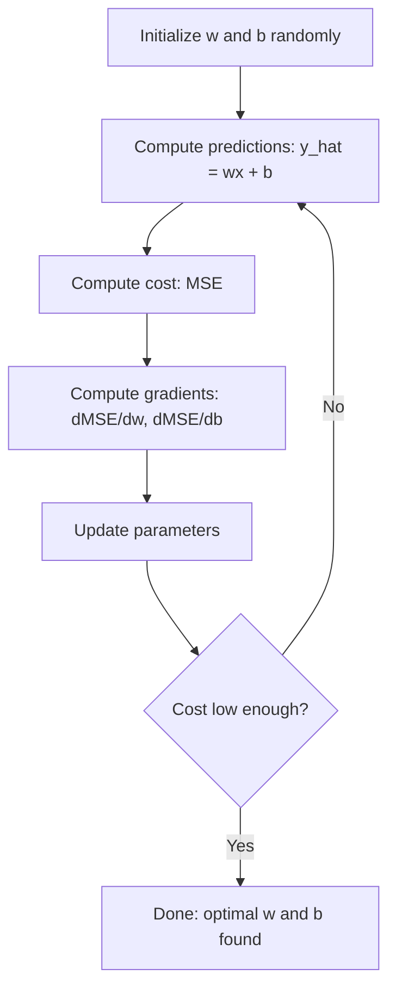

# Hồi quy tuyến tính

> Hồi quy tuyến tính vẽ đường thẳng tốt nhất qua dữ liệu của bạn. Đó là "thế giới xin chào" của học máy.

**Loại:** Xây dựng
**Ngôn ngữ:** Python
**Kiến thức tiên quyết:** Giai đoạn 1 (Đại số tuyến tính, Giải tích, Tối ưu hóa), Giai đoạn 2 Bài 1
**Thời lượng:** ~90 phút

## Mục tiêu học tập

- Lấy các quy tắc cập nhật gradient descent cho lỗi bình phương trung bình và thực hiện hồi quy tuyến tính từ đầu
- So sánh gradient descent và phương trình bình thường về độ phức tạp tính toán và thời điểm sử dụng
- Xây dựng một model hồi quy tuyến tính bội số với tiêu chuẩn hóa feature và diễn giải trọng số đã học
- Giải thích cách hồi quy Ridge (chính quy hóa L2) ngăn chặn overfitting bằng cách phạt trọng số lớn

## Vấn đề

Bạn có dữ liệu: kích thước nhà và giá bán của chúng. Bạn muốn dự đoán giá của một ngôi nhà mới dựa trên kích thước của nó. Bạn có thể để mắt đến nó trên một biểu đồ phân tán, nhưng bạn cần một công thức. Bạn cần một dòng phù hợp nhất với dữ liệu để bạn có thể cắm vào bất kỳ kích thước nào và nhận được dự đoán giá.

Hồi quy tuyến tính cung cấp cho bạn đường đó. Quan trọng hơn, nó giới thiệu toàn bộ vòng lặp ML training: xác định model, xác định hàm chi phí, tối ưu hóa parameters. Mọi thuật toán ML đều tuân theo cùng một mô hình này. Nắm vững nó ở đây với trường hợp đơn giản nhất, và bạn sẽ nhận ra nó ở khắp mọi nơi.

Điều này không chỉ dành cho các vấn đề đơn giản. Hồi quy tuyến tính được sử dụng trong các hệ thống production để dự báo nhu cầu, phân tích thử nghiệm A/B, mô hình hóa tài chính và làm cơ sở cho mọi nhiệm vụ hồi quy.

## Khái niệm

### Các Model

Hồi quy tuyến tính giả định mối quan hệ tuyến tính giữa đầu vào (x) và đầu ra (y):

```
y = wx + b
```

- `w` (weight/slope): Y thay đổi bao nhiêu khi x tăng 1
- `b` (bias/intercept): giá trị của y khi x = 0

Đối với nhiều đầu vào (features), điều này mở rộng đến:

```
y = w1*x1 + w2*x2 + ... + wn*xn + b
```

Hoặc ở dạng vector: `y = w^T * x + b`

Mục tiêu: tìm các giá trị của w và b làm cho y dự đoán càng gần với y thực tế càng tốt trên tất cả training ví dụ.

### Hàm chi phí (Sai số bình phương trung bình)

Làm thế nào để bạn đo lường "càng gần càng tốt"? Bạn cần một con số duy nhất ghi lại mức độ sai của dự đoán. Lựa chọn phổ biến nhất là Sai số bình phương trung bình (MSE):

```
MSE = (1/n) * sum((y_predicted - y_actual)^2)
```

Tại sao bình phương? Hai lý do. Đầu tiên, nó phạt lỗi lớn nhiều hơn lỗi nhỏ (lỗi 10 kém hơn 100 lần so với lỗi 1 chứ không phải 10x). Thứ hai, hàm bình phương mượt mà và có thể phân biệt được ở mọi nơi, giúp việc tối ưu hóa trở nên đơn giản.

Hàm chi phí tạo ra một bề mặt. Đối với một trọng lượng w và bias b, bề mặt MSE trông giống như một cái bát (một parabol lồi). Đáy bát là nơi giảm thiểu MSE. Training có nghĩa là tìm đáy đó.

### Gradient Descent

Gradient descent tìm thấy đáy bát bằng cách bước xuống dốc.



Các gradients cho bạn biết hai điều: di chuyển theo hướng nào mỗi parameter và di chuyển bao nhiêu.

Đối với MSE có y_hat = wx + b:

```
dMSE/dw = (2/n) * sum((y_hat - y) * x)
dMSE/db = (2/n) * sum(y_hat - y)
```

Quy tắc cập nhật:

```
w = w - learning_rate * dMSE/dw
b = b - learning_rate * dMSE/db
```

learning rate kiểm soát kích thước bước. Quá lớn: bạn vượt quá mức tối thiểu và phân kỳ. Quá nhỏ: training mất mãi mãi. Giá trị bắt đầu điển hình: 0,01, 0,001 hoặc 0,0001.

### Phương trình bình thường (giải pháp dạng đóng)

Cụ thể đối với hồi quy tuyến tính, có một công thức trực tiếp đưa ra trọng số tối ưu mà không cần bất kỳ sự lặp lại nào:

```
w = (X^T * X)^(-1) * X^T * y
```

Điều này đảo ngược một ma trận để giải cho w trong một bước. Nó hoạt động hoàn hảo cho datasets nhỏ. Đối với datasets lớn (hàng triệu hàng hoặc hàng nghìn features), gradient descent được ưu tiên hơn vì đảo ngược ma trận là O (n ^ 3) trong số features.

### Hồi quy tuyến tính đa

Với nhiều features, model trở thành:

```
y = w1*x1 + w2*x2 + ... + wn*xn + b
```

Mọi thứ hoạt động giống nhau: MSE là hàm chi phí gradient descent cập nhật đồng thời tất cả các trọng số. Sự khác biệt duy nhất là bạn đang lắp một siêu mặt phẳng thay vì một đường thẳng.

Feature vấn đề mở rộng quy mô ở đây. Nếu một feature nằm trong khoảng từ 0 đến 1 và một  khác nằm trong khoảng từ 0 đến 1.000.000, gradient descent sẽ gặp khó khăn vì bề mặt chi phí trở nên kéo dài. Chuẩn hóa features (trừ giá trị trung bình, chia cho độ lệch chuẩn) trước khi training.

### Hồi quy đa thức

Điều gì sẽ xảy ra nếu mối quan hệ không tuyến tính? Bạn vẫn có thể sử dụng hồi quy tuyến tính bằng cách tạo features đa thức:

```
y = w1*x + w2*x^2 + w3*x^3 + b
```

Đây vẫn là hồi quy "tuyến tính" vì model là tuyến tính trong trọng số (w1, w2, w3). Bạn chỉ đang sử dụng features phi tuyến của x.

Đa thức bậc cao hơn có thể phù hợp với các đường cong phức tạp hơn nhưng rủi ro overfitting. Một đa thức bậc 10 sẽ đi qua mọi điểm trong dataset 10 điểm nhưng dự đoán kém trên dữ liệu mới.

### Điểm R bình phương

MSE cho bạn biết bạn sai như thế nào, nhưng số phụ thuộc vào thang đo của y. R-bình phương (R^2) đưa ra một thước đo không phụ thuộc vào tỷ lệ:

```
R^2 = 1 - (sum of squared residuals) / (sum of squared deviations from mean)
    = 1 - SS_res / SS_tot
```

- R^2 = 1.0: dự đoán hoàn hảo
- R^2 = 0,0: model không tốt hơn dự đoán giá trị trung bình mỗi lần
- R^2 < 0,0: model kém hơn dự đoán giá trị trung bình

### Xem trước chính quy hóa (hồi quy Ridge)

Khi bạn có nhiều features, model có thể quá khớp bằng cách gán trọng lượng lớn. Hồi quy Ridge (chính quy hóa L2) thêm một hình phạt:

```
Cost = MSE + lambda * sum(w_i^2)
```

Thời hạn hình phạt không khuyến khích trọng lượng lớn. hyperparameter lambda kiểm soát sự đánh đổi: lambda cao hơn có nghĩa là trọng lượng nhỏ hơn và chính quy hóa hơn. Điều này được đề cập sâu trong bài học sau. Bây giờ, hãy biết rằng nó tồn tại và tại sao nó hữu ích.

```figure
linear-regression-fit
```

## Tự xây dựng

### Bước 1: Tạo dữ liệu mẫu

```python
import random
import math

random.seed(42)

TRUE_W = 3.0
TRUE_B = 7.0
N_SAMPLES = 100

X = [random.uniform(0, 10) for _ in range(N_SAMPLES)]
y = [TRUE_W * x + TRUE_B + random.gauss(0, 2.0) for x in X]

print(f"Generated {N_SAMPLES} samples")
print(f"True relationship: y = {TRUE_W}x + {TRUE_B} (+ noise)")
print(f"First 5 points: {[(round(X[i], 2), round(y[i], 2)) for i in range(5)]}")
```

### Bước 2: Hồi quy tuyến tính từ đầu với gradient descent

```python
class LinearRegression:
    def __init__(self, learning_rate=0.01):
        self.w = 0.0
        self.b = 0.0
        self.lr = learning_rate
        self.cost_history = []

    def predict(self, X):
        return [self.w * x + self.b for x in X]

    def compute_cost(self, X, y):
        predictions = self.predict(X)
        n = len(y)
        cost = sum((pred - actual) ** 2 for pred, actual in zip(predictions, y)) / n
        return cost

    def compute_gradients(self, X, y):
        predictions = self.predict(X)
        n = len(y)
        dw = (2 / n) * sum((pred - actual) * x for pred, actual, x in zip(predictions, y, X))
        db = (2 / n) * sum(pred - actual for pred, actual in zip(predictions, y))
        return dw, db

    def fit(self, X, y, epochs=1000, print_every=200):
        for epoch in range(epochs):
            dw, db = self.compute_gradients(X, y)
            self.w -= self.lr * dw
            self.b -= self.lr * db
            cost = self.compute_cost(X, y)
            self.cost_history.append(cost)
            if epoch % print_every == 0:
                print(f"  Epoch {epoch:4d} | Cost: {cost:.4f} | w: {self.w:.4f} | b: {self.b:.4f}")
        return self

    def r_squared(self, X, y):
        predictions = self.predict(X)
        y_mean = sum(y) / len(y)
        ss_res = sum((actual - pred) ** 2 for actual, pred in zip(y, predictions))
        ss_tot = sum((actual - y_mean) ** 2 for actual in y)
        return 1 - (ss_res / ss_tot)


print("=== Training Linear Regression (Gradient Descent) ===")
model = LinearRegression(learning_rate=0.005)
model.fit(X, y, epochs=1000, print_every=200)
print(f"\nLearned: y = {model.w:.4f}x + {model.b:.4f}")
print(f"True:    y = {TRUE_W}x + {TRUE_B}")
print(f"R-squared: {model.r_squared(X, y):.4f}")
```

### Bước 3: Phương trình chuẩn (nghiệm dạng đóng)

```python
class LinearRegressionNormal:
    def __init__(self):
        self.w = 0.0
        self.b = 0.0

    def fit(self, X, y):
        n = len(X)
        x_mean = sum(X) / n
        y_mean = sum(y) / n
        numerator = sum((X[i] - x_mean) * (y[i] - y_mean) for i in range(n))
        denominator = sum((X[i] - x_mean) ** 2 for i in range(n))
        self.w = numerator / denominator
        self.b = y_mean - self.w * x_mean
        return self

    def predict(self, X):
        return [self.w * x + self.b for x in X]

    def r_squared(self, X, y):
        predictions = self.predict(X)
        y_mean = sum(y) / len(y)
        ss_res = sum((actual - pred) ** 2 for actual, pred in zip(y, predictions))
        ss_tot = sum((actual - y_mean) ** 2 for actual in y)
        return 1 - (ss_res / ss_tot)


print("\n=== Normal Equation (Closed-Form) ===")
model_normal = LinearRegressionNormal()
model_normal.fit(X, y)
print(f"Learned: y = {model_normal.w:.4f}x + {model_normal.b:.4f}")
print(f"R-squared: {model_normal.r_squared(X, y):.4f}")
```

### Bước 4: Hồi quy tuyến tính nhiều

```python
class MultipleLinearRegression:
    def __init__(self, n_features, learning_rate=0.01):
        self.weights = [0.0] * n_features
        self.bias = 0.0
        self.lr = learning_rate
        self.cost_history = []

    def predict_single(self, x):
        return sum(w * xi for w, xi in zip(self.weights, x)) + self.bias

    def predict(self, X):
        return [self.predict_single(x) for x in X]

    def compute_cost(self, X, y):
        predictions = self.predict(X)
        n = len(y)
        return sum((pred - actual) ** 2 for pred, actual in zip(predictions, y)) / n

    def fit(self, X, y, epochs=1000, print_every=200):
        n = len(y)
        n_features = len(X[0])
        for epoch in range(epochs):
            predictions = self.predict(X)
            errors = [pred - actual for pred, actual in zip(predictions, y)]
            for j in range(n_features):
                grad = (2 / n) * sum(errors[i] * X[i][j] for i in range(n))
                self.weights[j] -= self.lr * grad
            grad_b = (2 / n) * sum(errors)
            self.bias -= self.lr * grad_b
            cost = self.compute_cost(X, y)
            self.cost_history.append(cost)
            if epoch % print_every == 0:
                print(f"  Epoch {epoch:4d} | Cost: {cost:.4f}")
        return self

    def r_squared(self, X, y):
        predictions = self.predict(X)
        y_mean = sum(y) / len(y)
        ss_res = sum((actual - pred) ** 2 for actual, pred in zip(y, predictions))
        ss_tot = sum((actual - y_mean) ** 2 for actual in y)
        return 1 - (ss_res / ss_tot)


random.seed(42)
N = 100
X_multi = []
y_multi = []
for _ in range(N):
    size = random.uniform(500, 3000)
    bedrooms = random.randint(1, 5)
    age = random.uniform(0, 50)
    price = 50 * size + 10000 * bedrooms - 1000 * age + 50000 + random.gauss(0, 20000)
    X_multi.append([size, bedrooms, age])
    y_multi.append(price)


def standardize(X):
    n_features = len(X[0])
    means = [sum(X[i][j] for i in range(len(X))) / len(X) for j in range(n_features)]
    stds = []
    for j in range(n_features):
        variance = sum((X[i][j] - means[j]) ** 2 for i in range(len(X))) / len(X)
        stds.append(variance ** 0.5)
    X_scaled = []
    for i in range(len(X)):
        row = [(X[i][j] - means[j]) / stds[j] if stds[j] > 0 else 0 for j in range(n_features)]
        X_scaled.append(row)
    return X_scaled, means, stds


y_mean_val = sum(y_multi) / len(y_multi)
y_std_val = (sum((yi - y_mean_val) ** 2 for yi in y_multi) / len(y_multi)) ** 0.5
y_scaled = [(yi - y_mean_val) / y_std_val for yi in y_multi]

X_scaled, x_means, x_stds = standardize(X_multi)

print("\n=== Multiple Linear Regression (3 features) ===")
print("Features: house size, bedrooms, age")
multi_model = MultipleLinearRegression(n_features=3, learning_rate=0.01)
multi_model.fit(X_scaled, y_scaled, epochs=1000, print_every=200)

print(f"\nWeights (standardized): {[round(w, 4) for w in multi_model.weights]}")
print(f"Bias (standardized): {multi_model.bias:.4f}")
print(f"R-squared: {multi_model.r_squared(X_scaled, y_scaled):.4f}")
```

### Bước 5: Hồi quy đa thức

```python
class PolynomialRegression:
    def __init__(self, degree, learning_rate=0.01):
        self.degree = degree
        self.weights = [0.0] * degree
        self.bias = 0.0
        self.lr = learning_rate

    def make_features(self, X):
        return [[x ** (d + 1) for d in range(self.degree)] for x in X]

    def predict(self, X):
        features = self.make_features(X)
        return [sum(w * f for w, f in zip(self.weights, row)) + self.bias for row in features]

    def fit(self, X, y, epochs=1000, print_every=200):
        features = self.make_features(X)
        n = len(y)
        for epoch in range(epochs):
            predictions = [sum(w * f for w, f in zip(self.weights, row)) + self.bias for row in features]
            errors = [pred - actual for pred, actual in zip(predictions, y)]
            for j in range(self.degree):
                grad = (2 / n) * sum(errors[i] * features[i][j] for i in range(n))
                self.weights[j] -= self.lr * grad
            grad_b = (2 / n) * sum(errors)
            self.bias -= self.lr * grad_b
            if epoch % print_every == 0:
                cost = sum(e ** 2 for e in errors) / n
                print(f"  Epoch {epoch:4d} | Cost: {cost:.6f}")
        return self

    def r_squared(self, X, y):
        predictions = self.predict(X)
        y_mean = sum(y) / len(y)
        ss_res = sum((actual - pred) ** 2 for actual, pred in zip(y, predictions))
        ss_tot = sum((actual - y_mean) ** 2 for actual in y)
        return 1 - (ss_res / ss_tot)


random.seed(42)
X_poly = [x / 10.0 for x in range(0, 50)]
y_poly = [0.5 * x ** 2 - 2 * x + 3 + random.gauss(0, 1.0) for x in X_poly]

x_max = max(abs(x) for x in X_poly)
X_poly_norm = [x / x_max for x in X_poly]
y_poly_mean = sum(y_poly) / len(y_poly)
y_poly_std = (sum((yi - y_poly_mean) ** 2 for yi in y_poly) / len(y_poly)) ** 0.5
y_poly_norm = [(yi - y_poly_mean) / y_poly_std for yi in y_poly]

print("\n=== Polynomial Regression (degree 2 vs degree 5) ===")
print("True relationship: y = 0.5x^2 - 2x + 3")

print("\nDegree 2:")
poly2 = PolynomialRegression(degree=2, learning_rate=0.1)
poly2.fit(X_poly_norm, y_poly_norm, epochs=2000, print_every=500)
print(f"  R-squared: {poly2.r_squared(X_poly_norm, y_poly_norm):.4f}")

print("\nDegree 5:")
poly5 = PolynomialRegression(degree=5, learning_rate=0.1)
poly5.fit(X_poly_norm, y_poly_norm, epochs=2000, print_every=500)
print(f"  R-squared: {poly5.r_squared(X_poly_norm, y_poly_norm):.4f}")

print("\nDegree 2 fits the true curve well. Degree 5 fits training data slightly better")
print("but risks overfitting on new data.")
```

### Bước 6: Hồi quy sườn núi (chính quy hóa L2)

```python
class RidgeRegression:
    def __init__(self, n_features, learning_rate=0.01, alpha=1.0):
        self.weights = [0.0] * n_features
        self.bias = 0.0
        self.lr = learning_rate
        self.alpha = alpha

    def predict_single(self, x):
        return sum(w * xi for w, xi in zip(self.weights, x)) + self.bias

    def predict(self, X):
        return [self.predict_single(x) for x in X]

    def fit(self, X, y, epochs=1000, print_every=200):
        n = len(y)
        n_features = len(X[0])
        for epoch in range(epochs):
            predictions = self.predict(X)
            errors = [pred - actual for pred, actual in zip(predictions, y)]
            mse = sum(e ** 2 for e in errors) / n
            reg_term = self.alpha * sum(w ** 2 for w in self.weights)
            cost = mse + reg_term
            for j in range(n_features):
                grad = (2 / n) * sum(errors[i] * X[i][j] for i in range(n))
                grad += 2 * self.alpha * self.weights[j]
                self.weights[j] -= self.lr * grad
            grad_b = (2 / n) * sum(errors)
            self.bias -= self.lr * grad_b
            if epoch % print_every == 0:
                print(f"  Epoch {epoch:4d} | Cost: {cost:.4f} | L2 penalty: {reg_term:.4f}")
        return self


print("\n=== Ridge Regression (L2 Regularization) ===")
print("Same data as multiple regression, with alpha=0.1")
ridge = RidgeRegression(n_features=3, learning_rate=0.01, alpha=0.1)
ridge.fit(X_scaled, y_scaled, epochs=1000, print_every=200)
print(f"\nRidge weights: {[round(w, 4) for w in ridge.weights]}")
print(f"Plain weights: {[round(w, 4) for w in multi_model.weights]}")
print("Ridge weights are smaller (shrunk toward zero) due to the L2 penalty.")
```

## Ứng dụng

Bây giờ điều tương tự với scikit-learn, đó là những gì bạn sẽ thực sự sử dụng trong production.

```python
from sklearn.linear_model import LinearRegression as SklearnLR
from sklearn.linear_model import Ridge
from sklearn.preprocessing import PolynomialFeatures, StandardScaler
from sklearn.model_selection import train_test_split
from sklearn.metrics import mean_squared_error, r2_score
import numpy as np

np.random.seed(42)
X_sk = np.random.uniform(0, 10, (100, 1))
y_sk = 3.0 * X_sk.squeeze() + 7.0 + np.random.normal(0, 2.0, 100)

X_train, X_test, y_train, y_test = train_test_split(X_sk, y_sk, test_size=0.2, random_state=42)

lr = SklearnLR()
lr.fit(X_train, y_train)
y_pred = lr.predict(X_test)

print("=== Scikit-learn Linear Regression ===")
print(f"Coefficient (w): {lr.coef_[0]:.4f}")
print(f"Intercept (b): {lr.intercept_:.4f}")
print(f"R-squared (test): {r2_score(y_test, y_pred):.4f}")
print(f"MSE (test): {mean_squared_error(y_test, y_pred):.4f}")

poly = PolynomialFeatures(degree=2, include_bias=False)
X_poly_sk = poly.fit_transform(X_train)
X_poly_test = poly.transform(X_test)

lr_poly = SklearnLR()
lr_poly.fit(X_poly_sk, y_train)
print(f"\nPolynomial degree 2 R-squared: {r2_score(y_test, lr_poly.predict(X_poly_test)):.4f}")

scaler = StandardScaler()
X_train_scaled = scaler.fit_transform(X_train)
X_test_scaled = scaler.transform(X_test)

ridge = Ridge(alpha=1.0)
ridge.fit(X_train_scaled, y_train)
print(f"Ridge R-squared: {r2_score(y_test, ridge.predict(X_test_scaled)):.4f}")
print(f"Ridge coefficient: {ridge.coef_[0]:.4f}")
```

Việc triển khai từ đầu và học scikit của bạn tạo ra kết quả giống nhau. Sự khác biệt: scikit-learn xử lý các trường hợp biên, độ ổn định số và tối ưu hóa hiệu suất. Sử dụng thư viện cho production. Sử dụng phiên bản từ đầu để hiểu điều gì đang xảy ra.

## Sản phẩm bàn giao

Bài học này tạo ra:
- `outputs/skill-regression.md` - một skill để lựa chọn phương pháp hồi quy phù hợp dựa trên vấn đề

## Bài tập

1. Triển khai batch gradient descent, gradient descent ngẫu nhiên (SGD) và batch gradient descent nhỏ. So sánh tốc độ hội tụ trên cùng một dataset. Cái nào hội tụ nhanh nhất? Cái nào có đường cong chi phí mượt mà nhất?
2. Tạo dữ liệu từ một hàm lập phương (y = ax ^ 3 + bx ^ 2 + cx + d + nhiễu). Phù hợp với các đa thức bậc 1, 3 và 10. So sánh training R^2 và thử nghiệm R^2. overfitting trở nên rõ ràng ở mức độ nào?
3. Thực hiện hồi quy Lasso (chính quy hóa L1: hình phạt = alpha * sum(|w_i|)). Huấn luyện về dữ liệu nhà ở nhiều feature. So sánh trọng lượng nào về không so với Ridge. Tại sao L1 tạo ra các nghiệm thưa thớt trong khi L2 thì không?

## Thuật ngữ chính

| Thuật ngữ | Những gì mọi người nói | Ý nghĩa thực sự của nó |
|------|----------------|----------------------|
| Hồi quy tuyến tính | "Vẽ một đường qua dữ liệu" | Tìm trọng số w và bias b giảm thiểu tổng chênh lệch bình phương giữa wx + b và giá trị y thực tế |
| Chức năng chi phí | "model tệ như thế nào" | Một hàm ánh xạ model parameters đến một số duy nhất đo lường lỗi dự đoán, tối ưu hóa giúp giảm thiểu |
| Sai số bình phương trung bình | "Trung bình của các sai số bình phương" | (1/n) * tổng của (dự đoán - thực tế)^2, phạt các lỗi lớn không tương xứng |
| Gradient descent | "Đi bộ xuống dốc" | Lặp đi lặp lại điều chỉnh parameters theo hướng giảm hàm chi phí, sử dụng đạo hàm từng phần |
| Learning rate | "Kích thước bước" | Một vô hướng kiểm soát mức độ thay đổi parameters mỗi bước gradient descent |
| Phương trình bình thường | "Giải quyết trực tiếp" | Giải pháp dạng đóng w = (X^T X)^-1 X^T y cho trọng số tối ưu mà không cần lặp lại |
| R bình phương | "Sự vừa vặn tốt như thế nào" | Phần của variance trong y được giải thích bởi model, từ vô cực âm đến 1.0 |
| Feature mở rộng quy mô | "Làm cho features có thể so sánh" | Chuyển đổi features thành các phạm vi tương tự (ví dụ: giá trị trung bình bằng không, đơn vị variance) để gradient descent hội tụ nhanh hơn |
| Chính quy hóa | "Phạt sự phức tạp" | Thêm một thuật ngữ vào hàm chi phí để thu nhỏ trọng số, ngăn chặn overfitting |
| Hồi quy sườn núi | "Chính quy hóa L2" | Hồi quy tuyến tính với hình phạt lambda * tổng (w_i^2) được thêm vào MSE |
| Hồi quy đa thức | "Phù hợp với các đường cong với toán học tuyến tính" | Hồi quy tuyến tính trên features đa thức (x, x^2, x^3, ...), vẫn tuyến tính trong trọng số |
| Overfitting | "Ghi nhớ dữ liệu training" | Sử dụng một model phức tạp đến mức nó phù hợp với nhiễu trong dữ liệu training và thất bại trên dữ liệu mới |

## Đọc thêm

- [An Introduction to Statistical Learning (ISLR)](https://www.statlearning.com/) - PDF miễn phí, chương 3 và 6 bao gồm hồi quy tuyến tính và chính quy hóa với các ví dụ R thực tế
- [The Elements of Statistical Learning (ESL)](https://hastie.su.domains/ElemStatLearn/) - PDF miễn phí, người bạn đồng hành toán học hơn với ISLR với việc xử lý sâu hơn về sườn núi và lasso
- [Stanford CS229 Lecture Notes on Linear Regression](https://cs229.stanford.edu/main_notes.pdf) -- Ghi chú của Andrew Ng suy ra phương trình chuẩn và gradient descent từ các nguyên tắc đầu tiên
- [scikit-learn LinearRegression documentation](https://scikit-learn.org/stable/modules/linear_model.html) -- tài liệu tham khảo thực tế cho LinearRegression, Ridge, Lasso và ElasticNet với các ví dụ về mã
