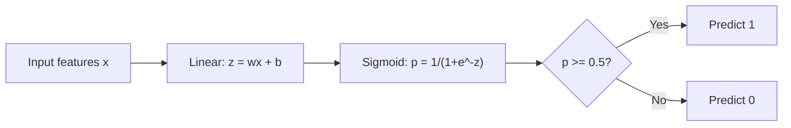
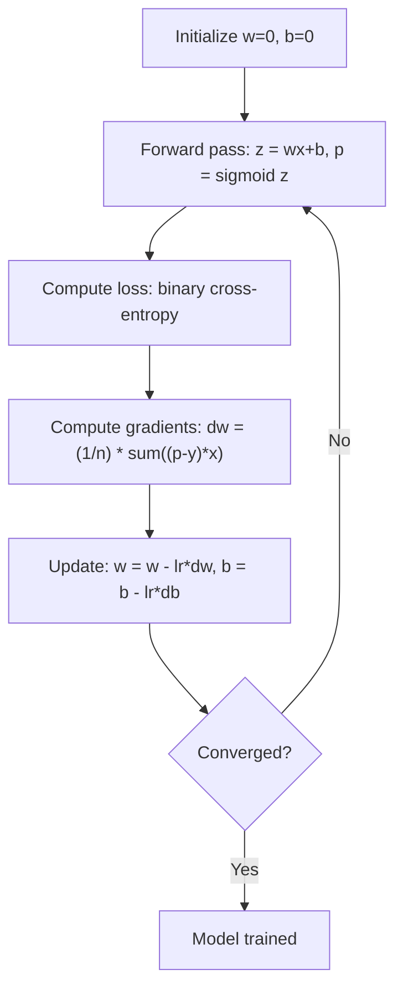

# Hồi quy logistic

> Hồi quy logistic uốn cong một đường thẳng thành đường cong chữ S để trả lời các câu hỏi có hoặc không với xác suất.

**Loại:** Xây dựng
**Ngôn ngữ:** Python
**Kiến thức tiên quyết:** Giai đoạn 2 Bài 1-2 (ML là gì, hồi quy tuyến tính)
**Thời lượng:** ~90 phút

## Mục tiêu học tập

- Triển khai hồi quy logistic từ đầu bằng cách sử dụng hàm sigmoid và loss entropy chéo nhị phân
- Tính toán và diễn giải precision, recall, F1 score và ma trận nhầm lẫn để phân loại nhị phân
- Giải thích lý do tại sao MSE không phân loại được và tại sao entropy chéo nhị phân tạo ra bề mặt chi phí lồi
- Xây dựng model hồi quy softmax để phân loại đa class và đánh giá sự cân bằng điều chỉnh ngưỡng

## Vấn đề

Bạn muốn dự đoán liệu một khối u là ác tính hay lành tính với kích thước của nó. Bạn thử hồi quy tuyến tính. Nó xuất ra các số như 0,3 hoặc 1,7 hoặc -0,5. Những điều đó có nghĩa là gì? 1.7 có "rất ác tính" không? -0.5 có "rất lành tính" không? Hồi quy tuyến tính xuất ra các số không giới hạn. Phân loại cần xác suất có giới hạn từ 0 đến 1 và quyết định rõ ràng: có hoặc không.

Hồi quy logistic giải quyết vấn đề này. Nó lấy cùng một tổ hợp tuyến tính (wx + b) và truyền nó qua hàm sigmoid, đè bẹp bất kỳ số nào vào phạm vi (0, 1). Đầu ra là một xác suất. Bạn đặt một ngưỡng (thường là 0,5) và đưa ra quyết định.

Đây là một trong những thuật toán được sử dụng rộng rãi nhất trong thực tế. Mặc dù tên gọi của nó, hồi quy logistic là một thuật toán phân loại, không phải là một thuật toán hồi quy. Tên này xuất phát từ hàm logistic (sigmoid) mà nó sử dụng.

## Khái niệm

### Tại sao hồi quy tuyến tính không được phân loại

Hãy tưởng tượng dự đoán pass/fail (1/0) dựa trên giờ học. Hồi quy tuyến tính phù hợp với một đường xuyên qua dữ liệu:

```
hours:  1   2   3   4   5   6   7   8   9   10
actual: 0   0   0   0   1   1   1   1   1   1
```

Một sự phù hợp tuyến tính có thể tạo ra các dự đoán như -0,2 ở giờ 1 và 1,3 ở giờ 10. Những giá trị này không phải là xác suất. Chúng xuống dưới 0 và trên 1. Tệ hơn, một ngoại lệ duy nhất (một người đã học 50 giờ) sẽ kéo toàn bộ dòng, thay đổi dự đoán cho tất cả mọi người.

Phân loại cần một hàm:
- Đầu ra các giá trị từ 0 đến 1 (xác suất)
- Tạo ra một quá trình chuyển đổi rõ ràng (ranh giới quyết định)
- Không bị bóp méo bởi các ngoại lệ xa ranh giới

### Chức năng Sigmoid

Hàm sigmoid thực hiện chính xác điều này:

```
sigmoid(z) = 1 / (1 + e^(-z))
```

Tính chất:
- Khi z lớn và dương, sigmoid(z) tiếp cận 1
- Khi z lớn và âm, sigmoid(z) tiếp cận 0
- Khi z = 0, sigmoid(z) = 0.5
- Đầu ra luôn nằm trong khoảng từ 0 đến 1
- Chức năng mượt mà và có thể phân biệt ở mọi nơi

Đạo hàm có dạng thuận tiện: sigmoid'(z) = sigmoid(z) * (1 - sigmoid(z)). Điều này làm cho tính toán gradient hiệu quả.

### Hồi quy logistic = Model tuyến tính + Sigmoid

model tính z = wx + b (giống như hồi quy tuyến tính), sau đó áp dụng sigmoid:



Đầu ra p được hiểu là P (y = 1 | x), xác suất đầu vào thuộc về class 1. Ranh giới quyết định là nơi wx + b = 0, làm cho đầu ra sigmoid chính xác là 0,5.

### Nhị phân Cross-Entropy Loss

Bạn không thể sử dụng MSE để hồi quy logistic. MSE với sigmoid tạo ra bề mặt chi phí không lồi với nhiều mức tối thiểu cục bộ. Thay vào đó, hãy sử dụng entropy chéo nhị phân (log loss):

```
Loss = -(1/n) * sum(y * log(p) + (1-y) * log(1-p))
```

Tại sao điều này hoạt động:
- Khi y = 1 và p gần bằng 1: log (1) = 0, vì vậy loss gần 0 (đúng, chi phí thấp)
- Khi y = 1 và p gần bằng 0: log (0) tiếp cận vô cực âm, vì vậy loss là rất lớn (sai, chi phí cao)
- Khi y = 0 và p gần bằng 0: log (1) = 0, vì vậy loss gần 0 (đúng, chi phí thấp)
- Khi y = 0 và p gần bằng 1: log (0) tiếp cận vô cực âm, vì vậy loss là rất lớn (sai, chi phí cao)

Hàm loss này lồi cho hồi quy logistic, đảm bảo một mức tối thiểu toàn cầu duy nhất.

### Gradient Descent cho hồi quy logistic

Các gradients cho entropy chéo nhị phân với sigmoid có dạng sạch:

```
dL/dw = (1/n) * sum((p - y) * x)
dL/db = (1/n) * sum(p - y)
```

Chúng trông giống hệt với hồi quy tuyến tính gradients. Sự khác biệt là p = sigmoid (wx + b) thay vì p = wx + b. Sigmoid giới thiệu tính phi tuyến, nhưng quy tắc cập nhật gradient vẫn giữ nguyên.



### Ranh giới quyết định

Đối với đầu vào 2D (hai features), ranh giới quyết định là đường trong đó:

```
w1*x1 + w2*x2 + b = 0
```

Điểm ở một bên được phân loại là 1, điểm ở bên kia là 0. Hồi quy logistic luôn tạo ra một ranh giới quyết định tuyến tính. Nếu bạn cần một ranh giới cong, bạn có thể thêm features đa thức hoặc sử dụng model phi tuyến.

### Phân loại đa Class với Softmax

Hồi quy logistic nhị phân xử lý hai classes. Đối với k classes, hãy sử dụng hàm softmax:

```
softmax(z_i) = e^(z_i) / sum(e^(z_j) for all j)
```

Mỗi class có trọng lượng riêng vector. model tính z_i điểm cho mỗi class, sau đó softmax chuyển đổi điểm số thành xác suất có tổng là 1. class được dự đoán là  có xác suất cao nhất.

Hàm loss trở thành entropy chéo phân loại:

```
Loss = -(1/n) * sum(sum(y_k * log(p_k)))
```

trong đó y_k là 1 cho class thực và 0 cho tất cả các  khác (mã hóa một nóng).

### Chỉ số đánh giá

Accuracy thôi là không đủ. Đối với một dataset có 95% âm tính và 5% tích cực, một model luôn dự đoán tiêu cực sẽ nhận được 95% accuracy nhưng vô dụng.

**Ma trận nhầm lẫn**:

|| Dự đoán tích cực | Dự đoán tiêu cực |
|---|---|---|
| Thực sự tích cực | Tích cực thực sự (TP) | Âm tính giả (FN) |
| Thực sự tiêu cực | Dương tính giả (FP) | Âm tính thực (TN) |

**Precision**: Trong số tất cả các trường hợp dương tính được dự đoán, có bao nhiêu trường hợp thực sự dương tính?
```
Precision = TP / (TP + FP)
```

**Recall** (Độ nhạy): Trong tất cả các mặt tích cực thực tế, chúng tôi đã bắt được bao nhiêu?
```
Recall = TP / (TP + FN)
```

**F1 Score**: Trung bình hài của precision và recall. Cân bằng cả hai chỉ số.
```
F1 = 2 * (Precision * Recall) / (Precision + Recall)
```

Khi nào nên ưu tiên:
- **Precision**: Khi dương tính giả tốn kém (bộ lọc thư rác, bạn không muốn chặn email hợp pháp)
- **Recall**: Khi âm tính giả tốn kém (tầm soát ung thư, bạn không muốn bỏ lỡ một khối u)
- **F1**: khi bạn cần một chỉ số cân bằng duy nhất

```figure
logistic-sigmoid
```

## Tự xây dựng

### Bước 1: Chức năng Sigmoid và tạo dữ liệu

```python
import random
import math

def sigmoid(z):
    z = max(-500, min(500, z))
    return 1.0 / (1.0 + math.exp(-z))


random.seed(42)
N = 200
X = []
y = []

for _ in range(N // 2):
    X.append([random.gauss(2, 1), random.gauss(2, 1)])
    y.append(0)

for _ in range(N // 2):
    X.append([random.gauss(5, 1), random.gauss(5, 1)])
    y.append(1)

combined = list(zip(X, y))
random.shuffle(combined)
X, y = zip(*combined)
X = list(X)
y = list(y)

print(f"Generated {N} samples (2 classes, 2 features)")
print(f"Class 0 center: (2, 2), Class 1 center: (5, 5)")
print(f"First 5 samples:")
for i in range(5):
    print(f"  Features: [{X[i][0]:.2f}, {X[i][1]:.2f}], Label: {y[i]}")
```

### Bước 2: Hồi quy logistic từ đầu

```python
class LogisticRegression:
    def __init__(self, n_features, learning_rate=0.01):
        self.weights = [0.0] * n_features
        self.bias = 0.0
        self.lr = learning_rate
        self.loss_history = []

    def predict_proba(self, x):
        z = sum(w * xi for w, xi in zip(self.weights, x)) + self.bias
        return sigmoid(z)

    def predict(self, x, threshold=0.5):
        return 1 if self.predict_proba(x) >= threshold else 0

    def compute_loss(self, X, y):
        n = len(y)
        total = 0.0
        for i in range(n):
            p = self.predict_proba(X[i])
            p = max(1e-15, min(1 - 1e-15, p))
            total += y[i] * math.log(p) + (1 - y[i]) * math.log(1 - p)
        return -total / n

    def fit(self, X, y, epochs=1000, print_every=200):
        n = len(y)
        n_features = len(X[0])
        for epoch in range(epochs):
            dw = [0.0] * n_features
            db = 0.0
            for i in range(n):
                p = self.predict_proba(X[i])
                error = p - y[i]
                for j in range(n_features):
                    dw[j] += error * X[i][j]
                db += error
            for j in range(n_features):
                self.weights[j] -= self.lr * (dw[j] / n)
            self.bias -= self.lr * (db / n)
            loss = self.compute_loss(X, y)
            self.loss_history.append(loss)
            if epoch % print_every == 0:
                print(f"  Epoch {epoch:4d} | Loss: {loss:.4f} | w: [{self.weights[0]:.3f}, {self.weights[1]:.3f}] | b: {self.bias:.3f}")
        return self

    def accuracy(self, X, y):
        correct = sum(1 for i in range(len(y)) if self.predict(X[i]) == y[i])
        return correct / len(y)


split = int(0.8 * N)
X_train, X_test = X[:split], X[split:]
y_train, y_test = y[:split], y[split:]

print("\n=== Training Logistic Regression ===")
model = LogisticRegression(n_features=2, learning_rate=0.1)
model.fit(X_train, y_train, epochs=1000, print_every=200)

print(f"\nTrain accuracy: {model.accuracy(X_train, y_train):.4f}")
print(f"Test accuracy:  {model.accuracy(X_test, y_test):.4f}")
print(f"Weights: [{model.weights[0]:.4f}, {model.weights[1]:.4f}]")
print(f"Bias: {model.bias:.4f}")
```

### Bước 3: Ma trận và số liệu nhầm lẫn từ đầu

```python
class ClassificationMetrics:
    def __init__(self, y_true, y_pred):
        self.tp = sum(1 for t, p in zip(y_true, y_pred) if t == 1 and p == 1)
        self.tn = sum(1 for t, p in zip(y_true, y_pred) if t == 0 and p == 0)
        self.fp = sum(1 for t, p in zip(y_true, y_pred) if t == 0 and p == 1)
        self.fn = sum(1 for t, p in zip(y_true, y_pred) if t == 1 and p == 0)

    def accuracy(self):
        total = self.tp + self.tn + self.fp + self.fn
        return (self.tp + self.tn) / total if total > 0 else 0

    def precision(self):
        denom = self.tp + self.fp
        return self.tp / denom if denom > 0 else 0

    def recall(self):
        denom = self.tp + self.fn
        return self.tp / denom if denom > 0 else 0

    def f1(self):
        p = self.precision()
        r = self.recall()
        return 2 * p * r / (p + r) if (p + r) > 0 else 0

    def print_confusion_matrix(self):
        print(f"\n  Confusion Matrix:")
        print(f"                  Predicted")
        print(f"                  Pos   Neg")
        print(f"  Actual Pos     {self.tp:4d}  {self.fn:4d}")
        print(f"  Actual Neg     {self.fp:4d}  {self.tn:4d}")

    def print_report(self):
        self.print_confusion_matrix()
        print(f"\n  Accuracy:  {self.accuracy():.4f}")
        print(f"  Precision: {self.precision():.4f}")
        print(f"  Recall:    {self.recall():.4f}")
        print(f"  F1 Score:  {self.f1():.4f}")


y_pred_test = [model.predict(x) for x in X_test]
print("\n=== Classification Report (Test Set) ===")
metrics = ClassificationMetrics(y_test, y_pred_test)
metrics.print_report()
```

### Bước 4: Phân tích ranh giới quyết định

```python
print("\n=== Decision Boundary ===")
w1, w2 = model.weights
b = model.bias
print(f"Decision boundary: {w1:.4f}*x1 + {w2:.4f}*x2 + {b:.4f} = 0")
if abs(w2) > 1e-10:
    print(f"Solved for x2:     x2 = {-w1/w2:.4f}*x1 + {-b/w2:.4f}")

print("\nSample predictions near the boundary:")
test_points = [
    [3.0, 3.0],
    [3.5, 3.5],
    [4.0, 4.0],
    [2.5, 2.5],
    [5.0, 5.0],
]
for point in test_points:
    prob = model.predict_proba(point)
    pred = model.predict(point)
    print(f"  [{point[0]}, {point[1]}] -> prob={prob:.4f}, class={pred}")
```

### Bước 5: Đa class với softmax

```python
class SoftmaxRegression:
    def __init__(self, n_features, n_classes, learning_rate=0.01):
        self.n_features = n_features
        self.n_classes = n_classes
        self.lr = learning_rate
        self.weights = [[0.0] * n_features for _ in range(n_classes)]
        self.biases = [0.0] * n_classes

    def softmax(self, scores):
        max_score = max(scores)
        exp_scores = [math.exp(s - max_score) for s in scores]
        total = sum(exp_scores)
        return [e / total for e in exp_scores]

    def predict_proba(self, x):
        scores = [
            sum(self.weights[k][j] * x[j] for j in range(self.n_features)) + self.biases[k]
            for k in range(self.n_classes)
        ]
        return self.softmax(scores)

    def predict(self, x):
        probs = self.predict_proba(x)
        return probs.index(max(probs))

    def fit(self, X, y, epochs=1000, print_every=200):
        n = len(y)
        for epoch in range(epochs):
            grad_w = [[0.0] * self.n_features for _ in range(self.n_classes)]
            grad_b = [0.0] * self.n_classes
            total_loss = 0.0
            for i in range(n):
                probs = self.predict_proba(X[i])
                for k in range(self.n_classes):
                    target = 1.0 if y[i] == k else 0.0
                    error = probs[k] - target
                    for j in range(self.n_features):
                        grad_w[k][j] += error * X[i][j]
                    grad_b[k] += error
                true_prob = max(probs[y[i]], 1e-15)
                total_loss -= math.log(true_prob)
            for k in range(self.n_classes):
                for j in range(self.n_features):
                    self.weights[k][j] -= self.lr * (grad_w[k][j] / n)
                self.biases[k] -= self.lr * (grad_b[k] / n)
            if epoch % print_every == 0:
                print(f"  Epoch {epoch:4d} | Loss: {total_loss / n:.4f}")
        return self

    def accuracy(self, X, y):
        correct = sum(1 for i in range(len(y)) if self.predict(X[i]) == y[i])
        return correct / len(y)


random.seed(42)
X_3class = []
y_3class = []

centers = [(1, 1), (5, 1), (3, 5)]
for label, (cx, cy) in enumerate(centers):
    for _ in range(50):
        X_3class.append([random.gauss(cx, 0.8), random.gauss(cy, 0.8)])
        y_3class.append(label)

combined = list(zip(X_3class, y_3class))
random.shuffle(combined)
X_3class, y_3class = zip(*combined)
X_3class = list(X_3class)
y_3class = list(y_3class)

split_3 = int(0.8 * len(X_3class))
X_train_3 = X_3class[:split_3]
y_train_3 = y_3class[:split_3]
X_test_3 = X_3class[split_3:]
y_test_3 = y_3class[split_3:]

print("\n=== Multi-class Softmax Regression (3 classes) ===")
softmax_model = SoftmaxRegression(n_features=2, n_classes=3, learning_rate=0.1)
softmax_model.fit(X_train_3, y_train_3, epochs=1000, print_every=200)
print(f"\nTrain accuracy: {softmax_model.accuracy(X_train_3, y_train_3):.4f}")
print(f"Test accuracy:  {softmax_model.accuracy(X_test_3, y_test_3):.4f}")

print("\nSample predictions:")
for i in range(5):
    probs = softmax_model.predict_proba(X_test_3[i])
    pred = softmax_model.predict(X_test_3[i])
    print(f"  True: {y_test_3[i]}, Predicted: {pred}, Probs: [{', '.join(f'{p:.3f}' for p in probs)}]")
```

### Bước 6: Điều chỉnh ngưỡng

```python
print("\n=== Threshold Tuning ===")
print("Default threshold: 0.5. Adjusting the threshold trades precision for recall.\n")

thresholds = [0.3, 0.4, 0.5, 0.6, 0.7]
print(f"{'Threshold':>10} {'Accuracy':>10} {'Precision':>10} {'Recall':>10} {'F1':>10}")
print("-" * 52)

for t in thresholds:
    y_pred_t = [1 if model.predict_proba(x) >= t else 0 for x in X_test]
    m = ClassificationMetrics(y_test, y_pred_t)
    print(f"{t:>10.1f} {m.accuracy():>10.4f} {m.precision():>10.4f} {m.recall():>10.4f} {m.f1():>10.4f}")
```

## Ứng dụng

Bây giờ điều tương tự với scikit-learn.

```python
from sklearn.linear_model import LogisticRegression as SklearnLR
from sklearn.metrics import accuracy_score, precision_score, recall_score, f1_score
from sklearn.metrics import confusion_matrix, classification_report
from sklearn.model_selection import train_test_split
from sklearn.preprocessing import StandardScaler
import numpy as np

np.random.seed(42)
X_0 = np.random.randn(100, 2) + [2, 2]
X_1 = np.random.randn(100, 2) + [5, 5]
X_sk = np.vstack([X_0, X_1])
y_sk = np.array([0] * 100 + [1] * 100)

X_tr, X_te, y_tr, y_te = train_test_split(X_sk, y_sk, test_size=0.2, random_state=42)

scaler = StandardScaler()
X_tr_sc = scaler.fit_transform(X_tr)
X_te_sc = scaler.transform(X_te)

lr = SklearnLR()
lr.fit(X_tr_sc, y_tr)
y_pred = lr.predict(X_te_sc)

print("=== Scikit-learn Logistic Regression ===")
print(f"Accuracy:  {accuracy_score(y_te, y_pred):.4f}")
print(f"Precision: {precision_score(y_te, y_pred):.4f}")
print(f"Recall:    {recall_score(y_te, y_pred):.4f}")
print(f"F1:        {f1_score(y_te, y_pred):.4f}")
print(f"\nConfusion Matrix:\n{confusion_matrix(y_te, y_pred)}")
print(f"\nClassification Report:\n{classification_report(y_te, y_pred)}")
```

Việc triển khai từ đầu của bạn tạo ra cùng một ranh giới quyết định và số liệu. Scikit-learn thêm các tùy chọn giải (liblinear, lbfgs, saga), chính quy hóa tự động, chiến lược đa class (một so rest, đa thức) và tối ưu hóa độ ổn định số.

## Sản phẩm bàn giao

Bài học này tạo ra:
- `code/logistic_regression.py` - hồi quy logistic từ đầu với các chỉ số

## Bài tập

1. Tạo một dataset KHÔNG thể tách rời tuyến tính (ví dụ: hai vòng tròn đồng tâm). Huấn luyện hồi quy logistic và quan sát sự thất bại của nó. Sau đó thêm features đa thức (x1^2, x2^2, x1*x2) và huấn luyện lại. Cho thấy rằng accuracy được cải thiện.
2. Triển khai ma trận nhầm lẫn nhiều class cho 3-class softmax model. Tính toán trên mỗi class precision và recall. class nào khó phân loại nhất?
3. Xây dựng đường cong ROC từ đầu. Đối với 100 giá trị ngưỡng từ 0 đến 1, hãy tính tỷ lệ dương tính thực và tỷ lệ dương tính giả. Tính toán AUC (khu vực dưới đường cong) bằng quy tắc hình thang.

## Thuật ngữ chính

| Thuật ngữ | Những gì mọi người nói | Ý nghĩa thực sự của nó |
|------|----------------|----------------------|
| Hồi quy logistic | "Hồi quy để phân loại" | Một model tuyến tính theo sau là một hàm sigmoid xuất ra xác suất class |
| Chức năng Sigmoid | "Đường cong chữ S" | Hàm 1/(1+e^(-z)) ánh xạ bất kỳ số thực nào với phạm vi (0, 1) |
| Entropy chéo nhị phân | "Ghi nhật ký loss" | Hàm loss -[y*log(p) + (1-y)*log(1-p)] phạt nghiêm trọng các dự đoán sai tự tin |
| Ranh giới quyết định | "Đường phân chia" | Bề mặt mà xác suất đầu ra của model bằng 0,5, tách classes dự đoán |
| Softmax | "Sigmoid đa class" | Một hàm chuyển đổi một vector điểm thành xác suất có tổng bằng 1 |
| Precision | "Có bao nhiêu người được chọn có liên quan" | TP / (TP + FP), phần dự đoán tích cực thực sự tích cực |
| Recall | "Có bao nhiêu người có liên quan được chọn" | TP / (TP + FN), phần dương tính thực tế mà model xác định chính xác |
| F1 score | "Cân bằng accuracy" | Trung bình hài của precision và recall: 2 * P * R / (P + R) |
| Ma trận nhầm lẫn | "Sự cố lỗi" | Bảng hiển thị số lượng TP, TN, FP, FN cho mỗi cặp class |
| Ngưỡng | "Giới hạn" | Giá trị xác suất mà model dự đoán class 1 (mặc định 0,5, có thể điều chỉnh) |
| Mã hóa một nóng | "Cột nhị phân cho thể loại" | Biểu diễn class k dưới dạng vector số không với 1 ở vị trí k |
| Phân loại entropy chéo | "loss nhật ký nhiều class" | Việc mở rộng entropy chéo nhị phân sang k classes sử dụng nhãn mã hóa một nóng |
