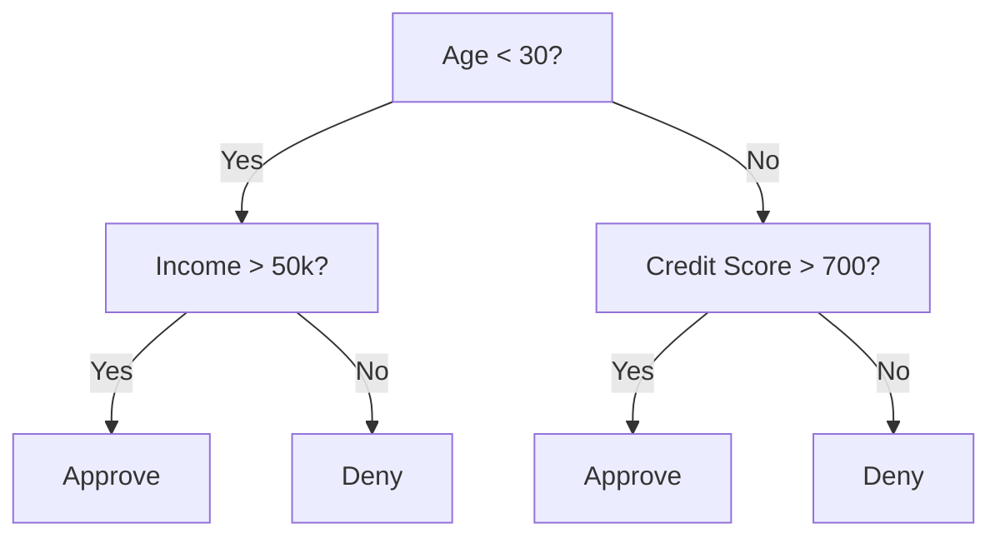
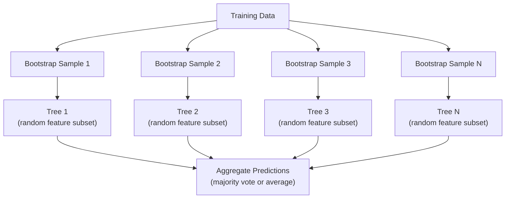

# Cây quyết định và rừng ngẫu nhiên

> Cây quyết định chỉ là một sơ đồ. Nhưng một khu rừng của chúng là một trong những công cụ mạnh mẽ nhất trong ML.

**Loại:** Xây dựng
**Ngôn ngữ:** Python
**Kiến thức tiên quyết:** Giai đoạn 1 (Bài 09 Lý thuyết thông tin, 06 Xác suất)
**Thời lượng:** ~90 phút

## Mục tiêu học tập

- Thực hiện các tính toán tạp chất, entropy và thu thập thông tin của Gini để tìm ra sự phân tách cây quyết định tối ưu
- Xây dựng bộ phân loại cây quyết định từ đầu với các điều khiển cắt tỉa trước (độ sâu tối đa, mẫu tối thiểu)
- Xây dựng một khu rừng ngẫu nhiên bằng cách sử dụng sampling bootstrap và feature ngẫu nhiên, đồng thời giải thích lý do tại sao nó làm giảm variance
- So sánh tầm quan trọng feature MDI với tầm quan trọng của hoán vị và xác định khi nào MDI bị sai lệch

## Vấn đề

Bạn có dữ liệu dạng bảng. Hàng là mẫu, cột là features và có cột mục tiêu bạn muốn dự đoán. Bạn có thể ném một mạng nơ-ron vào đó. Nhưng đối với dữ liệu dạng bảng, models dựa trên cây (cây quyết định, rừng ngẫu nhiên gradient cây tăng cường) luôn vượt trội so với học sâu. Các cuộc thi Kaggle về dữ liệu có cấu trúc bị chi phối bởi XGBoost và LightGBM, không phải transformers.

Tại sao? Cây xử lý các loại feature hỗn hợp (số và phân loại) mà không cần xử lý trước. Họ xử lý các mối quan hệ phi tuyến mà không cần feature engineering. Chúng có thể giải thích được: bạn có thể nhìn vào cái cây và thấy chính xác lý do tại sao một dự đoán được đưa ra. Và các khu rừng ngẫu nhiên, trung bình nhiều cây, có khả năng chống overfitting cao trên datasets có kích thước vừa phải.

Bài học này xây dựng cây quyết định từ đầu bằng cách sử dụng phân tách đệ quy, sau đó xây dựng một khu rừng ngẫu nhiên lên trên. Bạn sẽ thực hiện toán học đằng sau các tiêu chí phân chia (tạp chất Gini, entropy, thu được thông tin) và hiểu tại sao một nhóm những người học yếu trở thành một nhóm mạnh.

## Khái niệm

### Cây quyết định làm gì

Cây quyết định phân chia không gian feature thành các vùng hình chữ nhật bằng cách đặt một chuỗi các câu hỏi yes/no.



Mỗi nút nội bộ kiểm tra một feature so với một ngưỡng. Mỗi nút lá đưa ra một dự đoán. Để phân loại một điểm dữ liệu mới, bạn bắt đầu từ gốc và theo dõi branches cho đến khi bạn đến một chiếc lá.

Cây được xây dựng từ trên xuống bằng cách chọn, tại mỗi nút, feature và ngưỡng tách biệt dữ liệu tốt nhất. "Tốt nhất" được xác định bởi một tiêu chí phân chia.

### Tiêu chí phân chia: đo tạp chất

Tại mỗi nút, chúng ta có một tập hợp các mẫu. Chúng ta muốn tách chúng ra sao cho các nút con kết quả càng "thuần túy" càng tốt, có nghĩa là mỗi nút con chứa hầu hết một class.

**Tạp chất Gini** đo xác suất một mẫu được chọn ngẫu nhiên sẽ bị phân loại sai nếu nó được dán nhãn theo phân bố class tại nút đó.

```
Gini(S) = 1 - sum(p_k^2)

where p_k is the proportion of class k in set S.
```

Đối với một nút thuần túy (tất cả một nút class), Gini = 0. Đối với phân tách nhị phân với 50/50 classes, Gini = 0,5. Thấp hơn là tốt hơn.

```
Example: 6 cats, 4 dogs

Gini = 1 - (0.6^2 + 0.4^2) = 1 - (0.36 + 0.16) = 0.48
```

**Entropy** đo lường nội dung thông tin (rối loạn) trong một nút. Được đề cập trong Giai đoạn 1 Bài 09.

```
Entropy(S) = -sum(p_k * log2(p_k))
```

Đối với một nút thuần túy, entropy = 0. Đối với phân tách nhị phân 50/50, entropy = 1,0. Thấp hơn là tốt hơn.

```
Example: 6 cats, 4 dogs

Entropy = -(0.6 * log2(0.6) + 0.4 * log2(0.4))
        = -(0.6 * -0.737 + 0.4 * -1.322)
        = 0.442 + 0.529
        = 0.971 bits
```

**Thu được thông tin** là sự giảm tạp chất (entropy hoặc Gini) sau khi phân tách.

```
IG(S, feature, threshold) = Impurity(S) - weighted_avg(Impurity(S_left), Impurity(S_right))

where the weights are the proportions of samples in each child.
```

Thuật toán tham lam ở mỗi nút: thử mọi feature và mọi ngưỡng có thể. Chọn cặp (feature, ngưỡng) để tối đa hóa mức thu được thông tin.

### Cách hoạt động của tính năng tách

Đối với một dataset có n features và m mẫu tại nút hiện tại:

1. Đối với mỗi feature j (j = 1 đến n):
   - Sắp xếp các mẫu theo feature j
   - Thử mọi điểm giữa giữa các giá trị riêng biệt liên tiếp làm ngưỡng
   - Tính toán độ lợi thông tin cho từng ngưỡng
2. Chọn feature và ngưỡng có mức tăng thông tin cao nhất
3. Chia dữ liệu thành trái (feature <= ngưỡng) và phải (ngưỡng feature >)
4. Đệ quy trên mỗi trẻ

Cách tiếp cận tham lam này không đảm bảo cây tối ưu toàn cầu. Tìm cây tối ưu là NP-khó. Nhưng phân chia tham lam hoạt động tốt trong thực tế.

### Điều kiện dừng

Không có điều kiện dừng lại, cây phát triển cho đến khi mỗi lá tinh khiết (một mẫu cho mỗi lá). Điều này ghi nhớ hoàn hảo dữ liệu training và khái quát hóa khủng khiếp.

**Cắt tỉa trước **dừng cây trước khi nó phát triển hoàn toàn:
- Độ sâu tối đa: ngừng tách khi cây đạt đến độ sâu đã đặt
- Số mẫu tối thiểu trên mỗi lá: dừng lại nếu một nút có ít hơn k mẫu
- Thu được thông tin tối thiểu: dừng lại nếu phân tách tốt nhất cải thiện tạp chất ít hơn ngưỡng
- Số nốt lá tối đa: giới hạn tổng số lá

**Sau khi cắt tỉa** phát triển toàn bộ cây, sau đó cắt tỉa lại:
- Cắt tỉa chi phí-phức tạp (được sử dụng bởi scikit-learn): thêm một hình phạt tỷ lệ thuận với số lá. Tăng hình phạt để có được những cây nhỏ hơn
- Giảm lỗi cắt tỉa: xóa cây con nếu lỗi xác thực không tăng

Cắt tỉa trước đơn giản và nhanh hơn. Cắt tỉa sau thường tạo ra những cây tốt hơn vì nó không ngăn chặn sớm sự phân tách có thể dẫn đến việc cắt tỉa thêm hữu ích.

### Cây quyết định hồi quy

Đối với hồi quy, dự đoán lá là giá trị trung bình của các giá trị mục tiêu trong lá đó. Tiêu chí phân tách cũng thay đổi:

**Variance giảm** thay thế mức thu được thông tin:

```
VR(S, feature, threshold) = Var(S) - weighted_avg(Var(S_left), Var(S_right))
```

Chọn phần chia giảm variance nhiều nhất. Cây phân chia không gian đầu vào thành các vùng và dự đoán một hằng số (giá trị trung bình) trong mỗi vùng.

### Rừng ngẫu nhiên: sức mạnh của quần thể

Một cây quyết định duy nhất có variance cao. Những thay đổi nhỏ trong dữ liệu có thể tạo ra các cây hoàn toàn khác nhau. Các khu rừng ngẫu nhiên khắc phục điều này bằng cách tính trung bình nhiều cây.



Hai nguồn ngẫu nhiên làm cho cây đa dạng:

**Đóng gói (tổng hợp bootstrap):** Mỗi cây được huấn luyện trên một mẫu bootstrap, một mẫu ngẫu nhiên có thay thế từ dữ liệu training. Khoảng 63% mẫu ban đầu xuất hiện trong mỗi bootstrap (rest là mẫu ngoài túi có thể được sử dụng để xác nhận).

**Feature ngẫu nhiên: **Ở mỗi lần tách, chỉ một tập hợp con ngẫu nhiên của features được xem xét. Để phân loại, mặc định là sqrt (n_features). Đối với hồi quy, n_features/3. Điều này ngăn không cho tất cả các cây tách ra trên cùng một feature trội.

Cái nhìn sâu sắc quan trọng: tính trung bình nhiều cây có liên quan làm giảm variance mà không làm tăng bias. Mỗi cây riêng lẻ có thể tầm thường. Hòa tấu rất mạnh mẽ.

### Feature quan trọng

Các khu rừng ngẫu nhiên tự nhiên cung cấp điểm quan trọng feature. Phương pháp phổ biến nhất:

**Giảm tạp chất trung bình (MDI):** Đối với mỗi feature, tổng mức giảm tạp chất trên tất cả các cây và tất cả các nút nơi feature đó được sử dụng. Features tạo ra sự giảm tạp chất lớn hơn ở các lần phân tách trước đó quan trọng hơn.

```
importance(feature_j) = sum over all nodes where feature_j is used:
    (n_samples_at_node / n_total_samples) * impurity_decrease
```

Điều này nhanh (được tính toán trong training) nhưng thiên về features số lượng cao và features với nhiều điểm phân chia có thể xảy ra.

**Tầm quan trọng của hoán vị** là giải pháp thay thế: xáo trộn các giá trị của một feature và đo lường mức độ giảm accuracy của model. Đáng tin cậy hơn nhưng chậm hơn.

### Khi cây cối đánh bại mạng nơ-ron

Cây cối và rừng thống trị mạng nơ-ron trên dữ liệu dạng bảng. Một số lý do:

| Yếu tố | Cây xanh | Mạng nơ-ron |
|--------|-------|----------------|
| Các loại hỗn hợp (số + phân loại) | Hỗ trợ gốc | Cần mã hóa |
| datasets nhỏ (< 10k hàng) | Làm việc tốt | Quá phù hợp |
| Feature tương tác | Tìm thấy bằng cách tách | Cần thiết kế kiến trúc |
| Khả năng giải thích | Hoàn toàn minh bạch | Hộp đen |
| Thời gian Training | Biên bản | Giờ |
| Độ nhạy Hyperparameter | Thấp | Cao |

Mạng nơ-ron chiến thắng khi dữ liệu có cấu trúc không gian hoặc tuần tự (hình ảnh, văn bản, âm thanh). Đối với bàn phẳng features, cây là mặc định.

```figure
decision-tree-depth
```

## Tự xây dựng

### Bước 1: Tạp chất Gini và entropy

Xây dựng cả hai tiêu chí phân tách từ đầu và xác minh rằng họ đồng ý về việc phân tách nào là tốt.

```python
import math

def gini_impurity(labels):
    n = len(labels)
    if n == 0:
        return 0.0
    counts = {}
    for label in labels:
        counts[label] = counts.get(label, 0) + 1
    return 1.0 - sum((c / n) ** 2 for c in counts.values())

def entropy(labels):
    n = len(labels)
    if n == 0:
        return 0.0
    counts = {}
    for label in labels:
        counts[label] = counts.get(label, 0) + 1
    return -sum(
        (c / n) * math.log2(c / n) for c in counts.values() if c > 0
    )
```

### Bước 2: Tìm phần tách tốt nhất

Hãy thử mọi feature và mọi ngưỡng. Trả về một trong những thông tin có mức thu được thông tin cao nhất.

```python
def information_gain(parent_labels, left_labels, right_labels, criterion="gini"):
    measure = gini_impurity if criterion == "gini" else entropy
    n = len(parent_labels)
    n_left = len(left_labels)
    n_right = len(right_labels)
    if n_left == 0 or n_right == 0:
        return 0.0
    parent_impurity = measure(parent_labels)
    child_impurity = (
        (n_left / n) * measure(left_labels) +
        (n_right / n) * measure(right_labels)
    )
    return parent_impurity - child_impurity
```

### Bước 3: Xây dựng DecisionTree class

Phân tách đệ quy, dự đoán và theo dõi tầm quan trọng feature.

```python
class DecisionTree:
    def __init__(self, max_depth=None, min_samples_split=2,
                 min_samples_leaf=1, criterion="gini",
                 max_features=None):
        self.max_depth = max_depth
        self.min_samples_split = min_samples_split
        self.min_samples_leaf = min_samples_leaf
        self.criterion = criterion
        self.max_features = max_features
        self.tree = None
        self.feature_importances_ = None

    def fit(self, X, y):
        self.n_features = len(X[0])
        self.feature_importances_ = [0.0] * self.n_features
        self.n_samples = len(X)
        self.tree = self._build(X, y, depth=0)
        total = sum(self.feature_importances_)
        if total > 0:
            self.feature_importances_ = [
                fi / total for fi in self.feature_importances_
            ]

    def predict(self, X):
        return [self._predict_one(x, self.tree) for x in X]
```

### Bước 4: Xây dựng class RandomForest

Bootstrap sampling, feature ngẫu nhiên và bỏ phiếu đa số.

```python
class RandomForest:
    def __init__(self, n_trees=100, max_depth=None,
                 min_samples_split=2, max_features="sqrt",
                 criterion="gini"):
        self.n_trees = n_trees
        self.max_depth = max_depth
        self.min_samples_split = min_samples_split
        self.max_features = max_features
        self.criterion = criterion
        self.trees = []

    def fit(self, X, y):
        n = len(X)
        for _ in range(self.n_trees):
            indices = [random.randint(0, n - 1) for _ in range(n)]
            X_boot = [X[i] for i in indices]
            y_boot = [y[i] for i in indices]
            tree = DecisionTree(
                max_depth=self.max_depth,
                min_samples_split=self.min_samples_split,
                max_features=self.max_features,
                criterion=self.criterion,
            )
            tree.fit(X_boot, y_boot)
            self.trees.append(tree)

    def predict(self, X):
        all_preds = [tree.predict(X) for tree in self.trees]
        predictions = []
        for i in range(len(X)):
            votes = {}
            for preds in all_preds:
                v = preds[i]
                votes[v] = votes.get(v, 0) + 1
            predictions.append(max(votes, key=votes.get))
        return predictions
```

Xem `code/trees.py` để biết cách triển khai hoàn chỉnh với tất cả các phương thức trợ giúp.

## Ứng dụng

Với scikit-learn, training một khu rừng ngẫu nhiên là ba dòng:

```python
from sklearn.ensemble import RandomForestClassifier
from sklearn.datasets import load_iris
from sklearn.model_selection import train_test_split

X, y = load_iris(return_X_y=True)
X_train, X_test, y_train, y_test = train_test_split(X, y, random_state=42)

rf = RandomForestClassifier(n_estimators=100, random_state=42)
rf.fit(X_train, y_train)
print(f"Accuracy: {rf.score(X_test, y_test):.4f}")
print(f"Feature importances: {rf.feature_importances_}")
```

Trong thực tế, gradient cây được tăng cường (XGBoost, LightGBM, CatBoost) thường mạnh hơn các khu rừng ngẫu nhiên vì chúng xây dựng cây tuần tự, với mỗi cây sửa lỗi của những cây trước đó. Nhưng các khu rừng ngẫu nhiên khó cấu hình sai hơn và hầu như không cần điều chỉnh hyperparameter.

## Sản phẩm bàn giao

Bài học này tạo ra `outputs/prompt-tree-interpreter.md` - một prompt giải thích sự phân tách cây quyết định cho các bên liên quan trong kinh doanh. Cung cấp cho nó một cấu trúc của cây đã được huấn luyện (độ sâu, features, ngưỡng phân chia, accuracy) và nó dịch model thành các quy tắc ngôn ngữ đơn giản, xếp hạng feature tầm quan trọng, gắn cờ overfitting hoặc rò rỉ và đề xuất các bước tiếp theo. Sử dụng nó bất cứ lúc nào bạn cần giải thích một model dựa trên cây cho một người không đọc mã.

## Bài tập

1. Huấn luyện một cây quyết định duy nhất trên dataset 2D với 3 classes. trace thủ công các phần tách và vẽ ranh giới quyết định hình chữ nhật. So sánh các ranh giới ở max_depth = 2 và max_depth = 10.

2. Thực hiện phân tách giảm variance cho cây hồi quy. Tạo y = sin(x) + nhiễu cho 200 điểm và phù hợp với cây hồi quy của bạn. Vẽ các dự đoán hằng số từng phần của cây so với đường cong thực.

3. Xây dựng một khu rừng ngẫu nhiên với 1, 5, 10, 50 và 200 cây. Vẽ training accuracy và kiểm tra accuracy so với số lượng cây. Quan sát rằng thử nghiệm accuracy cao nguyên nhưng không giảm (rừng kháng overfitting).

4. So sánh tạp chất Gini và entropy như các tiêu chí phân chia trên 5 datasets khác nhau. Đo accuracy và độ sâu của cây. Trong hầu hết các trường hợp, chúng tạo ra kết quả gần như giống hệt nhau. Giải thích lý do.

5. Thực hiện tầm quan trọng hoán vị. So sánh nó với tầm quan trọng của MDI trên một dataset mà một feature là nhiễu ngẫu nhiên nhưng có số lượng cao. MDI sẽ xếp hạng nhiễu feature cao. Tầm quan trọng của hoán vị sẽ không.

## Thuật ngữ chính

| Thuật ngữ | Những gì mọi người nói | Ý nghĩa thực sự của nó |
|------|----------------|----------------------|
| Cây quyết định | "Sơ đồ dự đoán" | Một model phân chia không gian feature thành các vùng hình chữ nhật bằng cách học một chuỗi các phân tách if/else |
| Tạp chất Gini | "Nút hỗn hợp như thế nào" | Xác suất phân loại sai một mẫu ngẫu nhiên tại một nút. 0 = tinh khiết, 0,5 = tạp chất tối đa đối với nhị phân |
| Entropy | "Sự rối loạn trong một nút" | Nội dung thông tin tại một nút. 0 = thuần túy, 1.0 = độ không đảm bảo tối đa đối với nhị phân. Từ lý thuyết thông tin |
| Thu thập thông tin | "Chia tay tốt như thế nào" | Giảm tạp chất sau khi tách. Tiêu chí tham lam để chọn tách |
| Cắt tỉa trước | "Dừng cây sớm" | Ngăn chặn sự phát triển của cây sớm bằng cách đặt độ sâu tối đa, mẫu tối thiểu hoặc ngưỡng khuếch đại tối thiểu |
| Sau khi cắt tỉa | "Cắt tỉa cây sau" | Phát triển toàn bộ cây, sau đó loại bỏ các cây con không cải thiện hiệu suất xác thực |
| Đóng bao | "Huấn luyện trên các tập con ngẫu nhiên" | Tổng hợp Bootstrap. Huấn luyện mỗi model trên một mẫu ngẫu nhiên khác nhau có thay thế |
| Rừng ngẫu nhiên | "Một bó cây" | Tập hợp các cây quyết định, mỗi cây được huấn luyện trên một mẫu bootstrap với các tập con feature ngẫu nhiên ở mỗi lần phân tách |
| Tầm quan trọng Feature (MDI) | "Điều features quan trọng" | Tổng mức giảm tạp chất do mỗi feature đóng góp, được tổng hợp trên tất cả các cây và nút |
| Tầm quan trọng của hoán vị | "Xáo trộn và kiểm tra" | Accuracy giảm khi các giá trị của feature được xáo trộn ngẫu nhiên. Đáng tin cậy hơn MDI cho features nhiễu |
| Giảm Variance | "Phiên bản hồi quy của thu được thông tin" | Tương tự cây hồi quy của thu được thông tin. Chọn phần phân chia làm giảm mục tiêu variance nhiều nhất |
| Mẫu Bootstrap | "Mẫu ngẫu nhiên có lặp lại" | Một mẫu ngẫu nhiên được rút ra với sự thay thế từ dataset ban đầu. Cùng kích thước, nhưng trùng lặp |

## Đọc thêm

- [Breiman: Random Forests (2001)](https://link.springer.com/article/10.1023/A:1010933404324) - giấy rừng ngẫu nhiên ban đầu
- [Grinsztajn et al.: Why do tree-based models still outperform deep learning on tabular data? (2022)](https://arxiv.org/abs/2207.08815) - so sánh chặt chẽ giữa cây và mạng nơ-ron trên các tác vụ dạng bảng
- [scikit-learn Decision Trees documentation](https://scikit-learn.org/stable/modules/tree.html) - hướng dẫn thực hành với các công cụ trực quan hóa
- [XGBoost: A Scalable Tree Boosting System (Chen & Guestrin, 2016)](https://arxiv.org/abs/1603.02754) - bài báo tăng cường gradient thống trị Kaggle
