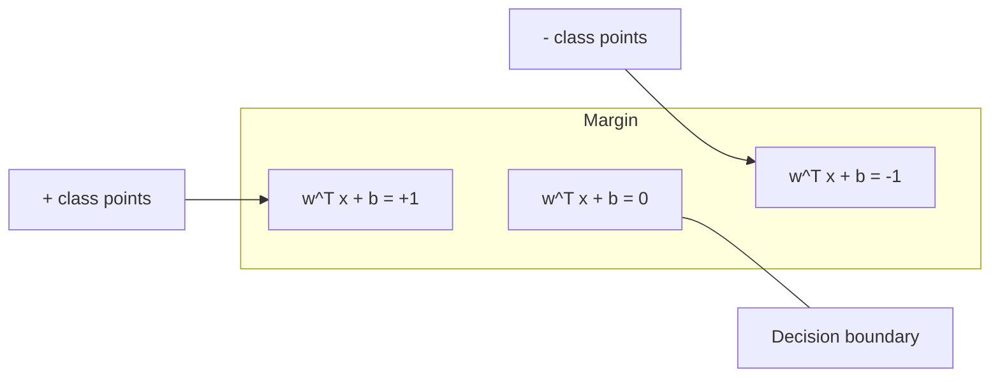
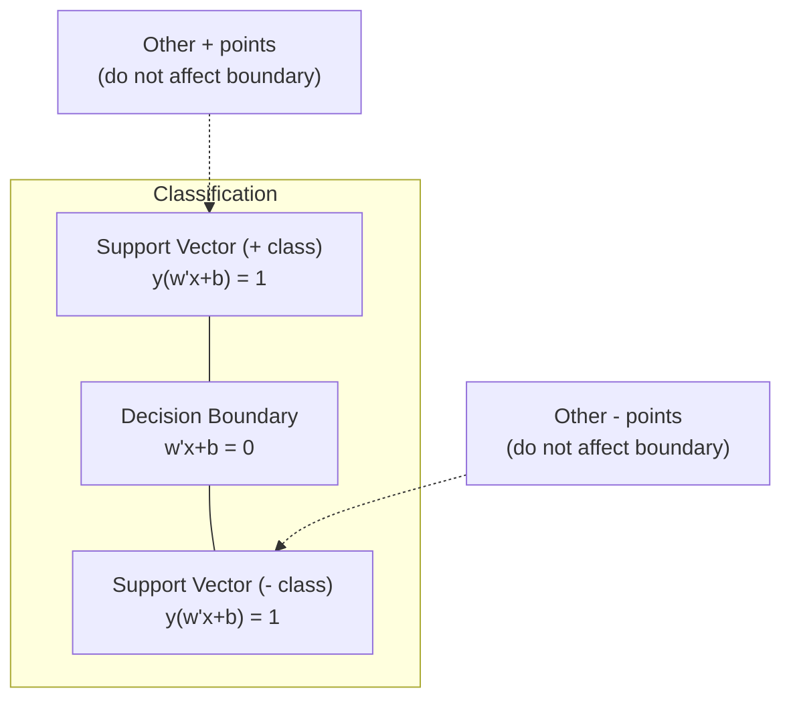
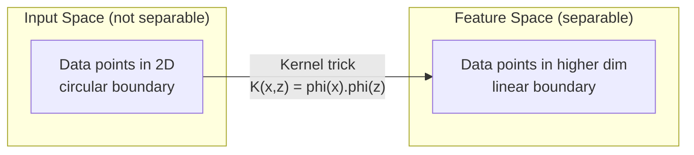

# Hỗ trợ máy Vector

> Tìm con đường rộng nhất giữa hai classes. Đó là toàn bộ ý tưởng.

**Loại:** Xây dựng
**Ngôn ngữ:** Python
**Kiến thức tiên quyết:** Giai đoạn 1 (Bài 08 Tối ưu hóa, 14 Định mức và Khoảng cách, 18 Tối ưu hóa lồi)
**Thời lượng:** ~90 phút

## Mục tiêu học tập

- Triển khai SVM tuyến tính từ đầu bằng cách sử dụng loss bản lề và gradient descent trên công thức nguyên thủy
- Giải thích nguyên tắc ký quỹ tối đa và xác định vectors hỗ trợ từ một model được huấn luyện
- So sánh các hạt nhân tuyến tính, đa thức và RBF và giải thích cách thủ thuật hạt nhân tránh ánh xạ high-dimensional rõ ràng
- Đánh giá sự cân bằng được kiểm soát bởi parameter C giữa chiều rộng ký quỹ và sai số phân loại

## Vấn đề

Bạn có hai classes điểm dữ liệu và cần vẽ một đường thẳng (hoặc siêu phẳng) ngăn cách chúng. Vô số dòng có thể hoạt động. Bạn nên chọn cái nào?

Người có tỷ suất lợi nhuận lớn nhất. Biên độ là khoảng cách giữa ranh giới quyết định và các điểm dữ liệu gần nhất ở mỗi bên. Biên độ rộng hơn có nghĩa là bộ phân loại tự tin hơn và khái quát hóa tốt hơn với dữ liệu không nhìn thấy.

Trực giác này dẫn đến Support Vector Machines, một trong những thuật toán thanh lịch nhất về mặt toán học trong ML. SVM là phương pháp phân loại thống trị trước khi học sâu và vẫn là lựa chọn tốt nhất cho các datasets nhỏ, dữ liệu high-dimensional và các vấn đề mà bạn cần một model có nguyên tắc, hiểu rõ với các đảm bảo lý thuyết.

SVM kết nối trực tiếp với Giai đoạn 1: tối ưu hóa là lồi (Bài 18), biên độ được đo bằng định mức (Bài 14) và thủ thuật hạt nhân khai thác các tích chấm để xử lý các ranh giới phi tuyến mà không bao giờ tính toán trong không gian high-dimensional.

## Khái niệm

### Bộ phân loại ký quỹ tối đa

Cho dữ liệu có thể phân tách tuyến tính với các nhãn y_i trong {-1, +1} và feature vectors x_i, chúng ta muốn một siêu mặt phẳng w^T x + b = 0 ngăn cách classes.

Khoảng cách từ một điểm x_i đến siêu phẳng là:

```
distance = |w^T x_i + b| / ||w||
```

Đối với một điểm được phân loại chính xác: y_i * (w ^ T x_i + b) > 0. Lề gấp đôi khoảng cách từ siêu mặt phẳng đến điểm gần nhất ở hai bên.



Vấn đề tối ưu hóa:

```
maximize    2 / ||w||     (the margin width)
subject to  y_i * (w^T x_i + b) >= 1  for all i
```

Tương đương (giảm thiểu ||w||^2 dễ tối ưu hóa hơn):

```
minimize    (1/2) ||w||^2
subject to  y_i * (w^T x_i + b) >= 1  for all i
```

Đây là một chương trình bậc hai lồi. Nó có một giải pháp toàn cầu độc đáo. Các điểm dữ liệu nằm chính xác trên ranh giới ký quỹ (trong đó y_i * (w ^ T x_i + b) = 1) là vectors hỗ trợ. Chúng là những điểm duy nhất xác định ranh giới quyết định. Di chuyển hoặc loại bỏ bất kỳ điểm không vector hỗ trợ nào và ranh giới không thay đổi.

### Hỗ trợ vectors: một số ít quan trọng



Hầu hết các điểm training đều không liên quan. Chỉ có sự hỗ trợ vectors quan trọng. Đây là lý do tại sao SVM tiết kiệm bộ nhớ tại thời điểm dự đoán: bạn chỉ cần lưu trữ vectors hỗ trợ chứ không phải toàn bộ bộ training.

Số lượng hỗ trợ vectors cũng đưa ra một giới hạn về lỗi tổng quát. Ít hỗ trợ hơn vectors so với kích thước dataset có nghĩa là khái quát hóa tốt hơn.

### Lề mềm: xử lý nhiễu với C parameter

Dữ liệu thực hiếm khi có thể tách rời hoàn hảo. Một số điểm có thể nằm ở phía sai của ranh giới hoặc bên trong lề. Công thức ký quỹ mềm cho phép vi phạm bằng cách đưa các biến độ chùng vào.

```
minimize    (1/2) ||w||^2 + C * sum(xi_i)
subject to  y_i * (w^T x_i + b) >= 1 - xi_i
            xi_i >= 0  for all i
```

Biến độ chùng xi_i đo lường mức i vi phạm biên độ bao nhiêu. C kiểm soát sự đánh đổi:

| Giá trị C | Hành vi |
|---------|----------|
| C lớn | Xử phạt nặng các hành vi vi phạm. Biên độ hẹp, ít phân loại sai. Quá phù hợp |
| C nhỏ | Cho phép nhiều vi phạm hơn. Biên độ rộng, phân loại sai nhiều hơn. Đồ lót |

C là cường độ chính quy hóa, đảo ngược. C lớn = ít chính quy hóa hơn. C nhỏ = chính quy hóa hơn.

### loss bản lề: chức năng loss SVM

SVM ký quỹ mềm có thể được viết lại dưới dạng tối ưu hóa không bị ràng buộc:

```
minimize    (1/2) ||w||^2 + C * sum(max(0, 1 - y_i * (w^T x_i + b)))
```

Thuật ngữ max (0, 1 - y_i * f (x_i)) là bản lề loss. Nó bằng không khi điểm được phân loại chính xác và vượt quá lề. Nó là tuyến tính khi điểm nằm trong lề hoặc phân loại sai.

```
Hinge loss for a single point:

loss
  |
  | \
  |  \
  |   \
  |    \
  |     \_______________
  |
  +-----|-----|-------->  y * f(x)
       0     1

Zero loss when y*f(x) >= 1 (correctly classified, outside margin).
Linear penalty when y*f(x) < 1.
```

So sánh với loss logistic (hồi quy logistic):

```
Hinge:     max(0, 1 - y*f(x))          Hard cutoff at margin
Logistic:  log(1 + exp(-y*f(x)))        Smooth, never exactly zero
```

Bản lề loss tạo ra các giải pháp thưa thớt (chỉ hỗ trợ vectors đóng góp không bằng không). Logistic loss sử dụng tất cả các điểm dữ liệu. Điều này làm cho SVM tiết kiệm bộ nhớ hơn tại thời điểm dự đoán.

### Training SVM tuyến tính với gradient descent

Bạn có thể huấn luyện SVM tuyến tính bằng cách sử dụng gradient descent trên bản lề loss cộng với chính quy hóa L2 mà không cần giải QP bị ràng buộc:

```
L(w, b) = (lambda/2) * ||w||^2 + (1/n) * sum(max(0, 1 - y_i * (w^T x_i + b)))

Gradient with respect to w:
  If y_i * (w^T x_i + b) >= 1:  dL/dw = lambda * w
  If y_i * (w^T x_i + b) < 1:   dL/dw = lambda * w - y_i * x_i

Gradient with respect to b:
  If y_i * (w^T x_i + b) >= 1:  dL/db = 0
  If y_i * (w^T x_i + b) < 1:   dL/db = -y_i
```

Đây được gọi là công thức nguyên thủy. Nó chạy bằng O (n * d) trên epoch, trong đó n là số mẫu và d là số features. Đối với dữ liệu lớn, thưa thớt high-dimensional (phân loại văn bản), điều này diễn ra nhanh chóng.

### Công thức kép và thủ thuật hạt nhân

Kép Lagrangian của bài toán SVM (từ Giai đoạn 1 Bài 18, điều kiện KKT) là:

```
maximize    sum(alpha_i) - (1/2) * sum_ij(alpha_i * alpha_j * y_i * y_j * (x_i . x_j))
subject to  0 <= alpha_i <= C
            sum(alpha_i * y_i) = 0
```

Kép chỉ liên quan đến các sản phẩm chấm x_i. x_j giữa các điểm dữ liệu. Đây là cái nhìn sâu sắc quan trọng. Thay thế mọi sản phẩm chấm bằng hàm hạt nhân K(x_i, x_j) và SVM có thể học các ranh giới phi tuyến mà không cần tính toán chuyển đổi một cách rõ ràng.

```
Linear kernel:      K(x, z) = x . z
Polynomial kernel:  K(x, z) = (x . z + c)^d
RBF (Gaussian):     K(x, z) = exp(-gamma * ||x - z||^2)
```

Hạt nhân RBF ánh xạ dữ liệu vào một không gian vô hạn. Các điểm gần trong không gian đầu vào có giá trị hạt nhân gần 1. Các điểm cách xa nhau có giá trị hạt nhân gần 0. Nó có thể học bất kỳ ranh giới quyết định suôn sẻ nào.



Thủ thuật hạt nhân tính toán tích chấm trong không gian high-dimensional mà không bao giờ đến đó. Đối với hạt nhân đa thức bậc d trong chiều D, không gian feature rõ ràng có kích thước O (D ^ d). Nhưng K(x, z) được tính theo thời gian O(D).

### SVM cho hồi quy (SVR)

Hỗ trợ hồi quy Vector phù hợp với một ống epsilon chiều rộng xung quanh dữ liệu. Các điểm bên trong ống không có loss. Các điểm bên ngoài ống bị phạt tuyến tính.

```
minimize    (1/2) ||w||^2 + C * sum(xi_i + xi_i*)
subject to  y_i - (w^T x_i + b) <= epsilon + xi_i
            (w^T x_i + b) - y_i <= epsilon + xi_i*
            xi_i, xi_i* >= 0
```

Epsilon parameter kiểm soát chiều rộng ống. Ống rộng hơn = ít hỗ trợ hơn vectors = vừa vặn hơn. Ống hẹp hơn = hỗ trợ nhiều hơn vectors = vừa vặn hơn.

### Tại sao SVM thua deep learning (và khi họ vẫn thắng)

SVM thống trị ML từ cuối những năm 1990 đến đầu những năm 2010. Deep learning vượt qua chúng vì một số lý do:

| Yếu tố | SVM | Học sâu |
|--------|------|---------------|
| Feature engineering | Yêu cầu nó | Học features |
| Khả năng mở rộng | O (n ^ 2) đến O (n ^ 3) cho hạt nhân | O (n) trên epoch với SGD |
| Image/text/audio | Cần features thủ công | Học hỏi từ dữ liệu thô |
| datasets lớn (>100k) | Chậm | Quy mô tốt |
| Tăng tốc GPU | Quyền lợi hạn chế | Tăng tốc lớn |

SVM vẫn giành chiến thắng trong các tình huống sau:
- datasets nhỏ (hàng trăm đến hàng nghìn mẫu)
- High-dimensional dữ liệu thưa thớt (văn bản có TF-IDF features)
- Khi bạn cần đảm bảo toán học (giới hạn ký quỹ)
- Khi thời gian training phải ở mức tối thiểu (SVM tuyến tính rất nhanh)
- Phân loại nhị phân với cấu trúc ký quỹ rõ ràng
- Phát hiện bất thường (SVM một class)

```figure
svm-margin
```

## Tự xây dựng

### Bước 1: Bản lề loss và gradient

Nền tảng. Bản lề điện toán loss cho một batch và gradient của nó.

```python
def hinge_loss(X, y, w, b):
    n = len(X)
    total_loss = 0.0
    for i in range(n):
        margin = y[i] * (dot(w, X[i]) + b)
        total_loss += max(0.0, 1.0 - margin)
    return total_loss / n
```

### Bước 2: SVM tuyến tính qua gradient descent

Huấn luyện bằng cách giảm thiểu loss bản lề đều đặn. Không cần trình giải QP.

```python
class LinearSVM:
    def __init__(self, lr=0.001, lambda_param=0.01, n_epochs=1000):
        self.lr = lr
        self.lambda_param = lambda_param
        self.n_epochs = n_epochs
        self.w = None
        self.b = 0.0

    def fit(self, X, y):
        n_features = len(X[0])
        self.w = [0.0] * n_features
        self.b = 0.0

        for epoch in range(self.n_epochs):
            for i in range(len(X)):
                margin = y[i] * (dot(self.w, X[i]) + self.b)
                if margin >= 1:
                    self.w = [wj - self.lr * self.lambda_param * wj
                              for wj in self.w]
                else:
                    self.w = [wj - self.lr * (self.lambda_param * wj - y[i] * X[i][j])
                              for j, wj in enumerate(self.w)]
                    self.b -= self.lr * (-y[i])

    def predict(self, X):
        return [1 if dot(self.w, x) + self.b >= 0 else -1 for x in X]
```

### Bước 3: Chức năng hạt nhân

Triển khai các hạt nhân tuyến tính, đa thức và RBF.

```python
def linear_kernel(x, z):
    return dot(x, z)

def polynomial_kernel(x, z, degree=3, c=1.0):
    return (dot(x, z) + c) ** degree

def rbf_kernel(x, z, gamma=0.5):
    diff = [xi - zi for xi, zi in zip(x, z)]
    return math.exp(-gamma * dot(diff, diff))
```

### Bước 4: Ký quỹ và hỗ trợ nhận dạng vector

Sau khi training, xác định điểm nào được hỗ trợ vectors và tính toán chiều rộng ký quỹ.

```python
def find_support_vectors(X, y, w, b, tol=1e-3):
    support_vectors = []
    for i in range(len(X)):
        margin = y[i] * (dot(w, X[i]) + b)
        if abs(margin - 1.0) < tol:
            support_vectors.append(i)
    return support_vectors
```

Xem `code/svm.py` để biết cách triển khai hoàn chỉnh với tất cả các bản demo.

## Ứng dụng

Với scikit-learn:

```python
from sklearn.svm import SVC, LinearSVC, SVR
from sklearn.preprocessing import StandardScaler
from sklearn.pipeline import Pipeline

clf = Pipeline([
    ("scaler", StandardScaler()),
    ("svm", SVC(kernel="rbf", C=1.0, gamma="scale")),
])
clf.fit(X_train, y_train)
print(f"Accuracy: {clf.score(X_test, y_test):.4f}")
print(f"Support vectors: {clf['svm'].n_support_}")
```

Quan trọng: luôn mở rộng quy mô features của bạn trước khi training SVM. SVM nhạy cảm với cường độ feature vì biên độ phụ thuộc vào ||w ||, và không chia tỷ lệ features làm biến dạng hình học.

Đối với datasets lớn, sử dụng `LinearSVC` (công thức nguyên thủy, O (n) trên epoch) thay vì `SVC` (công thức kép, O (n ^ 2) đến O (n ^ 3)):

```python
from sklearn.svm import LinearSVC

clf = Pipeline([
    ("scaler", StandardScaler()),
    ("svm", LinearSVC(C=1.0, max_iter=10000)),
])
```

## Bài tập

1. Tạo một dataset có thể tách rời tuyến tính 2D. Huấn luyện LinearSVM của bạn và xác định vectors hỗ trợ. Xác minh rằng vectors hỗ trợ là các điểm gần nhất với ranh giới quyết định.

2. Thay đổi C từ 0.001 đến 1000 trên dataset ồn ào. Vẽ ranh giới quyết định cho mỗi giá trị C. Quan sát sự chuyển đổi từ lề rộng (underfitting) sang lề hẹp (overfitting).

3. Tạo một dataset trong đó ranh giới class là hình tròn (không tuyến tính). Cho thấy SVM tuyến tính không thành công. Tính toán ma trận hạt nhân RBF và cho thấy rằng classes trở nên có thể tách rời trong không gian feature do hạt nhân gây ra.

4. So sánh loss bản lề và loss hậu cần trên cùng một dataset. Huấn luyện SVM tuyến tính và hồi quy logistic. Đếm số điểm training đóng góp vào ranh giới quyết định của mỗi model (hỗ trợ vectors so với tất cả các điểm).

5. Triển khai SVR (loss không nhạy cảm với epsilon). Phù hợp với y = sin(x) + nhiễu. Vẽ ống epsilon xung quanh các dự đoán và đánh dấu vectors hỗ trợ (các điểm bên ngoài ống).

## Thuật ngữ chính

| Thuật ngữ | Ý nghĩa thực sự của nó |
|------|----------------------|
| Hỗ trợ vectors | Điểm training gần nhất với ranh giới quyết định. Những điểm duy nhất xác định siêu phẳng |
| Ký quỹ | Khoảng cách giữa ranh giới quyết định và hỗ trợ gần nhất vectors. SVM tối đa hóa điều này |
| Bản lề loss | tối đa (0, 1 - y * f (x)). Không khi được phân loại chính xác và nằm ngoài lề. Hình phạt tuyến tính nếu không |
| C parameter | Đánh đổi giữa chiều rộng ký quỹ và lỗi phân loại. C lớn = lề hẹp, C nhỏ = lề rộng |
| Ký quỹ mềm | Công thức SVM cho phép vi phạm ký quỹ thông qua các biến chùng. Xử lý dữ liệu không thể tách rời |
| Thủ thuật hạt nhân | Tính toán các sản phẩm chấm trong một không gian high-dimensional feature mà không ánh xạ rõ ràng đến không gian đó |
| Hạt nhân tuyến tính | K (x, z) = x . z. Tương đương với sản phẩm chấm tiêu chuẩn. Đối với dữ liệu có thể phân tách tuyến tính |
| Hạt nhân RBF | K(x, z) = exp(-gamma * \ | \ | xz\ | \ | ^2). Ánh xạ đến các chiều vô hạn. Tìm hiểu bất kỳ ranh giới trơn tru nào |
| Hạt nhân đa thức | K(x, z) = (x . z + c)^d. Ánh xạ đến một không gian feature của các tổ hợp đa thức |
| Công thức kép | Xây dựng lại bài toán SVM chỉ phụ thuộc vào các tích chấm giữa các điểm dữ liệu. Kích hoạt hạt nhân |
| SVR | Hỗ trợ hồi quy Vector. Phù hợp với một ống epsilon xung quanh dữ liệu. Các điểm bên trong ống không có loss |
| Biến Slack | xi_i: đo lường mức độ vi phạm ký quỹ. Số không cho các điểm được phân loại chính xác bên ngoài lề |
| Ký quỹ tối đa | Nguyên tắc chọn siêu phẳng tối đa hóa khoảng cách đến các điểm gần nhất của mỗi class |

## Đọc thêm

- [Vapnik: The Nature of Statistical Learning Theory (1995)](https://link.springer.com/book/10.1007/978-1-4757-3264-1) - văn bản cơ bản về SVM và học thống kê
- [Cortes & Vapnik: Support-vector networks (1995)](https://link.springer.com/article/10.1007/BF00994018) - giấy SVM gốc
- [Platt: Sequential Minimal Optimization (1998)](https://www.microsoft.com/en-us/research/publication/sequential-minimal-optimization-a-fast-algorithm-for-training-support-vector-machines/) - thuật toán SMO đã làm cho SVM training thực tế
- [scikit-learn SVM documentation](https://scikit-learn.org/stable/modules/svm.html) - hướng dẫn thực hành với chi tiết triển khai
- [LIBSVM: A Library for Support Vector Machines](https://www.csie.ntu.edu.tw/~cjlin/libsvm/) - thư viện C++ đằng sau hầu hết các triển khai SVM
