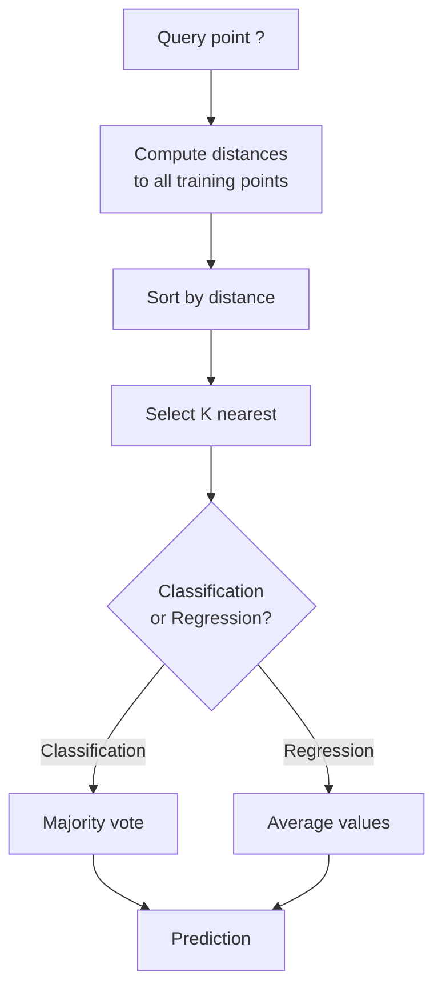
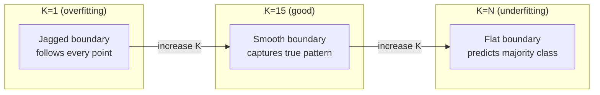
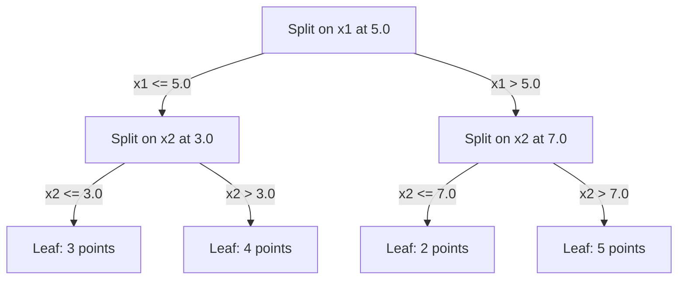

# K-Hàng xóm gần nhất và khoảng cách

> Lưu trữ mọi thứ. Dự đoán bằng cách nhìn vào hàng xóm của bạn. Thuật toán đơn giản nhất thực sự hoạt động.

**Loại:** Xây dựng
**Ngôn ngữ:** Python
**Kiến thức tiên quyết:** Giai đoạn 1 (Bài 14 Định mức và Khoảng cách)
**Thời lượng:** ~90 phút

## Mục tiêu học tập

- Triển khai phân loại KNN và hồi quy từ đầu với K có thể định cấu hình và bỏ phiếu trọng số khoảng cách
- So sánh các chỉ số khoảng cách L1, L2, cosin và Minkowski và chọn số liệu thích hợp cho một loại dữ liệu nhất định
- Giải thích lời nguyền của tính không gian và chứng minh lý do tại sao KNN suy thoái trong không gian high-dimensional
- Xây dựng cây KD để tìm kiếm và phân tích hàng xóm gần nhất hiệu quả khi nó hoạt động tốt hơn vũ phu

## Vấn đề

Bạn có một dataset. Một điểm dữ liệu mới đến. Bạn cần phân loại nó hoặc dự đoán giá trị của nó. Thay vì học parameters từ dữ liệu (như hồi quy tuyến tính hoặc SVM), bạn chỉ cần tìm các điểm K training gần điểm mới nhất và để họ bỏ phiếu.

Đây là hàng xóm gần nhất của K. Không có giai đoạn training. Không có parameters để học. Không có chức năng loss để giảm thiểu. Bạn lưu trữ toàn bộ training đặt và tính toán khoảng cách tại thời điểm dự đoán.

Nghe có vẻ quá đơn giản để làm việc. Nhưng KNN cạnh tranh một cách đáng ngạc nhiên đối với nhiều vấn đề, đặc biệt là với datasets vừa và nhỏ, và hiểu được nó tiết lộ sâu sắc các khái niệm cơ bản: sự lựa chọn số liệu khoảng cách (kết nối với Giai đoạn 1 Bài 14), lời nguyền về chiều và sự khác biệt giữa lười học và háo hức.

KNN cũng xuất hiện ở khắp mọi nơi trong AI hiện đại, chỉ dưới những cái tên khác nhau. Vector cơ sở dữ liệu thực hiện tìm kiếm KNN trên embeddings. Tạo tăng cường truy xuất (RAG) tìm K đoạn tài liệu gần nhất. Hệ thống đề xuất tìm người dùng hoặc mục tương tự. Thuật toán cũng giống nhau. Quy mô và cấu trúc dữ liệu khác nhau.

## Khái niệm

### Cách thức hoạt động của KNN

Cho một dataset các điểm được gắn nhãn và một điểm truy vấn mới:

1. Tính toán khoảng cách từ truy vấn đến mọi điểm trong dataset
2. Sắp xếp theo khoảng cách
3. Lấy K điểm gần nhất
4. Để phân loại: đa số phiếu bầu giữa các nước láng giềng K
5. Đối với hồi quy: trung bình (hoặc trung bình gia quyền) của các giá trị của hàng xóm K



Đó là toàn bộ thuật toán. Không phù hợp. Không gradient descent. Không epochs.

### Chọn K

K là hyperparameter duy nhất. Nó kiểm soát sự đánh đổi bias-variance:

| K | Hành vi |
|---|----------|
| K = 1 | Ranh giới quyết định tuân theo mọi điểm. Lỗi training bằng không. variance cao. Quá phù hợp |
| K nhỏ (3-5) | Nhạy cảm với cấu trúc cục bộ. Có thể nắm bắt ranh giới phức tạp |
| K lớn | Ranh giới mượt mà hơn. Mạnh mẽ hơn với nhiễu. Có thể thiếu phù hợp |
| K = N | Dự đoán đa số class cho mỗi điểm. bias tối đa |

Điểm bắt đầu phổ biến là K = sqrt (N) cho một dataset của N điểm. Sử dụng K lẻ để phân loại nhị phân để tránh ràng buộc.



### Chỉ số khoảng cách

Hàm khoảng cách xác định ý nghĩa của "gần". Các số liệu khác nhau tạo ra những hàng xóm khác nhau, những dự đoán khác nhau.

**L2 (Euclid)** là mặc định. Khoảng cách đường thẳng.

```
d(a, b) = sqrt(sum((a_i - b_i)^2))
```

Nhạy cảm với thang đo feature. Luôn chuẩn hóa features trước khi sử dụng L2 với KNN.

**L1 (Manhattan)** tổng sự khác biệt tuyệt đối. Mạnh mẽ hơn so với các ngoại lệ so với L2 vì nó không bình phương sự khác biệt.

```
d(a, b) = sum(|a_i - b_i|)
```

**Khoảng cách cosin** đo góc giữa vectors, bỏ qua độ lớn. Cần thiết cho dữ liệu văn bản và embedding.

```
d(a, b) = 1 - (a . b) / (||a|| * ||b||)
```

**Minkowski** khái quát hóa L1 và L2 với parameter p.

```
d(a, b) = (sum(|a_i - b_i|^p))^(1/p)

p=1: Manhattan
p=2: Euclidean
p->inf: Chebyshev (max absolute difference)
```

Chỉ số nào sẽ sử dụng tùy thuộc vào dữ liệu:

| Kiểu dữ liệu | Số liệu tốt nhất | Tại sao |
|-----------|------------|-----|
| features số, thang điểm tương tự | L2 (Euclid) | Mặc định, hoạt động cho dữ liệu không gian |
| features số, ngoại lệ | L1 (Manhattan) | Mạnh mẽ, không khuếch đại sự khác biệt lớn |
| embeddings văn bản | Cosin | Độ lớn là nhiễu, hướng là ý nghĩa |
| High-dimensional thưa thớt | Cosin hoặc L1 | L2 bị nguyền rủa không gian |
| Các loại hỗn hợp | Khoảng cách tùy chỉnh | Kết hợp các chỉ số cho mỗi loại feature |

### KNN có trọng số

KNN tiêu chuẩn cho trọng số bằng nhau cho tất cả các hàng xóm K. Nhưng một người hàng xóm ở khoảng cách 0.1 sẽ quan trọng hơn một ở khoảng cách 5.0.

**KNN trọng số khoảng cách **trọng số mỗi hàng xóm nghịch với khoảng cách:

```
weight_i = 1 / (distance_i + epsilon)

For classification: weighted vote
For regression:     weighted average = sum(w_i * y_i) / sum(w_i)
```

Epsilon ngăn phép chia cho không khi một điểm truy vấn khớp chính xác với một điểm training.

KNN có trọng số ít nhạy cảm hơn với sự lựa chọn của K vì những người hàng xóm ở xa đóng góp rất ít.

### Lời nguyền của không gian

Hiệu suất KNN giảm ở kích thước cao. Đây không phải là một mối quan tâm mơ hồ. Đó là một thực tế toán học.

**Vấn đề 1: khoảng cách hội tụ.** Khi chiều tăng lên, tỷ lệ giữa khoảng cách tối đa với khoảng cách tối thiểu tiếp cận 1. Tất cả các điểm trở nên "xa" như nhau so với truy vấn.

```
In d dimensions, for random uniform points:

d=2:    max_dist / min_dist = varies widely
d=100:  max_dist / min_dist ~ 1.01
d=1000: max_dist / min_dist ~ 1.001

When all distances are nearly equal, "nearest" is meaningless.
```

**Vấn đề 2: volume phát nổ.** Để nắm bắt K hàng xóm trong một phần cố định của dữ liệu, bạn cần mở rộng bán kính tìm kiếm của mình để bao phủ một phần lớn hơn nhiều của không gian feature. "Khu phố" có kích thước cao bao gồm hầu hết không gian.

**Vấn đề 3: các góc chiếm ưu thế.** Trong một siêu khối đơn vị ở kích thước d, hầu hết các volume tập trung gần các góc, không phải trung tâm. Một quả cầu được khắc trong khối lập phương chứa một phần biến mất của volume khi d phát triển.

Hậu quả thực tế: KNN hoạt động tốt lên đến khoảng 20-50 features. Ngoài ra, bạn cần giảm chiều (PCA, UMAP, t-SNE) trước khi áp dụng KNN hoặc bạn cần sử dụng các cấu trúc tìm kiếm dựa trên cây khai thác chiều thấp hơn nội tại của dữ liệu.

### KD-trees: tìm kiếm hàng xóm gần nhất nhanh chóng

Brute-force KNN tính toán khoảng cách từ truy vấn đến mọi điểm training. Đó là O (n * d) cho mỗi truy vấn. Đối với datasets lớn, điều này là quá chậm.

Một cây KD phân chia đệ quy không gian dọc theo feature trục. Ở mỗi cấp độ, nó phân chia dọc theo một chiều ở giá trị trung bình.



Để tìm hàng xóm gần nhất, hãy duyệt qua cây đến lá chứa truy vấn, sau đó quay lại và chỉ kiểm tra các phân vùng lân cận nếu chúng có thể chứa các điểm gần hơn.

Thời gian truy vấn trung bình: O (log n) cho kích thước thấp. Nhưng cây KD suy thoái thành O(n) ở kích thước cao (d > 20) vì việc quay ngược loại bỏ ngày càng ít branches.

### Cây bóng: tốt hơn cho kích thước vừa phải

Cây bóng phân chia dữ liệu thành các siêu cầu lồng nhau thay vì các hộp căn chỉnh trục. Mỗi nút xác định một quả bóng (tâm + bán kính) chứa tất cả các điểm trong cây con đó.

Ưu điểm so với KD-trees:
- Hoạt động tốt hơn ở kích thước vừa phải (lên đến ~50)
- Xử lý cấu trúc không căn chỉnh trục
- Giới hạn chặt chẽ hơn volumes có nghĩa là nhiều branches được cắt tỉa hơn trong quá trình tìm kiếm

Cả cây KD và cây bóng đều là thuật toán chính xác. Đối với tìm kiếm thực sự quy mô lớn (hàng triệu điểm, hàng trăm chiều), các phương pháp lân cận gần nhất (HNSW, IVF, sản phẩm quantization) được sử dụng thay thế. Những điều này được đề cập trong Giai đoạn 1 Bài 14.

### Lười học vs háo hức học

KNN là một người học lười biếng: nó không hoạt động tại training thời điểm và tất cả đều hoạt động tại thời điểm dự đoán. Hầu hết các thuật toán khác (hồi quy tuyến tính, SVM, mạng nơ-ron) là những người háo hức học hỏi: chúng thực hiện tính toán nặng tại training thời điểm để xây dựng một model nhỏ gọn, sau đó dự đoán nhanh.

| Khía cạnh | Lười biếng (KNN) | Háo hức (SVM, mạng thần kinh) |
|--------|------------|------------------------|
| Thời gian Training | O(1) chỉ lưu trữ dữ liệu | O (n * epochs) |
| Thời gian dự đoán | O (n * d) cho mỗi truy vấn | O (d) hoặc O (parameters) |
| Bộ nhớ khi dự đoán | Lưu trữ toàn bộ bộ training | Chỉ lưu trữ model parameters |
| Thích ứng với dữ liệu mới | Thêm điểm ngay lập tức | Huấn luyện lại model |
| Ranh giới quyết định | Ngầm, được tính toán nhanh chóng | Rõ ràng, cố định sau training |

Học lười là lý tưởng khi:
- Các dataset thay đổi thường xuyên (add/remove điểm mà không cần huấn luyện lại)
- Bạn cần dự đoán cho rất ít truy vấn
- Bạn muốn không có thời gian training
- dataset đủ nhỏ để tìm kiếm vũ phu nhanh chóng

### KNN cho hồi quy

Thay vì bỏ phiếu đa số, KNN cho hồi quy tính trung bình các giá trị mục tiêu của các hàng xóm K.

```
prediction = (1/K) * sum(y_i for i in K nearest neighbors)

Or with distance weighting:
prediction = sum(w_i * y_i) / sum(w_i)
where w_i = 1 / distance_i
```

Hồi quy KNN tạo ra các dự đoán hằng số từng phần (hoặc trơn tru từng phần với trọng số). Nó không thể ngoại suy vượt quá phạm vi của dữ liệu training. Nếu các mục tiêu training đều nằm trong khoảng từ 0 đến 100, KNN sẽ không bao giờ dự đoán 200.

```figure
knn-smoothness
```

## Tự xây dựng

### Bước 1: Chức năng khoảng cách

Thực hiện khoảng cách L1, L2, cosine và Minkowski. Chúng kết nối trực tiếp với Giai đoạn 1 Bài 14.

```python
import math

def l2_distance(a, b):
    return math.sqrt(sum((ai - bi) ** 2 for ai, bi in zip(a, b)))

def l1_distance(a, b):
    return sum(abs(ai - bi) for ai, bi in zip(a, b))

def cosine_distance(a, b):
    dot_val = sum(ai * bi for ai, bi in zip(a, b))
    norm_a = math.sqrt(sum(ai ** 2 for ai in a))
    norm_b = math.sqrt(sum(bi ** 2 for bi in b))
    if norm_a == 0 or norm_b == 0:
        return 1.0
    return 1.0 - dot_val / (norm_a * norm_b)

def minkowski_distance(a, b, p=2):
    if p == float('inf'):
        return max(abs(ai - bi) for ai, bi in zip(a, b))
    return sum(abs(ai - bi) ** p for ai, bi in zip(a, b)) ** (1 / p)
```

### Bước 2: Bộ phân loại và hồi quy KNN

Xây dựng KNN đầy đủ với K có thể định cấu hình, số liệu khoảng cách và trọng số khoảng cách tùy chọn.

```python
class KNN:
    def __init__(self, k=5, distance_fn=l2_distance, weighted=False,
                 task="classification"):
        self.k = k
        self.distance_fn = distance_fn
        self.weighted = weighted
        self.task = task
        self.X_train = None
        self.y_train = None

    def fit(self, X, y):
        self.X_train = X
        self.y_train = y

    def predict(self, X):
        return [self._predict_one(x) for x in X]
```

### Bước 3: KD-tree để tìm kiếm hiệu quả

Xây dựng một cây KD từ đầu phân chia đệ quy trên trung bình của mỗi chiều.

```python
class KDTree:
    def __init__(self, X, indices=None, depth=0):
        # Recursively partition the data
        self.axis = depth % len(X[0])
        # Split on median of the current axis
        ...

    def query(self, point, k=1):
        # Traverse to leaf, then backtrack
        ...
```

Xem `code/knn.py` để biết cách triển khai hoàn chỉnh với tất cả các phương thức trợ giúp và bản demo.

### Bước 4: Feature tỷ lệ

KNN yêu cầu tỷ lệ feature vì khoảng cách nhạy cảm với độ lớn feature. Một feature nằm trong khoảng từ 0 đến 1000 sẽ thống trị một feature nằm trong khoảng từ 0 đến 1.

```python
def standardize(X):
    n = len(X)
    d = len(X[0])
    means = [sum(X[i][j] for i in range(n)) / n for j in range(d)]
    stds = [
        max(1e-10, (sum((X[i][j] - means[j]) ** 2 for i in range(n)) / n) ** 0.5)
        for j in range(d)
    ]
    return [[((X[i][j] - means[j]) / stds[j]) for j in range(d)] for i in range(n)], means, stds
```

## Ứng dụng

Với scikit-learn:

```python
from sklearn.neighbors import KNeighborsClassifier
from sklearn.preprocessing import StandardScaler
from sklearn.pipeline import Pipeline

clf = Pipeline([
    ("scaler", StandardScaler()),
    ("knn", KNeighborsClassifier(n_neighbors=5, metric="euclidean")),
])
clf.fit(X_train, y_train)
print(f"Accuracy: {clf.score(X_test, y_test):.4f}")
```

Scikit-learn tự động sử dụng cây KD hoặc cây bóng khi dataset đủ lớn và chiều đủ thấp. Đối với dữ liệu high-dimensional, nó quay trở lại vũ lực. Bạn có thể kiểm soát điều này bằng `algorithm` parameter.

Đối với tìm kiếm hàng xóm gần nhất quy mô lớn (hàng triệu vectors), hãy sử dụng FAISS, Annoy hoặc cơ sở dữ liệu vector:

```python
import faiss

index = faiss.IndexFlatL2(dimension)
index.add(embeddings)
distances, indices = index.search(query_vectors, k=5)
```

## Bài tập

1. Thực hiện phân loại KNN trên dataset 2D với 3 classes. Vẽ ranh giới quyết định cho K = 1, K = 5, K = 15 và K = N. Quan sát sự chuyển đổi từ overfitting sang underfitting.

2. Tạo 1000 điểm ngẫu nhiên trong 2, 5, 10, 50, 100 và 500 chiều. Đối với mỗi chiều, hãy tính tỷ lệ giữa khoảng cách theo cặp tối đa với khoảng cách theo cặp tối thiểu. Vẽ biểu đồ tỷ lệ so với tính thứ nguyên để hình dung lời nguyền của tính chiều.

3. So sánh khoảng cách L1, L2 và cosin cho KNN trên một bài toán phân loại văn bản (sử dụng TF-IDF vectors). Số liệu nào cho accuracy tốt nhất? Tại sao cosine có xu hướng giành chiến thắng cho văn bản?

4. Triển khai cây KD và đo thời gian truy vấn so với vũ phu cho datasets điểm 1k, 10k và 100k trong 2D, 10D và 50D. Ở chiều nào thì cây KD ngừng nhanh hơn vũ phu?

5. Xây dựng một hồi quy KNN có trọng số cho y = sin(x) + nhiễu. So sánh nó với KNN không trọng số cho K = 3, 10, 30. Cho thấy rằng trọng số tạo ra dự đoán mượt mà hơn, đặc biệt là đối với K lớn.

## Thuật ngữ chính

| Thuật ngữ | Ý nghĩa thực sự của nó |
|------|----------------------|
| Hàng xóm gần nhất | Thuật toán phi tham số dự đoán bằng cách tìm K gần nhất training trỏ đến truy vấn |
| Lười học | Không tính toán tại thời điểm training. Tất cả công việc diễn ra vào thời điểm dự đoán. KNN là ví dụ điển hình |
| Háo hức học hỏi | Tính toán nặng tại training thời điểm để xây dựng một model nhỏ gọn. Hầu hết các thuật toán ML đều háo hức |
| Lời nguyền của không gian | Ở chiều cao, khoảng cách hội tụ và các vùng lân cận mở rộng để bao phủ hầu hết không gian, khiến KNN không hiệu quả |
| Cây KD | Cây nhị phân đệ quy phân chia không gian dọc theo feature trục. O (log n) truy vấn ở kích thước thấp |
| Cây bóng | Cây siêu cầu lồng nhau. Hoạt động tốt hơn cây KD ở kích thước vừa phải (lên đến ~50) |
| KNN có trọng số | Hàng xóm có trọng số nghịch với khoảng cách. Những người hàng xóm gần hơn có nhiều ảnh hưởng hơn đến dự đoán |
| Feature mở rộng quy mô | Chuẩn hóa features đến các phạm vi tương đương. Bắt buộc đối với các phương pháp dựa trên khoảng cách như KNN |
| Đa số phiếu bầu | Phân loại bằng cách đếm class nào phổ biến nhất trong số các hàng xóm K |
| Tìm kiếm vũ phu | Khoảng cách tính toán đến mọi điểm training. O(n*d) cho mỗi truy vấn. Chính xác nhưng chậm đối với n lớn |
| Hàng xóm gần nhất gần đúng | Các thuật toán (HNSW, LSH, IVF) tìm các điểm gần nhất nhanh hơn nhiều so với tìm kiếm chính xác |
| Sơ đồ Voronoi | Phân vùng không gian trong đó mỗi vùng chứa tất cả các điểm gần một điểm training hơn bất kỳ điểm nào khác. K=1 KNN tạo ra ranh giới Voronoi |

## Đọc thêm

- [Cover & Hart: Nearest Neighbor Pattern Classification (1967)](https://ieeexplore.ieee.org/document/1053964) - bài báo KNN nền tảng chứng minh nó có tỷ lệ lỗi tối đa gấp đôi Bayes tối ưu
- [Friedman, Bentley, Finkel: An Algorithm for Finding Best Matches in Logarithmic Expected Time (1977)](https://dl.acm.org/doi/10.1145/355744.355745) - giấy KD-tree ban đầu
- [Beyer et al.: When Is "Nearest Neighbor" Meaningful? (1999)](https://link.springer.com/chapter/10.1007/3-540-49257-7_15) - phân tích chính thức về lời nguyền của chiều đối với người hàng xóm gần nhất
- [scikit-learn Nearest Neighbors documentation](https://scikit-learn.org/stable/modules/neighbors.html) - hướng dẫn thực hành với lựa chọn thuật toán
- [FAISS: A Library for Efficient Similarity Search](https://github.com/facebookresearch/faiss) - Thư viện của Meta để tìm kiếm hàng xóm gần nhất tỷ tỷ
