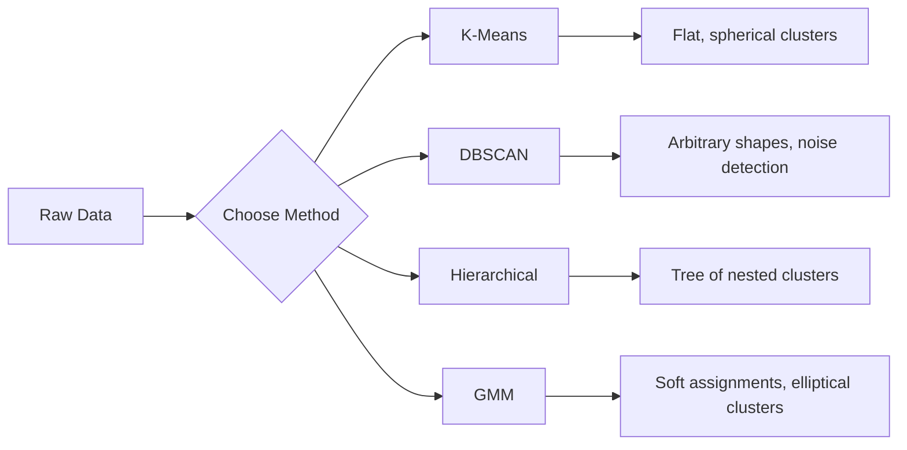

# Học không giám sát

> Không có nhãn, không có giáo viên. Thuật toán tự tìm thấy cấu trúc.

**Loại:** Xây dựng
**Ngôn ngữ:** Python
**Kiến thức tiên quyết:** Giai đoạn 1 (Định mức & Khoảng cách, Xác suất & Phân phối), Giai đoạn 2 Bài học 1-6
**Thời lượng:** ~90 phút

## Mục tiêu học tập

- Triển khai K-Means, DBSCAN và Gaussian Mixture Models từ đầu và so sánh hành vi phân cụm của chúng
- Đánh giá chất lượng cụm bằng cách sử dụng điểm bóng và phương pháp khuỷu tay để chọn K tối ưu
- Giải thích khi nào DBSCAN vượt trội hơn K-Means và xác định thuật toán nào xử lý các cụm và ngoại lệ không hình cầu
- Xây dựng pipeline phát hiện bất thường bằng cách sử dụng các phương pháp phân cụm để gắn cờ các điểm sai lệch so với các mẫu bình thường

## Vấn đề

Mỗi bài học ML cho đến nay đều giả định dữ liệu được dán nhãn: "đây là đầu vào, đây là đầu ra chính xác." Trong thế giới thực, nhãn rất đắt. Một bệnh viện có hàng triệu hồ sơ bệnh nhân nhưng không ai gắn thẻ thủ công từng bệnh với một danh mục bệnh. Một trang thương mại điện tử có hàng triệu sessions người dùng nhưng không ai có phân khúc khách hàng được dán nhãn thủ công. Một nhóm bảo mật có nhật ký mạng nhưng không ai gắn cờ mọi điểm bất thường.

Học tập không giám sát tìm ra các mẫu mà không được cho biết những gì cần tìm. Nó nhóm các điểm dữ liệu tương tự, phát hiện ra các cấu trúc ẩn và hiển thị các điểm bất thường. Nếu học có giám sát là học từ sách giáo khoa có câu trả lời, thì học không giám sát là nhìn chằm chằm vào dữ liệu thô cho đến khi các mẫu tự bộc lộ.

Điểm mấu chốt: nếu không có nhãn, bạn không thể trực tiếp đo lường "đúng" hay "sai". Bạn cần các công cụ khác nhau để đánh giá xem cấu trúc mà thuật toán của bạn tìm thấy có ý nghĩa hay không.

## Khái niệm

### Phân cụm: Nhóm những thứ tương tự lại với nhau

Phân cụm gán mỗi điểm dữ liệu cho một nhóm (cụm) để các điểm trong cùng một nhóm giống nhau hơn so với các điểm trong các nhóm khác. Câu hỏi luôn là: "tương tự" có nghĩa là gì?



### K-Means: Con ngựa làm việc

K-Means phân vùng dữ liệu thành chính xác các cụm K. Mỗi cụm có một centroid (trọng tâm của nó), và mỗi điểm thuộc về centroid gần nhất.

Thuật toán của Lloyd:

1. Chọn K điểm ngẫu nhiên làm tâm ban đầu
2. Gán từng điểm dữ liệu cho centroid gần nhất
3. Tính toán lại mỗi centroid làm giá trị trung bình của các điểm được gán của nó
4. Lặp lại các bước 2-3 cho đến khi bài tập ngừng thay đổi

Hàm mục tiêu (quán tính) đo tổng khoảng cách bình phương từ mỗi điểm đến tâm được chỉ định của nó. K-Means giảm thiểu điều này, nhưng chỉ tìm thấy mức tối thiểu cục bộ. Các lần khởi tạo khác nhau có thể cho kết quả khác nhau.

### Chọn K

Hai phương pháp tiêu chuẩn:

**Phương pháp khuỷu tay: **Chạy K-Means cho K = 1, 2, 3, ..., n. Quán tính cốt truyện so với K. Tìm kiếm "khuỷu tay" nơi việc thêm nhiều cụm hơn sẽ ngừng giảm quán tính đáng kể.

**Điểm bóng:** Đối với mỗi điểm, hãy đo mức độ tương đồng của nó với cụm (a) của chính nó so với cụm khác gần nhất (b). Hệ số hình bóng là (b - a) / max(a, b), nằm trong khoảng từ -1 (sai cụm) đến +1 (phân cụm tốt). Trung bình trên tất cả các điểm cho điểm toàn cầu.

### DBSCAN: Phân cụm dựa trên mật độ

K-Means giả định các cụm là hình cầu và yêu cầu bạn chọn K trước. DBSCAN không đưa ra cả hai giả định. Nó tìm thấy các cụm là các vùng dày đặc được ngăn cách bởi các vùng thưa thớt.

Hai parameters:
- **EPS**: Bán kính của một khu vực lân cận
- **min_samples**: số điểm tối thiểu cần thiết để tạo thành một vùng dày đặc

Ba loại điểm:
- **Điểm lõi**: có ít nhất min_samples điểm trong khoảng cách eps
- **Điểm biên giới**: trong eps của một điểm cốt lõi nhưng bản thân nó không phải là điểm cốt lõi
- **Điểm nhiễu**: không phải lõi cũng không có đường viền. Đây là những ngoại lệ.

DBSCAN kết nối các điểm cốt lõi nằm trong eps của nhau vào cùng một cụm. Các điểm biên giới tham gia cụm của một điểm lõi gần đó. Điểm nhiễu không thuộc cụm.

Điểm mạnh: tìm các cụm có hình dạng bất kỳ, tự động xác định số lượng cụm, xác định các ngoại lệ. Điểm yếu: vật lộn với các cụm có mật độ khác nhau.

### Phân cụm phân cấp

Xây dựng một cây (dendrogram) gồm các cụm lồng nhau.

Kết tụ (từ dưới lên):
1. Bắt đầu với mỗi điểm dưới dạng cụm riêng
2. Merge hai cụm gần nhất
3. Lặp lại cho đến khi chỉ còn lại một cụm
4. Cắt dendrogram ở mức mong muốn để có được cụm K

"Độ gần" giữa các cụm có thể được đo lường như sau:
- **Liên kết đơn**: khoảng cách tối thiểu giữa hai điểm bất kỳ trong hai cụm
- **Liên kết hoàn chỉnh**: khoảng cách tối đa giữa hai điểm bất kỳ
- **Liên kết trung bình**: khoảng cách trung bình giữa tất cả các cặp
- **Phương pháp của Ward**: merge gây ra sự gia tăng nhỏ nhất trong tổng variance trong cụm

### Hỗn hợp Gaussian Models (GMM)

K-Means đưa ra các nhiệm vụ khó: mỗi điểm thuộc về chính xác một cụm. GMM đưa ra các nhiệm vụ mềm: mỗi điểm có xác suất thuộc về mỗi cụm.

GMM giả định dữ liệu được tạo ra từ hỗn hợp các phân phối K Gaussian, mỗi phân phối có giá trị trung bình và hiệp phương sai riêng. Thuật toán Kỳ vọng-Tối đa hóa (EM) xen kẽ giữa:

- **Bước E**: tính xác suất mỗi điểm thuộc về mỗi Gaussian
- **M-step**: cập nhật giá trị trung bình, hiệp phương sai và trọng số trộn của mỗi Gaussian để tối đa hóa likelihood của dữ liệu

GMM có thể model các cụm hình elip (không chỉ hình cầu như K-Means) và xử lý các cụm chồng lên nhau một cách tự nhiên.

### Khi nào sử dụng

| Phương pháp | Tốt nhất cho | Tránh khi |
|--------|----------|------------|
| K-Phương tiện | Cụm datasets lớn, hình cầu, được gọi là K | Hình dạng không đều, ngoại lệ hiện diện |
| Máy quét DBSCAN | K không xác định, hình dạng tùy ý, phát hiện ngoại lệ | Mật độ khác nhau, kích thước rất cao |
| Phân cấp | datasets nhỏ, cần dendrogram, không rõ K | Bộ nhớ datasets lớn (O (n ^ 2)) |
| GMM | Các cụm chồng chéo, cần phân công mềm | datasets rất lớn, quá nhiều kích thước |

### Phát hiện bất thường với phân cụm

Phân cụm hỗ trợ phát hiện bất thường một cách tự nhiên:
- **K-Means**: điểm xa bất kỳ tâm nào là dị thường
- **DBSCAN**: điểm nhiễu là điểm bất thường theo định nghĩa
- **GMM**: điểm có xác suất thấp dưới tất cả các Gaussian là dị thường

```figure
kmeans-step
```

## Tự xây dựng

### Bước 1: K-Means từ đầu

```python
import math
import random


def euclidean_distance(a, b):
    return math.sqrt(sum((ai - bi) ** 2 for ai, bi in zip(a, b)))


def kmeans(data, k, max_iterations=100, seed=42):
    random.seed(seed)
    n_features = len(data[0])

    centroids = random.sample(data, k)

    for iteration in range(max_iterations):
        clusters = [[] for _ in range(k)]
        assignments = []

        for point in data:
            distances = [euclidean_distance(point, c) for c in centroids]
            nearest = distances.index(min(distances))
            clusters[nearest].append(point)
            assignments.append(nearest)

        new_centroids = []
        for cluster in clusters:
            if len(cluster) == 0:
                new_centroids.append(random.choice(data))
                continue
            centroid = [
                sum(point[j] for point in cluster) / len(cluster)
                for j in range(n_features)
            ]
            new_centroids.append(centroid)

        if all(
            euclidean_distance(old, new) < 1e-6
            for old, new in zip(centroids, new_centroids)
        ):
            print(f"  Converged at iteration {iteration + 1}")
            break

        centroids = new_centroids

    return assignments, centroids
```

### Bước 2: Phương pháp khuỷu tay và điểm bóng

```python
def compute_inertia(data, assignments, centroids):
    total = 0.0
    for point, cluster_id in zip(data, assignments):
        total += euclidean_distance(point, centroids[cluster_id]) ** 2
    return total


def silhouette_score(data, assignments):
    n = len(data)
    if n < 2:
        return 0.0

    clusters = {}
    for i, c in enumerate(assignments):
        clusters.setdefault(c, []).append(i)

    if len(clusters) < 2:
        return 0.0

    scores = []
    for i in range(n):
        own_cluster = assignments[i]
        own_members = [j for j in clusters[own_cluster] if j != i]

        if len(own_members) == 0:
            scores.append(0.0)
            continue

        a = sum(euclidean_distance(data[i], data[j]) for j in own_members) / len(own_members)

        b = float("inf")
        for cluster_id, members in clusters.items():
            if cluster_id == own_cluster:
                continue
            avg_dist = sum(euclidean_distance(data[i], data[j]) for j in members) / len(members)
            b = min(b, avg_dist)

        if max(a, b) == 0:
            scores.append(0.0)
        else:
            scores.append((b - a) / max(a, b))

    return sum(scores) / len(scores)


def find_best_k(data, max_k=10):
    print("Elbow method:")
    inertias = []
    for k in range(1, max_k + 1):
        assignments, centroids = kmeans(data, k)
        inertia = compute_inertia(data, assignments, centroids)
        inertias.append(inertia)
        print(f"  K={k}: inertia={inertia:.2f}")

    print("\nSilhouette scores:")
    for k in range(2, max_k + 1):
        assignments, centroids = kmeans(data, k)
        score = silhouette_score(data, assignments)
        print(f"  K={k}: silhouette={score:.4f}")

    return inertias
```

### Bước 3: DBSCAN từ đầu

```python
def dbscan(data, eps, min_samples):
    n = len(data)
    labels = [-1] * n
    cluster_id = 0

    def region_query(point_idx):
        neighbors = []
        for i in range(n):
            if euclidean_distance(data[point_idx], data[i]) <= eps:
                neighbors.append(i)
        return neighbors

    visited = [False] * n

    for i in range(n):
        if visited[i]:
            continue
        visited[i] = True

        neighbors = region_query(i)

        if len(neighbors) < min_samples:
            labels[i] = -1
            continue

        labels[i] = cluster_id
        seed_set = list(neighbors)
        seed_set.remove(i)

        j = 0
        while j < len(seed_set):
            q = seed_set[j]

            if not visited[q]:
                visited[q] = True
                q_neighbors = region_query(q)
                if len(q_neighbors) >= min_samples:
                    for nb in q_neighbors:
                        if nb not in seed_set:
                            seed_set.append(nb)

            if labels[q] == -1:
                labels[q] = cluster_id

            j += 1

        cluster_id += 1

    return labels
```

### Bước 4: Hỗn hợp Gaussian Model (thuật toán EM)

```python
def gmm(data, k, max_iterations=100, seed=42):
    random.seed(seed)
    n = len(data)
    d = len(data[0])

    indices = random.sample(range(n), k)
    means = [list(data[i]) for i in indices]
    variances = [1.0] * k
    weights = [1.0 / k] * k

    def gaussian_pdf(x, mean, variance):
        d = len(x)
        coeff = 1.0 / ((2 * math.pi * variance) ** (d / 2))
        exponent = -sum((xi - mi) ** 2 for xi, mi in zip(x, mean)) / (2 * variance)
        return coeff * math.exp(max(exponent, -500))

    for iteration in range(max_iterations):
        responsibilities = []
        for i in range(n):
            probs = []
            for j in range(k):
                probs.append(weights[j] * gaussian_pdf(data[i], means[j], variances[j]))
            total = sum(probs)
            if total == 0:
                total = 1e-300
            responsibilities.append([p / total for p in probs])

        old_means = [list(m) for m in means]

        for j in range(k):
            r_sum = sum(responsibilities[i][j] for i in range(n))
            if r_sum < 1e-10:
                continue

            weights[j] = r_sum / n

            for dim in range(d):
                means[j][dim] = sum(
                    responsibilities[i][j] * data[i][dim] for i in range(n)
                ) / r_sum

            variances[j] = sum(
                responsibilities[i][j]
                * sum((data[i][dim] - means[j][dim]) ** 2 for dim in range(d))
                for i in range(n)
            ) / (r_sum * d)
            variances[j] = max(variances[j], 1e-6)

        shift = sum(
            euclidean_distance(old_means[j], means[j]) for j in range(k)
        )
        if shift < 1e-6:
            print(f"  GMM converged at iteration {iteration + 1}")
            break

    assignments = []
    for i in range(n):
        assignments.append(responsibilities[i].index(max(responsibilities[i])))

    return assignments, means, weights, responsibilities
```

### Bước 5: Tạo dữ liệu thử nghiệm và chạy mọi thứ

```python
def make_blobs(centers, n_per_cluster=50, spread=0.5, seed=42):
    random.seed(seed)
    data = []
    true_labels = []
    for label, (cx, cy) in enumerate(centers):
        for _ in range(n_per_cluster):
            x = cx + random.gauss(0, spread)
            y = cy + random.gauss(0, spread)
            data.append([x, y])
            true_labels.append(label)
    return data, true_labels


def make_moons(n_samples=200, noise=0.1, seed=42):
    random.seed(seed)
    data = []
    labels = []
    n_half = n_samples // 2
    for i in range(n_half):
        angle = math.pi * i / n_half
        x = math.cos(angle) + random.gauss(0, noise)
        y = math.sin(angle) + random.gauss(0, noise)
        data.append([x, y])
        labels.append(0)
    for i in range(n_half):
        angle = math.pi * i / n_half
        x = 1 - math.cos(angle) + random.gauss(0, noise)
        y = 1 - math.sin(angle) - 0.5 + random.gauss(0, noise)
        data.append([x, y])
        labels.append(1)
    return data, labels


if __name__ == "__main__":
    centers = [[2, 2], [8, 3], [5, 8]]
    data, true_labels = make_blobs(centers, n_per_cluster=50, spread=0.8)

    print("=== K-Means on 3 blobs ===")
    assignments, centroids = kmeans(data, k=3)
    print(f"  Centroids: {[[round(c, 2) for c in cent] for cent in centroids]}")
    sil = silhouette_score(data, assignments)
    print(f"  Silhouette score: {sil:.4f}")

    print("\n=== Elbow Method ===")
    find_best_k(data, max_k=6)

    print("\n=== DBSCAN on 3 blobs ===")
    db_labels = dbscan(data, eps=1.5, min_samples=5)
    n_clusters = len(set(db_labels) - {-1})
    n_noise = db_labels.count(-1)
    print(f"  Found {n_clusters} clusters, {n_noise} noise points")

    print("\n=== GMM on 3 blobs ===")
    gmm_assignments, gmm_means, gmm_weights, _ = gmm(data, k=3)
    print(f"  Means: {[[round(m, 2) for m in mean] for mean in gmm_means]}")
    print(f"  Weights: {[round(w, 3) for w in gmm_weights]}")
    gmm_sil = silhouette_score(data, gmm_assignments)
    print(f"  Silhouette score: {gmm_sil:.4f}")

    print("\n=== DBSCAN on moons (non-spherical clusters) ===")
    moon_data, moon_labels = make_moons(n_samples=200, noise=0.1)
    moon_db = dbscan(moon_data, eps=0.3, min_samples=5)
    n_moon_clusters = len(set(moon_db) - {-1})
    n_moon_noise = moon_db.count(-1)
    print(f"  Found {n_moon_clusters} clusters, {n_moon_noise} noise points")

    print("\n=== K-Means on moons (will fail to separate) ===")
    moon_km, moon_centroids = kmeans(moon_data, k=2)
    moon_sil = silhouette_score(moon_data, moon_km)
    print(f"  Silhouette score: {moon_sil:.4f}")
    print("  K-Means splits moons poorly because they are not spherical")

    print("\n=== Anomaly detection with DBSCAN ===")
    anomaly_data = list(data)
    anomaly_data.append([20.0, 20.0])
    anomaly_data.append([-5.0, -5.0])
    anomaly_data.append([15.0, 0.0])
    anomaly_labels = dbscan(anomaly_data, eps=1.5, min_samples=5)
    anomalies = [
        anomaly_data[i]
        for i in range(len(anomaly_labels))
        if anomaly_labels[i] == -1
    ]
    print(f"  Detected {len(anomalies)} anomalies")
    for a in anomalies[-3:]:
        print(f"    Point {[round(v, 2) for v in a]}")
```

## Ứng dụng

Với scikit-learn, các thuật toán tương tự là một dòng:

```python
from sklearn.cluster import KMeans, DBSCAN, AgglomerativeClustering
from sklearn.mixture import GaussianMixture
from sklearn.metrics import silhouette_score as sklearn_silhouette

km = KMeans(n_clusters=3, random_state=42).fit(data)
db = DBSCAN(eps=1.5, min_samples=5).fit(data)
agg = AgglomerativeClustering(n_clusters=3).fit(data)
gmm_model = GaussianMixture(n_components=3, random_state=42).fit(data)
```

Các phiên bản từ đầu cho bạn thấy chính xác những gì các thư viện này tính toán. K-Means lặp lại giữa gán và tính toán lại. DBSCAN phát triển các cụm từ hạt dày đặc. GMM xen kẽ giữa kỳ vọng và tối đa hóa. Các phiên bản thư viện bổ sung độ ổn định về số, khởi tạo thông minh hơn (K-Means++) và tăng tốc GPU, nhưng logic cốt lõi là như nhau.

## Sản phẩm bàn giao

Bài học này tạo ra các triển khai hoạt động của K-Means, DBSCAN và GMM từ đầu. Mã phân cụm có thể được sử dụng lại làm nền tảng cho các phương thức không giám sát nâng cao hơn.

## Bài tập

1. Thực hiện khởi tạo K-Means++: thay vì chọn các centroid ngẫu nhiên, hãy chọn ngẫu nhiên đầu tiên và mỗi centroid tiếp theo với xác suất tỷ lệ thuận với khoảng cách bình phương của nó từ centroid hiện có gần nhất. So sánh tốc độ hội tụ với khởi tạo ngẫu nhiên.
2. Thêm phân cụm kết tụ phân cấp vào mã. Thực hiện liên kết của Ward và tạo ra một dendrogram (dưới dạng danh sách lồng nhau của merges). Cắt nó ở các cấp độ khác nhau và so sánh với kết quả K-Means.
3. Xây dựng một pipeline phát hiện bất thường đơn giản: chạy DBSCAN và GMM trên cùng một dữ liệu, các điểm gắn cờ mà cả hai phương pháp đều đồng ý là ngoại lệ (nhiễu trong DBSCAN, xác suất thấp trong GMM). Đo lường sự chồng chéo và thảo luận khi các phương pháp không đồng ý.

## Thuật ngữ chính

| Thuật ngữ | Những gì mọi người nói | Ý nghĩa thực sự của nó |
|------|----------------|----------------------|
| Phân cụm | "Nhóm những thứ tương tự" | Phân vùng dữ liệu thành các tập con trong đó sự tương đồng trong nhóm vượt quá sự tương đồng giữa các nhóm, được đo bằng một số liệu khoảng cách cụ thể |
| Trung tâm | "Trung tâm của một cụm" | Giá trị trung bình của tất cả các điểm được gán cho một cụm; được K-Means sử dụng làm đại diện cụm |
| Quán tính | "Các cụm chặt chẽ như thế nào" | Tổng khoảng cách bình phương từ mỗi điểm đến tâm được chỉ định của nó; thấp hơn là chặt chẽ hơn |
| Điểm hình bóng | "Các cụm được tách biệt tốt như thế nào" | Đối với mỗi điểm, (b - a) / max(a, b) trong đó a là khoảng cách trung bình trong cụm và b là khoảng cách trung bình của cụm gần nhất |
| Điểm cốt lõi | "Một điểm trong một khu vực dày đặc" | Một điểm có ít nhất min_samples hàng xóm trong khoảng cách eps, trong DBSCAN |
| Thuật toán EM | "Ý nghĩa K mềm" | Kỳ vọng-Tối đa hóa: tính toán lặp đi lặp lại xác suất thành viên (E-step) và cập nhật parameters phân phối (M-step) |
| Biểu đồ Dendrogram | "Một cây của các cụm" | Sơ đồ cây cho thấy thứ tự và khoảng cách mà các cụm được merged trong phân cụm phân cấp |
| Dị thường | "Một ngoại lệ" | Một điểm dữ liệu không phù hợp với mẫu dự kiến, được xác định là nhiễu bởi DBSCAN hoặc xác suất thấp bởi GMM |

## Đọc thêm

- [Stanford CS229 - Unsupervised Learning](https://cs229.stanford.edu/notes2022fall/main_notes.pdf) - Ghi chú bài giảng của Andrew Ng về phân cụm và EM
- [scikit-learn Clustering Guide](https://scikit-learn.org/stable/modules/clustering.html) - so sánh thực tế tất cả các thuật toán phân cụm với các ví dụ trực quan
- [DBSCAN original paper (Ester et al., 1996)](https://www.aaai.org/Papers/KDD/1996/KDD96-037.pdf) - bài báo giới thiệu phân cụm dựa trên mật độ
