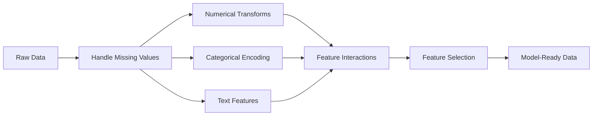

# Feature Engineering & Lựa chọn

> Một feature tốt có giá trị một nghìn điểm dữ liệu.

**Loại:** Xây dựng
**Ngôn ngữ:** Python
**Kiến thức tiên quyết:** Giai đoạn 1 (Thống kê cho ML, Đại số tuyến tính), Giai đoạn 2 Bài 1-7
**Thời lượng:** ~90 phút

## Mục tiêu học tập

- Thực hiện các phép biến đổi số (tiêu chuẩn hóa, chia tỷ lệ tối thiểu-tối đa, chuyển đổi nhật ký, ghép cụ) và giải thích khi nào mỗi phép phù hợp
- Xây dựng mã hóa một nóng, nhãn và mã hóa đích để features phân loại và xác định rủi ro rò rỉ dữ liệu trong mã hóa đích
- Xây dựng một bộ vectorizer TF-IDF từ đầu và giải thích lý do tại sao nó vượt trội hơn số lượng từ thô để phân loại văn bản
- Áp dụng lựa chọn feature dựa trên bộ lọc (variance ngưỡng, tương quan, thông tin lẫn nhau) để giảm kích thước

## Vấn đề

Bạn có một dataset. Bạn chọn một thuật toán. Bạn huấn luyện nó. Kết quả là tầm thường. Bạn thử một thuật toán lạ mắt hơn. Vẫn tầm thường. Bạn dành một tuần để điều chỉnh hyperparameters. Cải thiện biên.

Sau đó, ai đó chuyển đổi dữ liệu thô thành features tốt hơn và một hồi quy logistic đơn giản đánh bại tập hợp được điều chỉnh gradient tăng cường của bạn.

Điều này xảy ra liên tục. Trong ML cổ điển, việc thể hiện dữ liệu quan trọng hơn việc lựa chọn thuật toán. Một model giá nhà với "diện tích vuông" và "số phòng ngủ" sẽ đánh bại một model có "địa chỉ như một chuỗi thô" cho dù người học có tinh vi đến đâu. Thuật toán chỉ có thể hoạt động với những gì bạn cung cấp cho nó.

Feature engineering là process chuyển đổi dữ liệu thô thành các biểu diễn giúp models tìm thấy các mẫu dễ dàng hơn. Feature lựa chọn là process vứt bỏ features thêm nhiễu mà không thêm tín hiệu. Cùng với nhau, chúng là hoạt động có đòn bẩy cao nhất trong ML cổ điển.

## Khái niệm

### Các Feature Pipeline



### Features số

Các số thô hiếm khi sẵn sàng model. Các biến đổi phổ biến:

**Tỷ lệ:** Đặt features trên cùng một phạm vi để các thuật toán dựa trên khoảng cách (K-Means, KNN, SVM) đối xử với tất cả features như nhau. Bản đồ tỷ lệ tối thiểu-tối đa thành [0, 1]. Tiêu chuẩn hóa (z-score) ánh xạ đến trung bình = 0, tiêu chuẩn = 1.

**Biến đổi nhật ký:** Nén các phân phối lệch phải (thu nhập, dân số, số từ). Biến các mối quan hệ nhân thành mối quan hệ cộng.

**Binning:** Chuyển đổi các giá trị liên tục thành các danh mục. Hữu ích khi mối quan hệ giữa feature và mục tiêu là phi tuyến tính nhưng theo từng bước (ví dụ: nhóm tuổi).

**features đa thức: **Tạo các số hạng x ^ 2, x ^ 3, x1 * x2. Cho phép models tuyến tính nắm bắt các mối quan hệ phi tuyến tính với chi phí features nhiều hơn.

### Phân loại Features

Models cần những con số. Danh mục cần mã hóa.

**Mã hóa một nóng:** Tạo một cột nhị phân cho mỗi danh mục. "color = red/blue/green" trở thành ba cột: is_red, is_blue, is_green. Hoạt động tốt cho features số lượng thấp nhưng bùng nổ với nhiều danh mục.

**Mã hóa nhãn:** Ánh xạ mỗi danh mục thành một số nguyên: đỏ = 0, xanh lam = 1, xanh lá cây = 2. Giới thiệu thứ tự sai (model có thể nghĩ rằng màu xanh lá cây > màu xanh lam > màu đỏ). Chỉ thích hợp cho các models dựa trên cây phân chia theo các giá trị riêng lẻ.

**Mã hóa mục tiêu:** Thay thế mỗi danh mục bằng giá trị trung bình của biến mục tiêu cho danh mục đó. Mạnh mẽ nhưng nguy hiểm: nguy cơ rò rỉ dữ liệu cao. Chỉ được tính toán trên dữ liệu training và áp dụng cho dữ liệu thử nghiệm.

### Features văn bản

**Đếm vectorizer:** Đếm số lần mỗi từ xuất hiện trong một tài liệu. "Con mèo ngồi trên thảm" trở thành {the: 2, cat: 1, sat: 1, on: 1, mat: 1}.

**TF-IDF: **Thuật ngữ tần số tài liệu nghịch đảo. Cân nhắc các từ theo mức độ độc đáo của chúng trên các tài liệu. Những từ phổ biến như "the" có trọng lượng thấp. Những từ hiếm, đặc biệt có trọng lượng cao.

```
TF(word, doc) = count(word in doc) / total words in doc
IDF(word) = log(total docs / docs containing word)
TF-IDF = TF * IDF
```

### Giá trị còn thiếu

Dữ liệu thực có lỗ hổng. Chiến lược:

- **Thả hàng: **Chỉ khi dữ liệu bị thiếu hiếm và ngẫu nhiên
- **Mean/median gán: **Đơn giản, bảo toàn hình dạng phân phối (trung vị mạnh hơn đối với các ngoại lệ)
- **Gán chế độ: **Đối với features phân loại
- **Cột chỉ báo: **Thêm cột nhị phân "was_this_missing" trước khi gán. Thực tế là dữ liệu bị thiếu có thể là thông tin
- **Forward/backward điền: **Đối với dữ liệu chuỗi thời gian

### Tương tác Feature

Đôi khi mối quan hệ là sự kết hợp. Chỉ riêng "chiều cao" và "cân nặng" ít dự đoán hơn "BMI = cân nặng / chiều cao ^ 2". Feature tương tác sẽ nhân lên không gian feature, vì vậy hãy sử dụng kiến thức miền để chọn những tương tác phù hợp.

### Feature Lựa chọn

Nhiều features hơn không phải lúc nào cũng tốt hơn. Không liên quan features thêm nhiễu, tăng thời gian training và có thể gây overfitting.

**Phương pháp lọc (model trước):**
- Tương quan: loại bỏ features tương quan cao với nhau (dư thừa)
- Thông tin lẫn nhau: đo lường mức độ biết của một feature làm giảm sự không chắc chắn về mục tiêu
- Ngưỡng Variance: loại bỏ các features hầu như không thay đổi

**Phương thức bao bọc (dựa trên model):**
- Chính quy hóa L1 (Lasso): điều khiển trọng số feature không liên quan đến chính xác bằng không
- Loại bỏ feature đệ quy: huấn luyện, loại bỏ feature ít quan trọng nhất, lặp lại

**Tại sao lựa chọn lại quan trọng: **Một model có 10 features tốt thường sẽ vượt trội hơn một model có 10 features tốt và 90  ồn ào. Các features ồn ào tạo cơ hội cho model để quá phù hợp với các mẫu dữ liệu training không khái quát hóa.

```figure
feature-scaling
```

## Tự xây dựng

### Bước 1: Biến đổi số từ đầu

```python
import math


def min_max_scale(values):
    min_val = min(values)
    max_val = max(values)
    if max_val == min_val:
        return [0.0] * len(values)
    return [(v - min_val) / (max_val - min_val) for v in values]


def standardize(values):
    n = len(values)
    mean = sum(values) / n
    variance = sum((v - mean) ** 2 for v in values) / n
    std = math.sqrt(variance) if variance > 0 else 1.0
    return [(v - mean) / std for v in values]


def log_transform(values):
    return [math.log(v + 1) for v in values]


def bin_values(values, n_bins=5):
    min_val = min(values)
    max_val = max(values)
    bin_width = (max_val - min_val) / n_bins
    if bin_width == 0:
        return [0] * len(values)
    result = []
    for v in values:
        bin_idx = int((v - min_val) / bin_width)
        bin_idx = min(bin_idx, n_bins - 1)
        result.append(bin_idx)
    return result


def polynomial_features(row, degree=2):
    n = len(row)
    result = list(row)
    if degree >= 2:
        for i in range(n):
            result.append(row[i] ** 2)
        for i in range(n):
            for j in range(i + 1, n):
                result.append(row[i] * row[j])
    return result
```

### Bước 2: Mã hóa phân loại từ đầu

```python
def one_hot_encode(values):
    categories = sorted(set(values))
    cat_to_idx = {cat: i for i, cat in enumerate(categories)}
    n_cats = len(categories)

    encoded = []
    for v in values:
        row = [0] * n_cats
        row[cat_to_idx[v]] = 1
        encoded.append(row)

    return encoded, categories


def label_encode(values):
    categories = sorted(set(values))
    cat_to_int = {cat: i for i, cat in enumerate(categories)}
    return [cat_to_int[v] for v in values], cat_to_int


def target_encode(feature_values, target_values, smoothing=10):
    global_mean = sum(target_values) / len(target_values)

    category_stats = {}
    for feat, target in zip(feature_values, target_values):
        if feat not in category_stats:
            category_stats[feat] = {"sum": 0.0, "count": 0}
        category_stats[feat]["sum"] += target
        category_stats[feat]["count"] += 1

    encoding = {}
    for cat, stats in category_stats.items():
        cat_mean = stats["sum"] / stats["count"]
        weight = stats["count"] / (stats["count"] + smoothing)
        encoding[cat] = weight * cat_mean + (1 - weight) * global_mean

    return [encoding[v] for v in feature_values], encoding
```

### Bước 3: features văn bản từ đầu

```python
def count_vectorize(documents):
    vocab = {}
    idx = 0
    for doc in documents:
        for word in doc.lower().split():
            if word not in vocab:
                vocab[word] = idx
                idx += 1

    vectors = []
    for doc in documents:
        vec = [0] * len(vocab)
        for word in doc.lower().split():
            vec[vocab[word]] += 1
        vectors.append(vec)

    return vectors, vocab


def tfidf(documents):
    n_docs = len(documents)

    vocab = {}
    idx = 0
    for doc in documents:
        for word in doc.lower().split():
            if word not in vocab:
                vocab[word] = idx
                idx += 1

    doc_freq = {}
    for doc in documents:
        seen = set()
        for word in doc.lower().split():
            if word not in seen:
                doc_freq[word] = doc_freq.get(word, 0) + 1
                seen.add(word)

    vectors = []
    for doc in documents:
        words = doc.lower().split()
        word_count = len(words)
        tf_map = {}
        for word in words:
            tf_map[word] = tf_map.get(word, 0) + 1

        vec = [0.0] * len(vocab)
        for word, count in tf_map.items():
            tf = count / word_count
            idf = math.log(n_docs / doc_freq[word])
            vec[vocab[word]] = tf * idf
        vectors.append(vec)

    return vectors, vocab
```

### Bước 4: Thiếu gán giá trị từ đầu

```python
def impute_mean(values):
    present = [v for v in values if v is not None]
    if not present:
        return [0.0] * len(values), 0.0
    mean = sum(present) / len(present)
    return [v if v is not None else mean for v in values], mean


def impute_median(values):
    present = sorted(v for v in values if v is not None)
    if not present:
        return [0.0] * len(values), 0.0
    n = len(present)
    if n % 2 == 0:
        median = (present[n // 2 - 1] + present[n // 2]) / 2
    else:
        median = present[n // 2]
    return [v if v is not None else median for v in values], median


def impute_mode(values):
    present = [v for v in values if v is not None]
    if not present:
        return values, None
    counts = {}
    for v in present:
        counts[v] = counts.get(v, 0) + 1
    mode = max(counts, key=counts.get)
    return [v if v is not None else mode for v in values], mode


def add_missing_indicator(values):
    return [0 if v is not None else 1 for v in values]
```

### Bước 5: Feature lựa chọn từ đầu

```python
def correlation(x, y):
    n = len(x)
    mean_x = sum(x) / n
    mean_y = sum(y) / n
    cov = sum((xi - mean_x) * (yi - mean_y) for xi, yi in zip(x, y)) / n
    std_x = math.sqrt(sum((xi - mean_x) ** 2 for xi in x) / n)
    std_y = math.sqrt(sum((yi - mean_y) ** 2 for yi in y) / n)
    if std_x == 0 or std_y == 0:
        return 0.0
    return cov / (std_x * std_y)


def mutual_information(feature, target, n_bins=10):
    feat_min = min(feature)
    feat_max = max(feature)
    bin_width = (feat_max - feat_min) / n_bins if feat_max != feat_min else 1.0
    feat_binned = [
        min(int((f - feat_min) / bin_width), n_bins - 1) for f in feature
    ]

    n = len(feature)
    target_classes = sorted(set(target))

    feat_bins = sorted(set(feat_binned))
    p_feat = {}
    for b in feat_bins:
        p_feat[b] = feat_binned.count(b) / n

    p_target = {}
    for t in target_classes:
        p_target[t] = target.count(t) / n

    mi = 0.0
    for b in feat_bins:
        for t in target_classes:
            joint_count = sum(
                1 for fb, tv in zip(feat_binned, target) if fb == b and tv == t
            )
            p_joint = joint_count / n
            if p_joint > 0:
                mi += p_joint * math.log(p_joint / (p_feat[b] * p_target[t]))

    return mi


def variance_threshold(features, threshold=0.01):
    n_features = len(features[0])
    n_samples = len(features)
    selected = []

    for j in range(n_features):
        col = [features[i][j] for i in range(n_samples)]
        mean = sum(col) / n_samples
        var = sum((v - mean) ** 2 for v in col) / n_samples
        if var >= threshold:
            selected.append(j)

    return selected


def remove_correlated(features, threshold=0.9):
    n_features = len(features[0])
    n_samples = len(features)

    to_remove = set()
    for i in range(n_features):
        if i in to_remove:
            continue
        col_i = [features[r][i] for r in range(n_samples)]
        for j in range(i + 1, n_features):
            if j in to_remove:
                continue
            col_j = [features[r][j] for r in range(n_samples)]
            corr = abs(correlation(col_i, col_j))
            if corr >= threshold:
                to_remove.add(j)

    return [i for i in range(n_features) if i not in to_remove]
```

### Bước 6: Toàn bộ pipeline và demo

```python
import random


def make_housing_data(n=200, seed=42):
    random.seed(seed)
    data = []
    for _ in range(n):
        sqft = random.uniform(500, 5000)
        bedrooms = random.choice([1, 2, 3, 4, 5])
        age = random.uniform(0, 50)
        neighborhood = random.choice(["downtown", "suburbs", "rural"])
        has_pool = random.choice([True, False])

        sqft_with_missing = sqft if random.random() > 0.05 else None
        age_with_missing = age if random.random() > 0.08 else None

        price = (
            50 * sqft
            + 20000 * bedrooms
            - 1000 * age
            + (50000 if neighborhood == "downtown" else 10000 if neighborhood == "suburbs" else 0)
            + (15000 if has_pool else 0)
            + random.gauss(0, 20000)
        )

        data.append({
            "sqft": sqft_with_missing,
            "bedrooms": bedrooms,
            "age": age_with_missing,
            "neighborhood": neighborhood,
            "has_pool": has_pool,
            "price": price,
        })
    return data


if __name__ == "__main__":
    data = make_housing_data(200)

    print("=== Raw Data Sample ===")
    for row in data[:3]:
        print(f"  {row}")

    sqft_raw = [d["sqft"] for d in data]
    age_raw = [d["age"] for d in data]
    prices = [d["price"] for d in data]

    print("\n=== Missing Value Handling ===")
    sqft_missing = sum(1 for v in sqft_raw if v is None)
    age_missing = sum(1 for v in age_raw if v is None)
    print(f"  sqft missing: {sqft_missing}/{len(sqft_raw)}")
    print(f"  age missing: {age_missing}/{len(age_raw)}")

    sqft_indicator = add_missing_indicator(sqft_raw)
    age_indicator = add_missing_indicator(age_raw)
    sqft_imputed, sqft_fill = impute_median(sqft_raw)
    age_imputed, age_fill = impute_mean(age_raw)
    print(f"  sqft filled with median: {sqft_fill:.0f}")
    print(f"  age filled with mean: {age_fill:.1f}")

    print("\n=== Numerical Transforms ===")
    sqft_scaled = standardize(sqft_imputed)
    age_scaled = min_max_scale(age_imputed)
    sqft_log = log_transform(sqft_imputed)
    age_binned = bin_values(age_imputed, n_bins=5)
    print(f"  sqft standardized: mean={sum(sqft_scaled)/len(sqft_scaled):.4f}, std={math.sqrt(sum(v**2 for v in sqft_scaled)/len(sqft_scaled)):.4f}")
    print(f"  age min-max: [{min(age_scaled):.2f}, {max(age_scaled):.2f}]")
    print(f"  age bins: {sorted(set(age_binned))}")

    print("\n=== Categorical Encoding ===")
    neighborhoods = [d["neighborhood"] for d in data]

    ohe, ohe_cats = one_hot_encode(neighborhoods)
    print(f"  One-hot categories: {ohe_cats}")
    print(f"  Sample encoding: {neighborhoods[0]} -> {ohe[0]}")

    le, le_map = label_encode(neighborhoods)
    print(f"  Label encoding map: {le_map}")

    te, te_map = target_encode(neighborhoods, prices, smoothing=10)
    print(f"  Target encoding: {({k: round(v) for k, v in te_map.items()})}")

    print("\n=== Text Features ===")
    descriptions = [
        "large modern house with pool",
        "small cozy cottage near downtown",
        "spacious family home with large yard",
        "modern apartment downtown with view",
        "rustic cabin in rural area",
    ]
    cv, cv_vocab = count_vectorize(descriptions)
    print(f"  Vocabulary size: {len(cv_vocab)}")
    print(f"  Doc 0 non-zero features: {sum(1 for v in cv[0] if v > 0)}")

    tf, tf_vocab = tfidf(descriptions)
    print(f"  TF-IDF vocabulary size: {len(tf_vocab)}")
    top_words = sorted(tf_vocab.keys(), key=lambda w: tf[0][tf_vocab[w]], reverse=True)[:3]
    print(f"  Doc 0 top TF-IDF words: {top_words}")

    print("\n=== Polynomial Features ===")
    sample_row = [sqft_scaled[0], age_scaled[0]]
    poly = polynomial_features(sample_row, degree=2)
    print(f"  Input: {[round(v, 4) for v in sample_row]}")
    print(f"  Polynomial: {[round(v, 4) for v in poly]}")
    print(f"  Features: [x1, x2, x1^2, x2^2, x1*x2]")

    print("\n=== Feature Selection ===")
    feature_matrix = [
        [sqft_scaled[i], age_scaled[i], float(sqft_indicator[i]), float(age_indicator[i])]
        + ohe[i]
        for i in range(len(data))
    ]

    print(f"  Total features: {len(feature_matrix[0])}")

    surviving_var = variance_threshold(feature_matrix, threshold=0.01)
    print(f"  After variance threshold (0.01): {len(surviving_var)} features kept")

    surviving_corr = remove_correlated(feature_matrix, threshold=0.9)
    print(f"  After correlation filter (0.9): {len(surviving_corr)} features kept")

    binary_prices = [1 if p > sum(prices) / len(prices) else 0 for p in prices]
    print("\n  Mutual information with target:")
    feature_names = ["sqft", "age", "sqft_missing", "age_missing"] + [f"neigh_{c}" for c in ohe_cats]
    for j in range(len(feature_matrix[0])):
        col = [feature_matrix[i][j] for i in range(len(feature_matrix))]
        mi = mutual_information(col, binary_prices, n_bins=10)
        print(f"    {feature_names[j]}: MI={mi:.4f}")

    print("\n  Correlation with price:")
    for j in range(len(feature_matrix[0])):
        col = [feature_matrix[i][j] for i in range(len(feature_matrix))]
        corr = correlation(col, prices)
        print(f"    {feature_names[j]}: r={corr:.4f}")
```

## Ứng dụng

Với scikit-learn, các phép biến đổi này có thể kết hợp pipelines:

```python
from sklearn.preprocessing import StandardScaler, OneHotEncoder, PolynomialFeatures
from sklearn.impute import SimpleImputer
from sklearn.feature_extraction.text import TfidfVectorizer
from sklearn.feature_selection import mutual_info_classif, VarianceThreshold
from sklearn.compose import ColumnTransformer
from sklearn.pipeline import Pipeline

numeric_pipe = Pipeline([
    ("imputer", SimpleImputer(strategy="median")),
    ("scaler", StandardScaler()),
])

categorical_pipe = Pipeline([
    ("encoder", OneHotEncoder(sparse_output=False)),
])

preprocessor = ColumnTransformer([
    ("num", numeric_pipe, ["sqft", "age"]),
    ("cat", categorical_pipe, ["neighborhood"]),
])
```

Các phiên bản từ đầu hiển thị chính xác những gì xảy ra bên trong mỗi phép biến đổi. Các phiên bản thư viện bổ sung khả năng xử lý trường hợp biên, hỗ trợ ma trận thưa thớt và thành phần pipeline, nhưng toán học là như nhau.

## Sản phẩm bàn giao

Bài học này tạo ra:
- `outputs/prompt-feature-engineer.md` - một prompt để features kỹ thuật một cách có hệ thống từ dữ liệu thô

## Bài tập

1. Thêm tỷ lệ mạnh mẽ (sử dụng phạm vi trung bình và liên phần tư thay vì giá trị trung bình và độ lệch chuẩn) vào các phép biến đổi số. So sánh nó với tỷ lệ tiêu chuẩn trên dữ liệu có giá trị ngoại lệ cực đoan.
2. Triển khai mã hóa mục tiêu để lại một lần: đối với mỗi hàng, hãy tính giá trị trung bình mục tiêu loại trừ giá trị mục tiêu của hàng đó. Cho thấy cách điều này làm giảm overfitting so với mã hóa mục tiêu ngây thơ.
3. Xây dựng pipeline lựa chọn feature tự động kết hợp ngưỡng variance, lọc tương quan và xếp hạng thông tin lẫn nhau. Áp dụng nó cho dataset vỏ và so sánh hiệu suất model (sử dụng hồi quy tuyến tính đơn giản) với tất cả features so với features đã chọn.

## Thuật ngữ chính

| Thuật ngữ | Những gì mọi người nói | Ý nghĩa thực sự của nó |
|------|----------------|----------------------|
| Feature engineering | "Tạo cột mới" | Chuyển đổi dữ liệu thô thành các biểu diễn hiển thị các mẫu cho model |
| Tiêu chuẩn hóa | "Làm cho nó trở nên bình thường" | Trừ giá trị trung bình và chia cho độ lệch chuẩn để feature có giá trị trung bình = 0 và std = 1 |
| Mã hóa một nóng | "Tạo biến giả" | Tạo một cột nhị phân cho mỗi danh mục, trong đó chính xác một cột là 1 cho mỗi hàng |
| Mã hóa mục tiêu | "Sử dụng câu trả lời để mã hóa" | Thay thế từng danh mục bằng giá trị mục tiêu trung bình cho danh mục đó, bằng cách làm mịn để tránh overfitting |
| TF-IDF | "Số lượng từ lạ mắt" | Tần suất thuật ngữ nhân với tần số tài liệu nghịch đảo: các từ có trọng số theo mức độ khác biệt của chúng trên kho dữ liệu |
| Quy gán | "Điền vào chỗ trống" | Thay thế các giá trị bị thiếu bằng các giá trị ước tính (trung bình, trung bình, chế độ hoặc dự đoán model) |
| Lựa chọn Feature | "Vứt bỏ những cột xấu" | Loại bỏ features thêm nhiễu hoặc dư thừa, chỉ giữ lại những người có tín hiệu về mục tiêu |
| Thông tin lẫn nhau | "Điều này nói với bạn bao nhiêu về điều khác" | Một thước đo về sự giảm độ không chắc chắn về biến Y thu được bằng cách quan sát biến X |
| Rò rỉ dữ liệu | "Vô tình gian lận" | Sử dụng thông tin trong training sẽ không có sẵn tại thời điểm dự đoán, cho kết quả lạc quan sai lầm |

## Đọc thêm

- [Feature Engineering and Selection (Max Kuhn & Kjell Johnson)](http://www.feat.engineering/) - sách trực tuyến miễn phí bao gồm toàn bộ bối cảnh của feature engineering
- [scikit-learn Preprocessing Guide](https://scikit-learn.org/stable/modules/preprocessing.html) - tài liệu tham khảo thực tế cho tất cả các phép biến đổi chuẩn
- [Target Encoding Done Right (Micci-Barreca, 2001)](https://dl.acm.org/doi/10.1145/507533.507538) - giấy gốc trên mã hóa mục tiêu với tính năng làm mịn
