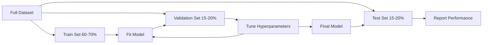

# Đánh giá Model

> Một model chỉ tốt bằng cách bạn đo lường nó.

**Loại:** Xây dựng
**Ngôn ngữ:** Python
**Kiến thức tiên quyết:** Giai đoạn 1 (Xác suất & Phân phối, Thống kê cho ML), Giai đoạn 2 Bài học 1-8
**Thời lượng:** ~90 phút

## Mục tiêu học tập

- Triển khai xác thực chéo K-fold và K-fold phân tầng từ đầu và giải thích lý do tại sao phân tầng lại quan trọng đối với dữ liệu không cân bằng
- Tính toán các chỉ số precision, recall, F1, AUC-ROC và hồi quy (MSE, RMSE, MAE, R-bình phương) từ đầu
- Giải thích các đường cong học tập để chẩn đoán xem model bị bias cao hay variance cao
- Xác định các lỗi đánh giá phổ biến bao gồm rò rỉ dữ liệu, lựa chọn sai số liệu và nhiễm bẩn bộ thử nghiệm

## Vấn đề

Bạn đã huấn luyện một model. Nó nhận được 95% accuracy dữ liệu của bạn. Nó có tốt không?

Có thể. Có lẽ không. Nếu 95% dữ liệu của bạn thuộc về một class, một model luôn dự đoán rằng class nhận được 95% accuracy trong khi hoàn toàn vô dụng. Nếu bạn đánh giá trên cùng một dữ liệu mà bạn đã huấn luyện, con số 95% là vô nghĩa vì model chỉ ghi nhớ câu trả lời. Nếu dataset của bạn có thành phần thời gian và bạn xáo trộn ngẫu nhiên trước khi tách, model của bạn có thể đang sử dụng dữ liệu trong tương lai để dự đoán quá khứ.

Đánh giá Model là nơi hầu hết các dự án ML đều sai. Số liệu sai làm cho một model xấu trông tốt. Việc phân tách sai cho phép một model gian lận. So sánh sai khiến bạn chọn model tồi tệ hơn. Đánh giá đúng không phải là tùy chọn. Đó là sự khác biệt giữa một model hoạt động trong production và một  không hoạt động ngay khi nó nhìn thấy dữ liệu thực.

## Khái niệm

### Huấn luyện, xác nhận, kiểm tra



Ba phần, ba mục đích:

- **Training đặt**: model học hỏi từ dữ liệu này. Nó thấy những ví dụ này trong training.
- **Bộ xác thực**: được sử dụng để điều chỉnh hyperparameters và chọn giữa models. model không bao giờ huấn luyện dựa trên dữ liệu này, nhưng quyết định của bạn bị ảnh hưởng bởi nó.
- **Bộ kiểm tra**: chạm chính xác một lần, ở cuối cùng, để báo cáo hiệu suất cuối cùng. Nếu bạn nhìn vào hiệu suất thử nghiệm và sau đó quay lại để thay đổi model của mình, nó không còn là một bộ thử nghiệm nữa. Nó đã trở thành một bộ xác thực thứ hai.

Bộ kiểm tra là sự đảm bảo của bạn rằng hiệu suất được báo cáo phản ánh cách model sẽ hoạt động trên dữ liệu thực sự không nhìn thấy.

### Xác thực chéo K-Fold

Với datasets nhỏ, một train/validation phân chia sẽ lãng phí dữ liệu và đưa ra ước tính nhiễu. Xác thực chéo K-fold sử dụng tất cả dữ liệu cho cả training và xác thực:

```mermaid
flowchart TB
    subgraph Fold1["Fold 1"]
        direction LR
        V1["Val"] --- T1a["Train"] --- T1b["Train"] --- T1c["Train"] --- T1d["Train"]
    end
    subgraph Fold2["Fold 2"]
        direction LR
        T2a["Train"] --- V2["Val"] --- T2b["Train"] --- T2c["Train"] --- T2d["Train"]
    end
    subgraph Fold3["Fold 3"]
        direction LR
        T3a["Train"] --- T3b["Train"] --- V3["Val"] --- T3c["Train"] --- T3d["Train"]
    end
    subgraph Fold4["Fold 4"]
        direction LR
        T4a["Train"] --- T4b["Train"] --- T4c["Train"] --- V4["Val"] --- T4d["Train"]
    end
    subgraph Fold5["Fold 5"]
        direction LR
        T5a["Train"] --- T5b["Train"] --- T5c["Train"] --- T5d["Train"] --- V5["Val"]
    end
    Fold1 --> R["Average scores"]
    Fold2 --> R
    Fold3 --> R
    Fold4 --> R
    Fold5 --> R
```



1. Chia dữ liệu thành K nếp gấp có kích thước bằng nhau
2. Đối với mỗi lần gấp, hãy tập luyện về các lần gấp K-1 và xác nhận trên các nếp gấp còn lại
3. Tính trung bình điểm xác thực K

K = 5 hoặc K = 10 là các lựa chọn tiêu chuẩn. Mỗi điểm dữ liệu được sử dụng để xác thực chính xác một lần. Điểm trung bình là một ước tính ổn định hơn bất kỳ sự phân chia đơn lẻ nào.

**Gấp K phân tầng**: giữ nguyên phân phối class trong mỗi nếp gấp. Nếu dataset của bạn là 70% class A và 30% class B, mỗi nếp gấp sẽ có tỷ lệ gần giống nhau. Điều này rất quan trọng đối với datasets mất cân bằng, trong đó việc phân tách ngẫu nhiên có thể đặt tất cả các mẫu thiểu số vào một nếp gấp.

### Chỉ số phân loại

**Ma trận nhầm lẫn**: nền tảng. Đối với phân loại nhị phân:

|| Dự đoán tích cực | Dự đoán tiêu cực |
| -- | --- | --- |
| Thực sự tích cực | Tích cực thực sự (TP) | Âm tính giả (FN) |
| Thực sự tiêu cực | Dương tính giả (FP) | Âm tính thực (TN) |

Từ ma trận này, tất cả các chỉ số khác như sau:

- **Accuracy** = (TP + TN) / (TP + TN + FP + FN). Phần dự đoán đúng. Gây hiểu lầm khi classes mất cân bằng.
- **Precision** = TP / (TP + FP). Trong tất cả những điều được dự đoán tích cực, có bao nhiêu điều thực sự là tích cực? Sử dụng khi dương tính giả tốn kém (ví dụ: bộ lọc thư rác đánh dấu email thật là thư rác).
- **Recall** (độ nhạy) = TP / (TP + FN). Trong số tất cả các điểm dương tính thực tế, chúng tôi đã bắt được bao nhiêu? Sử dụng khi âm tính giả tốn kém (ví dụ: sàng lọc ung thư thiếu khối u).
- **F1 score** = 2 * precision * recall / (precision + recall). Trung bình hài của precision và recall. Cân bằng cả hai khi không rõ ràng thống trị.
- **AUC-ROC**: Khu vực dưới đường cong đặc tính hoạt động của máy thu. Biểu đồ tỷ lệ dương tính thực và tỷ lệ dương tính giả ở các ngưỡng phân loại khác nhau. AUC = 0.5 có nghĩa là đoán ngẫu nhiên, AUC = 1.0 có nghĩa là tách biệt hoàn hảo. Không phụ thuộc vào ngưỡng: nó đo lường mức độ xếp hạng model tích cực trên tiêu cực, bất kể bạn chọn ngưỡng nào.

### Chỉ số hồi quy

- **MSE** (Sai số bình phương trung bình) = mean((y_true - y_pred)^2). Hình phạt các lỗi lớn bậc hai. Nhạy cảm với các ngoại lệ.
- **RMSE** (Lỗi bình phương trung bình gốc) = sqrt(MSE). Đơn vị giống như biến đích. Dễ giải thích hơn MSE.
- **MAE** (Sai số tuyệt đối trung bình) = mean(|y_true - y_pred|). Xử lý tất cả các lỗi một cách tuyến tính. Mạnh mẽ hơn so với các ngoại lệ so với MSE.
- **R-bình phương** = 1 - SS_res / SS_tot, trong đó SS_res = sum((y_true - y_pred)^2) và SS_tot = sum((y_true - y_mean)^2). Phần nhỏ của variance được giải thích bởi model. R^2 = 1.0 là hoàn hảo. R^2 = 0,0 có nghĩa là model không tốt hơn là luôn dự đoán giá trị trung bình. R^2 có thể âm nếu model kém hơn giá trị trung bình.

### Đường cong học tập

Vẽ training và điểm xác thực dưới dạng hàm của kích thước training đặt:

- **bias cao (underfitting)**: cả hai đường cong hội tụ đến điểm thấp. Thêm nhiều dữ liệu sẽ không giúp ích gì. Bạn cần một model phức tạp hơn.
- **variance cao (overfitting)**: training điểm cao nhưng điểm xác thực thấp hơn nhiều. Khoảng cách giữa chúng là lớn. Thêm nhiều dữ liệu hơn sẽ hữu ích.

### Đường cong xác thực

Vẽ training và điểm xác thực dưới dạng hàm của hyperparameter:

- Ở độ phức tạp thấp: cả hai điểm đều thấp (underfitting)
- Ở độ phức tạp phù hợp: cả hai điểm đều cao và gần nhau
- Ở độ phức tạp cao: điểm training vẫn cao nhưng điểm xác thực giảm (overfitting)

Giá trị hyperparameter tối ưu là nơi điểm xác thực đạt đỉnh.

### Những sai lầm đánh giá phổ biến

**Rò rỉ dữ liệu**: thông tin từ bộ thử nghiệm bị rò rỉ vào training. Ví dụ: lắp bộ chia tỷ lệ trên dataset đầy đủ trước khi tách, bao gồm dữ liệu trong tương lai trong dự đoán chuỗi thời gian, sử dụng feature có nguồn gốc từ mục tiêu. Luôn tách trước, sau đó xử lý trước.

**Class imbalance**: 99% giao dịch là hợp pháp, 1% là gian lận. Một model luôn dự đoán "hợp pháp" nhận được 99% accuracy. Thay vào đó, hãy sử dụng precision, recall, F1 hoặc AUC-ROC.

**Chỉ số sai**: tối ưu hóa accuracy khi nào bạn nên tối ưu hóa recall (chẩn đoán y tế) hoặc tối ưu hóa RMSE khi dữ liệu của bạn có giá trị ngoại lệ nặng (thay vào đó sử dụng MAE).

**Không sử dụng phân tách phân tầng**: với dữ liệu không cân bằng, phân tách ngẫu nhiên có thể đưa rất ít mẫu thiểu số vào nếp gấp xác thực, đưa ra ước tính không ổn định.

**Kiểm tra quá thường xuyên**: mỗi khi bạn nhìn vào hiệu suất kiểm tra và điều chỉnh, bạn sẽ quá phù hợp với bộ kiểm tra. Bộ thử nghiệm là sử dụng một lần.

```figure
precision-recall-threshold
```

## Tự xây dựng

### Bước 1: Train/validation/test tách

```python
import random
import math


def train_val_test_split(X, y, train_ratio=0.6, val_ratio=0.2, seed=42):
    random.seed(seed)
    n = len(X)
    indices = list(range(n))
    random.shuffle(indices)

    train_end = int(n * train_ratio)
    val_end = int(n * (train_ratio + val_ratio))

    train_idx = indices[:train_end]
    val_idx = indices[train_end:val_end]
    test_idx = indices[val_end:]

    X_train = [X[i] for i in train_idx]
    y_train = [y[i] for i in train_idx]
    X_val = [X[i] for i in val_idx]
    y_val = [y[i] for i in val_idx]
    X_test = [X[i] for i in test_idx]
    y_test = [y[i] for i in test_idx]

    return X_train, y_train, X_val, y_val, X_test, y_test
```

### Bước 2: Xác thực chéo K-fold và phân tầng

```python
def kfold_split(n, k=5, seed=42):
    random.seed(seed)
    indices = list(range(n))
    random.shuffle(indices)

    fold_size = n // k
    folds = []

    for i in range(k):
        start = i * fold_size
        end = start + fold_size if i < k - 1 else n
        val_idx = indices[start:end]
        train_idx = indices[:start] + indices[end:]
        folds.append((train_idx, val_idx))

    return folds


def stratified_kfold_split(y, k=5, seed=42):
    random.seed(seed)

    class_indices = {}
    for i, label in enumerate(y):
        class_indices.setdefault(label, []).append(i)

    for label in class_indices:
        random.shuffle(class_indices[label])

    folds = [{"train": [], "val": []} for _ in range(k)]

    for label, indices in class_indices.items():
        fold_size = len(indices) // k
        for i in range(k):
            start = i * fold_size
            end = start + fold_size if i < k - 1 else len(indices)
            val_part = indices[start:end]
            train_part = indices[:start] + indices[end:]
            folds[i]["val"].extend(val_part)
            folds[i]["train"].extend(train_part)

    return [(f["train"], f["val"]) for f in folds]


def cross_validate(X, y, model_fn, k=5, metric_fn=None, stratified=False):
    n = len(X)

    if stratified:
        folds = stratified_kfold_split(y, k)
    else:
        folds = kfold_split(n, k)

    scores = []
    for train_idx, val_idx in folds:
        X_train = [X[i] for i in train_idx]
        y_train = [y[i] for i in train_idx]
        X_val = [X[i] for i in val_idx]
        y_val = [y[i] for i in val_idx]

        model = model_fn()
        model.fit(X_train, y_train)
        predictions = [model.predict(x) for x in X_val]

        if metric_fn:
            score = metric_fn(y_val, predictions)
        else:
            score = sum(1 for yt, yp in zip(y_val, predictions) if yt == yp) / len(y_val)
        scores.append(score)

    return scores
```

### Bước 3: Ma trận nhầm lẫn và chỉ số phân loại

```python
def confusion_matrix(y_true, y_pred):
    tp = sum(1 for yt, yp in zip(y_true, y_pred) if yt == 1 and yp == 1)
    tn = sum(1 for yt, yp in zip(y_true, y_pred) if yt == 0 and yp == 0)
    fp = sum(1 for yt, yp in zip(y_true, y_pred) if yt == 0 and yp == 1)
    fn = sum(1 for yt, yp in zip(y_true, y_pred) if yt == 1 and yp == 0)
    return tp, tn, fp, fn


def accuracy(y_true, y_pred):
    tp, tn, fp, fn = confusion_matrix(y_true, y_pred)
    total = tp + tn + fp + fn
    return (tp + tn) / total if total > 0 else 0.0


def precision(y_true, y_pred):
    tp, tn, fp, fn = confusion_matrix(y_true, y_pred)
    return tp / (tp + fp) if (tp + fp) > 0 else 0.0


def recall(y_true, y_pred):
    tp, tn, fp, fn = confusion_matrix(y_true, y_pred)
    return tp / (tp + fn) if (tp + fn) > 0 else 0.0


def f1_score(y_true, y_pred):
    p = precision(y_true, y_pred)
    r = recall(y_true, y_pred)
    return 2 * p * r / (p + r) if (p + r) > 0 else 0.0


def roc_curve(y_true, y_scores):
    thresholds = sorted(set(y_scores), reverse=True)
    tpr_list = []
    fpr_list = []

    total_positives = sum(y_true)
    total_negatives = len(y_true) - total_positives

    for threshold in thresholds:
        y_pred = [1 if s >= threshold else 0 for s in y_scores]
        tp = sum(1 for yt, yp in zip(y_true, y_pred) if yt == 1 and yp == 1)
        fp = sum(1 for yt, yp in zip(y_true, y_pred) if yt == 0 and yp == 1)

        tpr = tp / total_positives if total_positives > 0 else 0.0
        fpr = fp / total_negatives if total_negatives > 0 else 0.0

        tpr_list.append(tpr)
        fpr_list.append(fpr)

    return fpr_list, tpr_list, thresholds


def auc_roc(y_true, y_scores):
    fpr_list, tpr_list, _ = roc_curve(y_true, y_scores)

    pairs = sorted(zip(fpr_list, tpr_list))
    fpr_sorted = [p[0] for p in pairs]
    tpr_sorted = [p[1] for p in pairs]

    area = 0.0
    for i in range(1, len(fpr_sorted)):
        width = fpr_sorted[i] - fpr_sorted[i - 1]
        height = (tpr_sorted[i] + tpr_sorted[i - 1]) / 2
        area += width * height

    return area
```

### Bước 4: Chỉ số hồi quy

```python
def mse(y_true, y_pred):
    n = len(y_true)
    return sum((yt - yp) ** 2 for yt, yp in zip(y_true, y_pred)) / n


def rmse(y_true, y_pred):
    return math.sqrt(mse(y_true, y_pred))


def mae(y_true, y_pred):
    n = len(y_true)
    return sum(abs(yt - yp) for yt, yp in zip(y_true, y_pred)) / n


def r_squared(y_true, y_pred):
    mean_y = sum(y_true) / len(y_true)
    ss_res = sum((yt - yp) ** 2 for yt, yp in zip(y_true, y_pred))
    ss_tot = sum((yt - mean_y) ** 2 for yt in y_true)
    if ss_tot == 0:
        return 0.0
    return 1.0 - ss_res / ss_tot
```

### Bước 5: Đường cong học tập

```python
def learning_curve(X, y, model_fn, metric_fn, train_sizes=None, val_ratio=0.2, seed=42):
    random.seed(seed)
    n = len(X)
    indices = list(range(n))
    random.shuffle(indices)

    val_size = int(n * val_ratio)
    val_idx = indices[:val_size]
    pool_idx = indices[val_size:]

    X_val = [X[i] for i in val_idx]
    y_val = [y[i] for i in val_idx]

    if train_sizes is None:
        train_sizes = [int(len(pool_idx) * r) for r in [0.1, 0.2, 0.4, 0.6, 0.8, 1.0]]

    train_scores = []
    val_scores = []

    for size in train_sizes:
        subset = pool_idx[:size]
        X_train = [X[i] for i in subset]
        y_train = [y[i] for i in subset]

        model = model_fn()
        model.fit(X_train, y_train)

        train_pred = [model.predict(x) for x in X_train]
        val_pred = [model.predict(x) for x in X_val]

        train_scores.append(metric_fn(y_train, train_pred))
        val_scores.append(metric_fn(y_val, val_pred))

    return train_sizes, train_scores, val_scores
```

### Bước 6: Một bộ phân loại đơn giản để thử nghiệm, cộng với bản demo đầy đủ

```python
class SimpleLogistic:
    def __init__(self, lr=0.1, epochs=100):
        self.lr = lr
        self.epochs = epochs
        self.weights = None
        self.bias = 0.0

    def sigmoid(self, z):
        z = max(-500, min(500, z))
        return 1.0 / (1.0 + math.exp(-z))

    def fit(self, X, y):
        n_features = len(X[0])
        self.weights = [0.0] * n_features
        self.bias = 0.0

        for _ in range(self.epochs):
            for xi, yi in zip(X, y):
                z = sum(w * x for w, x in zip(self.weights, xi)) + self.bias
                pred = self.sigmoid(z)
                error = yi - pred
                for j in range(n_features):
                    self.weights[j] += self.lr * error * xi[j]
                self.bias += self.lr * error

    def predict_proba(self, x):
        z = sum(w * xi for w, xi in zip(self.weights, x)) + self.bias
        return self.sigmoid(z)

    def predict(self, x):
        return 1 if self.predict_proba(x) >= 0.5 else 0


class SimpleLinearRegression:
    def __init__(self, lr=0.001, epochs=200):
        self.lr = lr
        self.epochs = epochs
        self.weights = None
        self.bias = 0.0

    def fit(self, X, y):
        n_features = len(X[0])
        self.weights = [0.0] * n_features
        self.bias = 0.0
        n = len(X)

        for _ in range(self.epochs):
            for xi, yi in zip(X, y):
                pred = sum(w * x for w, x in zip(self.weights, xi)) + self.bias
                error = yi - pred
                for j in range(n_features):
                    self.weights[j] += self.lr * error * xi[j] / n
                self.bias += self.lr * error / n

    def predict(self, x):
        return sum(w * xi for w, xi in zip(self.weights, x)) + self.bias


def standardize(values):
    n = len(values)
    mean = sum(values) / n
    var = sum((v - mean) ** 2 for v in values) / n
    std = math.sqrt(var) if var > 0 else 1.0
    return [(v - mean) / std for v in values], mean, std


def make_classification_data(n=300, seed=42):
    random.seed(seed)
    X = []
    y = []
    for _ in range(n):
        x1 = random.gauss(0, 1)
        x2 = random.gauss(0, 1)
        label = 1 if (x1 + x2 + random.gauss(0, 0.5)) > 0 else 0
        X.append([x1, x2])
        y.append(label)
    return X, y


def make_regression_data(n=200, seed=42):
    random.seed(seed)
    X = []
    y = []
    for _ in range(n):
        x1 = random.uniform(0, 10)
        x2 = random.uniform(0, 5)
        target = 3 * x1 + 2 * x2 + random.gauss(0, 2)
        X.append([x1, x2])
        y.append(target)
    return X, y


def make_imbalanced_data(n=300, minority_ratio=0.05, seed=42):
    random.seed(seed)
    X = []
    y = []
    for _ in range(n):
        if random.random() < minority_ratio:
            x1 = random.gauss(3, 0.5)
            x2 = random.gauss(3, 0.5)
            label = 1
        else:
            x1 = random.gauss(0, 1)
            x2 = random.gauss(0, 1)
            label = 0
        X.append([x1, x2])
        y.append(label)
    return X, y


if __name__ == "__main__":
    X_clf, y_clf = make_classification_data(300)

    print("=== Train/Validation/Test Split ===")
    X_train, y_train, X_val, y_val, X_test, y_test = train_val_test_split(X_clf, y_clf)
    print(f"  Train: {len(X_train)}, Val: {len(X_val)}, Test: {len(X_test)}")
    print(f"  Train class distribution: {sum(y_train)}/{len(y_train)} positive")
    print(f"  Val class distribution: {sum(y_val)}/{len(y_val)} positive")

    model = SimpleLogistic(lr=0.1, epochs=200)
    model.fit(X_train, y_train)

    print("\n=== Classification Metrics ===")
    y_pred = [model.predict(x) for x in X_test]
    tp, tn, fp, fn = confusion_matrix(y_test, y_pred)
    print(f"  Confusion matrix: TP={tp}, TN={tn}, FP={fp}, FN={fn}")
    print(f"  Accuracy:  {accuracy(y_test, y_pred):.4f}")
    print(f"  Precision: {precision(y_test, y_pred):.4f}")
    print(f"  Recall:    {recall(y_test, y_pred):.4f}")
    print(f"  F1 Score:  {f1_score(y_test, y_pred):.4f}")

    y_scores = [model.predict_proba(x) for x in X_test]
    auc = auc_roc(y_test, y_scores)
    print(f"  AUC-ROC:   {auc:.4f}")

    print("\n=== K-Fold Cross-Validation (K=5) ===")
    cv_scores = cross_validate(
        X_clf, y_clf,
        model_fn=lambda: SimpleLogistic(lr=0.1, epochs=200),
        k=5,
        metric_fn=accuracy,
    )
    mean_cv = sum(cv_scores) / len(cv_scores)
    std_cv = math.sqrt(sum((s - mean_cv) ** 2 for s in cv_scores) / len(cv_scores))
    print(f"  Fold scores: {[round(s, 4) for s in cv_scores]}")
    print(f"  Mean: {mean_cv:.4f} (+/- {std_cv:.4f})")

    print("\n=== Stratified K-Fold Cross-Validation (K=5) ===")
    strat_scores = cross_validate(
        X_clf, y_clf,
        model_fn=lambda: SimpleLogistic(lr=0.1, epochs=200),
        k=5,
        metric_fn=accuracy,
        stratified=True,
    )
    strat_mean = sum(strat_scores) / len(strat_scores)
    strat_std = math.sqrt(sum((s - strat_mean) ** 2 for s in strat_scores) / len(strat_scores))
    print(f"  Fold scores: {[round(s, 4) for s in strat_scores]}")
    print(f"  Mean: {strat_mean:.4f} (+/- {strat_std:.4f})")

    print("\n=== Imbalanced Data: Why Accuracy Lies ===")
    X_imb, y_imb = make_imbalanced_data(300, minority_ratio=0.05)
    positives = sum(y_imb)
    print(f"  Class distribution: {positives} positive, {len(y_imb) - positives} negative ({positives/len(y_imb)*100:.1f}% positive)")

    always_negative = [0] * len(y_imb)
    print(f"  Always-negative baseline:")
    print(f"    Accuracy:  {accuracy(y_imb, always_negative):.4f}")
    print(f"    Precision: {precision(y_imb, always_negative):.4f}")
    print(f"    Recall:    {recall(y_imb, always_negative):.4f}")
    print(f"    F1 Score:  {f1_score(y_imb, always_negative):.4f}")

    X_tr_i, y_tr_i, X_v_i, y_v_i, X_te_i, y_te_i = train_val_test_split(X_imb, y_imb)
    model_imb = SimpleLogistic(lr=0.5, epochs=500)
    model_imb.fit(X_tr_i, y_tr_i)
    y_pred_imb = [model_imb.predict(x) for x in X_te_i]
    print(f"\n  Trained model on imbalanced data:")
    print(f"    Accuracy:  {accuracy(y_te_i, y_pred_imb):.4f}")
    print(f"    Precision: {precision(y_te_i, y_pred_imb):.4f}")
    print(f"    Recall:    {recall(y_te_i, y_pred_imb):.4f}")
    print(f"    F1 Score:  {f1_score(y_te_i, y_pred_imb):.4f}")

    print("\n=== Regression Metrics ===")
    X_reg, y_reg = make_regression_data(200)

    col0 = [x[0] for x in X_reg]
    col1 = [x[1] for x in X_reg]
    col0_s, m0, s0 = standardize(col0)
    col1_s, m1, s1 = standardize(col1)
    X_reg_scaled = [[col0_s[i], col1_s[i]] for i in range(len(X_reg))]

    X_tr_r, y_tr_r, X_v_r, y_v_r, X_te_r, y_te_r = train_val_test_split(X_reg_scaled, y_reg)
    reg_model = SimpleLinearRegression(lr=0.01, epochs=500)
    reg_model.fit(X_tr_r, y_tr_r)
    y_pred_r = [reg_model.predict(x) for x in X_te_r]

    print(f"  MSE:       {mse(y_te_r, y_pred_r):.4f}")
    print(f"  RMSE:      {rmse(y_te_r, y_pred_r):.4f}")
    print(f"  MAE:       {mae(y_te_r, y_pred_r):.4f}")
    print(f"  R-squared: {r_squared(y_te_r, y_pred_r):.4f}")

    mean_baseline = [sum(y_tr_r) / len(y_tr_r)] * len(y_te_r)
    print(f"\n  Mean baseline:")
    print(f"    MSE:       {mse(y_te_r, mean_baseline):.4f}")
    print(f"    R-squared: {r_squared(y_te_r, mean_baseline):.4f}")

    print("\n=== Learning Curve ===")
    sizes, train_sc, val_sc = learning_curve(
        X_clf, y_clf,
        model_fn=lambda: SimpleLogistic(lr=0.1, epochs=200),
        metric_fn=accuracy,
    )
    print(f"  {'Size':>6} {'Train':>8} {'Val':>8}")
    for s, tr, va in zip(sizes, train_sc, val_sc):
        print(f"  {s:>6} {tr:>8.4f} {va:>8.4f}")

    print("\n=== Statistical Model Comparison ===")
    model_a_scores = cross_validate(
        X_clf, y_clf,
        model_fn=lambda: SimpleLogistic(lr=0.1, epochs=100),
        k=5, metric_fn=accuracy,
    )
    model_b_scores = cross_validate(
        X_clf, y_clf,
        model_fn=lambda: SimpleLogistic(lr=0.1, epochs=500),
        k=5, metric_fn=accuracy,
    )
    diffs = [a - b for a, b in zip(model_a_scores, model_b_scores)]
    mean_diff = sum(diffs) / len(diffs)
    std_diff = math.sqrt(sum((d - mean_diff) ** 2 for d in diffs) / len(diffs))
    t_stat = mean_diff / (std_diff / math.sqrt(len(diffs))) if std_diff > 0 else 0.0
    print(f"  Model A (100 epochs) mean: {sum(model_a_scores)/len(model_a_scores):.4f}")
    print(f"  Model B (500 epochs) mean: {sum(model_b_scores)/len(model_b_scores):.4f}")
    print(f"  Mean difference: {mean_diff:.4f}")
    print(f"  Paired t-statistic: {t_stat:.4f}")
    print(f"  (|t| > 2.78 for significance at p<0.05 with df=4)")
```

## Ứng dụng

Với scikit-learn, đánh giá được tích hợp vào quy trình làm việc:

```python
from sklearn.model_selection import cross_val_score, StratifiedKFold, learning_curve
from sklearn.metrics import (
    accuracy_score, precision_score, recall_score, f1_score,
    roc_auc_score, confusion_matrix, mean_squared_error, r2_score,
)
from sklearn.linear_model import LogisticRegression

model = LogisticRegression()
scores = cross_val_score(model, X, y, cv=StratifiedKFold(5), scoring="f1")
```

Các phiên bản từ đầu cho thấy chính xác xác thực chéo làm gì (không có phép thuật, chỉ theo dõi vòng lặp và chỉ mục), cách mỗi chỉ số được tính toán (chỉ đếm TP/FP/TN/FN) và tại sao sự phân tầng lại quan trọng (giữ nguyên tỷ lệ class trong mỗi nếp gấp). Các phiên bản thư viện thêm tính song song, nhiều tùy chọn tính điểm hơn và tích hợp với pipelines.

## Sản phẩm bàn giao

Bài học này tạo ra:
- `outputs/skill-evaluation.md` - một skill bao gồm chiến lược đánh giá để phân loại và hồi quy models

## Bài tập

1. Triển khai các đường cong precision-recall: vẽ precision so với recall ở các ngưỡng khác nhau. Tính precision trung bình (diện tích dưới đường cong PR). So sánh đường cong PR với đường cong ROC trên một dataset mất cân bằng và giải thích khi nào mỗi đường cong có nhiều thông tin hơn.
2. Xây dựng vòng lặp xác thực chéo lồng nhau: vòng lặp bên ngoài đánh giá hiệu suất model, vòng lặp bên trong điều chỉnh hyperparameters. Sử dụng nó để so sánh hai models một cách công bằng mà không làm rò rỉ dữ liệu xác thực vào đánh giá.
3. Triển khai kiểm tra hoán vị để so sánh model: xáo trộn nhãn, huấn luyện lại và đo lường hiệu suất. Lặp lại 100 lần để xây dựng một bản phân phối rỗng. Tính giá trị p cho hiệu suất model quan sát được so với phân phối này.

## Thuật ngữ chính

| Thuật ngữ | Những gì mọi người nói | Ý nghĩa thực sự của nó |
|------|----------------|----------------------|
| Overfitting | "Ghi nhớ dữ liệu training" | model thu được nhiễu trong dữ liệu training, hoạt động tốt trên training nhưng kém trên dữ liệu không nhìn thấy |
| Xác thực chéo | "Thử nghiệm trên các tập hợp con khác nhau" | Xoay vòng một cách có hệ thống phần dữ liệu được sử dụng để xác thực, tính trung bình kết quả trên tất cả các vòng quay |
| Precision | "Có bao nhiêu kết quả dương tính được dự đoán là đúng" | TP / (TP + FP): phần dự đoán tích cực thực sự tích cực |
| Recall | "Chúng ta đã tìm thấy bao nhiêu điểm tích cực thực tế" | TP / (TP + FN): phần dương tính thực tế đã được xác định chính xác |
| AUC-ROC | "model ngăn cách classes tốt như thế nào" | Khu vực dưới đường cong của tỷ lệ dương tính thực và tỷ lệ dương tính giả trên tất cả các ngưỡng, từ 0,5 (ngẫu nhiên) đến 1,0 (hoàn hảo) |
| R bình phương | "Giải thích bao nhiêu variance" | 1 - (tổng số dư bình phương / tổng số bình phương): phần mục tiêu variance model nắm bắt |
| Rò rỉ dữ liệu | "Người model gian lận" | Sử dụng thông tin trong training sẽ không có sẵn tại thời điểm dự đoán, dẫn đến đánh giá lạc quan |
| Đường cong học tập | "Hiệu suất thay đổi như thế nào khi có nhiều dữ liệu hơn" | Biểu đồ điểm training và xác thực so với training kích thước đã đặt, tiết lộ underfitting hoặc overfitting |
| Phân tách phân tầng | "Giữ cân bằng tỷ lệ class" | Tách dữ liệu để mỗi tập con có cùng tỷ lệ của mỗi class như toàn bộ dataset |

## Đọc thêm

- [scikit-learn Model Selection Guide](https://scikit-learn.org/stable/model_selection.html) - tài liệu tham khảo toàn diện về xác thực chéo, số liệu và điều chỉnh hyperparameter
- [Beyond Accuracy: Precision and Recall (Google ML Crash Course)](https://developers.google.com/machine-learning/crash-course/classification/precision-and-recall) - giải thích rõ ràng với các ví dụ tương tác
- [A Survey of Cross-Validation Procedures (Arlot & Celisse, 2010)](https://projecteuclid.org/journals/statistics-surveys/volume-4/issue-none/A-survey-of-cross-validation-procedures-for-model-selection/10.1214/09-SS054.full) - xử lý nghiêm ngặt khi nào và tại sao các chiến lược CV khác nhau hoạt động
