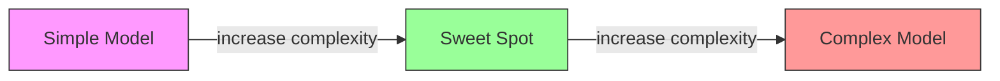
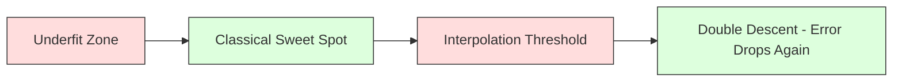
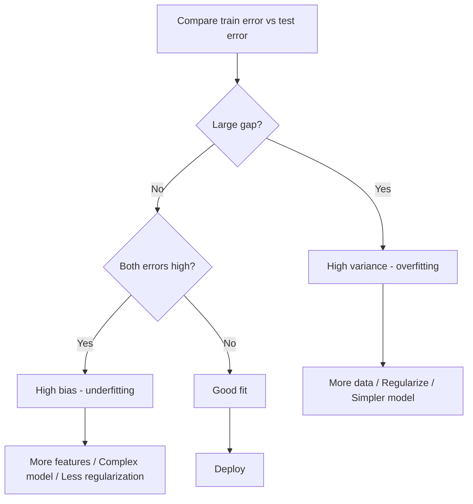
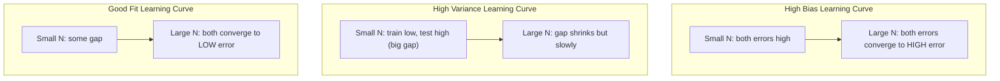
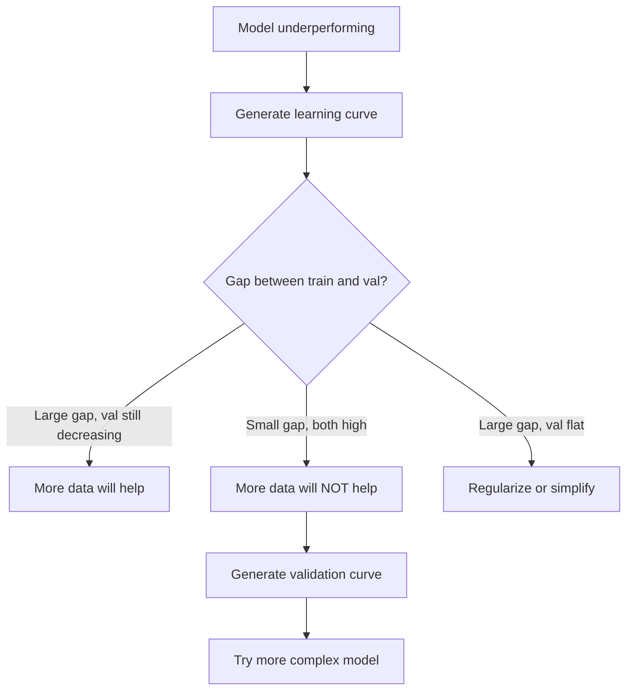

# Đánh đổi Bias-Variance

> Mọi lỗi model đều đến từ một trong ba nguồn: bias, variance hoặc nhiễu. Bạn chỉ có thể kiểm soát hai cái đầu tiên.

**Loại:** Học
**Ngôn ngữ:** Python
**Kiến thức tiên quyết:** Giai đoạn 2, Bài 01-09 (ML cơ bản, hồi quy, phân loại, đánh giá)
**Thời lượng:** ~75 phút

## Mục tiêu học tập

- Suy ra phân hủy bias-variance của sai số dự đoán dự kiến và giải thích vai trò của nhiễu không thể giảm
- Chẩn đoán xem model bị bias cao hay variance cao bằng cách sử dụng các mẫu lỗi training và kiểm tra
- Giải thích cách các kỹ thuật chính quy hóa (L1, L2, dropout, dừng sớm) giao dịch bias cho variance
- Triển khai các thử nghiệm trực quan hóa sự đánh đổi bias-variance trên models độ phức tạp ngày càng tăng

## Vấn đề

Bạn đã huấn luyện một model. Nó có một số lỗi trên dữ liệu thử nghiệm. Lỗi đó đến từ đâu?

Nếu model của bạn quá đơn giản (hồi quy tuyến tính trên dataset cong), nó sẽ liên tục bỏ lỡ mô hình thực. Đó là bias. Nếu model của bạn quá phức tạp (đa thức độ 20 trên 15 điểm dữ liệu), nó sẽ hoàn toàn phù hợp với dữ liệu training nhưng đưa ra các dự đoán hoàn toàn khác nhau về dữ liệu mới. Đó là variance.

Bạn không thể giảm thiểu cả hai cùng một lúc để có dung lượng model cố định. Đẩy bias xuống và variance đi lên. Đẩy variance xuống và bias đi lên. Hiểu được sự đánh đổi này là skill chẩn đoán hữu ích nhất trong học máy. Nó cho bạn biết liệu nên làm cho model của bạn phức tạp hơn hay ít phức tạp hơn, có nên lấy nhiều dữ liệu hơn hoặc kỹ thuật tốt hơn features, chính quy hóa nhiều hơn hay ít hơn.

## Khái niệm

### Bias: Lỗi hệ thống

Bias đo lường mức độ chênh lệch so với dự đoán trung bình của model bạn so với giá trị thực. Nếu bạn huấn luyện cùng một model trên nhiều tập training khác nhau được rút ra từ cùng một phân phối và tính trung bình các dự đoán, bias là khoảng cách giữa mức trung bình đó và sự thật.

bias cao có nghĩa là model quá cứng để nắm bắt mô hình thực. Một đường thẳng phù hợp với một parabol sẽ luôn bỏ lỡ đường cong, bất kể bạn cung cấp bao nhiêu dữ liệu. Đây là underfitting.

```
High bias (underfitting):
  Model always predicts roughly the same wrong thing.
  Training error: HIGH
  Test error: HIGH
  Gap between them: SMALL
```

### Variance: Độ nhạy với dữ liệu Training

Variance đo lường mức độ thay đổi của dự đoán khi bạn huấn luyện trên các tập hợp con dữ liệu khác nhau. Nếu những thay đổi nhỏ trong bộ training gây ra những thay đổi lớn trong model thì variance cao.

variance cao có nghĩa là model phù hợp với nhiễu trong dữ liệu training, không phải tín hiệu cơ bản. Một đa thức độ 20 sẽ thread qua mọi điểm training nhưng dao động dữ dội giữa chúng. Đây là overfitting.

```
High variance (overfitting):
  Model fits training data perfectly but fails on new data.
  Training error: LOW
  Test error: HIGH
  Gap between them: LARGE
```

### Sự phân hủy

Đối với bất kỳ điểm x nào, sai số dự đoán dự kiến dưới bình phương loss phân hủy chính xác:

```
Expected Error = Bias^2 + Variance + Irreducible Noise

where:
  Bias^2   = (E[f_hat(x)] - f(x))^2
  Variance = E[(f_hat(x) - E[f_hat(x)])^2]
  Noise    = E[(y - f(x))^2]             (sigma^2)
```

- `f(x)` là chức năng thực sự
- `f_hat(x)` là dự đoán của model bạn
- `E[...]` là kỳ vọng đối với các bộ training khác nhau
- `y` là nhãn quan sát được (chức năng thực cộng với nhiễu)

Thuật ngữ nhiễu là không thể giảm bớt. Không có model nào có thể làm tốt hơn sigma^2 trên dữ liệu nhiễu. Công việc của bạn là tìm ra sự cân bằng phù hợp giữa bias^2 và variance.

### Model Độ phức tạp vs Lỗi



Đường cong hình chữ U cổ điển:

| Độ phức tạp | Bias | Variance | Tổng số lỗi |
|-----------|------|----------|-------------|
| Quá thấp | CAO | THẤP | CAO (underfitting) |
| Vừa phải | VỪA PHẢI | VỪA PHẢI | THẤP NHẤT |
| Quá cao | THẤP | CAO | CAO (overfitting) |

### Chính quy hóa như kiểm soát Variance Bias

Chính quy hóa cố tình tăng bias để giảm variance. Nó hạn chế model nên nó không thể đuổi theo nhiễu.

- **L2 (Ridge):** Thu nhỏ tất cả các trọng lượng về không. Giữ tất cả features nhưng giảm ảnh hưởng của chúng.
- **L1 (Lasso):** Đẩy một số trọng lượng chính xác về không. Thực hiện lựa chọn feature.
- **Dropout:** Vô hiệu hóa ngẫu nhiên các tế bào thần kinh trong quá trình training. Buộc các đại diện dư thừa.
- **Dừng sớm: **Dừng training trước khi model hoàn toàn phù hợp với dữ liệu training.

Cường độ chính quy hóa (lambda, tỷ lệ dropout, số epochs) trực tiếp kiểm soát vị trí bạn ngồi trên đường cong bias-variance. Chính quy hóa nhiều hơn có nghĩa là nhiều bias hơn, ít variance hơn.

### Double Descent: Góc nhìn hiện đại

Lý thuyết cổ điển nói: sau điểm ngọt ngào, sự phức tạp hơn luôn gây tổn thương. Nhưng nghiên cứu từ năm 2019 đã cho thấy một điều bất ngờ. Nếu bạn tiếp tục tăng dung lượng model vượt quá ngưỡng nội suy (trong đó model có đủ parameters để hoàn toàn phù hợp với dữ liệu training), lỗi kiểm tra có thể giảm trở lại.



Hiện tượng "giảm kép" này giải thích tại sao các mạng nơ-ron được tham số hóa quá mức (với nhiều parameters hơn nhiều so với training ví dụ) vẫn khái quát hóa tốt. Sự đánh đổi bias-variance cổ điển không sai, nhưng nó không hoàn chỉnh đối với chế độ hiện đại.

Những quan sát chính về sự xuống dốc kép:
- Nó xảy ra trong models tuyến tính, cây quyết định và mạng nơ-ron
- Nhiều dữ liệu hơn thực sự có thể gây tổn hại trong vùng nội suy (giảm đôi theo mẫu)
- Nhiều training epochs hơn cũng có thể gây ra nó (epoch xuống kép khôn ngoan)
- Chính quy hóa làm mịn đỉnh nhưng không loại bỏ nó

Tại sao điều này xảy ra? Ở ngưỡng nội suy, model có dung lượng vừa đủ để phù hợp với tất cả các điểm training. Nó buộc phải đưa vào một giải pháp rất cụ thể threads qua mọi điểm và những nhiễu loạn nhỏ trong dữ liệu gây ra những thay đổi lớn trong sự phù hợp. Đây là nơi variance đạt đỉnh. Vượt qua ngưỡng, model có nhiều giải pháp khả thi phù hợp với dữ liệu một cách hoàn hảo. Thuật toán học tập (ví dụ: gradient descent với quy tắc hóa ngầm) có xu hướng chọn thuật toán đơn giản nhất trong số đó. Sự bias ngầm hướng tới các giải pháp đơn giản này là lý do tại sao các models khái quát hóa quá mức.

| Chế độ | Parameters so với mẫu | Hành vi |
|--------|----------------------|----------|
| Tham số thấp | p << n | Áp dụng sự đánh đổi cổ điển |
| Ngưỡng nội suy | p ~ n | Variance đỉnh, kiểm tra lỗi tăng đột biến |
| Quá tham số hóa | p >> n | Quy tắc hóa ngầm bắt đầu, lỗi kiểm tra giảm |

Đối với mục đích thực tế: nếu bạn đang sử dụng mạng nơ-ron hoặc quần thể cây lớn, đừng dừng lại ở ngưỡng nội suy. Hoặc ở dưới nó (với quy tắc hóa rõ ràng) hoặc vượt qua nó. Nơi tồi tệ nhất là ngay ngưỡng cửa.

### Chẩn đoán Model của bạn



| Triệu chứng | Chẩn đoán | Sửa chữa |
|---------|-----------|-----|
| Lỗi tàu cao, lỗi thử nghiệm cao | Bias | features hơn, model phức tạp, ít chính quy hóa hơn |
| Lỗi tàu thấp, sai số thử nghiệm cao | Variance | Nhiều dữ liệu hơn, chính quy hóa, model đơn giản hơn dropout |
| Lỗi tàu thấp, lỗi kiểm tra thấp | Phù hợp | Ship nó |
| Lỗi huấn luyện giảm, lỗi thử nghiệm tăng | Overfitting đang được tiến hành | Dừng sớm |

### Chiến lược thực tế

**Khi bias là vấn đề:**
- Thêm đa thức hoặc tương tác features
- Sử dụng model linh hoạt hơn (quần thể cây thay vì tuyến tính)
- Giảm cường độ chính quy hóa
- Huấn luyện lâu hơn (nếu chưa hội tụ)

**Khi variance là vấn đề:**
- Nhận thêm dữ liệu training
- Sử dụng bagging (rừng ngẫu nhiên)
- Tăng chính quy hóa (lambda cao hơn, dropout hơn)
- Lựa chọn Feature (loại bỏ features ồn ào)
- Sử dụng xác thực chéo để phát hiện sớm

### Phương pháp tổng hợp và giảm Variance

Phương pháp tổng hợp là công cụ thiết thực nhất để chiến đấu với variance.

**Bagging (Bootstrap Aggregating)** huấn luyện nhiều models trên các mẫu bootstrap khác nhau của dữ liệu training, sau đó tính trung bình các dự đoán của chúng. Mỗi model cá nhân có variance cao, nhưng mức trung bình có variance thấp hơn nhiều. Các khu rừng ngẫu nhiên được đóng gói áp dụng cho cây quyết định.

Tại sao nó hoạt động về mặt toán học: nếu bạn tính trung bình N dự đoán độc lập, mỗi dự đoán có variance sigma ^ 2, variance của giá trị trung bình là sigma ^ 2 / N. Các models không thực sự độc lập (tất cả đều thấy dữ liệu tương tự), vì vậy mức giảm ít hơn 1/N, nhưng nó vẫn đáng kể.

**Tăng cường** giảm bias bằng cách xây dựng models tuần tự, trong đó mỗi model mới tập trung vào các lỗi của tập hợp cho đến nay. Tăng cường Gradient và AdaBoost là những ví dụ chính. Tăng cường có thể quá khớp nếu bạn thêm quá nhiều models, vì vậy bạn cần dừng sớm hoặc chính quy hóa.

| Phương pháp | Hiệu ứng chính | Bias Thay đổi | Variance Thay đổi |
|--------|---------------|-------------|-----------------|
| Đóng bao | Giảm variance | Không thay đổi | Giảm |
| Tăng cường | Giảm bias | Giảm | Có thể tăng |
| Xếp chồng | Giảm cả hai | Phụ thuộc vào meta-learner | Phụ thuộc vào models cơ sở |
| Dropout | Đóng bao ngầm | Tăng nhẹ | Giảm |

**Quy tắc thực tế: **nếu model cơ sở của bạn có variance cao (cây sâu, đa thức bậc cao), hãy sử dụng bao. Nếu model cơ sở của bạn có bias cao (gốc nông, models tuyến tính đơn giản), hãy sử dụng tăng cường.

### Đường cong học tập

Đường cong học tập vẽ training và lỗi xác thực như một hàm của kích thước training đặt. Chúng là công cụ chẩn đoán thiết thực nhất mà bạn có. Không giống như so sánh train/test đơn lẻ, đường cong học tập cho bạn biết quỹ đạo của model và cho bạn biết liệu có nhiều dữ liệu hơn sẽ giúp ích hay không.



Cách đọc chúng:

| Kịch bản | Lỗi Training | Lỗi xác thực | Khoảng cách | Nó có nghĩa là gì | Phải làm gì |
|----------|---------------|-----------------|-----|---------------|------------|
| bias cao | Cao | Cao | Nhỏ | Model không thể chụp mẫu | features hơn, model phức tạp, ít chính quy hóa hơn |
| variance cao | Thấp | Cao | Lớn | Model ghi nhớ dữ liệu training | Nhiều dữ liệu hơn, chính quy hóa, model đơn giản hơn |
| Phù hợp | Trung bình | Trung bình | Nhỏ | Model khái quát hóa tốt | Ship nó |
| variance cao, cải thiện | Thấp | Giảm với nhiều dữ liệu hơn | Thu nhỏ | Variance vấn đề mà dữ liệu có thể khắc phục | Thu thập thêm dữ liệu |
| bias cao, phẳng | Cao | Cao và phẳng | Nhỏ và phẳng | Nhiều dữ liệu hơn sẽ KHÔNG giúp ích được gì | Thay đổi kiến trúc model |

Cái nhìn sâu sắc quan trọng: nếu cả hai đường cong đều ổn định và khoảng cách nhỏ nhưng cả hai sai số đều cao, nhiều dữ liệu hơn là vô ích. Bạn cần một model tốt hơn. Nếu khoảng cách lớn và vẫn thu hẹp, nhiều dữ liệu hơn sẽ hữu ích.

### Cách tạo đường cong học tập

Có hai cách tiếp cận:

**Cách tiếp cận 1: Thay đổi training kích thước cài đặt, model cố định. **Giữ model và hyperparameters không đổi. Huấn luyện trên các tập hợp con ngày càng lớn của dữ liệu training. Đo lường lỗi training và lỗi xác thực ở từng kích thước. Đây là đường cong học tập tiêu chuẩn.

**Cách tiếp cận 2: Thay đổi model độ phức tạp, dữ liệu cố định.** Giữ hằng số dữ liệu. Quét một parameter phức tạp (độ đa thức, độ sâu cây, số lớp). Đo lường lỗi training và lỗi xác thực ở từng mức độ phức tạp. Đây là một đường cong xác thực và hiển thị trực tiếp sự đánh đổi bias-variance.

Cả hai cách tiếp cận bổ sung cho nhau. Đầu tiên cho bạn biết liệu có nhiều dữ liệu hơn sẽ giúp ích hay không. Thứ hai cho bạn biết liệu một model khác sẽ giúp ích hay không. Chạy cả hai trước khi đưa ra quyết định về bước tiếp theo của bạn.



```figure
bias-variance
```

## Tự xây dựng

Mã trong `code/bias_variance.py` chạy thử nghiệm phân tách bias-variance đầy đủ. Đây là cách tiếp cận, từng bước.

### Bước 1: Tạo dữ liệu tổng hợp từ một hàm đã biết

Chúng ta sử dụng `f(x) = sin(1.5x) + 0.5x` với nhiễu Gaussian. Biết hàm thực cho phép chúng ta tính toán chính xác bias và variance.

```python
def true_function(x):
    return np.sin(1.5 * x) + 0.5 * x

def generate_data(n_samples=30, noise_std=0.5, x_range=(-3, 3), seed=None):
    rng = np.random.RandomState(seed)
    x = rng.uniform(x_range[0], x_range[1], n_samples)
    y = true_function(x) + rng.normal(0, noise_std, n_samples)
    return x, y
```

### Bước 2: Bootstrap Sampling và khớp đa thức

Đối với mỗi bậc đa thức, chúng tôi vẽ nhiều bộ training bootstrap, phù hợp với đa thức và ghi lại các dự đoán trên một lưới kiểm tra cố định. Điều này cung cấp cho chúng ta sự phân phối các dự đoán tại mỗi điểm kiểm tra.

```python
def fit_polynomial(x_train, y_train, degree, lam=0.0):
    X = np.column_stack([x_train ** d for d in range(degree + 1)])
    if lam > 0:
        penalty = lam * np.eye(X.shape[1])
        penalty[0, 0] = 0
        w = np.linalg.solve(X.T @ X + penalty, X.T @ y_train)
    else:
        w = np.linalg.lstsq(X, y_train, rcond=None)[0]
    return w
```

Chúng ta phù hợp với 200 mẫu bootstrap khác nhau. Mỗi mẫu bootstrap được rút ra từ cùng một phân phối cơ bản nhưng chứa các điểm khác nhau.

### Bước 3: Tính toán Bias^2, Variance Phân tách

Với 200 bộ dự đoán tại mỗi điểm kiểm tra, chúng ta có thể tính toán sự phân rã trực tiếp từ định nghĩa:

```python
mean_pred = predictions.mean(axis=0)
bias_sq = np.mean((mean_pred - y_true) ** 2)
variance = np.mean(predictions.var(axis=0))
total_error = np.mean(np.mean((predictions - y_true) ** 2, axis=1))
```

- `mean_pred` được ước tính E [f_hat (x)] từ các mẫu bootstrap
- `bias_sq` là khoảng cách bình phương giữa dự đoán trung bình và sự thật
- `variance` là mức chênh lệch trung bình của các dự đoán trên các mẫu bootstrap
- `total_error` phải xấp xỉ bằng bias^2 + variance + nhiễu

### Bước 4: Đường cong học tập

Đường cong học tập quét training kích thước đã đặt trong khi giữ model độ phức tạp cố định. Chúng cho biết liệu model của bạn bị giới hạn dữ liệu hay giới hạn dung lượng.

```python
def demo_learning_curves():
    sizes = [10, 15, 20, 30, 50, 75, 100, 150, 200, 300]
    degree = 5

    for n in sizes:
        train_errors = []
        test_errors = []
        for seed in range(50):
            x_train, y_train = generate_data(n_samples=n, seed=seed * 100)
            w = fit_polynomial(x_train, y_train, degree)
            train_pred = predict_polynomial(x_train, w)
            train_mse = np.mean((train_pred - y_train) ** 2)
            test_pred = predict_polynomial(x_test, w)
            test_mse = np.mean((test_pred - y_test) ** 2)
            train_errors.append(train_mse)
            test_errors.append(test_mse)
        # Average over runs gives the learning curve point
```

Đối với độ variance model cao (độ 5 với dữ liệu nhỏ), bạn thấy:
- Lỗi Training bắt đầu thấp và tăng lên khi nhiều dữ liệu hơn khiến việc ghi nhớ trở nên khó khăn hơn
- Lỗi kiểm tra bắt đầu cao và giảm khi model nhận được nhiều tín hiệu hơn
- Khoảng cách thu hẹp với nhiều dữ liệu hơn

Đối với bias model cao (độ 1), cả hai lỗi hội tụ nhanh chóng đến cùng một giá trị cao và nhiều dữ liệu hơn không giúp ích được gì.

### Bước 5: Quét chính quy hóa

Mã này cũng bao gồm `demo_regularization_sweep()`, cố định đa thức bậc cao (bậc 15) và quét cường độ chính quy hóa Ridge từ 0,001 đến 100. Điều này cho thấy sự đánh đổi bias-variance từ một góc độ khác: thay vì thay đổi độ phức tạp model, chúng ta thay đổi cường độ ràng buộc.

```python
def demo_regularization_sweep():
    alphas = [0.001, 0.005, 0.01, 0.05, 0.1, 0.5, 1.0, 5.0, 10.0, 50.0, 100.0]
    for alpha in alphas:
        results = bias_variance_decomposition([15], lam=alpha)
        r = results[15]
        print(f"alpha={alpha:.3f}  bias={r['bias_sq']:.4f}  var={r['variance']:.4f}")
```

Ở alpha thấp, đa thức bậc 15 gần như không bị ràng buộc. Variance chiếm ưu thế vì model theo đuổi nhiễu trong mỗi mẫu bootstrap. Ở alpha cao, hình phạt mạnh đến mức model trở thành một hàm gần như không đổi. Bias thống trị. Alpha tối ưu nằm giữa các thái cực này.

Đây là cùng một đường cong chữ U từ các bậc đa thức khác nhau, nhưng được điều khiển bởi một núm liên tục thay vì một núm rời rạc. Trong thực tế, chính quy hóa là cách ưa thích để kiểm soát sự đánh đổi vì nó cho phép kiểm soát chi tiết mà không thay đổi bộ feature.

## Ứng dụng

Sklearn cung cấp `learning_curve` và `validation_curve` để tự động hóa các chẩn đoán này mà không cần viết vòng lặp bootstrap.

### Đường cong xác thực: Quét Model độ phức tạp

```python
from sklearn.model_selection import validation_curve
from sklearn.pipeline import make_pipeline
from sklearn.preprocessing import PolynomialFeatures
from sklearn.linear_model import Ridge

degrees = list(range(1, 16))
train_scores_all = []
val_scores_all = []

for d in degrees:
    pipe = make_pipeline(PolynomialFeatures(d), Ridge(alpha=0.01))
    train_scores, val_scores = validation_curve(
        pipe, X, y, param_name="polynomialfeatures__degree",
        param_range=[d], cv=5, scoring="neg_mean_squared_error"
    )
    train_scores_all.append(-train_scores.mean())
    val_scores_all.append(-val_scores.mean())
```

Điều này cung cấp cho bạn đường cong đánh đổi bias-variance trực tiếp. Khi điểm xác thực kém nhất so với điểm huấn luyện, variance chiếm ưu thế. Khi cả hai đều xấu, bias chiếm ưu thế.

### Đường cong học tập: Quét Training kích thước đặt

```python
from sklearn.model_selection import learning_curve

pipe = make_pipeline(PolynomialFeatures(5), Ridge(alpha=0.01))
train_sizes, train_scores, val_scores = learning_curve(
    pipe, X, y, train_sizes=np.linspace(0.1, 1.0, 10),
    cv=5, scoring="neg_mean_squared_error"
)
train_mse = -train_scores.mean(axis=1)
val_mse = -val_scores.mean(axis=1)
```

Âm mưu `train_mse` và `val_mse` chống lại `train_sizes`. Hình dạng cho bạn biết mọi thứ về model của bạn.

### Xác thực chéo với Regularization Sweep

```python
from sklearn.model_selection import cross_val_score

alphas = [0.001, 0.01, 0.1, 1.0, 10.0, 100.0]
for alpha in alphas:
    pipe = make_pipeline(PolynomialFeatures(10), Ridge(alpha=alpha))
    scores = cross_val_score(pipe, X, y, cv=5, scoring="neg_mean_squared_error")
    print(f"alpha={alpha:>7.3f}  MSE={-scores.mean():.4f} +/- {scores.std():.4f}")
```

Điều này quét cường độ chính quy hóa cho một độ phức tạp model cố định. Bạn sẽ thấy sự đánh đổi bias-variance tương tự: alpha thấp có nghĩa là variance cao, alpha cao có nghĩa là bias cao.

### Kết hợp tất cả lại với nhau: Quy trình chẩn đoán hoàn chỉnh

Trong thực tế, bạn chạy các chẩn đoán này theo trình tự:

1. Rèn luyện model của bạn. Tính toán huấn luyện và kiểm tra lỗi.
2. Nếu cả hai đều cao: bạn có vấn đề bias. Chuyển sang bước 4.
3. Nếu tàu thấp nhưng bài kiểm tra cao: bạn có vấn đề variance. Tạo đường cong học tập để xem liệu có thêm dữ liệu sẽ giúp ích hay không. Nếu không, hãy thường xuyên.
4. Tạo đường cong xác thực quét parameter độ phức tạp chính của bạn. Tìm điểm ngọt ngào.
5. Tại điểm ngọt ngào, hãy tạo ra một đường cong học tập. Nếu khoảng cách vẫn còn lớn, bạn cần thêm dữ liệu hoặc chính quy hóa.
6. Hãy thử Ridge/Lasso với các giá trị alpha khác nhau bằng cách sử dụng `cross_val_score`. Chọn alpha có lỗi xác thực chéo thấp nhất.

Quá trình này mất 10-15 phút tính toán cho hầu hết các datasets dạng bảng và tiết kiệm hàng giờ đoán.

## Sản phẩm bàn giao

Bài học này tạo ra: `outputs/prompt-model-diagnostics.md`

## Bài tập

1. Chạy quá trình phân hủy với `noise_std=0` (không có nhiễu). Điều gì xảy ra với thuật ngữ lỗi không thể rút gọn? Độ phức tạp tối ưu có thay đổi không?

2. Tăng kích thước bộ training từ 30 lên 300. Điều này ảnh hưởng như thế nào đến thành phần variance? Độ đa thức tối ưu có thay đổi không?

3. Thêm chính quy hóa L2 (hồi quy Ridge) vào thử nghiệm. Đối với đa thức bậc cao cố định (bậc 15), quét lambda từ 0 đến 100. Biểu đồ bias^2 và variance là hàm của lambda.

4. Sửa đổi hàm thực từ đa thức thành `sin(x)`. Sự phân hủy bias-variance thay đổi như thế nào? Vẫn còn một mức độ tối ưu rõ ràng?

5. Triển khai trình bao bọc tổng hợp bootstrap đơn giản: huấn luyện 10 models về các mẫu bootstrap và dự đoán trung bình. Cho thấy rằng điều này làm giảm variance mà không làm tăng bias nhiều.

## Thuật ngữ chính

| Thuật ngữ | Những gì mọi người nói | Ý nghĩa thực sự của nó |
|------|----------------|----------------------|
| Bias | "Cách model quá đơn giản" | Lỗi hệ thống từ các giả định sai. Khoảng cách giữa mức trung bình model dự đoán và sự thật. |
| Variance | "The model là overfitting" | Lỗi từ độ nhạy đối với dữ liệu training. Mức độ dự đoán thay đổi trên các nhóm training khác nhau. |
| Lỗi không thể rút gọn | "Nhiễu trong dữ liệu" | Lỗi do tính ngẫu nhiên trong process tạo dữ liệu thực sự. Không model nào có thể loại bỏ nó. |
| Underfitting | "Không học đủ" | Model có bias cao. Nó bỏ lỡ mô hình thực sự ngay cả trên dữ liệu training. |
| Overfitting | "Ghi nhớ dữ liệu" | Model có variance cao. Nó phù hợp với nhiễu trong training dữ liệu không khái quát hóa. |
| Chính quy hóa | "Hạn chế model" | Thêm một hình phạt để giảm độ phức tạp của model, giao dịch bias với variance thấp hơn. |
| Xuống dốc kép | "Nhiều parameters có thể giúp đỡ" | Lỗi kiểm tra giảm trở lại khi dung lượng model vượt xa ngưỡng nội suy. |
| Model độ phức tạp | "model linh hoạt như thế nào" | Khả năng của một model để phù hợp với các mẫu tùy ý. Được kiểm soát bởi kiến trúc, features hoặc chính quy hóa. |

## Đọc thêm

- [Hastie, Tibshirani, Friedman: Elements of Statistical Learning, Ch. 7](https://hastie.su.domains/ElemStatLearn/) - xử lý dứt điểm phân hủy bias-variance
- [Belkin et al., Reconciling modern machine learning practice and the bias-variance trade-off (2019)](https://arxiv.org/abs/1812.11118) -- giấy giảm đôi
- [Nakkiran et al., Deep Double Descent (2019)](https://arxiv.org/abs/1912.02292) - epoch khôn ngoan và mẫu kép
- [Scott Fortmann-Roe: Understanding the Bias-Variance Tradeoff](http://scott.fortmann-roe.com/docs/BiasVariance.html) - giải thích trực quan rõ ràng
