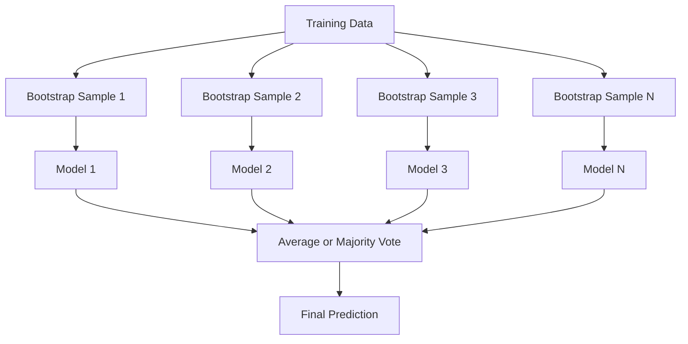
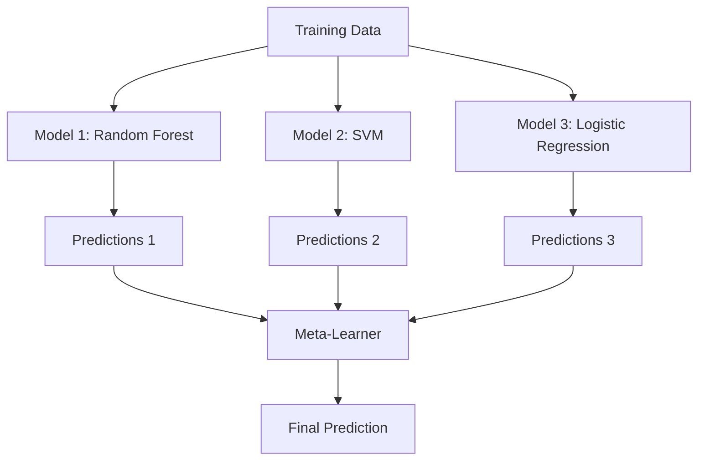

# Phương pháp tổng hợp

> Một nhóm những người học yếu, kết hợp một cách chính xác, trở thành một người học giỏi. Đây không phải là một phép ẩn dụ. Nó là một định lý.

**Loại:** Xây dựng
**Ngôn ngữ:** Python
**Kiến thức tiên quyết:** Giai đoạn 2, Bài 10 (Đánh đổi Bias-Variance)
**Thời lượng:** ~120 phút

## Mục tiêu học tập

- Triển khai AdaBoost và tăng cường gradient từ đầu và giải thích cách tăng cường tuần tự làm giảm bias
- Xây dựng một tập hợp đóng bao và chứng minh cách phân giải trung bình models làm giảm variance mà không làm tăng bias
- So sánh việc đóng gói, tăng cường và xếp chồng về thành phần lỗi mà mỗi phương pháp nhắm mục tiêu
- Đánh giá sự đa dạng của nhóm và giải thích lý do tại sao accuracy bỏ phiếu đa số được cải thiện với những người học yếu độc lập hơn

## Vấn đề

Một cây quyết định duy nhất nhanh chóng để huấn luyện và dễ diễn giải, nhưng nó quá khớp. Một model tuyến tính duy nhất không phù hợp với các ranh giới phức tạp. Bạn có thể dành nhiều ngày để thiết kế kiến trúc model hoàn hảo. Hoặc bạn có thể kết hợp một loạt các models không hoàn hảo và có được thứ gì đó tốt hơn bất kỳ thứ gì trong số chúng riêng lẻ.

Các phương pháp tổng hợp làm chính xác điều này. Chúng là kỹ thuật đáng tin cậy nhất để giành chiến thắng trong các cuộc thi Kaggle trên dữ liệu dạng bảng, chúng cung cấp năng lượng cho hầu hết các hệ thống production ML và chúng minh họa sự đánh đổi bias-variance trong thực tế. Đóng bao làm giảm variance. Tăng cường làm giảm bias. Stacking tìm hiểu models nào nên tin tưởng vào đầu vào nào.

## Khái niệm

### Tại sao Ensembles hoạt động

Giả sử bạn có N bộ phân loại độc lập, mỗi bộ có accuracy p > 0,5. Đa số phiếu bầu có accuracy:

```
P(majority correct) = sum over k > N/2 of C(N,k) * p^k * (1-p)^(N-k)
```

Đối với 21 bộ phân loại, mỗi bộ phân loại có 60% accuracy, đa số phiếu bầu accuracy là khoảng 74%. Với 101 bộ phân loại, nó tăng lên 84%. Các lỗi sẽ hủy bỏ khi models mắc các lỗi khác nhau.

Yêu cầu chính là **đa dạng**. Nếu tất cả models đều mắc cùng một lỗi, việc kết hợp chúng sẽ không giúp ích gì cả. Hòa tấu hoạt động vì chúng tạo ra các models đa dạng thông qua:

- Các tập hợp con training khác nhau (đóng bao)
- Các tập con feature khác nhau (rừng ngẫu nhiên)
- Sửa lỗi tuần tự (tăng cường)
- Các họ model khác nhau (xếp chồng)

### Đóng bao (Bootstrap Aggregating)

Đóng bao tạo ra sự đa dạng bằng cách training từng model trên một mẫu bootstrap khác nhau của dữ liệu training.



Một mẫu bootstrap được vẽ với sự thay thế từ dữ liệu gốc, cùng kích thước với bản gốc. Khoảng 63,2% mẫu duy nhất xuất hiện trong mỗi bootstrap. 36,8% còn lại (mẫu ngoài túi) cung cấp một bộ xác nhận miễn phí.

Đóng bao làm giảm variance mà không tăng bias nhiều. Mỗi cây riêng lẻ quá phù hợp với mẫu bootstrap của nó, nhưng overfitting khác nhau đối với mỗi cây, vì vậy tính trung bình sẽ loại bỏ nhiễu.

**Rừng ngẫu nhiên** đang đóng gói với một bước ngoặt bổ sung: ở mỗi lần phân tách, chỉ một tập hợp con ngẫu nhiên của features được xem xét. Điều này buộc cây thậm chí còn đa dạng hơn. Số features ứng viên điển hình là `sqrt(n_features)` để phân loại và `n_features / 3` để hồi quy.

### Boosting (Sửa lỗi tuần tự)

Tăng cường các đoàn tàu models tuần tự. Mỗi model mới tập trung vào các ví dụ mà models trước đã sai.


Tăng cường làm giảm bias. Mỗi model mới sửa chữa các lỗi hệ thống của nhóm cho đến nay. Dự đoán cuối cùng là tổng trọng số của tất cả models, nơi tốt hơn models nhận được trọng số cao hơn.

Sự đánh đổi: tăng cường có thể quá phù hợp nếu bạn chạy quá nhiều vòng, bởi vì nó tiếp tục phù hợp với các ví dụ khó hơn, một số trong số đó có thể là nhiễu.

### AdaBoost

AdaBoost (Tăng cường thích ứng) là thuật toán tăng cường thực tế đầu tiên. Nó hoạt động với bất kỳ người học cơ bản nào, điển hình là gốc cây quyết định (cây độ sâu-1).

Thuật toán:

```
1. Initialize sample weights: w_i = 1/N for all i

2. For t = 1 to T:
   a. Train weak learner h_t on weighted data
   b. Compute weighted error:
      err_t = sum(w_i * I(h_t(x_i) != y_i)) / sum(w_i)
   c. Compute model weight:
      alpha_t = 0.5 * ln((1 - err_t) / err_t)
   d. Update sample weights:
      w_i = w_i * exp(-alpha_t * y_i * h_t(x_i))
   e. Normalize weights to sum to 1

3. Final prediction: H(x) = sign(sum(alpha_t * h_t(x)))
```

Models có sai số thấp hơn sẽ nhận được alpha cao hơn. Các mẫu được phân loại sai sẽ có trọng số cao hơn nên model tiếp theo tập trung vào chúng.

### Gradient Tăng cường

Tăng cường Gradient khái quát hóa việc tăng cường các chức năng loss tùy ý. Thay vì cân lại các mẫu, nó phù hợp với mỗi model mới với phần dư (gradient âm của loss) của tập hợp hiện tại.

```
1. Initialize: F_0(x) = argmin_c sum(L(y_i, c))

2. For t = 1 to T:
   a. Compute pseudo-residuals:
      r_i = -dL(y_i, F_{t-1}(x_i)) / dF_{t-1}(x_i)
   b. Fit a tree h_t to the residuals r_i
   c. Find optimal step size:
      gamma_t = argmin_gamma sum(L(y_i, F_{t-1}(x_i) + gamma * h_t(x_i)))
   d. Update:
      F_t(x) = F_{t-1}(x) + learning_rate * gamma_t * h_t(x)

3. Final prediction: F_T(x)
```

Đối với loss sai số bình phương, số dư giả chỉ là số dư thực tế: `r_i = y_i - F_{t-1}(x_i)`. Mỗi cây thực sự phù hợp với các lỗi của tập hợp trước đó.

learning rate (co ngót) kiểm soát mức độ đóng góp của mỗi cây. Tỷ lệ học tập nhỏ hơn đòi hỏi nhiều cây hơn nhưng khái quát hóa tốt hơn. Giá trị điển hình: 0,01 đến 0,3.

### XGBoost: Tại sao nó thống trị dữ liệu dạng bảng

XGBoost (eXtreme Gradient Boosting) được tăng cường gradient với các tối ưu hóa kỹ thuật giúp nó nhanh, chính xác và chống overfitting:

- **Mục tiêu chính quy: **Hình phạt L1 và L2 đối với trọng lượng lá ngăn chặn các cây riêng lẻ quá tự tin
- **Xấp xỉ bậc hai:** Sử dụng cả đạo hàm thứ nhất và thứ hai của loss, đưa ra quyết định phân tách tốt hơn
- **Phân tách nhận biết thưa thớt:** Xử lý các giá trị bị thiếu nguyên bản bằng cách tìm hiểu hướng tốt nhất cho dữ liệu bị thiếu ở mỗi lần phân tách
- **Lấy mẫu phụ cột: **Giống như các khu rừng ngẫu nhiên, các mẫu features ở mỗi lần phân tách để đa dạng
- **Bản phác thảo lượng tử có trọng số:** Tìm các điểm phân tách một cách hiệu quả để features liên tục trên dữ liệu phân tán
- **Cấu trúc khối nhận biết bộ nhớ đệm:** Bố cục bộ nhớ được tối ưu hóa cho CPU dòng bộ nhớ đệm

Đối với dữ liệu dạng bảng, XGBoost (và người kế nhiệm của nó là LightGBM) luôn vượt trội hơn các mạng nơ-ron. Điều này sẽ không sớm thay đổi. Nếu dữ liệu của bạn nằm gọn trong bảng có hàng và cột, hãy bắt đầu bằng tính năng tăng cường gradient.

### Xếp chồng (Meta-Learning)

Xếp chồng sử dụng các dự đoán của nhiều models cơ sở làm features cho người học meta.



Meta-learner tìm hiểu cơ sở nào model tin cậy cho đầu vào nào. Nếu rừng ngẫu nhiên tốt hơn ở một số khu vực nhất định và SVM ở những khu vực khác, meta-learner sẽ học cách định tuyến cho phù hợp.

Để tránh rò rỉ dữ liệu, các dự đoán model cơ sở phải được tạo thông qua xác thực chéo trên tập training. Bạn không bao giờ huấn luyện models cơ sở và tạo meta-features trên cùng một dữ liệu.

### Bỏ phiếu

Quần thể đơn giản nhất. Chỉ cần kết hợp các dự đoán trực tiếp.

- **Bỏ phiếu cứng:** Đa số bỏ phiếu cho các nhãn class.
- **Bỏ phiếu mềm:** Xác suất dự đoán trung bình, chọn class có xác suất trung bình cao nhất. Thường tốt hơn vì nó sử dụng thông tin tin cậy.

## Tự xây dựng

### Bước 1: Gốc cây quyết định (Base Learner)

Mã trong `code/ensembles.py` triển khai mọi thứ từ đầu. Chúng ta bắt đầu với một gốc cây quyết định: một cái cây có một vết tách duy nhất.

```python
class DecisionStump:
    def __init__(self):
        self.feature_idx = None
        self.threshold = None
        self.polarity = 1
        self.alpha = None

    def fit(self, X, y, weights):
        n_samples, n_features = X.shape
        best_error = float("inf")

        for f in range(n_features):
            thresholds = np.unique(X[:, f])
            for thresh in thresholds:
                for polarity in [1, -1]:
                    pred = np.ones(n_samples)
                    pred[polarity * X[:, f] < polarity * thresh] = -1
                    error = np.sum(weights[pred != y])
                    if error < best_error:
                        best_error = error
                        self.feature_idx = f
                        self.threshold = thresh
                        self.polarity = polarity

    def predict(self, X):
        n = X.shape[0]
        pred = np.ones(n)
        idx = self.polarity * X[:, self.feature_idx] < self.polarity * self.threshold
        pred[idx] = -1
        return pred
```

### Bước 2: AdaBoost từ đầu

```python
class AdaBoostScratch:
    def __init__(self, n_estimators=50):
        self.n_estimators = n_estimators
        self.stumps = []
        self.alphas = []

    def fit(self, X, y):
        n = X.shape[0]
        weights = np.full(n, 1 / n)

        for _ in range(self.n_estimators):
            stump = DecisionStump()
            stump.fit(X, y, weights)
            pred = stump.predict(X)

            err = np.sum(weights[pred != y])
            err = np.clip(err, 1e-10, 1 - 1e-10)

            alpha = 0.5 * np.log((1 - err) / err)
            weights *= np.exp(-alpha * y * pred)
            weights /= weights.sum()

            stump.alpha = alpha
            self.stumps.append(stump)
            self.alphas.append(alpha)

    def predict(self, X):
        total = sum(a * s.predict(X) for a, s in zip(self.alphas, self.stumps))
        return np.sign(total)
```

### Bước 3: Gradient Tăng cường từ đầu

```python
class GradientBoostingScratch:
    def __init__(self, n_estimators=100, learning_rate=0.1, max_depth=3):
        self.n_estimators = n_estimators
        self.lr = learning_rate
        self.max_depth = max_depth
        self.trees = []
        self.initial_pred = None

    def fit(self, X, y):
        self.initial_pred = np.mean(y)
        current_pred = np.full(len(y), self.initial_pred)

        for _ in range(self.n_estimators):
            residuals = y - current_pred
            tree = SimpleRegressionTree(max_depth=self.max_depth)
            tree.fit(X, residuals)
            update = tree.predict(X)
            current_pred += self.lr * update
            self.trees.append(tree)

    def predict(self, X):
        pred = np.full(X.shape[0], self.initial_pred)
        for tree in self.trees:
            pred += self.lr * tree.predict(X)
        return pred
```

### Bước 4: So sánh với sklearn

Mã xác minh rằng các triển khai từ đầu của chúng ta tạo ra accuracy tương tự như `AdaBoostClassifier` và `GradientBoostingClassifier` của sklearn, đồng thời so sánh tất cả các phương thức cạnh nhau.

## Ứng dụng

### Khi nào nên sử dụng từng phương pháp

| Phương pháp | Giảm | Tốt nhất cho | Coi chừng |
|--------|---------|----------|---------------|
| Đóng bao / Rừng ngẫu nhiên | Variance | Dữ liệu nhiễu, nhiều features | Không giúp ích cho bias |
| AdaBoost | Bias | Dữ liệu sạch, người học cơ sở đơn giản | Nhạy cảm với các ngoại lệ và nhiễu |
| Gradient Tăng cường | Bias | Dữ liệu dạng bảng, cuộc thi | Tập luyện chậm, dễ overfit mà không cần điều chỉnh |
| XGBoost / Ánh sángGBM | Cả hai | Production ML dạng bảng | Nhiều hyperparameters |
| Xếp chồng | Cả hai | Nhận 1-2% accuracy cuối cùng | Phức tạp, nguy cơ overfitting người học meta |
| Bỏ phiếu | Variance | Kết hợp nhanh chóng các models đa dạng | Chỉ hữu ích nếu models đa dạng |

### Production Stack cho dữ liệu dạng bảng

Đối với hầu hết các bài toán dự đoán dạng bảng, đây là thứ tự để thử:

1. **LightGBM hoặc XGBoost** với parameters mặc định
2. Điều chỉnh n_estimators, learning_rate, max_depth min_child_weight
3. Nếu bạn cần 0,5% cuối cùng, hãy xây dựng một nhóm xếp chồng với 3-5 models đa dạng
4. Sử dụng xác thực chéo xuyên suốt

Mạng nơ-ron trên dữ liệu dạng bảng hầu như luôn tồi tệ hơn gradient tăng cường, mặc dù vẫn tiếp tục nỗ lực nghiên cứu. TabNet, NODE và các kiến trúc tương tự đôi khi phù hợp nhưng hiếm khi đánh bại XGBoost được điều chỉnh tốt.

## Sản phẩm bàn giao

Bài học này tạo ra `outputs/prompt-ensemble-selector.md` - một prompt giúp bạn chọn phương pháp tổng hợp phù hợp cho một dataset nhất định. Mô tả dữ liệu của bạn (kích thước, loại feature, độ ồn class cân bằng) và vấn đề bạn đang giải quyết. prompt đi qua danh sách kiểm tra quyết định, đề xuất một phương pháp, đề xuất bắt đầu hyperparameters và cảnh báo về những sai lầm phổ biến đối với phương pháp đó. Đồng thời tạo ra `outputs/skill-ensemble-builder.md` với hướng dẫn lựa chọn đầy đủ.

## Bài tập

1. Sửa đổi việc triển khai AdaBoost để theo dõi training accuracy sau mỗi vòng. Biểu đồ accuracy so với số lượng ước tính. Khi nào nó hội tụ?

2. Triển khai một khu rừng ngẫu nhiên từ đầu bằng cách thêm lấy mẫu phụ feature ngẫu nhiên vào cây hồi quy. Huấn luyện 100 cây với dự đoán `max_features=sqrt(n_features)` và trung bình. So sánh mức giảm variance với một cây duy nhất.

3. Trong triển khai tăng cường gradient, thêm loss xác thực dừng sớm: theo dõi sau mỗi vòng và dừng khi chưa cải thiện trong 10 vòng liên tiếp. Nó thực sự cần bao nhiêu cây?

4. Xây dựng một tập hợp xếp chồng với ba models cơ sở (hồi quy logistic, cây quyết định, k-hàng xóm gần nhất) và meta-learner hồi quy logistic. Sử dụng xác thực chéo gấp 5 lần để tạo meta-features. So sánh với từng căn cứ model một mình.

5. Chạy XGBoost trên cùng một dataset với parameters mặc định. So sánh accuracy của nó với việc tăng cường gradient từ đầu của bạn. Thời gian cả hai. Chênh lệch tốc độ lớn như thế nào?

## Thuật ngữ chính

| Thuật ngữ | Những gì mọi người nói | Ý nghĩa thực sự của nó |
|------|----------------|----------------------|
| Đóng bao | "Huấn luyện trên các tập con ngẫu nhiên" | Tổng hợp Bootstrap: huấn luyện models trên các mẫu bootstrap, dự đoán trung bình để giảm variance |
| Tăng cường | "Tập trung vào các ví dụ khó" | Huấn luyện models tuần tự, mỗi lần sửa lỗi của nhóm cho đến nay, để giảm bias |
| AdaBoost | "Cân lại dữ liệu" | Tăng cường thông qua cập nhật trọng lượng mẫu; Điểm phân loại sai sẽ có trọng số cao hơn cho người học tiếp theo |
| Tăng cường Gradient | "Phù hợp với phần còn lại" | Tăng cường thông qua việc lắp từng model mới vào gradient âm của chức năng loss |
| XGBoost | "Vũ khí Kaggle" | Gradient tăng cường với chính quy hóa, tối ưu hóa bậc hai và các thủ thuật tốc độ cấp hệ thống |
| Xếp chồng | "Models trên đỉnh models" | Sử dụng dự đoán models cơ sở làm features đầu vào cho người học meta |
| Rừng ngẫu nhiên | "Nhiều cây ngẫu nhiên" | Đóng gói với cây quyết định, thêm lấy mẫu phụ feature ngẫu nhiên ở mỗi lần phân tách để đa dạng |
| Đa dạng hòa tấu | "Mắc những sai lầm khác nhau" | Models phải không tương quan với các lỗi của họ để nhóm cải thiện hơn các cá nhân |
| Lỗi hết túi | "Xác nhận miễn phí" | Các mẫu không nằm trong đợt rút thăm bootstrap (~36,8%) đóng vai trò là một bộ xác thực mà không cần giữ lại |

## Đọc thêm

- [Schapire & Freund: Boosting: Foundations and Algorithms](https://mitpress.mit.edu/9780262526036/) - cuốn sách của những người tạo ra AdaBoost
- [Friedman: Greedy Function Approximation: A Gradient Boosting Machine (2001)](https://statweb.stanford.edu/~jhf/ftp/trebst.pdf) - giấy tăng cường gradient ban đầu
- [Chen & Guestrin: XGBoost (2016)](https://arxiv.org/abs/1603.02754) -- bài báo XGBoost
- [Wolpert: Stacked Generalization (1992)](https://www.sciencedirect.com/science/article/abs/pii/S0893608005800231) - giấy xếp chồng ban đầu
- [scikit-learn Ensemble Methods](https://scikit-learn.org/stable/modules/ensemble.html) -- Tài liệu tham khảo thực tế
