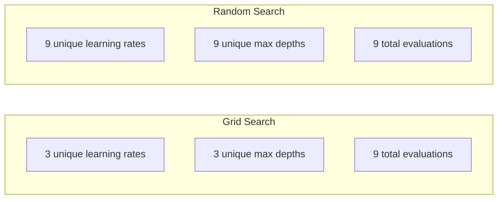
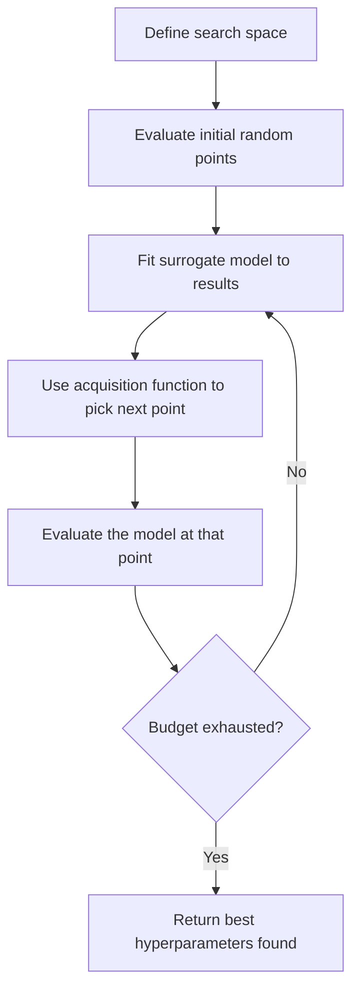
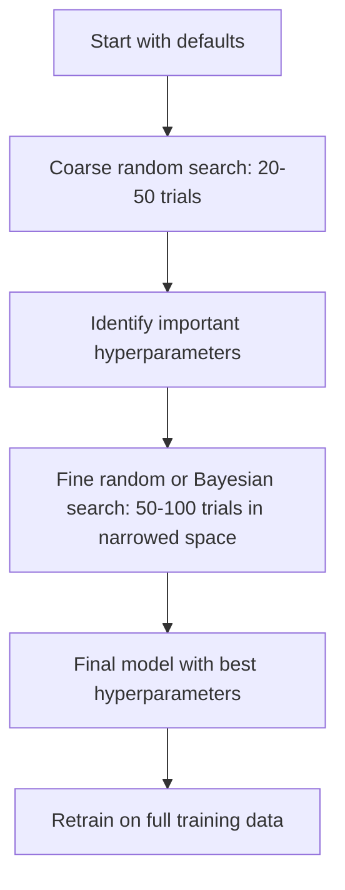
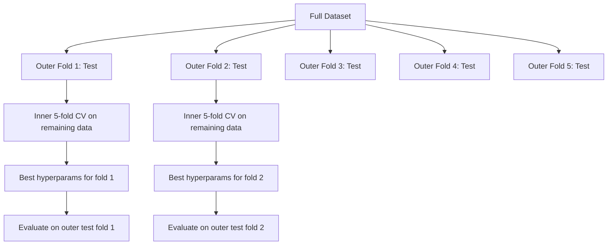

# Hyperparameter Điều chỉnh

> Hyperparameters là các núm bạn xoay trước khi training bắt đầu. Biến chúng tốt là sự khác biệt giữa model tầm thường và tuyệt vời.

**Loại:** Xây dựng
**Ngôn ngữ:** Python
**Kiến thức tiên quyết:** Giai đoạn 2, Bài 11 (Phương pháp tổng hợp)
**Thời lượng:** ~90 phút

## Mục tiêu học tập

- Triển khai tìm kiếm lưới, tìm kiếm ngẫu nhiên và tối ưu hóa Bayes từ đầu và so sánh hiệu quả mẫu của chúng
- Giải thích lý do tại sao tìm kiếm ngẫu nhiên vượt trội hơn tìm kiếm lưới khi hầu hết hyperparameters có chiều hiệu quả thấp
- Xây dựng vòng lặp tối ưu hóa Bayes bằng cách sử dụng chức năng thu nhận và model thay thế để hướng dẫn tìm kiếm
- Thiết kế một chiến lược điều chỉnh hyperparameter tránh overfitting bộ xác thực thông qua xác thực chéo thích hợp

## Vấn đề

model tăng cường gradient của bạn có learning rate, số cây, độ sâu tối đa, số mẫu tối thiểu trên mỗi lá, tỷ lệ mẫu phụ và tỷ lệ mẫu cột. Đó là sáu hyperparameters. Nếu mỗi có 5 giá trị hợp lý, lưới có 5^6 = 15.625 kết hợp. Training mỗi lần mất 10 giây. Đó là 43 giờ tính toán để thử tất cả.

Tìm kiếm lưới là cách tiếp cận rõ ràng và tồi tệ nhất trên quy mô lớn. Tìm kiếm ngẫu nhiên hoạt động tốt hơn với ít điện toán hơn. Tối ưu hóa Bayes thậm chí còn tốt hơn bằng cách học hỏi từ các đánh giá trước đây. Biết nên sử dụng chiến lược nào và chiến lược nào hyperparameters thực sự quan trọng, giúp tiết kiệm nhiều ngày lãng phí thời gian GPU.

## Khái niệm

### Parameters so với Hyperparameters

Parameters được học trong training (trọng số, thiên vị, ngưỡng phân chia). Hyperparameters được thiết lập trước khi training bắt đầu và kiểm soát cách học diễn ra.

| Hyperparameter | Những gì nó kiểm soát | Phạm vi điển hình |
|---------------|-----------------|---------------|
| Learning rate | Kích thước bước cho mỗi lần cập nhật | 0,001 đến 1,0 |
| Số lượng trees/epochs | Thời gian huấn luyện | 10 đến 10.000 |
| Độ sâu tối đa | Model độ phức tạp | 1 đến 30 |
| Chính quy hóa (lambda) | Overfitting phòng ngừa | 0,0001 đến 100 |
| Kích thước Batch | Nhiễu ước tính Gradient | 16 đến 512 |
| Tỷ lệ Dropout | Phần nhỏ tế bào thần kinh bị giảm | 0,0 đến 0,5 |

### Tìm kiếm lưới

Tìm kiếm lưới đánh giá mọi kết hợp của các giá trị được chỉ định. Nó đầy đủ và dễ hiểu, nhưng mở rộng theo cấp số nhân với số lượng hyperparameters.

```
Grid for 2 hyperparameters:

  learning_rate: [0.01, 0.1, 1.0]
  max_depth:     [3, 5, 7]

  Evaluations: 3 x 3 = 9 combinations

  (0.01, 3)  (0.01, 5)  (0.01, 7)
  (0.1,  3)  (0.1,  5)  (0.1,  7)
  (1.0,  3)  (1.0,  5)  (1.0,  7)
```

Tìm kiếm lưới có một lỗ hổng cơ bản: nếu một hyperparameter quan trọng và cái kia không, hầu hết các đánh giá đều bị lãng phí. Bạn chỉ nhận được 3 giá trị duy nhất của parameter quan trọng từ 9 đánh giá.

### Tìm kiếm ngẫu nhiên

Các mẫu tìm kiếm ngẫu nhiên hyperparameters từ các phân phối thay vì lưới. Với cùng ngân sách 9 lần đánh giá, bạn sẽ nhận được 9 giá trị duy nhất của mỗi hyperparameter.



Tại sao ngẫu nhiên đánh lưới (Bergstra & Bengio, 2012):

- Hầu hết các hyperparameters có kích thước hiệu quả thấp. Chỉ 1-2 trong số 6 hyperparameters thường quan trọng đối với một vấn đề nhất định.
- Tìm kiếm lưới lãng phí các đánh giá trên các khía cạnh không quan trọng.
- Tìm kiếm ngẫu nhiên bao gồm các thứ nguyên quan trọng dày đặc hơn với cùng một ngân sách.
- Tại 60 thử nghiệm ngẫu nhiên, bạn có 95% cơ hội tìm thấy một điểm trong vòng 5% mức tối ưu (nếu một điểm tồn tại trong không gian tìm kiếm).

### Tối ưu hóa Bayes

Tìm kiếm ngẫu nhiên bỏ qua kết quả. Nó không biết rằng tỷ lệ học tập cao gây ra sự phân kỳ hoặc độ sâu 3 luôn vượt trội hơn độ sâu 10. Tối ưu hóa Bayes sử dụng các đánh giá trước đây để quyết định nơi tìm kiếm tiếp theo.



Hai thành phần chính:

**model thay thế: **Một model rẻ để đánh giá (thường là process Gaussian) xấp xỉ hàm mục tiêu đắt tiền. Nó đưa ra cả dự đoán và ước tính độ không chắc chắn tại bất kỳ thời điểm nào trong không gian tìm kiếm.

**Chức năng thu thập:** Quyết định nơi đánh giá tiếp theo bằng cách cân bằng giữa khai thác (tìm kiếm gần các điểm tốt đã biết) và khám phá (tìm kiếm ở những nơi có độ không chắc chắn cao). Lựa chọn phổ biến:

- **Cải thiện dự kiến (EI):** Chúng ta mong đợi bao nhiêu cải thiện so với mức tốt nhất hiện tại tại thời điểm này?
- **Giới hạn tin cậy trên (UCB):** Dự đoán cộng với bội số không chắc chắn. UCB cao hơn có nghĩa là đầy hứa hẹn hoặc chưa được khám phá.
- **Xác suất cải thiện (PI):** Xác suất điểm này đánh bại điểm tốt nhất hiện tại là bao nhiêu?

Tối ưu hóa Bayes thường tìm thấy hyperparameters tốt hơn so với tìm kiếm ngẫu nhiên với đánh giá ít hơn 2-5 lần. Chi phí lắp model thay thế là không đáng kể so với training model thực tế.

### Dừng sớm

Không phải mọi training chạy đều cần phải hoàn thành. Nếu một configuration rõ ràng là xấu sau 10 epochs, hãy dừng nó lại và tiếp tục. Điều này đang dừng lại sớm trong bối cảnh tìm kiếm hyperparameter.

Chiến lược:
- **Dựa trên sự kiên nhẫn:** Dừng nếu xác thực loss không được cải thiện trong N epochs liên tiếp
- **Cắt tỉa trung bình: **Dừng lại nếu kết quả trung gian của thử nghiệm kém hơn trung bình của các thử nghiệm đã hoàn thành ở cùng một bước
- **Siêu băng tần: **Phân bổ ngân sách nhỏ cho nhiều cấu hình, sau đó tăng dần ngân sách cho những cấu hình tốt nhất

Hyperband đặc biệt hiệu quả. Nó bắt đầu 81 cấu hình với 1 epoch mỗi cấu hình, giữ một phần ba trên cùng, cho chúng 3 epochs, giữ phần ba trên cùng, v.v. Điều này cho thấy cấu hình tốt nhanh hơn 10-50 lần so với đánh giá tất cả các cấu hình cho toàn bộ ngân sách.

### Bộ lập lịch Learning Rate

learning rate hầu như luôn là hyperparameter quan trọng nhất. Thay vì cố định, các bộ lập lịch sẽ điều chỉnh nó trong quá trình training.

| Lập lịch trình | Công thức | Trường hợp sử dụng |
|-----------|---------|-------------|
| Phân rã bước | Nhân với 0.1 sau mỗi N epochs | training CNN cổ điển |
| Ủ cosine | lr * 0,5 * (1 + cos (pi * t / T)) | Mặc định hiện đại |
| Khởi động + phân rã | Tăng tuyến tính sau đó phân rã cosin | Transformers |
| Một chu kỳ | Tăng sau đó giảm trong một chu kỳ | Hội tụ nhanh |
| Giảm trên cao nguyên | Giảm theo hệ số khi chỉ số bị đình trệ | Mặc định an toàn |

### Hyperparameter Tầm quan trọng

Không phải tất cả hyperparameters đều quan trọng như nhau. Nghiên cứu về rừng ngẫu nhiên (Probst et al., 2019) và tăng cường gradient cho thấy các mô hình nhất quán:

**Tầm quan trọng cao:**
- Learning rate (luôn điều chỉnh trước)
- Số lượng ước tính / epochs (sử dụng dừng sớm thay vì điều chỉnh)
- Sức mạnh chính quy hóa

**Tầm quan trọng trung bình:**
- Độ sâu tối đa / số lớp
- Mẫu tối thiểu trên mỗi lá / trọng lượng phân rã
- Tỷ lệ mẫu phụ

**Tầm quan trọng thấp:**
- Tối đa features (đối với rừng ngẫu nhiên)
- Lựa chọn chức năng kích hoạt cụ thể
- Kích thước Batch (trong phạm vi hợp lý)

Điều chỉnh những cái quan trọng trước, để rest ở mặc định.

### Chiến lược thực tế



Quy trình làm việc cụ thể:

1. **Bắt đầu với mặc định của thư viện.** Chúng được chọn bởi các học viên có kinh nghiệm và thường đạt 80% chặng đường đó.
2. **Tìm kiếm ngẫu nhiên thô.** Phạm vi rộng, 20-50 thử nghiệm. Sử dụng dừng sớm để tiêu diệt nhanh những lần chạy xấu.
3. **Phân tích kết quả.** hyperparameters nào tương quan với hiệu suất? Thu hẹp không gian tìm kiếm.
4. **Tìm kiếm tốt.** Tối ưu hóa Bayes hoặc tìm kiếm ngẫu nhiên tập trung trong không gian thu hẹp. 50-100 thử nghiệm.
5. **Huấn luyện lại trên tất cả dữ liệu training** với hyperparameters tốt nhất được tìm thấy.

### Tích hợp xác thực chéo

Điều chỉnh hyperparameters trên một lần phân tách xác thực là rủi ro. Các hyperparameters tốt nhất có thể quá phù hợp với nếp gấp xác thực cụ thể. Xác thực chéo lồng nhau giải quyết vấn đề này bằng cách sử dụng hai vòng lặp:

- **Vòng lặp bên ngoài **(đánh giá): chia dữ liệu thành train + val và test. Báo cáo hiệu suất không thiên vị.
- **Vòng lặp bên trong** (điều chỉnh): chia tàu + val thành tàu và val. Tìm hyperparameters tốt nhất.



Mỗi nếp gấp bên ngoài tìm thấy hyperparameters tốt nhất của riêng nó một cách độc lập. Điểm số bên ngoài là một ước tính không thiên vị về hiệu suất tổng quát.

Với sklearn:

```python
from sklearn.model_selection import cross_val_score, GridSearchCV
from sklearn.ensemble import GradientBoostingRegressor

inner_cv = GridSearchCV(
    GradientBoostingRegressor(),
    param_grid={
        "learning_rate": [0.01, 0.05, 0.1],
        "max_depth": [2, 3, 5],
        "n_estimators": [50, 100, 200],
    },
    cv=5,
    scoring="neg_mean_squared_error",
)

outer_scores = cross_val_score(
    inner_cv, X, y, cv=5, scoring="neg_mean_squared_error"
)

print(f"Nested CV MSE: {-outer_scores.mean():.4f} +/- {outer_scores.std():.4f}")
```

Điều này rất tốn kém (5 nếp gấp bên ngoài x 5 nếp gấp bên trong x 27 điểm lưới = 675 model phù hợp), nhưng nó cung cấp cho bạn ước tính hiệu suất đáng tin cậy. Sử dụng nó khi báo cáo kết quả cuối cùng trong giấy tờ hoặc khi mức độ đặt cược của quyết định cao.

### Mẹo thực tế

**Bắt đầu với learning rate.** Nó luôn là hyperparameter quan trọng nhất đối với các phương pháp dựa trên gradient. Một learning rate tồi làm cho mọi thứ khác không liên quan. Sửa các hyperparameters khác ở mức mặc định và quét learning rate trước.

**Sử dụng phân phối đồng nhất log để learning rate và chính quy hóa.** Sự khác biệt giữa 0,001 và 0,01 cũng quan trọng như sự khác biệt giữa 0,1 và 1,0. Tìm kiếm tuyến tính lãng phí ngân sách ở đầu lớn.

**Sử dụng dừng sớm thay vì điều chỉnh n_estimators.** Để tăng cường và mạng nơ-ron, hãy đặt n_estimators hoặc epochs cao và để dừng sớm quyết định thời điểm dừng lại. Thao tác này sẽ xóa một hyperparameter khỏi tìm kiếm.

**Phân bổ ngân sách.** Chi 60% ngân sách điều chỉnh của bạn cho 2 hyperparameters quan trọng nhất. Chi tiêu 40% còn lại cho mọi thứ khác. Top 2 chiếm phần lớn sự thay đổi hiệu suất.

**Tỷ lệ quan trọng.** Không bao giờ tìm kiếm kích thước batch trên thang đo nhật ký (16, 32, 64 là được). Luôn tìm kiếm learning rate trên thang đo nhật ký. Khớp phân phối tìm kiếm với cách hyperparameter ảnh hưởng đến model.

| Loại Model | Hyperparameters hàng đầu | Tìm kiếm được đề xuất | Ngân sách |
|-----------|--------------------|--------------------|--------|
| Rừng ngẫu nhiên | n_estimators, max_depth, min_samples_leaf | Tìm kiếm ngẫu nhiên, 50 thử nghiệm | Thấp (training nhanh) |
| Gradient Tăng cường | learning_rate, n_estimators, max_depth | Bayesian, 100 thử nghiệm + dừng sớm | Trung bình |
| Mạng nơ-ron | learning_rate, weight_decay, batch_size | Bayes hoặc ngẫu nhiên, 100+ thử nghiệm | Cao (chậm training) |
| SVM | C, gamma (nhân RBF) | Lưới trên quy mô nhật ký, 25-50 thử nghiệm | Thấp (2 thông số) |
| Lasso/Ridge | Alpha | Tìm kiếm 1D trên thang đo nhật ký, 20 thử nghiệm | Rất thấp |
| XGBoost | learning_rate, max_depth, mẫu phụ, mẫu đồng | Bayesian, 100-200 thử nghiệm + dừng sớm | Trung bình |

**Khi nghi ngờ:** tìm kiếm ngẫu nhiên với gấp 2 lần số hyperparameters thử nghiệm (ví dụ: tối thiểu 6 hyperparameters = 12+ thử nghiệm). Bạn sẽ ngạc nhiên về tần suất tìm kiếm ngẫu nhiên với 50 thử nghiệm đánh bại tìm kiếm lưới được thiết kế cẩn thận.

```figure
k-fold-cv
```

## Tự xây dựng

### Bước 1: Tìm kiếm lưới từ đầu

Mã trong `code/tuning.py` thực hiện tìm kiếm lưới, tìm kiếm ngẫu nhiên và optimizer Bayes đơn giản từ đầu.

```python
def grid_search(model_fn, param_grid, X_train, y_train, X_val, y_val):
    keys = list(param_grid.keys())
    values = list(param_grid.values())
    best_score = -float("inf")
    best_params = None
    n_evals = 0

    for combo in itertools.product(*values):
        params = dict(zip(keys, combo))
        model = model_fn(**params)
        model.fit(X_train, y_train)
        score = evaluate(model, X_val, y_val)
        n_evals += 1

        if score > best_score:
            best_score = score
            best_params = params

    return best_params, best_score, n_evals
```

### Bước 2: Tìm kiếm ngẫu nhiên từ đầu

```python
def random_search(model_fn, param_distributions, X_train, y_train,
                  X_val, y_val, n_iter=50, seed=42):
    rng = np.random.RandomState(seed)
    best_score = -float("inf")
    best_params = None

    for _ in range(n_iter):
        params = {k: sample(v, rng) for k, v in param_distributions.items()}
        model = model_fn(**params)
        model.fit(X_train, y_train)
        score = evaluate(model, X_val, y_val)

        if score > best_score:
            best_score = score
            best_params = params

    return best_params, best_score, n_iter
```

### Bước 3: Tối ưu hóa Bayes (Đơn giản hóa)

Ý tưởng cốt lõi: điều chỉnh một process Gaussian cho các cặp quan sát được (hyperparameter, điểm), sau đó sử dụng hàm thu nhận để quyết định nơi sẽ tìm tiếp theo.

```python
class SimpleBayesianOptimizer:
    def __init__(self, search_space, n_initial=5):
        self.search_space = search_space
        self.n_initial = n_initial
        self.X_observed = []
        self.y_observed = []

    def _kernel(self, x1, x2, length_scale=1.0):
        dists = np.sum((x1[:, None, :] - x2[None, :, :]) ** 2, axis=2)
        return np.exp(-0.5 * dists / length_scale ** 2)

    def _fit_gp(self, X_new):
        X_obs = np.array(self.X_observed)
        y_obs = np.array(self.y_observed)
        y_mean = y_obs.mean()
        y_centered = y_obs - y_mean

        K = self._kernel(X_obs, X_obs) + 1e-4 * np.eye(len(X_obs))
        K_star = self._kernel(X_new, X_obs)

        L = np.linalg.cholesky(K)
        alpha = np.linalg.solve(L.T, np.linalg.solve(L, y_centered))
        mu = K_star @ alpha + y_mean

        v = np.linalg.solve(L, K_star.T)
        var = 1.0 - np.sum(v ** 2, axis=0)
        var = np.maximum(var, 1e-6)

        return mu, var

    def _expected_improvement(self, mu, var, best_y):
        sigma = np.sqrt(var)
        z = (mu - best_y) / (sigma + 1e-10)
        ei = sigma * (z * norm_cdf(z) + norm_pdf(z))
        return ei

    def suggest(self):
        if len(self.X_observed) < self.n_initial:
            return sample_random(self.search_space)

        candidates = [sample_random(self.search_space) for _ in range(500)]
        X_cand = np.array([to_vector(c) for c in candidates])
        mu, var = self._fit_gp(X_cand)
        ei = self._expected_improvement(mu, var, max(self.y_observed))
        return candidates[np.argmax(ei)]

    def observe(self, params, score):
        self.X_observed.append(to_vector(params))
        self.y_observed.append(score)
```

Người đại diện GP đưa ra hai thứ ở mỗi điểm ứng viên: điểm dự đoán (mu) và độ không chắc chắn (var). Cải thiện dự kiến cân bằng những điều này: nó ủng hộ các điểm mà model dự đoán điểm cao HOẶC nơi độ không chắc chắn cao. Ban đầu, hầu hết các điểm đều có độ không chắc chắn cao nên optimizer khám phá. Sau đó, nó tập trung vào khu vực hứa hẹn nhất.

### Bước 4: So sánh tất cả các phương pháp

Chạy cả ba phương pháp trên cùng một mục tiêu tổng hợp và so sánh. So sánh này sử dụng trình bao bọc đơn giản gọi mỗi optimizer bằng hàm mục tiêu trực tiếp (không có model training), vì vậy API khác với triển khai dựa trên model ở trên:

```python
def synthetic_objective(params):
    lr = params["learning_rate"]
    depth = params["max_depth"]
    return -(np.log10(lr) + 2) ** 2 - (depth - 4) ** 2 + 10

param_grid = {
    "learning_rate": [0.001, 0.01, 0.1, 1.0],
    "max_depth": [2, 3, 4, 5, 6, 7, 8],
}

grid_best = None
grid_score = -float("inf")
grid_history = []
for combo in itertools.product(*param_grid.values()):
    params = dict(zip(param_grid.keys(), combo))
    score = synthetic_objective(params)
    grid_history.append((params, score))
    if score > grid_score:
        grid_score = score
        grid_best = params

param_dist = {
    "learning_rate": ("log_float", 0.001, 1.0),
    "max_depth": ("int", 2, 8),
}

rand_best = None
rand_score = -float("inf")
rand_history = []
rng = np.random.RandomState(42)
for _ in range(28):
    params = {k: sample(v, rng) for k, v in param_dist.items()}
    score = synthetic_objective(params)
    rand_history.append((params, score))
    if score > rand_score:
        rand_score = score
        rand_best = params

optimizer = SimpleBayesianOptimizer(param_dist, n_initial=5)
bayes_history = []
for _ in range(28):
    params = optimizer.suggest()
    score = synthetic_objective(params)
    optimizer.observe(params, score)
    bayes_history.append((params, score))
bayes_score = max(s for _, s in bayes_history)

print(f"{'Method':<20} {'Best Score':>12} {'Evaluations':>12}")
print("-" * 50)
print(f"{'Grid Search':<20} {grid_score:>12.4f} {len(grid_history):>12}")
print(f"{'Random Search':<20} {rand_score:>12.4f} {len(rand_history):>12}")
print(f"{'Bayesian Opt':<20} {bayes_score:>12.4f} {len(bayes_history):>12}")
```

Với cùng một ngân sách, tối ưu hóa Bayes thường tìm điểm tốt nhất nhanh nhất vì nó không lãng phí các đánh giá ở các khu vực rõ ràng xấu. Tìm kiếm ngẫu nhiên bao gồm nhiều lĩnh vực hơn so với tìm kiếm lưới. Tìm kiếm lưới chỉ chiến thắng khi bạn có rất ít hyperparameters và có đủ khả năng để sử dụng đầy đủ.

## Ứng dụng

### Optuna trong thực tế

Optuna là thư viện được đề xuất để điều chỉnh hyperparameter nghiêm túc. Nó hỗ trợ cắt tỉa, tìm kiếm phân tán và trực quan hóa ngay lập tức.

```python
import optuna

def objective(trial):
    lr = trial.suggest_float("learning_rate", 1e-4, 1e-1, log=True)
    n_est = trial.suggest_int("n_estimators", 50, 500)
    max_depth = trial.suggest_int("max_depth", 2, 10)

    model = GradientBoostingRegressor(
        learning_rate=lr,
        n_estimators=n_est,
        max_depth=max_depth,
    )
    model.fit(X_train, y_train)
    return mean_squared_error(y_val, model.predict(X_val))

study = optuna.create_study(direction="minimize")
study.optimize(objective, n_trials=100)

print(f"Best params: {study.best_params}")
print(f"Best MSE: {study.best_value:.4f}")
```

features chính của Optuna:
- `suggest_float(..., log=True)` cho parameters được tìm kiếm tốt nhất trên thang đo nhật ký (learning rate, chính quy hóa)
- `suggest_int` cho parameters số nguyên
- `suggest_categorical` cho các lựa chọn rời rạc
- MedianPruner tích hợp để ngăn chặn sớm các thử nghiệm xấu
- `study.trials_dataframe()` phân tích

### Optuna với cắt tỉa

Việc cắt tỉa sẽ dừng các thử nghiệm không hứa hẹn sớm, tiết kiệm điện toán lớn. Đây là mẫu:

```python
import optuna
from sklearn.model_selection import cross_val_score

def objective(trial):
    params = {
        "learning_rate": trial.suggest_float("lr", 1e-4, 0.5, log=True),
        "max_depth": trial.suggest_int("max_depth", 2, 10),
        "n_estimators": trial.suggest_int("n_estimators", 50, 500),
        "subsample": trial.suggest_float("subsample", 0.5, 1.0),
    }

    model = GradientBoostingRegressor(**params)
    scores = cross_val_score(model, X_train, y_train, cv=3,
                             scoring="neg_mean_squared_error")
    mean_score = -scores.mean()

    trial.report(mean_score, step=0)
    if trial.should_prune():
        raise optuna.TrialPruned()

    return mean_score

pruner = optuna.pruners.MedianPruner(n_startup_trials=10, n_warmup_steps=5)
study = optuna.create_study(direction="minimize", pruner=pruner)
study.optimize(objective, n_trials=200)
```

`MedianPruner` dừng thử nghiệm nếu giá trị trung gian của nó kém hơn giá trị trung bình của tất cả các thử nghiệm đã hoàn thành ở cùng một bước. Việc cắt tỉa yêu cầu gọi `trial.report()` để báo cáo các chỉ số trung gian và `trial.should_prune()` để kiểm tra xem có nên dừng thử nghiệm hay không. `n_startup_trials=10` đảm bảo ít nhất 10 lần thử nghiệm hoàn thành đầy đủ trước khi cắt tỉa bắt đầu. Điều này thường tiết kiệm 40-60% tổng điện toán.

### Bộ dò tích hợp của sklearn

Để thử nghiệm nhanh, sklearn cung cấp `GridSearchCV`, `RandomizedSearchCV` và `HalvingRandomSearchCV`:

```python
from sklearn.model_selection import RandomizedSearchCV
from scipy.stats import loguniform, randint

param_dist = {
    "learning_rate": loguniform(1e-4, 0.5),
    "max_depth": randint(2, 10),
    "n_estimators": randint(50, 500),
}

search = RandomizedSearchCV(
    GradientBoostingRegressor(),
    param_dist,
    n_iter=100,
    cv=5,
    scoring="neg_mean_squared_error",
    random_state=42,
    n_jobs=-1,
)
search.fit(X_train, y_train)
print(f"Best params: {search.best_params_}")
print(f"Best CV MSE: {-search.best_score_:.4f}")
```

Sử dụng `loguniform` từ scipy để learning rate và chính quy hóa. Sử dụng `randint` cho hyperparameters số nguyên. Cờ `n_jobs=-1` song song trên tất cả các lõi CPU.

### Những sai lầm thường gặp trong điều chỉnh Hyperparameter

**Rò rỉ dữ liệu thông qua tiền xử lý.** Nếu bạn lắp một công cụ chia tỷ lệ trên toàn bộ dataset trước khi xác thực chéo, thông tin từ nếp gấp xác thực sẽ bị rò rỉ vào training. Luôn đặt tiền xử lý bên trong `Pipeline` để nó chỉ vừa với nếp gấp training.

**Overfitting với bộ xác thực.** Chạy hàng nghìn bản dùng thử sẽ huấn luyện hiệu quả trên bộ xác thực. Sử dụng xác thực chéo lồng nhau để ước tính hiệu suất cuối cùng hoặc đưa ra một bộ kiểm tra riêng biệt mà bạn không bao giờ chạm vào trong quá trình điều chỉnh.

**Tìm kiếm quá hẹp phạm vi.** Nếu giá trị tốt nhất của bạn nằm ở ranh giới của không gian tìm kiếm, bạn đã không tìm kiếm đủ rộng. Giá trị tối ưu có thể nằm ngoài phạm vi của bạn. Luôn kiểm tra xem parameters tốt nhất có ở các cạnh hay không.

**Bỏ qua các hiệu ứng tương tác.** Learning rate và số lượng các ước tính tương tác mạnh mẽ trong việc tăng cường. Một learning rate thấp cần nhiều công cụ ước tính hơn. Điều chỉnh chúng một cách độc lập cho kết quả tồi tệ hơn so với việc điều chỉnh chúng cùng nhau.

**Không sử dụng dừng sớm cho models lặp lại.** Đối với gradient tăng cường và mạng nơ-ron, hãy đặt n_estimators hoặc epochs thành giá trị cao và sử dụng dừng sớm. Điều này hoàn toàn tốt hơn so với việc điều chỉnh số lần lặp lại dưới dạng hyperparameter.

## Bài tập

1. Chạy tìm kiếm lưới và tìm kiếm ngẫu nhiên với cùng một tổng ngân sách (ví dụ: 50 đánh giá). So sánh điểm số tốt nhất được tìm thấy. Chạy thử nghiệm 10 lần với các hạt giống khác nhau. Tìm kiếm ngẫu nhiên thắng bao lâu một lần?

2. Triển khai Hyperband từ đầu. Bắt đầu với 81 cấu hình, mỗi cấu hình được huấn luyện trong 1 epoch. Giữ 1/3 hàng đầu ở mỗi vòng và tăng gấp ba ngân sách của họ. So sánh tổng điện toán (tổng của tất cả epochs trên tất cả các cấu hình) với việc chạy 81 cấu hình cho toàn bộ ngân sách.

3. Thêm bộ lập lịch learning rate (ủ cosin) vào gradient thúc đẩy việc thực hiện từ Bài 11. Nó có giúp ích so với một learning rate cố định không?

4. Sử dụng Optuna để điều chỉnh RandomForestClassifier trên một dataset thực (ví dụ: ung thư vú của sklearn dataset). Sử dụng `optuna.visualization.plot_param_importances(study)` để xem hyperparameters nào quan trọng nhất. Nó có phù hợp với xếp hạng tầm quan trọng từ bài học này không?

5. Triển khai chức năng thu thập đơn giản (Cải tiến dự kiến) và thể hiện khám phá và khai thác. Vẽ biểu đồ trung bình và sự không chắc chắn của model thay thế, đồng thời chỉ ra nơi EI chọn để đánh giá tiếp theo.

## Thuật ngữ chính

| Thuật ngữ | Những gì mọi người nói | Ý nghĩa thực sự của nó |
|------|----------------|----------------------|
| Hyperparameter | "Một cài đặt bạn chọn" | Một giá trị được đặt trước training kiểm soát process học tập, không học được từ dữ liệu |
| Tìm kiếm lưới | "Hãy thử mọi sự kết hợp" | Tìm kiếm toàn diện trên một lưới parameter được chỉ định. Chi phí theo cấp số nhân. |
| Tìm kiếm ngẫu nhiên | "Chỉ lấy mẫu ngẫu nhiên" | Mẫu hyperparameters từ các bản phân phối. Bao gồm các kích thước quan trọng tốt hơn so với tìm kiếm lưới. |
| Tối ưu hóa Bayes | "Tìm kiếm thông minh" | Sử dụng model thay thế của mục tiêu để quyết định nơi đánh giá tiếp theo, cân bằng giữa thăm dò và khai thác |
| Thay thế model | "Một sự xấp xỉ rẻ tiền" | Một model (thường là process Gaussian) xấp xỉ hàm mục tiêu đắt tiền từ các đánh giá quan sát được |
| Chức năng thu nhận | "Tìm ở đâu tiếp theo" | Chấm điểm ứng viên bằng cách cân bằng sự cải thiện dự kiến với sự không chắc chắn. EI và UCB là những lựa chọn phổ biến. |
| Dừng sớm | "Đừng lãng phí thời gian" | Chấm dứt training sớm khi hiệu suất xác thực ngừng cải thiện |
| Siêu băng tần | "Khung giải đấu cho cấu hình" | Phân bổ tài nguyên thích ứng: bắt đầu nhiều cấu hình với ngân sách nhỏ, giữ những gì tốt nhất và tăng ngân sách của họ |
| Learning rate lập lịch | "Thay đổi lr trong khi training" | Một chức năng điều chỉnh learning rate trong quá trình training để hội tụ tốt hơn |

## Đọc thêm

- [Bergstra & Bengio: Random Search for Hyper-Parameter Optimization (2012)](https://jmlr.org/papers/v13/bergstra12a.html) -- bài báo hiển thị lưới nhịp ngẫu nhiên
- [Snoek et al., Practical Bayesian Optimization of Machine Learning Algorithms (2012)](https://arxiv.org/abs/1206.2944) -- Tối ưu hóa Bayes cho ML
- [Li et al., Hyperband: A Novel Bandit-Based Approach (2018)](https://jmlr.org/papers/v18/16-558.html) -- bài báo Hyperband
- [Optuna: A Next-generation Hyperparameter Optimization Framework](https://arxiv.org/abs/1907.10902) -- bài báo Optuna
- [Probst et al., Tunability: Importance of Hyperparameters (2019)](https://jmlr.org/papers/v20/18-444.html) -- điều hyperparameters quan trọng
