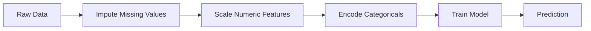
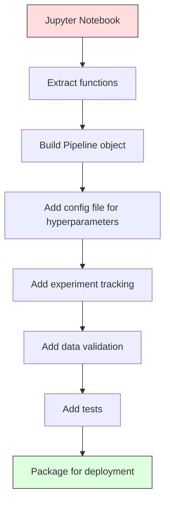

# ML Pipelines

> Một model không phải là một sản phẩm. Một pipeline là. pipeline là tất cả mọi thứ từ dữ liệu thô đến dự đoán được triển khai và mọi bước đều phải có thể tái tạo.

**Loại:** Xây dựng
**Ngôn ngữ:** Python
**Kiến thức tiên quyết:** Giai đoạn 2, Bài 12 (Điều chỉnh Hyperparameter)
**Thời lượng:** ~120 phút

## Mục tiêu học tập

- Xây dựng một ML pipeline từ đầu, chuỗi gán, chia tỷ lệ, mã hóa và model training thành một đối tượng có thể tái tạo duy nhất
- Xác định các tình huống rò rỉ dữ liệu và giải thích cách pipelines ngăn chặn chúng bằng cách chỉ lắp transformers trên dữ liệu training
- Xây dựng một ColumnTransformer áp dụng tiền xử lý khác nhau cho features số và phân loại
- Thực hiện tuần tự hóa pipeline và chứng minh rằng cùng một pipeline phù hợp tạo ra kết quả giống hệt nhau trong training và production

## Vấn đề

Bạn có một sổ ghi chép tải dữ liệu, điền các giá trị còn thiếu với giá trị trung bình, chia tỷ lệ features, huấn luyện model và in accuracy. Nó hoạt động. Bạn ship nó.

Một tháng sau, ai đó huấn luyện lại model và nhận được kết quả khác. Giá trị trung bình được tính trên toàn bộ dataset bao gồm dữ liệu thử nghiệm (rò rỉ dữ liệu). Các parameters tỷ lệ không được lưu, vì vậy inference sử dụng các số liệu thống kê khác nhau. Mã feature engineering đã được sao chép-dán giữa training và phân phát, và các bản sao khác nhau. Một cột phân loại đã đạt được một giá trị mới trong production mà encoder chưa từng thấy.

Đây không phải là giả thuyết. Chúng là những lý do phổ biến nhất ML hệ thống bị lỗi trong production. Pipelines giải quyết tất cả chúng bằng cách đóng gói mọi bước chuyển đổi thành một đối tượng duy nhất, có trật tự, có thể tái tạo.

## Khái niệm

### Pipeline là gì

pipeline là một chuỗi chuyển đổi dữ liệu có trật tự, sau đó là một model. Mỗi bước lấy đầu ra của bước trước đó làm đầu vào. Toàn bộ pipeline được lắp một lần trên dữ liệu training. Tại thời điểm inference, cùng một pipeline phù hợp chuyển đổi dữ liệu mới và đưa ra dự đoán.



pipeline đảm bảo:
- Các phép chuyển đổi chỉ được trang bị trên dữ liệu training (không rò rỉ)
- Các phép biến đổi tương tự được áp dụng tại inference thời điểm
- Toàn bộ đối tượng có thể được tuần tự hóa và triển khai dưới dạng một artifact
- Xác thực chéo áp dụng pipeline mỗi lần gấp, ngăn chặn rò rỉ tinh tế

### Rò rỉ dữ liệu: Kẻ giết người thầm lặng

Rò rỉ dữ liệu xảy ra khi thông tin từ bộ kiểm tra hoặc dữ liệu trong tương lai làm ô nhiễm training. Pipelines ngăn chặn các hình thức phổ biến nhất.

**Rò rỉ (sai):**
```python
X = df.drop("target", axis=1)
y = df["target"]

scaler = StandardScaler()
X_scaled = scaler.fit_transform(X)

X_train, X_test = X_scaled[:800], X_scaled[800:]
y_train, y_test = y[:800], y[800:]
```

Máy chia tỷ lệ đã xem dữ liệu thử nghiệm. Giá trị trung bình và độ lệch chuẩn bao gồm các mẫu thử. Điều này làm tăng ước tính accuracy.

**Đúng:**
```python
X_train, X_test = X[:800], X[800:]

scaler = StandardScaler()
X_train_scaled = scaler.fit_transform(X_train)
X_test_scaled = scaler.transform(X_test)
```

Với một pipeline, bạn không cần phải suy nghĩ về điều này. pipeline xử lý nó tự động.

### Pipeline sklearn

Chuỗi `Pipeline` của Sklearn transformers và một công cụ ước tính. Nó hiển thị `.fit()`, `.predict()` và `.score()` áp dụng tất cả các bước theo thứ tự.

```python
from sklearn.pipeline import Pipeline
from sklearn.preprocessing import StandardScaler
from sklearn.linear_model import LogisticRegression

pipe = Pipeline([
    ("scaler", StandardScaler()),
    ("model", LogisticRegression()),
])

pipe.fit(X_train, y_train)
predictions = pipe.predict(X_test)
```

Khi bạn gọi cho `pipe.fit(X_train, y_train)`:
1. Scaler gọi `fit_transform` trên X_train
2. Model gọi `fit` trên X_train được chia tỷ lệ

Khi bạn gọi cho `pipe.predict(X_test)`:
1. Scaler gọi `transform` (không phải fit_transform) trên X_test
2. Model gọi `predict` trên X_test được chia tỷ lệ

Máy chia tỷ lệ không bao giờ nhìn thấy dữ liệu thử nghiệm trong quá trình lắp. Đây là toàn bộ vấn đề.

### ColumnTransformer: Các Pipelines khác nhau cho các cột khác nhau

datasets thực có các cột số và phân loại cần xử lý trước khác nhau. `ColumnTransformer` xử lý điều này.

```python
from sklearn.compose import ColumnTransformer
from sklearn.preprocessing import StandardScaler, OneHotEncoder
from sklearn.impute import SimpleImputer

numeric_pipe = Pipeline([
    ("impute", SimpleImputer(strategy="median")),
    ("scale", StandardScaler()),
])

categorical_pipe = Pipeline([
    ("impute", SimpleImputer(strategy="most_frequent")),
    ("encode", OneHotEncoder(handle_unknown="ignore")),
])

preprocessor = ColumnTransformer([
    ("num", numeric_pipe, ["age", "income", "score"]),
    ("cat", categorical_pipe, ["city", "gender", "plan"]),
])

full_pipeline = Pipeline([
    ("preprocess", preprocessor),
    ("model", GradientBoostingClassifier()),
])
```

`handle_unknown="ignore"` trong OneHotEncoder rất quan trọng đối với production. Khi một danh mục mới xuất hiện (một thành phố mà model chưa từng thấy), nó tạo ra một vector bằng không thay vì sụp đổ.

### Theo dõi thử nghiệm

Một pipeline làm cho training có thể tái tạo, nhưng bạn cũng cần theo dõi những gì đã xảy ra trong các thử nghiệm: hyperparameters nào đã được sử dụng, phiên bản dataset nào, chỉ số là gì, mã nào đang chạy.

**MLflow** là giải pháp mã nguồn mở phổ biến nhất:

```python
import mlflow

with mlflow.start_run():
    mlflow.log_param("max_depth", 5)
    mlflow.log_param("n_estimators", 100)
    mlflow.log_param("learning_rate", 0.1)

    pipe.fit(X_train, y_train)
    accuracy = pipe.score(X_test, y_test)

    mlflow.log_metric("accuracy", accuracy)
    mlflow.sklearn.log_model(pipe, "model")
```

Mỗi lần chạy đều được ghi lại với parameters, số liệu, artifacts và model đầy đủ. Bạn có thể so sánh các lần chạy, tái tạo bất kỳ thử nghiệm nào và triển khai bất kỳ phiên bản model nào.

**Weights & Biases (wandb)** cung cấp chức năng tương tự với bảng điều khiển được lưu trữ:

```python
import wandb

wandb.init(project="my-pipeline")
wandb.config.update({"max_depth": 5, "n_estimators": 100})

pipe.fit(X_train, y_train)
accuracy = pipe.score(X_test, y_test)

wandb.log({"accuracy": accuracy})
```

### Phiên bản Model

Sau khi theo dõi thử nghiệm, bạn cần quản lý các phiên bản model. model nào trong production? Cái nào là dàn dựng? Đó là của tuần trước?

Model Registry của MLflow cung cấp:
- **Theo dõi phiên bản: **Mỗi model đã lưu đều nhận được một số phiên bản
- **Chuyển tiếp sân khấu:** "Dàn dựng", "Production", "Đã lưu trữ"
- **Quy trình phê duyệt:** Models phải được thăng cấp rõ ràng lên production
- **Rollback:** Chuyển về phiên bản trước ngay lập tức

### Phiên bản dữ liệu với DVC

Mã được tạo phiên bản với git. Dữ liệu cũng nên được tạo phiên bản, nhưng git không thể xử lý các tệp lớn. DVC (Kiểm soát phiên bản dữ liệu) giải quyết vấn đề này.

```
dvc init
dvc add data/training.csv
git add data/training.csv.dvc data/.gitignore
git commit -m "Track training data"
dvc push
```

DVC lưu trữ dữ liệu thực tế trong bộ nhớ từ xa (S3, GCS, Azure) và giữ một tệp `.dvc` nhỏ trong git ghi lại hàm băm. Khi thanh toán git commit, `dvc checkout` khôi phục chính xác dữ liệu đã sử dụng.

Điều này có nghĩa là mỗi git commit ghim cả mã và dữ liệu. Khả năng tái tạo đầy đủ.

### Thí nghiệm có thể tái tạo

Một thí nghiệm có thể tái tạo đòi hỏi bốn điều:

1. **Đã sửa hạt giống ngẫu nhiên: **Đặt hạt giống cho numpy, ngẫu nhiên và framework (ngọn đuốc, sklearn)
2. **Các phụ thuộc được ghim: **requirements.txt hoặc poetry.lock với các phiên bản chính xác
3. **Dữ liệu có phiên bản:** DVC hoặc tương tự
4. **Config tệp:** Tất cả hyperparameters trong một config, không được mã hóa cứng

```python
import numpy as np
import random

def set_seed(seed=42):
    random.seed(seed)
    np.random.seed(seed)
    try:
        import torch
        torch.manual_seed(seed)
        torch.cuda.manual_seed_all(seed)
        torch.backends.cudnn.deterministic = True
    except ImportError:
        pass
```

### Từ máy tính xách tay đến Production Pipeline



Tiến trình điển hình:

1. **Khám phá sổ tay:** Thử nghiệm nhanh, trực quan hóa feature ý tưởng
2. **Trích xuất chức năng:** Di chuyển tiền xử lý, feature engineering, đánh giá vào các mô-đun
3. **Xây dựng Pipeline:** Chuyển đổi chuỗi thành Pipeline sklearn hoặc class tùy chỉnh
4. **Config quản lý:** Di chuyển tất cả hyperparameters vào một YAML/JSON config
5. **Theo dõi thử nghiệm: **Thêm MLflow hoặc ghi nhật ký đũa phép
6. **Xác thực dữ liệu:** Kiểm tra schema, phân phối và các mẫu giá trị còn thiếu trước khi training
7. **Kiểm thử:** Kiểm tra đơn vị cho transformers, kiểm tra tích hợp cho toàn bộ pipeline
8. **Triển khai:** Serialize pipeline, wrap trong một API (FastAPI, Flask), containerize

### Những sai lầm Pipeline thường gặp

| Sai lầm | Tại sao nó lại xấu | Sửa chữa |
|---------|-------------|-----|
| Lắp dữ liệu đầy đủ trước khi tách | Rò rỉ dữ liệu | Sử dụng Pipeline với cross_val_score |
| Feature engineering bên ngoài pipeline | Các biến đổi khác nhau khi tàu và giao bóng | Đặt tất cả các biến đổi vào Pipeline |
| Không xử lý các danh mục không xác định | Production gặp sự cố trên các giá trị mới | OneHotEncoder(handle_unknown="bỏ qua") |
| Tên cột được mã hóa cứng | Ngắt khi schema thay đổi | Sử dụng danh sách tên cột từ config |
| Không xác thực dữ liệu | Dự đoán sai lầm âm thầm về dữ liệu xấu | Thêm kiểm tra schema trước khi dự đoán |
| Training/serving lệch | Model thấy các features khác nhau trong sản phẩm | Một đối tượng Pipeline cho cả hai |

## Tự xây dựng

Mã trong `code/pipeline.py` xây dựng một ML pipeline hoàn chỉnh từ đầu:

### Bước 1: Tùy chỉnh Transformer

```python
class CustomTransformer:
    def __init__(self):
        self.means = None
        self.stds = None

    def fit(self, X):
        self.means = np.mean(X, axis=0)
        self.stds = np.std(X, axis=0)
        self.stds[self.stds == 0] = 1.0
        return self

    def transform(self, X):
        return (X - self.means) / self.stds

    def fit_transform(self, X):
        return self.fit(X).transform(X)
```

### Bước 2: Pipeline từ đầu

```python
class PipelineFromScratch:
    def __init__(self, steps):
        self.steps = steps

    def fit(self, X, y=None):
        X_current = X.copy()
        for name, step in self.steps[:-1]:
            X_current = step.fit_transform(X_current)
        name, model = self.steps[-1]
        model.fit(X_current, y)
        return self

    def predict(self, X):
        X_current = X.copy()
        for name, step in self.steps[:-1]:
            X_current = step.transform(X_current)
        name, model = self.steps[-1]
        return model.predict(X_current)
```

### Bước 3: Xác thực chéo với Pipeline

Mã minh họa cách xác thực chéo với pipeline ngăn chặn rò rỉ dữ liệu: trình chia tỷ lệ được lắp riêng biệt trên dữ liệu training của mỗi nếp gấp.

### Bước 4: Làm đầy đủ Production Pipeline với sklearn

Một pipeline hoàn chỉnh với `ColumnTransformer`, nhiều đường dẫn tiền xử lý và một model, được huấn luyện với xác thực chéo và ghi nhật ký thử nghiệm thích hợp.

## Sản phẩm bàn giao

Bài học này tạo ra:
- `outputs/prompt-ml-pipeline.md` -- một skill để xây dựng và gỡ lỗi ML pipelines
- `code/pipeline.py` -- một pipeline hoàn chỉnh từ đầu thông qua Sklearn

## Bài tập

1. Xây dựng một pipeline xử lý một dataset với 3 cột số và 2 cột phân loại. Sử dụng `ColumnTransformer` để áp dụng quy gán trung bình + tỷ lệ cho số và gán thường xuyên nhất + mã hóa một nóng cho phân loại. Huấn luyện với xác thực chéo gấp 5 lần.

2. Cố tình rò rỉ dữ liệu: lắp bộ chia tỷ lệ trên dataset đầy đủ trước khi tách. So sánh điểm xác thực chéo (rò rỉ) với điểm xác thực chéo pipeline (sạch). Sự khác biệt lớn như thế nào?

3. Tuần tự hóa pipeline của bạn với `joblib.dump`. Tải nó vào một script riêng và chạy dự đoán. Xác minh các dự đoán giống hệt nhau.

4. Thêm transformer tùy chỉnh vào pipeline tạo features đa thức (bậc 2) cho hai cột số quan trọng nhất. Nó nên đi đâu trong pipeline?

5. Thiết lập theo dõi MLflow cho các pipeline. Chạy 5 thử nghiệm với các hyperparameters khác nhau. Sử dụng giao diện người dùng MLflow (`mlflow ui`) để so sánh các lần chạy và chọn model tốt nhất.

## Thuật ngữ chính

| Thuật ngữ | Những gì mọi người nói | Ý nghĩa thực sự của nó |
|------|----------------|----------------------|
| Pipeline | "Chuỗi biến đổi + model" | Một trình tự đặt hàng của transformers được trang bị và một model, được áp dụng như một đơn vị để ngăn rò rỉ |
| Rò rỉ dữ liệu | "Thông tin xét nghiệm bị rò rỉ vào training" | Sử dụng thông tin từ bên ngoài bộ training để xây dựng model, thổi phồng ước tính hiệu suất |
| CộtMáy biến áp | "Tiền xử lý khác nhau trên mỗi cột" | Áp dụng các pipelines khác nhau cho các tập hợp con cột khác nhau, kết hợp kết quả |
| Theo dõi thử nghiệm | "Ghi lại số lần chạy của bạn" | Ghi lại parameters, chỉ số, artifacts và phiên bản mã cho mỗi lần chạy training |
| Dòng chảy ML | "Theo dõi và triển khai models" | Nền tảng mã nguồn mở để theo dõi, model registry và triển khai thử nghiệm |
| DVC | "Git cho dữ liệu" | Hệ thống kiểm soát phiên bản cho các tệp dữ liệu lớn, lưu trữ hàm băm trong git và dữ liệu trong bộ nhớ từ xa |
| Model registry | "Danh mục phiên bản Model" | Một hệ thống theo dõi các phiên bản model với nhãn sân khấu (dàn dựng, production, lưu trữ) |
| Training/serving lệch | "Nó hoạt động trong sổ tay" | Sự khác biệt giữa cách xử lý dữ liệu trong training so với inference, gây ra lỗi im lặng |
| Khả năng tái tạo | "Cùng mã, cùng kết quả" | Khả năng nhận được kết quả giống hệt nhau từ cùng một mã, dữ liệu và configuration |

## Đọc thêm

- [scikit-learn Pipeline docs](https://scikit-learn.org/stable/modules/compose.html) -- tài liệu tham khảo chính thức của pipeline
- [MLflow documentation](https://mlflow.org/docs/latest/index.html) -- theo dõi và model registry thử nghiệm
- [DVC documentation](https://dvc.org/doc) -- lập phiên bản dữ liệu
- [Sculley et al., Hidden Technical Debt in Machine Learning Systems (2015)](https://papers.nips.cc/paper/2015/hash/86df7dcfd896fcaf2674f757a2463eba-Abstract.html) -- bài báo quan trọng về sự phức tạp của hệ thống ML
- [Google ML Best Practices: Rules of ML](https://developers.google.com/machine-learning/guides/rules-of-ml) -- lời khuyên production ML thiết thực
