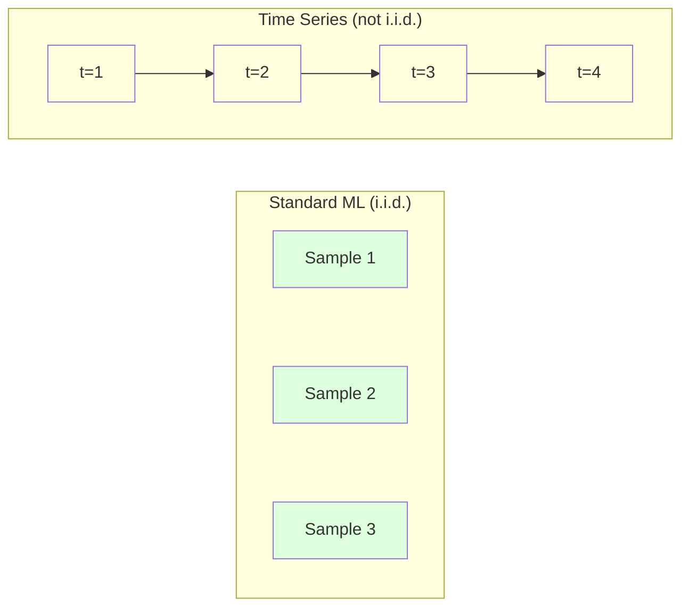
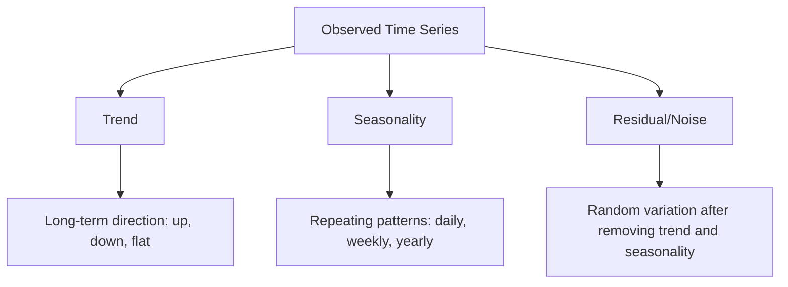
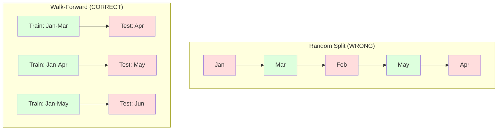

# Các nguyên tắc cơ bản về chuỗi thời gian

> Hiệu suất trong quá khứ dự đoán kết quả trong tương lai - nếu bạn kiểm tra độ tĩnh trước.

**Loại:** Xây dựng
**Ngôn ngữ:** Python
**Kiến thức tiên quyết:** Giai đoạn 2, Bài 01-09
**Thời lượng:** ~90 phút

## Mục tiêu học tập

- Phân tách chuỗi thời gian thành các thành phần xu hướng, thời vụ và dư và kiểm tra tính tĩnh
- Triển khai features độ trễ và thống kê luân phiên để chuyển đổi chuỗi thời gian thành bài toán học tập có giám sát
- Xây dựng framework xác thực chuyển tiếp để ngăn dữ liệu trong tương lai bị rò rỉ vào training
- Giải thích lý do tại sao phân tách train/test ngẫu nhiên không hợp lệ đối với chuỗi thời gian và chứng minh khoảng cách hiệu suất so với phân tách thời gian thích hợp

## Vấn đề

Bạn có dữ liệu được sắp xếp theo thời gian. Doanh số hàng ngày, temperature hàng giờ, sử dụng CPU mỗi phút, giá cổ phiếu hàng tuần. Bạn muốn dự đoán giá trị tiếp theo, tuần tiếp theo, quý tiếp theo.

Bạn tiếp cận bộ công cụ ML tiêu chuẩn của mình: phân tách train/test ngẫu nhiên, xác thực chéo, feature ma trận vào, dự đoán ra. Mỗi bước đều sai.

Chuỗi thời gian phá vỡ các giả định mà ML tiêu chuẩn dựa vào. Các mẫu không độc lập - temperature của ngày hôm nay phụ thuộc vào ngày hôm qua. Sự phân chia ngẫu nhiên làm rò rỉ thông tin trong tương lai vào quá khứ. Features trông tuyệt vời trong backtest thất bại trong production vì chúng dựa vào các mẫu thay đổi theo thời gian.

Một model nhận được 95% accuracy với xác thực chéo ngẫu nhiên có thể nhận được 55% với đánh giá dựa trên thời gian thích hợp. Sự khác biệt không phải là kỹ thuật. Đó là sự khác biệt giữa một model hoạt động trên giấy và một  hoạt động trên production.

Bài học này bao gồm các nguyên tắc cơ bản: điều gì làm cho dữ liệu thời gian khác biệt, cách đánh giá models một cách trung thực và cách biến chuỗi thời gian thành features mà ML models tiêu chuẩn có thể sử dụng.

## Khái niệm

### Điều gì làm cho chuỗi thời gian khác biệt

ML tiêu chuẩn giả định i.i.d. - độc lập và phân phối giống hệt nhau. Mỗi mẫu được rút ra từ cùng một phân phối, độc lập với các mẫu khác. Chuỗi thời gian vi phạm cả hai:

- **Không độc lập.** Giá cổ phiếu hôm nay phụ thuộc vào ngày hôm qua. Doanh số bán hàng của tuần này tương quan với doanh số của tuần trước.
- **Không phân phối giống hệt nhau.** Phân phối thay đổi theo thời gian. Doanh số bán hàng trong tháng Mười Hai trông khác với doanh số bán hàng trong tháng Ba.

Những vi phạm này không phải là nhỏ. Chúng thay đổi cách bạn xây dựng features, cách bạn đánh giá models và thuật toán nào hoạt động.



Trong ML tiêu chuẩn, các mẫu có thể hoán đổi cho nhau. Xáo trộn chúng không thay đổi gì. Trong chuỗi thời gian, trật tự là tất cả. Xáo trộn sẽ phá hủy tín hiệu.

### Các thành phần của chuỗi thời gian

Mỗi chuỗi thời gian là sự kết hợp của:



- **Xu hướng**: Hướng dài hạn. Doanh thu tăng trưởng 10% mỗi năm. temperature toàn cầu đang gia tăng.
- **Tính thời vụ**: Các mô hình lặp lại trong các khoảng thời gian cố định. Doanh số bán lẻ tăng đột biến trong tháng Mười Hai. Việc sử dụng điều hòa không khí đạt đỉnh vào tháng Bảy.
- **Còn lại**: Bất cứ thứ gì còn lại sau khi loại bỏ xu hướng và tính thời vụ. Nếu phần còn lại trông giống như nhiễu trắng, sự phân hủy đã thu được tín hiệu.

### Văn phòng phẩm

Một chuỗi thời gian đứng yên nếu các thuộc tính thống kê của nó (trung bình, variance, tự tương quan) không thay đổi theo thời gian. Hầu hết các phương pháp dự báo đều giả định tính tĩnh.

**Tại sao nó lại quan trọng: **Một chuỗi không đứng yên có một giá trị trung bình trôi dạt. Một model được huấn luyện dựa trên dữ liệu từ tháng Giêng đã học được một giá trị trung bình khác với những gì tháng Hai sẽ hiển thị. Nó sẽ sai một cách có hệ thống.

**Cách kiểm tra: **Tính toán giá trị trung bình cuộn và độ lệch chuẩn cuộn trên windows. Nếu chúng trôi dạt, bộ truyện không đứng yên.

**Cách khắc phục: **Sự khác biệt. Thay vì mô hình hóa các giá trị thô, hãy model sự thay đổi giữa các giá trị liên tiếp:

```
diff[t] = value[t] - value[t-1]
```

Nếu một vòng chênh lệch không làm cho chuỗi đứng yên, hãy áp dụng lại (chênh lệch bậc hai). Hầu hết các loạt phim trong thế giới thực cần nhiều nhất là hai vòng.

**Ví dụ:**

Sê-ri gốc: [100, 102, 106, 112, 120]
Sự khác biệt đầu tiên: [2, 4, 6, 8] (vẫn có xu hướng tăng)
Chênh lệch thứ hai: [2, 2, 2] (hằng số -- đứng yên)

Bộ truyện gốc có xu hướng bậc hai. Sự khác biệt đầu tiên đã biến nó thành một xu hướng tuyến tính. Sự khác biệt thứ hai làm cho nó phẳng. Trong thực tế, bạn hiếm khi cần nhiều hơn hai vòng.

**Thử nghiệm chính thức:** Thử nghiệm Augmented Dickey-Fuller (ADF) là thử nghiệm thống kê tiêu chuẩn cho tính tĩnh. Giả thuyết không là "chuỗi không đứng yên". Giá trị p dưới 0,05 có nghĩa là bạn có thể từ chối giá trị rỗng và kết luận tính tĩnh. Chúng ta không triển khai ADF từ đầu (nó yêu cầu các bảng phân phối tiệm cận), nhưng cách tiếp cận thống kê cuộn trong mã của chúng tôi cung cấp một kiểm tra trực quan thực tế.

### Tự tương quan

Tự tương quan đo lường mức độ tương quan của một giá trị tại thời điểm t với giá trị tại thời điểm t-k (k bước trong quá khứ). Hàm tự tương quan (ACF) vẽ mối tương quan này cho mỗi độ trễ k.

**ACF cho bạn biết:**
- Bộ truyện nhớ lại bao lâu. Nếu ACF giảm xuống 0 sau độ trễ 5, các giá trị hơn 5 bước trước là không liên quan.
- Liệu tính thời vụ có tồn tại hay không. Nếu ACF tăng đột biến ở độ trễ 12 (dữ liệu hàng tháng), thì có tính thời vụ hàng năm.
- Có bao nhiêu độ trễ features tạo ra. Sử dụng độ trễ đến mức ACF trở nên không đáng kể.

**PACF (Chức năng tự tương quan một phần)** loại bỏ các mối tương quan gián tiếp. Nếu hôm nay tương quan với 3 ngày trước chỉ vì cả hai đều tương quan với ngày hôm qua, thì PACF ở độ trễ 3 sẽ bằng 0 trong khi ACF ở độ trễ 3 thì không.

### Lag Features: Biến chuỗi thời gian thành học tập có giám sát

ML models tiêu chuẩn cần ma trận feature X và mục tiêu y. Chuỗi thời gian cung cấp cho bạn một cột giá trị duy nhất. Cây cầu bị trễ features.

Lấy chuỗi [10, 12, 14, 13, 15] và tạo features lag-1 và lag-2:

| lag_2 | lag_1 | Mục tiêu |
|-------|-------|--------|
| 10 | 12 | 14 |
| 12 | 14 | 13 |
| 14 | 13 | 15 |

Bây giờ bạn có một bài toán hồi quy chuẩn. Bất kỳ ML model nào (hồi quy tuyến tính, rừng ngẫu nhiên gradient tăng cường) đều có thể dự đoán mục tiêu từ độ trễ.

Các features bổ sung bạn có thể thiết kế:
- **Thống kê luân phiên: **trung bình, std, min, max trên các giá trị k cuối cùng
- **features lịch: **ngày trong tuần, tháng, is_holiday, is_weekend
- **Giá trị khác biệt: **thay đổi so với bước trước
- **Thống kê mở rộng:** trung bình tích lũy, tổng tích lũy
- **Tỷ lệ features: **giá trị hiện tại / giá trị trung bình lăn (cách trung bình gần đây bao xa)
- **Tương tác features: **lag_1 * day_of_week (ảnh hưởng ngày trong tuần đến động lượng)

**Có bao nhiêu độ trễ?** Sử dụng chức năng tự tương quan. Nếu ACF đáng kể lên đến độ trễ 10, hãy sử dụng ít nhất 10 độ trễ. Nếu có tính thời vụ hàng tuần, hãy bao gồm độ trễ 7 (và có thể là 14). Nhiều độ trễ hơn mang lại cho model nhiều lịch sử hơn nhưng cũng features phù hợp hơn, làm tăng nguy cơ overfitting.

**Mục tiêu alignment bẫy.** Khi tạo features độ trễ, mục tiêu phải là giá trị tại thời điểm t và tất cả features phải sử dụng giá trị tại thời điểm t-1 hoặc sớm hơn. Nếu bạn vô tình bao gồm giá trị tại thời điểm t dưới dạng feature, bạn có một dự đoán hoàn hảo - và một model hoàn toàn vô dụng. Đây là lỗi phổ biến nhất trong chuỗi thời gian feature engineering.

### Xác thực Walk-Forward

Đây là khái niệm quan trọng nhất trong bài học này. Xác thực chéo k-fold tiêu chuẩn chỉ định ngẫu nhiên các mẫu để huấn luyện và kiểm tra. Đối với chuỗi thời gian, điều này làm rò rỉ thông tin trong tương lai.



Xác thực chuyển tiếp:
1. Huấn luyện dữ liệu theo thời gian
2. Dự đoán tại thời điểm t+1 (hoặc t+1 đến t+k cho nhiều bước)
3. Trượt cửa sổ về phía trước
4. Lặp lại

Mỗi lần xếp thử nghiệm chỉ chứa dữ liệu đến sau tất cả dữ liệu training. Không rò rỉ trong tương lai. Điều này cung cấp cho bạn ước tính trung thực về cách model sẽ hoạt động khi triển khai.

**Mở rộng cửa sổ** sử dụng tất cả dữ liệu lịch sử cho training (cửa sổ phát triển). **Cửa sổ trượt** sử dụng cửa sổ training có kích thước cố định (cửa sổ trượt). Sử dụng tính năng mở rộng khi bạn cho rằng dữ liệu cũ hơn vẫn có liên quan. Sử dụng trượt khi thế giới thay đổi và dữ liệu cũ bị tổn thương.

### Trực giác ARIMA

ARIMA là chuỗi thời gian cổ điển model. Nó có ba thành phần:

- **AR (Tự hồi quy):** Dự đoán từ các giá trị trong quá khứ. AR(p) sử dụng các giá trị p cuối cùng.
- **I (Tích hợp):** Khác biệt để đạt được tính tĩnh. I (d) áp dụng các vòng d của sự khác biệt.
- **MA (Đường trung bình động):** Dự đoán từ các lỗi dự báo trong quá khứ. MA (q) sử dụng lỗi q cuối cùng.

ARIMA(p, d, q) kết hợp cả ba. Bạn chọn p, d, q dựa trên phân tích ACF/PACF hoặc tìm kiếm tự động (auto-ARIMA).

Chúng ta sẽ không triển khai ARIMA từ đầu -- nó yêu cầu tối ưu hóa số nằm ngoài phạm vi của bài học này. Thông tin chi tiết quan trọng là hiểu từng thành phần làm gì để bạn có thể diễn giải kết quả ARIMA và biết khi nào nên sử dụng nó.

### Khi nào sử dụng nội dung

| Cách tiếp cận | Tốt nhất cho | Xử lý tính thời vụ | Xử lý Features bên ngoài |
|----------|---------|-------------------|------------------------|
| Độ trễ features + ML | Bảng với nhiều features bên ngoài | Với features lịch | Có |
| ARIMA | Chuỗi đơn biến đơn, ngắn hạn | Biến thể SARIMA | Không (ARIMAX cho giới hạn) |
| Làm mịn theo cấp số nhân | Xu hướng đơn giản + tính thời vụ | Có (Holt-Winters) | Không |
| Tiên tri | Dự báo kinh doanh, ngày lễ | Có (thuật ngữ Fourier) | Giới hạn |
| Mạng nơ-ron (LSTM, Transformer) | Chuỗi dài, nhiều loạt | Đã học | Có |

Đối với hầu hết các vấn đề thực tế, tăng độ trễ features + gradient là điểm khởi đầu mạnh nhất. Nó xử lý các features bên ngoài một cách tự nhiên, không yêu cầu tính tĩnh và dễ gỡ lỗi.

### Chân trời và chiến lược dự báo

Dự báo một bước dự đoán đi trước một bước. Dự báo nhiều bước dự đoán nhiều bước. Có ba chiến lược:

**Đệ quy (lặp lại):** Dự đoán trước một bước, sử dụng dự đoán làm đầu vào cho bước tiếp theo. Đơn giản nhưng lỗi tích lũy - mỗi dự đoán sử dụng dự đoán trước đó, vì vậy sai lầm kết hợp.

**Trực tiếp:** Huấn luyện một model riêng cho từng chân trời. Model-1 dự đoán T + 1, Model-5 dự đoán T + 5. Không tích lũy lỗi, nhưng mỗi model có ít mẫu training hơn và họ không chia sẻ thông tin.

**Đa đầu ra:** Huấn luyện một model xuất ra tất cả các chân trời đồng thời. Chia sẻ thông tin qua các chân trời nhưng yêu cầu model hỗ trợ nhiều đầu ra (hoặc chức năng loss tùy chỉnh).

Đối với hầu hết các vấn đề thực tế, hãy bắt đầu với đệ quy cho các chân trời ngắn (1-5 bước) và hướng cho các chân trời dài hơn.

### Những sai lầm thường gặp trong chuỗi thời gian

| Sai lầm | Tại sao nó xảy ra | Cách khắc phục |
|---------|---------------|-----------|
| Phân chia train/test ngẫu nhiên | Thói quen từ ML chuẩn | Sử dụng phân tách đi bộ hoặc thời gian |
| Sử dụng features trong tương lai | Feature tại thời điểm t được đưa vào do nhầm lẫn | Kiểm tra mọi feature để tìm alignment thời gian |
| Overfitting tính thời vụ | Model ghi nhớ các mẫu lịch | Đưa ra một chu kỳ theo mùa đầy đủ trong bộ thử nghiệm |
| Bỏ qua các thay đổi tỷ lệ | Doanh thu tăng gấp đôi nhưng các mô hình vẫn giữ nguyên | Model phần trăm thay đổi thay vì tuyệt đối |
| Quá nhiều độ trễ features | "Lịch sử nhiều hơn là tốt hơn" | Sử dụng ACF để xác định độ trễ có liên quan |
| Không khác biệt | "Người model sẽ tìm ra nó" | Tree models xử lý xu hướng; models tuyến tính cần tính tĩnh |

## Tự xây dựng

Mã trong `code/time_series.py` triển khai các khối xây dựng cốt lõi từ đầu.

### Lag Feature Creator

```python
def make_lag_features(series, n_lags):
    n = len(series)
    X = np.full((n, n_lags), np.nan)
    for lag in range(1, n_lags + 1):
        X[lag:, lag - 1] = series[:-lag]
    valid = ~np.isnan(X).any(axis=1)
    return X[valid], series[valid]
```

Điều này chuyển đổi chuỗi 1D thành ma trận feature trong đó mỗi hàng có giá trị `n_lags` cuối cùng là features và giá trị hiện tại là đích.

### Xác thực chéo Walk-Forward

```python
def walk_forward_split(n_samples, n_splits=5, min_train=50):
    assert min_train < n_samples, "min_train must be less than n_samples"
    step = max(1, (n_samples - min_train) // n_splits)
    for i in range(n_splits):
        train_end = min_train + i * step
        test_end = min(train_end + step, n_samples)
        if train_end >= n_samples:
            break
        yield slice(0, train_end), slice(train_end, test_end)
```

Mỗi lần phân tách đảm bảo dữ liệu training xuất hiện nghiêm ngặt trước dữ liệu thử nghiệm. Cửa sổ training mở rộng với mỗi lần gấp.

### Model tự hồi quy đơn giản

Một model AR thuần túy chỉ là hồi quy tuyến tính trên features độ trễ:

```python
class SimpleAR:
    def __init__(self, n_lags=5):
        self.n_lags = n_lags
        self.weights = None
        self.bias = None

    def fit(self, series):
        X, y = make_lag_features(series, self.n_lags)
        # Solve via normal equations
        X_b = np.column_stack([np.ones(len(X)), X])
        theta = np.linalg.lstsq(X_b, y, rcond=None)[0]
        self.bias = theta[0]
        self.weights = theta[1:]
        return self
```

Về mặt khái niệm, điều này giống hệt với hồi quy tuyến tính từ Bài 02, nhưng được áp dụng cho các phiên bản trễ thời gian của cùng một biến.

### Kiểm tra độ tĩnh

Mã tính toán số liệu thống kê luân phiên để đánh giá độ tĩnh một cách trực quan và số:

```python
def check_stationarity(series, window=50):
    rolling_mean = np.array([
        series[max(0, i - window):i].mean()
        for i in range(1, len(series) + 1)
    ])
    rolling_std = np.array([
        series[max(0, i - window):i].std()
        for i in range(1, len(series) + 1)
    ])
    return rolling_mean, rolling_std
```

Nếu giá trị trung bình lăn trôi hoặc tiêu chuẩn lăn thay đổi, chuỗi không đứng yên. Áp dụng sự khác biệt và kiểm tra lại.

Mã cũng kiểm tra tính tĩnh bằng cách so sánh nửa đầu và nửa sau của bộ truyện. Nếu các phương tiện chênh lệch hơn một nửa độ lệch chuẩn hoặc tỷ lệ variance vượt quá 2x, chuỗi được gắn cờ là không tĩnh.

### Tự tương quan

```python
def autocorrelation(series, max_lag=20):
    n = len(series)
    mean = series.mean()
    var = series.var()
    acf = np.zeros(max_lag + 1)
    for k in range(max_lag + 1):
        cov = np.mean((series[:n-k] - mean) * (series[k:] - mean))
        acf[k] = cov / var if var > 0 else 0
    return acf
```

## Ứng dụng

Với sklearn, bạn sử dụng lag features trực tiếp với bất kỳ hồi quy nào:

```python
from sklearn.linear_model import Ridge
from sklearn.ensemble import GradientBoostingRegressor

X, y = make_lag_features(series, n_lags=10)

for train_idx, test_idx in walk_forward_split(len(X)):
    model = Ridge(alpha=1.0)
    model.fit(X[train_idx], y[train_idx])
    predictions = model.predict(X[test_idx])
```

Đối với ARIMA, hãy sử dụng statsmodels:

```python
from statsmodels.tsa.arima.model import ARIMA

model = ARIMA(train_series, order=(5, 1, 2))
fitted = model.fit()
forecast = fitted.forecast(steps=30)
```

Mã trong `time_series.py` trình bày cả hai cách tiếp cận và so sánh chúng bằng cách sử dụng xác thực walk-forward.

### sklearn TimeSeriesSplit

Sklearn cung cấp `TimeSeriesSplit` triển khai xác thực walk-forward:

```python
from sklearn.model_selection import TimeSeriesSplit

tscv = TimeSeriesSplit(n_splits=5)
for train_index, test_index in tscv.split(X):
    X_train, X_test = X[train_index], X[test_index]
    y_train, y_test = y[train_index], y[test_index]
    model.fit(X_train, y_train)
    score = model.score(X_test, y_test)
```

Điều này tương đương với `walk_forward_split` từ đầu của chúng tôi nhưng được tích hợp vào framework xác thực chéo của sklearn. Bạn có thể sử dụng nó với `cross_val_score`:

```python
from sklearn.model_selection import cross_val_score

scores = cross_val_score(model, X, y, cv=TimeSeriesSplit(n_splits=5))
print(f"Mean score: {scores.mean():.4f} +/- {scores.std():.4f}")
```

### Chỉ số đánh giá

Dự báo chuỗi thời gian sử dụng chỉ số hồi quy, nhưng với ngữ cảnh nhận biết thời gian:

- **MAE (Sai số tuyệt đối trung bình):** Trung bình của |y_true - y_pred|. Dễ dàng giải thích trong các đơn vị gốc. "Trung bình, các dự đoán bị lệch 3,2 độ."
- **RMSE (Lỗi bình phương trung bình gốc):** Căn bậc hai của sai số bình phương trung bình. Phạt các lỗi lớn hơn MAE. Sử dụng khi lỗi lớn tồi tệ hơn nhiều lỗi nhỏ.
- **MAPE (Lỗi phần trăm tuyệt đối trung bình):** Trung bình của |error / true_value| * 100. Không phụ thuộc vào tỷ lệ, hữu ích để so sánh giữa các dòng khác nhau. Nhưng không xác định khi giá trị thực bằng không.
- **So sánh đường cơ sở ngây thơ:** Luôn so sánh với các đường cơ sở đơn giản. Đường cơ sở ngây thơ theo mùa dự đoán giá trị từ một giai đoạn trước (hôm qua, tuần trước). Nếu model của bạn không thể đánh bại sự ngây thơ, có điều gì đó không ổn.

### Lăn Features

Mã minh họa việc thêm số liệu thống kê luân phiên (trung bình, tiêu chuẩn, tối thiểu, tối đa trong windows 7 và 14 ngày) để trễ features. Những điều này cung cấp thông tin model về các xu hướng gần đây và sự biến động mà độ trễ features không nắm bắt được.

Ví dụ: nếu giá trị trung bình đang tăng, nó cho thấy một xu hướng tăng. Nếu std đang tăng, điều đó cho thấy sự biến động ngày càng tăng. Đây là những loại mô hình mà models dựa trên cây có thể học hỏi nhưng models tuyến tính thì không.

## Sản phẩm bàn giao

Bài học này tạo ra:
- `outputs/prompt-time-series-advisor.md` -- một prompt để đóng khung các vấn đề chuỗi thời gian
- `code/time_series.py` -- features độ trễ, xác thực đi bộ, model AR, kiểm tra độ tĩnh

### Đường cơ sở bạn phải đánh bại

Trước khi xây dựng bất kỳ model nào, hãy thiết lập đường cơ sở:

1. **Giá trị cuối cùng (persistence).** Dự đoán rằng ngày mai sẽ giống như hôm nay. Đối với nhiều bộ truyện, điều này khó đánh bại một cách đáng ngạc nhiên.
2. **Ngây thơ theo mùa.** Dự đoán rằng hôm nay sẽ giống với cùng ngày tuần trước (hoặc năm ngoái). Nếu model của bạn không thể đánh bại điều này, nó đã không học được bất kỳ mô hình hữu ích nào ngoài tính thời vụ.
3. **Đường trung bình động.** Dự đoán giá trị trung bình của k giá trị cuối cùng. Làm mịn nhiễu nhưng không thể ghi lại những thay đổi đột ngột.

Nếu ML model ưa thích của bạn thua đường cơ sở ngây thơ theo mùa, bạn có lỗi. Phổ biến nhất: rò rỉ trong tương lai trong features, phương pháp đánh giá sai hoặc chuỗi thực sự ngẫu nhiên và không thể đoán trước.

### Mẹo thực tế

1. **Bắt đầu với âm mưu.** Trước bất kỳ mô hình nào, hãy vẽ loạt phim thô. Tìm kiếm xu hướng, tính thời vụ, ngoại lệ, phá vỡ cấu trúc (thay đổi đột ngột trong hành vi). Kiểm tra trực quan trong 30 giây thường cho bạn biết hơn một giờ phân tích tự động.

2. **Sự khác biệt đầu tiên, model thứ hai.** Nếu chuỗi có xu hướng rõ ràng, hãy phân biệt nó trước khi tạo ra độ trễ features. models dựa trên cây có thể xử lý xu hướng, nhưng models tuyến tính thì không thể, và sự khác biệt không bao giờ gây hại.

3. **Duy trì ít nhất một chu kỳ theo mùa đầy đủ.** Nếu bạn có tính thời vụ hàng tuần, bộ thử nghiệm của bạn cần ít nhất một tuần trọn vẹn. Nếu hàng tháng, ít nhất một tháng trọn vẹn. Nếu không, bạn không thể đánh giá xem model có nắm bắt được mô hình theo mùa hay không.

4. **Giám sát trong production.** Chuỗi thời gian models suy giảm theo thời gian khi thế giới thay đổi. Theo dõi lỗi dự đoán trên cơ sở luân phiên. Khi lỗi bắt đầu tăng, hãy huấn luyện lại model trên dữ liệu gần đây.

5. **Cẩn thận với những thay đổi về chế độ.** Một model được huấn luyện về dữ liệu trước đại dịch sẽ không dự đoán được hành vi sau đại dịch. Bao gồm các chỉ báo về các thay đổi chế độ đã biết dưới dạng features hoặc sử dụng cửa sổ trượt quên dữ liệu cũ.

6. **Chuỗi lệch biến đổi nhật ký.** Doanh thu, giá cả và số lượng thường bị lệch phải. Lấy nhật ký ổn định variance và làm cho các mẫu nhân trở nên bổ sung, mà models tuyến tính có thể xử lý. Dự báo bằng log space, sau đó cấp số mũ để trở lại đơn vị ban đầu.

## Bài tập

1. **Thử nghiệm tĩnh.** Tạo một chuỗi với xu hướng tuyến tính. Kiểm tra độ tĩnh với số liệu thống kê lăn. Áp dụng sự khác biệt đầu tiên. Kiểm tra lại. Cần bao nhiêu vòng khác biệt cho một xu hướng bậc hai?

2. **Lựa chọn độ trễ.** Tính toán ACF trên chuỗi theo mùa (khoảng thời gian = 7). Độ trễ nào có tự tương quan cao nhất? Tạo độ trễ features chỉ sử dụng những độ trễ đó (không phải độ trễ liên tiếp). accuracy có cải thiện so với sử dụng độ trễ từ 1 đến 7 không?

3. **Đi bộ về phía trước so với phân tách ngẫu nhiên.** Huấn luyện hồi quy Ridge trên features độ trễ. Đánh giá bằng cách phân chia 80/20 ngẫu nhiên và xác thực đi bộ. Phân tách ngẫu nhiên đánh giá quá cao hiệu suất bao nhiêu?

4. **Feature engineering.** Thêm giá trị trung bình lăn (cửa sổ = 7), tiêu chuẩn lăn (cửa sổ = 7) và features ngày trong tuần vào features độ trễ. So sánh accuracy có và không có các tính năng bổ sung này bằng cách sử dụng xác thực chuyển tiếp.

5. **Dự báo nhiều bước.** Sửa đổi model AR để dự đoán 5 bước trước thay vì 1. So sánh hai chiến lược: (a) dự đoán một bước, sử dụng dự đoán làm đầu vào cho bước tiếp theo (đệ quy) và (b) huấn luyện các models riêng biệt cho mỗi chân trời (trực tiếp). Cái nào chính xác hơn?

## Thuật ngữ chính

| Thuật ngữ | Những gì mọi người nói | Ý nghĩa thực sự của nó |
|------|----------------|----------------------|
| Văn phòng phẩm | "Số liệu thống kê không thay đổi theo thời gian" | Một chuỗi có cấu trúc trung bình, variance và tự tương quan không đổi theo thời gian |
| Sự khác biệt | "Trừ các giá trị liên tiếp" | Tính toán y[t] - y[t-1] để loại bỏ xu hướng và đạt được tính tĩnh |
| Tự tương quan (ACF) | "Làm thế nào một chuỗi tương quan với chính nó" | Mối tương quan giữa một chuỗi thời gian và một bản sao trễ của chính nó, như một hàm của độ trễ |
| Tự tương quan một phần (PACF) | "Chỉ tương quan trực tiếp" | Tự tương quan ở độ trễ k sau khi loại bỏ ảnh hưởng của tất cả các độ trễ ngắn hơn |
| Độ trễ features | "Giá trị trong quá khứ làm đầu vào" | Sử dụng y[t-1], y[t-2], ..., y[t-k] làm features để dự đoán y[t] |
| Xác thực chuyển tiếp | "Xác thực chéo tôn trọng thời gian" | Đánh giá trong đó dữ liệu training luôn đứng trước dữ liệu thử nghiệm theo thứ tự thời gian |
| ARIMA | "Chuỗi thời gian cổ điển model" | Đường trung bình động tích hợp tự hồi quy: kết hợp các giá trị trong quá khứ (AR), lỗi khác biệt (I) và lỗi trong quá khứ (MA) |
| Tính thời vụ | "Lặp lại các mẫu lịch" | Các chu kỳ đều đặn, có thể dự đoán được trong một chuỗi thời gian gắn với các khoảng thời gian lịch (hàng ngày, hàng tuần, hàng năm) |
| Xu hướng | "Hướng đi dài hạn" | Tăng hoặc giảm liên tục mức độ chuỗi theo thời gian |
| Mở rộng cửa sổ | "Sử dụng tất cả lịch sử" | Xác thực chuyển tiếp trong đó bộ training phát triển với mỗi lần gấp |
| Cửa sổ trượt | "Lịch sử kích thước cố định" | Xác thực chuyển tiếp trong đó bộ training là một cửa sổ có độ dài cố định trượt về phía trước |

## Đọc thêm

- [Hyndman and Athanasopoulos, Forecasting: Principles and Practice (3rd ed.)](https://otexts.com/fpp3/) - sách giáo khoa miễn phí tốt nhất về dự báo chuỗi thời gian
- [scikit-learn Time Series Split](https://scikit-learn.org/stable/modules/generated/sklearn.model_selection.TimeSeriesSplit.html) -- bộ chia đi bộ của Sklearn
- [statsmodels ARIMA docs](https://www.statsmodels.org/stable/generated/statsmodels.tsa.arima.model.ARIMA.html) -- Triển khai ARIMA với chẩn đoán
- [Makridakis et al., The M5 Competition (2022)](https://www.sciencedirect.com/science/article/pii/S0169207021001874) - Cuộc thi dự báo quy mô lớn cho thấy phương pháp ML so với phương pháp thống kê
