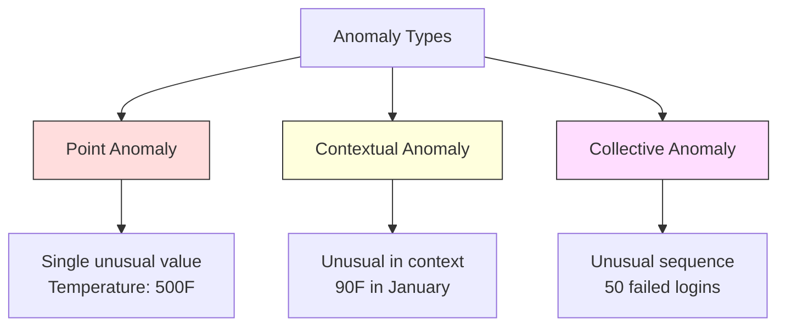
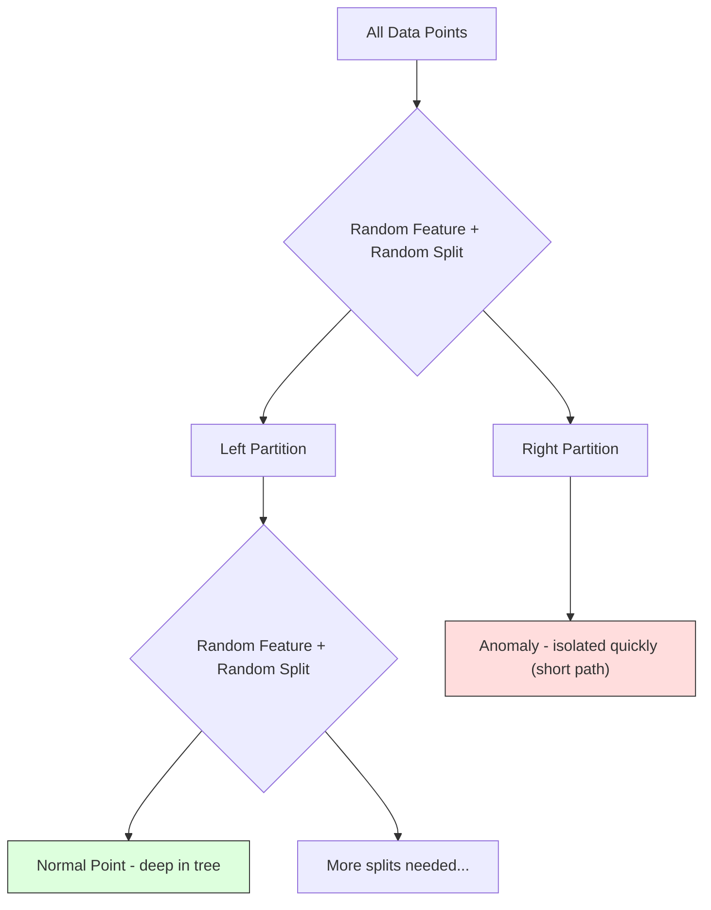
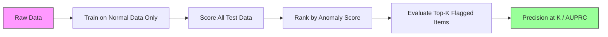

# Phát hiện bất thường

> Bình thường rất dễ xác định. Bất thường là bất cứ điều gì không phù hợp.

**Loại:** Xây dựng
**Ngôn ngữ:** Python
**Kiến thức tiên quyết:** Giai đoạn 2, Bài 01-09
**Thời lượng:** ~75 phút

## Mục tiêu học tập

- Triển khai các phương pháp phát hiện điểm Z, IQR và Rừng cô lập từ đầu
- Phân biệt giữa các dị thường điểm, ngữ cảnh và tập thể và chọn phương pháp phát hiện thích hợp cho từng
- Giải thích lý do tại sao tính năng phát hiện bất thường được đóng khung như mô hình hóa dữ liệu bình thường thay vì phân loại các điểm bất thường
- So sánh phát hiện bất thường không giám sát với phân loại có giám sát và đánh giá sự cân bằng giữa phạm vi bảo hiểm bất thường mới và precision

## Vấn đề

Thẻ tín dụng được sử dụng ở New York lúc 2 giờ chiều, sau đó ở Tokyo lúc 2:05 chiều. Cảm biến của nhà máy đọc 150 độ khi phạm vi bình thường là 80-120. Một server gửi 50.000 yêu cầu mỗi giây khi mức trung bình hàng ngày là 200.

Đây là những dị thể. Tìm kiếm chúng rất quan trọng. Gian lận tiêu tốn hàng tỷ đô la. Hỏng hóc thiết bị tốn kém thời gian ngừng hoạt động. Dữ liệu chi phí xâm nhập mạng.

Thách thức: bạn hiếm khi có các ví dụ về dị thường. Gian lận chiếm 0,1% giao dịch. Lỗi thiết bị xảy ra một vài lần mỗi năm. Bạn không thể huấn luyện một bộ phân loại tiêu chuẩn vì hầu như không có gì trong class "bất thường" để học hỏi. Ngay cả khi bạn có một số nhãn, những dị thể bạn đã thấy không phải là loại duy nhất bạn sẽ gặp phải. Kế hoạch gian lận của ngày mai trông khác với ngày hôm nay.

Phát hiện bất thường lật ngược vấn đề. Thay vì học những gì bất thường, hãy học những gì là bình thường. Bất cứ điều gì đi chệch khỏi bình thường đều đáng ngờ. Điều này hoạt động mà không cần nhãn, thích ứng với các loại dị thường mới và mở rộng quy mô thành các datasets khổng lồ.

## Khái niệm

### Các loại dị thường

Không phải tất cả các dị thể đều giống nhau:

- **Điểm bất thường.** Một điểm dữ liệu duy nhất bất thường bất kể ngữ cảnh. Đọc temperature 500 độ. Một giao dịch $50,000 from an account that normally spends $50.
- **Bất thường theo ngữ cảnh.** Một điểm dữ liệu bất thường dựa trên ngữ cảnh của nó. temperature 90 độ là bình thường vào mùa hè, bất thường vào mùa đông. Cùng một giá trị, bối cảnh khác nhau.
- **Dị thường tập thể.** Một chuỗi các điểm dữ liệu bất thường như một nhóm, mặc dù mỗi điểm riêng lẻ có thể bình thường. Năm lần đăng nhập không thành công là bình thường. Năm mươi liên tiếp là một cuộc tấn công vũ phu.

Hầu hết các phương pháp đều phát hiện điểm bất thường. Các dị thường theo ngữ cảnh cần features thời gian hoặc địa điểm. Các dị thể tập thể cần các phương pháp nhận biết trình tự.



### Khung hình không giám sát

Trong phân loại tiêu chuẩn, bạn có nhãn cho cả hai classes. Trong phát hiện bất thường, bạn thường gặp một trong ba tình huống:

1. **Hoàn toàn không được giám sát.** Không có nhãn nào cả. Bạn lắp máy dò trên tất cả dữ liệu và hy vọng sự bất thường đủ hiếm để không làm hỏng model "bình thường".
2. **Bán giám sát.** Bạn chỉ có một dataset sạch dữ liệu bình thường. Bạn phù hợp với bộ sạch sẽ này và ghi điểm mọi thứ khác. Đây là thiết lập mạnh nhất khi có thể.
3. **Giám sát yếu.** Bạn có một vài dị thể được dán nhãn. Sử dụng chúng để đánh giá chứ không phải training. Huấn luyện mà không cần giám sát, sau đó đo precision/recall trên tập con được gắn nhãn.

Thông tin chi tiết quan trọng: phát hiện bất thường về cơ bản khác với phân loại. Bạn đang mô hình hóa sự phân bố của dữ liệu bình thường, không phải ranh giới quyết định giữa hai classes.

### Được giám sát và không được giám sát: Sự đánh đổi

Nếu bạn có các điểm bất thường được gắn nhãn, bạn nên sử dụng chúng để training (phân loại có giám sát) hay chỉ để đánh giá (phát hiện không giám sát)?

**Được giám sát (coi là phân loại):**
- Nắm bắt chính xác các loại dị thể mà bạn đã thấy trước đây
- precision cao hơn đối với các loại dị thể đã biết
- Bỏ lỡ hoàn toàn các loại dị thể mới lạ
- Yêu cầu huấn luyện lại khi các loại dị thể mới xuất hiện
- Cần đủ ví dụ dị thường (thường quá ít)

**Không giám sát (model bình thường, độ lệch cờ):**
- Phát hiện bất kỳ sai lệch nào so với bình thường, kể cả các loại mới
- Không yêu cầu các dị thể được dán nhãn
- Tỷ lệ dương tính giả cao hơn (không phải mọi thứ bất thường đều xấu)
- Mạnh mẽ hơn để chuyển đổi phân phối

Trong thực tế, các hệ thống tốt nhất kết hợp cả hai: phát hiện không giám sát để bao phủ rộng, models giám sát cho các loại dị thường có mức độ ưu tiên cao đã biết và đánh giá của con người đối với các trường hợp mơ hồ.

### Phương pháp Z-Score

Cách tiếp cận đơn giản nhất. Tính giá trị trung bình và độ lệch chuẩn của từng feature. Gắn cờ bất kỳ điểm nào nhiều hơn k độ lệch chuẩn so với giá trị trung bình.

```text
z_score = (x - mean) / std
anomaly if |z_score| > threshold
```

Ngưỡng mặc định là 3.0 (99.7% dữ liệu bình thường nằm trong 3 độ lệch chuẩn đối với phân phối Gaussian).

**Điểm mạnh: **Đơn giản. Nhanh chóng. Có thể giải thích ("giá trị này là 4,5 độ lệch chuẩn so với bình thường").

**Điểm yếu:** Giả định dữ liệu tuân theo phân phối chuẩn. Nhạy cảm với các giá trị ngoại lệ trong dữ liệu training (các giá trị ngoại lệ làm thay đổi giá trị trung bình và làm tăng giá trị lây truyền qua đường tình dục, khiến chúng khó phát hiện hơn). Không thành công trên các bản phân phối đa phương thức.

**Khi nó hoạt động tốt:** Giám sát một feature trong đó dữ liệu gần như hình chuông. Server thời gian phản hồi, dung sai sản xuất, số đọc cảm biến với đường cơ sở ổn định.

**Khi không thành công:** Dữ liệu nhiều cụm (hai địa điểm văn phòng có nhiệt độ cơ bản khác nhau), dữ liệu sai lệch (số tiền giao dịch hiếm 1000 đô la nhưng không bất thường), dữ liệu có giá trị ngoại lệ trong tập training.

### Phương pháp IQR

Mạnh mẽ hơn điểm Z. Sử dụng phạm vi liên tứ phân vị thay vì trung bình và độ lệch chuẩn.

```
Q1 = 25th percentile
Q3 = 75th percentile
IQR = Q3 - Q1
lower_bound = Q1 - factor * IQR
upper_bound = Q3 + factor * IQR
anomaly if x < lower_bound or x > upper_bound
```

Hệ số mặc định là 1,5.

**Điểm mạnh:** Mạnh mẽ đến các giá trị ngoại lệ (phần trăm không bị ảnh hưởng bởi các giá trị cực đoan). Hoạt động trên các phân phối lệch. Không có giả định bình thường.

**Điểm yếu:** Chỉ đơn biến (áp dụng cho mỗi feature một cách độc lập). Không thể phát hiện bất thường chỉ khi features được xem xét cùng nhau (một điểm có thể bình thường ở mỗi feature riêng lẻ nhưng dị thường trong không gian khớp).

**Lưu ý thực tế:** Hệ số 1,5 trong IQR tương ứng với râu trong một biểu đồ hộp. Các điểm bên ngoài râu là ngoại lệ tiềm ẩn. Sử dụng 3.0 thay vì 1.5 làm cho máy dò thận trọng hơn (ít cờ hơn, ít dương tính giả hơn). Yếu tố phù hợp phụ thuộc vào khả năng chịu đựng của bạn đối với báo động giả.

### Rừng cô lập

Thông tin chi tiết quan trọng: dị thường rất ít và khác nhau. Trong phân vùng dữ liệu ngẫu nhiên, các dị thường dễ dàng cô lập hơn - chúng cần ít phân tách ngẫu nhiên hơn để tách ra khỏi rest.



**Cách thức hoạt động:**
1. Xây dựng nhiều cây ngẫu nhiên (một khu rừng cô lập)
2. Tại mỗi nút, chọn một feature ngẫu nhiên và một giá trị phân tách ngẫu nhiên giữa tối thiểu và tối đa của feature
3. Tiếp tục tách cho đến khi mọi điểm được cô lập (trong lá của chính nó)
4. Các dị thể có chiều dài đường đi trung bình ngắn hơn trên tất cả các cây

**Tại sao nó hoạt động: **Các điểm bình thường sống ở các khu vực dày đặc. Cần có nhiều sự phân tách ngẫu nhiên để cô lập một người khỏi các nước láng giềng của nó. Các dị thể sống ở các khu vực thưa thớt. Một hoặc hai lần tách ngẫu nhiên là đủ để cô lập chúng.

Điểm bất thường dựa trên độ dài đường dẫn trung bình trên tất cả các cây, được chuẩn hóa bởi độ dài đường dẫn dự kiến của cây tìm kiếm nhị phân ngẫu nhiên:

```
score(x) = 2^(-average_path_length(x) / c(n))
```

Trong đó `c(n)` là chiều dài đường dẫn dự kiến cho n mẫu. Điểm gần 1 có nghĩa là dị thường. Điểm gần 0,5 có nghĩa là bình thường. Điểm gần 0 có nghĩa là rất bình thường (sâu trong các cụm dày đặc).

**Điểm mạnh:** Không có giả định phân phối. Hoạt động ở kích thước cao. Chia tỷ lệ tốt (kích thước mẫu phụ tuyến tính vì mỗi cây sử dụng một mẫu phụ). Xử lý các loại feature hỗn hợp.

**Điểm yếu:** Đấu tranh với các dị thể ở các khu vực dày đặc (hiệu ứng che giấu). Phân tách ngẫu nhiên kém hiệu quả hơn khi nhiều features không liên quan.

**hyperparameters chính:**
- `n_estimators`: Số lượng cây. 100 thường là đủ. Nhiều cây hơn cho điểm ổn định hơn nhưng tính toán chậm hơn.
- `max_samples`: Số lượng mẫu trên mỗi cây. 256 là mặc định trong bài báo gốc. Các giá trị nhỏ hơn làm cho các cây riêng lẻ kém chính xác hơn nhưng tăng tính đa dạng. Lấy mẫu phụ là điều làm cho Isolation Forest nhanh chóng - mỗi cây nhìn thấy một phần nhỏ dữ liệu.
- `contamination`: Phần bất thường dự kiến. Chỉ được sử dụng để đặt ngưỡng. Không ảnh hưởng đến bản thân điểm số.

### Hệ số ngoại lệ cục bộ (LOF)

LOF so sánh mật độ cục bộ xung quanh một điểm với mật độ xung quanh các điểm lân cận của nó. Một điểm trong một khu vực thưa thớt được bao quanh bởi các khu vực dày đặc là dị thường.

**Cách thức hoạt động:**
1. Đối với mỗi điểm, hãy tìm k hàng xóm gần nhất của nó
2. Tính mật độ khả năng tiếp cận cục bộ (mật độ vùng lân cận)
3. So sánh mật độ của mỗi điểm với mật độ của các điểm lân cận
4. Nếu một điểm có mật độ thấp hơn nhiều so với các điểm lân cận của nó, thì đó là một ngoại lệ

**Điểm LOF:**
- LOF gần 1.0 có nghĩa là mật độ tương tự như hàng xóm (bình thường)
- LOF lớn hơn 1.0 có nghĩa là mật độ thấp hơn hàng xóm (có khả năng dị thường)
- LOF lớn hơn nhiều so với 1.0 (ví dụ: 2.0+) có nghĩa là mật độ thấp hơn đáng kể (có khả năng bất thường)

Phần "địa phương" là rất quan trọng. Hãy xem xét một dataset có hai cụm: một cụm dày đặc 1000 điểm và một cụm thưa thớt 50 điểm. Một điểm ở rìa của cụm thưa thớt không phải là bất thường trên toàn cầu - nó có 50 láng giềng. Nhưng điều bất thường ở địa phương nếu các nước láng giềng trực tiếp của nó dày đặc hơn thực tế. LOF nắm bắt được sắc thái này mà các phương pháp toàn cầu bỏ qua.

**Điểm mạnh:** Phát hiện các điểm bất thường cục bộ (các điểm bất thường trong khu vực lân cận của chúng, ngay cả khi chúng không phải là bất thường trên toàn cầu). Hoạt động trên các cụm có mật độ khác nhau.

**Điểm yếu:** Làm chậm trên datasets lớn (O(n^2) để thực hiện ngây thơ). Nhạy cảm với sự lựa chọn của k. Không hoạt động tốt ở kích thước rất cao (lời nguyền về chiều ảnh hưởng đến tính toán khoảng cách).

### So sánh

| Phương pháp | Giả định | Tốc độ | Xử lý độ mờ cao | Phát hiện bất thường cục bộ |
|--------|------------|-------|-------------------|------------------------|
| Điểm Z | Phân phối chuẩn | Rất nhanh | Có (mỗi feature) | Không |
| Chỉ số IQR | Không có (mỗi feature) | Rất nhanh | Có (mỗi feature) | Không |
| Rừng cô lập | Không có | Nhanh chóng | Có | Một phần |
| LOF | Khoảng cách có ý nghĩa | Chậm | Kém | Có |

### Thách thức đánh giá

Đánh giá máy dò bất thường khó hơn so với đánh giá bộ phân loại:

- **class imbalance cực đoan.** Với 0,1% dị thường, dự đoán "bình thường" cho mọi thứ cho 99,9% accuracy. Accuracy là vô dụng.
- **AUROC gây hiểu lầm.** Với sự mất cân bằng nặng, AUROC có thể trông đẹp ngay cả khi model bỏ lỡ hầu hết các điểm bất thường ở ngưỡng thực tế.
- **Số liệu tốt hơn:** Precision@k (trong số k mục được gắn cờ hàng đầu, có bao nhiêu là dị thường thực sự), AUPRC (khu vực dưới đường cong precision-recall) và recall ở tỷ lệ dương tính giả cố định.



### Phát hiện bất thường Pipeline

Trong thực tế, phát hiện bất thường tuân theo quy trình làm việc sau:

1. **Thu thập dữ liệu cơ sở.** Lý tưởng nhất là khoảng thời gian mà bạn biết không có (hoặc rất ít) dị thường.
2. **Feature engineering.** Raw features cộng với features dẫn xuất (thống kê luân phiên, features thời gian, tỷ lệ).
3. **Huấn luyện máy dò.** Phù hợp với dữ liệu cơ sở. Người model học được "bình thường" trông như thế nào.
4. **Ghi điểm dữ liệu mới.** Mỗi quan sát mới nhận được điểm bất thường.
5. **Lựa chọn ngưỡng.** Chọn ngưỡng điểm. Đây là một quyết định kinh doanh: ngưỡng cao hơn có nghĩa là ít cảnh báo giả hơn nhưng ít bị bỏ sót hơn.
6. **Cảnh báo và điều tra.** Các điểm bị gắn cờ sẽ được xem xét bởi con người hoặc phản hồi tự động.
7. **Thu thập phản hồi.** Ghi lại xem các vật phẩm bị gắn cờ là bất thường thực sự hay báo động giả. Sử dụng dữ liệu này để đánh giá máy dò và điều chỉnh ngưỡng theo thời gian.

Công pipeline không bao giờ được "xong". Phân phối dữ liệu thay đổi, các loại dị thường mới xuất hiện và các ngưỡng cần được điều chỉnh. Coi phát hiện bất thường như một hệ thống sống, không phải model một lần.

## Tự xây dựng

Mã trong `code/anomaly_detection.py` triển khai Z-score, IQR và Isolation Forest từ đầu.

### Máy dò điểm Z

```python
def zscore_detect(X, threshold=3.0):
    mean = X.mean(axis=0)
    std = X.std(axis=0)
    std[std == 0] = 1.0
    z = np.abs((X - mean) / std)
    return z.max(axis=1) > threshold
```

Đơn giản và vector hóa. Gắn cờ một điểm nếu có bất kỳ feature nào vượt quá ngưỡng.

### Máy dò IQR

```python
def iqr_detect(X, factor=1.5):
    q1 = np.percentile(X, 25, axis=0)
    q3 = np.percentile(X, 75, axis=0)
    iqr = q3 - q1
    iqr[iqr == 0] = 1.0
    lower = q1 - factor * iqr
    upper = q3 + factor * iqr
    outside = (X < lower) | (X > upper)
    return outside.any(axis=1)
```

### Khu rừng cô lập từ đầu

Việc triển khai từ đầu xây dựng các cây cách ly phân vùng ngẫu nhiên không gian feature:

```python
class IsolationTree:
    def __init__(self, max_depth):
        self.max_depth = max_depth

    def fit(self, X, depth=0):
        n, p = X.shape
        if depth >= self.max_depth or n <= 1:
            self.is_leaf = True
            self.size = n
            return self
        self.is_leaf = False
        self.feature = np.random.randint(p)
        x_min = X[:, self.feature].min()
        x_max = X[:, self.feature].max()
        if x_min == x_max:
            self.is_leaf = True
            self.size = n
            return self
        self.threshold = np.random.uniform(x_min, x_max)
        left_mask = X[:, self.feature] < self.threshold
        self.left = IsolationTree(self.max_depth).fit(X[left_mask], depth + 1)
        self.right = IsolationTree(self.max_depth).fit(X[~left_mask], depth + 1)
        return self
```

Độ dài đường dẫn để cô lập một điểm xác định điểm bất thường của nó. Đường đi ngắn hơn có nghĩa là dị thường hơn.

`IsolationForest` class bao bọc nhiều cây:

```python
class IsolationForest:
    def __init__(self, n_estimators=100, max_samples=256, seed=42):
        self.n_estimators = n_estimators
        self.max_samples = max_samples

    def fit(self, X):
        sample_size = min(self.max_samples, X.shape[0])
        max_depth = int(np.ceil(np.log2(sample_size)))
        for _ in range(self.n_estimators):
            idx = rng.choice(X.shape[0], size=sample_size, replace=False)
            tree = IsolationTree(max_depth=max_depth)
            tree.fit(X[idx])
            self.trees.append(tree)

    def anomaly_score(self, X):
        avg_path = average path length across all trees
        scores = 2.0 ** (-avg_path / c(max_samples))
        return scores
```

Hệ số chuẩn hóa `c(n)` là độ dài đường dẫn dự kiến của một tìm kiếm không thành công trong cây tìm kiếm nhị phân với n phần tử. Nó bằng `2 * H(n-1) - 2*(n-1)/n` trong đó `H` là số hài. Chuẩn hóa này đảm bảo điểm số có thể so sánh được giữa các datasets có kích thước khác nhau.

### Kịch bản demo

Mã tạo ra nhiều kịch bản thử nghiệm:

1. **Cụm đơn lẻ với các giá trị ngoại lệ.** Một cụm Gaussian 2D với các dị thường được tiêm xa trung tâm. Tất cả các phương pháp sẽ hoạt động ở đây.
2. **Dữ liệu đa phương thức.** Ba cụm có kích thước và mật độ khác nhau. Các điểm giữa các cụm là dị thường. Điểm Z gặp khó khăn vì phạm vi mỗi feature rộng.
3. **High-dimensional dữ liệu.** 50 features, nhưng điểm bất thường chỉ khác nhau ở 5 trong số đó. Kiểm tra xem các phương pháp có thể tìm thấy điểm bất thường trong một tập hợp con features hay không.

Mỗi bản demo so sánh tất cả các phương pháp sử dụng precision, recall, F1 và Precision@k.

## Ứng dụng

Với sklearn (sử dụng triển khai thư viện, không phải từ đầu):

```python
from sklearn.ensemble import IsolationForest
from sklearn.neighbors import LocalOutlierFactor

iso = IsolationForest(n_estimators=100, contamination=0.05, random_state=42)
iso.fit(X_train)
predictions = iso.predict(X_test)

lof = LocalOutlierFactor(n_neighbors=20, contamination=0.05, novelty=True)
lof.fit(X_train)
predictions = lof.predict(X_test)
```

Lưu ý `contamination` đặt phần dự kiến của các dị thể. Cài đặt nó chính xác rất quan trọng - quá thấp sẽ bỏ lỡ bất thường, quá cao tạo ra báo động giả.

Mã trong `anomaly_detection.py` so sánh các triển khai từ đầu với sklearn trên cùng một dữ liệu.

### Parameter ô nhiễm sklearn

`contamination` parameter trong sklearn xác định ngưỡng chuyển đổi điểm bất thường liên tục thành dự đoán nhị phân. Nó không thay đổi điểm số cơ bản.

```python
iso_5 = IsolationForest(contamination=0.05)
iso_10 = IsolationForest(contamination=0.10)
```

Cả hai đều tạo ra cùng một điểm số dị thường. Nhưng `iso_5` gắn cờ 5% hàng đầu trong khi `iso_10` gắn cờ 10% hàng đầu. Nếu bạn không biết tỷ lệ dị thường thực sự (bạn thường không biết), hãy đặt ô nhiễm thành "tự động" và làm việc trực tiếp với điểm thô. Đặt ngưỡng của riêng bạn dựa trên sự đánh đổi chi phí giữa dương tính giả và âm tính giả.

### SVM một Class

Một máy dò dị thường không giám sát khác đáng biết. Một Class SVM phù hợp với một ranh giới xung quanh dữ liệu bình thường trong không gian high-dimensional feature (sử dụng thủ thuật hạt nhân).

```python
from sklearn.svm import OneClassSVM

oc_svm = OneClassSVM(kernel="rbf", gamma="auto", nu=0.05)
oc_svm.fit(X_train)
predictions = oc_svm.predict(X_test)
```

`nu` parameter xấp xỉ tỷ lệ dị thường. SVM một Class hoạt động tốt trên datasets vừa và nhỏ nhưng không mở rộng thành dữ liệu quá lớn (ma trận hạt nhân phát triển bậc hai).

### Phương pháp tiếp cận Autoencoder (Xem trước)

Bộ mã hóa tự động là mạng nơ-ron học cách nén và tái tạo dữ liệu. Huấn luyện trên dữ liệu bình thường. Tại thời điểm thử nghiệm, các dị thường có sai số tái tạo cao vì mạng chỉ học cách tái tạo các mẫu bình thường.

Điều này được đề cập trong Giai đoạn 3 (Deep Learning), nhưng nguyên tắc là giống nhau: model những gì là bình thường, hãy gắn cờ những gì sai lệch.

### Phát hiện bất thường của Ensemble

Cũng giống như các phương pháp tổng hợp cải thiện phân loại (Bài 11), việc kết hợp nhiều máy dò bất thường sẽ cải thiện khả năng phát hiện. Cách tiếp cận đơn giản nhất:

1. Chạy nhiều máy dò (điểm Z, IQR, Rừng cách ly, LOF)
2. Chuẩn hóa điểm số của mỗi máy dò thành [0, 1]
3. Tính trung bình điểm chuẩn hóa
4. Gắn cờ điểm trên ngưỡng trên điểm trung bình

Điều này làm giảm dương tính giả vì các phương pháp khác nhau có các chế độ hỏng hóc khác nhau. Một điểm được gắn cờ bởi cả bốn phương pháp gần như chắc chắn là dị thường. Một điểm chỉ được gắn cờ bởi một điểm có thể là một điều kỳ quặc của phương pháp đó.

Các tập hợp phức tạp hơn cân mỗi máy dò theo độ tin cậy ước tính của nó (được đo trên một bộ xác nhận với các điểm bất thường đã biết, nếu có).

### Production Cân nhắc

1. **Ngưỡng trôi dạt.** Khi phân phối dữ liệu thay đổi, một ngưỡng cố định trở nên lỗi thời. Theo dõi sự phân bố điểm bất thường và điều chỉnh định kỳ.
2. **Cảnh báo mệt mỏi.** Quá nhiều báo động giả và người vận hành ngừng trả tiền cho attention. Bắt đầu với ngưỡng cao (ít cảnh báo hơn, đáng tin cậy hơn) và giảm ngưỡng đó khi niềm tin được xây dựng.
3. **Cách tiếp cận tổng hợp.** Trong production, kết hợp nhiều máy dò. Chỉ gắn cờ một điểm nếu nhiều phương thức đồng ý rằng nó là dị thường. Điều này làm giảm đáng kể kết quả dương tính giả.
4. **Feature engineering.** features thô hiếm khi đủ. Thêm số liệu thống kê luân phiên, tỷ lệ, thời gian kể từ sự kiện cuối cùng và features dành riêng cho miền. Một bộ feature tốt quan trọng hơn việc lựa chọn máy dò.
5. **Vòng lặp phản hồi.** Khi người vận hành điều tra các mục bị gắn cờ và xác nhận hoặc loại bỏ chúng, hãy đưa điều này trở lại hệ thống. Tích lũy dữ liệu được dán nhãn theo thời gian để đánh giá và cải thiện máy dò.

## Sản phẩm bàn giao

Bài học này tạo ra:
- `outputs/skill-anomaly-detector.md` - một quyết định skill để chọn máy dò phù hợp
- `code/anomaly_detection.py` -- Điểm Z, IQR và Rừng cô lập từ đầu, với so sánh sklearn

### Chọn một ngưỡng

Điểm bất thường là liên tục. Bạn cần một ngưỡng để đưa ra quyết định nhị phân. Đây là một quyết định kinh doanh, không phải là một quyết định kỹ thuật.

Hãy xem xét hai tình huống:
- **Phát hiện gian lận.** Thiếu gian lận rất tốn kém (bồi hoàn, niềm tin của khách hàng). Báo động giả khiến một nhà phân tích mất 5 phút để điều tra. Đặt ngưỡng thấp để phát hiện nhiều gian lận hơn, chấp nhận nhiều cảnh báo giả hơn.
- **Bảo trì thiết bị.** Báo động giả có nghĩa là tắt máy không cần thiết với chi phí sửa chữa $50,000. A missed failure means a $500.000. Đặt ngưỡng để cân bằng các chi phí này.

Trong cả hai trường hợp, ngưỡng tối ưu phụ thuộc vào tỷ lệ chi phí giữa dương tính giả và âm tính giả. Vẽ precision và recall ở các ngưỡng khác nhau, phủ hàm chi phí và chọn điểm chi phí tối thiểu.

### Mở rộng quy mô lên Production

Để phát hiện bất thường theo thời gian thực trong production:

1. **Batch training, chấm điểm trực tuyến.** Huấn luyện model định kỳ (hàng ngày, hàng tuần) dựa trên dữ liệu bình thường gần đây. Chấm điểm mỗi quan sát mới khi nó đến.
2. **Feature tính toán phải khớp.** Nếu bạn đã huấn luyện với số liệu thống kê luân phiên trong 30 ngày, bạn cần 30 ngày lịch sử để tính toán features cho một quan sát mới. Bộ đệm lịch sử cần thiết.
3. **Giám sát phân phối điểm.** Theo dõi sự phân bố điểm bất thường theo thời gian. Nếu điểm trung bình tăng lên, dữ liệu đang thay đổi hoặc model đã cũ.
4. **Khả năng giải thích.** Khi bạn gắn cờ một điểm bất thường, hãy nói lý do. Điểm Z: "Feature X là 4,2 độ lệch chuẩn so với bình thường." Rừng cô lập: "Điểm này được cô lập trung bình 3,1 lần (điểm bình thường chiếm 8,5)."

## Bài tập

1. **Điều chỉnh ngưỡng.** Chạy trình phát hiện điểm Z với các ngưỡng từ 1,0 đến 5,0 trong các bước 0,5. Vẽ precision và recall ở mỗi ngưỡng. Điểm ngọt ngào cho dữ liệu của bạn là gì?

2. **Dị thường đa biến.** Tạo dữ liệu 2D trong đó mỗi feature riêng lẻ trông bình thường, nhưng sự kết hợp là bất thường (ví dụ: các điểm cách xa đường chéo cụm chính). Cho thấy rằng điểm Z trên feature bỏ lỡ những điều này nhưng Isolation Forest bắt được chúng.

3. **LOF từ đầu.** Triển khai Hệ số ngoại lệ cục bộ bằng cách sử dụng k hàng xóm gần nhất. So sánh với LocalOutlierFactor của sklearn trên cùng một dữ liệu. Sử dụng k=10 và k=50 -- sự lựa chọn của k ảnh hưởng đến kết quả như thế nào?

4. **Streaming phát hiện bất thường.** Sửa đổi máy dò điểm Z để hoạt động trong cài đặt streaming: cập nhật giá trị trung bình đang chạy và variance khi điểm mới đến (thuật toán trực tuyến của Welford). So sánh với batch điểm Z trên cùng một dữ liệu.

5. **Đánh giá trong thế giới thực.** Hãy dataset các điểm bất thường đã biết (ví dụ: gian lận thẻ tín dụng từ Kaggle). Đánh giá cả bốn phương pháp bằng cách sử dụng precision@100, precision@500 và AUPRC. Phương pháp nào hoạt động tốt nhất? Tại sao?

## Thuật ngữ chính

| Thuật ngữ | Những gì mọi người nói | Ý nghĩa thực sự của nó |
|------|----------------|----------------------|
| Dị thường | "Điểm ngoại lệ, bất thường" | Một điểm dữ liệu sai lệch đáng kể so với mô hình dự kiến của dữ liệu bình thường |
| Điểm bất thường | "Một giá trị kỳ lạ duy nhất" | Một quan sát cá nhân bất thường bất kể bối cảnh |
| Dị thường theo ngữ cảnh | "Giá trị bình thường, sai ngữ cảnh" | Một quan sát bất thường với bối cảnh của nó (thời gian, địa điểm, v.v.) nhưng có thể bình thường trong bối cảnh khác |
| Rừng cô lập | "Phân tách ngẫu nhiên để tìm ngoại lệ" | Một tập hợp các cây ngẫu nhiên cô lập các dị thể với ít điểm phân chia hơn điểm bình thường |
| Hệ số ngoại lệ cục bộ | "So sánh mật độ với hàng xóm" | Một phương pháp gắn cờ các điểm có mật độ cục bộ thấp hơn nhiều so với mật độ của các điểm lân cận |
| Điểm Z | "Độ lệch chuẩn so với giá trị trung bình" | (x - trung bình) / std, đo khoảng cách của một điểm so với tâm theo đơn vị độ lệch chuẩn |
| Chỉ số IQR | "Phạm vi liên tứ vị" | Q3 - Q1, đo độ lan truyền của 50% dữ liệu ở giữa, được sử dụng để phát hiện ngoại lệ mạnh mẽ |
| Ô nhiễm | "Phần bất thường dự kiến" | Một hyperparameter cho máy dò biết tỷ lệ dữ liệu mà nó sẽ gắn cờ là bất thường |
| Precision@k | "Trong số những lá cờ k hàng đầu, có bao nhiêu lá cờ là thật" | Precision chỉ được tính toán trên k điểm đáng ngờ nhất, hữu ích cho việc phát hiện bất thường mất cân bằng |
| AUPRC | "Khu vực dưới đường cong precision recall" | Một chỉ số tóm tắt hiệu suất precision-recall trên tất cả các ngưỡng, tốt hơn AUROC cho dữ liệu không cân bằng |

## Đọc thêm

- [Liu et al., Isolation Forest (2008)](https://cs.nju.edu.cn/zhouzh/zhouzh.files/publication/icdm08b.pdf) -- bài báo gốc của Isolation Forest
- [Breunig et al., LOF: Identifying Density-Based Local Outliers (2000)](https://dl.acm.org/doi/10.1145/342009.335388) -- giấy LOF gốc
- [scikit-learn Outlier Detection docs](https://scikit-learn.org/stable/modules/outlier_detection.html) -- Tổng quan về tất cả các máy dò bất thường Sklearn
- [Chandola et al., Anomaly Detection: A Survey (2009)](https://dl.acm.org/doi/10.1145/1541880.1541882) -- khảo sát toàn diện các phương pháp phát hiện bất thường
- [Goldstein and Uchida, A Comparative Evaluation of Unsupervised Anomaly Detection Algorithms (2016)](https://journals.plos.org/plosone/article?id=10.1371/journal.pone.0152173) -- so sánh thực nghiệm của 10 phương pháp trên datasets thực tế
