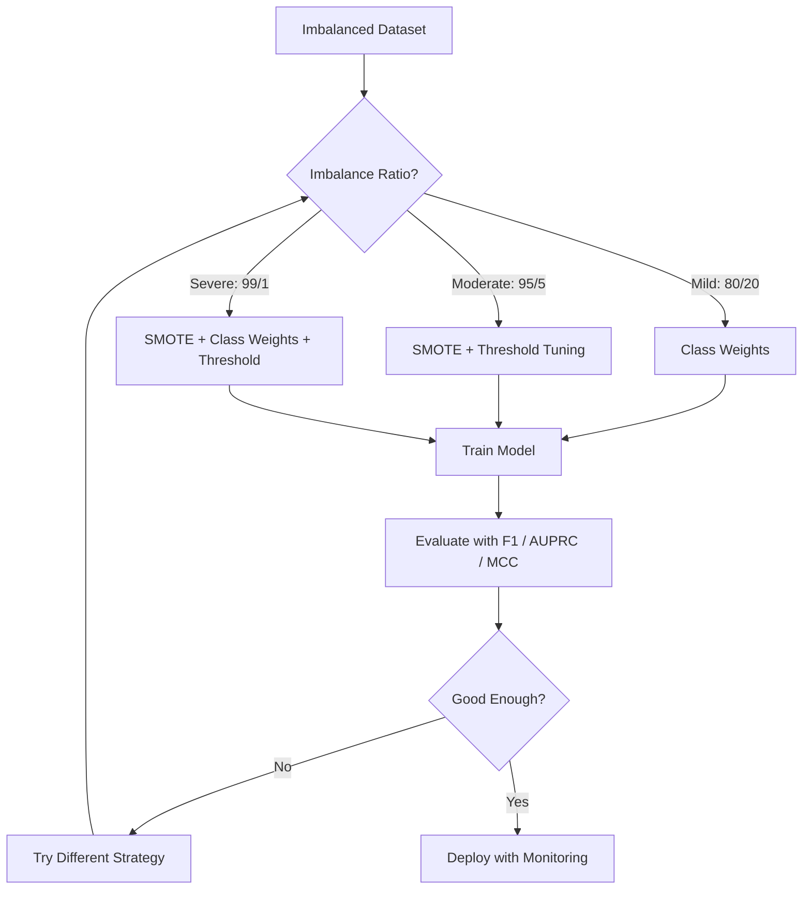
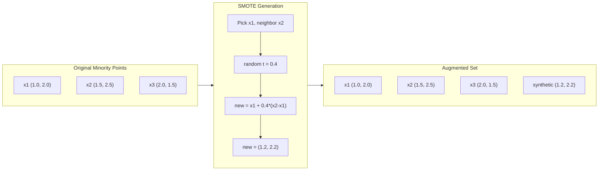
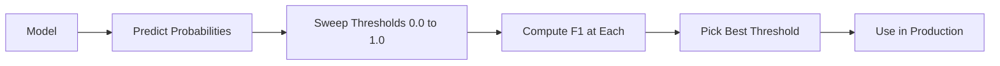
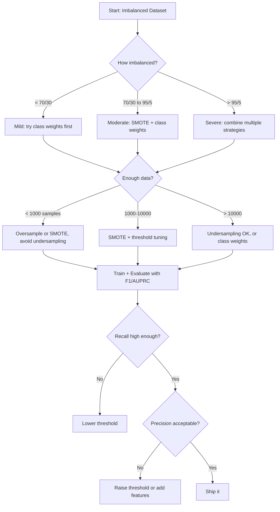

# Xử lý dữ liệu mất cân bằng

> Khi 99% dữ liệu của bạn là "bình thường", accuracy đó là một lời nói dối.

**Loại:** Xây dựng
**Ngôn ngữ:** Python
**Kiến thức tiên quyết:** Giai đoạn 2, Bài 01-09 (đặc biệt là các chỉ số đánh giá)
**Thời lượng:** ~90 phút

## Mục tiêu học tập

- Triển khai SMOTE từ đầu và giải thích lấy mẫu quá mức tổng hợp khác với sao chép ngẫu nhiên như thế nào
- Đánh giá các bộ phân loại mất cân bằng bằng cách sử dụng Hệ số tương quan F1, AUPRC và Matthews thay vì accuracy
- So sánh class trọng số, điều chỉnh ngưỡng và các chiến lược lấy mẫu lại và chọn cách tiếp cận phù hợp cho một tỷ lệ mất cân bằng nhất định
- Xây dựng một pipeline dữ liệu không cân bằng hoàn chỉnh kết hợp SMOTE, trọng số class và tối ưu hóa ngưỡng

## Vấn đề

Bạn xây dựng một model phát hiện gian lận. Nó nhận được 99.9% accuracy. Bạn ăn mừng. Sau đó, bạn nhận ra nó dự đoán "không gian lận" cho mọi giao dịch.

Đây không phải là lỗi. Đó là điều hợp lý để làm khi chỉ có 0,1% giao dịch là gian lận. Người model học được rằng luôn đoán số đông class giảm thiểu sai số tổng thể. Nó đúng về mặt kỹ thuật và hoàn toàn vô dụng.

Điều này xảy ra ở mọi nơi phân loại thực sự quan trọng. Chẩn đoán bệnh: tỷ lệ dương tính 1%. Xâm nhập mạng: 0,01% tấn công. Lỗi sản xuất: 0,5% lỗi. Lọc thư rác: 20% thư rác. Dự đoán rời bỏ: 5% người rời bỏ. class thiểu số càng có hậu quả thì càng hiếm.

Accuracy thất bại vì nó đối xử với tất cả các dự đoán chính xác như nhau. Gắn nhãn chính xác một giao dịch hợp pháp và phát hiện gian lận một cách chính xác đều được tính là một điểm trong accuracy. Nhưng bắt gian lận là toàn bộ lý do model tồn tại. Chúng ta cần các số liệu, kỹ thuật và chiến lược training buộc model phải trả attention cho những class hiếm hoi nhưng quan trọng.

## Khái niệm

### Tại sao Accuracy thất bại

Hãy xem xét một dataset có 1000 mẫu: 990 âm tính, 10 dương tính. Một model luôn dự đoán tiêu cực:

|| Dự đoán tích cực | Dự đoán tiêu cực |
| -- | --- | --- |
| Thực sự tích cực | 0 (TP) | 10 (FN) |
| Thực sự tiêu cực | 0 (FP) | 990 (TN) |

Accuracy = (0 + 990) / 1000 = 99.0%

model không bắt được gian lận. Không có bệnh tật. Không có khuyết tật. Nhưng accuracy nói 99%. Đây là lý do tại sao accuracy nguy hiểm đối với các vấn đề mất cân bằng.

### Số liệu tốt hơn

**Precision** = TP / (TP + FP). Trong số mọi thứ được gắn cờ là tích cực, thực sự có bao nhiêu? precision cao có nghĩa là ít báo động giả.

**Recall** = TP / (TP + FN). Trong tất cả mọi thứ thực sự tích cực, chúng tôi đã bắt được bao nhiêu? recall cao có nghĩa là ít bị bỏ lỡ dương tính.

**F1 Score** = 2 * precision * recall / (precision + recall). Giá trị trung bình hài. Hình phạt sự mất cân bằng cực độ giữa precision và recall nhiều hơn giá trị trung bình số học.

**Điểm F-beta** = (1 + beta^2) * precision * recall / (beta^2 * precision + recall). Khi beta > 1, recall quan trọng hơn. Khi beta < 1, precision quan trọng hơn. F2 phổ biến trong phát hiện gian lận (thiếu gian lận còn tệ hơn báo động giả).

**AUPRC** (Khu vực dưới đường cong Precision-Recall). Giống như AUC-ROC nhưng nhiều thông tin hơn cho dữ liệu không cân bằng. Một bộ phân loại ngẫu nhiên có AUPRC bằng tỷ lệ class dương (không phải 0,5 như ROC). Điều này làm cho các cải tiến dễ nhìn thấy hơn.

**Hệ số tương quan Matthews **= (TP * TN - FP * FN) / sqrt ((TP + FP) (TP + FN) (TN + FP) (TN + FN)). Phạm vi từ -1 đến +1. Chỉ cho điểm cao khi model làm tốt cả hai classes. Cân bằng ngay cả khi classes có kích thước rất khác nhau.

Đối với model "luôn dự đoán tiêu cực" ở trên: precision = 0/0 (không xác định, thường được đặt thành 0), recall = 0/10 = 0, F1 = 0, MCC = 0. Các số liệu này xác định chính xác model là vô giá trị.

### Dữ liệu mất cân bằng Pipeline



### SMOTE: Kỹ thuật lấy mẫu quá mức thiểu số tổng hợp

Lấy mẫu quá mức ngẫu nhiên trùng lặp các mẫu thiểu số hiện có. Điều này hiệu quả nhưng có nguy cơ overfitting vì model nhìn thấy các điểm giống hệt nhau nhiều lần.

SMOTE tạo ra các mẫu thiểu số tổng hợp mới hợp lý nhưng không phải là bản sao. Thuật toán:

1. Đối với mỗi mẫu thiểu số x, tìm k hàng xóm gần nhất của nó trong số các mẫu thiểu số khác
2. Chọn ngẫu nhiên một người hàng xóm
3. Tạo một mẫu mới trên đoạn đường giữa x và hàng xóm đó

Công thức: `new_sample = x + random(0, 1) * (neighbor - x)`

Điều này nội suy giữa các điểm thiểu số thực sự, tạo ra các mẫu trong cùng một vùng của không gian feature mà không chỉ sao chép dữ liệu hiện có.



### Sampling chiến lược được so sánh

**Lấy mẫu quá mức ngẫu nhiên**: trùng lặp các mẫu thiểu số để khớp với số lượng đa số.
- Ưu điểm: đơn giản, không có thông tin loss
- Nhược điểm: trùng lặp chính xác gây overfitting, tăng thời gian training

**Lấy mẫu ngẫu nhiên**: loại bỏ đa số samples để khớp với số lượng thiểu số.
- Ưu điểm: training nhanh, đơn giản
- Nhược điểm: vứt bỏ dữ liệu đa số có khả năng hữu ích, variance cao hơn

**SMOTE**: tạo mẫu thiểu số tổng hợp thông qua nội suy.
- Ưu điểm: tạo điểm dữ liệu mới, giảm overfitting so với lấy mẫu quá mức ngẫu nhiên
- Nhược điểm: có thể tạo ra các mẫu nhiễu gần ranh giới quyết định, không tính đến phân bố đa số class

| Chiến lược | Thay đổi dữ liệu | Rủi ro | Trường hợp sử dụng |
|----------|-------------|------|-------------|
| Lấy mẫu quá mức | Thiểu số trùng lặp | Overfitting | datasets nhỏ, mất cân bằng vừa phải |
| Mẫu dưới | Đa số bị xóa | Thông tin loss | datasets lớn, muốn training nhanh |
| ĐÁNH DẤU | Thiểu số tổng hợp được thêm vào | Nhiễu ranh giới | Mất cân bằng vừa phải, đủ mẫu thiểu số cho k-NN |

### Class Trọng lượng

Thay vì thay đổi dữ liệu, hãy thay đổi cách model xử lý lỗi. Gán trọng số cao hơn cho việc phân loại sai class thiểu số.

Đối với bài toán nhị phân với 950 mẫu âm tính và 50 mẫu dương tính:
- Trọng số cho class âm = n_samples / (2 * n_negative) = 1000 / (2 * 950) = 0,526
- Trọng số cho class dương = n_samples / (2 * n_positive) = 1000 / (2 * 50) = 10.0

Dương class có trọng lượng gấp 19 lần. Phân loại sai một mẫu dương tính tốn kém như phân loại sai 19 mẫu âm tính. model buộc phải trả attention cho class thiểu số.

Trong hồi quy logistic, điều này sửa đổi hàm loss:

```
weighted_loss = -sum(w_i * [y_i * log(p_i) + (1-y_i) * log(1-p_i)])
```

Trong đó w_i phụ thuộc vào class của mẫu i.

Trọng số Class tương đương về mặt toán học với việc lấy mẫu quá mức theo kỳ vọng, nhưng không tạo ra các điểm dữ liệu mới. Điều này làm cho chúng nhanh hơn và tránh nguy cơ overfitting của các mẫu trùng lặp.

### Điều chỉnh ngưỡng

Hầu hết các bộ phân loại đều xuất ra xác suất. Ngưỡng mặc định là 0,5: nếu P (dương) > = 0,5, dự đoán dương tính. Nhưng 0,5 là tùy ý. Khi classes bị mất cân bằng, ngưỡng tối ưu thường thấp hơn nhiều.

Các process:
1. Huấn luyện một model
2. Nhận xác suất dự đoán trên tập hợp xác thực
3. Ngưỡng quét từ 0,0 đến 1,0
4. Tính toán F1 (hoặc chỉ số bạn đã chọn) ở mỗi ngưỡng
5. Chọn ngưỡng tối đa hóa chỉ số của bạn



Một model có thể xuất ra P (gian lận) = 0,15 cho một giao dịch gian lận. Ở ngưỡng 0,5, điều này được phân loại là không gian lận. Ở ngưỡng 0,10, nó được bắt chính xác. Hiệu chỉnh xác suất ít quan trọng hơn xếp hạng - miễn là gian lận có xác suất cao hơn không gian lận, sẽ tồn tại một ngưỡng ngăn cách chúng.

### Học tập nhạy cảm về chi phí

Tổng quát hóa trọng lượng class. Thay vì chi phí thống nhất, hãy chỉ định chi phí phân loại sai cụ thể:

|| Dự đoán tích cực | Dự đoán tiêu cực |
| -- | --- | --- |
| Thực sự tích cực | 0 (đúng) | C_FN = 100 |
| Thực sự tiêu cực | C_FP = 1 | 0 (đúng) |

Bỏ lỡ một giao dịch gian lận (FN) có giá cao gấp 100 lần so với báo động giả (FP). model tối ưu hóa cho tổng chi phí, không phải tổng số lỗi.

Đây là cách tiếp cận nguyên tắc nhất khi bạn có thể ước tính chi phí trong thế giới thực. Chẩn đoán ung thư bị bỏ lỡ có chi phí rất khác so với báo động giả dẫn đến sinh thiết bổ sung. Làm cho những chi phí này trở nên rõ ràng buộc phải đánh đổi đúng đắn.

### Sơ đồ quyết định



```figure
class-imbalance
```

## Tự xây dựng

### Bước 1: Tạo dataset mất cân bằng

```python
import numpy as np


def make_imbalanced_data(n_majority=950, n_minority=50, seed=42):
    rng = np.random.RandomState(seed)

    X_maj = rng.randn(n_majority, 2) * 1.0 + np.array([0.0, 0.0])
    X_min = rng.randn(n_minority, 2) * 0.8 + np.array([2.5, 2.5])

    X = np.vstack([X_maj, X_min])
    y = np.concatenate([np.zeros(n_majority), np.ones(n_minority)])

    shuffle_idx = rng.permutation(len(y))
    return X[shuffle_idx], y[shuffle_idx]
```

### Bước 2: SMOTE từ đầu

```python
def euclidean_distance(a, b):
    return np.sqrt(np.sum((a - b) ** 2))


def find_k_neighbors(X, idx, k):
    distances = []
    for i in range(len(X)):
        if i == idx:
            continue
        d = euclidean_distance(X[idx], X[i])
        distances.append((i, d))
    distances.sort(key=lambda x: x[1])
    return [d[0] for d in distances[:k]]


def smote(X_minority, k=5, n_synthetic=100, seed=42):
    rng = np.random.RandomState(seed)
    n_samples = len(X_minority)
    k = min(k, n_samples - 1)
    synthetic = []

    for _ in range(n_synthetic):
        idx = rng.randint(0, n_samples)
        neighbors = find_k_neighbors(X_minority, idx, k)
        neighbor_idx = neighbors[rng.randint(0, len(neighbors))]
        t = rng.random()
        new_point = X_minority[idx] + t * (X_minority[neighbor_idx] - X_minority[idx])
        synthetic.append(new_point)

    return np.array(synthetic)
```

### Bước 3: Lấy mẫu quá mức và lấy mẫu thiếu ngẫu nhiên

```python
def random_oversample(X, y, seed=42):
    rng = np.random.RandomState(seed)
    classes, counts = np.unique(y, return_counts=True)
    max_count = counts.max()

    X_resampled = list(X)
    y_resampled = list(y)

    for cls, count in zip(classes, counts):
        if count < max_count:
            cls_indices = np.where(y == cls)[0]
            n_needed = max_count - count
            chosen = rng.choice(cls_indices, size=n_needed, replace=True)
            X_resampled.extend(X[chosen])
            y_resampled.extend(y[chosen])

    X_out = np.array(X_resampled)
    y_out = np.array(y_resampled)
    shuffle = rng.permutation(len(y_out))
    return X_out[shuffle], y_out[shuffle]


def random_undersample(X, y, seed=42):
    rng = np.random.RandomState(seed)
    classes, counts = np.unique(y, return_counts=True)
    min_count = counts.min()

    X_resampled = []
    y_resampled = []

    for cls in classes:
        cls_indices = np.where(y == cls)[0]
        chosen = rng.choice(cls_indices, size=min_count, replace=False)
        X_resampled.extend(X[chosen])
        y_resampled.extend(y[chosen])

    X_out = np.array(X_resampled)
    y_out = np.array(y_resampled)
    shuffle = rng.permutation(len(y_out))
    return X_out[shuffle], y_out[shuffle]
```

### Bước 4: Hồi quy logistic với trọng số class

```python
def sigmoid(z):
    return 1.0 / (1.0 + np.exp(-np.clip(z, -500, 500)))


def logistic_regression_weighted(X, y, weights, lr=0.01, epochs=200):
    n_samples, n_features = X.shape
    w = np.zeros(n_features)
    b = 0.0

    for _ in range(epochs):
        z = X @ w + b
        pred = sigmoid(z)
        error = pred - y
        weighted_error = error * weights

        gradient_w = (X.T @ weighted_error) / n_samples
        gradient_b = np.mean(weighted_error)

        w -= lr * gradient_w
        b -= lr * gradient_b

    return w, b


def compute_class_weights(y):
    classes, counts = np.unique(y, return_counts=True)
    n_samples = len(y)
    n_classes = len(classes)
    weight_map = {}
    for cls, count in zip(classes, counts):
        weight_map[cls] = n_samples / (n_classes * count)
    return np.array([weight_map[yi] for yi in y])
```

### Bước 5: Điều chỉnh ngưỡng

```python
def find_optimal_threshold(y_true, y_probs, metric="f1"):
    best_threshold = 0.5
    best_score = -1.0

    for threshold in np.arange(0.05, 0.96, 0.01):
        y_pred = (y_probs >= threshold).astype(int)
        tp = np.sum((y_pred == 1) & (y_true == 1))
        fp = np.sum((y_pred == 1) & (y_true == 0))
        fn = np.sum((y_pred == 0) & (y_true == 1))

        if metric == "f1":
            precision = tp / (tp + fp) if (tp + fp) > 0 else 0.0
            recall = tp / (tp + fn) if (tp + fn) > 0 else 0.0
            score = 2 * precision * recall / (precision + recall) if (precision + recall) > 0 else 0.0
        elif metric == "recall":
            score = tp / (tp + fn) if (tp + fn) > 0 else 0.0
        elif metric == "precision":
            score = tp / (tp + fp) if (tp + fp) > 0 else 0.0

        if score > best_score:
            best_score = score
            best_threshold = threshold

    return best_threshold, best_score
```

### Bước 6: Chức năng đánh giá

```python
def confusion_matrix_values(y_true, y_pred):
    tp = np.sum((y_pred == 1) & (y_true == 1))
    tn = np.sum((y_pred == 0) & (y_true == 0))
    fp = np.sum((y_pred == 1) & (y_true == 0))
    fn = np.sum((y_pred == 0) & (y_true == 1))
    return tp, tn, fp, fn


def compute_metrics(y_true, y_pred):
    tp, tn, fp, fn = confusion_matrix_values(y_true, y_pred)
    accuracy = (tp + tn) / (tp + tn + fp + fn)
    precision = tp / (tp + fp) if (tp + fp) > 0 else 0.0
    recall = tp / (tp + fn) if (tp + fn) > 0 else 0.0
    f1 = 2 * precision * recall / (precision + recall) if (precision + recall) > 0 else 0.0

    denom = np.sqrt(float((tp + fp) * (tp + fn) * (tn + fp) * (tn + fn)))
    mcc = (tp * tn - fp * fn) / denom if denom > 0 else 0.0

    return {
        "accuracy": accuracy,
        "precision": precision,
        "recall": recall,
        "f1": f1,
        "mcc": mcc,
    }
```

### Bước 7: So sánh tất cả các phương pháp

```python
X, y = make_imbalanced_data(950, 50, seed=42)
split = int(0.8 * len(y))
X_train, X_test = X[:split], X[split:]
y_train, y_test = y[:split], y[split:]

# Baseline: no treatment
w_base, b_base = logistic_regression_weighted(
    X_train, y_train, np.ones(len(y_train)), lr=0.1, epochs=300
)
probs_base = sigmoid(X_test @ w_base + b_base)
preds_base = (probs_base >= 0.5).astype(int)

# Oversampled
X_over, y_over = random_oversample(X_train, y_train)
w_over, b_over = logistic_regression_weighted(
    X_over, y_over, np.ones(len(y_over)), lr=0.1, epochs=300
)
preds_over = (sigmoid(X_test @ w_over + b_over) >= 0.5).astype(int)

# SMOTE
minority_mask = y_train == 1
X_minority = X_train[minority_mask]
synthetic = smote(X_minority, k=5, n_synthetic=len(y_train) - 2 * int(minority_mask.sum()))
X_smote = np.vstack([X_train, synthetic])
y_smote = np.concatenate([y_train, np.ones(len(synthetic))])
w_sm, b_sm = logistic_regression_weighted(
    X_smote, y_smote, np.ones(len(y_smote)), lr=0.1, epochs=300
)
preds_smote = (sigmoid(X_test @ w_sm + b_sm) >= 0.5).astype(int)

# Class weights
sample_weights = compute_class_weights(y_train)
w_cw, b_cw = logistic_regression_weighted(
    X_train, y_train, sample_weights, lr=0.1, epochs=300
)
probs_cw = sigmoid(X_test @ w_cw + b_cw)
preds_cw = (probs_cw >= 0.5).astype(int)

# Threshold tuning (tune on held-out validation set, not test set)
probs_val = sigmoid(X_val @ w_cw + b_cw)
best_thresh, best_f1 = find_optimal_threshold(y_val, probs_val, metric="f1")
preds_thresh = (probs_cw >= best_thresh).astype(int)
```

Tệp mã chạy tất cả những điều này trong một script duy nhất và in kết quả.

## Ứng dụng

Với scikit-learn và imbalanced-learn, các kỹ thuật này là một dòng:

```python
from sklearn.linear_model import LogisticRegression
from sklearn.metrics import classification_report, f1_score
from sklearn.model_selection import train_test_split
from imblearn.over_sampling import SMOTE
from imblearn.under_sampling import RandomUnderSampler
from imblearn.pipeline import Pipeline

X_train, X_test, y_train, y_test = train_test_split(X, y, stratify=y)

model_weighted = LogisticRegression(class_weight="balanced")
model_weighted.fit(X_train, y_train)
print(classification_report(y_test, model_weighted.predict(X_test)))

smote = SMOTE(random_state=42)
X_resampled, y_resampled = smote.fit_resample(X_train, y_train)
model_smote = LogisticRegression()
model_smote.fit(X_resampled, y_resampled)
print(classification_report(y_test, model_smote.predict(X_test)))

pipeline = Pipeline([
    ("smote", SMOTE()),
    ("model", LogisticRegression(class_weight="balanced")),
])
pipeline.fit(X_train, y_train)
print(classification_report(y_test, pipeline.predict(X_test)))
```

Các triển khai từ đầu cho thấy chính xác những gì mỗi kỹ thuật làm. SMOTE chỉ là nội suy k-NN trên class thiểu số. Class trọng lượng nhân loss. Điều chỉnh ngưỡng là một vòng lặp cho các điểm cắt. Không có phép thuật.

## Sản phẩm bàn giao

Bài học này tạo ra:
- `outputs/skill-imbalanced-data.md` -- danh sách kiểm tra quyết định để xử lý các vấn đề phân loại mất cân bằng

## Bài tập

1. **Borderline-SMOTE**: sửa đổi triển khai SMOTE để chỉ tạo mẫu tổng hợp cho các điểm thiểu số gần ranh giới quyết định (những điểm có hàng xóm gần nhất k bao gồm các mẫu đa số class). So sánh kết quả với SMOTE tiêu chuẩn trên dataset classes chồng chéo.

2. **Tối ưu hóa ma trận chi phí**: triển khai học nhạy cảm về chi phí trong đó ma trận chi phí là parameter. Tạo một hàm lấy ma trận chi phí và trả về các dự đoán tối ưu giúp giảm thiểu chi phí dự kiến. Thử nghiệm với các tỷ lệ chi phí khác nhau (1:10, 1:100, 1:1000) và vẽ biểu đồ sự cân bằng precision-recall thay đổi như thế nào.

3. **Hiệu chuẩn ngưỡng**: thực hiện tỷ lệ Platt (phù hợp với hồi quy logistic trên đầu ra thô của model để tạo ra xác suất đã hiệu chỉnh). So sánh đường cong precision-recall trước và sau khi hiệu chuẩn. Cho thấy rằng hiệu chuẩn không thay đổi thứ hạng (AUC vẫn giữ nguyên) nhưng làm cho xác suất có ý nghĩa hơn.

4. **Ensemble with balanced bagging**: huấn luyện nhiều models, mỗi  trên một mẫu bootstrap cân bằng (tất cả thiểu số + tập hợp con ngẫu nhiên của đa số). Tính trung bình dự đoán của họ. So sánh cách tiếp cận này với một model duy nhất với SMOTE. Đo lường cả hiệu suất và variance qua các lần chạy.

5. **Thí nghiệm tỷ lệ mất cân bằng**: lấy dataset cân bằng và tăng dần tỷ lệ mất cân bằng (50/50, 70/30, 90/10, 95/5, 99/1). Đối với mỗi tỷ lệ, hãy tập luyện có và không có SMOTE. Tỷ lệ biểu đồ F1 so với tỷ lệ mất cân bằng cho cả hai cách tiếp cận. SMOTE bắt đầu tạo ra sự khác biệt có ý nghĩa ở tỷ lệ nào?

## Thuật ngữ chính

| Thuật ngữ | Những gì mọi người nói | Ý nghĩa thực sự của nó |
|------|----------------|----------------------|
| Class imbalance | "Một class có nhiều mẫu hơn" | Sự phân bố classes trong dataset bị lệch đáng kể, khiến models ủng hộ đa số class |
| ĐÁNH DẤU | "Lấy mẫu tổng hợp" | Tạo các mẫu thiểu số mới bằng cách nội suy giữa các mẫu thiểu số hiện có và các mẫu thiểu số gần nhất của chúng |
| Class trọng lượng | "Mắc lỗi hiếm classes đắt hơn" | Nhân hàm loss với trọng số cụ thể của class để model phạt việc phân loại sai thiểu số nặng nề hơn |
| Điều chỉnh ngưỡng | "Di chuyển ranh giới quyết định" | Thay đổi giới hạn xác suất để phân loại từ 0,5 mặc định thành giá trị tối ưu hóa chỉ số mong muốn |
| Đánh đổi Precision-recall | "Bạn không thể có cả hai" | Giảm ngưỡng sẽ bắt được nhiều kết quả dương tính hơn (recall cao hơn) nhưng cũng đánh dấu nhiều dương tính giả hơn (precision thấp hơn) và ngược lại |
| AUPRC | "Khu vực dưới đường cong PR" | Tóm tắt đường cong precision-recall thành một số duy nhất; nhiều thông tin hơn AUC-ROC khi classes bị mất cân bằng nặng |
| Hệ số tương quan Matthews | "Số liệu cân bằng" | Mối tương quan giữa nhãn dự đoán và nhãn thực tế chỉ tạo ra điểm cao khi model hoạt động tốt trên cả hai classes |
| Học tập nhạy cảm về chi phí | "Những sai lầm khác nhau tốn kém số tiền khác nhau" | Kết hợp chi phí phân loại sai trong thế giới thực vào mục tiêu training để model tối ưu hóa tổng chi phí, không phải số lượng lỗi |
| Lấy mẫu ngẫu nhiên | "Nhân đôi thiểu số" | Lặp lại các mẫu class thiểu số để cân bằng số lượng class; Đơn giản nhưng rủi ro overfitting điểm trùng lặp |

## Đọc thêm

- [SMOTE: Synthetic Minority Over-sampling Technique (Chawla et al., 2002)](https://arxiv.org/abs/1106.1813) - bài báo gốc của SMOTE, vẫn là công trình được trích dẫn nhiều nhất về học tập mất cân bằng
- [Learning from Imbalanced Data (He & Garcia, 2009)](https://ieeexplore.ieee.org/document/5128907) - khảo sát toàn diện bao gồm các phương pháp tiếp cận sampling, nhạy cảm với chi phí và thuật toán
- [imbalanced-learn documentation](https://imbalanced-learn.org/stable/) -- Thư viện Python với các biến thể SMOTE, chiến lược lấy mẫu dưới và tích hợp pipeline
- [The Precision-Recall Plot Is More Informative than the ROC Plot (Saito & Rehmsmeier, 2015)](https://journals.plos.org/plosone/article?id=10.1371/journal.pone.0118432) - khi nào và tại sao nên thích đường cong PR hơn đường cong ROC cho các bài toán mất cân bằng
