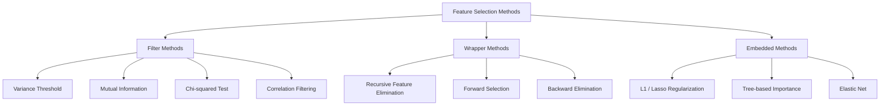
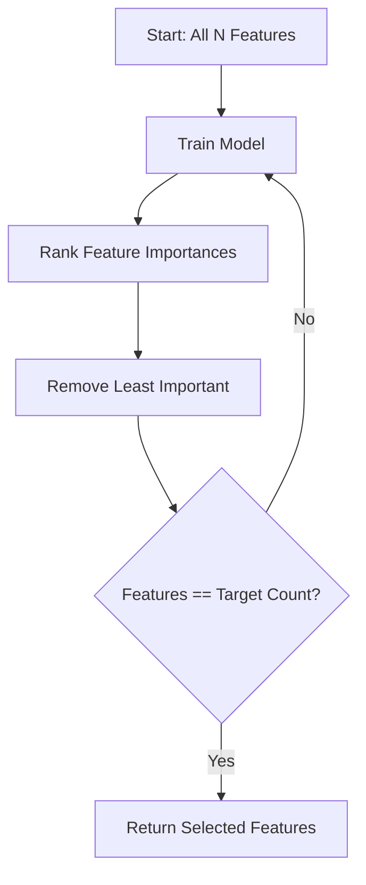
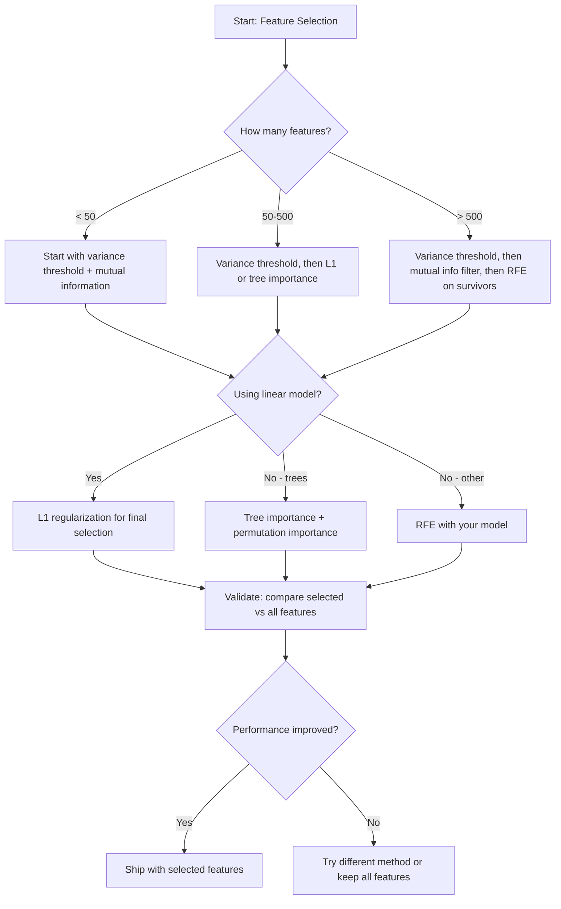

# Feature Lựa chọn

> Nhiều features hơn không tốt hơn. Đúng features là tốt hơn.

**Loại:** Xây dựng
**Ngôn ngữ:** Python
**Kiến thức tiên quyết:** Giai đoạn 2, Bài 01-09, 08 (feature engineering)
**Thời lượng:** ~75 phút

## Mục tiêu học tập

- Triển khai các phương pháp lọc (ngưỡng variance, thông tin lẫn nhau, chi bình phương) và phương pháp bao bọc (RFE, lựa chọn chuyển tiếp) từ đầu
- Giải thích lý do tại sao thông tin lẫn nhau nắm bắt các mối quan hệ phi tuyến feature-mục tiêu mà mối tương quan bỏ lỡ
- So sánh chính quy hóa L1 (lựa chọn nhúng) với RFE (lựa chọn trình bao bọc) và đánh giá sự đánh đổi tính toán của chúng
- Xây dựng một pipeline lựa chọn feature kết hợp nhiều phương pháp và chứng minh sự tổng quát được cải thiện trên dữ liệu bị giữ lại

## Vấn đề

Bạn có 500 features. model của bạn tập luyện chậm, quá khớp liên tục và không ai có thể giải thích những gì nó học được. Bạn thêm nhiều features với hy vọng cải thiện hiệu suất. Nó trở nên tồi tệ hơn.

Đây là lời nguyền của tính không gian trong hành động. Khi số lượng features tăng lên, volume của không gian feature bùng nổ. Các điểm dữ liệu trở nên thưa thớt. Khoảng cách giữa các điểm hội tụ. model cần nhiều dữ liệu hơn theo cấp số nhân để tìm ra các mẫu thực sự. Nhiễu features át đi features tín hiệu. Overfitting trở thành mặc định.

Feature lựa chọn là liều thuốc giải độc. Loại bỏ nhiễu. Loại bỏ sự dư thừa. Giữ features mang thông tin thực tế về mục tiêu. Kết quả: training nhanh hơn, khái quát hóa tốt hơn và models bạn thực sự có thể giải thích.

Mục tiêu không phải là sử dụng tất cả thông tin có sẵn. Đó là sử dụng đúng thông tin.

## Khái niệm

### Ba loại lựa chọn Feature

Mỗi phương pháp lựa chọn feature thuộc một trong ba loại:



**Phương pháp lọc** chấm điểm từng feature một cách độc lập bằng cách sử dụng thước đo thống kê. Họ không sử dụng model. Nhanh, nhưng họ bỏ lỡ các tương tác feature.

**Phương thức bao bọc** huấn luyện một model để đánh giá feature tập con. Họ sử dụng màn trình diễn model làm điểm số. Kết quả tốt hơn, nhưng tốn kém vì họ huấn luyện lại model nhiều lần.

**Phương thức nhúng** chọn features như một phần của model training. Chính quy hóa L1 đẩy trọng số về không. Cây quyết định chia theo features hữu ích nhất. Việc lựa chọn xảy ra trong quá trình lắp, không phải là một bước riêng biệt.

### Variance Ngưỡng

Bộ lọc đơn giản nhất. Nếu một feature hầu như không thay đổi giữa các mẫu, nó hầu như không mang thông tin.

Hãy xem xét một feature là 0.0 cho 999 trên 1000 mẫu. variance của nó gần bằng không. Không model nào có thể sử dụng nó để phân biệt giữa classes. Loại bỏ nó.

```
variance(x) = mean((x - mean(x))^2)
```

Đặt ngưỡng (ví dụ: 0,01). Thả mỗi feature với variance bên dưới nó. Điều này loại bỏ features không đổi hoặc gần như không đổi mà không cần nhìn vào biến đích.

Khi nào sử dụng nó: như một bước tiền xử lý trước các phương pháp khác. Nó bắt được những features vô dụng rõ ràng với chi phí gần như bằng không.

Hạn chế: một feature có thể có variance cao mà vẫn là nhiễu thuần túy. Variance ngưỡng là cần thiết nhưng không đủ.

### Thông tin lẫn nhau

Thông tin lẫn nhau đo lường mức độ biết giá trị của feature X làm giảm sự không chắc chắn về mục tiêu Y.

```
I(X; Y) = sum_x sum_y p(x, y) * log(p(x, y) / (p(x) * p(y)))
```

Nếu X và Y độc lập, p (x, y) = p (x) * p (y), vì vậy số hạng log là không và I (X; Y) = 0. X càng cho bạn biết nhiều về Y, thông tin lẫn nhau càng cao.

Ưu điểm chính so với tương quan: thông tin lẫn nhau nắm bắt các mối quan hệ phi tuyến. Một feature có thể không có mối tương quan với mục tiêu nhưng thông tin lẫn nhau cao vì mối quan hệ là bậc hai hoặc tuần hoàn.

Đối với features liên tục, trước tiên hãy rời rạc vào các thùng (ước tính dựa trên biểu đồ). Số lượng thùng ảnh hưởng đến ước tính - quá ít thùng làm mất thông tin, quá nhiều thùng thêm nhiễu. Một lựa chọn phổ biến: thùng sqrt(n) hoặc quy tắc Sturges (1 + log2(n)).


### Loại bỏ Feature đệ quy (RFE)

RFE là một phương pháp bao bọc. Nó sử dụng tầm quan trọng feature của riêng model để cắt tỉa lặp đi lặp lại:

1. Rèn luyện model với tất cả features
2. Xếp hạng features theo tầm quan trọng (hệ số cho models tuyến tính, giảm tạp chất cho cây)
3. Loại bỏ (các) feature ít quan trọng nhất
4. Lặp lại cho đến khi còn lại số features mong muốn



RFE xem xét các tương tác feature vì model thấy tất cả các features còn lại cùng nhau. Loại bỏ một feature làm thay đổi tầm quan trọng của những  khác. Điều này làm cho nó kỹ lưỡng hơn so với các phương pháp lọc.

Chi phí: bạn huấn luyện model N - thời gian mục tiêu. Với 500 features và mục tiêu là 10, đó là 490 lần chạy training. Đối với models đắt tiền, điều này là chậm. Bạn có thể tăng tốc bằng cách loại bỏ nhiều features mỗi bước (ví dụ: loại bỏ 10% dưới cùng mỗi vòng).

### Chính quy hóa L1 (Lasso)

Chính quy hóa L1 thêm giá trị tuyệt đối của trọng số vào hàm loss:

```
loss = prediction_error + alpha * sum(|w_i|)
```

Alpha parameter kiểm soát mức độ cắt tỉa tích cực của features. Alpha cao hơn có nghĩa là nhiều trọng số hơn về chính xác bằng không.

Tại sao chính xác là không? Hình phạt L1 tạo ra một vùng ràng buộc hình kim cương trong không gian trọng lượng. Giải pháp tối ưu có xu hướng hạ cánh ở một góc của viên kim cương này, nơi một hoặc nhiều trọng lượng bằng không. Chính quy hóa L2 (sườn núi) tạo ra một ràng buộc tròn trong đó trọng lượng co lại nhưng hiếm khi đạt đến không.

Điều này được nhúng feature lựa chọn: model học trong quá trình training features bỏ qua. Features có trọng lượng bằng không được loại bỏ một cách hiệu quả.

Ưu điểm: chạy training đơn, xử lý các features tương quan (chọn một và không các model khác), được tích hợp trong hầu hết các triển khai  tuyến tính.

Hạn chế: chỉ hoạt động cho models tuyến tính. Không thể nắm bắt tầm quan trọng feature phi tuyến tính.

### Tầm quan trọng của Feature dựa trên cây

Cây quyết định và quần thể của chúng (rừng ngẫu nhiên, gradient tăng cường) tự nhiên xếp hạng features. Mỗi lần phân tách đều làm giảm tạp chất (Gini hoặc entropy để phân loại, variance để hồi quy). Features tạo ra sự giảm tạp chất lớn hơn là quan trọng hơn.

Đối với một khu rừng ngẫu nhiên có cây T:

```
importance(feature_j) = (1/T) * sum over all trees of
    sum over all nodes splitting on feature_j of
        (n_samples * impurity_decrease)
```

Điều này cung cấp điểm quan trọng chuẩn hóa cho mỗi feature. Nó xử lý các mối quan hệ phi tuyến và feature tương tác tự động.

Thận trọng: tầm quan trọng dựa trên cây thiên về features có nhiều giá trị duy nhất (số lượng cao). Một cột ID ngẫu nhiên sẽ xuất hiện quan trọng vì nó phân tách hoàn hảo mọi mẫu. Sử dụng tầm quan trọng của hoán vị như một kiểm tra sự tỉnh táo.

### Tầm quan trọng của hoán vị

Một phương pháp bất khả tri model:

1. Huấn luyện model và ghi lại hiệu suất cơ bản trên dữ liệu xác thực
2. Đối với mỗi feature: xáo trộn các giá trị của nó một cách ngẫu nhiên, đo lường sự sụt giảm hiệu suất
3. Mức giảm càng lớn thì feature càng quan trọng

Nếu xáo trộn một feature không ảnh hưởng đến hiệu suất, model không phụ thuộc vào nó. Nếu hiệu suất sụp đổ, feature đó là rất quan trọng.

Tầm quan trọng hoán vị tránh số lượng bias tầm quan trọng dựa trên cây. Nhưng nó chậm: một đánh giá đầy đủ mỗi feature, lặp lại nhiều lần để ổn định.

### Bảng so sánh

| Phương pháp | Kiểu | Tốc độ | Phi tuyến tính | Tương tác Feature |
|--------|------|-------|-----------|---------------------|
| Ngưỡng Variance | Bộ lọc | Rất nhanh | Không | Không |
| Thông tin lẫn nhau | Bộ lọc | Nhanh chóng | Có | Không |
| Bộ lọc tương quan | Bộ lọc | Nhanh chóng | Không | Không |
| RFE | Bao bì | Chậm | Phụ thuộc vào model | Có |
| L1 / Lasso | Nhúng | Nhanh chóng | Không (tuyến tính) | Không |
| Tầm quan trọng của cây | Nhúng | Trung bình | Có | Có |
| Tầm quan trọng của hoán vị | Model bất khả tri | Chậm | Có | Có |

### Sơ đồ quyết định



## Tự xây dựng

### Bước 1: Tạo dữ liệu tổng hợp với cấu trúc feature đã biết

```python
import numpy as np


def make_feature_selection_data(n_samples=500, seed=42):
    rng = np.random.RandomState(seed)

    x1 = rng.randn(n_samples)
    x2 = rng.randn(n_samples)
    x3 = rng.randn(n_samples)
    x4 = x1 + 0.1 * rng.randn(n_samples)
    x5 = x2 + 0.1 * rng.randn(n_samples)

    informative = np.column_stack([x1, x2, x3, x4, x5])

    correlated = np.column_stack([
        x1 * 0.9 + 0.1 * rng.randn(n_samples),
        x2 * 0.8 + 0.2 * rng.randn(n_samples),
        x3 * 0.7 + 0.3 * rng.randn(n_samples),
        x1 * 0.5 + x2 * 0.5 + 0.1 * rng.randn(n_samples),
        x2 * 0.6 + x3 * 0.4 + 0.1 * rng.randn(n_samples),
    ])

    noise = rng.randn(n_samples, 10) * 0.5

    X = np.hstack([informative, correlated, noise])
    y = (2 * x1 - 1.5 * x2 + x3 + 0.5 * rng.randn(n_samples) > 0).astype(int)

    feature_names = (
        [f"info_{i}" for i in range(5)]
        + [f"corr_{i}" for i in range(5)]
        + [f"noise_{i}" for i in range(10)]
    )

    return X, y, feature_names
```

Chúng ta biết ground truth: features 0-4 là thông tin (cộng với 3 và 4 là bản sao tương quan của 0 và 1), features 5-9 tương quan với features thông tin features 10-19 là nhiễu thuần túy. Một phương pháp lựa chọn tốt nên xếp hạng 0-4 cao nhất và 10-19 thấp nhất.

### Bước 2: Variance ngưỡng

```python
def variance_threshold(X, threshold=0.01):
    variances = np.var(X, axis=0)
    mask = variances > threshold
    return mask, variances
```

### Bước 3: Thông tin lẫn nhau (rời rạc)

```python
def discretize(x, n_bins=10):
    min_val, max_val = x.min(), x.max()
    if max_val == min_val:
        return np.zeros_like(x, dtype=int)
    bin_edges = np.linspace(min_val, max_val, n_bins + 1)
    binned = np.digitize(x, bin_edges[1:-1])
    return binned


def mutual_information(X, y, n_bins=10):
    n_samples, n_features = X.shape
    mi_scores = np.zeros(n_features)

    y_vals, y_counts = np.unique(y, return_counts=True)
    p_y = y_counts / n_samples

    for f in range(n_features):
        x_binned = discretize(X[:, f], n_bins)
        x_vals, x_counts = np.unique(x_binned, return_counts=True)
        p_x = dict(zip(x_vals, x_counts / n_samples))

        mi = 0.0
        for xv in x_vals:
            for yi, yv in enumerate(y_vals):
                joint_mask = (x_binned == xv) & (y == yv)
                p_xy = np.sum(joint_mask) / n_samples
                if p_xy > 0:
                    mi += p_xy * np.log(p_xy / (p_x[xv] * p_y[yi]))
        mi_scores[f] = mi

    return mi_scores
```

### Bước 4: Loại bỏ Feature đệ quy

```python
def simple_logistic_importance(X, y, lr=0.1, epochs=100):
    n_samples, n_features = X.shape
    w = np.zeros(n_features)
    b = 0.0

    for _ in range(epochs):
        z = X @ w + b
        pred = 1.0 / (1.0 + np.exp(-np.clip(z, -500, 500)))
        error = pred - y
        w -= lr * (X.T @ error) / n_samples
        b -= lr * np.mean(error)

    return w, b


def rfe(X, y, n_features_to_select=5, lr=0.1, epochs=100):
    n_total = X.shape[1]
    remaining = list(range(n_total))
    rankings = np.ones(n_total, dtype=int)
    rank = n_total

    while len(remaining) > n_features_to_select:
        X_subset = X[:, remaining]
        w, _ = simple_logistic_importance(X_subset, y, lr, epochs)
        importances = np.abs(w)

        least_idx = np.argmin(importances)
        original_idx = remaining[least_idx]
        rankings[original_idx] = rank
        rank -= 1
        remaining.pop(least_idx)

    for idx in remaining:
        rankings[idx] = 1

    selected_mask = rankings == 1
    return selected_mask, rankings
```

### Bước 5: Lựa chọn feature L1

```python
def soft_threshold(w, alpha):
    return np.sign(w) * np.maximum(np.abs(w) - alpha, 0)


def l1_feature_selection(X, y, alpha=0.1, lr=0.01, epochs=500):
    n_samples, n_features = X.shape
    w = np.zeros(n_features)
    b = 0.0

    for _ in range(epochs):
        z = X @ w + b
        pred = 1.0 / (1.0 + np.exp(-np.clip(z, -500, 500)))
        error = pred - y

        gradient_w = (X.T @ error) / n_samples
        gradient_b = np.mean(error)

        w -= lr * gradient_w
        w = soft_threshold(w, lr * alpha)
        b -= lr * gradient_b

    selected_mask = np.abs(w) > 1e-6
    return selected_mask, w
```

### Bước 6: Tầm quan trọng dựa trên cây (cây quyết định đơn giản)

```python
def gini_impurity(y):
    if len(y) == 0:
        return 0.0
    classes, counts = np.unique(y, return_counts=True)
    probs = counts / len(y)
    return 1.0 - np.sum(probs ** 2)


def best_split(X, y, feature_idx):
    values = np.unique(X[:, feature_idx])
    if len(values) <= 1:
        return None, -1.0

    best_threshold = None
    best_gain = -1.0
    parent_gini = gini_impurity(y)
    n = len(y)

    for i in range(len(values) - 1):
        threshold = (values[i] + values[i + 1]) / 2.0
        left_mask = X[:, feature_idx] <= threshold
        right_mask = ~left_mask

        n_left = np.sum(left_mask)
        n_right = np.sum(right_mask)

        if n_left == 0 or n_right == 0:
            continue

        gain = parent_gini - (n_left / n) * gini_impurity(y[left_mask]) - (n_right / n) * gini_impurity(y[right_mask])

        if gain > best_gain:
            best_gain = gain
            best_threshold = threshold

    return best_threshold, best_gain


def tree_importance(X, y, n_trees=50, max_depth=5, seed=42):
    rng = np.random.RandomState(seed)
    n_samples, n_features = X.shape
    importances = np.zeros(n_features)

    for _ in range(n_trees):
        sample_idx = rng.choice(n_samples, size=n_samples, replace=True)
        feature_subset = rng.choice(n_features, size=max(1, int(np.sqrt(n_features))), replace=False)

        X_boot = X[sample_idx]
        y_boot = y[sample_idx]

        tree_imp = _build_tree_importance(X_boot, y_boot, feature_subset, max_depth)
        importances += tree_imp

    total = importances.sum()
    if total > 0:
        importances /= total

    return importances


def _build_tree_importance(X, y, feature_subset, max_depth, depth=0):
    n_features = X.shape[1]
    importances = np.zeros(n_features)

    if depth >= max_depth or len(np.unique(y)) <= 1 or len(y) < 4:
        return importances

    best_feature = None
    best_threshold = None
    best_gain = -1.0

    for f in feature_subset:
        threshold, gain = best_split(X, y, f)
        if gain > best_gain:
            best_gain = gain
            best_feature = f
            best_threshold = threshold

    if best_feature is None or best_gain <= 0:
        return importances

    importances[best_feature] += best_gain * len(y)

    left_mask = X[:, best_feature] <= best_threshold
    right_mask = ~left_mask

    importances += _build_tree_importance(X[left_mask], y[left_mask], feature_subset, max_depth, depth + 1)
    importances += _build_tree_importance(X[right_mask], y[right_mask], feature_subset, max_depth, depth + 1)

    return importances
```

### Bước 7: Chạy tất cả các phương thức và so sánh

Tệp mã chạy tất cả năm phương thức trên cùng một dataset tổng hợp và in một bảng so sánh cho biết mỗi phương thức chọn features nào.

## Ứng dụng

Với scikit-learn, lựa chọn feature được tích hợp vào pipeline:

```python
from sklearn.feature_selection import (
    VarianceThreshold,
    mutual_info_classif,
    RFE,
    SelectFromModel,
)
from sklearn.linear_model import Lasso, LogisticRegression
from sklearn.ensemble import RandomForestClassifier

vt = VarianceThreshold(threshold=0.01)
X_filtered = vt.fit_transform(X)

mi_scores = mutual_info_classif(X, y)
top_k = np.argsort(mi_scores)[-10:]

rfe_selector = RFE(LogisticRegression(), n_features_to_select=10)
rfe_selector.fit(X, y)
X_rfe = rfe_selector.transform(X)

lasso_selector = SelectFromModel(Lasso(alpha=0.01))
lasso_selector.fit(X, y)
X_lasso = lasso_selector.transform(X)

rf = RandomForestClassifier(n_estimators=100)
rf.fit(X, y)
importances = rf.feature_importances_
```

Các triển khai từ đầu cho thấy chính xác những gì xảy ra bên trong mỗi phương thức. Ngưỡng Variance chỉ là tính toán `var(X, axis=0)` và áp dụng mặt nạ. Thông tin lẫn nhau là đếm tần số chung và tần số cận biên trong một bảng dự phòng. RFE là một vòng lặp huấn luyện, xếp hạng và cắt tỉa. L1 được gradient descent với bước ngưỡng mềm. Tầm quan trọng của cây tích lũy giảm tạp chất qua các tách. Không có phép thuật - chỉ có số liệu thống kê và vòng lặp.

Các phiên bản sklearn bổ sung tính mạnh mẽ (ví dụ: mutual_info_classif sử dụng ước tính mật độ k-NN thay vì binning), tốc độ (triển khai C) và tích hợp pipeline.

## Sản phẩm bàn giao

Bài học này tạo ra:
- `outputs/skill-feature-selector.md` -- một cây quyết định tham khảo nhanh để chọn phương pháp lựa chọn feature phù hợp

## Bài tập

1. **Lựa chọn chuyển tiếp**: thực hiện ngược lại với RFE. Bắt đầu với features bằng không. Ở mỗi bước, hãy thêm feature giúp cải thiện hiệu suất model nhiều nhất. Dừng lại khi thêm features không còn hữu ích nữa. So sánh features đã chọn với kết quả RFE. Cái nào nhanh hơn? Cái nào cho kết quả tốt hơn?

2. **Lựa chọn độ ổn định**: chạy lựa chọn feature L1 50 lần, mỗi lần trên một mẫu phụ 80% ngẫu nhiên của dữ liệu, với các giá trị alpha hơi khác nhau. Đếm tần suất mỗi feature được chọn. Features được chọn trong > 80% số lần chạy là "ổn định". So sánh features ổn định với lựa chọn L1 chạy một lần. Cái nào đáng tin cậy hơn?

3. **Phát hiện đa đồng tuyến**: tính toán ma trận tương quan cho tất cả features. Thực hiện một hàm, với ngưỡng tương quan (ví dụ: 0,9), loại bỏ một feature khỏi mỗi cặp có tương quan cao (giữ một cặp có thông tin lẫn nhau cao hơn với đích). Kiểm tra trên dataset tổng hợp và xác minh rằng nó loại bỏ các features tương quan dư thừa.

4. **Feature lựa chọn pipeline**: ngưỡng variance chuỗi, bộ lọc thông tin lẫn nhau và RFE thành một pipeline duy nhất. Đầu tiên loại bỏ variance features gần bằng không, sau đó giữ lại 50% hàng đầu bằng thông tin lẫn nhau, sau đó chạy RFE trên những người sống sót. So sánh pipeline này với việc chạy RFE một mình trên tất cả các features. pipeline có nhanh hơn không? Nó có chính xác như nhau không?

5. **Tầm quan trọng của hoán vị từ đầu**: thực hiện tầm quan trọng của hoán vị. Đối với mỗi feature, xáo trộn các giá trị của nó 10 lần, đo mức giảm trung bình trong F1 score. So sánh xếp hạng với tầm quan trọng dựa trên cây. Tìm các trường hợp mà họ không đồng ý và giải thích lý do tại sao (gợi ý: tương quan features).

## Thuật ngữ chính

| Thuật ngữ | Những gì mọi người nói | Ý nghĩa thực sự của nó |
|------|----------------|----------------------|
| Phương pháp lọc | "Chấm điểm features một cách độc lập" | Một phương pháp lựa chọn feature xếp hạng features bằng cách sử dụng thước đo thống kê mà không cần training model, đánh giá từng feature một cách riêng biệt |
| Phương pháp bao bọc | "Sử dụng model để chọn features" | Một phương pháp lựa chọn feature đánh giá feature tập con bằng cách training một model và sử dụng hiệu suất của nó làm tiêu chí lựa chọn |
| Phương pháp nhúng | "model chọn features trong khi training" | Feature lựa chọn xảy ra như một phần của model lắp, chẳng hạn như chính quy hóa L1 đẩy trọng lượng về không |
| Thông tin lẫn nhau | "Một biến cho bạn biết bao nhiêu về một biến số khác" | Một thước đo về sự giảm độ không chắc chắn về Y với kiến thức về X, nắm bắt cả phụ thuộc tuyến tính và phi tuyến tính |
| Loại bỏ Feature đệ quy | "Huấn luyện, xếp hạng, cắt tỉa, lặp lại" | Phương thức bao bọc lặp lại huấn luyện một model, loại bỏ (các) feature ít quan trọng nhất và lặp lại cho đến khi đạt được số lượng mục tiêu |
| L1 / Chính quy hóa Lasso | "Hình phạt giết chết features" | Cộng tổng các giá trị trọng số tuyệt đối vào hàm loss, điều này khiến trọng số feature không quan trọng về chính xác bằng không |
| Ngưỡng Variance | "Loại bỏ features liên tục" | Loại bỏ features có variance trên các mẫu giảm xuống dưới một ngưỡng quy định, lọc ra features không có thông tin |
| Feature quan trọng | "features nào quan trọng nhất" | Điểm số cho biết mức độ đóng góp của mỗi feature vào model dự đoán, được tính từ mức tăng phân chia (cây) hoặc độ lớn hệ số (tuyến tính) |
| Tầm quan trọng của hoán vị | "Xáo trộn và đo lường thiệt hại" | Đánh giá tầm quan trọng của feature bằng cách xáo trộn ngẫu nhiên các giá trị của từng feature và đo lường kết quả giảm hiệu suất model |
| Lời nguyền của không gian | "Quá nhiều features, không đủ dữ liệu" | Hiện tượng cộng features làm tăng volume của không gian feature theo cấp số nhân, khiến dữ liệu thưa thớt và khoảng cách trở nên vô nghĩa |

## Đọc thêm

- [An Introduction to Variable and Feature Selection (Guyon & Elisseeff, 2003)](https://jmlr.org/papers/v3/guyon03a.html) - cuộc khảo sát cơ bản về các phương pháp lựa chọn feature, vẫn được tham khảo rộng rãi
- [scikit-learn Feature Selection Guide](https://scikit-learn.org/stable/modules/feature_selection.html) -- tài liệu tham khảo thực tế cho các phương thức lọc, trình bao bọc và nhúng với các ví dụ về mã
- [Stability Selection (Meinshausen & Buhlmann, 2010)](https://arxiv.org/abs/0809.2932) - kết hợp lấy mẫu phụ với lựa chọn feature để có kết quả mạnh mẽ, có thể tái tạo
- [Beware Default Random Forest Importances (Strobl et al., 2007)](https://bmcbioinformatics.biomedcentral.com/articles/10.1186/1471-2105-8-25) -- chứng minh số lượng bias trong tầm quan trọng dựa trên cây và đề xuất tầm quan trọng có điều kiện như một giải pháp thay thế
