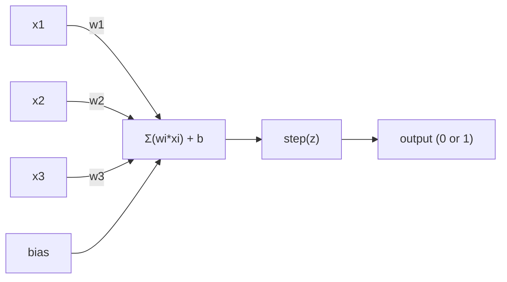
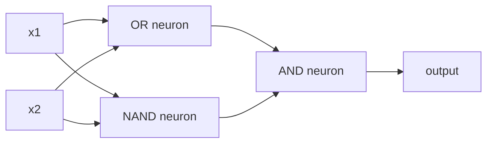

# The Perceptron

> Perceptron là nguyên tử của mạng nơ-ron. Chia nó ra và bạn tìm thấy trọng lượng, bias và quyết định.

**Loại:** Xây dựng
**Ngôn ngữ:** Python
**Kiến thức tiên quyết:** Giai đoạn 1 (Trực giác đại số tuyến tính)
**Thời lượng:** ~60 phút

## Mục tiêu học tập

- Triển khai perceptron từ đầu trong Python, bao gồm quy tắc cập nhật trọng lượng và chức năng kích hoạt bước
- Giải thích lý do tại sao một perceptron duy nhất chỉ có thể giải quyết các vấn đề có thể tách rời tuyến tính và chứng minh trường hợp lỗi XOR
- Xây dựng một perceptron nhiều lớp bằng cách soạn các cổng OR, NAND và AND để giải XOR
- Huấn luyện mạng hai lớp với kích hoạt sigmoid và backpropagation để học XOR tự động

## Vấn đề

Bạn biết sản phẩm vectors và chấm. Bạn biết rằng ma trận chuyển đổi đầu vào thành đầu ra. Nhưng làm thế nào để một cỗ máy * học được * chuyển đổi nào để sử dụng?

Perceptron trả lời điều này. Đó là cỗ máy học đơn giản nhất có thể: lấy một số đầu vào, nhân với trọng số, thêm bias và đưa ra quyết định nhị phân. Sau đó điều chỉnh. Đó là nó. Mọi mạng nơ-ron từng được xây dựng là các lớp của ý tưởng này xếp chồng lên nhau.

Hiểu perceptron có nghĩa là hiểu "học" thực sự có nghĩa là gì trong mã: điều chỉnh các con số cho đến khi đầu ra phù hợp với thực tế.

## Khái niệm

### Một tế bào thần kinh, một quyết định

Một perceptron nhận n đầu vào, nhân mỗi đầu vào với một trọng số, tổng hợp chúng, thêm một bias và chuyển kết quả thông qua một hàm kích hoạt.



Hàm bước rất tàn bạo: nếu tổng trọng số cộng với bias là > = 0, đầu ra 1. Nếu không, đầu ra 0.

```
step(z) = 1  if z >= 0
           0  if z < 0
```

Đây là một bộ phân loại tuyến tính. Trọng số và bias xác định một đường thẳng (hoặc siêu phẳng ở kích thước cao hơn) chia không gian đầu vào thành hai vùng.

### Ranh giới quyết định

Đối với hai đầu vào, perceptron vẽ một đường thẳng qua không gian 2D:

```
  x2
  ┤
  │  Class 1        /
  │    (0)          /
  │                /
  │               / w1·x1 + w2·x2 + b = 0
  │              /
  │             /     Class 2
  │            /        (1)
  ┼───────────/──────────── x1
```

Mọi thứ ở một bên của dòng đều xuất ra 0. Mọi thứ ở phía bên kia đều xuất ra 1. Training di chuyển đường này cho đến khi nó tách chính xác classes.

### Quy tắc học tập

Quy tắc học perceptron rất đơn giản:

```
For each training example (x, y_true):
    y_pred = predict(x)
    error = y_true - y_pred

    For each weight:
        w_i = w_i + learning_rate * error * x_i
    bias = bias + learning_rate * error
```

Nếu dự đoán đúng, sai số = 0, không có gì thay đổi. Nếu nó dự đoán 0 nhưng phải là 1, trọng số sẽ tăng lên. Nếu nó dự đoán 1 nhưng phải là 0, trọng số sẽ giảm. learning rate kiểm soát mức độ lớn của mỗi điều chỉnh.

### Vấn đề XOR

Đây là nơi nó gặp lỗi. Hãy nhìn vào các cổng logic này:

```
AND gate:           OR gate:            XOR gate:
x1  x2  out         x1  x2  out         x1  x2  out
0   0   0           0   0   0           0   0   0
0   1   0           0   1   1           0   1   1
1   0   0           1   0   1           1   0   1
1   1   1           1   1   1           1   1   0
```

AND và OR có thể tách rời tuyến tính: bạn có thể vẽ một đường duy nhất để phân tách các số 0 với số 1. XOR thì không. Không có dòng nào có thể tách [0,1] và [1,0] khỏi [0,0] và [1,1].

```
AND (separable):        XOR (not separable):

  x2                      x2
  1 ┤  0     1            1 ┤  1     0
    │     /                 │
  0 ┤  0 / 0              0 ┤  0     1
    ┼──/──────── x1         ┼──────────── x1
       line works!          no single line works!
```

Đây là một giới hạn cơ bản. Một perceptron duy nhất chỉ có thể giải quyết các vấn đề có thể tách rời tuyến tính. Minsky và Papert đã chứng minh điều này vào năm 1969 và nó gần như giết chết nghiên cứu mạng nơ-ron trong một thập kỷ.

Cách khắc phục: stack perceptron thành các lớp. Một perceptron nhiều lớp có thể giải XOR bằng cách kết hợp hai quyết định tuyến tính thành một quyết định phi tuyến.

```figure
perceptron-boundary
```

## Tự xây dựng

### Bước 1: Máy class Perceptron

```python
class Perceptron:
    def __init__(self, n_inputs, learning_rate=0.1):
        self.weights = [0.0] * n_inputs
        self.bias = 0.0
        self.lr = learning_rate

    def predict(self, inputs):
        total = sum(w * x for w, x in zip(self.weights, inputs))
        total += self.bias
        return 1 if total >= 0 else 0

    def train(self, training_data, epochs=100):
        for epoch in range(epochs):
            errors = 0
            for inputs, target in training_data:
                prediction = self.predict(inputs)
                error = target - prediction
                if error != 0:
                    errors += 1
                    for i in range(len(self.weights)):
                        self.weights[i] += self.lr * error * inputs[i]
                    self.bias += self.lr * error
            if errors == 0:
                print(f"Converged at epoch {epoch + 1}")
                return
        print(f"Did not converge after {epochs} epochs")
```

### Bước 2: Huấn luyện trên cổng logic

```python
and_data = [
    ([0, 0], 0),
    ([0, 1], 0),
    ([1, 0], 0),
    ([1, 1], 1),
]

or_data = [
    ([0, 0], 0),
    ([0, 1], 1),
    ([1, 0], 1),
    ([1, 1], 1),
]

not_data = [
    ([0], 1),
    ([1], 0),
]

print("=== AND Gate ===")
p_and = Perceptron(2)
p_and.train(and_data)
for inputs, _ in and_data:
    print(f"  {inputs} -> {p_and.predict(inputs)}")

print("\n=== OR Gate ===")
p_or = Perceptron(2)
p_or.train(or_data)
for inputs, _ in or_data:
    print(f"  {inputs} -> {p_or.predict(inputs)}")

print("\n=== NOT Gate ===")
p_not = Perceptron(1)
p_not.train(not_data)
for inputs, _ in not_data:
    print(f"  {inputs} -> {p_not.predict(inputs)}")
```

### Bước 3: Xem XOR không thành công

```python
xor_data = [
    ([0, 0], 0),
    ([0, 1], 1),
    ([1, 0], 1),
    ([1, 1], 0),
]

print("\n=== XOR Gate (single perceptron) ===")
p_xor = Perceptron(2)
p_xor.train(xor_data, epochs=1000)
for inputs, expected in xor_data:
    result = p_xor.predict(inputs)
    status = "OK" if result == expected else "WRONG"
    print(f"  {inputs} -> {result} (expected {expected}) {status}")
```

Nó sẽ không bao giờ hội tụ. Đây là bằng chứng chắc chắn rằng một perceptron duy nhất không thể học XOR.

### Bước 4: Giải XOR với hai layer

Thủ thuật: XOR = (x1 HOẶC x2) VÀ KHÔNG (x1 VÀ x2). Kết hợp ba perceptron:



```python
def xor_network(x1, x2):
    or_neuron = Perceptron(2)
    or_neuron.weights = [1.0, 1.0]
    or_neuron.bias = -0.5

    nand_neuron = Perceptron(2)
    nand_neuron.weights = [-1.0, -1.0]
    nand_neuron.bias = 1.5

    and_neuron = Perceptron(2)
    and_neuron.weights = [1.0, 1.0]
    and_neuron.bias = -1.5

    hidden1 = or_neuron.predict([x1, x2])
    hidden2 = nand_neuron.predict([x1, x2])
    output = and_neuron.predict([hidden1, hidden2])
    return output


print("\n=== XOR Gate (multi-layer network) ===")
for inputs, expected in xor_data:
    result = xor_network(inputs[0], inputs[1])
    print(f"  {inputs} -> {result} (expected {expected})")
```

Cả bốn trường hợp đều đúng. Xếp chồng perceptron thành các lớp tạo ra ranh giới quyết định mà không một perceptron nào có thể tạo ra.

### Bước 5: Huấn luyện mạng hai lớp

Bước 4 nối dây bằng tay các quả tạ. Điều đó hiệu quả với XOR, nhưng không phải đối với các vấn đề thực tế mà bạn không biết trước trọng lượng phù hợp. Cách khắc phục: thay thế hàm bước bằng sigmoid và tự động học trọng số thông qua backpropagation.

```python
class TwoLayerNetwork:
    def __init__(self, learning_rate=0.5):
        import random
        random.seed(0)
        self.w_hidden = [[random.uniform(-1, 1), random.uniform(-1, 1)] for _ in range(2)]
        self.b_hidden = [random.uniform(-1, 1), random.uniform(-1, 1)]
        self.w_output = [random.uniform(-1, 1), random.uniform(-1, 1)]
        self.b_output = random.uniform(-1, 1)
        self.lr = learning_rate

    def sigmoid(self, x):
        import math
        x = max(-500, min(500, x))
        return 1.0 / (1.0 + math.exp(-x))

    def forward(self, inputs):
        self.inputs = inputs
        self.hidden_outputs = []
        for i in range(2):
            z = sum(w * x for w, x in zip(self.w_hidden[i], inputs)) + self.b_hidden[i]
            self.hidden_outputs.append(self.sigmoid(z))
        z_out = sum(w * h for w, h in zip(self.w_output, self.hidden_outputs)) + self.b_output
        self.output = self.sigmoid(z_out)
        return self.output

    def train(self, training_data, epochs=10000):
        for epoch in range(epochs):
            total_error = 0
            for inputs, target in training_data:
                output = self.forward(inputs)
                error = target - output
                total_error += error ** 2

                d_output = error * output * (1 - output)

                saved_w_output = self.w_output[:]
                hidden_deltas = []
                for i in range(2):
                    h = self.hidden_outputs[i]
                    hd = d_output * saved_w_output[i] * h * (1 - h)
                    hidden_deltas.append(hd)

                for i in range(2):
                    self.w_output[i] += self.lr * d_output * self.hidden_outputs[i]
                self.b_output += self.lr * d_output

                for i in range(2):
                    for j in range(len(inputs)):
                        self.w_hidden[i][j] += self.lr * hidden_deltas[i] * inputs[j]
                    self.b_hidden[i] += self.lr * hidden_deltas[i]
```

```python
net = TwoLayerNetwork(learning_rate=2.0)
net.train(xor_data, epochs=10000)
for inputs, expected in xor_data:
    result = net.forward(inputs)
    predicted = 1 if result >= 0.5 else 0
    print(f"  {inputs} -> {result:.4f} (rounded: {predicted}, expected {expected})")
```

Hai điểm khác biệt chính so với Bước 4. Đầu tiên, sigmoid thay thế hàm step - nó trơn tru, vì vậy gradients tồn tại. Thứ hai, phương thức `train` truyền lỗi ngược từ đầu ra sang lớp ẩn, điều chỉnh mọi trọng số tỷ lệ thuận với sự đóng góp của nó vào lỗi. Đó là backpropagation trong 20 dòng.

Đây là cầu nối đến Bài học 03. Phép toán đằng sau `d_output` và `hidden_deltas` là quy tắc chuỗi áp dụng cho đồ thị mạng. Chúng ta sẽ rút ra nó một cách chính xác ở đó.

## Ứng dụng

Mọi thứ bạn vừa xây dựng từ đầu đều tồn tại trong một import:

```python
from sklearn.linear_model import Perceptron as SkPerceptron
import numpy as np

X = np.array([[0,0],[0,1],[1,0],[1,1]])
y = np.array([0, 0, 0, 1])

clf = SkPerceptron(max_iter=100, tol=1e-3)
clf.fit(X, y)
print([clf.predict([x])[0] for x in X])
```

Năm dòng. `Perceptron` class 30 dòng của bạn cũng làm điều tương tự. Phiên bản sklearn bổ sung kiểm tra hội tụ, nhiều hàm loss và hỗ trợ đầu vào thưa thớt -- nhưng vòng lặp cốt lõi giống hệt nhau: tổng trọng số, hàm bước, cập nhật trọng số khi có lỗi.

Khoảng cách thực sự thể hiện trên quy mô lớn. Những thay đổi nào trong mạng production:

- Chức năng bước trở thành sigmoid, ReLU hoặc các kích hoạt trơn tru khác
- Trọng số được học tự động qua backpropagation (Bài 03)
- Các lớp trở nên sâu hơn: 3, 10, 100+ lớp
- Nguyên tắc tương tự cũng được áp dụng: mỗi lớp tạo ra các features mới từ đầu ra của lớp trước đó

Một perceptron duy nhất chỉ có thể vẽ các đường thẳng. Stack chúng và bạn có thể vẽ bất kỳ hình dạng nào.

## Sản phẩm bàn giao

Bài học này tạo ra:
- `outputs/skill-perceptron.md` - một skill bao gồm khi cần kiến trúc một lớp so với nhiều lớp

## Bài tập

1. Huấn luyện một perceptron trên cổng NAND (cổng vạn năng - bất kỳ mạch logic nào cũng có thể được xây dựng từ NAND). Xác minh trọng số của nó và bias tạo thành ranh giới quyết định hợp lệ.
2. Sửa đổi class Perceptron để theo dõi ranh giới quyết định (w1 * x1 + w2 * x2 + b = 0) tại mỗi epoch. In cách đường dịch chuyển trong quá trình training trên cổng AND.
3. Xây dựng một perceptron 3 đầu vào chỉ xuất ra 1 khi ít nhất 2 trong số 3 đầu vào là 1 (hàm bỏ phiếu đa số). Điều này có thể tách rời tuyến tính không? Tại sao?

## Thuật ngữ chính

| Thuật ngữ | Những gì mọi người nói | Ý nghĩa thực sự của nó |
|------|----------------|----------------------|
| Perceptron | "Một tế bào thần kinh giả" | Bộ phân loại tuyến tính: tích chấm của đầu vào và trọng số, cộng với bias, thông qua hàm bước |
| Trọng lượng | "Đầu vào quan trọng như thế nào" | Hệ số nhân chia tỷ lệ đóng góp của mỗi đầu vào vào quyết định |
| Bias | "Ngưỡng cửa" | Một hằng số thay đổi ranh giới quyết định, cho phép perceptron kích hoạt ngay cả khi không có đầu vào |
| Chức năng kích hoạt | "Thứ bóp nghẹt giá trị" | Một hàm được áp dụng sau hàm tổng trọng số - bước cho perceptron sigmoid/ReLU cho các mạng hiện đại |
| Tuyến tính có thể tách rời | "Bạn có thể vẽ một ranh giới giữa chúng" | Một dataset mà một siêu mặt phẳng duy nhất có thể tách biệt hoàn hảo classes |
| Vấn đề XOR | "Điều mà triceptron không thể làm được" | Bằng chứng cho thấy mạng một lớp không thể học các hàm phân tách phi tuyến tính |
| Ranh giới quyết định | "Nơi bộ phân loại chuyển đổi" | Siêu mặt phẳng w * x + b = 0 chia không gian đầu vào thành hai classes |
| Perceptron nhiều lớp | "Một mạng nơ-ron thực sự" | Perceptron xếp chồng lên nhau trong các lớp, trong đó đầu ra của mỗi lớp cung cấp đầu vào của lớp tiếp theo |

## Đọc thêm

- Frank Rosenblatt, "The Perceptron: A Probabilistic Model for Information Storage and Organization in the Brain" (1958) - bài báo gốc bắt đầu tất cả
- Minsky & Papert, "Perceptrons" (1969) – cuốn sách chứng minh XOR không thể giải quyết được bởi các mạng một lớp và giết chết nghiên cứu perceptron trong một thập kỷ
- Michael Nielsen, "Mạng nơ-ron và học sâu", Chương 1 (http://neuralnetworksanddeeplearning.com/) - trực tuyến miễn phí, giải thích trực quan tốt nhất về cách các perceptron kết hợp thành mạng
