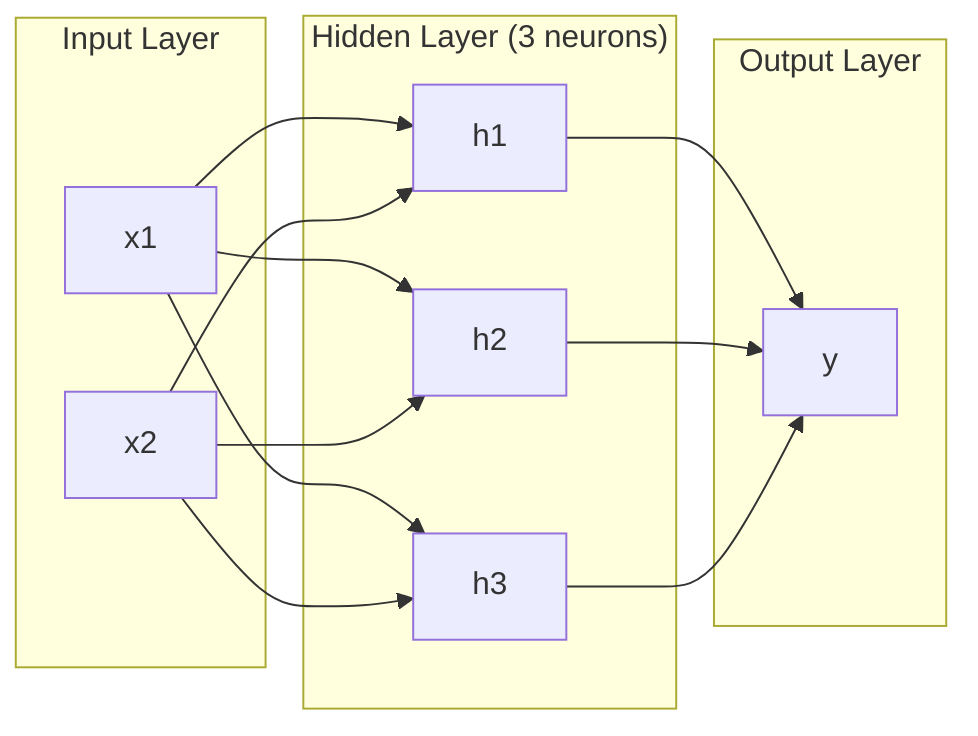
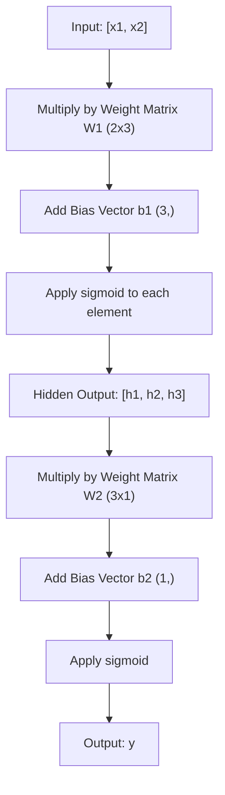
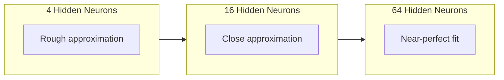

# Mạng và Forward Pass nhiều lớp

> Một tế bào thần kinh vẽ một đường thẳng. Stack chúng, và bạn có thể vẽ bất cứ thứ gì.

**Loại:** Xây dựng
**Ngôn ngữ:** Python
**Kiến thức tiên quyết:** Giai đoạn 01 (Nền tảng Toán học), Bài 03.01 (The Perceptron)
**Thời lượng:** ~90 phút

## Mục tiêu học tập

- Xây dựng mạng nhiều lớp từ đầu với Layer và Network classes thực hiện một forward pass hoàn chỉnh
- Trace kích thước ma trận qua từng lớp của mạng và xác định hình dạng không khớp
- Giải thích cách xếp chồng kích hoạt phi tuyến cho phép mạng tìm hiểu ranh giới quyết định cong
- Giải quyết vấn đề XOR bằng kiến trúc 2-2-1 với trọng số sigmoid được điều chỉnh bằng tay

## Vấn đề

Một tế bào thần kinh đơn lẻ là một ngăn kéo dòng. Đó là nó. Một đường thẳng xuyên qua dữ liệu của bạn. Mọi vấn đề thực sự trong AI - nhận dạng hình ảnh, hiểu ngôn ngữ, chơi cờ vây - đều đòi hỏi các đường cong. Xếp các tế bào thần kinh thành các lớp là cách bạn có được các đường cong.

Năm 1969, Minsky và Papert đã chứng minh hạn chế này là chết người: một mạng một lớp không thể học XOR. Không phải "đấu tranh để học" - về mặt toán học không thể. Bảng sự thật XOR đặt [0,1] và [1,0] ở một bên, [0,0] và [1,1] ở bên kia. Không có một đường nào ngăn cách chúng.

Điều này đã giết chết nguồn tài trợ của mạng nơ-ron trong hơn một thập kỷ. Cách khắc phục là rõ ràng khi nhìn lại: ngừng sử dụng một lớp. Stack tế bào thần kinh thành các lớp. Hãy để lớp đầu tiên khắc không gian đầu vào thành features mới và để lớp thứ hai kết hợp những features đó thành các quyết định mà không một dòng nào có thể thực hiện.

stack đó là mạng nhiều lớp. Nó là nền tảng của mọi model deep learning ở production ngày nay. forward pass - dữ liệu chảy từ đầu vào qua các lớp ẩn đến đầu ra - là điều đầu tiên bạn cần xây dựng trước khi bất kỳ thứ gì khác hoạt động.

## Khái niệm

### Lớp: Đầu vào, Ẩn, Đầu ra

Mạng nhiều lớp có ba loại lớp:

**Lớp đầu vào** -- không thực sự là một lớp. Nó chứa dữ liệu thô của bạn. Hai features có nghĩa là hai nút đầu vào. Không có tính toán nào xảy ra ở đây.

**Lớp ẩn** -- nơi công việc diễn ra. Mỗi tế bào thần kinh lấy mọi đầu ra từ lớp trước, áp dụng trọng số và bias, sau đó chuyển kết quả thông qua một hàm kích hoạt. "Ẩn" vì bạn không bao giờ nhìn thấy các giá trị này trực tiếp trong dữ liệu training.

**Lớp đầu ra** -- câu trả lời cuối cùng. Đối với phân loại nhị phân, một tế bào thần kinh với sigmoid. Đối với nhiều class, một tế bào thần kinh trên mỗi class.



Đây là mạng 2-3-1. Hai đầu vào, ba tế bào thần kinh ẩn, một đầu ra. Mỗi kết nối đều mang một trọng lượng. Mỗi tế bào thần kinh (ngoại trừ đầu vào) mang một bias.

Mỗi lớp tạo ra một vector số được gọi là trạng thái ẩn. Đối với văn bản, trạng thái ẩn làm tăng chiều - mã hóa một từ dưới dạng 768 số để nắm bắt ý nghĩa ngữ nghĩa. Đối với hình ảnh, chúng giảm chiều - nén hàng triệu pixel thành một biểu diễn có thể quản lý được. Trạng thái ẩn là nơi học tập tồn tại.

### Tế bào thần kinh và kích hoạt

Mỗi tế bào thần kinh thực hiện ba việc:

1. Nhân mọi đầu vào với trọng số tương ứng của nó
2. Tổng tất cả các sản phẩm và thêm một bias
3. Chuyển tổng thông qua một hàm kích hoạt

Hiện tại, kích hoạt là sigmoid:

```
sigmoid(z) = 1 / (1 + e^(-z))
```

Sigmoid đè bẹp bất kỳ số nào vào phạm vi (0, 1). Đầu vào tích cực lớn đẩy về phía 1. Đầu vào âm lớn đẩy về 0. Không ánh xạ thành 0,5. Đường cong mượt mà này là thứ làm cho việc học có thể thực hiện được - không giống như bước khó của perceptron, sigmoid có gradient ở khắp mọi nơi.

### Forward Pass: Cách dữ liệu chảy

forward pass đẩy dữ liệu đầu vào qua mạng, từng lớp một, cho đến khi nó đạt đến đầu ra. Không có việc học nào xảy ra trong forward pass. Đó là tính toán thuần túy: nhân, cộng, kích hoạt, lặp lại.



Ở mỗi lớp, ba hoạt động xảy ra theo trình tự:

```
z = W * input + b       (linear transformation)
a = sigmoid(z)           (activation)
```

Đầu ra của một lớp trở thành đầu vào cho lớp tiếp theo. Đó là toàn bộ forward pass.

### Kích thước ma trận

Theo dõi thứ nguyên là skill gỡ lỗi quan trọng nhất trong deep learning. Đây là mạng 2-3-1:

| Bước | hoạt động | Kích thước | Hình dạng kết quả |
|------|-----------|------------|-------------|
| Đầu vào | x | -- | (2,) |
| Tuyến tính ẩn | W1 * x + b1 | W1: (3, 2), b1: (3,) | (3,) |
| Kích hoạt ẩn | sigmoid(Z1) | -- | (3,) |
| Đầu ra tuyến tính | W2 * h + b2 | W2: (1, 3), b2: (1,) | (1,) |
| Kích hoạt đầu ra | sigmoid(Z2) | -- | (1,) |

Quy tắc: ma trận trọng lượng W ở lớp k có hình dạng (neurons_in_layer_k, neurons_in_layer_k_minus_1). Các hàng khớp với lớp hiện tại. Các cột khớp với layer trước đó. Nếu các hình dạng không thẳng hàng, bạn có lỗi.

### Định lý xấp xỉ phổ quát

Năm 1989, George Cybenko đã chứng minh một điều đáng chú ý: một mạng lưới thần kinh với một lớp ẩn duy nhất và đủ tế bào thần kinh có thể xấp xỉ bất kỳ chức năng liên tục nào với bất kỳ accuracy mong muốn nào.

Điều này không có nghĩa là một lớp ẩn luôn là tốt nhất. Nó có nghĩa là kiến trúc có khả năng về mặt lý thuyết. Trong thực tế, các mạng sâu hơn (nhiều lớp hơn, ít tế bào thần kinh hơn mỗi lớp) học các chức năng tương tự với tổng parameters ít hơn nhiều so với các mạng rộng nông. Đó là lý do tại sao deep learning hoạt động.

Trực giác: mỗi tế bào thần kinh trong lớp ẩn học một "vết sưng" hoặc feature. Đủ các vết sưng được đặt ở đúng vị trí có thể xấp xỉ bất kỳ đường cong mượt mà nào. Nhiều tế bào thần kinh hơn, nhiều vết sưng hơn, xấp xỉ tốt hơn.



### Khả năng kết hợp

Mạng nơ-ron có thể kết hợp. Bạn có thể stack chúng, xâu chuỗi chúng, chạy song song. Whisper model sử dụng mạng encoder để process âm thanh và mạng decoder riêng biệt để tạo văn bản. Các LLMs hiện đại chỉ dành cho decoder. BERT chỉ dành cho encoder. T5 là encoder-decoder. Lựa chọn kiến trúc xác định những gì model có thể làm.

```figure
mlp-forward
```

## Tự xây dựng

Tinh khiết Python. Không numpy. Mọi hoạt động ma trận được viết từ đầu.

### Bước 1: Kích hoạt Sigmoid

```python
import math

def sigmoid(x):
    x = max(-500.0, min(500.0, x))
    return 1.0 / (1.0 + math.exp(-x))
```

Kẹp đến [-500, 500] ngăn tràn. `math.exp(500)` lớn nhưng hữu hạn. `math.exp(1000)` là vô cực.

### Bước 2: Lớp Class

Hoạt động quan trọng nhất trong tất cả các deep learning là phép nhân ma trận. Mỗi lớp, mỗi đầu attention, mọi forward pass - đó là những tấm thảm tất cả các cách đi xuống. Một lớp tuyến tính lấy một vector đầu vào, nhân nó với một ma trận trọng số và thêm một bias vector: y = Wx + b. Phương trình duy nhất đó là 90% tính toán trong mạng nơ-ron.

Một lớp chứa một ma trận trọng lượng và một bias vector. Phương thức chuyển tiếp của nó lấy một vector đầu vào và trả về đầu ra đã kích hoạt.

```python
class Layer:
    def __init__(self, n_inputs, n_neurons, weights=None, biases=None):
        if weights is not None:
            self.weights = weights
        else:
            import random
            self.weights = [
                [random.uniform(-1, 1) for _ in range(n_inputs)]
                for _ in range(n_neurons)
            ]
        if biases is not None:
            self.biases = biases
        else:
            self.biases = [0.0] * n_neurons

    def forward(self, inputs):
        self.last_input = inputs
        self.last_output = []
        for neuron_idx in range(len(self.weights)):
            z = sum(
                w * x for w, x in zip(self.weights[neuron_idx], inputs)
            )
            z += self.biases[neuron_idx]
            self.last_output.append(sigmoid(z))
        return self.last_output
```

Ma trận trọng lượng có hình dạng (n_neurons, n_inputs). Mỗi hàng là trọng số của một tế bào thần kinh trên tất cả các đầu vào. Phương pháp chuyển tiếp lặp lại các tế bào thần kinh, tính tổng trọng số cộng với bias, áp dụng sigmoid và thu thập kết quả.

### Bước 3: Class mạng

Mạng là một danh sách các lớp. Các forward pass xâu chuỗi chúng: đầu ra của lớp k đưa vào lớp k + 1.

```python
class Network:
    def __init__(self, layers):
        self.layers = layers

    def forward(self, inputs):
        current = inputs
        for layer in self.layers:
            current = layer.forward(current)
        return current
```

Đó là toàn bộ forward pass. Bốn dòng logic. Dữ liệu đi vào, chảy qua mọi lớp, đi ra phía bên kia.

### Bước 4: XOR với trọng lượng được điều chỉnh bằng tay

Trong Bài 01, chúng ta đã giải XOR bằng cách kết hợp các perceptron OR, NAND và AND. Bây giờ làm điều tương tự với Layer và Network classes của chúng ta. Kiến trúc 2-2-1: hai đầu vào, hai tế bào thần kinh ẩn, một đầu ra.

```python
hidden = Layer(
    n_inputs=2,
    n_neurons=2,
    weights=[[20.0, 20.0], [-20.0, -20.0]],
    biases=[-10.0, 30.0],
)

output = Layer(
    n_inputs=2,
    n_neurons=1,
    weights=[[20.0, 20.0]],
    biases=[-30.0],
)

xor_net = Network([hidden, output])

xor_data = [
    ([0, 0], 0),
    ([0, 1], 1),
    ([1, 0], 1),
    ([1, 1], 0),
]

for inputs, expected in xor_data:
    result = xor_net.forward(inputs)
    predicted = 1 if result[0] >= 0.5 else 0
    print(f"  {inputs} -> {result[0]:.6f} (rounded: {predicted}, expected: {expected})")
```

Trọng lượng lớn (20, -20) làm cho sigmoid hoạt động giống như một chức năng bước. Tế bào thần kinh ẩn đầu tiên xấp xỉ OR. Cái thứ hai xấp xỉ NAND. Tế bào thần kinh đầu ra kết hợp chúng thành AND, đó là XOR.

### Bước 5: Phân loại vòng tròn

Một bài toán khó hơn: phân loại các điểm 2D là bên trong hoặc bên ngoài một vòng tròn có bán kính 0,5 tập trung tại điểm gốc. Điều này đòi hỏi một ranh giới quyết định cong - không thể đối với một perceptron duy nhất.

```python
import random
import math

random.seed(42)

data = []
for _ in range(200):
    x = random.uniform(-1, 1)
    y = random.uniform(-1, 1)
    label = 1 if (x * x + y * y) < 0.25 else 0
    data.append(([x, y], label))

circle_net = Network([
    Layer(n_inputs=2, n_neurons=8),
    Layer(n_inputs=8, n_neurons=1),
])
```

Với trọng số ngẫu nhiên, mạng sẽ không phân loại tốt. Nhưng forward pass vẫn chạy. Đây là vấn đề - forward pass chỉ là tính toán. Học trọng lượng phù hợp là backpropagation, xuất hiện trong Bài 03.

```python
correct = 0
for inputs, expected in data:
    result = circle_net.forward(inputs)
    predicted = 1 if result[0] >= 0.5 else 0
    if predicted == expected:
        correct += 1

print(f"Accuracy with random weights: {correct}/{len(data)} ({100*correct/len(data):.1f}%)")
```

Trọng số ngẫu nhiên cho accuracy kém - thường tệ hơn so với việc đoán đa số class. Sau training (Bài 03), cùng một kiến trúc với 8 tế bào thần kinh ẩn này sẽ vẽ một ranh giới cong ngăn cách bên trong và bên ngoài.

## Ứng dụng

PyTorch thực hiện mọi thứ trên trong bốn dòng:

```python
import torch
import torch.nn as nn

model = nn.Sequential(
    nn.Linear(2, 8),
    nn.Sigmoid(),
    nn.Linear(8, 1),
    nn.Sigmoid(),
)

x = torch.tensor([[0.0, 0.0], [0.0, 1.0], [1.0, 0.0], [1.0, 1.0]])
output = model(x)
print(output)
```

`nn.Linear(2, 8)` là Layer class của bạn: ma trận trọng lượng của hình dạng (8, 2), bias vector của hình dạng (8,). `nn.Sigmoid()` là hàm sigmoid của bạn được áp dụng theo phần tử. `nn.Sequential` là class mạng của bạn: các lớp chuỗi theo thứ tự.

Sự khác biệt là tốc độ và quy mô. PyTorch chạy trên GPUs, xử lý batches hàng triệu mẫu và tự động tính toán gradients cho backpropagation. Nhưng logic forward pass giống hệt với những gì bạn vừa xây dựng từ đầu.

## Sản phẩm bàn giao

Bài học này tạo ra một prompt có thể tái sử dụng để thiết kế kiến trúc mạng:

- `outputs/prompt-network-architect.md`

Sử dụng nó khi bạn cần quyết định có bao nhiêu lớp, bao nhiêu tế bào thần kinh trên mỗi lớp và chức năng kích hoạt nào sẽ sử dụng cho một vấn đề nhất định.

## Bài tập

1. Xây dựng mạng 2-4-2-1 (hai lớp ẩn) và chạy forward pass trên dữ liệu XOR với trọng số ngẫu nhiên. In đầu ra của lớp ẩn trung gian để xem biểu diễn biến đổi như thế nào ở mỗi lớp.

2. Thay đổi kích thước layer ẩn trong bộ phân loại vòng tròn từ 8 thành 2, sau đó thành 32. Chạy forward pass với trọng lượng ngẫu nhiên mỗi lần. Số lượng tế bào thần kinh ẩn có thay đổi phạm vi đầu ra hoặc phân bố không? Tại sao?

3. Triển khai phương thức `count_parameters` trên Network class trả về tổng số trọng số và sai lệch có thể huấn luyện. Kiểm tra nó trên mạng 784-256-128-10 (kiến trúc MNIST cổ điển). Nó có bao nhiêu parameters?

4. Xây dựng forward pass cho mạng 3-4-4-2. Cung cấp cho nó các giá trị màu RGB (chuẩn hóa thành 0-1) và quan sát hai đầu ra. Đây là kiến trúc cho một bộ phân loại màu đơn giản với hai classes.

5. Thay thế sigmoid bằng chức năng "bước rò rỉ": trả về 0.01 * z nếu z < 0, nếu không là 1.0. Chạy forward pass trên XOR với cùng trọng lượng được điều chỉnh bằng tay từ Bước 4. Nó có còn hoạt động không? Tại sao sigmoid trơn được ưa chuộng hơn các đoạn cắt cứng?

## Thuật ngữ chính

| Thuật ngữ | Những gì mọi người nói | Ý nghĩa thực sự của nó |
|------|----------------|----------------------|
| Forward pass | "Chạy model" | Đẩy đầu vào qua mọi lớp - nhân với trọng số, thêm bias, kích hoạt - để tạo ra đầu ra |
| Lớp ẩn | "Phần giữa" | Bất kỳ lớp nào giữa đầu vào và đầu ra có giá trị không được quan sát trực tiếp trong dữ liệu |
| Mạng nhiều lớp | "Một mạng nơ-ron sâu" | Các lớp tế bào thần kinh xếp chồng lên nhau tuần tự, trong đó đầu ra của mỗi lớp cung cấp đầu vào của lớp tiếp theo |
| Chức năng kích hoạt | "Tính phi tuyến tính" | Một hàm được áp dụng sau phép biến đổi tuyến tính đưa các đường cong vào ranh giới quyết định |
| Sigmoid | "Đường cong chữ S" | sigma(z) = 1/(1+e^(-z)), bóp bất kỳ số thực nào thành (0,1), mịn và có thể vi phân ở mọi nơi |
| Ma trận trọng lượng | "Người parameters" | Ma trận W có hình dạng (current_layer_neurons, previous_layer_neurons) chứa các cường độ kết nối có thể học được |
| Bias vector | "Sự bù đắp" | Một vector được thêm vào sau ma trận nhân cho phép các tế bào thần kinh kích hoạt ngay cả khi tất cả các đầu vào bằng không |
| Xấp xỉ phổ quát | "Mạng nơ-ron có thể học bất cứ điều gì" | Một lớp ẩn duy nhất với đủ tế bào thần kinh có thể xấp xỉ bất kỳ chức năng liên tục nào - nhưng "đủ" có thể có nghĩa là hàng tỷ |
| Biến đổi tuyến tính | "Bước nhân ma trận" | z = W * x + b, phép tính trước khi kích hoạt, ánh xạ đầu vào đến một không gian mới |
| Ranh giới quyết định | "Nơi bộ phân loại chuyển đổi" | Bề mặt trong không gian đầu vào nơi đầu ra mạng vượt qua ngưỡng phân loại |

## Đọc thêm

- Michael Nielsen, "Mạng nơ-ron và học sâu", Chương 1-2 (http://neuralnetworksanddeeplearning.com/) - giải thích miễn phí rõ ràng nhất về chuyển tiếp và cấu trúc mạng, với hình ảnh trực quan tương tác
- Cybenko, "Xấp xỉ bằng cách chồng chất của một hàm sigmoidal" (1989) - bài báo định lý xấp xỉ phổ quát ban đầu, dễ đọc một cách đáng ngạc nhiên
- 3Blue1Brown, "Nhưng mạng nơ-ron là gì?" (https://www.youtube.com/watch?v=aircAruvnKk) - Hướng dẫn trực quan kéo dài 20 phút về các lớp, tạ và chuyền về phía trước để xây dựng model tinh thần phù hợp
- Goodfellow, Bengio, Courville, "Deep Learning", Chương 6 (https://www.deeplearningbook.org/) - tài liệu tham khảo tiêu chuẩn cho mạng nhiều lớp, trực tuyến miễn phí
