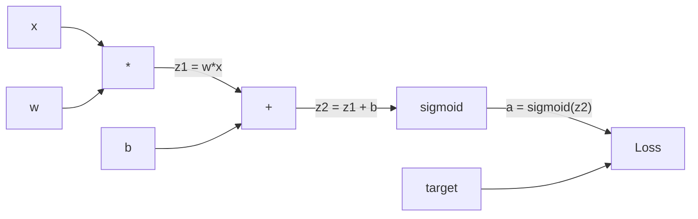
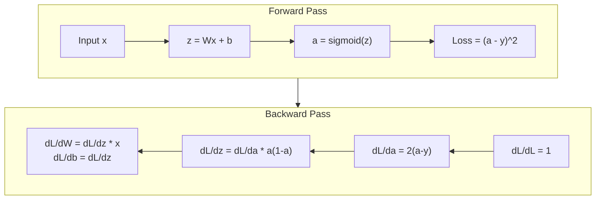
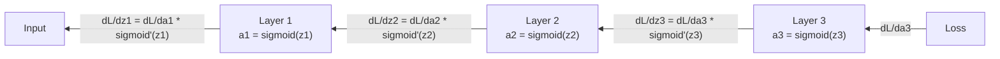

# Backpropagation từ đầu

> Backpropagation là thuật toán giúp việc học trở nên khả thi. Nếu không có nó, mạng nơ-ron chỉ là máy tạo số ngẫu nhiên đắt tiền.

**Loại:** Xây dựng
**Ngôn ngữ:** Python
**Kiến thức tiên quyết:** Bài 03.02 (Mạng nhiều lớp)
**Thời lượng:** ~120 phút

## Mục tiêu học tập

- Triển khai công cụ autograd dựa trên giá trị để xây dựng đồ thị tính toán và tính toán gradients thông qua sắp xếp tô pô
- Suy ra backward pass cộng, nhân và sigmoid bằng cách sử dụng quy tắc chuỗi
- Huấn luyện mạng nhiều lớp trên XOR và phân loại vòng tròn chỉ bằng cách sử dụng công cụ backpropagation từ đầu của bạn
- Xác định vấn đề gradient biến mất trong mạng sigmoid sâu và giải thích lý do tại sao gradients thu nhỏ theo cấp số nhân

## Vấn đề

Mạng của bạn có một lớp ẩn duy nhất với 768 đầu vào và 3072 đầu ra. Đó là 2.359.296 trọng lượng. Nó đã đưa ra một dự đoán sai. Trọng lượng nào gây ra lỗi? Kiểm tra từng quả cân riêng lẻ có nghĩa là 2,3 triệu đường chuyền về phía trước. Backpropagation tính toán tất cả 2,3 triệu gradients trong một backward pass. Đó không phải là một sự tối ưu hóa. Đó là sự khác biệt giữa có thể huấn luyện và không thể.

Cách tiếp cận ngây thơ: lấy một quả tạ, huých nó một lượng nhỏ, chạy lại forward pass, đo xem loss lên hay xuống. Điều đó cung cấp cho bạn gradient cho trọng lượng đó. Bây giờ hãy làm điều đó cho mọi trọng lượng trong mạng. Nhân với hàng nghìn bước training và hàng triệu điểm dữ liệu. Bạn sẽ cần thời gian địa chất để huấn luyện bất cứ thứ gì hữu ích.

Backpropagation giải quyết vấn đề này. Một forward pass, một backward pass, tất cả đều gradients tính toán. Bí quyết là quy tắc chuỗi từ giải tích, được áp dụng một cách có hệ thống cho đồ thị tính toán. Đây là thuật toán làm cho deep learning trở nên thực tế. Nếu không có nó, chúng ta vẫn sẽ bị mắc kẹt trong các vấn đề đồ chơi.

## Khái niệm

### Quy tắc chuỗi, áp dụng cho mạng

Bạn đã thấy quy tắc chuỗi trong Giai đoạn 01, Bài 05. Tóm tắt nhanh: nếu y = f(g(x)), thì dy/dx = f'(g(x)) * g'(x). Bạn nhân các công cụ phái sinh dọc theo chuỗi.

Trong mạng nơ-ron, "chuỗi" là chuỗi các hoạt động từ đầu vào đến loss. Mỗi lớp áp dụng trọng số, thêm thành kiến, đi qua một kích hoạt. Hàm loss so sánh đầu ra cuối cùng với mục tiêu. Backpropagation traces ngược chuỗi này, tính toán cách mỗi hoạt động góp phần gây ra lỗi.

### Đồ thị tính toán

Mỗi forward pass xây dựng một biểu đồ. Mỗi nút là một phép toán (nhân, cộng, sigmoid). Mỗi cạnh mang một giá trị về phía trước và một gradient lùi.



Forward pass: các giá trị chảy từ trái sang phải. x và w tạo ra z1 = w * x. Thêm b để nhận z2. Sigmoid kích hoạt a. So sánh a với mục tiêu y bằng hàm loss.

Backward pass: gradients chảy từ phải sang trái. Bắt đầu với dL/da (loss thay đổi như thế nào khi kích hoạt). Nhân với da/dz2 (đạo hàm sigmoid). Điều đó cho dL/dz2. Chia thành dL/db (bằng dL/dz2, vì z2 = z1 + b) và dL/dz1. thì dL/dw = dL/dz1 * x và dL/dx = dL/dz1 * w.

Mỗi nút trong biểu đồ có một công việc trong quá trình backward pass: lấy gradient đến từ phía trên, nhân với đạo hàm cục bộ của nó và truyền nó xuống.

### Tiến vs Lùi



forward pass lưu trữ mọi giá trị trung gian: z, a, đầu vào cho mỗi lớp. backward pass cần các giá trị được lưu trữ này để tính toán gradients. Đây là sự đánh đổi tính toán bộ nhớ ở trung tâm của backprop. Bạn đánh đổi bộ nhớ (lưu trữ các kích hoạt) để lấy tốc độ (một lần vượt qua thay vì hàng triệu).

### Gradient Luồng qua mạng

Đối với mạng 3 lớp, gradients chuỗi qua mọi lớp:



Ở mỗi lớp, gradient được nhân với đạo hàm sigmoid. Đạo hàm sigmoid là a * (1 - a), tối đa là 0,25 (khi a = 0,5). Sâu ba lớp, gradient đã được nhân nhiều nhất là 0,25^3 = 0,0156. Mười lớp sâu: 0,25 ^ 10 = 0,000001.

### Biến mất Gradients

Đây là vấn đề gradient biến mất. Sigmoid bóp nát đầu ra của nó trong khoảng từ 0 đến 1. Đạo hàm của nó luôn nhỏ hơn 0,25. Stack đủ các lớp sigmoid và gradients co lại thành không. Các lớp ban đầu hầu như không học được vì chúng nhận được gradients gần như bằng không.

```
sigmoid(z):     Output range [0, 1]
sigmoid'(z):    Max value 0.25 (at z = 0)

After 5 layers:   gradient * 0.25^5 = 0.001x original
After 10 layers:  gradient * 0.25^10 = 0.000001x original
```

Đây là lý do tại sao các mạng sigmoid sâu gần như không thể huấn luyện. Bản sửa lỗi -- ReLU và các biến thể của nó -- là chủ đề của Bài 04. Bây giờ, hãy hiểu rằng backprop hoạt động hoàn hảo. Vấn đề là những gì nó đang làm việc.

### Suy ra Gradients cho mạng 2 lớp

Toán học cụ thể cho mạng có đầu vào x, lớp ẩn với sigmoid, lớp đầu ra với sigmoid và MSE loss.

Forward pass:
```
z1 = W1 * x + b1
a1 = sigmoid(z1)
z2 = W2 * a1 + b2
a2 = sigmoid(z2)
L = (a2 - y)^2
```

Backward pass (áp dụng quy tắc chuỗi từng bước):
```
dL/da2 = 2(a2 - y)
da2/dz2 = a2 * (1 - a2)
dL/dz2 = dL/da2 * da2/dz2 = 2(a2 - y) * a2 * (1 - a2)

dL/dW2 = dL/dz2 * a1
dL/db2 = dL/dz2

dL/da1 = dL/dz2 * W2
da1/dz1 = a1 * (1 - a1)
dL/dz1 = dL/da1 * da1/dz1

dL/dW1 = dL/dz1 * x
dL/db1 = dL/dz1
```

Mỗi gradient là một sản phẩm của các công cụ phái sinh địa phương có nguồn gốc từ loss. Đó là tất cả những gì backpropagation là.

```figure
backprop-vanishing
```

## Tự xây dựng

### Bước 1: Nút giá trị

Mỗi số trong tính toán của chúng ta đều trở thành một Giá trị. Nó lưu trữ dữ liệu, gradient và cách nó được tạo ra (vì vậy nó biết cách tính toán gradients ngược).

```python
class Value:
    def __init__(self, data, children=(), op=''):
        self.data = data
        self.grad = 0.0
        self._backward = lambda: None
        self._children = set(children)
        self._op = op

    def __repr__(self):
        return f"Value(data={self.data:.4f}, grad={self.grad:.4f})"
```

Chưa có gradient (0.0). Chưa có chức năng lùi (no-op). `_children` theo dõi Giá trị nào đã tạo ra cái này, vì vậy chúng ta có thể sắp xếp biểu đồ về mặt tô pô sau này.

### Bước 2: Thao tác với các chức năng ngược

Mỗi thao tác tạo ra một Giá trị mới và xác định cách gradients chảy ngược qua nó.

```python
def __add__(self, other):
    other = other if isinstance(other, Value) else Value(other)
    out = Value(self.data + other.data, (self, other), '+')

    def _backward():
        self.grad += out.grad
        other.grad += out.grad

    out._backward = _backward
    return out

def __mul__(self, other):
    other = other if isinstance(other, Value) else Value(other)
    out = Value(self.data * other.data, (self, other), '*')

    def _backward():
        self.grad += other.data * out.grad
        other.grad += self.data * out.grad

    out._backward = _backward
    return out
```

Để cộng: d (a + b) / da = 1, d (a + b) / db = 1. Vì vậy, cả hai đầu vào đều nhận gradient của đầu ra trực tiếp.

Để nhân: d(a*b)/da = b, d(a*b)/db = a. Mỗi đầu vào nhận được giá trị của đầu vào khác nhân với gradient đầu ra.

Sự `+=` là rất quan trọng. Một Giá trị có thể được sử dụng trong nhiều hoạt động. gradient của nó là tổng của gradients từ tất cả các con đường.

### Bước 3: Sigmoid và Loss

```python
import math

def sigmoid(self):
    x = self.data
    x = max(-500, min(500, x))
    s = 1.0 / (1.0 + math.exp(-x))
    out = Value(s, (self,), 'sigmoid')

    def _backward():
        self.grad += (s * (1 - s)) * out.grad

    out._backward = _backward
    return out
```

Dẫn xuất sigmoid: sigmoid(x) * (1 - sigmoid(x)). Chúng ta tính toán sigmoid(x) = s trong quá trình forward pass. Tái sử dụng nó. Không cần làm thêm.

```python
def mse_loss(predicted, target):
    diff = predicted + Value(-target)
    return diff * diff
```

MSE cho một đầu ra duy nhất: (dự đoán - mục tiêu)^2. Chúng ta biểu thị phép trừ dưới dạng phép cộng với một Giá trị phủ định.

### Bước 4: Backward Pass

Sắp xếp tô pô đảm bảo chúng ta process các nút theo đúng thứ tự -- gradient của một nút được tích lũy đầy đủ trước khi chúng ta lan truyền qua nó.

```python
def backward(self):
    topo = []
    visited = set()

    def build_topo(v):
        if v not in visited:
            visited.add(v)
            for child in v._children:
                build_topo(child)
            topo.append(v)

    build_topo(self)
    self.grad = 1.0
    for v in reversed(topo):
        v._backward()
```

Bắt đầu từ loss (gradient = 1.0, vì dL/dL = 1). Đi lùi qua biểu đồ đã sắp xếp. `_backward` của mỗi nút đẩy gradients đến con của nó.

### Bước 5: Lớp và mạng

```python
import random

class Neuron:
    def __init__(self, n_inputs):
        scale = (2.0 / n_inputs) ** 0.5
        self.weights = [Value(random.uniform(-scale, scale)) for _ in range(n_inputs)]
        self.bias = Value(0.0)

    def __call__(self, x):
        act = sum((wi * xi for wi, xi in zip(self.weights, x)), self.bias)
        return act.sigmoid()

    def parameters(self):
        return self.weights + [self.bias]


class Layer:
    def __init__(self, n_inputs, n_outputs):
        self.neurons = [Neuron(n_inputs) for _ in range(n_outputs)]

    def __call__(self, x):
        out = [n(x) for n in self.neurons]
        return out[0] if len(out) == 1 else out

    def parameters(self):
        params = []
        for n in self.neurons:
            params.extend(n.parameters())
        return params


class Network:
    def __init__(self, sizes):
        self.layers = []
        for i in range(len(sizes) - 1):
            self.layers.append(Layer(sizes[i], sizes[i + 1]))

    def __call__(self, x):
        for layer in self.layers:
            x = layer(x)
            if not isinstance(x, list):
                x = [x]
        return x[0] if len(x) == 1 else x

    def parameters(self):
        params = []
        for layer in self.layers:
            params.extend(layer.parameters())
        return params

    def zero_grad(self):
        for p in self.parameters():
            p.grad = 0.0
```

Một Neuron lấy đầu vào, tính tổng trọng số + bias và áp dụng sigmoid. Cân khởi tạo trọng lượng theo sqrt (2/n_inputs) để ngăn chặn sự bão hòa sigmoid trong các mạng sâu hơn. Lớp là một danh sách các Tế bào thần kinh. Mạng là một danh sách các Lớp. Phương thức `parameters()` thu thập tất cả các Giá trị có thể học được để chúng ta có thể cập nhật chúng.

### Bước 6: Huấn luyện trên XOR

```python
random.seed(42)
net = Network([2, 4, 1])

xor_data = [
    ([0.0, 0.0], 0.0),
    ([0.0, 1.0], 1.0),
    ([1.0, 0.0], 1.0),
    ([1.0, 1.0], 0.0),
]

learning_rate = 1.0

for epoch in range(1000):
    total_loss = Value(0.0)
    for inputs, target in xor_data:
        x = [Value(i) for i in inputs]
        pred = net(x)
        loss = mse_loss(pred, target)
        total_loss = total_loss + loss

    net.zero_grad()
    total_loss.backward()

    for p in net.parameters():
        p.data -= learning_rate * p.grad

    if epoch % 100 == 0:
        print(f"Epoch {epoch:4d} | Loss: {total_loss.data:.6f}")

print("\nXOR Results:")
for inputs, target in xor_data:
    x = [Value(i) for i in inputs]
    pred = net(x)
    print(f"  {inputs} -> {pred.data:.4f} (expected {target})")
```

Xem loss giảm. Từ dự đoán ngẫu nhiên đến đầu ra XOR chính xác, được thúc đẩy hoàn toàn bởi backpropagation tính toán gradients và đẩy trọng số đi đúng hướng.

### Bước 7: Phân loại vòng tròn

Trong Bài 02, bạn đã điều chỉnh trọng lượng bằng tay để phân loại vòng tròn. Bây giờ hãy để mạng tìm hiểu chúng.

```python
random.seed(7)

def generate_circle_data(n=100):
    data = []
    for _ in range(n):
        x1 = random.uniform(-1.5, 1.5)
        x2 = random.uniform(-1.5, 1.5)
        label = 1.0 if x1 * x1 + x2 * x2 < 1.0 else 0.0
        data.append(([x1, x2], label))
    return data

circle_data = generate_circle_data(80)

circle_net = Network([2, 8, 1])
learning_rate = 0.5

for epoch in range(2000):
    random.shuffle(circle_data)
    total_loss_val = 0.0
    for inputs, target in circle_data:
        x = [Value(i) for i in inputs]
        pred = circle_net(x)
        loss = mse_loss(pred, target)
        circle_net.zero_grad()
        loss.backward()
        for p in circle_net.parameters():
            p.data -= learning_rate * p.grad
        total_loss_val += loss.data

    if epoch % 200 == 0:
        correct = 0
        for inputs, target in circle_data:
            x = [Value(i) for i in inputs]
            pred = circle_net(x)
            predicted_class = 1.0 if pred.data > 0.5 else 0.0
            if predicted_class == target:
                correct += 1
        accuracy = correct / len(circle_data) * 100
        print(f"Epoch {epoch:4d} | Loss: {total_loss_val:.4f} | Accuracy: {accuracy:.1f}%")
```

Chúng ta sử dụng SGD trực tuyến ở đây -- cập nhật trọng số sau mỗi mẫu thay vì tích lũy toàn bộ batch. Điều này phá vỡ đối xứng nhanh hơn và tránh bão hòa sigmoid trên toàn cảnh loss. Xáo trộn dữ liệu mỗi epoch ngăn mạng ghi nhớ thứ tự.

Không cần điều chỉnh bằng tay. Mạng tự khám phá ranh giới quyết định vòng tròn. Đó là sức mạnh của backpropagation: bạn xác định kiến trúc, chức năng loss và dữ liệu. Thuật toán tìm ra trọng số.

## Ứng dụng

PyTorch làm mọi thứ trên trong một vài dòng. Ý tưởng cốt lõi giống hệt nhau - autograd xây dựng một đồ thị tính toán trong quá trình forward pass và traces ngược nó để tính toán gradients.

```python
import torch
import torch.nn as nn

model = nn.Sequential(
    nn.Linear(2, 4),
    nn.Sigmoid(),
    nn.Linear(4, 1),
    nn.Sigmoid(),
)
optimizer = torch.optim.SGD(model.parameters(), lr=1.0)
criterion = nn.MSELoss()

X = torch.tensor([[0,0],[0,1],[1,0],[1,1]], dtype=torch.float32)
y = torch.tensor([[0],[1],[1],[0]], dtype=torch.float32)

for epoch in range(1000):
    pred = model(X)
    loss = criterion(pred, y)
    optimizer.zero_grad()
    loss.backward()
    optimizer.step()

print("PyTorch XOR Results:")
with torch.no_grad():
    for i in range(4):
        pred = model(X[i])
        print(f"  {X[i].tolist()} -> {pred.item():.4f} (expected {y[i].item()})")
```

`loss.backward()` là `total_loss.backward()` của bạn. `optimizer.step()` là `p.data -= lr * p.grad` hướng dẫn sử dụng của bạn. `optimizer.zero_grad()` là `net.zero_grad()` của bạn. Cùng một thuật toán, triển khai sức mạnh công nghiệp. PyTorch xử lý GPU tăng tốc, mixed precision, gradient điểm kiểm tra và hàng trăm loại lớp. Nhưng backward pass là cùng một quy tắc chuỗi được áp dụng cho cùng một đồ thị tính toán.

Training chạy forward pass, sau đó chạy backward pass, sau đó cập nhật trọng lượng. Inference chỉ chạy forward pass. Không gradients, không cập nhật. Sự khác biệt này quan trọng vì inference là những gì xảy ra trong production. Khi bạn gọi một API như Claude hoặc GPT, bạn đang chạy inference - prompt của bạn chảy về phía trước qua mạng và tokens đi ra đầu bên kia. Không thay đổi trọng lượng. Hiểu backprop quan trọng vì nó định hình mọi trọng lượng trong mạng đó.

## Sản phẩm bàn giao

Bài học này tạo ra:
- `outputs/prompt-gradient-debugger.md` - một prompt có thể tái sử dụng để chẩn đoán các vấn đề gradient (biến mất, phát nổ, NaN) trong bất kỳ mạng nơ-ron nào

## Bài tập

1. Thêm phương thức `__sub__` vào class giá trị (a - b = a + (-1 * b)). Sau đó thực hiện một phương pháp `__neg__`. Xác minh rằng các gradients là chính xác bằng cách so sánh với phép tính thủ công cho một biểu thức đơn giản như (a - b) ^ 2.

2. Thêm một phương thức `relu` vào Giá trị (đầu ra max(0, x), đạo hàm là 1 nếu x > 0, nếu không thì 0). Thay thế sigmoid bằng relu trong các layer ẩn và huấn luyện lại trên XOR. So sánh tốc độ hội tụ. Bạn sẽ thấy training nhanh hơn -- bài này xem trước Bài 04.

3. Triển khai phương pháp `__pow__` trên Giá trị cho lũy thừa số nguyên. Sử dụng nó để thay thế `mse_loss` bằng một biểu thức `(predicted - target) **2` thích hợp. Xác minh gradients khớp với cách triển khai ban đầu.

4. Thêm đoạn cắt gradient vào vòng lặp training: sau khi gọi `backward()`, hãy cắt tất cả gradients vào [-1, 1]. Huấn luyện một mạng lưới sâu hơn (4+ lớp với sigmoid) và so sánh các đường cong loss có và không có cắt. Đây là biện pháp phòng thủ đầu tiên của bạn chống lại gradients phát nổ.

5. Xây dựng hình ảnh trực quan: sau khi training trên XOR, in gradient của mọi parameter trong mạng. Xác định lớp nào có gradients nhỏ nhất. Điều này chứng minh sự biến mất của vấn đề gradient mà bạn đã đọc trong phần Khái niệm.

## Thuật ngữ chính

| Thuật ngữ | Những gì mọi người nói | Ý nghĩa thực sự của nó |
|------|----------------|----------------------|
| Backpropagation | "Mạng lưới học hỏi" | Một thuật toán tính toán dL/dw cho mọi trọng số bằng cách áp dụng quy tắc chuỗi ngược lại thông qua biểu đồ tính toán |
| Đồ thị tính toán | "Cấu trúc mạng" | Đồ thị không tuần hoàn có hướng trong đó các nút là các hoạt động và các cạnh mang các giá trị (thuận) và gradients (lùi) |
| Quy tắc chuỗi | "Nhân các đạo hàm" | Nếu y = f(g(x)), thì dy/dx = f'(g(x)) * g'(x) -- nền tảng toán học của backpropagation |
| Gradient | "Hướng đi lên dốc nhất" | Đạo hàm một phần của loss đối với một parameter - cho bạn biết làm thế nào để thay đổi parameter đó để giảm loss |
| Biến mất gradient | "Mạng sâu không học" | Gradients co lại theo cấp số nhân khi chúng lan truyền qua các lớp có kích hoạt bão hòa như sigmoid |
| Forward pass | "Chạy mạng" | Tính toán đầu ra từ đầu vào bằng cách áp dụng tuần tự các hoạt động của từng lớp và lưu trữ các giá trị trung gian |
| Backward pass | "Máy tính gradients" | Duyệt ngược biểu đồ tính toán, tích lũy gradients tại mỗi nút bằng cách sử dụng quy tắc chuỗi |
| Learning rate | "Nó học nhanh như thế nào" | Một vô hướng kiểm soát kích thước bước khi cập nhật trọng số: w_new = w_old - lr * gradient |
| Sắp xếp tô pô | "Đúng trật tự" | Thứ tự các nút đồ thị trong đó mỗi nút xuất hiện sau tất cả các nút mà nó phụ thuộc vào -- đảm bảo gradients được tích lũy đầy đủ trước khi lan truyền |
| Autograd | "Tự động phân biệt" | Một hệ thống xây dựng đồ thị tính toán trong quá trình tính toán chuyển tiếp và tự động tính toán gradients - những gì công cụ của PyTorch làm |

## Đọc thêm

- Rumelhart, Hinton & Williams, "Learning representations by back-propagating errors" (1986) - bài báo đã làm cho backpropagation mạng đa lớp trở thành xu hướng và mở khóa training
- 3Blue1Brown, loạt bài "Mạng nơ-ron" (https://www.youtube.com/playlist?list=PLZHQObOWTQDNU6R1_67000Dx_ZCJB-3pi) -- giải thích trực quan tốt nhất về backpropagation và gradient luồng qua mạng
