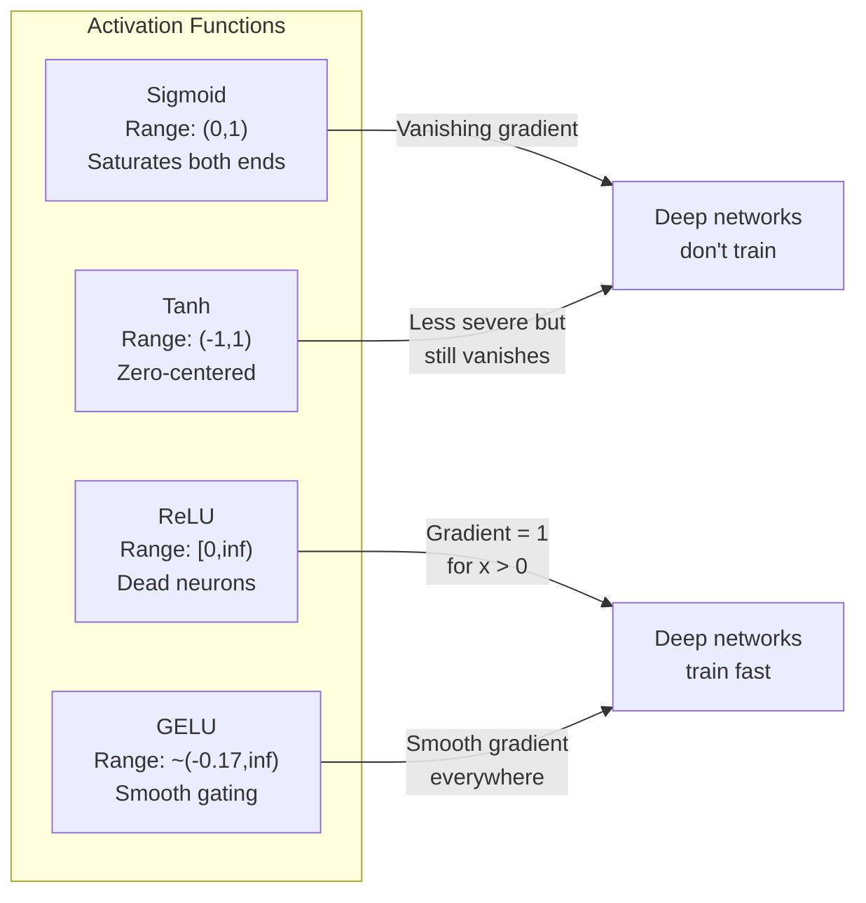
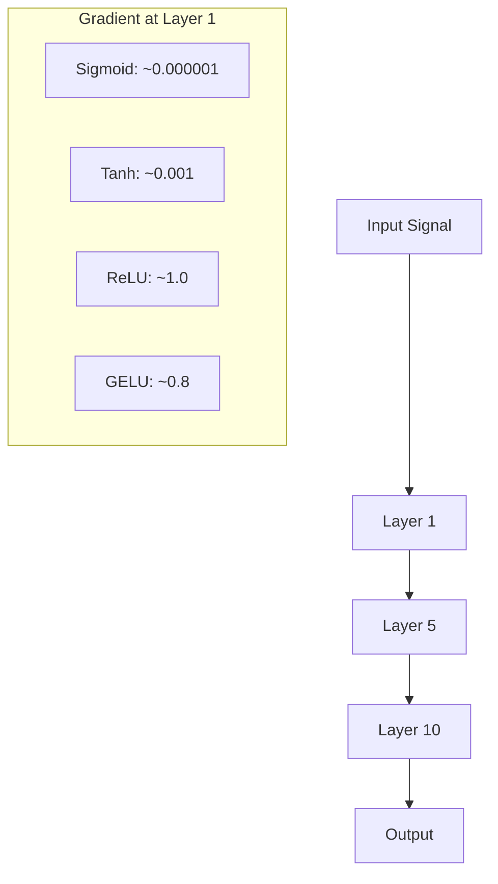
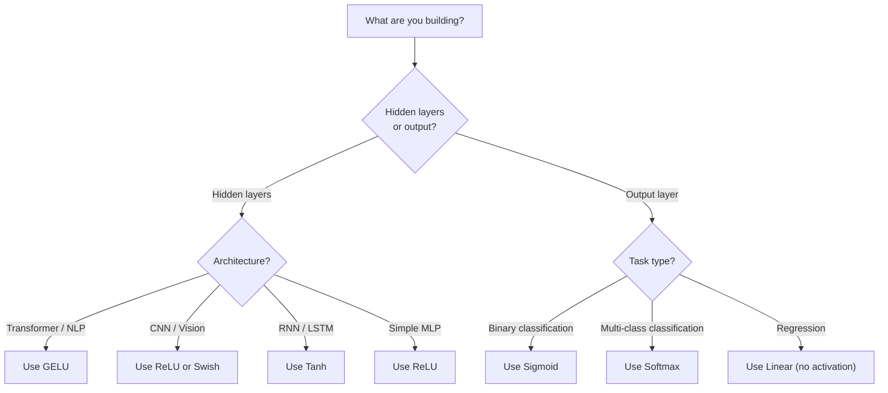

# Chức năng kích hoạt

> Nếu không có tính phi tuyến, mạng 100 lớp của bạn là một ma trận lạ mắt nhân lên. Kích hoạt là cổng cho phép mạng nơ-ron suy nghĩ theo đường cong.

**Loại:** Xây dựng
**Ngôn ngữ:** Python
**Kiến thức tiên quyết:** Bài 03.03 (Backpropagation)
**Thời lượng:** ~75 phút

## Mục tiêu học tập

- Triển khai sigmoid, tanh, ReLU, Leaky ReLU, GELU, Swish và softmax với các dẫn xuất của chúng từ đầu
- Chẩn đoán vấn đề gradient biến mất bằng cách đo cường độ kích hoạt thông qua 10+ lớp với các kích hoạt khác nhau
- Phát hiện các tế bào thần kinh chết trong mạng ReLU và giải thích lý do tại sao GELU tránh chế độ lỗi này
- Chọn chức năng kích hoạt chính xác cho một kiến trúc nhất định (transformer, CNN, RNN, lớp đầu ra)

## Vấn đề

Stack hai phép biến đổi tuyến tính: y = W2(W1x + b1) + b2. Mở rộng nó: y = W2W1x + W2b1 + b2. Đó chỉ là y = Ax + c -- một phép biến đổi tuyến tính duy nhất. Bất kể bạn stack bao nhiêu lớp tuyến tính, kết quả sẽ thu gọn thành một ma trận nhân. Mạng 100 lớp của bạn có sức mạnh đại diện tương tự như một lớp.

Đây không phải là một sự tò mò về mặt lý thuyết. Nó có nghĩa là một mạng tuyến tính sâu không thể học XOR, không thể phân loại dataset xoắn ốc, không thể nhận dạng khuôn mặt. Nếu không có chức năng kích hoạt, chiều sâu là một ảo tưởng.

Các chức năng kích hoạt phá vỡ tuyến tính. Chúng bẻ cong đầu ra của mỗi lớp thông qua một hàm phi tuyến, cung cấp cho mạng khả năng bẻ cong ranh giới quyết định, các hàm tùy ý gần đúng và thực sự học hỏi. Nhưng chọn kích hoạt sai và gradients của bạn biến mất về không (sigmoid trong mạng sâu), bùng nổ đến vô hạn (kích hoạt không giới hạn mà không cần khởi tạo cẩn thận) hoặc tế bào thần kinh của bạn chết vĩnh viễn (ReLU với thành kiến tiêu cực lớn). Việc lựa chọn chức năng kích hoạt trực tiếp xác định xem mạng của bạn có học được hay không.

## Khái niệm

### Tại sao tính phi tuyến tính là cần thiết

Phép nhân ma trận có thể kết hợp. Nhân một vector với ma trận A thì ma trận B giống với nhân với AB. Điều này có nghĩa là xếp chồng mười lớp tuyến tính tương đương về mặt toán học với một lớp tuyến tính với một ma trận lớn. Tất cả những parameters đó, tất cả chiều sâu đó - đã bị lãng phí. Bạn cần một cái gì đó để phá vỡ dây chuyền. Đó là những gì các chức năng kích hoạt làm.

Đây là bằng chứng. Một lớp tuyến tính tính f(x) = Wx + b. Stack hai:

```
Layer 1: h = W1 * x + b1
Layer 2: y = W2 * h + b2
```

Thay thế:

```
y = W2 * (W1 * x + b1) + b2
y = (W2 * W1) * x + (W2 * b1 + b2)
y = A * x + c
```

Một lớp. Chèn kích hoạt phi tuyến g() giữa các lớp:

```
h = g(W1 * x + b1)
y = W2 * h + b2
```

Bây giờ sự thay thế gặp lỗi. W2 * g(W1 * x + b1) + b2 không thể được rút gọn thành một phép biến đổi tuyến tính duy nhất. Mạng có thể đại diện cho các hàm phi tuyến. Mỗi lớp bổ sung với một kích hoạt sẽ bổ sung khả năng đại diện.

### Sigmoid

Chức năng kích hoạt ban đầu cho mạng nơ-ron.

```
sigmoid(x) = 1 / (1 + e^(-x))
```

Phạm vi đầu ra: (0, 1). Mượt mà, có thể vi phân, ánh xạ bất kỳ số thực nào với một giá trị giống như xác suất.

Phái sinh:

```
sigmoid'(x) = sigmoid(x) * (1 - sigmoid(x))
```

Giá trị lớn nhất của đạo hàm này là 0,25, xảy ra ở x = 0. Trong backpropagation, gradients nhân qua các lớp. Mười lớp sigmoid có nghĩa là gradient được nhân với tối đa 0,25 mười lần:

```
0.25^10 = 0.000000953674
```

Ít hơn một phần triệu tín hiệu ban đầu. Đây là vấn đề gradient biến mất. Gradients trong các lớp đầu trở nên nhỏ đến mức trọng lượng hầu như không cập nhật. Mạng lưới dường như học hỏi - loss giảm trong các lớp sau - nhưng các lớp đầu tiên bị đóng băng. Mạng sigmoid sâu chỉ đơn giản là không huấn luyện.

Vấn đề bổ sung: đầu ra sigmoid luôn dương (0 đến 1), có nghĩa là gradients trên trọng số luôn là cùng một dấu hiệu. Điều này gây ra hiện tượng ngoằn ngoèo trong quá trình gradient descent.

### Tín

Phiên bản trung tâm của sigmoid.

```
tanh(x) = (e^x - e^(-x)) / (e^x + e^(-x))
```

Phạm vi đầu ra: (-1, 1). Zero-centered, giúp loại bỏ vấn đề zig-zag.

Phái sinh:

```
tanh'(x) = 1 - tanh(x)^2
```

Đạo hàm tối đa là 1,0 tại x = 0 -- tốt hơn bốn lần so với sigmoid. Nhưng vấn đề gradient biến mất vẫn tồn tại. Đối với đầu vào dương hoặc âm lớn, đạo hàm tiếp cận bằng không. Mười lớp vẫn nghiền nát gradient, chỉ là ít hung hăng hơn.

### ReLU: Bước đột phá

Đơn vị tuyến tính chỉnh lưu. Được phổ biến cho deep learning bởi Nair và Hinton vào năm 2010 (chức năng này có từ năm 1969 của Fukushima), nó đã thay đổi mọi thứ.

```
relu(x) = max(0, x)
```

Phạm vi đầu ra: [0, vô cực). Đạo hàm rất đơn giản:

```
relu'(x) = 1  if x > 0
            0  if x <= 0
```

Không có gradient biến mất cho các đầu vào tích cực. gradient chính xác là 1, đi thẳng qua. Đây là lý do tại sao các mạng sâu trở nên có thể huấn luyện được - ReLU bảo toàn gradient độ lớn trên các lớp.

Nhưng có một chế độ thất bại: vấn đề tế bào thần kinh chết. Nếu đầu vào có trọng số của một tế bào thần kinh luôn âm (do bias âm lớn hoặc khởi tạo trọng lượng không may), đầu ra của nó luôn bằng không, gradient của nó luôn bằng không và nó không bao giờ cập nhật. Nó đã chết vĩnh viễn. Trong thực tế, 10-40% tế bào thần kinh trong mạng lưới ReLU có thể chết trong training.

### Rò rỉ ReLU

Cách khắc phục đơn giản nhất cho các tế bào thần kinh chết.

```
leaky_relu(x) = x        if x > 0
                alpha * x if x <= 0
```

Trong đó alpha là một hằng số nhỏ, thường là 0,01. Mặt âm có độ dốc nhỏ thay vì không, vì vậy các tế bào thần kinh chết vẫn nhận được tín hiệu gradient và có thể phục hồi.

### GELU: Mặc định hiện đại

Đơn vị tuyến tính lỗi Gaussian. Được giới thiệu bởi Hendrycks và Gimpel vào năm 2016. Kích hoạt mặc định trong BERT, GPT và hầu hết các transformers hiện đại.

```
gelu(x) = x * Phi(x)
```

Trong đó Phi(x) là hàm phân phối tích lũy của phân phối chuẩn chuẩn. Xấp xỉ được sử dụng trong thực tế:

```
gelu(x) ~= 0.5 * x * (1 + tanh(sqrt(2/pi) * (x + 0.044715 * x^3)))
```

GELU trơn ở mọi nơi, cho phép các giá trị âm nhỏ (không giống như ReLU cứng về không) và có cách giải thích xác suất: nó trọng số mỗi đầu vào theo khả năng dương của nó theo phân phối Gauss. Cổng trơn tru này vượt trội hơn ReLU trong kiến trúc transformer vì nó cung cấp luồng gradient tốt hơn và tránh hoàn toàn vấn đề tế bào thần kinh chết.

### Swish / SiLU

Kích hoạt tự kiểm soát được phát hiện bởi Ramachandran và cộng sự vào năm 2017 thông qua tìm kiếm tự động.

```
swish(x) = x * sigmoid(x)
```

Swish chính thức là x * sigmoid(x). Google đã phát hiện ra nó thông qua tìm kiếm tự động trên không gian chức năng kích hoạt - một mạng nơ-ron thiết kế các bộ phận của mạng nơ-ron.

Giống như GELU, nó mượt mà, không đơn điệu và cho phép các giá trị âm nhỏ. Sự khác biệt rất tinh tế: Swish sử dụng sigmoid để kiểm soát trong khi GELU sử dụng CDF Gaussian. Trong thực tế, hiệu suất gần như giống hệt nhau. Swish được sử dụng trong EfficientNet và một số models tầm nhìn. GELU thống trị về ngôn ngữ models.

### Softmax: Kích hoạt đầu ra

Không được sử dụng trong các lớp ẩn. Softmax chuyển đổi một vector điểm thô (logits) thành phân phối xác suất.

```
softmax(x_i) = e^(x_i) / sum(e^(x_j) for all j)
```

Mọi đầu ra đều nằm trong khoảng từ 0 đến 1. Tất cả các kết quả đầu ra có tổng là 1. Điều này làm cho nó trở thành kích hoạt cuối cùng tiêu chuẩn cho phân loại đa class. logit lớn nhất có xác suất cao nhất, nhưng không giống như argmax, softmax có thể vi phân và bảo toàn thông tin về độ tin cậy tương đối.

### So sánh các hình dạng



### So sánh Gradient Flow



### Kích hoạt nào khi



```figure
softmax-temperature
```

## Tự xây dựng

### Bước 1: Triển khai tất cả các chức năng kích hoạt với các công cụ phái sinh

Mỗi hàm nhận một float duy nhất và trả về một float. Mỗi hàm đạo hàm nhận cùng một đầu vào và trả về gradient.

```python
import math

def sigmoid(x):
    x = max(-500, min(500, x))
    return 1.0 / (1.0 + math.exp(-x))

def sigmoid_derivative(x):
    s = sigmoid(x)
    return s * (1 - s)

def tanh_act(x):
    return math.tanh(x)

def tanh_derivative(x):
    t = math.tanh(x)
    return 1 - t * t

def relu(x):
    return max(0.0, x)

def relu_derivative(x):
    return 1.0 if x > 0 else 0.0

def leaky_relu(x, alpha=0.01):
    return x if x > 0 else alpha * x

def leaky_relu_derivative(x, alpha=0.01):
    return 1.0 if x > 0 else alpha

def gelu(x):
    return 0.5 * x * (1 + math.tanh(math.sqrt(2 / math.pi) * (x + 0.044715 * x ** 3)))

def gelu_derivative(x):
    phi = 0.5 * (1 + math.erf(x / math.sqrt(2)))
    pdf = math.exp(-0.5 * x * x) / math.sqrt(2 * math.pi)
    return phi + x * pdf

def swish(x):
    return x * sigmoid(x)

def swish_derivative(x):
    s = sigmoid(x)
    return s + x * s * (1 - s)

def softmax(xs):
    max_x = max(xs)
    exps = [math.exp(x - max_x) for x in xs]
    total = sum(exps)
    return [e / total for e in exps]
```

### Bước 2: Hình dung nơi Gradients chết

Tính gradient tại 100 điểm cách đều nhau từ -5 đến 5. In biểu đồ văn bản cho biết vị trí gradient của mỗi lần kích hoạt gần bằng không.

```python
def gradient_scan(name, derivative_fn, start=-5, end=5, n=100):
    step = (end - start) / n
    near_zero = 0
    healthy = 0
    for i in range(n):
        x = start + i * step
        g = derivative_fn(x)
        if abs(g) < 0.01:
            near_zero += 1
        else:
            healthy += 1
    pct_dead = near_zero / n * 100
    print(f"{name:15s}: {healthy:3d} healthy, {near_zero:3d} near-zero ({pct_dead:.0f}% dead zone)")

gradient_scan("Sigmoid", sigmoid_derivative)
gradient_scan("Tanh", tanh_derivative)
gradient_scan("ReLU", relu_derivative)
gradient_scan("Leaky ReLU", leaky_relu_derivative)
gradient_scan("GELU", gelu_derivative)
gradient_scan("Swish", swish_derivative)
```

### Bước 3: Thí nghiệm Gradient biến mất

Chuyển tiếp tín hiệu qua N lớp bằng cách sử dụng sigmoid so với ReLU. Đo lường mức độ kích hoạt thay đổi như thế nào.

```python
import random

def vanishing_gradient_experiment(activation_fn, name, n_layers=10, n_inputs=5):
    random.seed(42)
    values = [random.gauss(0, 1) for _ in range(n_inputs)]

    print(f"\n{name} through {n_layers} layers:")
    for layer in range(n_layers):
        weights = [random.gauss(0, 1) for _ in range(n_inputs)]
        z = sum(w * v for w, v in zip(weights, values))
        activated = activation_fn(z)
        magnitude = abs(activated)
        bar = "#" * int(magnitude * 20)
        print(f"  Layer {layer+1:2d}: magnitude = {magnitude:.6f} {bar}")
        values = [activated] * n_inputs

vanishing_gradient_experiment(sigmoid, "Sigmoid")
vanishing_gradient_experiment(relu, "ReLU")
vanishing_gradient_experiment(gelu, "GELU")
```

### Bước 4: Máy dò tế bào thần kinh chết

Tạo một mạng ReLU, chuyển đầu vào ngẫu nhiên qua đó, đếm số lượng tế bào thần kinh không bao giờ kích hoạt.

```python
def dead_neuron_detector(n_inputs=5, hidden_size=20, n_samples=1000):
    random.seed(0)
    weights = [[random.gauss(0, 1) for _ in range(n_inputs)] for _ in range(hidden_size)]
    biases = [random.gauss(0, 1) for _ in range(hidden_size)]

    fire_counts = [0] * hidden_size

    for _ in range(n_samples):
        inputs = [random.gauss(0, 1) for _ in range(n_inputs)]
        for neuron_idx in range(hidden_size):
            z = sum(w * x for w, x in zip(weights[neuron_idx], inputs)) + biases[neuron_idx]
            if relu(z) > 0:
                fire_counts[neuron_idx] += 1

    dead = sum(1 for c in fire_counts if c == 0)
    rarely_fire = sum(1 for c in fire_counts if 0 < c < n_samples * 0.05)
    healthy = hidden_size - dead - rarely_fire

    print(f"\nDead Neuron Report ({hidden_size} neurons, {n_samples} samples):")
    print(f"  Dead (never fired):     {dead}")
    print(f"  Barely alive (<5%):     {rarely_fire}")
    print(f"  Healthy:                {healthy}")
    print(f"  Dead neuron rate:       {dead/hidden_size*100:.1f}%")

    for i, c in enumerate(fire_counts):
        status = "DEAD" if c == 0 else "WEAK" if c < n_samples * 0.05 else "OK"
        bar = "#" * (c * 40 // n_samples)
        print(f"  Neuron {i:2d}: {c:4d}/{n_samples} fires [{status:4s}] {bar}")

dead_neuron_detector()
```

### Bước 5: So sánh Training - Sigmoid vs ReLU vs GELU

Huấn luyện cùng một mạng hai lớp trên dataset vòng tròn (các điểm bên trong vòng tròn = class 1, bên ngoài = class 0) với ba kích hoạt khác nhau. So sánh tốc độ hội tụ.

```python
def make_circle_data(n=200, seed=42):
    random.seed(seed)
    data = []
    for _ in range(n):
        x = random.uniform(-2, 2)
        y = random.uniform(-2, 2)
        label = 1.0 if x * x + y * y < 1.5 else 0.0
        data.append(([x, y], label))
    return data


class ActivationNetwork:
    def __init__(self, activation_fn, activation_deriv, hidden_size=8, lr=0.1):
        random.seed(0)
        self.act = activation_fn
        self.act_d = activation_deriv
        self.lr = lr
        self.hidden_size = hidden_size

        self.w1 = [[random.gauss(0, 0.5) for _ in range(2)] for _ in range(hidden_size)]
        self.b1 = [0.0] * hidden_size
        self.w2 = [random.gauss(0, 0.5) for _ in range(hidden_size)]
        self.b2 = 0.0

    def forward(self, x):
        self.x = x
        self.z1 = []
        self.h = []
        for i in range(self.hidden_size):
            z = self.w1[i][0] * x[0] + self.w1[i][1] * x[1] + self.b1[i]
            self.z1.append(z)
            self.h.append(self.act(z))

        self.z2 = sum(self.w2[i] * self.h[i] for i in range(self.hidden_size)) + self.b2
        self.out = sigmoid(self.z2)
        return self.out

    def backward(self, target):
        error = self.out - target
        d_out = error * self.out * (1 - self.out)

        for i in range(self.hidden_size):
            d_h = d_out * self.w2[i] * self.act_d(self.z1[i])
            self.w2[i] -= self.lr * d_out * self.h[i]
            for j in range(2):
                self.w1[i][j] -= self.lr * d_h * self.x[j]
            self.b1[i] -= self.lr * d_h
        self.b2 -= self.lr * d_out

    def train(self, data, epochs=200):
        losses = []
        for epoch in range(epochs):
            total_loss = 0
            correct = 0
            for x, y in data:
                pred = self.forward(x)
                self.backward(y)
                total_loss += (pred - y) ** 2
                if (pred >= 0.5) == (y >= 0.5):
                    correct += 1
            avg_loss = total_loss / len(data)
            accuracy = correct / len(data) * 100
            losses.append(avg_loss)
            if epoch % 50 == 0 or epoch == epochs - 1:
                print(f"    Epoch {epoch:3d}: loss={avg_loss:.4f}, accuracy={accuracy:.1f}%")
        return losses


data = make_circle_data()

configs = [
    ("Sigmoid", sigmoid, sigmoid_derivative),
    ("ReLU", relu, relu_derivative),
    ("GELU", gelu, gelu_derivative),
]

results = {}
for name, act_fn, act_d_fn in configs:
    print(f"\n=== Training with {name} ===")
    net = ActivationNetwork(act_fn, act_d_fn, hidden_size=8, lr=0.1)
    losses = net.train(data, epochs=200)
    results[name] = losses

print("\n=== Final Loss Comparison ===")
for name, losses in results.items():
    print(f"  {name:10s}: start={losses[0]:.4f} -> end={losses[-1]:.4f} (improvement: {(1 - losses[-1]/losses[0])*100:.1f}%)")
```

## Ứng dụng

PyTorch cung cấp tất cả những điều này dưới dạng cả dạng chức năng và mô-đun:

```python
import torch
import torch.nn as nn
import torch.nn.functional as F

x = torch.randn(4, 10)

relu_out = F.relu(x)
gelu_out = F.gelu(x)
sigmoid_out = torch.sigmoid(x)
swish_out = F.silu(x)

logits = torch.randn(4, 5)
probs = F.softmax(logits, dim=1)

model = nn.Sequential(
    nn.Linear(10, 64),
    nn.GELU(),
    nn.Linear(64, 32),
    nn.GELU(),
    nn.Linear(32, 5),
)
```

Các lớp ẩn trong một transformer: GELU. Các lớp ẩn trong CNN: ReLU. Lớp đầu ra để phân loại: softmax. Lớp đầu ra để hồi quy: không có (tuyến tính). Lớp đầu ra cho xác suất: sigmoid. Đó là nó. Bắt đầu với các giá trị mặc định này. Chỉ thay đổi chúng khi bạn có bằng chứng.

RNN và LSTM sử dụng tanh cho trạng thái ẩn và sigmoid cho cổng, nhưng nếu bạn đang xây dựng từ đầu ngày hôm nay, có thể bạn không sử dụng RNN. Nếu các tế bào thần kinh đang chết trong mạng ReLU của bạn, hãy chuyển sang GELU. Đừng tìm đến Leaky ReLU trừ khi bạn có lý do cụ thể - GELU giải quyết vấn đề tế bào thần kinh chết và cho dòng chảy gradient tốt hơn.

## Sản phẩm bàn giao

Bài học này tạo ra:
- `outputs/prompt-activation-selector.md` -- một prompt có thể tái sử dụng giúp bạn chọn chức năng kích hoạt phù hợp cho bất kỳ kiến trúc nào

## Bài tập

1. Triển khai ReLU tham số (PReLU) trong đó alpha độ dốc âm là một parameter có thể học được. Huấn luyện nó trên vòng tròn dataset và so sánh với ReLU Leaky cố định.

2. Chạy thử nghiệm biến mất gradient với 50 layer thay vì 10. Biểu đồ độ lớn ở mỗi lớp cho sigmoid, tanh, ReLU và GELU. Tín hiệu của mỗi lần kích hoạt đạt đến không một cách hiệu quả ở lớp nào?

3. Triển khai ELU (Đơn vị tuyến tính hàm mũ): elu (x) = x nếu x > 0, alpha * (e ^ x - 1) nếu x < = 0. So sánh tỷ lệ tế bào thần kinh chết của nó với ReLU trên cùng một mạng.

4. Xây dựng "máy theo dõi tình trạng gradient" chạy trong training: ở mỗi epoch, tính toán cường độ gradient trung bình ở mỗi lớp. In cảnh báo khi gradient của bất kỳ lớp nào giảm xuống dưới 0,001 hoặc vượt quá 100.

5. Sửa đổi so sánh training để sử dụng dataset XOR từ Bài 01 thay vì hình tròn. Kích hoạt nào hội tụ nhanh nhất trên XOR? Tại sao điều này khác với kết quả vòng tròn?

## Thuật ngữ chính

| Thuật ngữ | Những gì mọi người nói | Ý nghĩa thực sự của nó |
|------|----------------|----------------------|
| Chức năng kích hoạt | "Phần phi tuyến" | Một hàm được áp dụng cho đầu ra của mỗi tế bào thần kinh phá vỡ tính tuyến tính, cho phép mạng học ánh xạ phi tuyến tính |
| Biến mất gradient | "Gradients biến mất trong các mạng sâu" | Gradients co lại theo cấp số nhân qua các lớp khi dẫn xuất của kích hoạt nhỏ hơn 1, khiến các lớp ban đầu không thể huấn luyện được |
| Bùng nổ gradient | "Gradients nổ tung" | Gradients phát triển theo cấp số nhân qua các lớp khi hệ số hiệu quả vượt quá 1, gây ra training không ổn định |
| Tế bào thần kinh chết | "Một tế bào thần kinh ngừng học" | Một tế bào thần kinh ReLU có đầu vào âm vĩnh viễn, tạo ra đầu ra bằng không và không gradient |
| Sigmoid | "Giảm giá trị thành 0-1" | Hàm logistic 1/(1+e^-x), quan trọng về mặt lịch sử nhưng gây ra sự biến mất gradients trong các mạng sâu |
| ReLU | "Clip âm tính về không" | max(0, x) -- kích hoạt làm cho deep learning trở nên thực tế bằng cách duy trì gradient độ lớn |
| GELU | "Kích hoạt transformer" | Đơn vị tuyến tính lỗi Gaussian, một kích hoạt trơn tru trọng số đầu vào theo xác suất dương của chúng |
| Swish/SiLU | "ReLU tự kiểm soát" | x * sigmoid(x), được phát hiện thông qua tìm kiếm tự động, được sử dụng trong EfficientNet |
| Softmax | "Biến điểm số thành xác suất" | Chuẩn hóa vector logits thành phân phối xác suất trong đó tất cả các giá trị nằm trong (0,1) và tổng bằng 1 |
| Rò rỉ ReLU | "ReLU không chết" | max (alpha * x, x) trong đó alpha nhỏ (0,01), ngăn ngừa các tế bào thần kinh chết bằng cách cho phép các gradients âm nhỏ |
| Độ bão hòa | "Phần phẳng của sigmoid" | Các khu vực mà đạo hàm của kích hoạt gần bằng không, chặn dòng chảy gradient |
| Logit | "Điểm thô trước softmax" | Đầu ra không chuẩn hóa của lớp cuối cùng trước khi áp dụng softmax hoặc sigmoid |

## Đọc thêm

- Nair & Hinton, "Các đơn vị tuyến tính chỉnh lưu cải thiện các máy Boltzmann bị hạn chế" (2010) - bài báo giới thiệu ReLU và cho phép training các mạng sâu
- Hendrycks & Gimpel, "Gaussian Error Linear Units (GELUs)" (2016) - giới thiệu chức năng kích hoạt trở thành mặc định cho transformers
- Ramachandran và cộng sự, "Tìm kiếm các chức năng kích hoạt" (2017) - đã sử dụng tìm kiếm tự động để khám phá Swish, cho thấy rằng thiết kế kích hoạt có thể được tự động hóa
- Glorot & Bengio, "Understanding the difficulty of training deep feedforward neural networks" (2010) – bài báo chẩn đoán vanishing/exploding gradients và đề xuất khởi tạo Xavier
- Goodfellow, Bengio, Courville, "Deep Learning" Chương 6.3 (https://www.deeplearningbook.org/) - xử lý nghiêm ngặt các đơn vị ẩn và các chức năng kích hoạt
