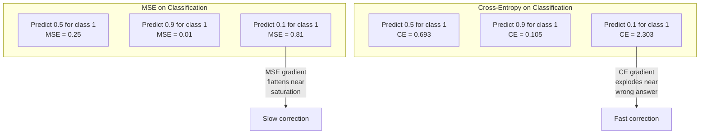
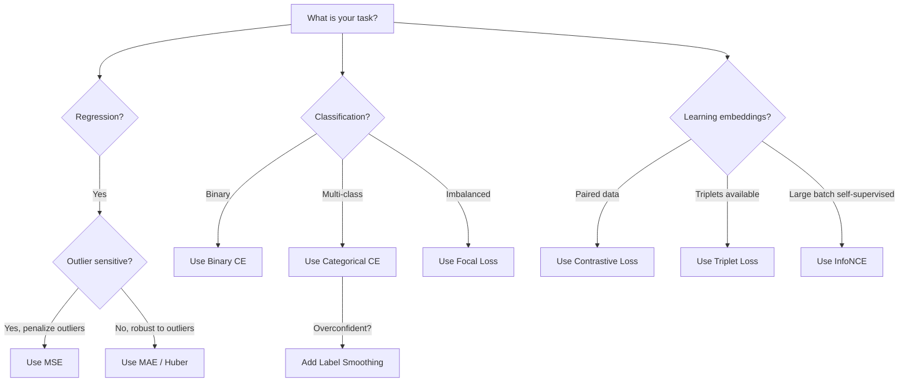
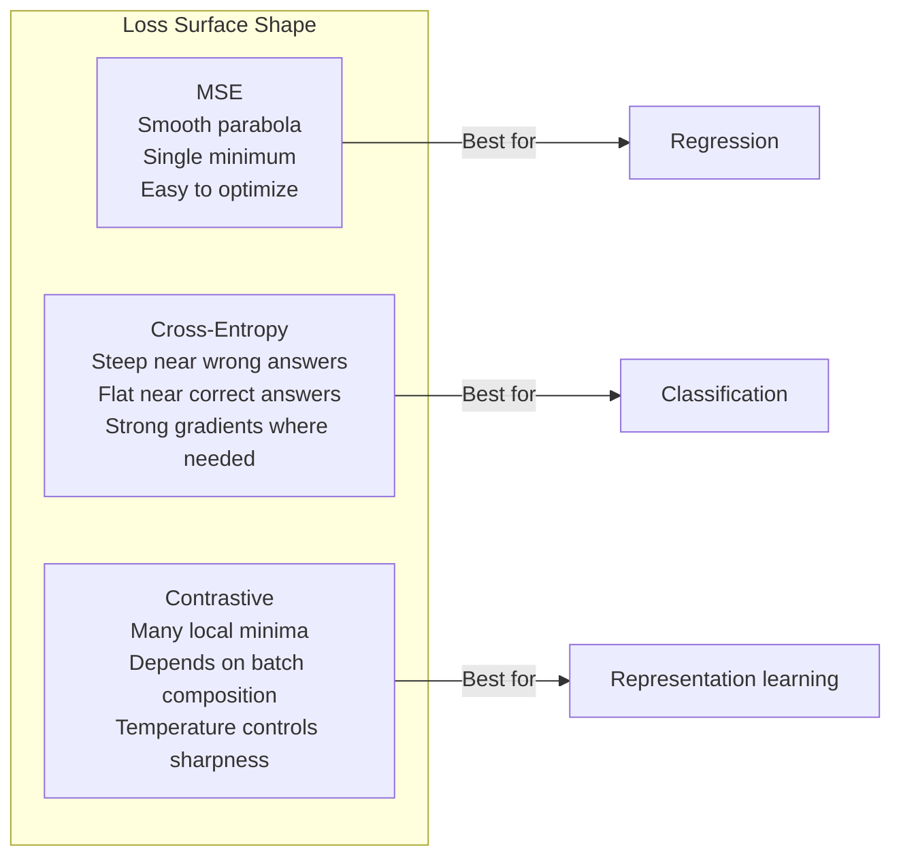

# Loss Chức năng

> Mạng của bạn đưa ra dự đoán. ground truth nói khác. Nó sai như thế nào? Con số đó là loss. Chọn sai chức năng loss và model của bạn sẽ tối ưu hóa hoàn toàn sai.

**Loại:** Xây dựng
**Ngôn ngữ:** Python
**Kiến thức tiên quyết:** Bài 03.04 (Chức năng kích hoạt)
**Thời lượng:** ~75 phút

## Mục tiêu học tập

- Triển khai MSE, entropy chéo nhị phân, entropy chéo phân loại và loss tương phản (InfoNCE) từ đầu với gradients của họ
- Giải thích lý do tại sao MSE không được phân loại bằng cách chứng minh chế độ lỗi "dự đoán 0,5 cho mọi thứ"
- Áp dụng làm mịn nhãn cho entropy chéo và mô tả cách nó ngăn chặn các dự đoán quá tự tin
- Chọn hàm loss chính xác cho hồi quy, phân loại nhị phân, phân loại đa class và embedding các nhiệm vụ học tập

## Vấn đề

Một model giảm thiểu MSE trong một bài toán phân loại sẽ tự tin dự đoán 0,5 cho mọi thứ. Đó là giảm thiểu loss. Nó cũng vô dụng.

Chức năng loss là thứ duy nhất mà model của bạn thực sự tối ưu hóa. Không accuracy. Không F1 score. Không phải bất kỳ số liệu nào bạn báo cáo cho người quản lý của mình. optimizer lấy gradient của hàm loss và điều chỉnh trọng số để làm cho con số đó nhỏ hơn. Nếu hàm loss không nắm bắt được những gì bạn quan tâm, model sẽ tìm ra cách rẻ nhất về mặt toán học để đáp ứng nó và cách đó hầu như không bao giờ là những gì bạn muốn.

Đây là một ví dụ cụ thể. Bạn có một nhiệm vụ phân loại nhị phân. Hai classes, 50/50 tách ra. Bạn sử dụng MSE làm loss của mình. model dự đoán 0,5 cho mỗi đầu vào. MSE trung bình là 0,25, đây là mức tối thiểu có thể mà không thực sự học được gì. model không có khả năng phân biệt nhưng về mặt kỹ thuật, nó đã giảm thiểu chức năng loss của bạn. Chuyển sang entropy chéo và cùng một model buộc phải đẩy các dự đoán về 0 hoặc 1, bởi vì -log (0,5) = 0,693 là một loss khủng khiếp, trong khi -log (0,99) = 0,01 thưởng cho các dự đoán chính xác tự tin. Việc lựa chọn hàm loss là sự khác biệt giữa model học và model chơi số liệu.

Nó trở nên tồi tệ hơn. Trong học tự giám sát, bạn thậm chí không có nhãn. loss tương phản xác định hoàn toàn tín hiệu học tập: điều gì được coi là giống nhau, điều gì được coi là khác biệt và mức độ khó khăn của model nên đẩy chúng ra xa nhau. Sai loss tương phản và embeddings của bạn sụp đổ vào một điểm duy nhất - mọi đầu vào ánh xạ đến cùng một vector. Về mặt kỹ thuật, không loss. Hoàn toàn vô giá trị.

## Khái niệm

### Sai số bình phương trung bình (MSE)

Mặc định cho hồi quy. Tính toán chênh lệch bình phương giữa dự đoán và mục tiêu, trung bình trên tất cả các mẫu.

```
MSE = (1/n) * sum((y_pred - y_true)^2)
```

Tại sao bình phương lại quan trọng: nó phạt các lỗi lớn bậc hai. Lỗi 2 tốn kém gấp 4 lần lỗi 1. Sai số 10 tốn 100 lần. Điều này làm cho MSE nhạy cảm với các ngoại lệ - một dự đoán cực kỳ sai lầm thống trị loss.

Con số thực: nếu model của bạn dự đoán giá nhà và giảm $10,000 on most houses but off by $200.000 trên một biệt thự, MSE sẽ tích cực cố gắng sửa chữa một biệt thự đó, có khả năng ảnh hưởng đến hiệu suất của 99 ngôi nhà còn lại.

gradient của MSE đối với một dự đoán là:

```
dMSE/dy_pred = (2/n) * (y_pred - y_true)
```

Tuyến tính trong lỗi. Lỗi lớn hơn sẽ gradients lớn hơn. Đây là một feature cho hồi quy (lỗi lớn cần sửa chữa lớn) và một lỗi để phân loại (bạn muốn phạt các câu trả lời sai tự tin theo cấp số nhân, không phải tuyến tính).

### Loss entropy chéo

Chức năng loss để phân loại. Bắt nguồn từ lý thuyết thông tin - nó đo lường sự phân kỳ giữa phân phối xác suất dự đoán và phân phối thực.

**Entropy chéo nhị phân (BCE):**

```
BCE = -(y * log(p) + (1 - y) * log(1 - p))
```

Trong đó y là nhãn thực (0 hoặc 1) và p là xác suất dự đoán.

Tại sao -log(p) hoạt động: khi nhãn thực là 1 và bạn dự đoán p = 0,99, loss là -log(0,99) = 0,01. Khi bạn dự đoán p = 0,01, loss là -log(0,01) = 4,6. Sự khác biệt 460x đó là lý do tại sao entropy chéo hoạt động. Nó trừng phạt tàn nhẫn những dự đoán sai tự tin trong khi hầu như không phạt những dự đoán đúng tự tin.

Người gradient cũng kể câu chuyện tương tự:

```
dBCE/dp = -(y/p) + (1-y)/(1-p)
```

Khi y = 1 và p gần bằng không, gradient là -1/p tiếp cận vô cực âm. model nhận được một tín hiệu rất lớn để sửa chữa sai lầm của mình. Khi p gần 1, gradient rất nhỏ. Đã đúng, không có gì để sửa.

**Entropy chéo phân loại:**

Để phân loại nhiều class với các mục tiêu được mã hóa một nóng.

```
CCE = -sum(y_i * log(p_i))
```

Chỉ có class thực mới góp phần vào loss (vì tất cả các y_i khác đều bằng không). Nếu có 10 classes và class đúng có xác suất 0,1 (đoán ngẫu nhiên), loss là -log(0,1) = 2,3. Nếu class chính xác có xác suất 0,9, loss là -log(0,9) = 0,105. model học cách tập trung khối lượng xác suất vào câu trả lời đúng.

### Tại sao MSE không được phân loại



MSE gradients phẳng khi dự đoán gần 0 hoặc 1 (do độ bão hòa sigmoid). gradients entropy chéo bù đắp cho điều này - -log hủy bỏ các vùng phẳng của sigmoid, cung cấp gradients mạnh chính xác nơi chúng cần thiết nhất.

### Làm mịn nhãn

Các nhãn hiệu một hot tiêu chuẩn nói rằng "đây là 100% class 3 và 0% mọi thứ khác." Đó là một tuyên bố mạnh mẽ. Làm mịn nhãn làm mềm nó:

```
smooth_label = (1 - alpha) * one_hot + alpha / num_classes
```

Với alpha = 0,1 và 10 classes: thay vì [0, 0, 1, 0, ...], mục tiêu trở thành [0,01, 0,01, 0,91, 0,01, ...]. model nhắm mục tiêu 0,91 thay vì 1,0.

Tại sao điều này hoạt động: một model cố gắng xuất ra chính xác 1.0 thông qua một softmax cần đẩy logits đến vô hạn. Điều này gây ra sự tự tin thái quá, làm tổn thương sự khái quát hóa và làm cho model dễ dàng để thay đổi phân phối. Làm mịn nhãn giới hạn mục tiêu ở mức 0,9 (với alpha=0,1), giữ logits trong phạm vi hợp lý. GPT và hiện đại nhất models sử dụng làm mịn nhãn hoặc tương đương.

### Loss tương phản

Không có nhãn. Không classes. Chỉ là các cặp đầu vào và câu hỏi: chúng giống hay khác nhau?

**loss tương phản kiểu SimCLR (NT-XENT / InfoNCE):**

Chụp một hình ảnh. Tạo hai chế độ xem tăng cường của nó (cắt, xoay, jitter màu). Đây là "cặp dương tính" - chúng nên có embeddings tương tự. Mọi hình ảnh khác trong batch tạo thành một "cặp âm" - chúng phải có embeddings khác nhau.

```
L = -log(exp(sim(z_i, z_j) / tau) / sum(exp(sim(z_i, z_k) / tau)))
```

Trong đó sim() là sự tương đồng cosin, z_i và z_j là cặp dương, tổng nằm trên tất cả các số âm và tau (temperature) kiểm soát mức độ sắc nét của phân phối. temperature thấp hơn = âm bản cứng hơn = tách biệt mạnh hơn.

Số thực: batch kích thước 256 có nghĩa là 255 âm trên mỗi cặp dương. Temperature tau = 0.07 (mặc định của SimCLR). loss có vẻ như là một softmax về những điểm tương đồng - nó muốn sự tương đồng của cặp dương cao nhất trong số tất cả 256 lựa chọn.

**Bộ ba Loss:**

Lấy ba đầu vào: neo, dương (cùng class), âm (class khác nhau).

```
L = max(0, d(anchor, positive) - d(anchor, negative) + margin)
```

Biên độ (thường là 0,2-1,0) thực thi khoảng cách tối thiểu giữa khoảng cách dương và âm. Nếu tiêu cực đã đủ xa, loss bằng không - không gradient, không cập nhật. Điều này làm cho training hiệu quả nhưng đòi hỏi phải khai thác bộ ba cẩn thận (chọn âm bản cứng gần neo).

### Tiêu điểm Loss

Đối với datasets mất cân bằng. Entropy chéo tiêu chuẩn đối xử với tất cả các ví dụ được phân loại chính xác như nhau. Tiêu cự loss giảm trọng lượng ví dụ dễ dàng:

```
FL = -alpha * (1 - p_t)^gamma * log(p_t)
```

Trong đó p_t là xác suất dự đoán của class thực và gamma kiểm soát tiêu điểm. Với gamma = 0, đây là entropy chéo tiêu chuẩn. Với gamma = 2 (mặc định):

- Ví dụ dễ dàng (p_t = 0,9): trọng lượng = (0,1)^2 = 0,01. Bị bỏ qua một cách hiệu quả.
- Ví dụ khó (p_t = 0,1): trọng lượng = (0,9)^2 = 0,81. Tín hiệu gradient đầy đủ.

Focal loss được giới thiệu bởi Lin và cộng sự để phát hiện đối tượng, trong đó 99% vùng ứng cử viên là nền (âm bản dễ dàng). Nếu không có loss tiêu điểm, model chìm trong các ví dụ nền dễ dàng và không bao giờ học cách phát hiện đối tượng. Với nó, model tập trung năng lực của mình vào những trường hợp khó khăn, mơ hồ quan trọng.

### Loss Cây quyết định hàm



### Loss Phong cảnh



```figure
cross-entropy-loss
```

## Tự xây dựng

### Bước 1: MSE và Gradient của nó

```python
def mse(predictions, targets):
    n = len(predictions)
    total = 0.0
    for p, t in zip(predictions, targets):
        total += (p - t) ** 2
    return total / n

def mse_gradient(predictions, targets):
    n = len(predictions)
    grads = []
    for p, t in zip(predictions, targets):
        grads.append(2.0 * (p - t) / n)
    return grads
```

### Bước 2: Entropy chéo nhị phân

Vấn đề log(0) là có thật. Nếu model dự đoán chính xác 0 cho một ví dụ dương, log(0) = vô cực âm. Cắt ngăn chặn điều này.

```python
import math

def binary_cross_entropy(predictions, targets, eps=1e-15):
    n = len(predictions)
    total = 0.0
    for p, t in zip(predictions, targets):
        p_clipped = max(eps, min(1 - eps, p))
        total += -(t * math.log(p_clipped) + (1 - t) * math.log(1 - p_clipped))
    return total / n

def bce_gradient(predictions, targets, eps=1e-15):
    grads = []
    for p, t in zip(predictions, targets):
        p_clipped = max(eps, min(1 - eps, p))
        grads.append(-(t / p_clipped) + (1 - t) / (1 - p_clipped))
    return grads
```

### Bước 3: Phân loại Cross-Entropy với Softmax

Softmax chuyển đổi logits thô thành xác suất. Sau đó, chúng tôi tính toán entropy chéo so với các mục tiêu một nóng.

```python
def softmax(logits):
    max_val = max(logits)
    exps = [math.exp(x - max_val) for x in logits]
    total = sum(exps)
    return [e / total for e in exps]

def categorical_cross_entropy(logits, target_index, eps=1e-15):
    probs = softmax(logits)
    p = max(eps, probs[target_index])
    return -math.log(p)

def cce_gradient(logits, target_index):
    probs = softmax(logits)
    grads = list(probs)
    grads[target_index] -= 1.0
    return grads
```

gradient của softmax + entropy chéo đơn giản hóa một cách đẹp mắt: nó chỉ là (xác suất dự đoán - 1) cho class thực và (xác suất dự đoán) cho tất cả các classes khác. Sự đơn giản hóa tao nhã này không phải là một sự trùng hợp ngẫu nhiên - đó là lý do tại sao softmax và entropy chéo được ghép đôi.

### Bước 4: Làm mịn nhãn

```python
def label_smoothed_cce(logits, target_index, num_classes, alpha=0.1, eps=1e-15):
    probs = softmax(logits)
    loss = 0.0
    for i in range(num_classes):
        if i == target_index:
            smooth_target = 1.0 - alpha + alpha / num_classes
        else:
            smooth_target = alpha / num_classes
        p = max(eps, probs[i])
        loss += -smooth_target * math.log(p)
    return loss
```

### Bước 5: Loss tương phản (InfoNCE đơn giản)

```python
def cosine_similarity(a, b):
    dot = sum(x * y for x, y in zip(a, b))
    norm_a = math.sqrt(sum(x * x for x in a))
    norm_b = math.sqrt(sum(x * x for x in b))
    if norm_a < 1e-10 or norm_b < 1e-10:
        return 0.0
    return dot / (norm_a * norm_b)

def contrastive_loss(anchor, positive, negatives, temperature=0.07):
    sim_pos = cosine_similarity(anchor, positive) / temperature
    sim_negs = [cosine_similarity(anchor, neg) / temperature for neg in negatives]

    max_sim = max(sim_pos, max(sim_negs)) if sim_negs else sim_pos
    exp_pos = math.exp(sim_pos - max_sim)
    exp_negs = [math.exp(s - max_sim) for s in sim_negs]
    total_exp = exp_pos + sum(exp_negs)

    return -math.log(max(1e-15, exp_pos / total_exp))
```

### Bước 6: MSE vs Cross-Entropy về phân loại

Huấn luyện cùng một mạng từ bài 04 (vòng tròn dataset) với cả hai hàm loss. Xem entropy chéo hội tụ nhanh hơn.

```python
import random

def sigmoid(x):
    x = max(-500, min(500, x))
    return 1.0 / (1.0 + math.exp(-x))

def make_circle_data(n=200, seed=42):
    random.seed(seed)
    data = []
    for _ in range(n):
        x = random.uniform(-2, 2)
        y = random.uniform(-2, 2)
        label = 1.0 if x * x + y * y < 1.5 else 0.0
        data.append(([x, y], label))
    return data


class LossComparisonNetwork:
    def __init__(self, loss_type="bce", hidden_size=8, lr=0.1):
        random.seed(0)
        self.loss_type = loss_type
        self.lr = lr
        self.hidden_size = hidden_size

        self.w1 = [[random.gauss(0, 0.5) for _ in range(2)] for _ in range(hidden_size)]
        self.b1 = [0.0] * hidden_size
        self.w2 = [random.gauss(0, 0.5) for _ in range(hidden_size)]
        self.b2 = 0.0

    def forward(self, x):
        self.x = x
        self.z1 = []
        self.h = []
        for i in range(self.hidden_size):
            z = self.w1[i][0] * x[0] + self.w1[i][1] * x[1] + self.b1[i]
            self.z1.append(z)
            self.h.append(max(0.0, z))

        self.z2 = sum(self.w2[i] * self.h[i] for i in range(self.hidden_size)) + self.b2
        self.out = sigmoid(self.z2)
        return self.out

    def backward(self, target):
        if self.loss_type == "mse":
            d_loss = 2.0 * (self.out - target)
        else:
            eps = 1e-15
            p = max(eps, min(1 - eps, self.out))
            d_loss = -(target / p) + (1 - target) / (1 - p)

        d_sigmoid = self.out * (1 - self.out)
        d_out = d_loss * d_sigmoid

        for i in range(self.hidden_size):
            d_relu = 1.0 if self.z1[i] > 0 else 0.0
            d_h = d_out * self.w2[i] * d_relu
            self.w2[i] -= self.lr * d_out * self.h[i]
            for j in range(2):
                self.w1[i][j] -= self.lr * d_h * self.x[j]
            self.b1[i] -= self.lr * d_h
        self.b2 -= self.lr * d_out

    def compute_loss(self, pred, target):
        if self.loss_type == "mse":
            return (pred - target) ** 2
        else:
            eps = 1e-15
            p = max(eps, min(1 - eps, pred))
            return -(target * math.log(p) + (1 - target) * math.log(1 - p))

    def train(self, data, epochs=200):
        losses = []
        for epoch in range(epochs):
            total_loss = 0.0
            correct = 0
            for x, y in data:
                pred = self.forward(x)
                self.backward(y)
                total_loss += self.compute_loss(pred, y)
                if (pred >= 0.5) == (y >= 0.5):
                    correct += 1
            avg_loss = total_loss / len(data)
            accuracy = correct / len(data) * 100
            losses.append((avg_loss, accuracy))
            if epoch % 50 == 0 or epoch == epochs - 1:
                print(f"    Epoch {epoch:3d}: loss={avg_loss:.4f}, accuracy={accuracy:.1f}%")
        return losses
```

## Ứng dụng

PyTorch cung cấp tất cả các chức năng loss tiêu chuẩn với độ ổn định số được tích hợp sẵn:

```python
import torch
import torch.nn as nn
import torch.nn.functional as F

predictions = torch.tensor([0.9, 0.1, 0.7], requires_grad=True)
targets = torch.tensor([1.0, 0.0, 1.0])

mse_loss = F.mse_loss(predictions, targets)
bce_loss = F.binary_cross_entropy(predictions, targets)

logits = torch.randn(4, 10)
labels = torch.tensor([3, 7, 1, 9])
ce_loss = F.cross_entropy(logits, labels)
ce_smooth = F.cross_entropy(logits, labels, label_smoothing=0.1)
```

Sử dụng `F.cross_entropy` (không `F.nll_loss` cộng với softmax thủ công). Nó kết hợp log-softmax và log-likelihood âm trong một hoạt động ổn định về số. Áp dụng softmax riêng biệt sau đó lấy log sẽ kém ổn định hơn - bạn mất precision trong phép trừ các số mũ lớn.

Đối với học tập tương phản, hầu hết các nhóm sử dụng triển khai hoặc thư viện tùy chỉnh như `lightly` hoặc `pytorch-metric-learning`. Vòng lặp cốt lõi luôn giống nhau: tính toán các điểm tương đồng theo cặp, tạo ra softmax trên tích cực và tiêu cực, lan truyền ngược.

## Sản phẩm bàn giao

Bài học này tạo ra:
- `outputs/prompt-loss-function-selector.md` - một prompt có thể tái sử dụng để chọn chức năng loss phù hợp
- `outputs/prompt-loss-debugger.md` - một prompt chẩn đoán khi đường cong loss của bạn trông sai

## Bài tập

1. Triển khai Huber loss (L1 loss mượt mà), là MSE cho các lỗi nhỏ và MAE cho các lỗi lớn. Huấn luyện mạng hồi quy dự đoán y = sin(x) với MSE vs Huber khi 5% mục tiêu training có thêm nhiễu ngẫu nhiên (ngoại lệ). So sánh lỗi kiểm tra cuối cùng.

2. Thêm tiêu loss vào vòng lặp training phân loại nhị phân. Tạo dataset mất cân bằng (90% class 0, 10% class 1). So sánh BCE tiêu chuẩn và loss tiêu điểm (gamma = 2) trên class recall thiểu số sau 200 epochs.

3. Thực hiện loss bộ ba với khai thác âm bán cứng. Tạo dữ liệu embedding 2D trong 5 classes. Đối với mỗi mỏ neo, hãy tìm tiêu cực khó nhất vẫn xa hơn tích cực (bán cứng). So sánh hội tụ với lựa chọn bộ ba ngẫu nhiên.

4. Chạy so sánh MSE và entropy chéo nhưng theo dõi độ lớn gradient ở mỗi lớp trong quá trình training. Vẽ định mức gradient trung bình mỗi epoch. Xác minh rằng entropy chéo tạo ra gradients lớn hơn vào đầu epochs khi model không chắc chắn nhất.

5. Thực hiện loss phân kỳ KL và xác minh rằng việc giảm thiểu KL(true || predicted) cho gradients tương tự như entropy chéo khi phân phối thực là một nóng. Sau đó, hãy thử các mục tiêu mềm (như kiến thức distillation) trong đó phân phối "thực" đến từ đầu ra softmax của giáo viên model.

## Thuật ngữ chính

| Thuật ngữ | Những gì mọi người nói | Ý nghĩa thực sự của nó |
|------|----------------|----------------------|
| Chức năng Loss | "Làm thế nào sai model" | Một hàm có thể vi phân ánh xạ các dự đoán và mục tiêu đến một vô hướng mà optimizer giảm thiểu |
| MSE | "Sai số bình phương trung bình" | Trung bình của chênh lệch bình phương giữa dự đoán và mục tiêu; phạt các lỗi lớn bậc hai |
| Entropy chéo | "Phân loại loss" | Đo lường sự phân kỳ giữa phân phối xác suất dự đoán và phân phối thực bằng cách sử dụng -log(p) |
| Entropy chéo nhị phân | "TCN" | Entropy chéo cho hai classes: -(y*log(p) + (1-y)*log(1-p)) |
| Làm mịn nhãn | "Làm mềm các mục tiêu" | Thay thế các mục tiêu 0/1 cứng bằng các giá trị mềm (ví dụ: 0.1/0.9) để ngăn chặn sự tự tin thái quá và cải thiện khái quát hóa |
| loss tương phản | "Kéo lại với nhau, đẩy ra" | Một loss học các biểu diễn bằng cách làm cho các cặp tương tự gần nhau và các cặp khác nhau ở xa trong không gian embedding |
| Thông tin NCE | "Người CLIP/SimCLR loss" | entropy chéo tỷ lệ temperature chuẩn hóa trên điểm tương tự; coi việc học tương phản là phân loại |
| Tiêu điểm loss | "Sửa chữa dữ liệu mất cân bằng" | Entropy chéo có trọng số (1-p_t)^gamma để giảm trọng lượng các ví dụ dễ dàng và tập trung vào những ví dụ khó |
| Bộ ba loss | "Neo-dương-tiêu cực" | Đẩy neo gần hơn với tích cực hơn tiêu cực ít nhất là một biên độ trong không gian embedding |
| Temperature | "Núm điều chỉnh độ sắc nét" | Một ước vô hướng trên logits/similarities kiểm soát mức đỉnh của phân phối kết quả; thấp hơn = sắc nét hơn |

## Đọc thêm

- Lin và cộng sự, "Tiêu Loss để phát hiện đối tượng dày đặc" (2017) - giới thiệu loss tiêu cự để xử lý các class imbalance cực cao trong phát hiện đối tượng (RetinaNet)
- Chen và cộng sự, "Một Framework đơn giản để học tương phản về biểu diễn trực quan" (SimCLR, 2020) - đã định nghĩa pipeline học tương phản hiện đại với NT-Xent loss
- Szegedy và cộng sự, "Suy nghĩ lại về kiến trúc Inception" (2016) - giới thiệu làm mịn nhãn như một kỹ thuật chính quy hóa, hiện là tiêu chuẩn trong hầu hết các models lớn
- Hinton và cộng sự, "Chắt lọc kiến thức trong mạng nơ-ron" (2015) - kiến thức distillation sử dụng các mục tiêu mềm và phân kỳ KL, nền tảng cho việc nén model
